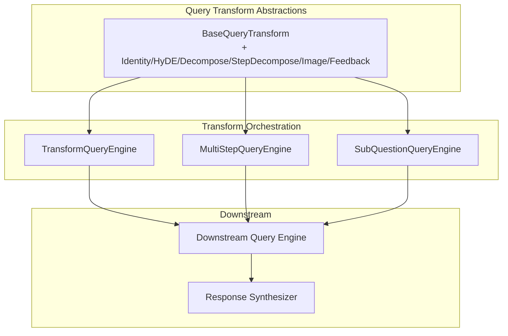
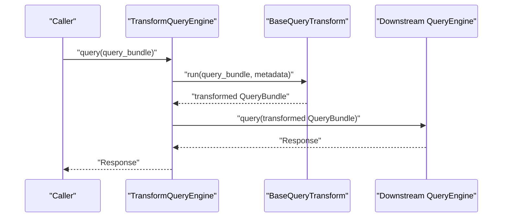
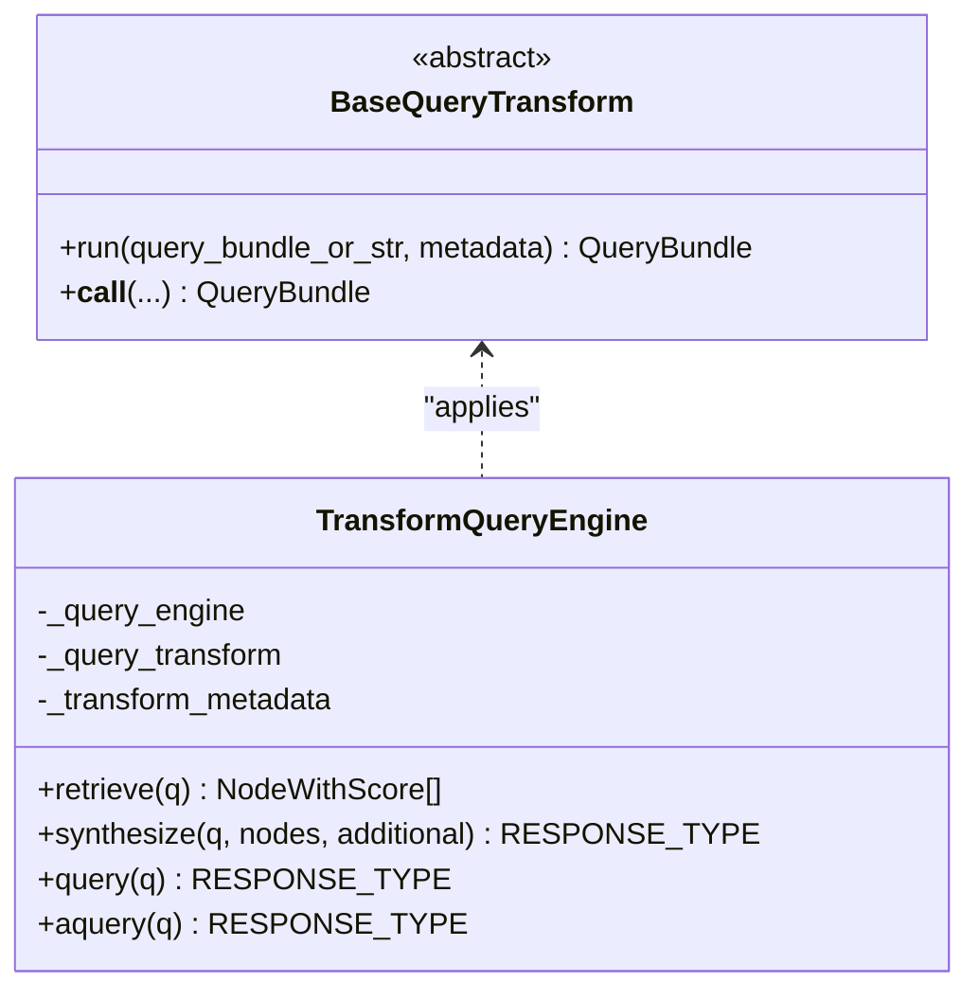
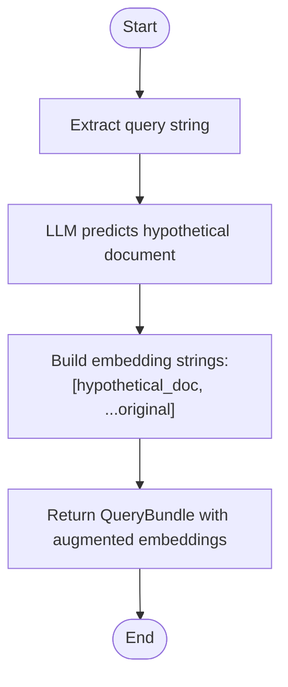
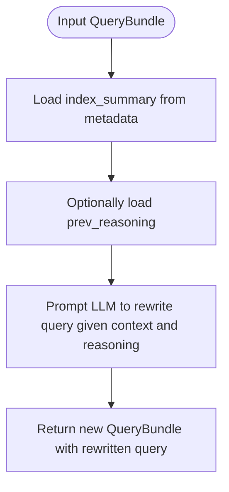
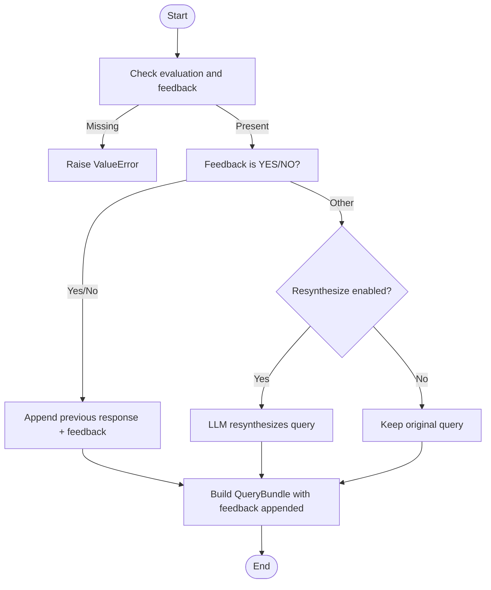
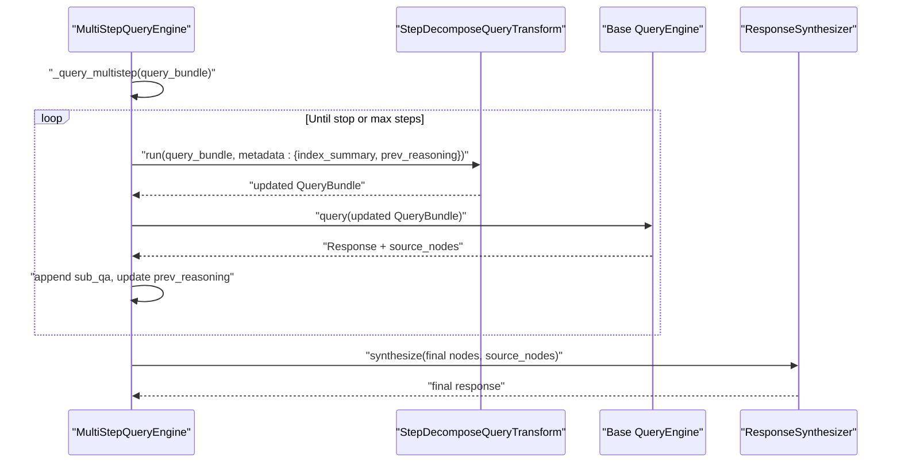
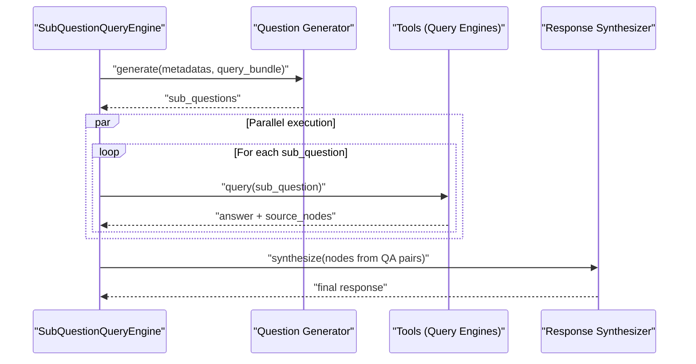
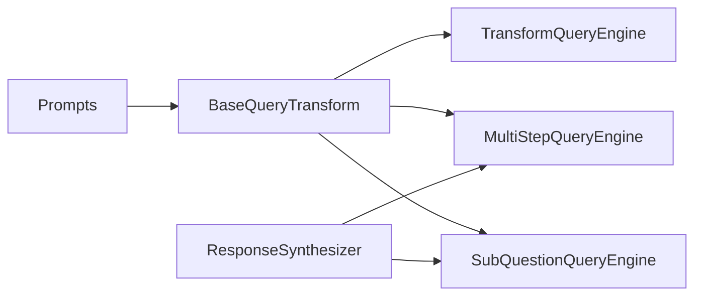

# Query Transformation

<cite>
**Referenced Files in This Document**
- [transform_query_engine.py](file://llama-index-core/llama_index/core/query_engine/transform_query_engine.py)
- [base.py](file://llama-index-core/llama_index/core/indices/query/query_transform/base.py)
- [prompts.py](file://llama-index-core/llama_index/core/indices/query/query_transform/prompts.py)
- [feedback_transform.py](file://llama-index-core/llama_index/core/indices/query/query_transform/feedback_transform.py)
- [multistep_query_engine.py](file://llama-index-core/llama_index/core/query_engine/multistep_query_engine.py)
- [sub_question_query_engine.py](file://llama-index-core/llama_index/core/query_engine/sub_question_query_engine.py)
</cite>

## Table of Contents
1. [Introduction](#introduction)
2. [Project Structure](#project-structure)
3. [Core Components](#core-components)
4. [Architecture Overview](#architecture-overview)
5. [Detailed Component Analysis](#detailed-component-analysis)
6. [Dependency Analysis](#dependency-analysis)
7. [Performance Considerations](#performance-considerations)
8. [Troubleshooting Guide](#troubleshooting-guide)
9. [Conclusion](#conclusion)

## Introduction
This document explains query transformation mechanisms in LlamaIndex, focusing on how queries are transformed prior to retrieval and synthesis. It covers HyDE transformations, query decomposition (single-step and multi-step), feedback-driven query rewriting, and the TransformQueryEngine wrapper that applies transformations consistently across retrieval and synthesis. Practical examples illustrate query rewriting, context expansion, and adaptive strategies. We also address performance implications, caching strategies, and debugging techniques for query transformation pipelines.

## Project Structure
The query transformation system centers around:
- A base abstraction for query transforms
- Built-in transforms (HyDE, decomposition, image formatting, feedback-driven)
- A wrapper engine that applies transforms before delegating to a downstream query engine
- Multi-step and sub-question engines that orchestrate iterative refinement

**Diagram sources**
- [base.py](file://llama-index-core/llama_index/core/indices/query/query_transform/base.py#L30-L322)
- [transform_query_engine.py](file://llama-index-core/llama_index/core/query_engine/transform_query_engine.py#L11-L95)
- [multistep_query_engine.py](file://llama-index-core/llama_index/core/query_engine/multistep_query_engine.py#L26-L179)
- [sub_question_query_engine.py](file://llama-index-core/llama_index/core/query_engine/sub_question_query_engine.py#L37-L279)

**Section sources**
- [base.py](file://llama-index-core/llama_index/core/indices/query/query_transform/base.py#L30-L322)
- [transform_query_engine.py](file://llama-index-core/llama_index/core/query_engine/transform_query_engine.py#L11-L95)
- [multistep_query_engine.py](file://llama-index-core/llama_index/core/query_engine/multistep_query_engine.py#L26-L179)
- [sub_question_query_engine.py](file://llama-index-core/llama_index/core/query_engine/sub_question_query_engine.py#L37-L279)

## Core Components
- BaseQueryTransform: Abstract interface for transforming a QueryBundle before retrieval/synthesis. Includes identity, HyDE, decomposition, step-wise decomposition, image formatting, and feedback-driven transforms.
- TransformQueryEngine: A thin wrapper that applies a BaseQueryTransform to a QueryBundle before delegating retrieve(), synthesize(), and query() to a downstream query engine.
- MultiStepQueryEngine: Iteratively applies StepDecomposeQueryTransform to refine a query across multiple steps, aggregating results and stopping early based on a stop function.
- SubQuestionQueryEngine: Generates sub-questions from a complex query and orchestrates answering each sub-question via tools, then synthesizes a unified response.

Key capabilities:
- HyDE: Uses an LLM to generate a hypothetical document and augments embeddings with both the original and the hypothetical text.
- Decomposition: Rewrites a query into a more retrievable form using index context and optional previous reasoning.
- Feedback-driven rewriting: Adapts queries based on evaluation feedback and optional resynthesis.

**Section sources**
- [base.py](file://llama-index-core/llama_index/core/indices/query/query_transform/base.py#L30-L322)
- [transform_query_engine.py](file://llama-index-core/llama_index/core/query_engine/transform_query_engine.py#L11-L95)
- [multistep_query_engine.py](file://llama-index-core/llama_index/core/query_engine/multistep_query_engine.py#L26-L179)
- [sub_question_query_engine.py](file://llama-index-core/llama_index/core/query_engine/sub_question_query_engine.py#L37-L279)

## Architecture Overview
The transformation pipeline applies a transform to the query bundle before invoking downstream retrieval and synthesis. For multi-step and sub-question engines, transforms are applied iteratively or per sub-question, enabling adaptive refinement.

**Diagram sources**
- [transform_query_engine.py](file://llama-index-core/llama_index/core/query_engine/transform_query_engine.py#L82-L95)
- [base.py](file://llama-index-core/llama_index/core/indices/query/query_transform/base.py#L46-L74)

## Detailed Component Analysis

### TransformQueryEngine
TransformQueryEngine wraps a downstream query engine and ensures that every query, retrieve, and synthesize operation is preceded by applying a BaseQueryTransform. It preserves the original query string while allowing the transform to modify embedding strings or the query text itself.

Practical usage:
- Wrap an existing query engine with a HyDE transform to improve retrieval quality.
- Apply a decomposition transform to rewrite queries for better index coverage.
- Use a feedback-driven transform to adapt queries after evaluation.

**Diagram sources**
- [transform_query_engine.py](file://llama-index-core/llama_index/core/query_engine/transform_query_engine.py#L11-L95)
- [base.py](file://llama-index-core/llama_index/core/indices/query/query_transform/base.py#L30-L74)

**Section sources**
- [transform_query_engine.py](file://llama-index-core/llama_index/core/query_engine/transform_query_engine.py#L11-L95)

### HyDE Transform
HyDE generates a hypothetical document conditioned on the query and augments the embedding strings with both the original and the generated text. This improves retrieval by aligning query embeddings with plausible document contents.

**Diagram sources**
- [base.py](file://llama-index-core/llama_index/core/indices/query/query_transform/base.py#L96-L151)

**Section sources**
- [base.py](file://llama-index-core/llama_index/core/indices/query/query_transform/base.py#L96-L151)

### Decomposition Transforms
Single-step decomposition rewrites a query using index context to make it more answerable from the available knowledge. Step-wise decomposition extends this by incorporating previous reasoning steps, enabling iterative refinement.

**Diagram sources**
- [base.py](file://llama-index-core/llama_index/core/indices/query/query_transform/base.py#L153-L211)
- [base.py](file://llama-index-core/llama_index/core/indices/query/query_transform/base.py#L259-L322)

**Section sources**
- [base.py](file://llama-index-core/llama_index/core/indices/query/query_transform/base.py#L153-L211)
- [base.py](file://llama-index-core/llama_index/core/indices/query/query_transform/base.py#L259-L322)

### Feedback-Driven Query Rewriting
FeedbackQueryTransformation adapts queries based on evaluation feedback. It can either append feedback to the original query or resynthesize a new query using an LLM guided by a prompt.

**Diagram sources**
- [feedback_transform.py](file://llama-index-core/llama_index/core/indices/query/query_transform/feedback_transform.py#L28-L118)

**Section sources**
- [feedback_transform.py](file://llama-index-core/llama_index/core/indices/query/query_transform/feedback_transform.py#L28-L118)

### Multi-Step Processing Workflow
MultiStepQueryEngine iteratively applies StepDecomposeQueryTransform, executes queries against a base engine, aggregates results, and stops early when a condition is met (e.g., “none” in the rewritten query).

**Diagram sources**
- [multistep_query_engine.py](file://llama-index-core/llama_index/core/query_engine/multistep_query_engine.py#L126-L179)
- [base.py](file://llama-index-core/llama_index/core/indices/query/query_transform/base.py#L259-L322)

**Section sources**
- [multistep_query_engine.py](file://llama-index-core/llama_index/core/query_engine/multistep_query_engine.py#L26-L179)

### Sub-Question Orchestration
SubQuestionQueryEngine generates multiple sub-questions from a complex query, answers them via tools, and synthesizes a unified response. This enables query rewriting at the sub-question level and parallel execution.

**Diagram sources**
- [sub_question_query_engine.py](file://llama-index-core/llama_index/core/query_engine/sub_question_query_engine.py#L134-L210)

**Section sources**
- [sub_question_query_engine.py](file://llama-index-core/llama_index/core/query_engine/sub_question_query_engine.py#L37-L279)

## Dependency Analysis
- TransformQueryEngine depends on BaseQueryTransform and a downstream BaseQueryEngine.
- MultiStepQueryEngine composes StepDecomposeQueryTransform and a response synthesizer.
- SubQuestionQueryEngine depends on a question generator, multiple tools, and a response synthesizer.
- Prompts define the templates for decomposition and image formatting.

**Diagram sources**
- [base.py](file://llama-index-core/llama_index/core/indices/query/query_transform/base.py#L30-L322)
- [prompts.py](file://llama-index-core/llama_index/core/indices/query/query_transform/prompts.py#L34-L130)
- [multistep_query_engine.py](file://llama-index-core/llama_index/core/query_engine/multistep_query_engine.py#L26-L179)
- [sub_question_query_engine.py](file://llama-index-core/llama_index/core/query_engine/sub_question_query_engine.py#L37-L279)

**Section sources**
- [base.py](file://llama-index-core/llama_index/core/indices/query/query_transform/base.py#L30-L322)
- [prompts.py](file://llama-index-core/llama_index/core/indices/query/query_transform/prompts.py#L34-L130)
- [multistep_query_engine.py](file://llama-index-core/llama_index/core/query_engine/multistep_query_engine.py#L26-L179)
- [sub_question_query_engine.py](file://llama-index-core/llama_index/core/query_engine/sub_question_query_engine.py#L37-L279)

## Performance Considerations
- LLM calls in transforms: HyDE, decomposition, and feedback transforms invoke an LLM. These are typically the dominant cost drivers. Consider batching or rate limiting when integrating with external LLM APIs.
- Embedding augmentation: HyDE increases embedding strings, which can increase downstream indexing and similarity computation costs. Limit the number of augmented strings if needed.
- Iterative refinement: MultiStepQueryEngine and sub-question engines execute multiple queries. Early stopping and step limits reduce latency but may impact accuracy.
- Caching strategies:
  - Cache LLM predictions for identical query texts to avoid repeated inference.
  - Cache transformed QueryBundles keyed by the original query string plus transform parameters.
  - Cache downstream retrieval results when the same transformed query is reused.
- Streaming and async: Prefer asynchronous execution for multi-step and sub-question workflows to overlap I/O and reduce end-to-end latency.

[No sources needed since this section provides general guidance]

## Troubleshooting Guide
- Missing evaluation in feedback transform: FeedbackQueryTransformation requires a proper Evaluation object with response and feedback. Ensure metadata contains these fields before applying the transform.
- Stop function behavior: MultiStepQueryEngine’s default stop function checks for a sentinel value in the rewritten query. Customize stop_fn if your domain requires different termination criteria.
- Verbose decomposition: Decompose and StepDecompose transforms support a verbose flag to print query changes. Enable for debugging and disable in production.
- Callback and instrumentation: TransformQueryEngine inherits instrumentation hooks. Use callback managers to trace transform and downstream engine invocations.

**Section sources**
- [feedback_transform.py](file://llama-index-core/llama_index/core/indices/query/query_transform/feedback_transform.py#L60-L94)
- [multistep_query_engine.py](file://llama-index-core/llama_index/core/query_engine/multistep_query_engine.py#L17-L24)
- [base.py](file://llama-index-core/llama_index/core/indices/query/query_transform/base.py#L170-L179)

## Conclusion
LlamaIndex provides a flexible and extensible query transformation framework. TransformQueryEngine offers a consistent way to apply transformations across retrieval and synthesis. HyDE, decomposition, and feedback-driven transforms enable adaptive query rewriting, while MultiStepQueryEngine and SubQuestionQueryEngine support iterative refinement and parallel sub-question orchestration. By tuning LLM usage, leveraging caching, and instrumenting the pipeline, teams can achieve both accuracy and performance in production systems.