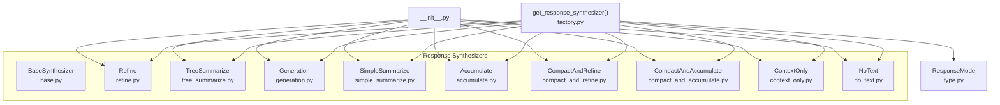
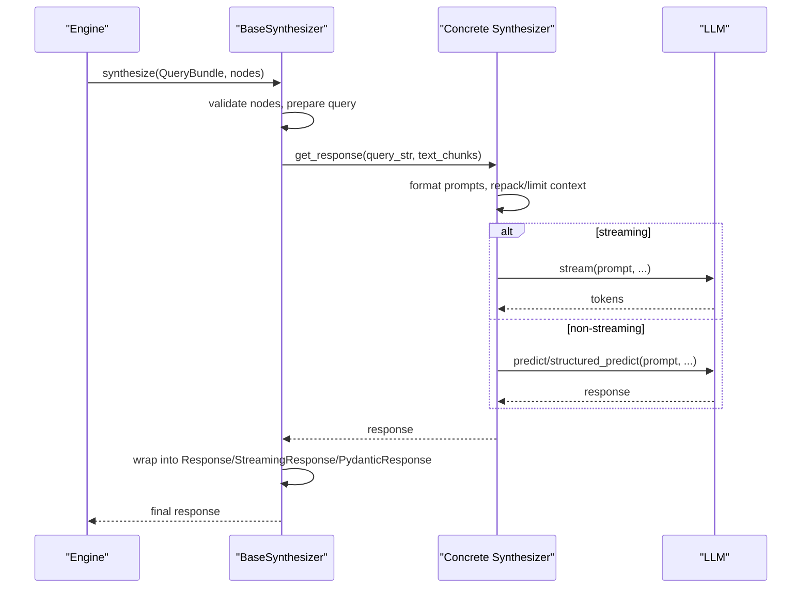
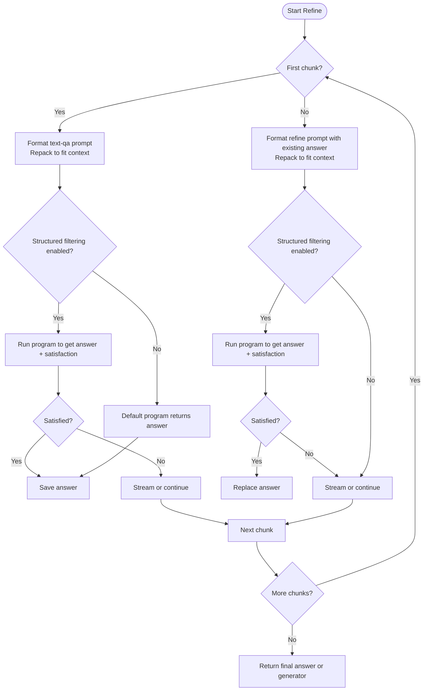
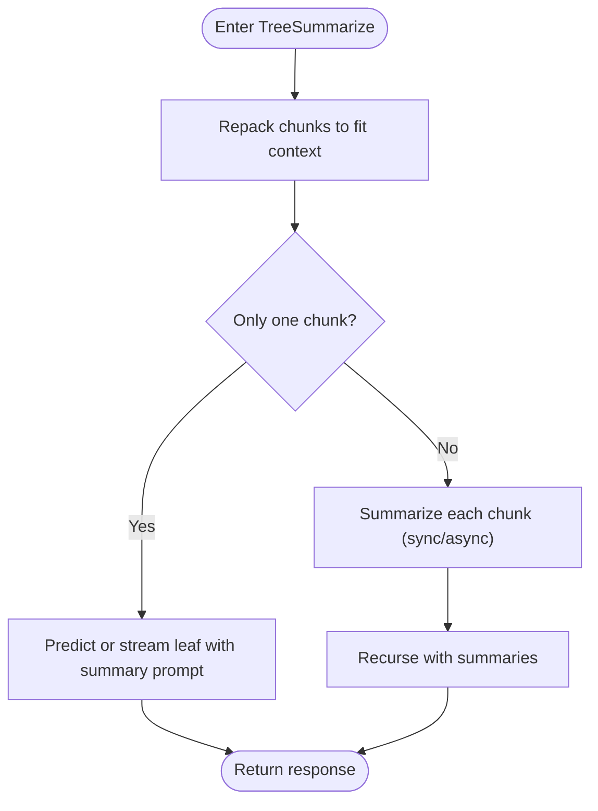
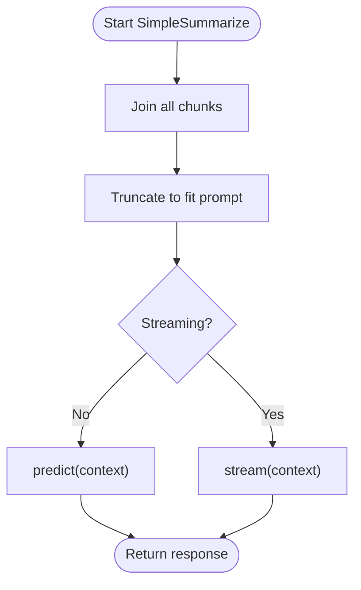
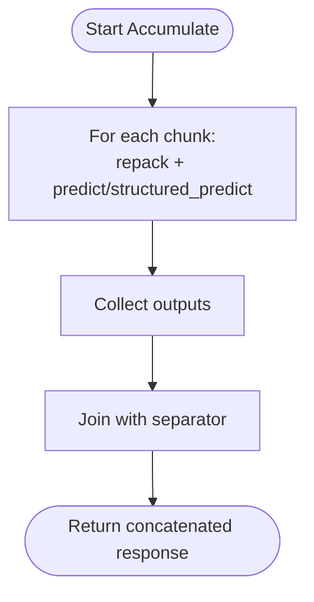
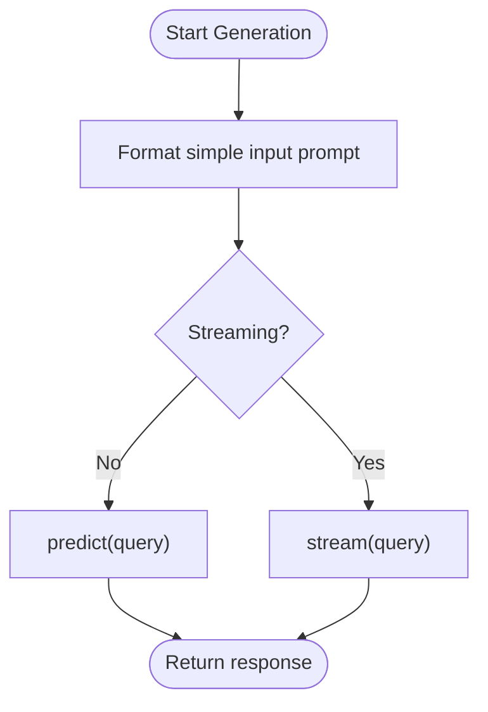
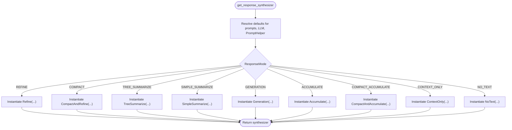
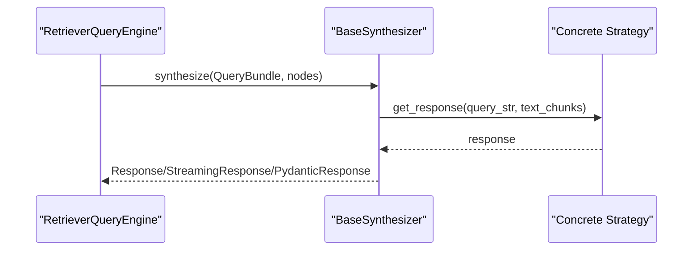
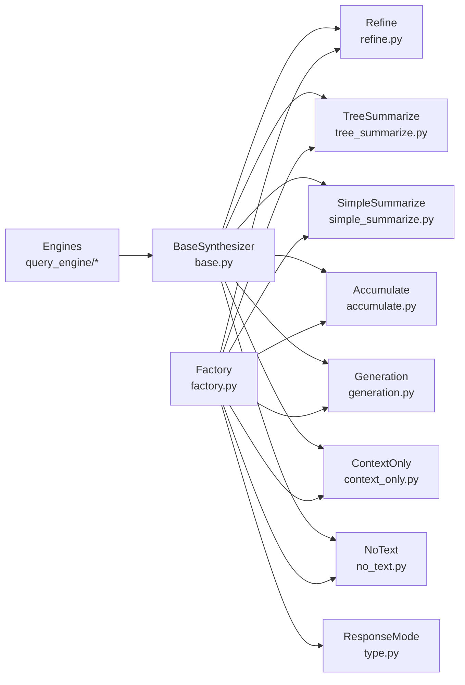

# Response Synthesis

<cite>
**Referenced Files in This Document**
- [__init__.py](file://llama-index-core/llama_index/core/response_synthesizers/__init__.py)
- [base.py](file://llama-index-core/llama_index/core/response_synthesizers/base.py)
- [factory.py](file://llama-index-core/llama_index/core/response_synthesizers/factory.py)
- [refine.py](file://llama-index-core/llama_index/core/response_synthesizers/refine.py)
- [tree_summarize.py](file://llama-index-core/llama_index/core/response_synthesizers/tree_summarize.py)
- [generation.py](file://llama-index-core/llama_index/core/response_synthesizers/generation.py)
- [simple_summarize.py](file://llama-index-core/llama_index/core/response_synthesizers/simple_summarize.py)
- [accumulate.py](file://llama-index-core/llama_index/core/response_synthesizers/accumulate.py)
- [type.py](file://llama-index-core/llama_index/core/response_synthesizers/type.py)
- [context_only.py](file://llama-index-core/llama_index/core/response_synthesizers/context_only.py)
- [no_text.py](file://llama-index-core/llama_index/core/response_synthesizers/no_text.py)
- [base_query_engine.py](file://llama-index-core/llama_index/core/base/base_query_engine.py)
- [multi_modal_context.py](file://llama-index-core/llama_index/core/chat_engine/multi_modal_context.py)
- [multi_modal_condense_plus_context.py](file://llama-index-core/llama_index/core/chat_engine/multi_modal_condense_plus_context.py)
- [utils.py](file://llama-index-core/llama_index/core/chat_engine/utils.py)
- [citation_query_engine.py](file://llama-index-core/llama_index/core/query_engine/citation_query_engine.py)
- [multi_modal.py](file://llama-index-core/llama_index/core/query_engine/multi_modal.py)
- [retriever_query_engine.py](file://llama-index-core/llama_index/core/query_engine/retriever_query_engine.py)
- [transform_query_engine.py](file://llama-index-core/llama_index/core/query_engine/transform_query_engine.py)
- [compact_and_refine.py](file://llama-index-core/llama_index/core/response_synthesizers/compact_and_refine.py)
- [compact_and_accumulate.py](file://llama-index-core/llama_index/core/response_synthesizers/compact_and_accumulate.py)
- [compact_accumulate.py](file://llama-index-core/llama_index/core/response_synthesizers/compact_accumulate.py)
</cite>

## Table of Contents
1. [Introduction](#introduction)
2. [Project Structure](#project-structure)
3. [Core Components](#core-components)
4. [Architecture Overview](#architecture-overview)
5. [Detailed Component Analysis](#detailed-component-analysis)
6. [Dependency Analysis](#dependency-analysis)
7. [Performance Considerations](#performance-considerations)
8. [Troubleshooting Guide](#troubleshooting-guide)
9. [Conclusion](#conclusion)
10. [Appendices](#appendices)

## Introduction
This document explains response synthesis strategies that generate final answers from retrieved context. It covers synthesis approaches such as refine, tree summarize, generation, simple summarize, accumulate, compact-and-refine, and compact-and-accumulate. It documents the response synthesizer factory, configuration options, synthesis prompts, context formatting, and response quality optimization. Practical examples show how to implement custom synthesis strategies, optimize performance, handle edge cases, and extend synthesis to multi-modal scenarios. Guidance is also provided for debugging synthesis issues and improving response coherence.

## Project Structure
The response synthesis module is organized around a shared base class and multiple concrete strategies. A factory constructs synthesizers based on a ResponseMode selection. Supporting modules provide prompts, context packing helpers, and integration points across engines.

**Diagram sources**
- [__init__.py](file://llama-index-core/llama_index/core/response_synthesizers/__init__.py#L1-L26)
- [base.py](file://llama-index-core/llama_index/core/response_synthesizers/base.py#L52-L322)
- [factory.py](file://llama-index-core/llama_index/core/response_synthesizers/factory.py#L33-L152)
- [refine.py](file://llama-index-core/llama_index/core/response_synthesizers/refine.py#L108-L522)
- [tree_summarize.py](file://llama-index-core/llama_index/core/response_synthesizers/tree_summarize.py#L17-L231)
- [generation.py](file://llama-index-core/llama_index/core/response_synthesizers/generation.py#L29-L189)
- [simple_summarize.py](file://llama-index-core/llama_index/core/response_synthesizers/simple_summarize.py#L15-L110)
- [accumulate.py](file://llama-index-core/llama_index/core/response_synthesizers/accumulate.py#L18-L152)
- [compact_and_refine.py](file://llama-index-core/llama_index/core/response_synthesizers/compact_and_refine.py)
- [compact_and_accumulate.py](file://llama-index-core/llama_index/core/response_synthesizers/compact_and_accumulate.py)
- [compact_accumulate.py](file://llama-index-core/llama_index/core/response_synthesizers/compact_accumulate.py)
- [type.py](file://llama-index-core/llama_index/core/response_synthesizers/type.py#L4-L58)

**Section sources**
- [__init__.py](file://llama-index-core/llama_index/core/response_synthesizers/__init__.py#L1-L26)
- [factory.py](file://llama-index-core/llama_index/core/response_synthesizers/factory.py#L33-L152)
- [type.py](file://llama-index-core/llama_index/core/response_synthesizers/type.py#L4-L58)

## Core Components
- BaseSynthesizer: Defines the abstract interface and shared orchestration for synthesis, including synchronous/asynchronous entry points, streaming support, structured output handling, and metadata aggregation.
- Concrete strategies: Implement distinct synthesis logic (e.g., iterative refinement, tree-based summarization, single-pass summarization, accumulation, generation).
- Factory: Produces a synthesizer instance based on ResponseMode and configuration (prompts, streaming, structured output, async behavior).
- ResponseMode: Enumerates supported synthesis strategies.

Key capabilities:
- Context formatting via PromptHelper (packing/truncating to fit model context windows).
- Structured output via StructuredLLM and optional output classes.
- Streaming responses for compatible strategies.
- Integration with engines via unified synthesize/asynthesize entry points.

**Section sources**
- [base.py](file://llama-index-core/llama_index/core/response_synthesizers/base.py#L52-L322)
- [factory.py](file://llama-index-core/llama_index/core/response_synthesizers/factory.py#L33-L152)
- [type.py](file://llama-index-core/llama_index/core/response_synthesizers/type.py#L4-L58)

## Architecture Overview
The synthesis pipeline follows a consistent pattern:
- Engines call synthesize/asynthesize with a QueryBundle and a list of NodeWithScore.
- BaseSynthesizer converts nodes to text using MetadataMode.LLM, dispatches instrumentation events, and delegates to strategy-specific get_response/aget_response.
- Strategies apply prompts, pack/truncate context, and produce either a string, a generator, or a structured model.

**Diagram sources**
- [base.py](file://llama-index-core/llama_index/core/response_synthesizers/base.py#L192-L322)
- [refine.py](file://llama-index-core/llama_index/core/response_synthesizers/refine.py#L162-L384)
- [tree_summarize.py](file://llama-index-core/llama_index/core/response_synthesizers/tree_summarize.py#L134-L231)
- [simple_summarize.py](file://llama-index-core/llama_index/core/response_synthesizers/simple_summarize.py#L76-L110)
- [accumulate.py](file://llama-index-core/llama_index/core/response_synthesizers/accumulate.py#L85-L152)
- [generation.py](file://llama-index-core/llama_index/core/response_synthesizers/generation.py#L77-L97)

## Detailed Component Analysis

### Refine Strategy
Refine iteratively improves an answer by applying a “first answer” prompt on the first chunk, then a “refine” prompt on subsequent chunks using the current answer and the new context. It supports:
- Structured answer filtering via a program factory returning a structured response model.
- Streaming (without structured filtering).
- Prompt packing to respect context limits.

**Diagram sources**
- [refine.py](file://llama-index-core/llama_index/core/response_synthesizers/refine.py#L162-L384)

**Section sources**
- [refine.py](file://llama-index-core/llama_index/core/response_synthesizers/refine.py#L108-L522)

### Tree Summarize Strategy
TreeSummarize builds a binary tree bottom-up:
- Repack chunks to fill the context window.
- If only one chunk remains, generate the final response.
- Otherwise, summarize each chunk and recurse with summaries.

It supports:
- Synchronous and asynchronous recursion.
- Structured output via structured_predict.
- Streaming on the leaf call.

**Diagram sources**
- [tree_summarize.py](file://llama-index-core/llama_index/core/response_synthesizers/tree_summarize.py#L61-L132)

**Section sources**
- [tree_summarize.py](file://llama-index-core/llama_index/core/response_synthesizers/tree_summarize.py#L17-L231)

### Simple Summarize Strategy
Merges all chunks into a single context and predicts once. It truncates to fit the prompt’s context window and supports streaming.

**Diagram sources**
- [simple_summarize.py](file://llama-index-core/llama_index/core/response_synthesizers/simple_summarize.py#L76-L110)

**Section sources**
- [simple_summarize.py](file://llama-index-core/llama_index/core/response_synthesizers/simple_summarize.py#L15-L110)

### Accumulate Strategy
Applies the same prompt to each chunk independently, collects responses, and concatenates them with separators. It does not refine iteratively.

**Diagram sources**
- [accumulate.py](file://llama-index-core/llama_index/core/response_synthesizers/accumulate.py#L85-L152)

**Section sources**
- [accumulate.py](file://llama-index-core/llama_index/core/response_synthesizers/accumulate.py#L18-L152)

### Generation Strategy
Ignores context and generates a response directly from the query using a simple input prompt. Useful for standalone generation without retrieval context.

**Diagram sources**
- [generation.py](file://llama-index-core/llama_index/core/response_synthesizers/generation.py#L77-L97)

**Section sources**
- [generation.py](file://llama-index-core/llama_index/core/response_synthesizers/generation.py#L29-L189)

### Context-Only and No-Text Strategies
- ContextOnly: Returns a concatenated string of all text chunks without synthesis.
- NoText: Returns an empty string.

These are useful for debugging, citation-only workflows, or when downstream components handle synthesis.

**Section sources**
- [context_only.py](file://llama-index-core/llama_index/core/response_synthesizers/context_only.py#L8-L31)
- [no_text.py](file://llama-index-core/llama_index/core/response_synthesizers/no_text.py#L8-L31)

### Response Synthesizer Factory
The factory constructs a synthesizer based on ResponseMode and configuration:
- Selects appropriate prompt templates (text-qa, refine, summary, simple).
- Applies defaults from Settings and PromptHelper.
- Supports streaming, structured output, async behavior, and program factories for structured filtering.

**Diagram sources**
- [factory.py](file://llama-index-core/llama_index/core/response_synthesizers/factory.py#L33-L152)

**Section sources**
- [factory.py](file://llama-index-core/llama_index/core/response_synthesizers/factory.py#L33-L152)

### Integration Points Across Engines
Engines call the unified synthesize/asynthesize method, which:
- Converts query to QueryBundle if needed.
- Extracts node content using MetadataMode.LLM.
- Delegates to the selected strategy.
- Wraps results into Response, StreamingResponse, or PydanticResponse.

**Diagram sources**
- [base_query_engine.py](file://llama-index-core/llama_index/core/base/base_query_engine.py#L66-L76)
- [retriever_query_engine.py](file://llama-index-core/llama_index/core/query_engine/retriever_query_engine.py#L165-L177)
- [transform_query_engine.py](file://llama-index-core/llama_index/core/query_engine/transform_query_engine.py#L51-L66)
- [citation_query_engine.py](file://llama-index-core/llama_index/core/query_engine/citation_query_engine.py#L256-L269)
- [multi_modal.py](file://llama-index-core/llama_index/core/query_engine/multi_modal.py#L110-L169)
- [multi_modal_context.py](file://llama-index-core/llama_index/core/chat_engine/multi_modal_context.py#L157-L213)
- [multi_modal_condense_plus_context.py](file://llama-index-core/llama_index/core/chat_engine/multi_modal_condense_plus_context.py#L236-L292)
- [utils.py](file://llama-index-core/llama_index/core/chat_engine/utils.py#L31)

**Section sources**
- [base_query_engine.py](file://llama-index-core/llama_index/core/base/base_query_engine.py#L66-L76)
- [retriever_query_engine.py](file://llama-index-core/llama_index/core/query_engine/retriever_query_engine.py#L165-L177)
- [transform_query_engine.py](file://llama-index-core/llama_index/core/query_engine/transform_query_engine.py#L51-L66)
- [citation_query_engine.py](file://llama-index-core/llama_index/core/query_engine/citation_query_engine.py#L256-L269)
- [multi_modal.py](file://llama-index-core/llama_index/core/query_engine/multi_modal.py#L110-L169)
- [multi_modal_context.py](file://llama-index-core/llama_index/core/chat_engine/multi_modal_context.py#L157-L213)
- [multi_modal_condense_plus_context.py](file://llama-index-core/llama_index/core/chat_engine/multi_modal_condense_plus_context.py#L236-L292)
- [utils.py](file://llama-index-core/llama_index/core/chat_engine/utils.py#L31)

## Dependency Analysis
- BaseSynthesizer depends on LLM, CallbackManager, PromptHelper, and instrumentation.
- Strategies depend on BaseSynthesizer and use PromptHelper for repacking/truncating.
- Factory depends on ResponseMode and prompt selectors to instantiate strategies.
- Engines depend on BaseSynthesizer’s synthesize/asynthesize contract.

**Diagram sources**
- [base.py](file://llama-index-core/llama_index/core/response_synthesizers/base.py#L52-L322)
- [factory.py](file://llama-index-core/llama_index/core/response_synthesizers/factory.py#L33-L152)
- [type.py](file://llama-index-core/llama_index/core/response_synthesizers/type.py#L4-L58)

**Section sources**
- [base.py](file://llama-index-core/llama_index/core/response_synthesizers/base.py#L52-L322)
- [factory.py](file://llama-index-core/llama_index/core/response_synthesizers/factory.py#L33-L152)

## Performance Considerations
- Minimize LLM calls:
  - Prefer compact modes (compact-and-refine, compact-and-accumulate) to reduce calls.
  - Use tree summarize with async gathering for parallel summarization.
- Control context size:
  - Use PromptHelper repack/truncate to avoid exceeding model context windows.
- Streaming:
  - Enable streaming for refine and tree summarize leaf calls to reduce latency.
- Structured output:
  - Use structured_predict only when necessary; it adds overhead and restricts streaming in refine.
- Asynchronous execution:
  - Use use_async in TreeSummarize and CompactAndAccumulate to parallelize predictions.

[No sources needed since this section provides general guidance]

## Troubleshooting Guide
Common issues and resolutions:
- Empty or placeholder responses:
  - BaseSynthesizer returns a default empty response when no nodes are provided; ensure retrieval yields results.
- Validation errors in structured programs:
  - Refine’s structured filtering may raise validation errors; disable structured filtering or adjust output schema.
- Streaming conflicts:
  - Refine does not support streaming with structured answer filtering; choose non-streaming or disable structured filtering.
  - Accumulate does not support streaming; remove streaming flag.
- Context overflow:
  - If refine templates become too large, repack logic may return the existing answer unchanged; reduce prompt sizes or increase chunk size limits.
- Incorrect response type:
  - BaseSynthesizer validates that responses are strings or generators; ensure strategy returns the expected type.

**Section sources**
- [base.py](file://llama-index-core/llama_index/core/response_synthesizers/base.py#L206-L226)
- [refine.py](file://llama-index-core/llama_index/core/response_synthesizers/refine.py#L138-L146)
- [accumulate.py](file://llama-index-core/llama_index/core/response_synthesizers/accumulate.py#L93-L94)
- [refine.py](file://llama-index-core/llama_index/core/response_synthesizers/refine.py#L304-L307)

## Conclusion
Response synthesis offers multiple strategies to transform retrieved context into coherent answers. Choose refine for iterative improvement, tree summarize for hierarchical summarization, simple summarize for single-shot synthesis, accumulate for per-chunk synthesis, and generation for standalone generation. The factory centralizes configuration, while BaseSynthesizer ensures consistent orchestration, streaming, and structured output. Proper prompt sizing, async execution, and structured filtering enable robust, high-performance synthesis across diverse use cases.

[No sources needed since this section summarizes without analyzing specific files]

## Appendices

### Synthesis Configuration Options
- ResponseMode: Select the synthesis strategy.
- LLM: Language model instance or default from Settings.
- PromptHelper: Context packing/truncation helper or default from Settings.
- Prompts:
  - text_qa_template: Initial QA prompt for refine/simple_summarize.
  - refine_template: Iterative refinement prompt for refine.
  - summary_template: Summarization prompt for tree summarize.
  - simple_template: Input prompt for generation.
- Streaming: Enable streaming responses.
- Structured output: Provide output_cls for structured responses.
- Program factory: Custom program factory for structured filtering in refine.
- Async behavior: use_async for parallelism in tree summarize and compact-and-accumulate.

**Section sources**
- [factory.py](file://llama-index-core/llama_index/core/response_synthesizers/factory.py#L33-L152)
- [refine.py](file://llama-index-core/llama_index/core/response_synthesizers/refine.py#L111-L146)
- [tree_summarize.py](file://llama-index-core/llama_index/core/response_synthesizers/tree_summarize.py#L30-L50)
- [simple_summarize.py](file://llama-index-core/llama_index/core/response_synthesizers/simple_summarize.py#L15-L31)
- [accumulate.py](file://llama-index-core/llama_index/core/response_synthesizers/accumulate.py#L18-L40)
- [generation.py](file://llama-index-core/llama_index/core/response_synthesizers/generation.py#L29-L44)

### Practical Examples

- Implement a custom synthesis strategy:
  - Subclass BaseSynthesizer and implement get_response/aget_response.
  - Register the strategy in the factory under a new ResponseMode branch.
  - Example paths:
    - [base.py](file://llama-index-core/llama_index/core/response_synthesizers/base.py#L52-L126)
    - [factory.py](file://llama-index-core/llama_index/core/response_synthesizers/factory.py#L33-L152)

- Optimize synthesis performance:
  - Use compact-and-refine or compact-and-accumulate to reduce LLM calls.
  - Enable use_async in tree summarize and compact-and-accumulate.
  - Use streaming for leaf calls in tree summarize.
  - Example paths:
    - [tree_summarize.py](file://llama-index-core/llama_index/core/response_synthesizers/tree_summarize.py#L61-L132)
    - [accumulate.py](file://llama-index-core/llama_index/core/response_synthesizers/accumulate.py#L62-L108)

- Handle edge cases:
  - Zero nodes: BaseSynthesizer returns an empty response; ensure retrieval is configured.
  - Streaming restrictions: Accumulate and refine+structured filtering cannot stream.
  - Validation errors: Adjust output schema or disable structured filtering.
  - Example paths:
    - [base.py](file://llama-index-core/llama_index/core/response_synthesizers/base.py#L206-L226)
    - [refine.py](file://llama-index-core/llama_index/core/response_synthesizers/refine.py#L138-L146)
    - [accumulate.py](file://llama-index-core/llama_index/core/response_synthesizers/accumulate.py#L93-L94)

- Multi-modal synthesis:
  - Use multi_modal.py and multi_modal_context.py to integrate images/audio alongside text.
  - Example paths:
    - [multi_modal.py](file://llama-index-core/llama_index/core/query_engine/multi_modal.py#L110-L169)
    - [multi_modal_context.py](file://llama-index-core/llama_index/core/chat_engine/multi_modal_context.py#L157-L213)

- Debugging synthesis issues:
  - Inspect formatted prompts and responses via BaseSynthesizer’s logging helper.
  - Verify node content extraction using MetadataMode.LLM.
  - Example paths:
    - [base.py](file://llama-index-core/llama_index/core/response_synthesizers/base.py#L128-L136)
    - [base.py](file://llama-index-core/llama_index/core/response_synthesizers/base.py#L237-L241)