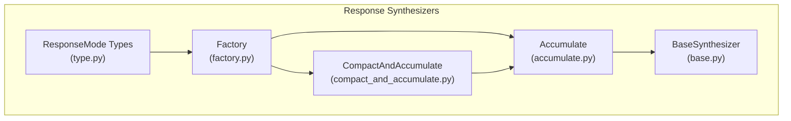
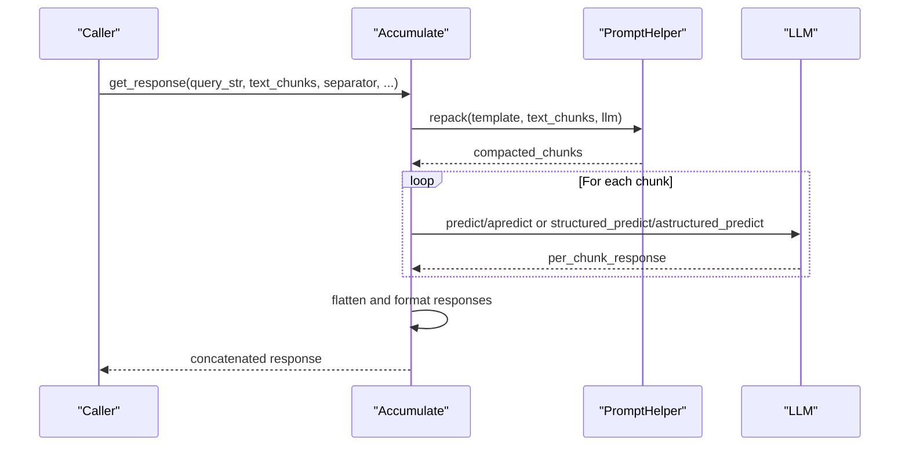
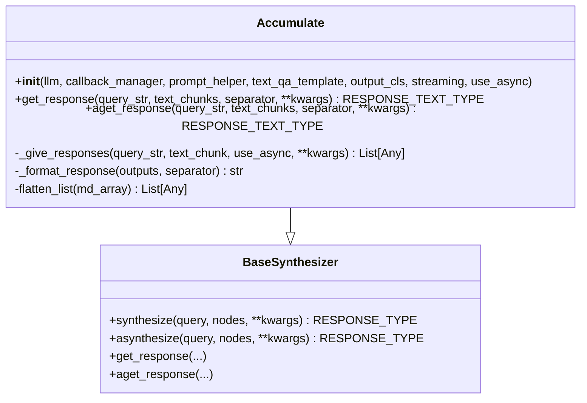
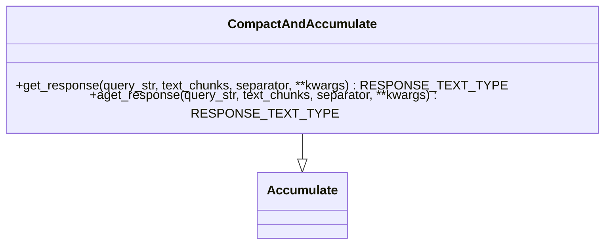
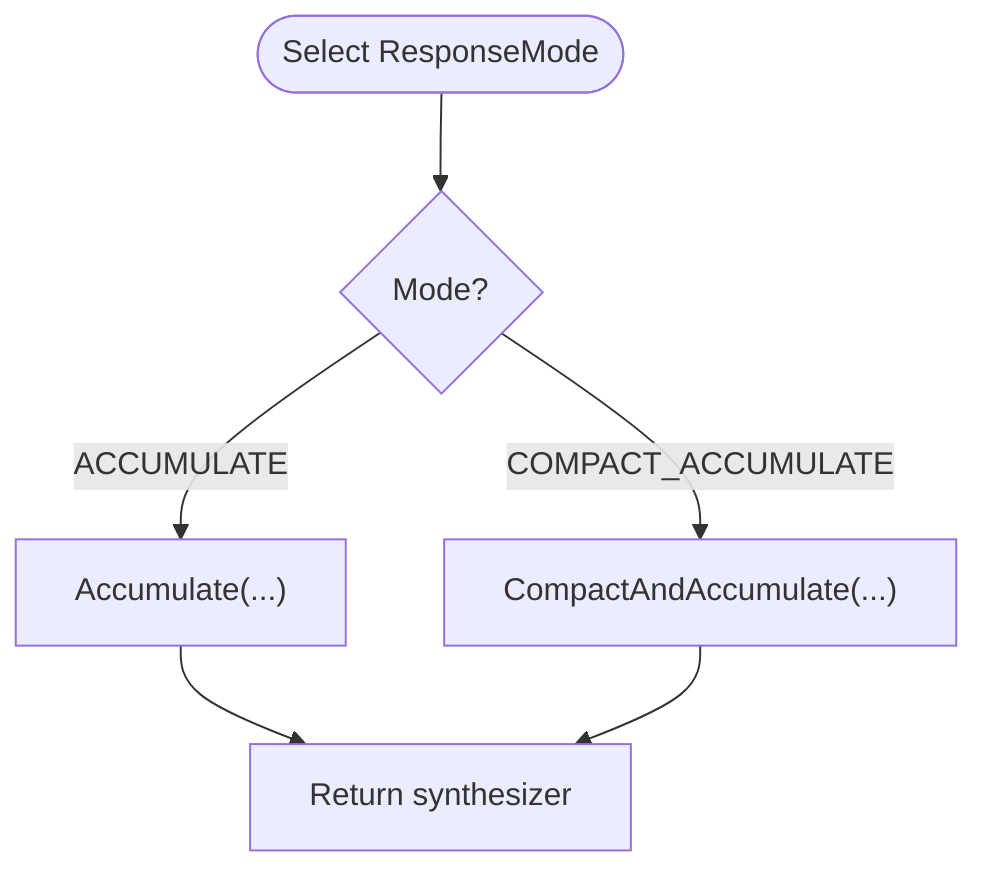
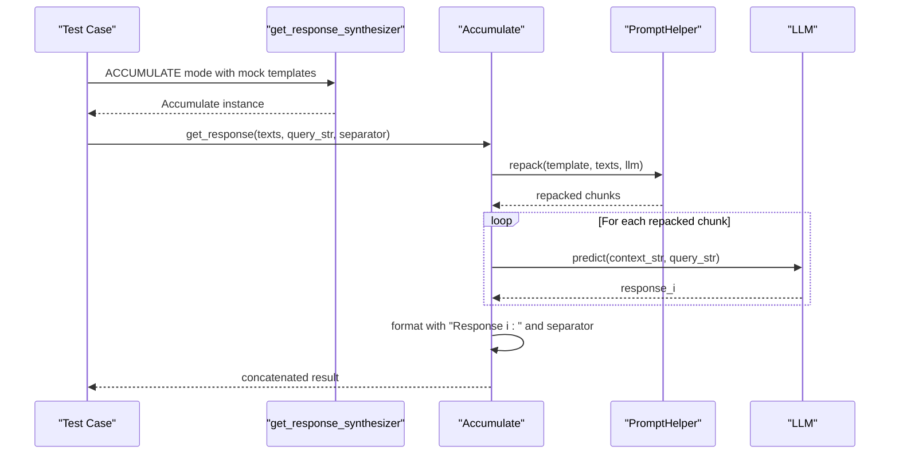
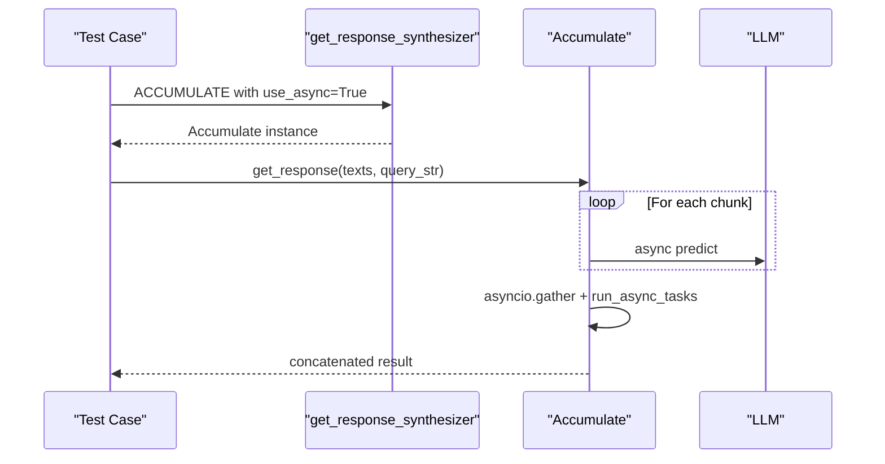
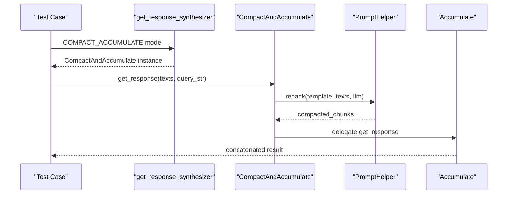
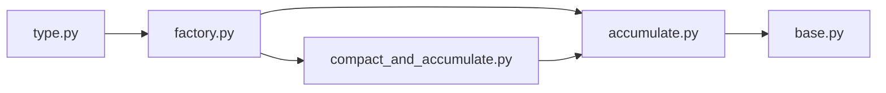

# Accumulate Synthesis Strategy

<cite>
**Referenced Files in This Document**
- [accumulate.py](file://llama-index-core/llama_index/core/response_synthesizers/accumulate.py)
- [compact_and_accumulate.py](file://llama-index-core/llama_index/core/response_synthesizers/compact_and_accumulate.py)
- [base.py](file://llama-index-core/llama_index/core/response_synthesizers/base.py)
- [factory.py](file://llama-index-core/llama_index/core/response_synthesizers/factory.py)
- [type.py](file://llama-index-core/llama_index/core/response_synthesizers/type.py)
- [test_response_builder.py](file://llama-index-core/tests/indices/response/test_response_builder.py)
</cite>

## Table of Contents
1. [Introduction](#introduction)
2. [Project Structure](#project-structure)
3. [Core Components](#core-components)
4. [Architecture Overview](#architecture-overview)
5. [Detailed Component Analysis](#detailed-component-analysis)
6. [Dependency Analysis](#dependency-analysis)
7. [Performance Considerations](#performance-considerations)
8. [Troubleshooting Guide](#troubleshooting-guide)
9. [Conclusion](#conclusion)

## Introduction
This document explains the Accumulate synthesis strategy used to build comprehensive responses by sequentially processing multiple text chunks and concatenating their individual answers. It covers the accumulation algorithm, context management during accumulation, parameter configuration for optimal behavior, and practical examples. It also compares Accumulate with related strategies such as CompactAndAccumulate and highlights scenarios where accumulated context processing yields better results than single-pass or iterative approaches.

## Project Structure
The Accumulate synthesis strategy is implemented as part of the response synthesizers module. The key files are:
- Accumulate: core accumulation logic
- CompactAndAccumulate: variant that compacts chunks first, then accumulates
- BaseSynthesizer: shared base class and orchestration
- Factory: constructs the appropriate synthesizer based on mode
- Type: enumerates supported response modes including accumulate and compact_accumulate
- Tests: demonstrate usage and expected outputs

**Diagram sources**
- [accumulate.py](file://llama-index-core/llama_index/core/response_synthesizers/accumulate.py#L18-L152)
- [compact_and_accumulate.py](file://llama-index-core/llama_index/core/response_synthesizers/compact_and_accumulate.py#L8-L56)
- [base.py](file://llama-index-core/llama_index/core/response_synthesizers/base.py#L53-L322)
- [factory.py](file://llama-index-core/llama_index/core/response_synthesizers/factory.py#L33-L152)
- [type.py](file://llama-index-core/llama_index/core/response_synthesizers/type.py#L4-L58)

**Section sources**
- [accumulate.py](file://llama-index-core/llama_index/core/response_synthesizers/accumulate.py#L1-L152)
- [compact_and_accumulate.py](file://llama-index-core/llama_index/core/response_synthesizers/compact_and_accumulate.py#L1-L56)
- [base.py](file://llama-index-core/llama_index/core/response_synthesizers/base.py#L1-L322)
- [factory.py](file://llama-index-core/llama_index/core/response_synthesizers/factory.py#L1-L152)
- [type.py](file://llama-index-core/llama_index/core/response_synthesizers/type.py#L1-L58)

## Core Components
- Accumulate: Applies the same prompt to each text chunk, collects per-chunk responses, and concatenates them with a configurable separator. Supports both synchronous and asynchronous LLM calls and structured outputs.
- CompactAndAccumulate: First repacks/compacts input chunks to fit within context limits, then delegates to Accumulate for per-chunk processing and concatenation.
- BaseSynthesizer: Provides shared initialization, prompt management, streaming support, and response wrapping into standardized output types.
- Factory: Selects the synthesizer based on ResponseMode, including ACCUMULATE and COMPACT_ACCUMULATE.
- ResponseMode: Enumerates supported synthesis modes, including accumulate and compact_accumulate.

Key parameters and behaviors:
- Streaming: Accumulate does not support streaming; attempting to enable streaming raises an error.
- use_async: Controls whether to schedule tasks concurrently via asyncio gather or run them synchronously.
- output_cls: Enables structured outputs when provided; otherwise returns plain text.
- separator: Delimiter used to join per-chunk responses.

**Section sources**
- [accumulate.py](file://llama-index-core/llama_index/core/response_synthesizers/accumulate.py#L18-L152)
- [compact_and_accumulate.py](file://llama-index-core/llama_index/core/response_synthesizers/compact_and_accumulate.py#L8-L56)
- [base.py](file://llama-index-core/llama_index/core/response_synthesizers/base.py#L53-L322)
- [factory.py](file://llama-index-core/llama_index/core/response_synthesizers/factory.py#L33-L152)
- [type.py](file://llama-index-core/llama_index/core/response_synthesizers/type.py#L4-L58)

## Architecture Overview
The Accumulate strategy orchestrates sequential processing across multiple chunks while leveraging context packing and optional async scheduling.

**Diagram sources**
- [accumulate.py](file://llama-index-core/llama_index/core/response_synthesizers/accumulate.py#L85-L152)
- [base.py](file://llama-index-core/llama_index/core/response_synthesizers/base.py#L192-L322)

## Detailed Component Analysis

### Accumulate Class
Accumulate applies the same prompt template to each text chunk, optionally repacking chunks to fit context limits, and concatenates results with a separator. It supports:
- Synchronous and asynchronous execution paths
- Structured outputs via output_cls
- Streaming disabled for this mode

**Diagram sources**
- [accumulate.py](file://llama-index-core/llama_index/core/response_synthesizers/accumulate.py#L18-L152)
- [base.py](file://llama-index-core/llama_index/core/response_synthesizers/base.py#L53-L322)

Implementation highlights:
- get_response and aget_response both enforce that streaming is disabled.
- _give_responses prepares a partialized template and repacks each chunk via PromptHelper, then calls LLM predict/astructured_predict depending on output_cls and use_async.
- Responses are collected, flattened, optionally executed asynchronously, and formatted with a prefix indicating response order and a configurable separator.

**Section sources**
- [accumulate.py](file://llama-index-core/llama_index/core/response_synthesizers/accumulate.py#L18-L152)
- [base.py](file://llama-index-core/llama_index/core/response_synthesizers/base.py#L53-L322)

### CompactAndAccumulate Class
This variant first compacts input chunks to maximize context utilization, then delegates to Accumulate for per-chunk processing and concatenation.

Behavior:
- Uses PromptHelper.repack to consolidate chunks before accumulation.
- Delegates to parent Accumulate for per-chunk processing and formatting.

**Diagram sources**
- [compact_and_accumulate.py](file://llama-index-core/llama_index/core/response_synthesizers/compact_and_accumulate.py#L8-L56)
- [accumulate.py](file://llama-index-core/llama_index/core/response_synthesizers/accumulate.py#L18-L152)

**Section sources**
- [compact_and_accumulate.py](file://llama-index-core/llama_index/core/response_synthesizers/compact_and_accumulate.py#L8-L56)

### Orchestration and Factory
The factory selects the appropriate synthesizer based on ResponseMode, enabling either pure accumulation or compact-and-accumulate.

**Diagram sources**
- [factory.py](file://llama-index-core/llama_index/core/response_synthesizers/factory.py#L33-L152)
- [type.py](file://llama-index-core/llama_index/core/response_synthesizers/type.py#L4-L58)

**Section sources**
- [factory.py](file://llama-index-core/llama_index/core/response_synthesizers/factory.py#L33-L152)
- [type.py](file://llama-index-core/llama_index/core/response_synthesizers/type.py#L4-L58)

### Example Workflows

#### Sequential Processing with Separator
The tests demonstrate sequential processing across multiple chunks and separators.

**Diagram sources**
- [test_response_builder.py](file://llama-index-core/tests/indices/response/test_response_builder.py#L96-L148)
- [accumulate.py](file://llama-index-core/llama_index/core/response_synthesizers/accumulate.py#L85-L152)

**Section sources**
- [test_response_builder.py](file://llama-index-core/tests/indices/response/test_response_builder.py#L96-L148)

#### Asynchronous Accumulation
Asynchronous execution schedules per-chunk tasks concurrently and aggregates results.

**Diagram sources**
- [test_response_builder.py](file://llama-index-core/tests/indices/response/test_response_builder.py#L150-L204)
- [accumulate.py](file://llama-index-core/llama_index/core/response_synthesizers/accumulate.py#L62-L108)

**Section sources**
- [test_response_builder.py](file://llama-index-core/tests/indices/response/test_response_builder.py#L150-L204)

#### CompactThenAccumulate
Compaction reduces the number of LLM calls by consolidating chunks first.

**Diagram sources**
- [test_response_builder.py](file://llama-index-core/tests/indices/response/test_response_builder.py#L269-L319)
- [compact_and_accumulate.py](file://llama-index-core/llama_index/core/response_synthesizers/compact_and_accumulate.py#L11-L56)
- [accumulate.py](file://llama-index-core/llama_index/core/response_synthesizers/accumulate.py#L85-L152)

**Section sources**
- [test_response_builder.py](file://llama-index-core/tests/indices/response/test_response_builder.py#L269-L319)

## Dependency Analysis
- Accumulate depends on BaseSynthesizer for shared infrastructure (LLM, callback manager, prompt helper).
- CompactAndAccumulate extends Accumulate and adds repack logic via PromptHelper.
- Factory maps ResponseMode values to concrete synthesizer classes.
- Tests validate behavior across sync, async, and compact variants.

**Diagram sources**
- [factory.py](file://llama-index-core/llama_index/core/response_synthesizers/factory.py#L33-L152)
- [accumulate.py](file://llama-index-core/llama_index/core/response_synthesizers/accumulate.py#L18-L152)
- [compact_and_accumulate.py](file://llama-index-core/llama_index/core/response_synthesizers/compact_and_accumulate.py#L8-L56)
- [base.py](file://llama-index-core/llama_index/core/response_synthesizers/base.py#L53-L322)
- [type.py](file://llama-index-core/llama_index/core/response_synthesizers/type.py#L4-L58)

**Section sources**
- [factory.py](file://llama-index-core/llama_index/core/response_synthesizers/factory.py#L33-L152)
- [accumulate.py](file://llama-index-core/llama_index/core/response_synthesizers/accumulate.py#L18-L152)
- [compact_and_accumulate.py](file://llama-index-core/llama_index/core/response_synthesizers/compact_and_accumulate.py#L8-L56)
- [base.py](file://llama-index-core/llama_index/core/response_synthesizers/base.py#L53-L322)
- [type.py](file://llama-index-core/llama_index/core/response_synthesizers/type.py#L4-L58)

## Performance Considerations
- Concurrency: use_async enables concurrent per-chunk processing, reducing total latency when LLM calls are the bottleneck.
- Context packing: CompactAndAccumulate reduces the number of LLM calls by consolidating chunks first, improving throughput.
- Streaming: Accumulate does not support streaming; enabling streaming raises an error.
- Memory: Responses are collected and concatenated; for very large numbers of chunks, consider batching or limiting chunk count to manage memory usage.

[No sources needed since this section provides general guidance]

## Troubleshooting Guide
Common issues and resolutions:
- Streaming enabled: Accumulate raises an error when streaming is enabled. Disable streaming for this mode.
- Excessive context: If chunks exceed context limits, use CompactAndAccumulate to repack chunks before accumulation.
- Structured outputs: Provide output_cls to receive structured responses; otherwise, expect plain text.
- Separator customization: Adjust separator to visually distinguish per-chunk responses.

**Section sources**
- [accumulate.py](file://llama-index-core/llama_index/core/response_synthesizers/accumulate.py#L69-L108)
- [compact_and_accumulate.py](file://llama-index-core/llama_index/core/response_synthesizers/compact_and_accumulate.py#L11-L56)

## Conclusion
The Accumulate synthesis strategy provides a robust, sequential approach to building comprehensive responses by processing each chunk independently and concatenating results. It offers flexibility through synchronous/asynchronous execution, structured outputs, and customizable separators. For scenarios with tight context windows or many chunks, CompactAndAccumulate further optimizes performance by consolidating chunks prior to accumulation. Compared to single-pass or iterative strategies, Accumulate’s per-chunk processing can yield more granular and interpretable results, especially when downstream consumers benefit from explicit per-chunk provenance.