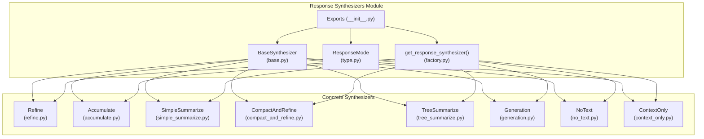
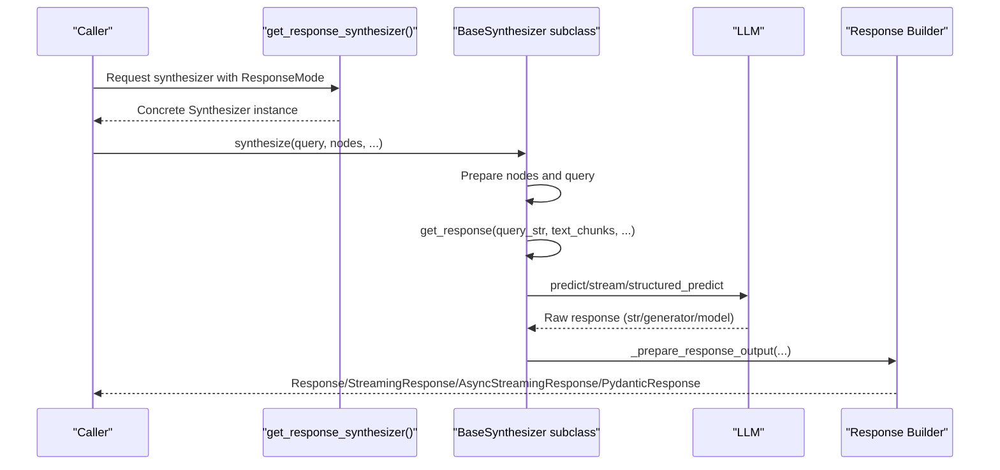
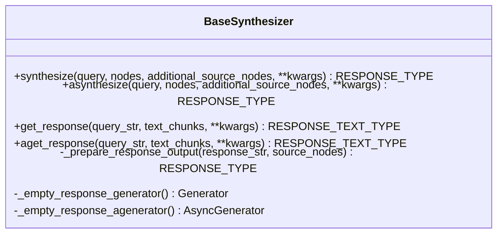
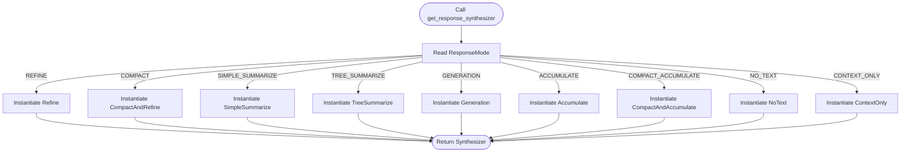
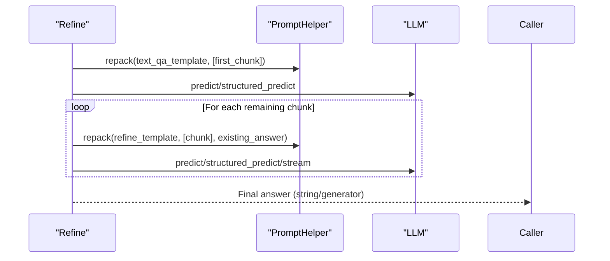
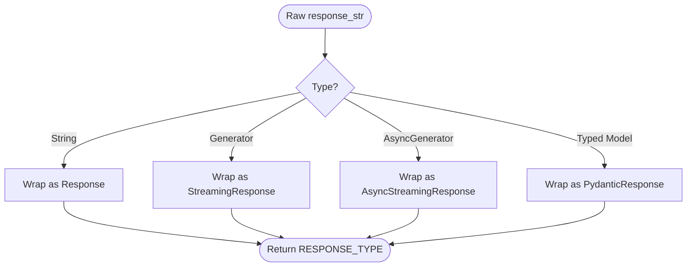
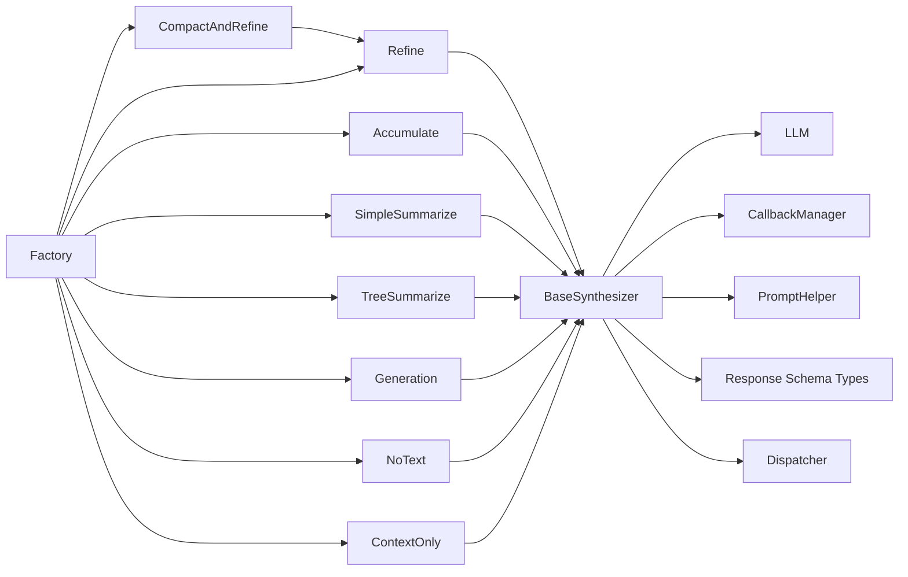

# BaseSynthesizer Interface

<cite>
**Referenced Files in This Document**
- [base.py](file://llama-index-core/llama_index/core/response_synthesizers/base.py)
- [type.py](file://llama-index-core/llama_index/core/response_synthesizers/type.py)
- [__init__.py](file://llama-index-core/llama_index/core/response_synthesizers/__init__.py)
- [factory.py](file://llama-index-core/llama_index/core/response_synthesizers/factory.py)
- [schema.py](file://llama-index-core/llama_index/core/base/response/schema.py)
- [refine.py](file://llama-index-core/llama_index/core/response_synthesizers/refine.py)
- [accumulate.py](file://llama-index-core/llama_index/core/response_synthesizers/accumulate.py)
- [simple_summarize.py](file://llama-index-core/llama_index/core/response_synthesizers/simple_summarize.py)
- [compact_and_refine.py](file://llama-index-core/llama_index/core/response_synthesizers/compact_and_refine.py)
- [tree_summarize.py](file://llama-index-core/llama_index/core/response_synthesizers/tree_summarize.py)
- [generation.py](file://llama-index-core/llama_index/core/response_synthesizers/generation.py)
- [no_text.py](file://llama-index-core/llama_index/core/response_synthesizers/no_text.py)
- [context_only.py](file://llama-index-core/llama_index/core/response_synthesizers/context_only.py)
</cite>

## Table of Contents
1. [Introduction](#introduction)
2. [Project Structure](#project-structure)
3. [Core Components](#core-components)
4. [Architecture Overview](#architecture-overview)
5. [Detailed Component Analysis](#detailed-component-analysis)
6. [Dependency Analysis](#dependency-analysis)
7. [Performance Considerations](#performance-considerations)
8. [Troubleshooting Guide](#troubleshooting-guide)
9. [Conclusion](#conclusion)

## Introduction
This document explains the BaseSynthesizer interface and the ResponseMode enumeration that define the contract for all response synthesizers in the LlamaIndex framework. It covers the abstract base class’s responsibilities, method signatures, input/output specifications, and integration patterns. It also documents the ResponseMode values and their synthesis behaviors, and provides guidance for implementing custom synthesizers, error handling, and integration with the broader framework.

## Project Structure
The response synthesizer subsystem resides under the core module and exposes a shared interface and several concrete implementations. The key files include the abstract base class, the enumeration of response modes, a factory for constructing synthesizers, and concrete implementations.

**Diagram sources**
- [base.py](file://llama-index-core/llama_index/core/response_synthesizers/base.py#L53-L322)
- [type.py](file://llama-index-core/llama_index/core/response_synthesizers/type.py#L4-L58)
- [factory.py](file://llama-index-core/llama_index/core/response_synthesizers/factory.py#L33-L152)
- [__init__.py](file://llama-index-core/llama_index/core/response_synthesizers/__init__.py#L3-L25)

**Section sources**
- [__init__.py](file://llama-index-core/llama_index/core/response_synthesizers/__init__.py#L1-L26)

## Core Components
- BaseSynthesizer: An abstract base class that defines the contract for response synthesis. It standardizes initialization, lifecycle hooks, and the public synthesis APIs (synthesize/asynthesize). It delegates actual synthesis to abstract methods get_response and aget_response, and converts raw outputs into standardized response objects.
- ResponseMode: An enumeration that enumerates synthesis strategies (e.g., refine, compact, simple_summarize, tree_summarize, generation, no_text, context_only, accumulate, compact_accumulate). These modes are consumed by the factory to construct appropriate synthesizer instances.

Key responsibilities:
- Initialization: Accepts an LLM, optional callback manager, prompt helper, streaming flag, output class for structured responses, and an empty response fallback.
- Public APIs: synthesize and asynthesize orchestrate query handling, node preparation, and response wrapping.
- Output preparation: Converts raw outputs (strings, generators, async generators, or typed models) into Response, StreamingResponse, AsyncStreamingResponse, or PydanticResponse objects.
- Instrumentation and events: Emits synthesis start/end events and integrates with the dispatcher for tracing.

**Section sources**
- [base.py](file://llama-index-core/llama_index/core/response_synthesizers/base.py#L53-L322)
- [type.py](file://llama-index-core/llama_index/core/response_synthesizers/type.py#L4-L58)

## Architecture Overview
The BaseSynthesizer orchestrates synthesis across multiple strategies. The factory constructs a concrete synthesizer based on ResponseMode and passes through configuration such as templates, streaming, and structured output classes. The concrete synthesizers implement domain-specific strategies (e.g., iterative refinement, accumulation, tree summarization) while adhering to the shared interface.

**Diagram sources**
- [factory.py](file://llama-index-core/llama_index/core/response_synthesizers/factory.py#L33-L152)
- [base.py](file://llama-index-core/llama_index/core/response_synthesizers/base.py#L192-L322)
- [schema.py](file://llama-index-core/llama_index/core/base/response/schema.py#L14-L242)

## Detailed Component Analysis

### BaseSynthesizer Contract
- Initialization parameters:
  - llm: LLM instance or falls back to global settings.
  - callback_manager: Integrates with the callback system.
  - prompt_helper: Manages prompt packing/truncation; auto-created from LLM metadata if not provided.
  - streaming: Enables streaming responses.
  - output_cls: Optional Pydantic model type for structured outputs.
  - empty_response: Fallback string for empty results.
- Abstract methods:
  - get_response(query_str, text_chunks, **response_kwargs) -> RESPONSE_TEXT_TYPE
  - aget_response(query_str, text_chunks, **response_kwargs) -> RESPONSE_TEXT_TYPE
- Public synthesis APIs:
  - synthesize(query, nodes, additional_source_nodes=None, **response_kwargs) -> RESPONSE_TYPE
  - asynthesize(query, nodes, additional_source_nodes=None, **response_kwargs) -> RESPONSE_TYPE
- Output preparation:
  - _prepare_response_output(response_str, source_nodes) -> RESPONSE_TYPE
  - Supports strings, generators, async generators, and typed models via StructuredLLM or explicit output_cls.
- Empty handling:
  - Returns a standardized empty response when no nodes are provided, respecting streaming mode.

**Diagram sources**
- [base.py](file://llama-index-core/llama_index/core/response_synthesizers/base.py#L53-L322)

**Section sources**
- [base.py](file://llama-index-core/llama_index/core/response_synthesizers/base.py#L56-L191)

### ResponseMode Enumeration
ResponseMode defines the synthesis strategy. Each value corresponds to a concrete synthesizer constructed by the factory.

- REFINE: Iterative refinement across chunks using a refine prompt after an initial QA prompt.
- COMPACT: Combine chunks to fill context, then refine.
- SIMPLE_SUMMARIZE: Merge all chunks into one and call the LLM once.
- TREE_SUMMARIZE: Bottom-up tree aggregation with summary prompts.
- GENERATION: Ignore context; generate response directly from the query.
- NO_TEXT: Return empty string without synthesis.
- CONTEXT_ONLY: Concatenate all text chunks without synthesis.
- ACCUMULATE: Synthesize per chunk and concatenate results.
- COMPACT_ACCUMULATE: Compact chunks, then accumulate and concatenate.

Behavioral notes:
- Some modes restrict streaming (e.g., Accumulate explicitly forbids streaming).
- Some modes rely on structured LLMs and output classes for typed responses.

**Section sources**
- [type.py](file://llama-index-core/llama_index/core/response_synthesizers/type.py#L4-L58)

### Factory Integration
The factory maps ResponseMode to concrete synthesizer classes, wiring templates, streaming, structured output, and other options.

**Diagram sources**
- [factory.py](file://llama-index-core/llama_index/core/response_synthesizers/factory.py#L33-L152)

**Section sources**
- [factory.py](file://llama-index-core/llama_index/core/response_synthesizers/factory.py#L33-L152)

### Concrete Synthesizer Examples

#### Refine
- Strategy: Initial QA prompt on the first chunk, then iteratively refine with subsequent chunks using a refine prompt.
- Notable behaviors:
  - Supports structured answer filtering via a program factory and StructuredLLM.
  - Streaming is incompatible with structured answer filtering.
  - Validates structured outputs and logs warnings on validation errors.

**Diagram sources**
- [refine.py](file://llama-index-core/llama_index/core/response_synthesizers/refine.py#L108-L522)

**Section sources**
- [refine.py](file://llama-index-core/llama_index/core/response_synthesizers/refine.py#L108-L522)

#### Accumulate
- Strategy: Apply the same prompt to each chunk independently, collect outputs, and concatenate them with a separator.
- Notable behaviors:
  - Streaming is not supported.
  - Supports async execution via use_async and flattening nested lists of outputs.

**Section sources**
- [accumulate.py](file://llama-index-core/llama_index/core/response_synthesizers/accumulate.py#L18-L152)

#### SimpleSummarize
- Strategy: Merge all chunks into a single context and call the LLM once; truncates to fit the prompt.
- Notable behaviors:
  - Streaming supported.
  - Uses prompt helper truncate to ensure context fits.

**Section sources**
- [simple_summarize.py](file://llama-index-core/llama_index/core/response_synthesizers/simple_summarize.py#L15-L110)

#### CompactAndRefine
- Strategy: Compact chunks to fill the context window, then apply Refine logic on the compacted chunks.
- Notable behaviors:
  - Inherits Refine’s logic; adds compaction step.

**Section sources**
- [compact_and_refine.py](file://llama-index-core/llama_index/core/response_synthesizers/compact_and_refine.py#L11-L58)

#### TreeSummarize
- Strategy: Bottom-up aggregation; repack chunks to fill context, summarize each, and recurse until one summary remains.
- Notable behaviors:
  - Supports structured outputs and async execution.
  - Streaming supported at leaf level.

**Section sources**
- [tree_summarize.py](file://llama-index-core/llama_index/core/response_synthesizers/tree_summarize.py#L17-L231)

#### Generation
- Strategy: Ignore context; generate response directly from the query using a simple template.
- Notable behaviors:
  - Reuses BaseSynthesizer synthesize/asynthesize with a specialized get_response path.

**Section sources**
- [generation.py](file://llama-index-core/llama_index/core/response_synthesizers/generation.py#L29-L189)

#### NoText and ContextOnly
- NoText: Returns an empty string.
- ContextOnly: Concatenates all input chunks.

**Section sources**
- [no_text.py](file://llama-index-core/llama_index/core/response_synthesizers/no_text.py#L8-L31)
- [context_only.py](file://llama-index-core/llama_index/core/response_synthesizers/context_only.py#L8-L31)

### Response Types and Output Preparation
BaseSynthesizer converts raw outputs into standardized response objects:
- String responses become Response.
- Generators become StreamingResponse.
- Async generators become AsyncStreamingResponse.
- StructuredLLM outputs or explicit output_cls produce PydanticResponse.

**Diagram sources**
- [base.py](file://llama-index-core/llama_index/core/response_synthesizers/base.py#L145-L191)
- [schema.py](file://llama-index-core/llama_index/core/base/response/schema.py#L14-L242)

**Section sources**
- [base.py](file://llama-index-core/llama_index/core/response_synthesizers/base.py#L145-L191)
- [schema.py](file://llama-index-core/llama_index/core/base/response/schema.py#L14-L242)

## Dependency Analysis
- BaseSynthesizer depends on:
  - LLM for inference.
  - CallbackManager for event emission.
  - PromptHelper for packing/truncating contexts.
  - Instrumentation dispatcher for tracing.
  - Response schema types for output wrapping.
- Concrete synthesizers depend on:
  - Prompt templates (selected defaults or provided).
  - PromptHelper for repacking/truncating.
  - StructuredLLM for typed outputs when configured.
- Factory depends on:
  - ResponseMode to select the correct synthesizer.
  - Defaults for templates and helpers.

**Diagram sources**
- [base.py](file://llama-index-core/llama_index/core/response_synthesizers/base.py#L16-L44)
- [factory.py](file://llama-index-core/llama_index/core/response_synthesizers/factory.py#L14-L31)

**Section sources**
- [base.py](file://llama-index-core/llama_index/core/response_synthesizers/base.py#L16-L44)
- [factory.py](file://llama-index-core/llama_index/core/response_synthesizers/factory.py#L14-L31)

## Performance Considerations
- Streaming vs. non-streaming:
  - Streaming reduces latency for long generations but restricts certain features (e.g., structured answer filtering in Refine).
  - Some modes explicitly forbid streaming (e.g., Accumulate).
- Prompt packing and truncation:
  - PromptHelper ensures prompts fit within context windows, reducing retries and failures.
- Structured outputs:
  - Using StructuredLLM or output_cls incurs validation overhead; enable only when required.
- Asynchronous execution:
  - TreeSummarize and Accumulate support async to reduce latency when processing many chunks.

[No sources needed since this section provides general guidance]

## Troubleshooting Guide
Common issues and resolutions:
- Empty nodes:
  - BaseSynthesizer returns a standardized empty response when no nodes are provided, respecting streaming mode.
- Unsupported combinations:
  - Refine disallows streaming with structured answer filtering; Accumulate disallows streaming altogether.
- Validation errors:
  - Refine logs warnings when structured outputs fail validation; consider relaxing constraints or adjusting templates.
- Context overflow:
  - SimpleSummarize and TreeSummarize rely on truncation/packing; ensure templates and helpers are configured appropriately.

**Section sources**
- [base.py](file://llama-index-core/llama_index/core/response_synthesizers/base.py#L206-L227)
- [refine.py](file://llama-index-core/llama_index/core/response_synthesizers/refine.py#L138-L146)
- [accumulate.py](file://llama-index-core/llama_index/core/response_synthesizers/accumulate.py#L70-L72)
- [refine.py](file://llama-index-core/llama_index/core/response_synthesizers/refine.py#L249-L253)

## Conclusion
BaseSynthesizer defines a robust, extensible contract for response synthesis in LlamaIndex. ResponseMode enumerates well-defined strategies, and the factory simplifies instantiation. Concrete synthesizers implement domain-specific logic while sharing a unified interface and output format. By following the patterns demonstrated by Refine, Accumulate, SimpleSummarize, CompactAndRefine, TreeSummarize, Generation, NoText, and ContextOnly, developers can implement custom synthesizers that integrate seamlessly with the broader framework.