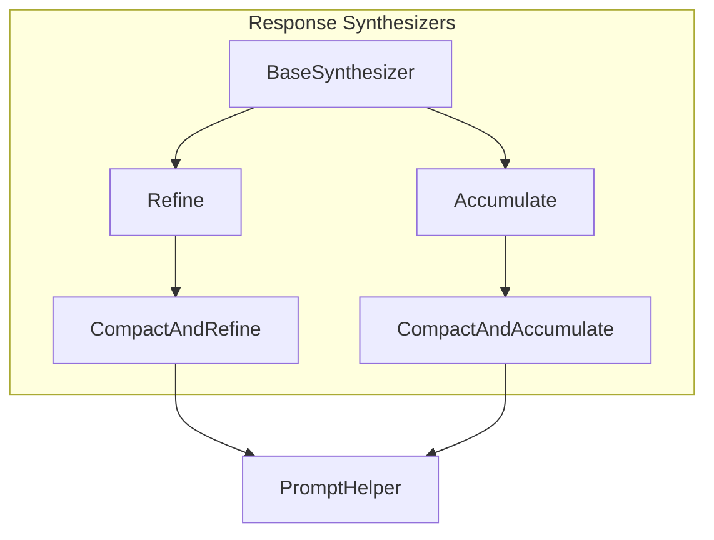
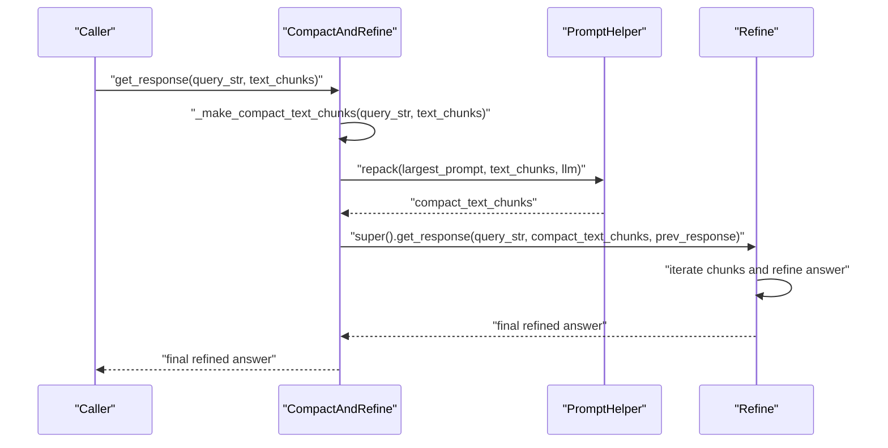
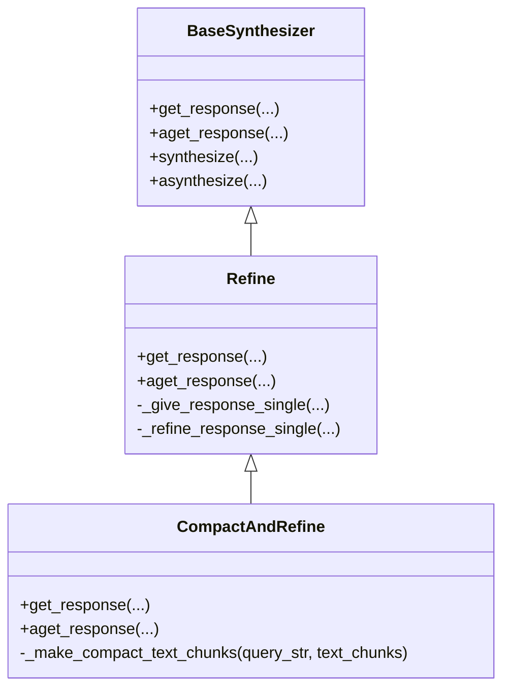
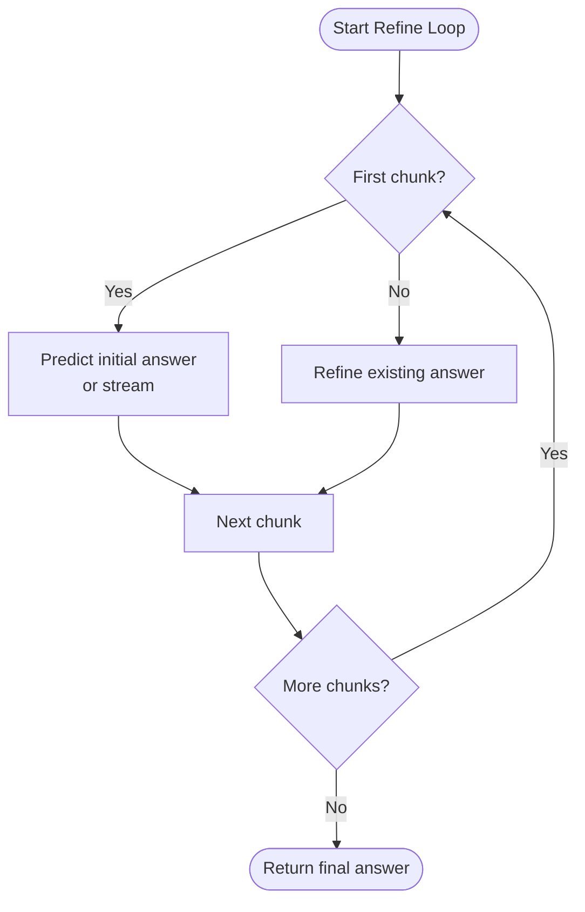
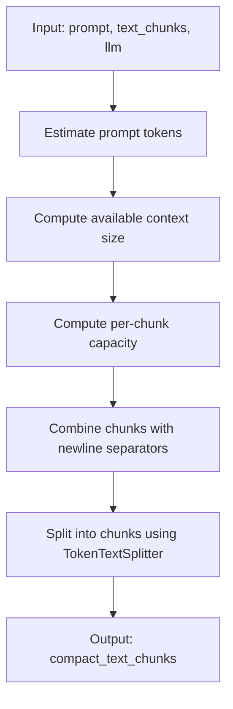
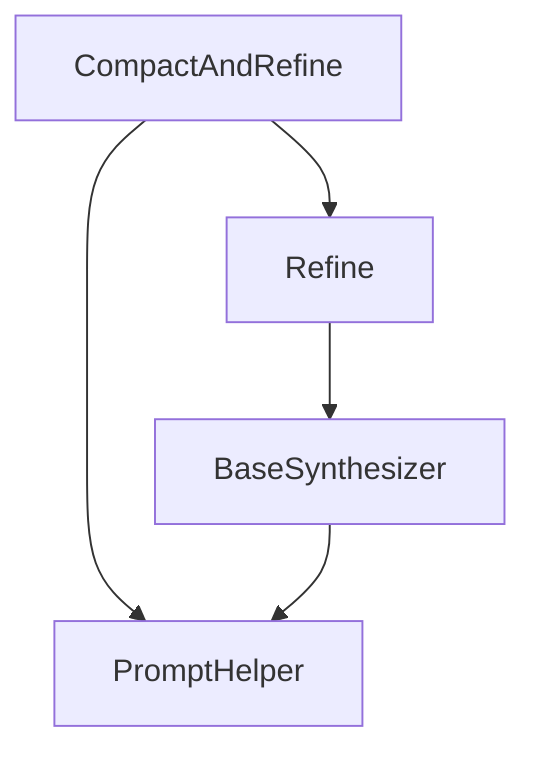

# Compact and Refine Synthesis Strategy

<cite>
**Referenced Files in This Document**
- [compact_and_refine.py](file://llama-index-core/llama_index/core/response_synthesizers/compact_and_refine.py)
- [refine.py](file://llama-index-core/llama_index/core/response_synthesizers/refine.py)
- [base.py](file://llama-index-core/llama_index/core/response_synthesizers/base.py)
- [prompt_helper.py](file://llama-index-core/llama_index/core/indices/prompt_helper.py)
- [factory.py](file://llama-index-core/llama_index/core/response_synthesizers/factory.py)
- [accumulate.py](file://llama-index-core/llama_index/core/response_synthesizers/accumulate.py)
- [compact_and_accumulate.py](file://llama-index-core/llama_index/core/response_synthesizers/compact_and_accumulate.py)
</cite>

## Table of Contents
1. [Introduction](#introduction)
2. [Project Structure](#project-structure)
3. [Core Components](#core-components)
4. [Architecture Overview](#architecture-overview)
5. [Detailed Component Analysis](#detailed-component-analysis)
6. [Dependency Analysis](#dependency-analysis)
7. [Performance Considerations](#performance-considerations)
8. [Troubleshooting Guide](#troubleshooting-guide)
9. [Conclusion](#conclusion)

## Introduction
This document explains the Compact and Refine synthesis strategy, which combines compact representation of context with iterative refinement to optimize both memory usage and response quality. The approach first consolidates overlapping or adjacent text chunks into compact bundles that fit within the LLM’s context window, then applies the iterative refinement loop to progressively improve the answer across packed chunks. This hybrid method reduces the number of LLM calls while maintaining or improving answer quality compared to pure compact or pure refine strategies.

## Project Structure
The Compact and Refine strategy is implemented as a specialized synthesizer that inherits from the Refine synthesizer and reuses the PromptHelper packing utilities. The relevant modules are organized as follows:
- Response synthesizers: BaseSynthesizer, Refine, CompactAndRefine, Accumulate, CompactAndAccumulate
- PromptHelper: utilities for repacking and truncating text chunks to fit context windows
- Factory: constructs the appropriate synthesizer based on ResponseMode

**Diagram sources**
- [base.py](file://llama-index-core/llama_index/core/response_synthesizers/base.py#L53-L322)
- [refine.py](file://llama-index-core/llama_index/core/response_synthesizers/refine.py#L108-L522)
- [compact_and_refine.py](file://llama-index-core/llama_index/core/response_synthesizers/compact_and_refine.py#L11-L58)
- [accumulate.py](file://llama-index-core/llama_index/core/response_synthesizers/accumulate.py#L18-L152)
- [compact_and_accumulate.py](file://llama-index-core/llama_index/core/response_synthesizers/compact_and_accumulate.py#L8-L56)
- [prompt_helper.py](file://llama-index-core/llama_index/core/indices/prompt_helper.py#L42-L307)

**Section sources**
- [factory.py](file://llama-index-core/llama_index/core/response_synthesizers/factory.py#L33-L152)

## Core Components
- CompactAndRefine: Inherits from Refine and adds a pre-processing step to compact text chunks before refinement. It computes the largest prompt template between the QA and refine templates and uses PromptHelper to repack text chunks accordingly.
- Refine: Implements the iterative refinement loop across text chunks, using either structured or unstructured programs to produce and update answers.
- PromptHelper: Provides repack and truncate utilities to maximize context window usage by combining or splitting text chunks.
- BaseSynthesizer: Shared base class offering common capabilities such as LLM selection, prompt helpers, streaming, and response formatting.
- CompactAndAccumulate and Accumulate: Related strategies that demonstrate alternatives to pure refinement (accumulate) and compact accumulation.

Key implementation references:
- CompactAndRefine._make_compact_text_chunks uses PromptHelper.repack with the larger of the QA and refine templates.
- Refine.get_response iterates over chunks, calling _give_response_single for the first chunk and _refine_response_single for subsequent chunks.
- PromptHelper.repack combines chunks with newline separators and splits them to fit the available context window.

**Section sources**
- [compact_and_refine.py](file://llama-index-core/llama_index/core/response_synthesizers/compact_and_refine.py#L11-L58)
- [refine.py](file://llama-index-core/llama_index/core/response_synthesizers/refine.py#L163-L348)
- [prompt_helper.py](file://llama-index-core/llama_index/core/indices/prompt_helper.py#L287-L307)
- [base.py](file://llama-index-core/llama_index/core/response_synthesizers/base.py#L53-L127)

## Architecture Overview
The Compact and Refine pipeline integrates compact bundling with iterative refinement:
1. Compute the largest prompt template between the QA and refine templates for the current query.
2. Use PromptHelper.repack to consolidate text chunks into compact bundles that fit within the context window.
3. Delegate to Refine to process the compact bundles iteratively, updating the answer with each new bundle.

**Diagram sources**
- [compact_and_refine.py](file://llama-index-core/llama_index/core/response_synthesizers/compact_and_refine.py#L15-L48)
- [prompt_helper.py](file://llama-index-core/llama_index/core/indices/prompt_helper.py#L287-L307)
- [refine.py](file://llama-index-core/llama_index/core/response_synthesizers/refine.py#L163-L199)

## Detailed Component Analysis

### CompactAndRefine Analysis
CompactAndRefine extends Refine to first compact text chunks and then refine the answer across the compact bundles. The compacting step ensures fewer, larger context windows are used, reducing LLM calls while preserving answer quality.

**Diagram sources**
- [base.py](file://llama-index-core/llama_index/core/response_synthesizers/base.py#L53-L127)
- [refine.py](file://llama-index-core/llama_index/core/response_synthesizers/refine.py#L108-L147)
- [compact_and_refine.py](file://llama-index-core/llama_index/core/response_synthesizers/compact_and_refine.py#L11-L58)

Implementation highlights:
- _make_compact_text_chunks computes the largest prompt template between the QA and refine templates and repacks text chunks accordingly.
- get_response and aget_response apply the compacting step before delegating to the parent Refine implementation.

**Section sources**
- [compact_and_refine.py](file://llama-index-core/llama_index/core/response_synthesizers/compact_and_refine.py#L11-L58)

### Refine Loop Analysis
The Refine synthesizer implements an iterative refinement loop:
- On the first chunk, it either predicts an initial answer or streams the prediction.
- On subsequent chunks, it refines the existing answer using the refine template, repacking context as needed to fit the available window.

**Diagram sources**
- [refine.py](file://llama-index-core/llama_index/core/response_synthesizers/refine.py#L163-L199)
- [refine.py](file://llama-index-core/llama_index/core/response_synthesizers/refine.py#L275-L348)

Key behaviors:
- _give_response_single handles the first chunk, optionally using structured programs or streaming.
- _refine_response_single handles subsequent chunks, computing available chunk size and repacking context to fit the refine template.

**Section sources**
- [refine.py](file://llama-index-core/llama_index/core/response_synthesizers/refine.py#L220-L348)

### PromptHelper Compaction Algorithm
PromptHelper provides the compaction algorithm via repack:
- Estimates the number of prompt tokens for the given template.
- Computes available context size and per-chunk capacity.
- Combines input chunks with newline separators and splits them into chunks that fit the computed capacity.

**Diagram sources**
- [prompt_helper.py](file://llama-index-core/llama_index/core/indices/prompt_helper.py#L175-L242)
- [prompt_helper.py](file://llama-index-core/llama_index/core/indices/prompt_helper.py#L287-L307)

**Section sources**
- [prompt_helper.py](file://llama-index-core/llama_index/core/indices/prompt_helper.py#L244-L307)

### Comparison with Related Strategies
- Pure Refine: Processes each chunk individually and refines the answer iteratively. May require many LLM calls if chunks are small.
- Pure Compact (CompactAndAccumulate): Packs chunks and accumulates separate answers, then concatenates them. This avoids iterative refinement but may miss cross-chunk coherence.
- Hybrid Compact and Refine: Packs chunks first, then refines the answer across the compact bundles, combining memory efficiency with iterative improvement.

References:
- CompactAndAccumulate demonstrates the compact-first approach for accumulation.
- Accumulate shows the non-refined accumulation pattern.

**Section sources**
- [compact_and_accumulate.py](file://llama-index-core/llama_index/core/response_synthesizers/compact_and_accumulate.py#L8-L56)
- [accumulate.py](file://llama-index-core/llama_index/core/response_synthesizers/accumulate.py#L18-L152)

## Dependency Analysis
The Compact and Refine strategy depends on:
- BaseSynthesizer for shared LLM and prompt helper wiring
- Refine for the iterative refinement loop
- PromptHelper for compact text chunking

**Diagram sources**
- [compact_and_refine.py](file://llama-index-core/llama_index/core/response_synthesizers/compact_and_refine.py#L11-L58)
- [refine.py](file://llama-index-core/llama_index/core/response_synthesizers/refine.py#L108-L147)
- [base.py](file://llama-index-core/llama_index/core/response_synthesizers/base.py#L53-L84)
- [prompt_helper.py](file://llama-index-core/llama_index/core/indices/prompt_helper.py#L42-L107)

**Section sources**
- [factory.py](file://llama-index-core/llama_index/core/response_synthesizers/factory.py#L33-L92)

## Performance Considerations
- Memory optimization: Compact bundling reduces the number of LLM calls by maximizing context window utilization per call.
- Iterative refinement: Improves answer quality by incorporating new evidence incrementally while keeping context sizes manageable.
- Parameter balancing:
  - PromptHelper chunk_overlap_ratio influences overlap between compact bundles; higher overlap can improve continuity but increases total tokens.
  - chunk_size_limit caps individual chunks to prevent oversized contexts.
  - num_output reserves tokens for model generation; larger responses require smaller chunk sizes.
- Streaming vs structured programs: Streaming bypasses structured validation and may reduce overhead, while structured programs enable answer filtering at the cost of extra validation steps.

[No sources needed since this section provides general guidance]

## Troubleshooting Guide
Common issues and resolutions:
- Negative available chunk size during refinement: The refine loop checks available chunk size and returns the original response if the refine template plus existing answer exceeds the context window. Ensure prompt templates and existing answers are within limits.
- Empty responses: The synthesizers return a default empty response when no content is produced; verify input chunks and prompt templates.
- Streaming with structured filtering: Streaming is not supported when structured answer filtering is enabled; disable one or the other.

**Section sources**
- [refine.py](file://llama-index-core/llama_index/core/response_synthesizers/refine.py#L304-L308)
- [refine.py](file://llama-index-core/llama_index/core/response_synthesizers/refine.py#L138-L146)
- [base.py](file://llama-index-core/llama_index/core/response_synthesizers/base.py#L85-L89)

## Conclusion
The Compact and Refine synthesis strategy optimizes both memory usage and response quality by first compacting context into efficient bundles and then refining the answer iteratively across those bundles. Compared to pure compact or pure refine strategies, this hybrid approach reduces LLM calls while preserving or improving answer coherence and accuracy. Proper tuning of PromptHelper parameters and careful selection of streaming versus structured programs enables robust performance across diverse workloads.