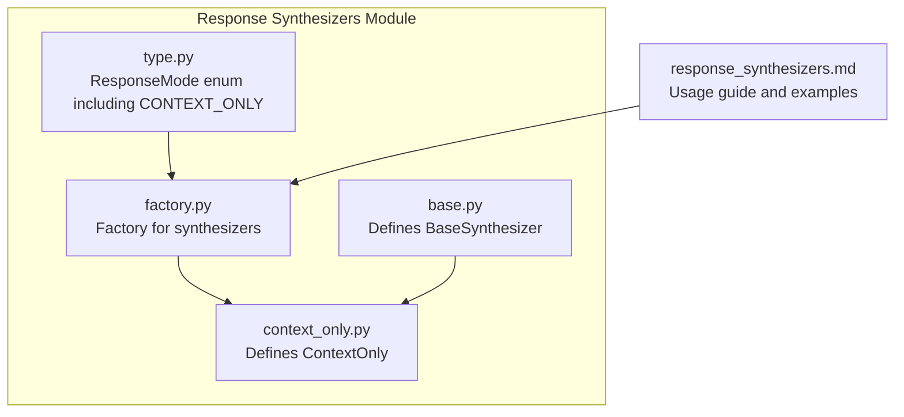
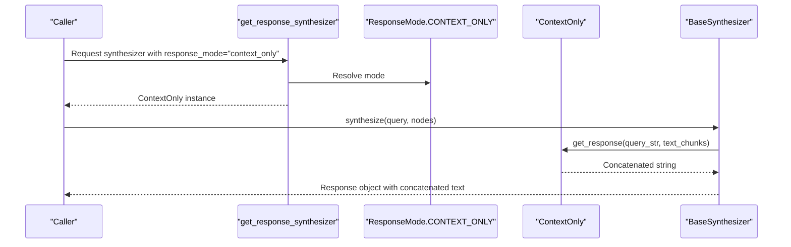
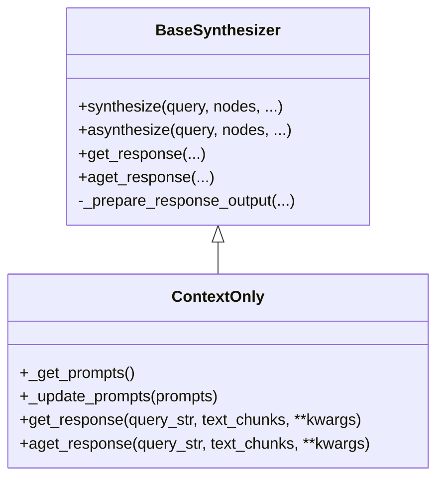
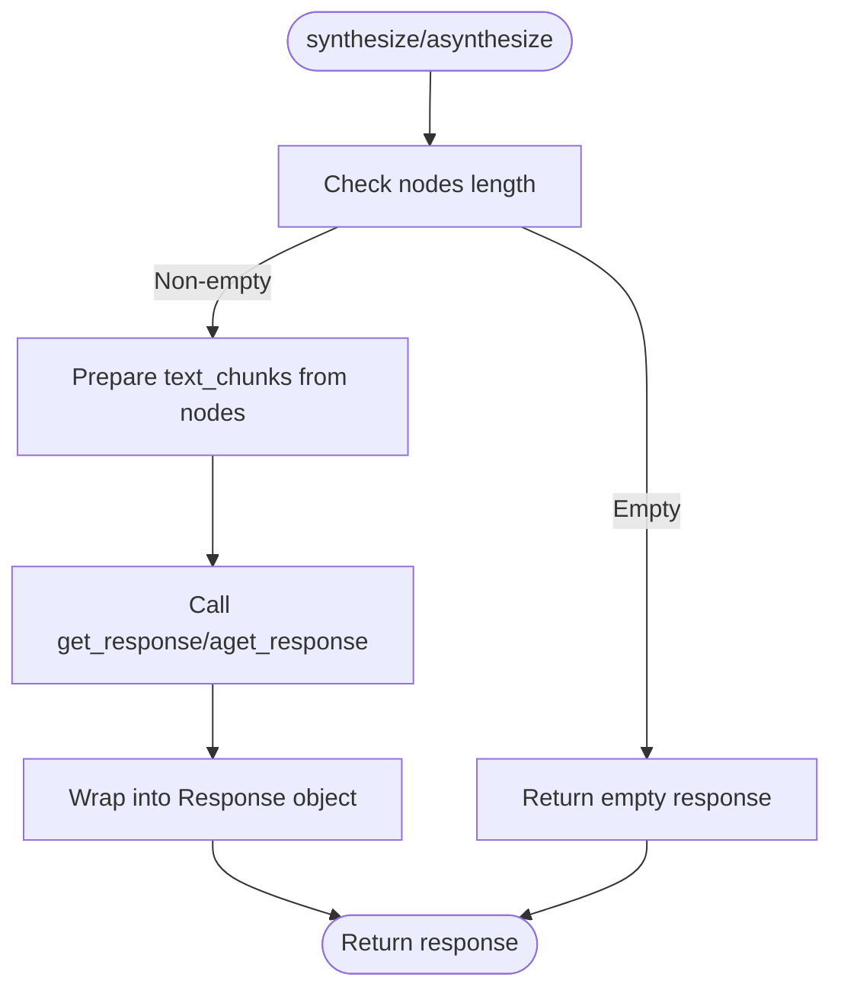
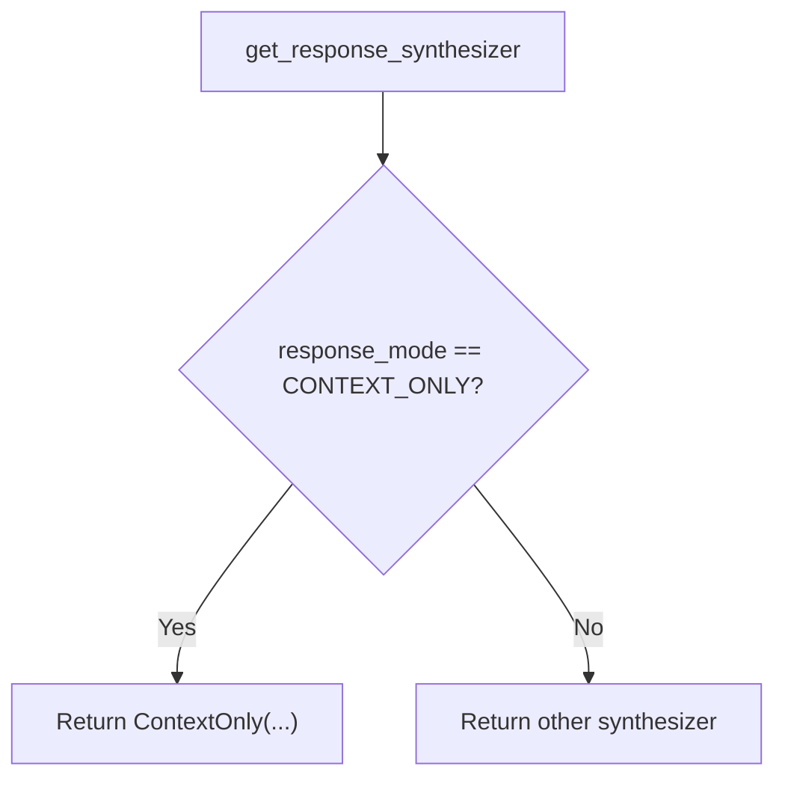
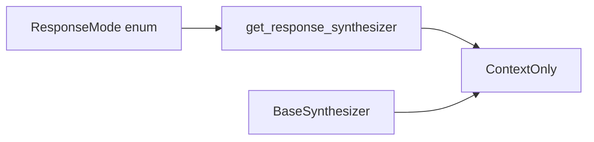

# Context Only Synthesis Strategy

<cite>
**Referenced Files in This Document**
- [context_only.py](file://llama-index-core/llama_index/core/response_synthesizers/context_only.py)
- [base.py](file://llama-index-core/llama_index/core/response_synthesizers/base.py)
- [factory.py](file://llama-index-core/llama_index/core/response_synthesizers/factory.py)
- [type.py](file://llama-index-core/llama_index/core/response_synthesizers/type.py)
- [response_synthesizers.md](file://docs/src/content/docs/framework/module_guides/querying/response_synthesizers/response_synthesizers.md)
</cite>

## Table of Contents
1. [Introduction](#introduction)
2. [Project Structure](#project-structure)
3. [Core Components](#core-components)
4. [Architecture Overview](#architecture-overview)
5. [Detailed Component Analysis](#detailed-component-analysis)
6. [Dependency Analysis](#dependency-analysis)
7. [Performance Considerations](#performance-considerations)
8. [Troubleshooting Guide](#troubleshooting-guide)
9. [Conclusion](#conclusion)

## Introduction
The Context Only synthesis strategy is a lightweight response synthesis mode that returns a concatenated string of all retrieved text chunks without invoking an LLM or performing iterative processing. It is ideal for straightforward retrieval tasks where the goal is to present raw context directly to the user or downstream systems, minimizing processing overhead and latency.

## Project Structure
The Context Only strategy is implemented as a dedicated synthesizer class within the response synthesizers module. It integrates with the broader synthesis framework via a factory and enumeration of response modes.

**Diagram sources**
- [context_only.py](file://llama-index-core/llama_index/core/response_synthesizers/context_only.py#L1-L31)
- [base.py](file://llama-index-core/llama_index/core/response_synthesizers/base.py#L53-L322)
- [factory.py](file://llama-index-core/llama_index/core/response_synthesizers/factory.py#L33-L152)
- [type.py](file://llama-index-core/llama_index/core/response_synthesizers/type.py#L4-L58)
- [response_synthesizers.md](file://docs/src/content/docs/framework/module_guides/querying/response_synthesizers/response_synthesizers.md#L1-L69)

**Section sources**
- [context_only.py](file://llama-index-core/llama_index/core/response_synthesizers/context_only.py#L1-L31)
- [base.py](file://llama-index-core/llama_index/core/response_synthesizers/base.py#L53-L322)
- [factory.py](file://llama-index-core/llama_index/core/response_synthesizers/factory.py#L33-L152)
- [type.py](file://llama-index-core/llama_index/core/response_synthesizers/type.py#L4-L58)
- [response_synthesizers.md](file://docs/src/content/docs/framework/module_guides/querying/response_synthesizers/response_synthesizers.md#L1-L69)

## Core Components
- ContextOnly: A synthesizer that concatenates retrieved text chunks into a single response string without prompting an LLM.
- BaseSynthesizer: The abstract base class defining the synthesis interface and shared orchestration logic.
- Factory: Creates synthesizer instances based on the selected ResponseMode, including CONTEXT_ONLY.
- ResponseMode: Enumeration that includes CONTEXT_ONLY as a valid synthesis mode.

Key characteristics:
- Zero LLM calls during synthesis.
- Minimal processing overhead.
- Straightforward concatenation with a newline separator between chunks.

**Section sources**
- [context_only.py](file://llama-index-core/llama_index/core/response_synthesizers/context_only.py#L8-L31)
- [base.py](file://llama-index-core/llama_index/core/response_synthesizers/base.py#L53-L126)
- [factory.py](file://llama-index-core/llama_index/core/response_synthesizers/factory.py#L145-L149)
- [type.py](file://llama-index-core/llama_index/core/response_synthesizers/type.py#L45-L46)

## Architecture Overview
The Context Only strategy participates in the unified synthesis pipeline but bypasses LLM invocation and iterative refinement. It receives text chunks from retrieval, applies optional streaming behavior, and returns a concatenated string.

**Diagram sources**
- [factory.py](file://llama-index-core/llama_index/core/response_synthesizers/factory.py#L145-L149)
- [type.py](file://llama-index-core/llama_index/core/response_synthesizers/type.py#L45-L46)
- [context_only.py](file://llama-index-core/llama_index/core/response_synthesizers/context_only.py#L16-L30)
- [base.py](file://llama-index-core/llama_index/core/response_synthesizers/base.py#L193-L256)

## Detailed Component Analysis

### ContextOnly Implementation
ContextOnly extends BaseSynthesizer and implements a minimal synthesis process:
- Prompts: Returns an empty prompt dictionary (no prompts required).
- get_response: Concatenates all text chunks with a double newline separator.
- aget_response: Asynchronous variant with identical logic.

**Diagram sources**
- [base.py](file://llama-index-core/llama_index/core/response_synthesizers/base.py#L53-L126)
- [context_only.py](file://llama-index-core/llama_index/core/response_synthesizers/context_only.py#L8-L31)

**Section sources**
- [context_only.py](file://llama-index-core/llama_index/core/response_synthesizers/context_only.py#L8-L31)
- [base.py](file://llama-index-core/llama_index/core/response_synthesizers/base.py#L108-L126)

### Synthesis Pipeline Orchestration
BaseSynthesizer orchestrates synthesis:
- Validates input nodes and handles empty-node cases.
- Converts nodes to text chunks using metadata modes.
- Invokes the synthesizer’s get_response or aget_response.
- Wraps the result into a Response object with source metadata.

**Diagram sources**
- [base.py](file://llama-index-core/llama_index/core/response_synthesizers/base.py#L193-L256)
- [base.py](file://llama-index-core/llama_index/core/response_synthesizers/base.py#L258-L322)

**Section sources**
- [base.py](file://llama-index-core/llama_index/core/response_synthesizers/base.py#L193-L256)
- [base.py](file://llama-index-core/llama_index/core/response_synthesizers/base.py#L258-L322)

### Factory and Mode Resolution
The factory resolves ResponseMode.CONTEXT_ONLY to a ContextOnly instance and passes through configuration like streaming and callback manager.

**Diagram sources**
- [factory.py](file://llama-index-core/llama_index/core/response_synthesizers/factory.py#L145-L149)
- [type.py](file://llama-index-core/llama_index/core/response_synthesizers/type.py#L45-L46)

**Section sources**
- [factory.py](file://llama-index-core/llama_index/core/response_synthesizers/factory.py#L33-L152)
- [type.py](file://llama-index-core/llama_index/core/response_synthesizers/type.py#L4-L58)

## Dependency Analysis
ContextOnly depends on BaseSynthesizer for orchestration and shares the same configuration surface (streaming, callback manager). The factory ties the mode enumeration to the synthesizer implementation.

**Diagram sources**
- [type.py](file://llama-index-core/llama_index/core/response_synthesizers/type.py#L4-L58)
- [factory.py](file://llama-index-core/llama_index/core/response_synthesizers/factory.py#L145-L149)
- [context_only.py](file://llama-index-core/llama_index/core/response_synthesizers/context_only.py#L8-L31)
- [base.py](file://llama-index-core/llama_index/core/response_synthesizers/base.py#L53-L126)

**Section sources**
- [type.py](file://llama-index-core/llama_index/core/response_synthesizers/type.py#L4-L58)
- [factory.py](file://llama-index-core/llama_index/core/response_synthesizers/factory.py#L33-L152)
- [context_only.py](file://llama-index-core/llama_index/core/response_synthesizers/context_only.py#L8-L31)
- [base.py](file://llama-index-core/llama_index/core/response_synthesizers/base.py#L53-L126)

## Performance Considerations
- Speed: Context Only avoids LLM calls and iterative processing, resulting in minimal latency and reduced cost.
- Throughput: Fewer model calls improve throughput for high-volume retrieval tasks.
- Memory: Concatenation scales with the number of chunks; ensure downstream consumers can handle large concatenated strings.
- Quality: Since no LLM synthesis occurs, the response quality is determined solely by the relevance and ordering of retrieved chunks.

[No sources needed since this section provides general guidance]

## Troubleshooting Guide
- Empty nodes: BaseSynthesizer handles empty node lists by returning an empty response; confirm that retrieval is functioning as expected.
- Streaming behavior: If streaming is enabled, ensure downstream consumers handle the concatenated stream appropriately.
- Chunk formatting: The concatenation uses a double newline separator; verify that this separator aligns with downstream expectations.

**Section sources**
- [base.py](file://llama-index-core/llama_index/core/response_synthesizers/base.py#L206-L226)
- [base.py](file://llama-index-core/llama_index/core/response_synthesizers/base.py#L271-L291)
- [context_only.py](file://llama-index-core/llama_index/core/response_synthesizers/context_only.py#L22-L30)

## Conclusion
Context Only synthesis provides a minimal, efficient pathway for returning retrieved context directly to users or systems. It trades iterative refinement and LLM-driven synthesis for simplicity, speed, and cost-effectiveness, making it well-suited for straightforward queries and scenarios where raw context is sufficient.

[No sources needed since this section summarizes without analyzing specific files]