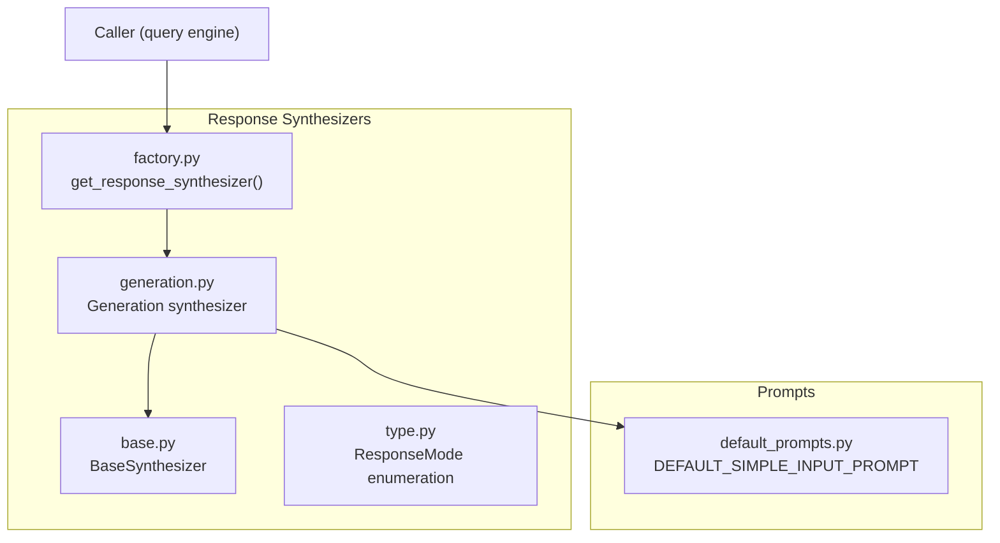
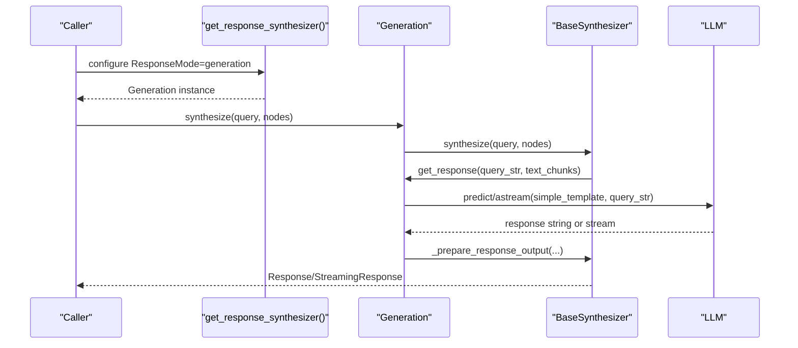
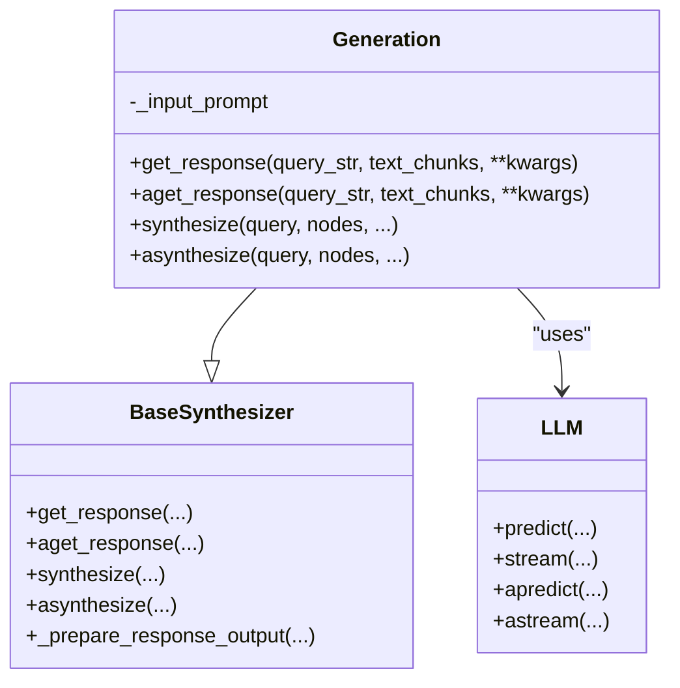
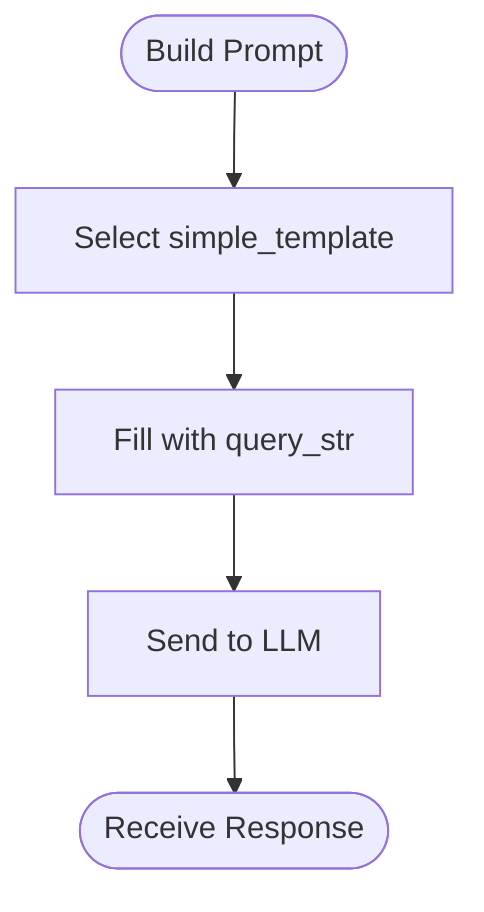
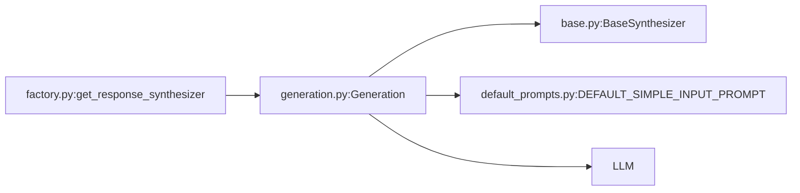

# Generation Synthesis Strategy

<cite>
**Referenced Files in This Document**
- [generation.py](file://llama-index-core/llama_index/core/response_synthesizers/generation.py)
- [base.py](file://llama-index-core/llama_index/core/response_synthesizers/base.py)
- [factory.py](file://llama-index-core/llama_index/core/response_synthesizers/factory.py)
- [default_prompts.py](file://llama-index-core/llama_index/core/prompts/default_prompts.py)
- [type.py](file://llama-index-core/llama_index/core/response_synthesizers/type.py)
- [generation.md](file://docs/api_reference/api_reference/response_synthesizers/generation.md)
</cite>

## Table of Contents
1. [Introduction](#introduction)
2. [Project Structure](#project-structure)
3. [Core Components](#core-components)
4. [Architecture Overview](#architecture-overview)
5. [Detailed Component Analysis](#detailed-component-analysis)
6. [Dependency Analysis](#dependency-analysis)
7. [Performance Considerations](#performance-considerations)
8. [Troubleshooting Guide](#troubleshooting-guide)
9. [Conclusion](#conclusion)

## Introduction
This document explains the Generation synthesis strategy for direct response generation from a query without iterative refinement or hierarchical processing. The approach ignores retrieved context and instructs the LLM to generate a response directly from the query string. It is ideal for scenarios requiring speed and simplicity, where the query is self-contained or the LLM’s general knowledge suffices.

## Project Structure
The Generation strategy is implemented as a response synthesizer within the core module and integrated via a factory that selects the appropriate synthesizer based on configuration.

**Diagram sources**
- [generation.py](file://llama-index-core/llama_index/core/response_synthesizers/generation.py#L29-L189)
- [base.py](file://llama-index-core/llama_index/core/response_synthesizers/base.py#L53-L322)
- [factory.py](file://llama-index-core/llama_index/core/response_synthesizers/factory.py#L33-L152)
- [type.py](file://llama-index-core/llama_index/core/response_synthesizers/type.py#L4-L58)
- [default_prompts.py](file://llama-index-core/llama_index/core/prompts/default_prompts.py#L428-L431)

**Section sources**
- [generation.py](file://llama-index-core/llama_index/core/response_synthesizers/generation.py#L1-L189)
- [base.py](file://llama-index-core/llama_index/core/response_synthesizers/base.py#L1-L322)
- [factory.py](file://llama-index-core/llama_index/core/response_synthesizers/factory.py#L1-L152)
- [default_prompts.py](file://llama-index-core/llama_index/core/prompts/default_prompts.py#L1-L546)
- [type.py](file://llama-index-core/llama_index/core/response_synthesizers/type.py#L1-L58)

## Core Components
- Generation synthesizer: Implements direct generation by ignoring retrieved context and passing only the query string to the LLM using a simple prompt.
- BaseSynthesizer: Provides shared orchestration, streaming support, and response wrapping logic.
- Factory: Selects the Generation synthesizer when ResponseMode is set to generation.
- Default prompt: Uses a minimal template that forwards the query string to the LLM.

Key behaviors:
- Ignores text_chunks and previous responses.
- Supports synchronous and asynchronous generation.
- Supports streaming and non-streaming modes.
- Wraps outputs into Response, StreamingResponse, or PydanticResponse depending on LLM type and output.

**Section sources**
- [generation.py](file://llama-index-core/llama_index/core/response_synthesizers/generation.py#L29-L189)
- [base.py](file://llama-index-core/llama_index/core/response_synthesizers/base.py#L145-L191)
- [factory.py](file://llama-index-core/llama_index/core/response_synthesizers/factory.py#L112-L119)
- [default_prompts.py](file://llama-index-core/llama_index/core/prompts/default_prompts.py#L428-L431)
- [type.py](file://llama-index-core/llama_index/core/response_synthesizers/type.py#L39-L40)

## Architecture Overview
The Generation strategy sits behind a unified interface and delegates all work to the configured LLM with a minimal prompt.

**Diagram sources**
- [factory.py](file://llama-index-core/llama_index/core/response_synthesizers/factory.py#L112-L119)
- [generation.py](file://llama-index-core/llama_index/core/response_synthesizers/generation.py#L103-L189)
- [base.py](file://llama-index-core/llama_index/core/response_synthesizers/base.py#L192-L322)

## Detailed Component Analysis

### Generation Synthesizer
The Generation class extends BaseSynthesizer and implements direct generation:
- Initialization sets a simple template (DEFAULT_SIMPLE_INPUT_PROMPT) and stores LLM, callback manager, and streaming flag.
- get_response and aget_response ignore text_chunks and previous responses, and call the LLM with the simple template and query string.
- synthesize/asynthesize convert nodes to a content list for metadata collection but do not pass it to the LLM; they still return a response object containing source nodes.

**Diagram sources**
- [generation.py](file://llama-index-core/llama_index/core/response_synthesizers/generation.py#L29-L189)
- [base.py](file://llama-index-core/llama_index/core/response_synthesizers/base.py#L53-L322)

**Section sources**
- [generation.py](file://llama-index-core/llama_index/core/response_synthesizers/generation.py#L29-L189)
- [base.py](file://llama-index-core/llama_index/core/response_synthesizers/base.py#L108-L126)

### Prompt Construction and Templates
- DEFAULT_SIMPLE_INPUT_PROMPT is a minimal template that forwards the query string to the LLM.
- The Generation synthesizer uses this template by default, unless overridden during initialization.
- Other synthesizers use more elaborate templates (e.g., text-qa, refine, summarize), but Generation intentionally keeps it simple.

**Diagram sources**
- [default_prompts.py](file://llama-index-core/llama_index/core/prompts/default_prompts.py#L428-L431)
- [generation.py](file://llama-index-core/llama_index/core/response_synthesizers/generation.py#L46-L48)

**Section sources**
- [default_prompts.py](file://llama-index-core/llama_index/core/prompts/default_prompts.py#L428-L431)
- [generation.py](file://llama-index-core/llama_index/core/response_synthesizers/generation.py#L44-L48)

### Parameter Tuning for Optimal Quality
- LLM selection: Prefer stronger models for complex queries; use smaller models for speed-sensitive applications.
- Streaming: Enable streaming for latency-sensitive UIs; disable for simpler integrations.
- Prompt template: Override simple_template to inject instructions or few-shot examples tailored to your domain.
- Callback manager: Attach instrumentation for tracing and monitoring.
- Output handling: For structured outputs, pair with a StructuredLLM so the synthesizer returns a PydanticResponse.

**Section sources**
- [generation.py](file://llama-index-core/llama_index/core/response_synthesizers/generation.py#L30-L44)
- [base.py](file://llama-index-core/llama_index/core/response_synthesizers/base.py#L145-L191)

### Example Scenarios
- Self-contained query: A query that does not require supporting context (e.g., general knowledge questions).
- Fast prototyping: Rapid iteration where retrieval cost is not justified.
- Hybrid retrieval + generation: Use retrieval to filter context, then apply Generation to produce a concise answer.

Note: The Generation strategy intentionally ignores retrieved context. If context is required, choose a different ResponseMode such as REFINE, COMPACT, or SIMPLE_SUMMARIZE.

**Section sources**
- [type.py](file://llama-index-core/llama_index/core/response_synthesizers/type.py#L7-L15)
- [type.py](file://llama-index-core/llama_index/core/response_synthesizers/type.py#L17-L23)
- [type.py](file://llama-index-core/llama_index/core/response_synthesizers/type.py#L25-L29)
- [generation.py](file://llama-index-core/llama_index/core/response_synthesizers/generation.py#L82-L97)

## Dependency Analysis
The Generation synthesizer depends on:
- BaseSynthesizer for orchestration and response wrapping.
- LLM for inference.
- Default prompt template for minimal prompting.
- Factory for instantiation when ResponseMode is generation.

**Diagram sources**
- [factory.py](file://llama-index-core/llama_index/core/response_synthesizers/factory.py#L112-L119)
- [generation.py](file://llama-index-core/llama_index/core/response_synthesizers/generation.py#L29-L44)
- [base.py](file://llama-index-core/llama_index/core/response_synthesizers/base.py#L53-L84)
- [default_prompts.py](file://llama-index-core/llama_index/core/prompts/default_prompts.py#L428-L431)

**Section sources**
- [factory.py](file://llama-index-core/llama_index/core/response_synthesizers/factory.py#L33-L152)
- [generation.py](file://llama-index-core/llama_index/core/response_synthesizers/generation.py#L29-L44)
- [base.py](file://llama-index-core/llama_index/core/response_synthesizers/base.py#L53-L84)
- [default_prompts.py](file://llama-index-core/llama_index/core/prompts/default_prompts.py#L428-L431)

## Performance Considerations
- Speed: Generation avoids iterative refinement and hierarchical processing, minimizing LLM calls and latency.
- Memory: No accumulation or merging of chunks; memory footprint remains constant regardless of node count.
- Throughput: Fewer model calls improve throughput, especially with streaming enabled.
- Accuracy trade-off: Quality depends on the LLM’s general knowledge and the simplicity of the prompt. For complex tasks requiring deep grounding, consider COMPACT or REFINE modes.

[No sources needed since this section provides general guidance]

## Troubleshooting Guide
- Empty nodes: When no nodes are provided, BaseSynthesizer returns an empty response or an empty streaming response depending on the streaming setting.
- Streaming vs non-streaming: Ensure the LLM supports streaming if enabled; otherwise, fallback to non-streaming mode.
- Structured outputs: If using a StructuredLLM, confirm the output conforms to the expected schema; otherwise, the synthesizer will raise an error.
- Prompt clarity: If responses are off-topic, override simple_template to include explicit instructions or examples.

**Section sources**
- [base.py](file://llama-index-core/llama_index/core/response_synthesizers/base.py#L206-L226)
- [base.py](file://llama-index-core/llama_index/core/response_synthesizers/base.py#L271-L291)
- [base.py](file://llama-index-core/llama_index/core/response_synthesizers/base.py#L188-L190)
- [generation.py](file://llama-index-core/llama_index/core/response_synthesizers/generation.py#L44-L48)

## Conclusion
The Generation synthesis strategy offers a fast, direct path to response generation by bypassing iterative refinement and hierarchical processing. It is well-suited for self-contained queries and environments prioritizing speed and simplicity. For tasks requiring grounded reasoning or synthesis across multiple contexts, consider COMPACT, REFINE, or SIMPLE_SUMMARIZE modes.

[No sources needed since this section summarizes without analyzing specific files]