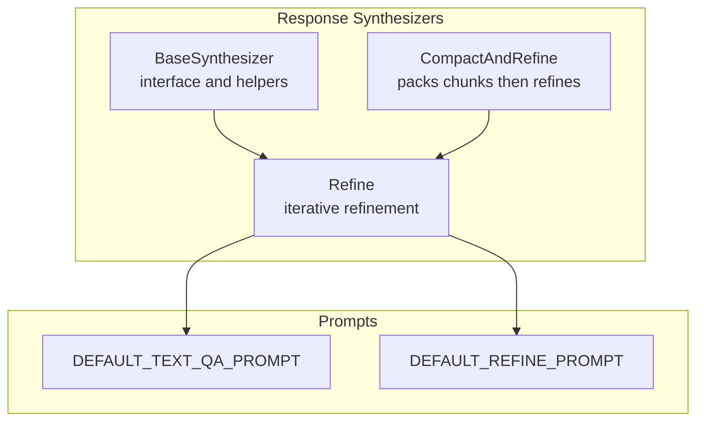
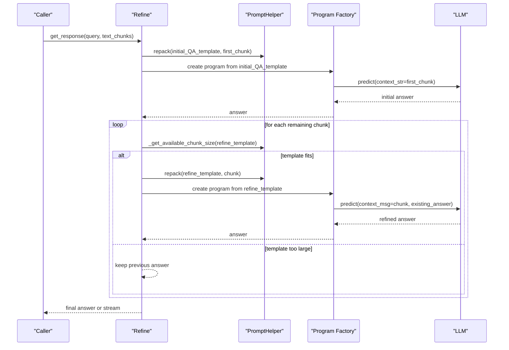
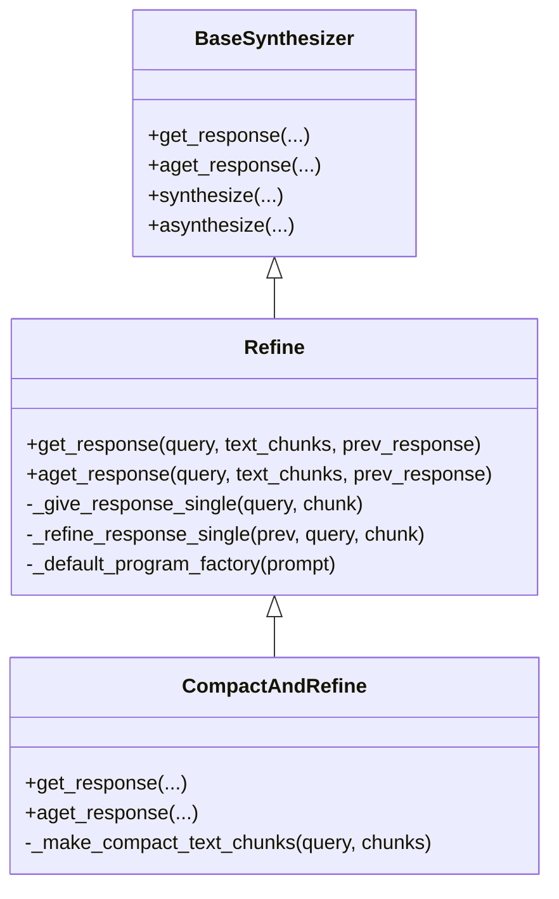
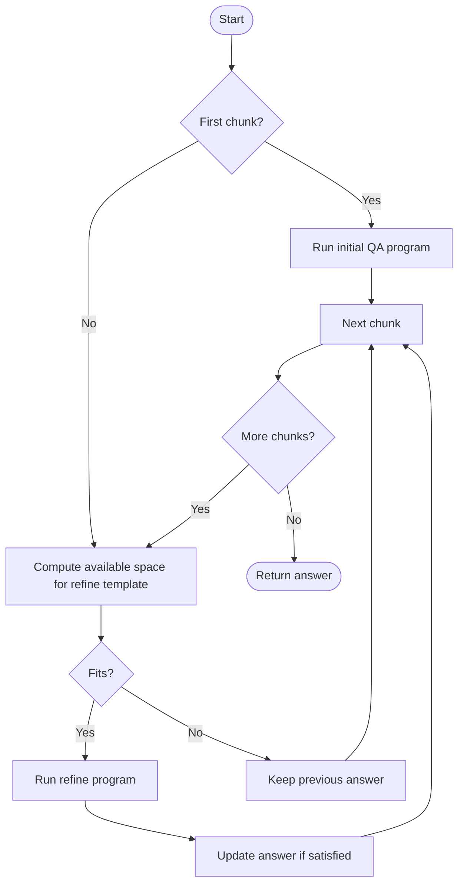
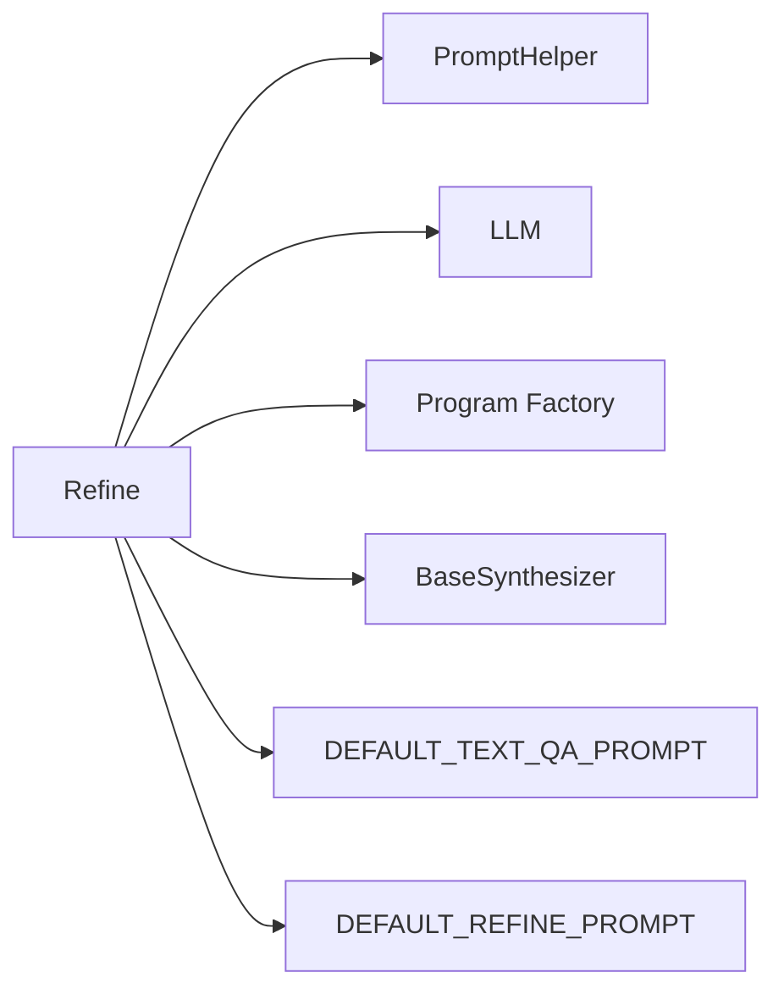

# Refine Synthesis Strategy

<cite>
**Referenced Files in This Document**
- [refine.py](file://llama-index-core/llama_index/core/response_synthesizers/refine.py)
- [base.py](file://llama-index-core/llama_index/core/response_synthesizers/base.py)
- [compact_and_refine.py](file://llama-index-core/llama_index/core/response_synthesizers/compact_and_refine.py)
- [default_prompts.py](file://llama-index-core/llama_index/core/prompts/default_prompts.py)
- [test_refine.py](file://llama-index-core/tests/response_synthesizers/test_refine.py)
</cite>

## Table of Contents
1. [Introduction](#introduction)
2. [Project Structure](#project-structure)
3. [Core Components](#core-components)
4. [Architecture Overview](#architecture-overview)
5. [Detailed Component Analysis](#detailed-component-analysis)
6. [Dependency Analysis](#dependency-analysis)
7. [Performance Considerations](#performance-considerations)
8. [Troubleshooting Guide](#troubleshooting-guide)
9. [Conclusion](#conclusion)

## Introduction
This document explains the Refine synthesis strategy used to iteratively process nodes and update a response as each new context chunk becomes available. The approach maintains context from previous iterations by refining the existing answer with incremental information, ensuring that later chunks can improve earlier answers when beneficial. The document covers the algorithm flow, parameter configuration (initial response templates and refinement prompts), practical usage scenarios, performance characteristics, and memory considerations.

## Project Structure
The Refine synthesis strategy is implemented in the response synthesizers module. The primary implementation resides in a dedicated class that inherits from a base synthesizer interface. Supporting components include:
- The Refine class implementing the iterative refinement logic
- A base synthesizer class defining the common interface and response preparation
- A compact-and-refine variant that packs multiple chunks before refining
- Default prompt templates for initial QA and refinement steps
- Tests validating behavior under structured answer filtering

**Diagram sources**
- [refine.py](file://llama-index-core/llama_index/core/response_synthesizers/refine.py#L108-L522)
- [base.py](file://llama-index-core/llama_index/core/response_synthesizers/base.py#L53-L322)
- [compact_and_refine.py](file://llama-index-core/llama_index/core/response_synthesizers/compact_and_refine.py#L11-L58)
- [default_prompts.py](file://llama-index-core/llama_index/core/prompts/default_prompts.py#L81-L111)

**Section sources**
- [refine.py](file://llama-index-core/llama_index/core/response_synthesizers/refine.py#L108-L522)
- [base.py](file://llama-index-core/llama_index/core/response_synthesizers/base.py#L53-L322)
- [compact_and_refine.py](file://llama-index-core/llama_index/core/response_synthesizers/compact_and_refine.py#L11-L58)
- [default_prompts.py](file://llama-index-core/llama_index/core/prompts/default_prompts.py#L81-L111)

## Core Components
- Refine: Implements iterative refinement across text chunks. It starts with an initial QA prompt for the first chunk and then refines the existing answer with each subsequent chunk.
- BaseSynthesizer: Provides shared functionality for preparing responses, handling streaming, and managing LLM and prompt helper integration.
- CompactAndRefine: Packs multiple chunks into a smaller set before applying the refine strategy, reducing iteration overhead while preserving context.
- StructuredRefineResponse: Defines the structured output schema for refined answers, including a satisfaction flag indicating whether the current chunk contributed meaningfully.
- Default prompts: Provide the initial QA prompt and the refinement prompt used by default.

Key constructor parameters and behaviors:
- LLM selection and callback management
- Prompt templates for initial QA and refinement
- Structured answer filtering toggle and program factory
- Streaming mode and verbosity flags
- Output class for structured responses

**Section sources**
- [refine.py](file://llama-index-core/llama_index/core/response_synthesizers/refine.py#L108-L147)
- [base.py](file://llama-index-core/llama_index/core/response_synthesizers/base.py#L56-L84)
- [compact_and_refine.py](file://llama-index-core/llama_index/core/response_synthesizers/compact_and_refine.py#L11-L58)
- [default_prompts.py](file://llama-index-core/llama_index/core/prompts/default_prompts.py#L81-L111)
- [test_refine.py](file://llama-index-core/tests/response_synthesizers/test_refine.py#L53-L75)

## Architecture Overview
The Refine strategy orchestrates two prompt templates:
- Initial QA prompt: Used for the first chunk to produce an initial answer
- Refinement prompt: Used for subsequent chunks to update the existing answer with new context

The system iterates over chunks, repacking prompts to fit model constraints and optionally filtering answers via structured programs. Streaming is supported for raw LLM output but not for structured answer filtering.

**Diagram sources**
- [refine.py](file://llama-index-core/llama_index/core/response_synthesizers/refine.py#L163-L348)
- [refine.py](file://llama-index-core/llama_index/core/response_synthesizers/refine.py#L220-L273)
- [refine.py](file://llama-index-core/llama_index/core/response_synthesizers/refine.py#L275-L348)

## Detailed Component Analysis

### Refine Class
The Refine class encapsulates the iterative refinement algorithm:
- Initialization validates incompatible configurations (e.g., streaming with structured filtering)
- get_response drives the loop over chunks, switching between initial QA and refinement
- _give_response_single handles the first chunk using the initial QA template
- _refine_response_single updates the existing answer using the refinement template, repacking prompts to fit model limits
- Streaming mode streams raw LLM output; structured filtering is not supported in streaming
- Asynchronous counterparts mirror synchronous behavior

**Diagram sources**
- [base.py](file://llama-index-core/llama_index/core/response_synthesizers/base.py#L53-L127)
- [refine.py](file://llama-index-core/llama_index/core/response_synthesizers/refine.py#L108-L522)
- [compact_and_refine.py](file://llama-index-core/llama_index/core/response_synthesizers/compact_and_refine.py#L11-L58)

**Section sources**
- [refine.py](file://llama-index-core/llama_index/core/response_synthesizers/refine.py#L108-L147)
- [refine.py](file://llama-index-core/llama_index/core/response_synthesizers/refine.py#L163-L348)
- [refine.py](file://llama-index-core/llama_index/core/response_synthesizers/refine.py#L350-L467)

### Structured Answer Filtering
When enabled, the Refine strategy can filter answers using a structured program that returns a response object containing the answer and a satisfaction flag. The program factory constructs a program bound to the appropriate prompt template. Validation errors are handled gracefully, falling back to the last valid answer or returning an empty response.

**Diagram sources**
- [refine.py](file://llama-index-core/llama_index/core/response_synthesizers/refine.py#L175-L199)
- [refine.py](file://llama-index-core/llama_index/core/response_synthesizers/refine.py#L275-L348)
- [refine.py](file://llama-index-core/llama_index/core/response_synthesizers/refine.py#L469-L521)

**Section sources**
- [refine.py](file://llama-index-core/llama_index/core/response_synthesizers/refine.py#L138-L146)
- [refine.py](file://llama-index-core/llama_index/core/response_synthesizers/refine.py#L201-L218)
- [test_refine.py](file://llama-index-core/tests/response_synthesizers/test_refine.py#L77-L121)

### Parameter Configuration
- Initial QA prompt template: Used for the first chunk to generate an initial answer
- Refinement prompt template: Used for subsequent chunks to refine the existing answer
- Structured answer filtering: Optional; when enabled, the program factory creates a structured program that returns a satisfaction flag
- Streaming mode: Supported for raw LLM output; not supported with structured answer filtering
- Output class: Optional; when provided, the final response can be validated against a schema

Default prompt templates are defined centrally and can be overridden during initialization.

**Section sources**
- [default_prompts.py](file://llama-index-core/llama_index/core/prompts/default_prompts.py#L81-L111)
- [refine.py](file://llama-index-core/llama_index/core/response_synthesizers/refine.py#L111-L136)

### Practical Examples and Use Cases
- Multi-pass summarization: When a query spans multiple documents or long contexts, iterative refinement allows the model to incorporate new evidence progressively, improving coherence and completeness.
- Incremental fact-checking: As new facts arrive, the model refines its answer to reflect updated information, avoiding premature conclusions.
- Structured output alignment: When downstream systems require a specific schema, structured answer filtering ensures the final response adheres to expectations.

These scenarios benefit from iterative refinement because:
- Earlier answers can be corrected or augmented by later chunks
- The system remains robust to out-of-order or partial information
- Structured filtering provides deterministic output formatting

**Section sources**
- [test_refine.py](file://llama-index-core/tests/response_synthesizers/test_refine.py#L77-L121)
- [refine.py](file://llama-index-core/llama_index/core/response_synthesizers/refine.py#L138-L146)

## Dependency Analysis
The Refine strategy depends on:
- Prompt templates for initial QA and refinement
- PromptHelper to repack prompts and enforce token limits
- LLM for generating answers and streaming responses
- Program factory for structured answer filtering
- BaseSynthesizer for response preparation and streaming support

**Diagram sources**
- [refine.py](file://llama-index-core/llama_index/core/response_synthesizers/refine.py#L108-L147)
- [base.py](file://llama-index-core/llama_index/core/response_synthesizers/base.py#L56-L84)
- [default_prompts.py](file://llama-index-core/llama_index/core/prompts/default_prompts.py#L81-L111)

**Section sources**
- [refine.py](file://llama-index-core/llama_index/core/response_synthesizers/refine.py#L108-L147)
- [base.py](file://llama-index-core/llama_index/core/response_synthesizers/base.py#L56-L84)

## Performance Considerations
- Iteration cost: Each chunk incurs at least one LLM call (initial QA or refine). For many small chunks, total latency increases linearly with chunk count.
- Prompt packing: PromptHelper repacks prompts to fit model limits, reducing unnecessary truncation and rework.
- Streaming vs. structured filtering: Streaming reduces intermediate buffering but disables structured filtering. Choose based on latency and output format needs.
- Memory footprint: The strategy maintains only the current answer and the most recent chunk context, minimizing memory growth across iterations.
- Compact packing: CompactAndRefine reduces the number of refinement steps by combining chunks beforehand, lowering total LLM calls while preserving context.

[No sources needed since this section provides general guidance]

## Troubleshooting Guide
Common issues and resolutions:
- Incompatible configuration: Enabling both streaming and structured answer filtering raises an error. Disable one or the other.
- Program factory misuse: A program factory requires structured answer filtering to be enabled; otherwise, a configuration error is raised.
- Empty responses: If no chunk produces a satisfied answer, the system returns an empty response string. Verify prompt templates and chunk sizes.
- Validation errors: Structured programs may fail validation; the system logs warnings and falls back to the last valid answer or empty response.

**Section sources**
- [refine.py](file://llama-index-core/llama_index/core/response_synthesizers/refine.py#L138-L146)
- [test_refine.py](file://llama-index-core/tests/response_synthesizers/test_refine.py#L62-L75)
- [refine.py](file://llama-index-core/llama_index/core/response_synthesizers/refine.py#L249-L252)
- [refine.py](file://llama-index-core/llama_index/core/response_synthesizers/refine.py#L329-L332)

## Conclusion
The Refine synthesis strategy offers a robust, iterative approach to building high-quality answers from multiple text chunks. By maintaining and updating the response incrementally, it improves accuracy and coherence, especially for complex queries spanning diverse or lengthy contexts. Proper configuration of prompts, structured filtering, and streaming enables balancing quality, latency, and output format requirements. For scenarios requiring fewer refinement passes, CompactAndRefine provides an efficient alternative by packing chunks before refining.