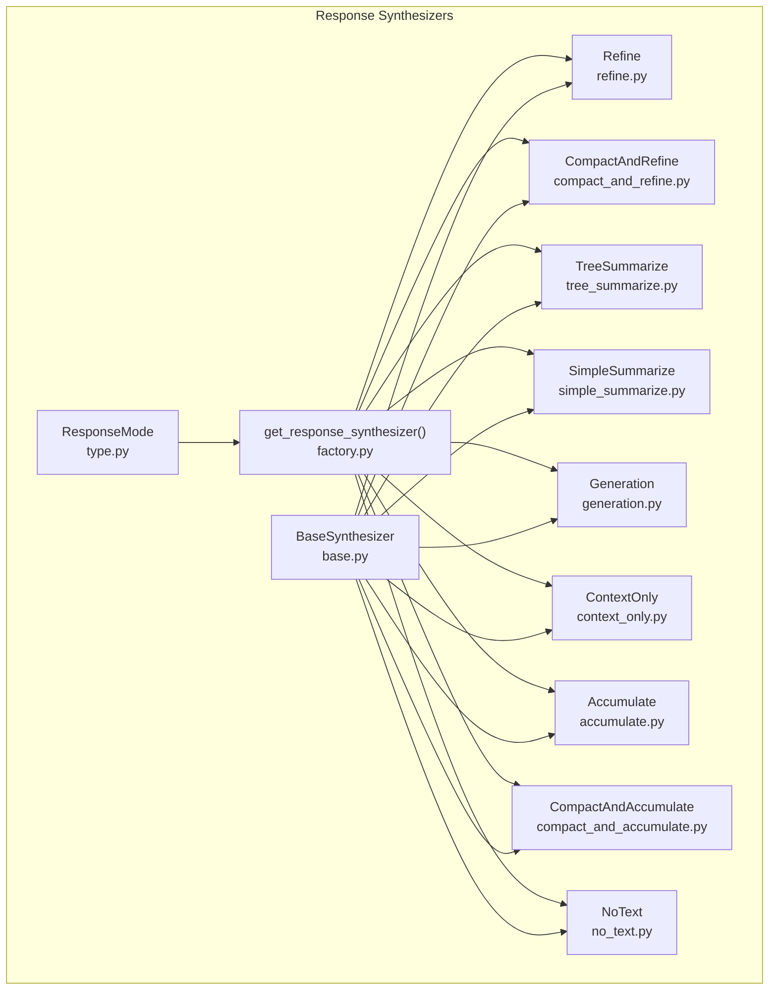
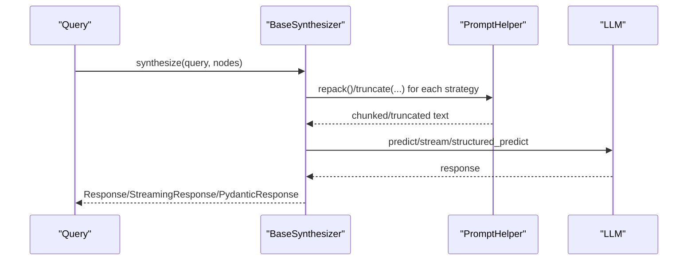
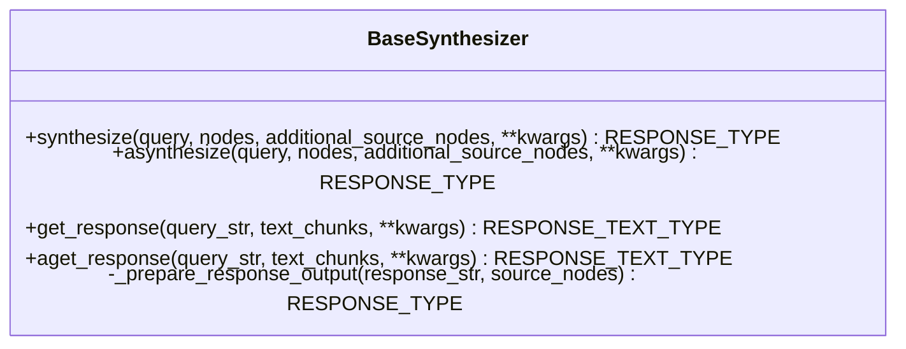
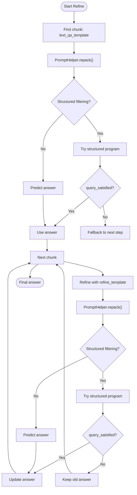
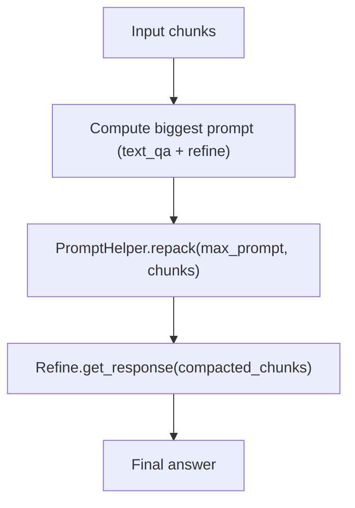
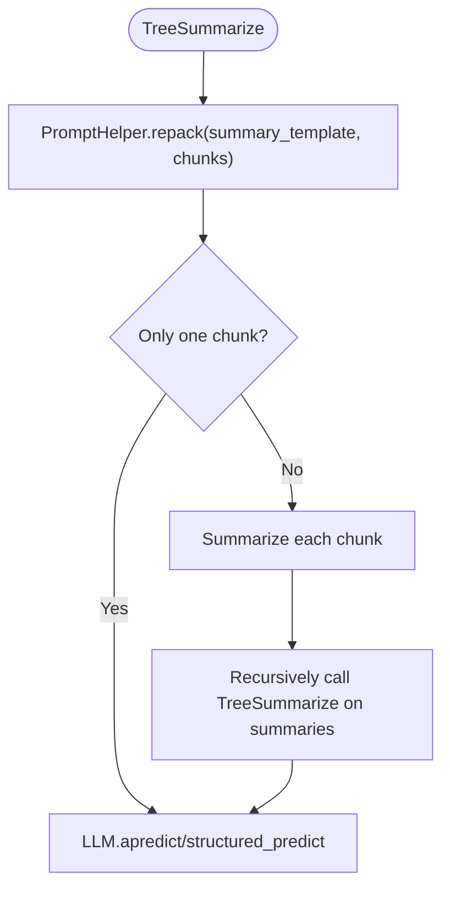
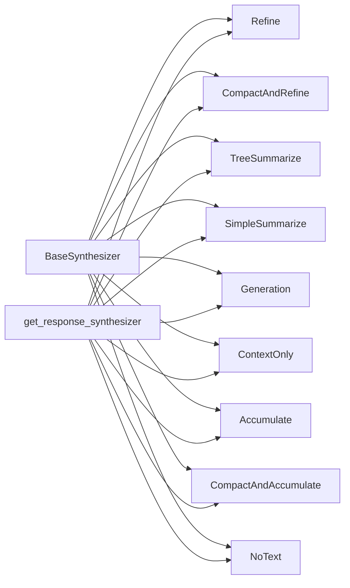

# Response Synthesizers

<cite>
**Referenced Files in This Document**
- [base.py](file://llama-index-core/llama_index/core/response_synthesizers/base.py)
- [type.py](file://llama-index-core/llama_index/core/response_synthesizers/type.py)
- [factory.py](file://llama-index-core/llama_index/core/response_synthesizers/factory.py)
- [refine.py](file://llama-index-core/llama_index/core/response_synthesizers/refine.py)
- [tree_summarize.py](file://llama-index-core/llama_index/core/response_synthesizers/tree_summarize.py)
- [simple_summarize.py](file://llama-index-core/llama_index/core/response_synthesizers/simple_summarize.py)
- [generation.py](file://llama-index-core/llama_index/core/response_synthesizers/generation.py)
- [context_only.py](file://llama-index-core/llama_index/core/response_synthesizers/context_only.py)
- [accumulate.py](file://llama-index-core/llama_index/core/response_synthesizers/accumulate.py)
- [compact_and_refine.py](file://llama-index-core/llama_index/core/response_synthesizers/compact_and_refine.py)
- [compact_and_accumulate.py](file://llama-index-core/llama_index/core/response_synthesizers/compact_and_accumulate.py)
- [no_text.py](file://llama-index-core/llama_index/core/response_synthesizers/no_text.py)
</cite>

## Table of Contents
1. [Introduction](#introduction)
2. [Project Structure](#project-structure)
3. [Core Components](#core-components)
4. [Architecture Overview](#architecture-overview)
5. [Detailed Component Analysis](#detailed-component-analysis)
6. [Dependency Analysis](#dependency-analysis)
7. [Performance Considerations](#performance-considerations)
8. [Troubleshooting Guide](#troubleshooting-guide)
9. [Conclusion](#conclusion)

## Introduction
This document explains the response synthesis system in LlamaIndex. It covers the BaseSynthesizer interface, the ResponseMode enumeration, and concrete synthesis strategies: refine, compact-and-refine, tree summarize, simple summarize, generation, context-only, accumulate, compact-and-accumulate, and no-text. It describes how synthesizers process retrieved nodes, manage context windows, and generate final responses. It also provides configuration guidance, examples of custom synthesizers, and practical advice for memory management, token limits, and performance trade-offs.

## Project Structure
The response synthesizers live under the core module and expose a unified interface for different strategies. The factory function constructs the appropriate synthesizer based on ResponseMode and shared configuration.

**Diagram sources**
- [base.py](file://llama-index-core/llama_index/core/response_synthesizers/base.py#L53-L322)
- [type.py](file://llama-index-core/llama_index/core/response_synthesizers/type.py#L4-L58)
- [factory.py](file://llama-index-core/llama_index/core/response_synthesizers/factory.py#L33-L152)
- [refine.py](file://llama-index-core/llama_index/core/response_synthesizers/refine.py#L108-L522)
- [compact_and_refine.py](file://llama-index-core/llama_index/core/response_synthesizers/compact_and_refine.py#L11-L58)
- [tree_summarize.py](file://llama-index-core/llama_index/core/response_synthesizers/tree_summarize.py#L17-L231)
- [simple_summarize.py](file://llama-index-core/llama_index/core/response_synthesizers/simple_summarize.py#L15-L110)
- [generation.py](file://llama-index-core/llama_index/core/response_synthesizers/generation.py#L29-L189)
- [context_only.py](file://llama-index-core/llama_index/core/response_synthesizers/context_only.py#L8-L31)
- [accumulate.py](file://llama-index-core/llama_index/core/response_synthesizers/accumulate.py#L18-L152)
- [compact_and_accumulate.py](file://llama-index-core/llama_index/core/response_synthesizers/compact_and_accumulate.py#L8-L56)
- [no_text.py](file://llama-index-core/llama_index/core/response_synthesizers/no_text.py#L8-L31)

**Section sources**
- [base.py](file://llama-index-core/llama_index/core/response_synthesizers/base.py#L53-L322)
- [type.py](file://llama-index-core/llama_index/core/response_synthesizers/type.py#L4-L58)
- [factory.py](file://llama-index-core/llama_index/core/response_synthesizers/factory.py#L33-L152)

## Core Components
- BaseSynthesizer: Abstract interface defining get_response and aget_response, plus orchestration via synthesize/asynthesize. It handles callback dispatching, streaming, structured output, and metadata attachment to responses.
- ResponseMode: Enumeration enumerating supported synthesis strategies.
- Factory: get_response_synthesizer builds the concrete synthesizer from configuration and ResponseMode.

Key responsibilities:
- Unified synthesis API: synthesize/asynthesize wrap retrieval results and LLM calls, returning standardized response objects.
- Context window management: Uses PromptHelper to repack/truncate text chunks to fit model constraints.
- Streaming and structured outputs: Supports both streaming and structured LLM outputs via output_cls.
- Metadata propagation: Attaches node metadata to final responses.

**Section sources**
- [base.py](file://llama-index-core/llama_index/core/response_synthesizers/base.py#L53-L322)
- [type.py](file://llama-index-core/llama_index/core/response_synthesizers/type.py#L4-L58)
- [factory.py](file://llama-index-core/llama_index/core/response_synthesizers/factory.py#L33-L152)

## Architecture Overview
The synthesis pipeline converts retrieved nodes into a final response using a selected strategy. The BaseSynthesizer orchestrates:
- Preparing text_chunks from nodes
- Applying strategy-specific logic
- Managing context window constraints
- Returning a standardized response object

**Diagram sources**
- [base.py](file://llama-index-core/llama_index/core/response_synthesizers/base.py#L192-L322)
- [refine.py](file://llama-index-core/llama_index/core/response_synthesizers/refine.py#L220-L348)
- [tree_summarize.py](file://llama-index-core/llama_index/core/response_synthesizers/tree_summarize.py#L61-L133)
- [simple_summarize.py](file://llama-index-core/llama_index/core/response_synthesizers/simple_summarize.py#L41-L74)
- [generation.py](file://llama-index-core/llama_index/core/response_synthesizers/generation.py#L55-L97)

## Detailed Component Analysis

### BaseSynthesizer
- Initialization: Accepts LLM, CallbackManager, PromptHelper, streaming flag, optional output_cls, and empty response fallback.
- Orchestration: synthesize/asynthesize normalize inputs, handle empty nodes, and delegate to get_response/aget_response. They attach source nodes and metadata to the final response.
- Output preparation: Converts raw LLM output into Response, StreamingResponse, AsyncStreamingResponse, or PydanticResponse depending on output_cls and return type.
- Context handling: Delegates chunking/truncation to PromptHelper per strategy.

**Diagram sources**
- [base.py](file://llama-index-core/llama_index/core/response_synthesizers/base.py#L53-L322)

**Section sources**
- [base.py](file://llama-index-core/llama_index/core/response_synthesizers/base.py#L53-L322)

### ResponseMode
Enumerates strategies:
- refine: Iteratively refine a response across chunks.
- compact: Combine chunks to fill context, then refine.
- simple_summarize: Merge all chunks and summarize once.
- tree_summarize: Bottom-up recursive summarization.
- generation: Ignore context and generate from query alone.
- no_text: Return empty string.
- context_only: Concatenate retrieved chunks.
- accumulate: Generate per-chunk responses and concatenate.
- compact_accumulate: Compact then accumulate.

**Section sources**
- [type.py](file://llama-index-core/llama_index/core/response_synthesizers/type.py#L4-L58)

### Refine
- Behavior: First QA on the first chunk; then iteratively refine with subsequent chunks using a refine prompt. Supports structured output and streaming (with constraints).
- Context window: Uses PromptHelper to repack chunks for each step; checks available chunk size to avoid oversized prompts.
- Structured filtering: Optional program-based filtering to accept/reject answers based on a structured schema.

**Diagram sources**
- [refine.py](file://llama-index-core/llama_index/core/response_synthesizers/refine.py#L163-L348)

**Section sources**
- [refine.py](file://llama-index-core/llama_index/core/response_synthesizers/refine.py#L108-L522)

### CompactAndRefine
- Behavior: Pre-compacts chunks to maximize context window utilization, then applies Refine logic on the compacted chunks.
- Implementation: Computes the largest prompt between text_qa and refine templates, then repacks using PromptHelper.

**Diagram sources**
- [compact_and_refine.py](file://llama-index-core/llama_index/core/response_synthesizers/compact_and_refine.py#L50-L58)
- [refine.py](file://llama-index-core/llama_index/core/response_synthesizers/refine.py#L163-L348)

**Section sources**
- [compact_and_refine.py](file://llama-index-core/llama_index/core/response_synthesizers/compact_and_refine.py#L11-L58)

### TreeSummarize
- Behavior: Bottom-up recursive summarization. At each level, repack chunks to fill the context window, summarize each chunk, and recurse until one summary remains.
- Async option: Can run summarization tasks concurrently using asyncio.gather or a compatibility wrapper.

**Diagram sources**
- [tree_summarize.py](file://llama-index-core/llama_index/core/response_synthesizers/tree_summarize.py#L61-L133)

**Section sources**
- [tree_summarize.py](file://llama-index-core/llama_index/core/response_synthesizers/tree_summarize.py#L17-L231)

### SimpleSummarize
- Behavior: Concatenates all chunks into one and truncates to fit the text-qa prompt. Calls LLM once to produce a summary.
- Limitation: Fails if the concatenated text exceeds context window.

**Section sources**
- [simple_summarize.py](file://llama-index-core/llama_index/core/response_synthesizers/simple_summarize.py#L15-L110)

### Generation
- Behavior: Ignores retrieved chunks; generates a response directly from the query using a simple template.
- Use cases: Zero-shot generation or when context is irrelevant.

**Section sources**
- [generation.py](file://llama-index-core/llama_index/core/response_synthesizers/generation.py#L29-L189)

### ContextOnly
- Behavior: Returns the concatenation of all retrieved chunks without invoking the LLM.

**Section sources**
- [context_only.py](file://llama-index-core/llama_index/core/response_synthesizers/context_only.py#L8-L31)

### Accumulate
- Behavior: Applies the same prompt to each chunk independently, collects responses, and concatenates them with separators. Does not support streaming.
- Async option: Can run per-chunk tasks concurrently.

**Section sources**
- [accumulate.py](file://llama-index-core/llama_index/core/response_synthesizers/accumulate.py#L18-L152)

### CompactAndAccumulate
- Behavior: Pre-compacts chunks to maximize context window, then Accumulate strategy is applied to the compacted chunks.

**Section sources**
- [compact_and_accumulate.py](file://llama-index-core/llama_index/core/response_synthesizers/compact_and_accumulate.py#L8-L56)

### NoText
- Behavior: Returns an empty string. Useful when downstream components handle source nodes directly.

**Section sources**
- [no_text.py](file://llama-index-core/llama_index/core/response_synthesizers/no_text.py#L8-L31)

## Dependency Analysis
- BaseSynthesizer depends on:
  - LLM for prediction/streaming/structured prediction
  - PromptHelper for repacking/truncation
  - CallbackManager and instrumentation for events
- Strategies inherit from BaseSynthesizer and override get_response/aget_response.
- Factory composes synthesizers from configuration and ResponseMode.

**Diagram sources**
- [base.py](file://llama-index-core/llama_index/core/response_synthesizers/base.py#L53-L322)
- [factory.py](file://llama-index-core/llama_index/core/response_synthesizers/factory.py#L33-L152)

**Section sources**
- [factory.py](file://llama-index-core/llama_index/core/response_synthesizers/factory.py#L33-L152)

## Performance Considerations
- Token limits and context windows:
  - PromptHelper repacks or truncates text to fit model constraints. Strategies like Refine and TreeSummarize rely on repack to stay within limits.
  - SimpleSummarize and ContextOnly bypass repack; they risk exceeding context if chunks are too large.
- Streaming:
  - Supported in Refine (non-structured), Generation, and TreeSummarize. Accumulate explicitly disallows streaming.
- Structured outputs:
  - Some strategies support structured LLM outputs via output_cls. Refine supports structured filtering with a program factory.
- Concurrency:
  - TreeSummarize and Accumulate support asynchronous execution paths to reduce latency.
- Memory:
  - Accumulate and ContextOnly retain all chunk texts; consider compact strategies (CompactAndRefine, CompactAndAccumulate) to reduce memory footprint.
- Cost:
  - Refine and Accumulate make multiple LLM calls; TreeSummarize reduces calls via recursion; Generation ignores context and may be cheaper but less accurate.

[No sources needed since this section provides general guidance]

## Troubleshooting Guide
- Empty or placeholder responses:
  - BaseSynthesizer returns a configured empty response when no nodes are provided. Verify input nodes and ResponseMode selection.
- Validation errors with structured outputs:
  - Refine’s structured programs may raise validation errors; ensure output_cls matches expected schema and consider disabling structured filtering if needed.
- Streaming conflicts:
  - Accumulate does not support streaming. Attempting to enable streaming raises an error.
  - Refine with structured filtering does not support streaming.
- Oversized prompts:
  - If refine templates exceed context, repack may yield zero-sized chunks; the strategy falls back to returning the current answer without refinement.

**Section sources**
- [base.py](file://llama-index-core/llama_index/core/response_synthesizers/base.py#L206-L227)
- [refine.py](file://llama-index-core/llama_index/core/response_synthesizers/refine.py#L138-L146)
- [accumulate.py](file://llama-index-core/llama_index/core/response_synthesizers/accumulate.py#L70-L94)

## Conclusion
LlamaIndex’s response synthesizers provide a flexible, extensible framework for transforming retrieved nodes into coherent answers. Choose a strategy based on accuracy needs, cost, and context window constraints. Use the factory to configure synthesizers with prompts, streaming, and structured outputs. For robust deployments, leverage compact strategies, structured outputs, and concurrency where supported, while monitoring token limits and memory usage.