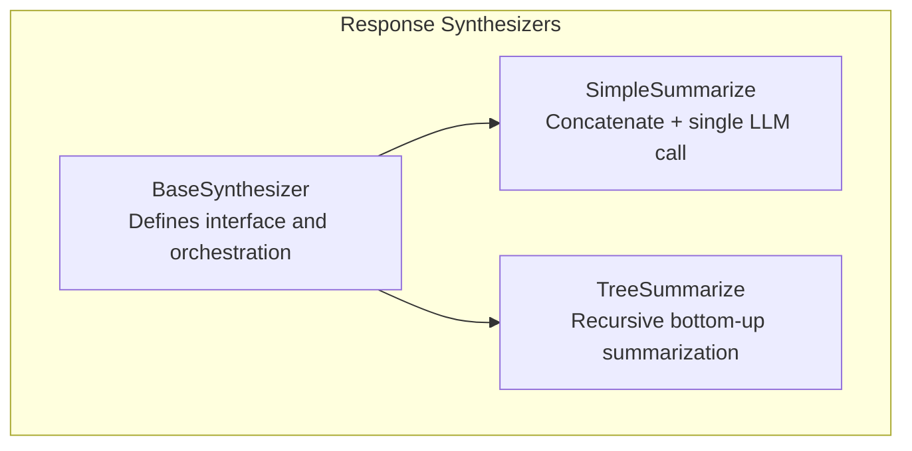
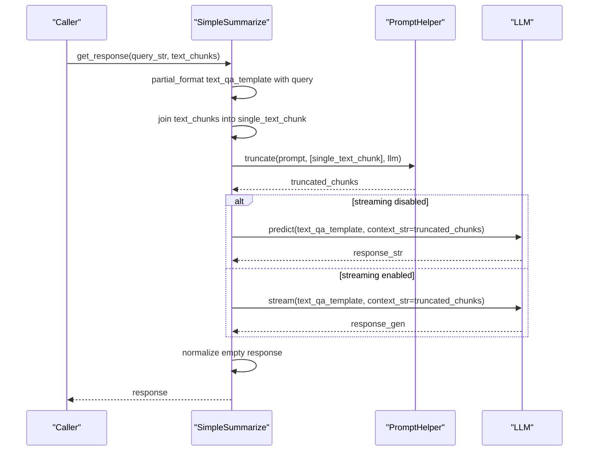
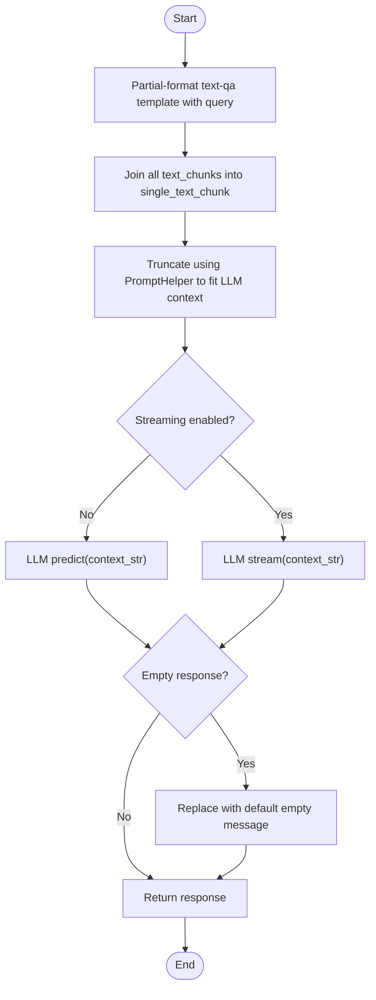
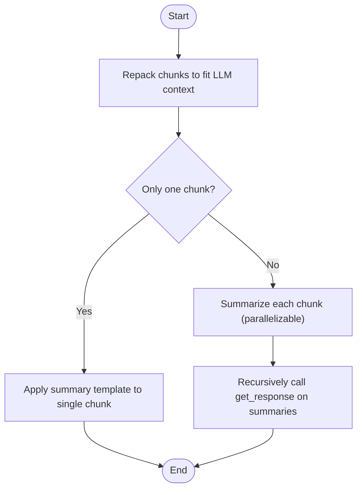
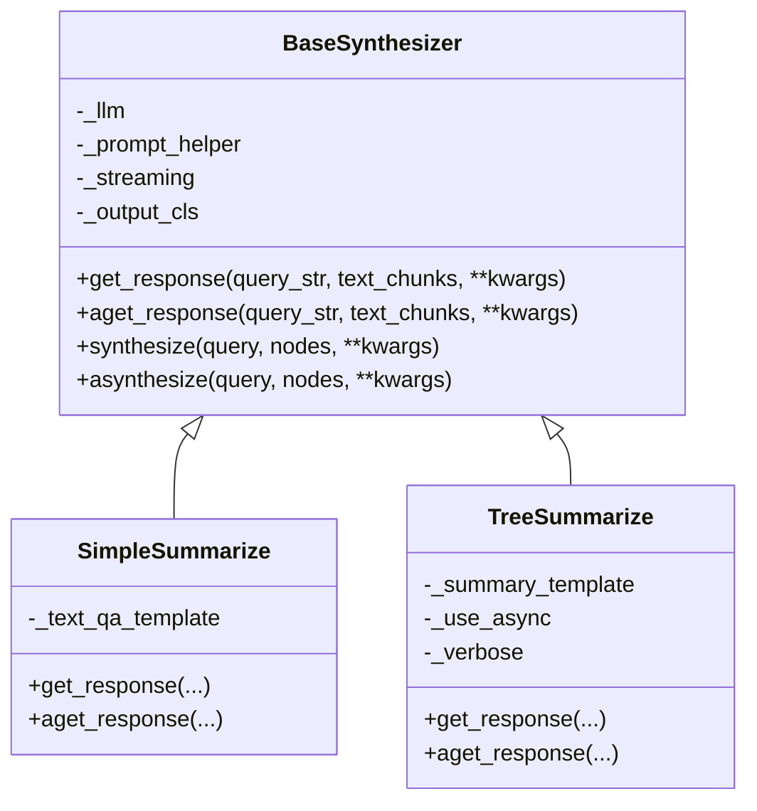
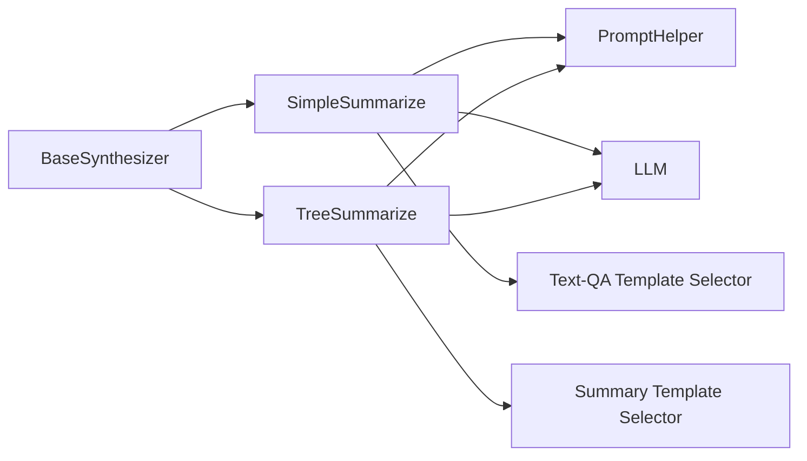

# Simple Summarize Synthesis Strategy

<cite>
**Referenced Files in This Document**
- [simple_summarize.py](file://llama-index-core/llama_index/core/response_synthesizers/simple_summarize.py)
- [tree_summarize.py](file://llama-index-core/llama_index/core/response_synthesizers/tree_summarize.py)
- [base.py](file://llama-index-core/llama_index/core/response_synthesizers/base.py)
- [type.py](file://llama-index-core/llama_index/core/response_synthesizers/type.py)
- [response_synthesizers.md](file://docs/src/content/docs/framework/module_guides/querying/response_synthesizers/response_synthesizers.md)
</cite>

## Table of Contents
1. [Introduction](#introduction)
2. [Project Structure](#project-structure)
3. [Core Components](#core-components)
4. [Architecture Overview](#architecture-overview)
5. [Detailed Component Analysis](#detailed-component-analysis)
6. [Dependency Analysis](#dependency-analysis)
7. [Performance Considerations](#performance-considerations)
8. [Troubleshooting Guide](#troubleshooting-guide)
9. [Conclusion](#conclusion)

## Introduction
This document explains the Simple Summarize synthesis strategy used to generate a single, unified response from all retrieved context. It focuses on the straightforward approach that concatenates all context chunks into one unit and passes them to the LLM with a single prompt call. The document covers the algorithm, prompt templates, configuration parameters, performance characteristics, and practical comparisons with the hierarchical Tree Summarize approach. It also highlights scenarios where simplicity and speed are prioritized over the benefits of recursive summarization.

## Project Structure
The Simple Summarize strategy is implemented as a response synthesizer within the core module. It shares the same base interface as other synthesis strategies and integrates with the broader response synthesis framework.

**Diagram sources**
- [base.py](file://llama-index-core/llama_index/core/response_synthesizers/base.py#L53-L322)
- [simple_summarize.py](file://llama-index-core/llama_index/core/response_synthesizers/simple_summarize.py#L15-L110)
- [tree_summarize.py](file://llama-index-core/llama_index/core/response_synthesizers/tree_summarize.py#L17-L231)

**Section sources**
- [simple_summarize.py](file://llama-index-core/llama_index/core/response_synthesizers/simple_summarize.py#L1-L110)
- [tree_summarize.py](file://llama-index-core/llama_index/core/response_synthesizers/tree_summarize.py#L1-L231)
- [base.py](file://llama-index-core/llama_index/core/response_synthesizers/base.py#L1-L322)
- [type.py](file://llama-index-core/llama_index/core/response_synthesizers/type.py#L1-L58)

## Core Components
- SimpleSummarize: Implements the single-unit summarization approach. It concatenates all text chunks into one string, truncates to fit the LLM’s context window, and generates a single response via a text-qa prompt.
- TreeSummarize: Implements a hierarchical, bottom-up summarization that recursively reduces the number of chunks until a single summary remains.
- BaseSynthesizer: Provides shared behavior including LLM selection, prompt helper integration, streaming support, and response wrapping.
- ResponseMode: Enumerates supported synthesis modes, including SIMPLE_SUMMARIZE and TREE_SUMMARIZE.

Key configuration parameters for Simple Summarize:
- llm: LLM instance used for generation.
- callback_manager: Optional callback manager for instrumentation.
- prompt_helper: Helper for context window management and truncation.
- text_qa_template: Prompt template used for QA-style prompting; defaults to a standard selector.
- streaming: Whether to stream the response from the LLM.

**Section sources**
- [simple_summarize.py](file://llama-index-core/llama_index/core/response_synthesizers/simple_summarize.py#L15-L40)
- [base.py](file://llama-index-core/llama_index/core/response_synthesizers/base.py#L56-L84)
- [type.py](file://llama-index-core/llama_index/core/response_synthesizers/type.py#L25-L29)

## Architecture Overview
The Simple Summarize strategy follows a linear pipeline:
1. Receive a query and a sequence of text chunks.
2. Partial-format the text-qa prompt with the query.
3. Concatenate all chunks into a single string.
4. Truncate the concatenated string to fit the LLM’s context window using the prompt helper.
5. Call the LLM to produce a single response (either a string or a streaming generator).
6. Normalize empty responses and return the result.

**Diagram sources**
- [simple_summarize.py](file://llama-index-core/llama_index/core/response_synthesizers/simple_summarize.py#L41-L109)

## Detailed Component Analysis

### SimpleSummarize Algorithm
- Input: query string and sequence of text chunks.
- Processing:
  - Prepare the text-qa prompt with the query.
  - Join all chunks into one large chunk.
  - Truncate to fit the LLM’s context window.
  - Predict or stream a response.
- Output: String or streaming generator; empty responses are normalized to a default message.

**Diagram sources**
- [simple_summarize.py](file://llama-index-core/llama_index/core/response_synthesizers/simple_summarize.py#L41-L109)

**Section sources**
- [simple_summarize.py](file://llama-index-core/llama_index/core/response_synthesizers/simple_summarize.py#L15-L110)

### TreeSummarize Algorithm (for comparison)
- Input: query string and sequence of text chunks.
- Processing:
  - Repack chunks to fill the LLM context window.
  - If only one chunk remains, apply the summary template to it.
  - Otherwise, summarize each chunk (optionally in parallel), then recursively summarize the summaries.
- Output: Single response generated via iterative summarization.

**Diagram sources**
- [tree_summarize.py](file://llama-index-core/llama_index/core/response_synthesizers/tree_summarize.py#L134-L231)

**Section sources**
- [tree_summarize.py](file://llama-index-core/llama_index/core/response_synthesizers/tree_summarize.py#L17-L231)

### Prompt Templates and Defaults
- SimpleSummarize uses a text-qa prompt selector by default. The template is partial-formatted with the query before being applied to the concatenated context.
- TreeSummarize uses a summary template selector by default and supports structured outputs when configured.

Configuration examples and usage patterns are documented in the response synthesizers guide.

**Section sources**
- [simple_summarize.py](file://llama-index-core/llama_index/core/response_synthesizers/simple_summarize.py#L20-L30)
- [tree_summarize.py](file://llama-index-core/llama_index/core/response_synthesizers/tree_summarize.py#L30-L48)
- [response_synthesizers.md](file://docs/src/content/docs/framework/module_guides/querying/response_synthesizers/response_synthesizers.md#L1-L69)

### Class Relationships

**Diagram sources**
- [base.py](file://llama-index-core/llama_index/core/response_synthesizers/base.py#L53-L322)
- [simple_summarize.py](file://llama-index-core/llama_index/core/response_synthesizers/simple_summarize.py#L15-L110)
- [tree_summarize.py](file://llama-index-core/llama_index/core/response_synthesizers/tree_summarize.py#L17-L231)

## Dependency Analysis
- SimpleSummarize depends on:
  - BaseSynthesizer for shared orchestration and response wrapping.
  - PromptHelper for context window truncation.
  - LLM for prediction or streaming.
  - A default text-qa prompt selector for templating.
- TreeSummarize depends on similar infrastructure but adds:
  - A summary template selector.
  - Optional structured output support.
  - Asynchronous or synchronous recursion over summaries.

**Diagram sources**
- [base.py](file://llama-index-core/llama_index/core/response_synthesizers/base.py#L53-L322)
- [simple_summarize.py](file://llama-index-core/llama_index/core/response_synthesizers/simple_summarize.py#L1-L110)
- [tree_summarize.py](file://llama-index-core/llama_index/core/response_synthesizers/tree_summarize.py#L1-L231)

**Section sources**
- [simple_summarize.py](file://llama-index-core/llama_index/core/response_synthesizers/simple_summarize.py#L1-L110)
- [tree_summarize.py](file://llama-index-core/llama_index/core/response_synthesizers/tree_summarize.py#L1-L231)
- [base.py](file://llama-index-core/llama_index/core/response_synthesizers/base.py#L1-L322)

## Performance Considerations
- Simple Summarize:
  - Pros: Minimal overhead; single LLM call; fast for small to medium concatenated contexts.
  - Cons: Fails or degrades if the concatenated context exceeds the LLM’s context window.
- Tree Summarize:
  - Pros: Handles very large sets of chunks by recursively reducing them; robust against context limits.
  - Cons: Multiple LLM calls; higher latency; complexity increases with depth.

Practical guidance:
- Choose Simple Summarize when the total context length is modest and fits comfortably within the LLM’s context window.
- Prefer Tree Summarize when dealing with extensive documents or many chunks, or when robustness to context overflow is required.

**Section sources**
- [type.py](file://llama-index-core/llama_index/core/response_synthesizers/type.py#L25-L37)
- [simple_summarize.py](file://llama-index-core/llama_index/core/response_synthesizers/simple_summarize.py#L48-L53)
- [tree_summarize.py](file://llama-index-core/llama_index/core/response_synthesizers/tree_summarize.py#L68-L72)

## Troubleshooting Guide
Common issues and resolutions:
- Context window exceeded:
  - Symptom: Truncation occurs or errors during prediction.
  - Resolution: Reduce the number of retrieved chunks, increase LLM context window, or switch to Tree Summarize.
- Empty response:
  - Symptom: Returned default empty message.
  - Resolution: Verify prompt formatting and ensure non-empty context after truncation.
- Streaming behavior:
  - Symptom: Expecting a generator but receiving a string.
  - Resolution: Confirm the streaming flag is set appropriately and that the underlying LLM supports streaming.

Operational tips:
- Use ResponseMode enumeration to select Simple Summarize or Tree Summarize consistently.
- Leverage the provided examples and documentation for correct instantiation and usage.

**Section sources**
- [simple_summarize.py](file://llama-index-core/llama_index/core/response_synthesizers/simple_summarize.py#L69-L74)
- [type.py](file://llama-index-core/llama_index/core/response_synthesizers/type.py#L25-L37)
- [response_synthesizers.md](file://docs/src/content/docs/framework/module_guides/querying/response_synthesizers/response_synthesizers.md#L1-L69)

## Conclusion
Simple Summarize offers a fast, single-call summarization approach suitable for concise contexts that fit within the LLM’s capacity. Its straightforward algorithm and minimal overhead make it ideal for scenarios prioritizing speed and simplicity. For larger or more complex datasets, Tree Summarize provides a robust, hierarchical alternative that scales across many chunks while maintaining quality. Selecting the appropriate strategy depends on context size, performance requirements, and accuracy expectations.