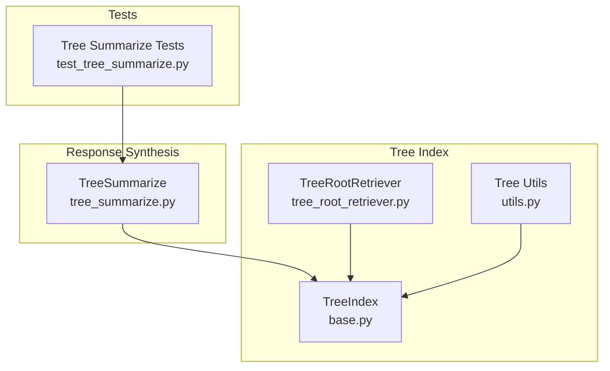
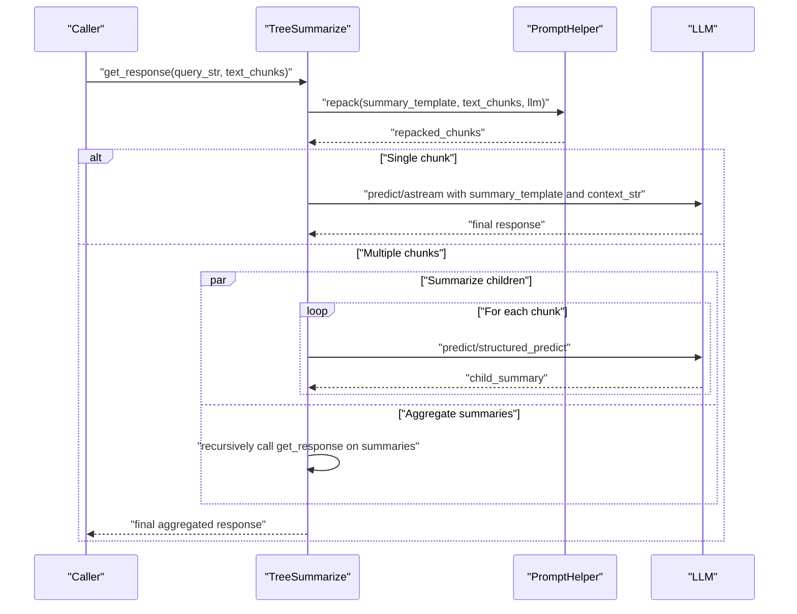
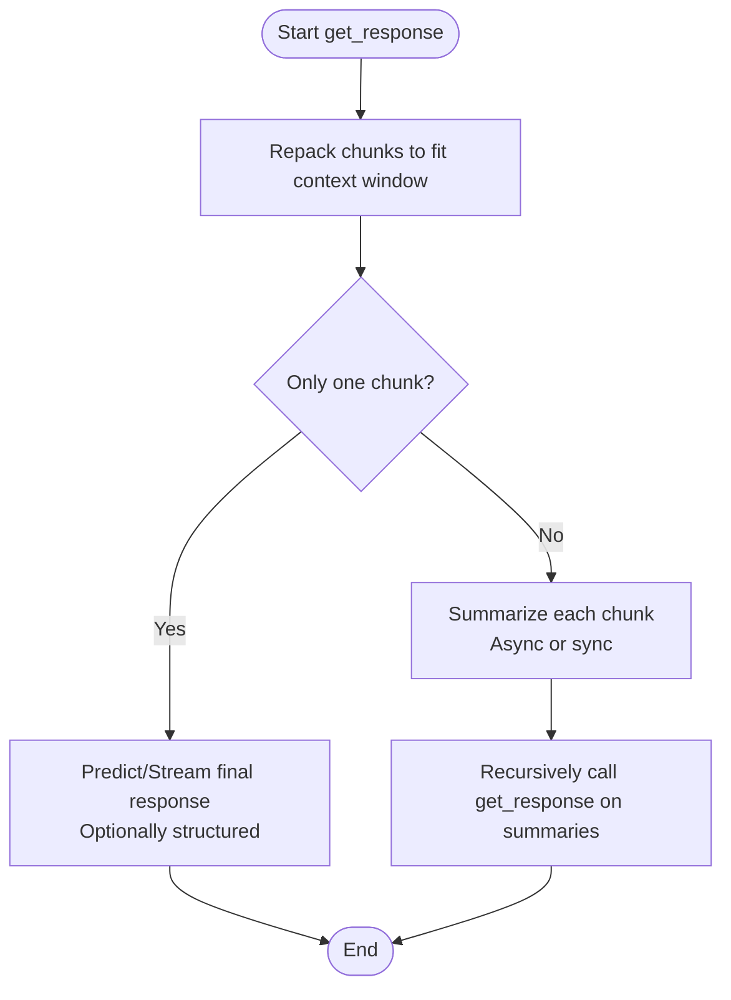
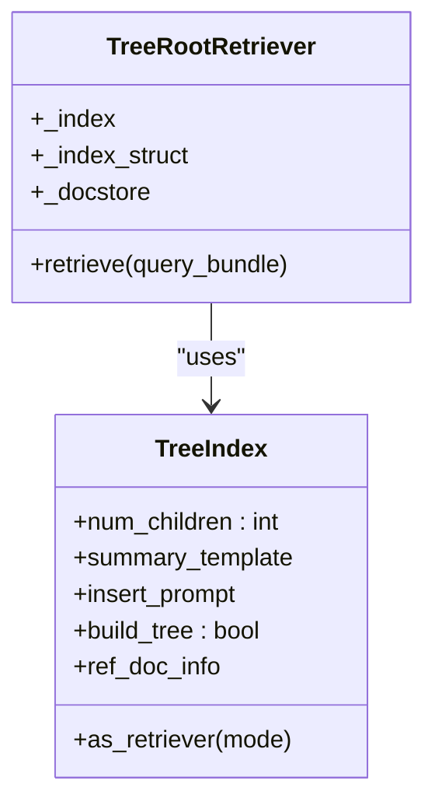
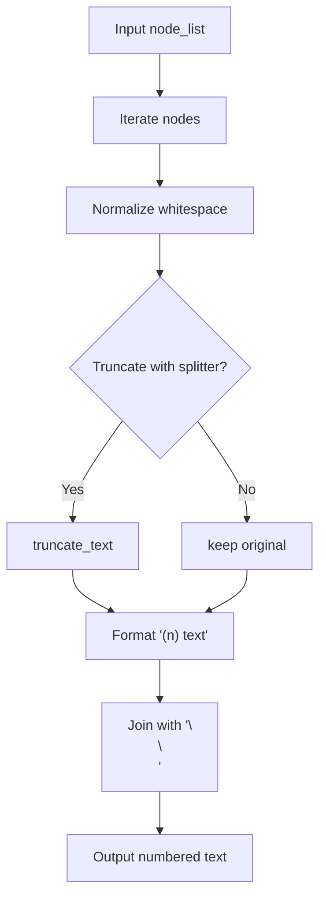
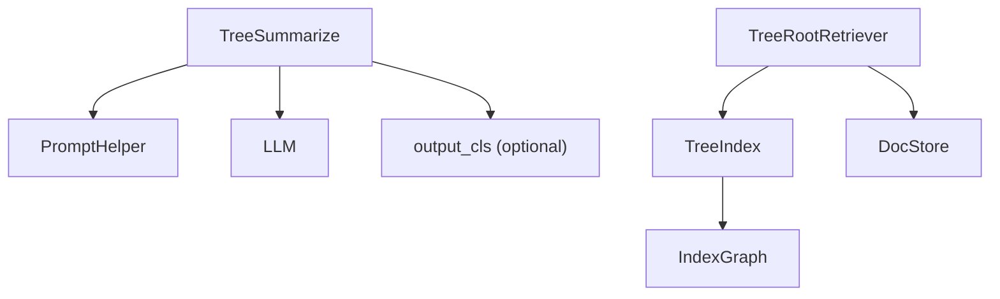

# Tree Summarize Synthesis Strategy

<cite>
**Referenced Files in This Document**
- [tree_summarize.py](file://llama-index-core/llama_index/core/response_synthesizers/tree_summarize.py)
- [base.py](file://llama-index-core/llama_index/core/indices/tree/base.py)
- [tree_root_retriever.py](file://llama-index-core/llama_index/core/indices/tree/tree_root_retriever.py)
- [test_tree_summarize.py](file://llama-index-core/tests/indices/response/test_tree_summarize.py)
- [utils.py](file://llama-index-core/llama_index/core/indices/tree/utils.py)
</cite>

## Table of Contents
1. [Introduction](#introduction)
2. [Project Structure](#project-structure)
3. [Core Components](#core-components)
4. [Architecture Overview](#architecture-overview)
5. [Detailed Component Analysis](#detailed-component-analysis)
6. [Dependency Analysis](#dependency-analysis)
7. [Performance Considerations](#performance-considerations)
8. [Troubleshooting Guide](#troubleshooting-guide)
9. [Conclusion](#conclusion)

## Introduction
This document explains the Tree Summarize synthesis strategy used to produce coherent, hierarchical summaries from large document sets. It focuses on the bottom-up recursive summarization process that leverages a tree index structure to combine summaries from child nodes into parent summaries, culminating in a final response at the root level. The document covers algorithm mechanics, configuration parameters, optimization techniques for large hierarchies, and practical examples demonstrating effectiveness for complex document structures.

## Project Structure
The Tree Summarize synthesis strategy spans several modules:
- Response synthesizer: Implements the recursive bottom-up summarization logic.
- Tree index: Builds and manages the hierarchical tree structure of summaries.
- Retrievers: Provide access to root nodes for direct synthesis.
- Utilities: Support text formatting and numbering for tree-based contexts.

**Diagram sources**
- [tree_summarize.py](file://llama-index-core/llama_index/core/response_synthesizers/tree_summarize.py#L17-L231)
- [base.py](file://llama-index-core/llama_index/core/indices/tree/base.py#L39-L191)
- [tree_root_retriever.py](file://llama-index-core/llama_index/core/indices/tree/tree_root_retriever.py#L16-L51)
- [utils.py](file://llama-index-core/llama_index/core/indices/tree/utils.py#L8-L28)
- [test_tree_summarize.py](file://llama-index-core/tests/indices/response/test_tree_summarize.py#L33-L140)

**Section sources**
- [tree_summarize.py](file://llama-index-core/llama_index/core/response_synthesizers/tree_summarize.py#L17-L231)
- [base.py](file://llama-index-core/llama_index/core/indices/tree/base.py#L39-L191)
- [tree_root_retriever.py](file://llama-index-core/llama_index/core/indices/tree/tree_root_retriever.py#L16-L51)
- [utils.py](file://llama-index-core/llama_index/core/indices/tree/utils.py#L8-L28)
- [test_tree_summarize.py](file://llama-index-core/tests/indices/response/test_tree_summarize.py#L33-L140)

## Core Components
- TreeSummarize: Implements the recursive bottom-up summarization. It repacks input chunks to fit the LLM context window, produces per-chunk summaries, and recursively aggregates summaries until a single response remains. Supports synchronous and asynchronous execution, streaming, and structured outputs via an output class.
- TreeIndex: Constructs a hierarchical index where internal nodes represent summaries of their children, enabling efficient retrieval and synthesis from root nodes.
- TreeRootRetriever: Retrieves root nodes directly for synthesis, bypassing traversal and leveraging precomputed answers stored in the index.
- Tree utilities: Provide helpers to format node lists into numbered text suitable for tree-based prompts.

Key configuration parameters:
- summary_template: Template used to prompt the LLM for each summarization step.
- output_cls: Optional Pydantic model for structured synthesis.
- streaming: Enables streaming responses from the LLM.
- use_async: Enables asynchronous processing of child summaries.
- verbose: Enables diagnostic logging of chunk counts after repacking.

**Section sources**
- [tree_summarize.py](file://llama-index-core/llama_index/core/response_synthesizers/tree_summarize.py#L30-L50)
- [base.py](file://llama-index-core/llama_index/core/indices/tree/base.py#L64-L92)
- [tree_root_retriever.py](file://llama-index-core/llama_index/core/indices/tree/tree_root_retriever.py#L27-L40)
- [utils.py](file://llama-index-core/llama_index/core/indices/tree/utils.py#L8-L28)

## Architecture Overview
The Tree Summarize synthesis strategy integrates with the tree index to produce hierarchical summaries. At query time, the system:
- Repacks input chunks to fit the LLM’s context window.
- Generates per-chunk summaries (leaf stage).
- Recursively summarizes intermediate summaries (internal nodes).
- Produces the final response from the root-level summary.

**Diagram sources**
- [tree_summarize.py](file://llama-index-core/llama_index/core/response_synthesizers/tree_summarize.py#L61-L132)
- [tree_summarize.py](file://llama-index-core/llama_index/core/response_synthesizers/tree_summarize.py#L134-L230)

## Detailed Component Analysis

### TreeSummarize Algorithm
TreeSummarize performs bottom-up recursive summarization:
- Repack: Ensures each chunk fits the LLM context window using the configured prompt helper.
- Leaf stage: If only one chunk remains, produce the final response using either streaming or standard prediction, optionally structured via output_cls.
- Internal stage: Summarize each chunk (optionally asynchronously), then recursively apply the same process to the summaries until reaching a single response.

**Diagram sources**
- [tree_summarize.py](file://llama-index-core/llama_index/core/response_synthesizers/tree_summarize.py#L61-L132)
- [tree_summarize.py](file://llama-index-core/llama_index/core/response_synthesizers/tree_summarize.py#L134-L230)

Implementation highlights:
- Asynchronous execution: Uses asyncio gather or a dedicated async runner to parallelize child summarization when enabled.
- Structured outputs: Converts model outputs to JSON strings when output_cls is provided.
- Streaming support: Streams responses from the LLM for interactive scenarios.

**Section sources**
- [tree_summarize.py](file://llama-index-core/llama_index/core/response_synthesizers/tree_summarize.py#L61-L132)
- [tree_summarize.py](file://llama-index-core/llama_index/core/response_synthesizers/tree_summarize.py#L134-L230)

### Tree Index and Root Retrieval
TreeIndex constructs a hierarchical summary tree during ingestion. TreeRootRetriever accesses root nodes directly for synthesis, avoiding traversal and leveraging precomputed summaries.

**Diagram sources**
- [base.py](file://llama-index-core/llama_index/core/indices/tree/base.py#L39-L129)
- [tree_root_retriever.py](file://llama-index-core/llama_index/core/indices/tree/tree_root_retriever.py#L16-L51)

Integration points:
- TreeRootRetriever obtains root nodes from the docstore and returns them for synthesis, aligning with TreeSummarize’s bottom-up aggregation strategy.

**Section sources**
- [base.py](file://llama-index-core/llama_index/core/indices/tree/base.py#L39-L129)
- [tree_root_retriever.py](file://llama-index-core/llama_index/core/indices/tree/tree_root_retriever.py#L42-L50)

### Tree Utilities for Numbered Text
Tree utilities format node lists into numbered text, useful for constructing readable prompts that reference ordered segments.

**Diagram sources**
- [utils.py](file://llama-index-core/llama_index/core/indices/tree/utils.py#L8-L28)

**Section sources**
- [utils.py](file://llama-index-core/llama_index/core/indices/tree/utils.py#L8-L28)

### Example Workflows and Effectiveness
- Basic bottom-up summarization: Demonstrates recursive summarization of multiple chunks into a single response.
- Structured output synthesis: Shows how TreeSummarize can return a Pydantic model when output_cls is provided.
- Asynchronous processing: Illustrates performance benefits of parallelizing child summarization.
- Async variant: Validates the coroutine-based path for async environments.

These examples confirm that TreeSummarize effectively handles complex document structures by:
- Breaking large inputs into manageable chunks.
- Aggregating summaries in a controlled hierarchy.
- Supporting structured and streaming outputs for diverse use cases.

**Section sources**
- [test_tree_summarize.py](file://llama-index-core/tests/indices/response/test_tree_summarize.py#L33-L140)

## Dependency Analysis
TreeSummarize depends on:
- PromptHelper for repacking chunks to fit the LLM context window.
- LLM for generating summaries and final responses, supporting both synchronous and asynchronous APIs.
- Optional output_cls for structured synthesis.

TreeIndex and TreeRootRetriever provide the hierarchical structure and direct access to root nodes, respectively.

**Diagram sources**
- [tree_summarize.py](file://llama-index-core/llama_index/core/response_synthesizers/tree_summarize.py#L61-L132)
- [base.py](file://llama-index-core/llama_index/core/indices/tree/base.py#L39-L129)
- [tree_root_retriever.py](file://llama-index-core/llama_index/core/indices/tree/tree_root_retriever.py#L16-L51)

**Section sources**
- [tree_summarize.py](file://llama-index-core/llama_index/core/response_synthesizers/tree_summarize.py#L61-L132)
- [base.py](file://llama-index-core/llama_index/core/indices/tree/base.py#L39-L129)
- [tree_root_retriever.py](file://llama-index-core/llama_index/core/indices/tree/tree_root_retriever.py#L16-L51)

## Performance Considerations
- Asynchronous child summarization: Enable use_async to parallelize generation of summaries for child chunks, reducing total latency for large hierarchies.
- Streaming responses: Use streaming to provide incremental feedback and reduce perceived latency.
- Context window management: Rely on repack to keep chunks within the LLM’s context, preventing repeated truncation overhead.
- Tree depth control: Adjust num_children in TreeIndex to balance granularity and recursion depth; smaller depths reduce recursion but increase chunk count.
- Structured output efficiency: When output_cls is used, conversion to JSON strings occurs after gathering results; batching and minimizing unnecessary conversions improves throughput.

[No sources needed since this section provides general guidance]

## Troubleshooting Guide
Common issues and resolutions:
- Excessive recursion depth: Reduce num_children in TreeIndex to decrease tree depth and recursion steps.
- Context overflow: Verify repack behavior and ensure summary_template fits within the LLM’s context window.
- Structured output mismatches: Confirm output_cls schema matches expected structure and that model_dump_json conversion is applied consistently.
- Asynchronous execution problems: Ensure the runtime supports asyncio and that tasks are properly awaited or executed via the async runner.

Validation references:
- Tests demonstrate correct behavior for synchronous, asynchronous, structured, and streaming modes.

**Section sources**
- [test_tree_summarize.py](file://llama-index-core/tests/indices/response/test_tree_summarize.py#L33-L140)

## Conclusion
Tree Summarize provides a robust, hierarchical synthesis strategy that scales to complex document structures. By repacking inputs, generating per-chunk summaries, and recursively aggregating them, it produces accurate and coherent final responses. With configurable parameters for asynchronous execution, streaming, and structured outputs, it adapts to diverse performance and output requirements while integrating seamlessly with the tree index and root retriever infrastructure.