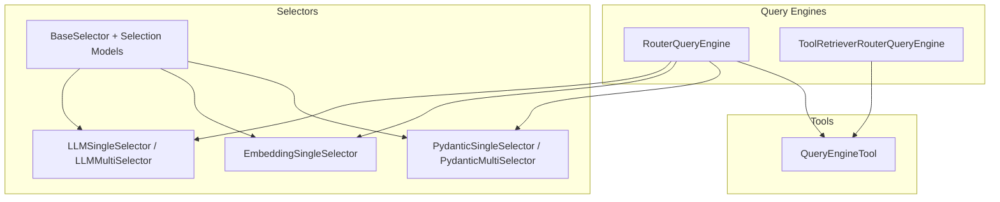
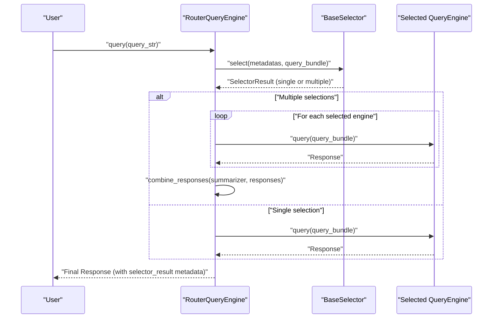
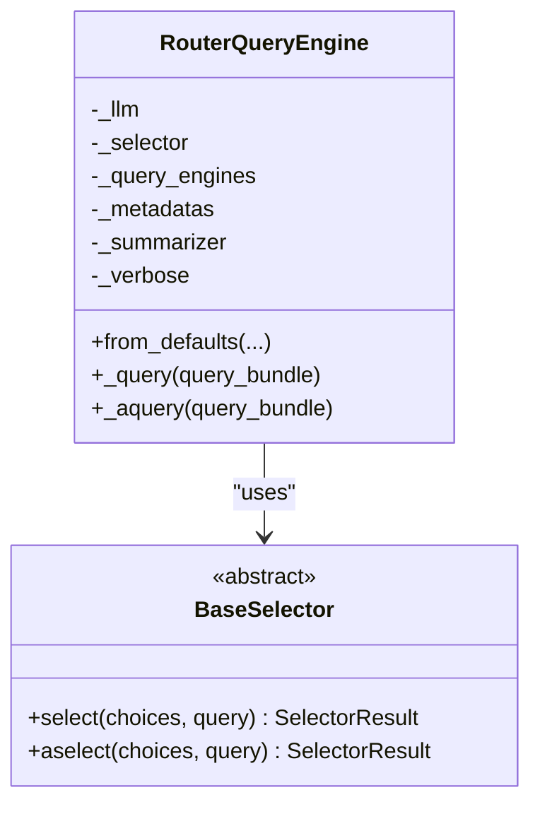
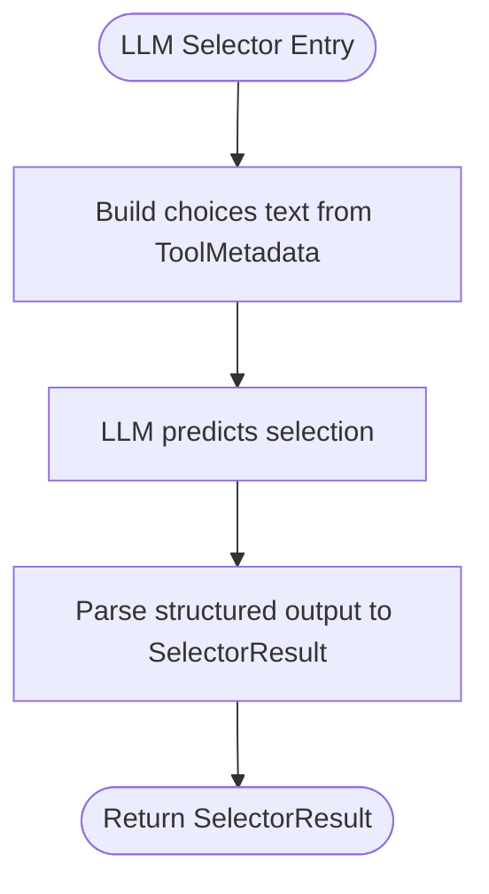
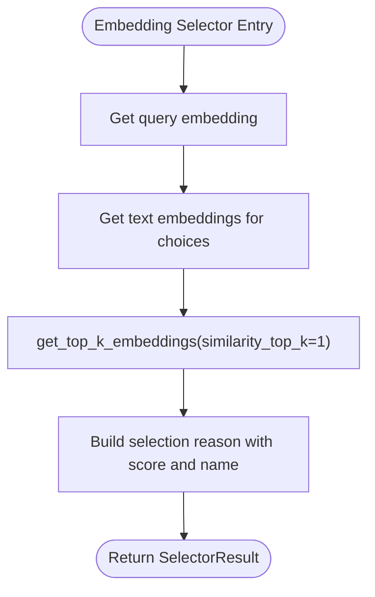
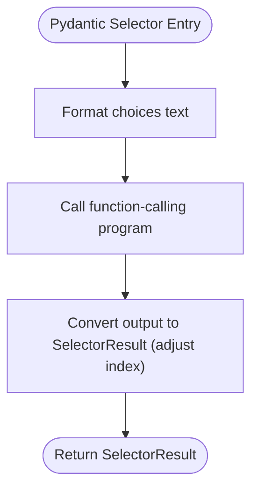
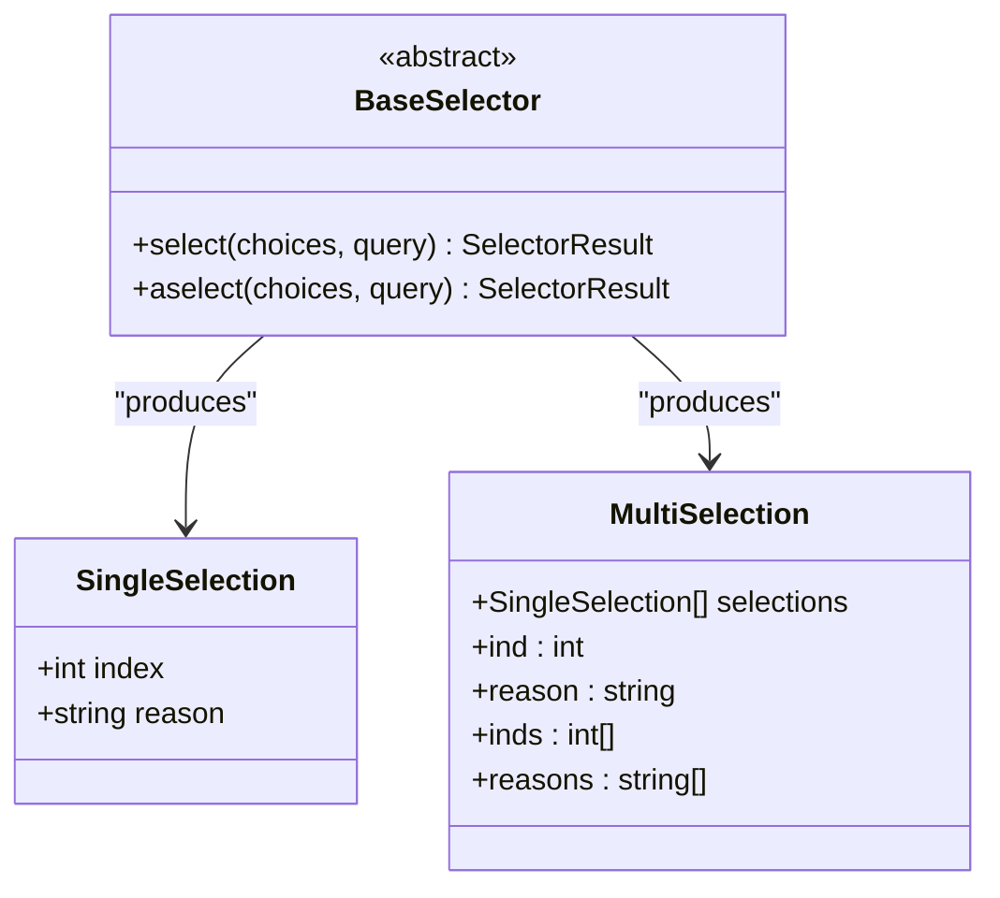
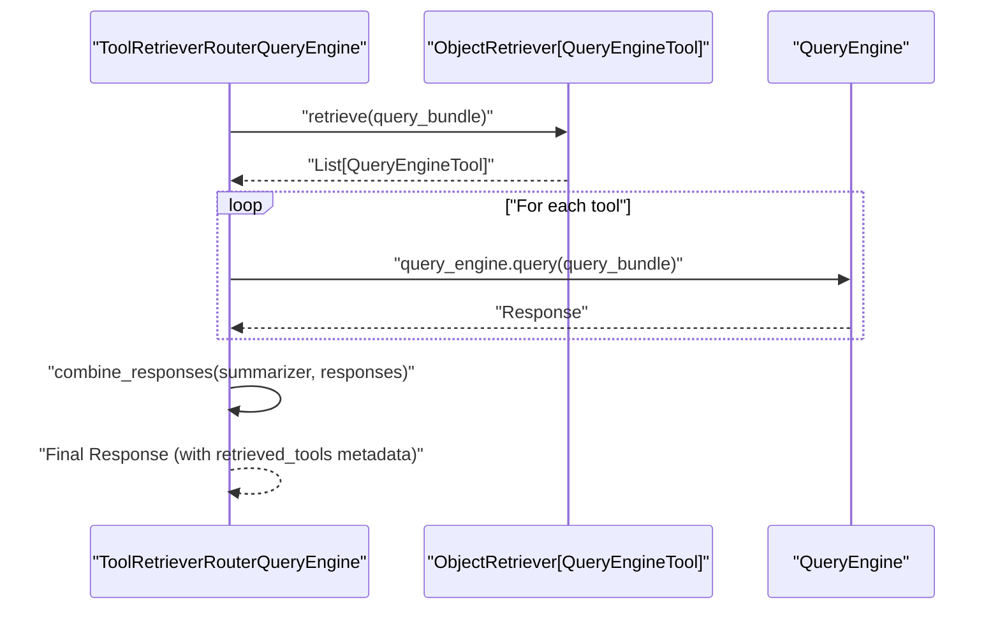
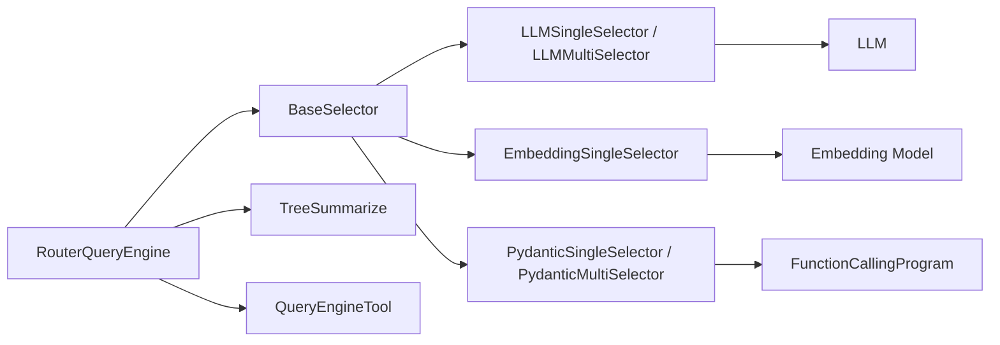

# Router Query Engines

<cite>
**Referenced Files in This Document**
- [router_query_engine.py](file://llama-index-core/llama_index/core/query_engine/router_query_engine.py)
- [llm_selectors.py](file://llama-index-core/llama_index/core/selectors/llm_selectors.py)
- [embedding_selectors.py](file://llama-index-core/llama_index/core/selectors/embedding_selectors.py)
- [pydantic_selectors.py](file://llama-index-core/llama_index/core/selectors/pydantic_selectors.py)
- [base_selector.py](file://llama-index-core/llama_index/core/base/base_selector.py)
- [index.md](file://docs/src/content/docs/framework/module_guides/querying/router/index.md)
- [SQLRouterQueryEngine.ipynb](file://docs/examples/query_engine/SQLRouterQueryEngine.ipynb)
- [router.md](file://docs/api_reference/api_reference/query_engine/router.md)
</cite>

## Table of Contents
1. [Introduction](#introduction)
2. [Project Structure](#project-structure)
3. [Core Components](#core-components)
4. [Architecture Overview](#architecture-overview)
5. [Detailed Component Analysis](#detailed-component-analysis)
6. [Dependency Analysis](#dependency-analysis)
7. [Performance Considerations](#performance-considerations)
8. [Troubleshooting Guide](#troubleshooting-guide)
9. [Conclusion](#conclusion)
10. [Appendices](#appendices)

## Introduction
Router query engines intelligently route user queries to the most appropriate underlying query engines. At the heart of routing is the selector mechanism, which evaluates a set of candidate engines (expressed as metadata) against the incoming query and returns either a single selection or multiple selections. The router then executes the chosen engine(s) and optionally synthesizes a unified response.

Key capabilities include:
- Selector-driven routing using LLMs, Pydantic schemas, or embeddings
- Multi-domain routers combining different query engines (e.g., SQL, vector indices)
- Configurable engine prioritization and fallback strategies
- Hybrid routing combining retrieval-augmented selection with LLM-based decisions
- Practical examples and guidance for building robust, accurate routers

## Project Structure
The router functionality spans query engines, selectors, and supporting utilities:
- Router engines: orchestrate selection and execution
- Selector implementations: LLM-based, Pydantic-based, and embedding-based
- Base selector contract and shared types
- Documentation and examples demonstrating usage patterns

**Diagram sources**
- [router_query_engine.py](file://llama-index-core/llama_index/core/query_engine/router_query_engine.py#L95-L250)
- [llm_selectors.py](file://llama-index-core/llama_index/core/selectors/llm_selectors.py#L49-L235)
- [embedding_selectors.py](file://llama-index-core/llama_index/core/selectors/embedding_selectors.py#L16-L94)
- [pydantic_selectors.py](file://llama-index-core/llama_index/core/selectors/pydantic_selectors.py#L40-L159)
- [base_selector.py](file://llama-index-core/llama_index/core/base/base_selector.py#L72-L104)

**Section sources**
- [router_query_engine.py](file://llama-index-core/llama_index/core/query_engine/router_query_engine.py#L95-L250)
- [index.md](file://docs/src/content/docs/framework/module_guides/querying/router/index.md#L1-L192)

## Core Components
- RouterQueryEngine: orchestrates selector-based routing, executes chosen engines, and combines results when multiple engines are selected.
- ToolRetrieverRouterQueryEngine: retrieves candidate tools via an object retriever and executes them, optionally summarizing results.
- Selector implementations:
  - LLMSingleSelector / LLMMultiSelector: use LLMs to pick one or multiple engines based on formatted choices and query.
  - EmbeddingSingleSelector: selects the most semantically similar engine description using embeddings.
  - PydanticSingleSelector / PydanticMultiSelector: leverage function-calling LLMs to return structured selections.
- BaseSelector and selection models: define the selector contract and selection result types.

**Section sources**
- [router_query_engine.py](file://llama-index-core/llama_index/core/query_engine/router_query_engine.py#L95-L250)
- [llm_selectors.py](file://llama-index-core/llama_index/core/selectors/llm_selectors.py#L49-L235)
- [embedding_selectors.py](file://llama-index-core/llama_index/core/selectors/embedding_selectors.py#L16-L94)
- [pydantic_selectors.py](file://llama-index-core/llama_index/core/selectors/pydantic_selectors.py#L40-L159)
- [base_selector.py](file://llama-index-core/llama_index/core/base/base_selector.py#L72-L104)

## Architecture Overview
Router engines wrap a selector and a collection of QueryEngineTool instances. The selector receives the tool metadata and the query bundle, returning a selection result. The router then executes the selected engine(s) and merges results if needed.

**Diagram sources**
- [router_query_engine.py](file://llama-index-core/llama_index/core/query_engine/router_query_engine.py#L160-L203)
- [base_selector.py](file://llama-index-core/llama_index/core/base/base_selector.py#L79-L91)

## Detailed Component Analysis

### RouterQueryEngine
Responsibilities:
- Accepts a selector and a sequence of QueryEngineTool instances.
- Executes selector.select(...) to obtain a selection result.
- Runs the selected engine(s) and aggregates results using a TreeSummarize-based combiner when multiple engines are selected.
- Attaches selector_result metadata to the final response for traceability.

Key behaviors:
- Synchronous and asynchronous query flows share the same selection and combination logic.
- Verbose mode logs selection decisions and reasons.
- Uses a default summarizer if none is provided.

**Diagram sources**
- [router_query_engine.py](file://llama-index-core/llama_index/core/query_engine/router_query_engine.py#L95-L130)
- [base_selector.py](file://llama-index-core/llama_index/core/base/base_selector.py#L72-L104)

**Section sources**
- [router_query_engine.py](file://llama-index-core/llama_index/core/query_engine/router_query_engine.py#L95-L203)

### Selector Mechanisms

#### LLM Selectors
- LLMSingleSelector and LLMMultiSelector build a formatted choices text from ToolMetadata descriptions and query, then use an LLM to produce a structured answer. The output is parsed into a SelectorResult with either a single or multiple selections.
- Supports custom prompts and output parsers.

**Diagram sources**
- [llm_selectors.py](file://llama-index-core/llama_index/core/selectors/llm_selectors.py#L101-L137)

**Section sources**
- [llm_selectors.py](file://llama-index-core/llama_index/core/selectors/llm_selectors.py#L49-L235)

#### Embedding Selector
- EmbeddingSingleSelector computes embeddings for the query and each choice description, then picks the highest similarity match as the selection. It returns a SelectorResult with a single selection and a reason string indicating the similarity score and chosen name.

**Diagram sources**
- [embedding_selectors.py](file://llama-index-core/llama_index/core/selectors/embedding_selectors.py#L51-L93)

**Section sources**
- [embedding_selectors.py](file://llama-index-core/llama_index/core/selectors/embedding_selectors.py#L16-L94)

#### Pydantic Selectors
- PydanticSingleSelector and PydanticMultiSelector use a function-calling program to return structured selections. They convert the program’s output into a SelectorResult, adjusting for zero-indexing.
- Support optional max_outputs for multi-selection.

**Diagram sources**
- [pydantic_selectors.py](file://llama-index-core/llama_index/core/selectors/pydantic_selectors.py#L70-L100)

**Section sources**
- [pydantic_selectors.py](file://llama-index-core/llama_index/core/selectors/pydantic_selectors.py#L40-L159)

### BaseSelector Contract and Selection Models
- BaseSelector defines the select/aselect interface and wraps inputs into ToolMetadata and QueryBundle.
- SingleSelection and MultiSelection represent selection results, with convenience properties for accessing indices and reasons.

**Diagram sources**
- [base_selector.py](file://llama-index-core/llama_index/core/base/base_selector.py#L13-L104)

**Section sources**
- [base_selector.py](file://llama-index-core/llama_index/core/base/base_selector.py#L72-L104)

### ToolRetrieverRouterQueryEngine
- Retrieves candidate QueryEngineTool instances via an ObjectRetriever and executes them, optionally summarizing multiple results.
- Useful when the set of choices is large and needs indexing or retrieval.

**Diagram sources**
- [router_query_engine.py](file://llama-index-core/llama_index/core/query_engine/router_query_engine.py#L316-L397)

**Section sources**
- [router_query_engine.py](file://llama-index-core/llama_index/core/query_engine/router_query_engine.py#L316-L397)

## Dependency Analysis
Router engines depend on:
- Selector implementations for decision-making
- QueryEngineTool wrappers to expose metadata to selectors
- Summarizer for combining multiple responses
- LLM and embedding models depending on the selector type

**Diagram sources**
- [router_query_engine.py](file://llama-index-core/llama_index/core/query_engine/router_query_engine.py#L95-L130)
- [llm_selectors.py](file://llama-index-core/llama_index/core/selectors/llm_selectors.py#L49-L90)
- [embedding_selectors.py](file://llama-index-core/llama_index/core/selectors/embedding_selectors.py#L16-L42)
- [pydantic_selectors.py](file://llama-index-core/llama_index/core/selectors/pydantic_selectors.py#L40-L60)

**Section sources**
- [router_query_engine.py](file://llama-index-core/llama_index/core/query_engine/router_query_engine.py#L95-L130)
- [llm_selectors.py](file://llama-index-core/llama_index/core/selectors/llm_selectors.py#L49-L90)
- [embedding_selectors.py](file://llama-index-core/llama_index/core/selectors/embedding_selectors.py#L16-L42)
- [pydantic_selectors.py](file://llama-index-core/llama_index/core/selectors/pydantic_selectors.py#L40-L60)

## Performance Considerations
- Selector choice cost:
  - LLM selectors: dominated by LLM inference; reduce token count by trimming ToolMetadata descriptions and using concise prompts.
  - Embedding selectors: compute embeddings for query and all choices; consider caching or batching where feasible.
  - Pydantic selectors: function-calling overhead; ensure prompt templates are minimal and avoid unnecessary fields.
- Execution cost:
  - Single selection: execute only the selected engine.
  - Multi-selection: execute all selected engines and combine; consider parallelism for independent engines.
- Summarization cost:
  - Combine responses using TreeSummarize; keep combined text sizes manageable to reduce summarization overhead.
- Caching and memoization:
  - Cache embeddings for repeated queries or static choices.
  - Cache LLM predictions if the same query and choices repeat often.
- Asynchronous execution:
  - Prefer async APIs for concurrent execution of multiple engines to reduce latency.

[No sources needed since this section provides general guidance]

## Troubleshooting Guide
Common issues and remedies:
- Selector returns no selection or invalid index:
  - Verify ToolMetadata names and descriptions are populated; ensure selector parsing aligns with expected indices.
- Unexpected multi-selection behavior:
  - Confirm max_outputs configuration for multi-selectors and review selection reasons.
- Slow routing decisions:
  - Reduce ToolMetadata verbosity; switch to embedding selectors for large choice sets; enable async execution for multi-selection.
- Incorrect engine routing:
  - Improve ToolMetadata descriptions to clearly distinguish domains; refine prompts for LLM selectors; tune embedding models or similarity thresholds.
- Debugging routing decisions:
  - Enable verbose mode in RouterQueryEngine to log selection indices and reasons.
  - Inspect final response metadata for selector_result to review selection outcomes.
  - For ToolRetrieverRouterQueryEngine, check retrieved_tools metadata to confirm retrieved candidates.

**Section sources**
- [router_query_engine.py](file://llama-index-core/llama_index/core/query_engine/router_query_engine.py#L160-L203)
- [router_query_engine.py](file://llama-index-core/llama_index/core/query_engine/router_query_engine.py#L316-L397)

## Conclusion
Router query engines provide a flexible, extensible way to route queries to the most suitable engines. By leveraging LLM-based, embedding-based, and Pydantic-based selectors, you can build accurate, efficient routers for multi-domain use cases. Proper configuration of selector types, engine prioritization, and fallback strategies ensures robust performance. Use the provided examples and debugging tips to iterate toward reliable routing decisions.

[No sources needed since this section summarizes without analyzing specific files]

## Appendices

### Practical Examples and Patterns
- Building a multi-domain router with SQL and vector engines:
  - Define QueryEngineTool instances for each domain with clear descriptions.
  - Initialize RouterQueryEngine with an LLM-based selector and tools.
  - See example patterns in the documentation and notebooks.

- Retrieval-augmented routing:
  - Use ToolRetrieverRouterQueryEngine to retrieve candidate tools dynamically from an index.

- Custom selectors:
  - Implement a custom selector by extending BaseSelector and defining select/aselect to return a SelectorResult.

- Optimizing performance:
  - Prefer embedding selectors for large choice sets.
  - Use async execution for multi-selection.
  - Keep ToolMetadata concise and descriptive.

**Section sources**
- [index.md](file://docs/src/content/docs/framework/module_guides/querying/router/index.md#L24-L192)
- [SQLRouterQueryEngine.ipynb](file://docs/examples/query_engine/SQLRouterQueryEngine.ipynb#L430-L444)
- [router.md](file://docs/api_reference/api_reference/query_engine/router.md#L1-L4)