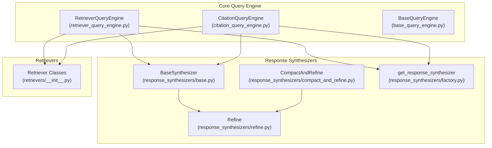
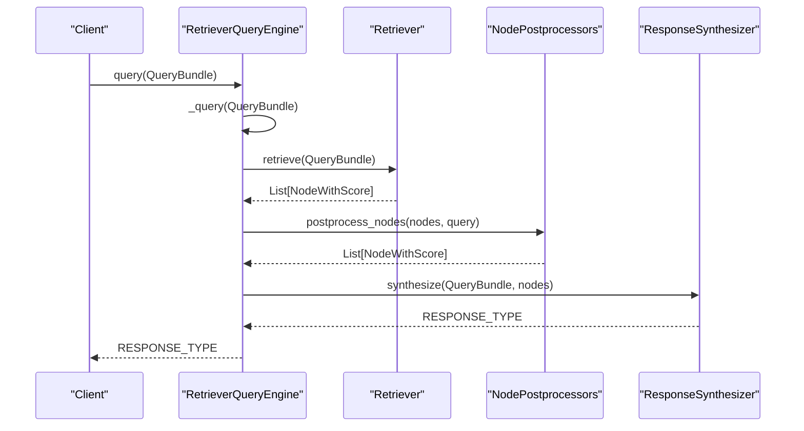
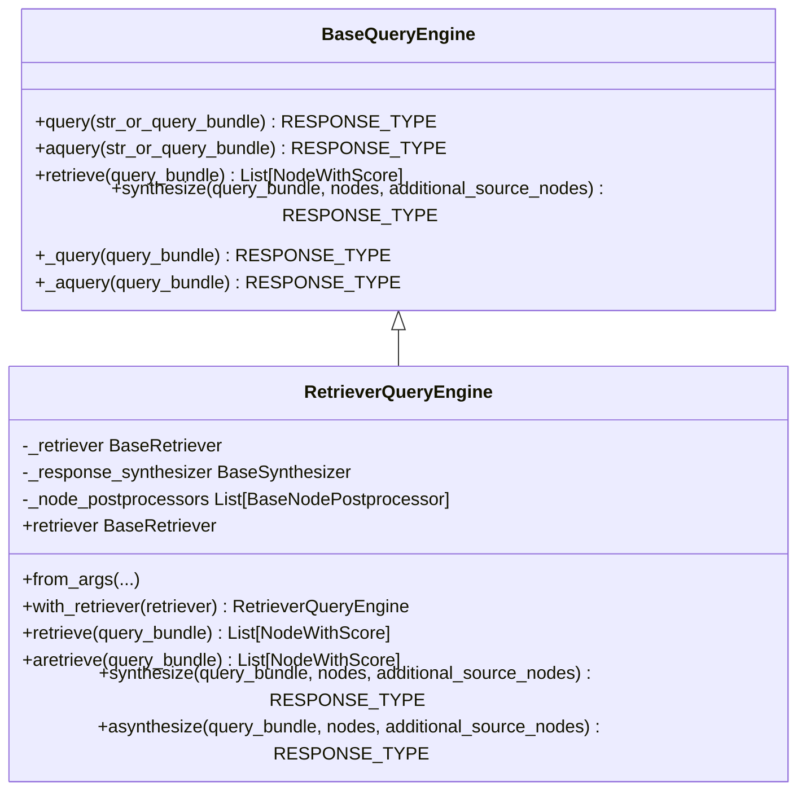
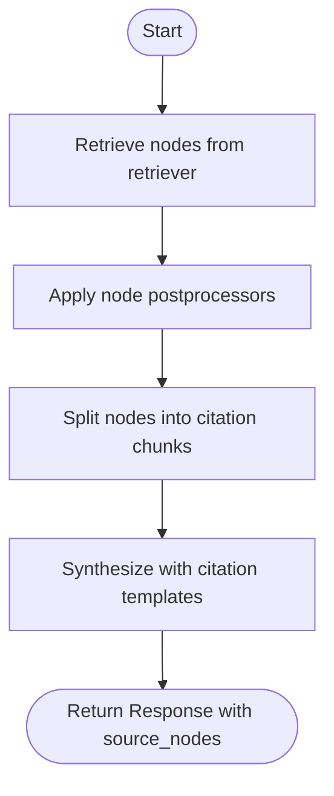
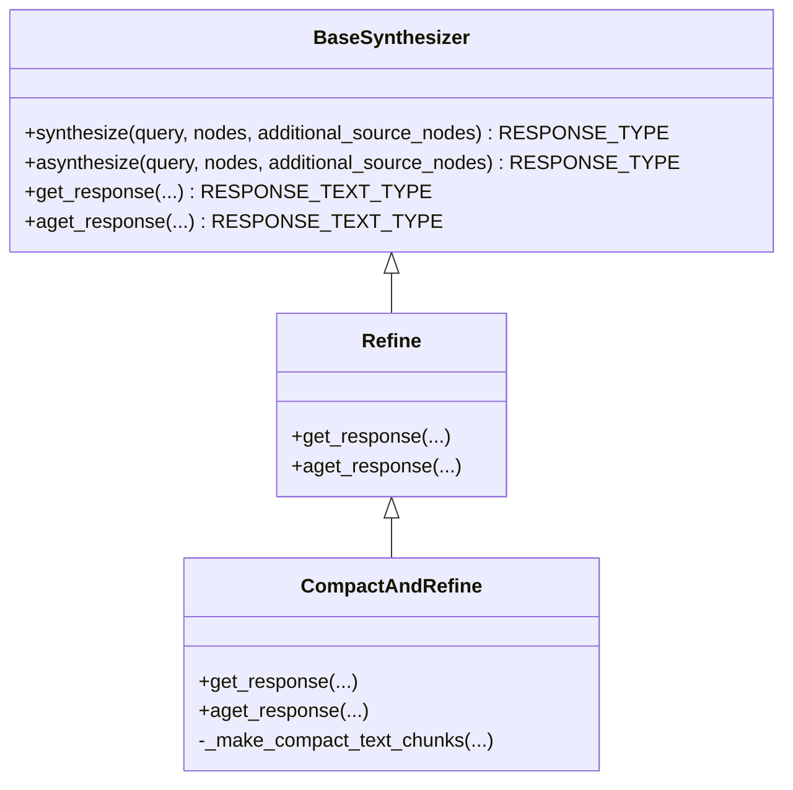
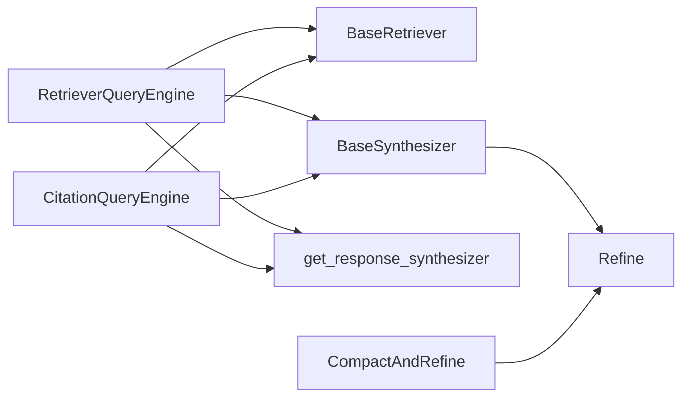

# Simple Query Engines

<cite>
**Referenced Files in This Document**
- [retriever_query_engine.py](file://llama-index-core/llama_index/core/query_engine/retriever_query_engine.py)
- [base_query_engine.py](file://llama-index-core/llama_index/core/base/base_query_engine.py)
- [citation_query_engine.py](file://llama-index-core/llama_index/core/query_engine/citation_query_engine.py)
- [base.py](file://llama-index-core/llama_index/core/response_synthesizers/base.py)
- [factory.py](file://llama-index-core/llama_index/core/response_synthesizers/factory.py)
- [compact_and_refine.py](file://llama-index-core/llama_index/core/response_synthesizers/compact_and_refine.py)
- [__init__.py](file://llama-index-core/llama_index/core/retrievers/__init__.py)
- [__init__.py](file://llama-index-core/llama_index/core/__init__.py)
</cite>

## Table of Contents
1. [Introduction](#introduction)
2. [Project Structure](#project-structure)
3. [Core Components](#core-components)
4. [Architecture Overview](#architecture-overview)
5. [Detailed Component Analysis](#detailed-component-analysis)
6. [Dependency Analysis](#dependency-analysis)
7. [Performance Considerations](#performance-considerations)
8. [Troubleshooting Guide](#troubleshooting-guide)
9. [Conclusion](#conclusion)
10. [Appendices](#appendices)

## Introduction
This document explains simple query engines in LlamaIndex with a focus on the RetrieverQueryEngine and CitationQueryEngine. It covers the basic architecture, how retrievers connect to response synthesis, node scoring and postprocessing, citation handling, and practical examples for common tasks like document QA, fact extraction, and basic information retrieval. It also provides troubleshooting guidance for performance and result quality.

## Project Structure
The relevant modules for simple query engines live under the core query engine and response synthesizer packages, along with retrievers and base abstractions.

**Diagram sources**
- [retriever_query_engine.py](file://llama-index-core/llama_index/core/query_engine/retriever_query_engine.py#L25-L226)
- [citation_query_engine.py](file://llama-index-core/llama_index/core/query_engine/citation_query_engine.py#L83-L328)
- [base_query_engine.py](file://llama-index-core/llama_index/core/base/base_query_engine.py#L22-L94)
- [base.py](file://llama-index-core/llama_index/core/response_synthesizers/base.py#L53-L322)
- [factory.py](file://llama-index-core/llama_index/core/response_synthesizers/factory.py#L33-L152)
- [compact_and_refine.py](file://llama-index-core/llama_index/core/response_synthesizers/compact_and_refine.py#L11-L58)
- [__init__.py](file://llama-index-core/llama_index/core/retrievers/__init__.py#L1-L89)

**Section sources**
- [__init__.py](file://llama-index-core/llama_index/core/__init__.py#L69-L71)

## Core Components
- RetrieverQueryEngine: Orchestrates retrieval and response synthesis, exposing retrieve, synthesize, and query methods. It supports synchronous and asynchronous flows and integrates optional node postprocessors.
- CitationQueryEngine: Extends the retriever-based pattern to produce citable answers by splitting retrieved chunks into numbered “source” chunks and using dedicated templates.
- BaseQueryEngine: Defines the common interface for query engines, including synchronous/asynchronous query entry points and hooks for retrieve/synthesize.
- ResponseSynthesizer family: Provides multiple synthesis strategies (e.g., REFINE, COMPACT, TREE_SUMMARIZE, SIMPLE_SUMMARIZE, GENERATION, ACCUMULATE, CONTEXT_ONLY, NO_TEXT) via a factory.
- Retriever classes: A wide variety of retrievers are exposed for different index types and strategies.

Key responsibilities:
- Retrieval: Retrieve relevant nodes given a query bundle.
- Postprocessing: Apply node postprocessors to refine or filter nodes.
- Synthesis: Generate a final response from the retrieved nodes using a selected synthesizer mode.
- Citation: For CitationQueryEngine, split nodes into granular citation chunks and inject source numbering into the response.

**Section sources**
- [retriever_query_engine.py](file://llama-index-core/llama_index/core/query_engine/retriever_query_engine.py#L25-L226)
- [citation_query_engine.py](file://llama-index-core/llama_index/core/query_engine/citation_query_engine.py#L83-L328)
- [base_query_engine.py](file://llama-index-core/llama_index/core/base/base_query_engine.py#L22-L94)
- [base.py](file://llama-index-core/llama_index/core/response_synthesizers/base.py#L53-L322)
- [factory.py](file://llama-index-core/llama_index/core/response_synthesizers/factory.py#L33-L152)
- [__init__.py](file://llama-index-core/llama_index/core/retrievers/__init__.py#L1-L89)

## Architecture Overview
The simple query engine architecture follows a clean separation of concerns:
- Query engines accept a query bundle and delegate retrieval to a retriever.
- Retrieved nodes are optionally postprocessed.
- A response synthesizer produces a final response, handling streaming, structured outputs, and metadata aggregation.
- CitationQueryEngine adds an extra step to split nodes into numbered citation chunks before synthesis.

**Diagram sources**
- [retriever_query_engine.py](file://llama-index-core/llama_index/core/query_engine/retriever_query_engine.py#L190-L220)
- [base.py](file://llama-index-core/llama_index/core/response_synthesizers/base.py#L192-L256)

## Detailed Component Analysis

### RetrieverQueryEngine
- Purpose: Connect a retriever to a response synthesizer to answer queries.
- Key behaviors:
  - Initialization supports passing a retriever, optional response synthesizer, and node postprocessors.
  - from_args builds a RetrieverQueryEngine with a configured response synthesizer via get_response_synthesizer.
  - retrieve and aretrieve call the underlying retriever and apply node postprocessors.
  - synthesize and asynthesize delegate to the response synthesizer.
  - _query and _aquery orchestrate retrieval, optional postprocessing, and synthesis, emitting callback events.

**Diagram sources**
- [base_query_engine.py](file://llama-index-core/llama_index/core/base/base_query_engine.py#L22-L94)
- [retriever_query_engine.py](file://llama-index-core/llama_index/core/query_engine/retriever_query_engine.py#L25-L226)

**Section sources**
- [retriever_query_engine.py](file://llama-index-core/llama_index/core/query_engine/retriever_query_engine.py#L25-L226)

### CitationQueryEngine
- Purpose: Produce citable answers by splitting retrieved nodes into numbered “Source X” chunks and using specialized templates.
- Key behaviors:
  - Uses a SentenceSplitter (by default) to chunk retrieved content for precise citations.
  - Applies node postprocessors during retrieval.
  - Transforms nodes into granular citation chunks before synthesis.
  - Uses dedicated templates for initial QA and refinement steps.

**Diagram sources**
- [citation_query_engine.py](file://llama-index-core/llama_index/core/query_engine/citation_query_engine.py#L217-L234)
- [citation_query_engine.py](file://llama-index-core/llama_index/core/query_engine/citation_query_engine.py#L283-L304)

**Section sources**
- [citation_query_engine.py](file://llama-index-core/llama_index/core/query_engine/citation_query_engine.py#L83-L328)

### Response Synthesizer Family and Factory
- BaseSynthesizer defines the contract for synthesis, including synchronous/asynchronous methods, streaming support, and response packaging.
- get_response_synthesizer selects a synthesizer implementation based on ResponseMode and configuration.
- CompactAndRefine demonstrates how a mode compacts chunks before refining.

**Diagram sources**
- [base.py](file://llama-index-core/llama_index/core/response_synthesizers/base.py#L53-L322)
- [compact_and_refine.py](file://llama-index-core/llama_index/core/response_synthesizers/compact_and_refine.py#L11-L58)

**Section sources**
- [base.py](file://llama-index-core/llama_index/core/response_synthesizers/base.py#L53-L322)
- [factory.py](file://llama-index-core/llama_index/core/response_synthesizers/factory.py#L33-L152)
- [compact_and_refine.py](file://llama-index-core/llama_index/core/response_synthesizers/compact_and_refine.py#L11-L58)

### Retriever Types
A broad set of retrievers is available for different index types and strategies, enabling flexible retrieval setups.

Examples include:
- VectorIndexRetriever, VectorIndexAutoRetriever
- Tree-based retrievers (AllLeaf, SelectLeaf, Root)
- KeywordTableSimpleRetriever
- Property Graph retrievers
- SQL retrievers
- Fusion, Recursive, Router, AutoMerging, Transform retrievers

**Section sources**
- [__init__.py](file://llama-index-core/llama_index/core/retrievers/__init__.py#L1-L89)

## Dependency Analysis
- RetrieverQueryEngine depends on:
  - BaseRetriever for retrieving nodes
  - BaseSynthesizer for response generation
  - get_response_synthesizer for synthesizer instantiation
  - Optional node postprocessors
- CitationQueryEngine extends the same pattern but adds node chunking and citation templates.
- BaseQueryEngine provides the shared query lifecycle and callback integration.

**Diagram sources**
- [retriever_query_engine.py](file://llama-index-core/llama_index/core/query_engine/retriever_query_engine.py#L25-L226)
- [citation_query_engine.py](file://llama-index-core/llama_index/core/query_engine/citation_query_engine.py#L83-L328)
- [base.py](file://llama-index-core/llama_index/core/response_synthesizers/base.py#L53-L322)
- [factory.py](file://llama-index-core/llama_index/core/response_synthesizers/factory.py#L33-L152)
- [compact_and_refine.py](file://llama-index-core/llama_index/core/response_synthesizers/compact_and_refine.py#L11-L58)

**Section sources**
- [retriever_query_engine.py](file://llama-index-core/llama_index/core/query_engine/retriever_query_engine.py#L25-L226)
- [citation_query_engine.py](file://llama-index-core/llama_index/core/query_engine/citation_query_engine.py#L83-L328)
- [base.py](file://llama-index-core/llama_index/core/response_synthesizers/base.py#L53-L322)
- [factory.py](file://llama-index-core/llama_index/core/response_synthesizers/factory.py#L33-L152)
- [compact_and_refine.py](file://llama-index-core/llama_index/core/response_synthesizers/compact_and_refine.py#L11-L58)

## Performance Considerations
- Retrieval depth and quality:
  - Adjust similarity_top_k and other retriever parameters to balance recall and speed.
  - Use node postprocessors (e.g., rerankers) judiciously; they add compute overhead.
- Synthesis mode selection:
  - COMPACT and SIMPLE_SUMMARIZE are often faster; REFINE and TREE_SUMMARIZE may improve quality at higher cost.
  - Streaming can reduce latency for long responses.
- Token limits:
  - CompactAndRefine repacks text to fit prompt constraints; tune chunk sizes and overlaps accordingly.
- Callback and instrumentation:
  - Enable callback managers to profile query and synthesis stages.

[No sources needed since this section provides general guidance]

## Troubleshooting Guide
Common issues and remedies:
- Poor retrieval quality:
  - Verify retriever configuration (e.g., similarity_top_k) and index type.
  - Add or adjust node postprocessors (e.g., rerankers) to improve relevance.
- Empty or generic answers:
  - Ensure sufficient context nodes are returned; increase top_k or enable fusion/recursion.
  - Confirm response synthesizer mode aligns with task complexity.
- Streaming or structured output problems:
  - Check streaming flag and output_cls configuration in the synthesizer.
- Citation formatting issues:
  - For CitationQueryEngine, confirm citation_chunk_size and overlap settings and metadata_mode.
- Callback and tracing:
  - Use callback manager events to inspect query, retrieve, and synthesis stages.

**Section sources**
- [base.py](file://llama-index-core/llama_index/core/response_synthesizers/base.py#L192-L256)
- [compact_and_refine.py](file://llama-index-core/llama_index/core/response_synthesizers/compact_and_refine.py#L50-L58)
- [citation_query_engine.py](file://llama-index-core/llama_index/core/query_engine/citation_query_engine.py#L217-L234)

## Conclusion
Simple query engines in LlamaIndex provide a straightforward path from retrieval to synthesis, with optional citation-aware workflows. RetrieverQueryEngine offers a clean, extensible interface, while CitationQueryEngine adds precise citation handling. By tuning retrievers, postprocessors, and synthesis modes, you can achieve strong results for document QA, fact extraction, and basic information retrieval.

[No sources needed since this section summarizes without analyzing specific files]

## Appendices

### Practical Examples and Patterns
- Basic RAG with RetrieverQueryEngine:
  - Build a RetrieverQueryEngine from a retriever and a response synthesizer.
  - Configure response_mode and templates via from_args.
  - Use query or aquery to get a Response with source_nodes metadata.
- Citation-enabled QA:
  - Use CitationQueryEngine to split retrieved nodes into numbered “Source X” chunks.
  - Leverage dedicated templates for initial QA and refinement.
- Node scoring and result formatting:
  - Retrieved nodes carry NodeWithScore; postprocessors can reorder/filter.
  - Response objects include source_nodes and metadata for downstream use.

**Section sources**
- [retriever_query_engine.py](file://llama-index-core/llama_index/core/query_engine/retriever_query_engine.py#L62-L128)
- [citation_query_engine.py](file://llama-index-core/llama_index/core/query_engine/citation_query_engine.py#L142-L211)
- [base.py](file://llama-index-core/llama_index/core/response_synthesizers/base.py#L145-L191)