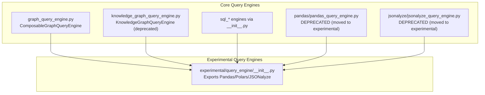
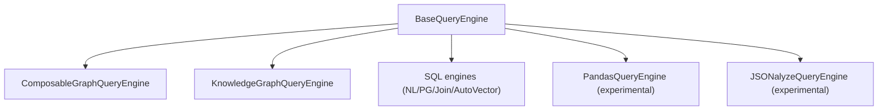
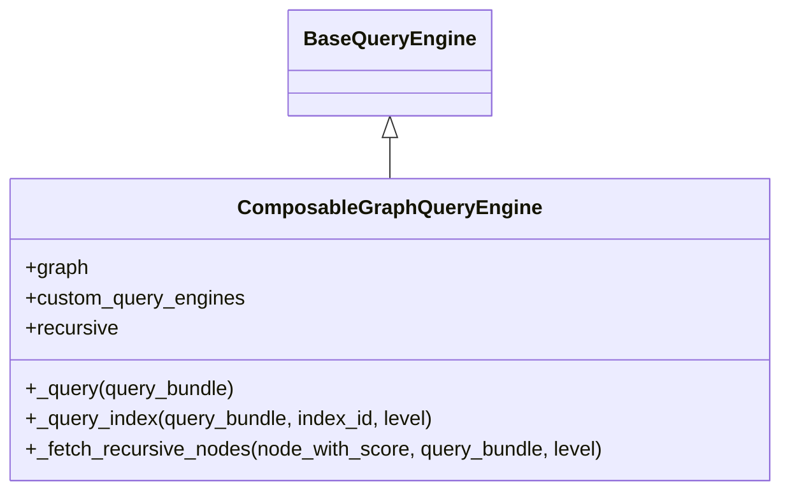
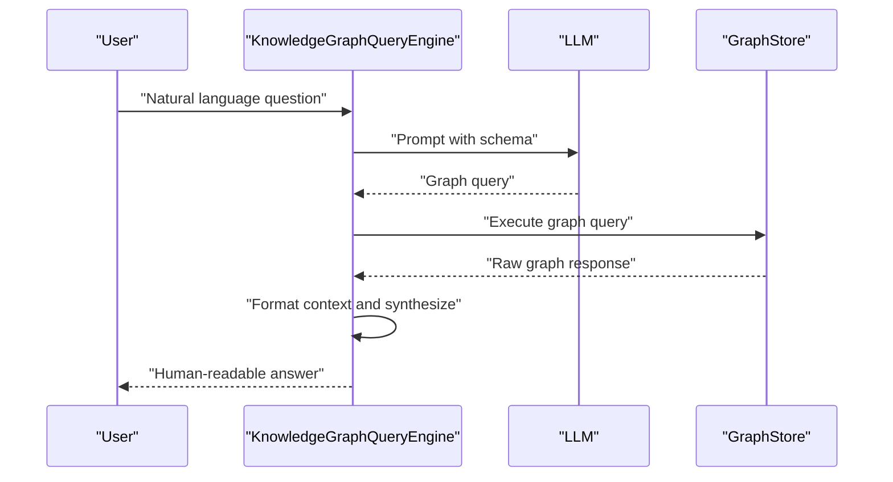
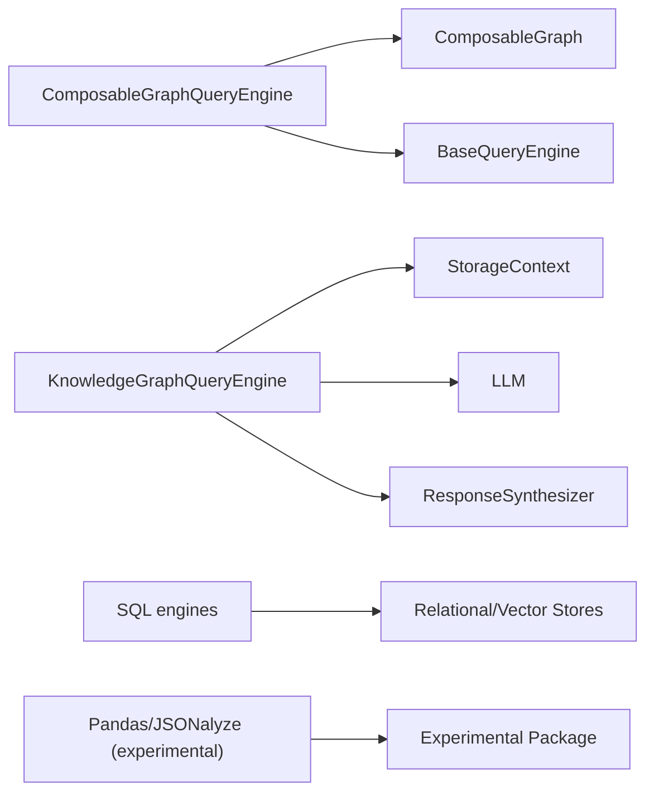

# Specialized Query Engines

<cite>
**Referenced Files in This Document**
- [query_engine/__init__.py](file://llama-index-core/llama_index/core/query_engine/__init__.py)
- [graph_query_engine.py](file://llama-index-core/llama_index/core/query_engine/graph_query_engine.py)
- [knowledge_graph_query_engine.py](file://llama-index-core/llama_index/core/query_engine/knowledge_graph_query_engine.py)
- [jsonalyze/jsonalyze_query_engine.py](file://llama-index-core/llama_index/core/query_engine/jsonalyze/jsonalyze_query_engine.py)
- [pandas/pandas_query_engine.py](file://llama-index-core/llama_index/core/query_engine/pandas/pandas_query_engine.py)
- [experimental/query_engine/__init__.py](file://llama-index-experimental/llama_index/experimental/query_engine/__init__.py)
</cite>

## Table of Contents
1. [Introduction](#introduction)
2. [Project Structure](#project-structure)
3. [Core Components](#core-components)
4. [Architecture Overview](#architecture-overview)
5. [Detailed Component Analysis](#detailed-component-analysis)
6. [Dependency Analysis](#dependency-analysis)
7. [Performance Considerations](#performance-considerations)
8. [Troubleshooting Guide](#troubleshooting-guide)
9. [Conclusion](#conclusion)

## Introduction
This document explains specialized query engines in the repository, focusing on:
- Graph query engines for property graphs and knowledge graphs
- SQL query engines for database integration
- Domain-specific engines such as JSONalyze and Pandas query engines

It covers capabilities, configuration requirements, typical use cases, integration patterns, performance considerations, and troubleshooting guidance. Practical examples are described conceptually with code snippet paths to actual implementations.

## Project Structure
The specialized query engines are exposed via the core query engine module and supported by experimental packages for newer or deprecated implementations. The core module exports:
- Graph and knowledge graph query engines
- SQL-related engines
- Pandas and JSONalyze engines (deprecated in core, relocated to experimental)
- Multi-modal, router, and other composite engines

**Diagram sources**
- [query_engine/__init__.py](file://llama-index-core/llama_index/core/query_engine/__init__.py#L1-L88)
- [graph_query_engine.py](file://llama-index-core/llama_index/core/query_engine/graph_query_engine.py#L1-L132)
- [knowledge_graph_query_engine.py](file://llama-index-core/llama_index/core/query_engine/knowledge_graph_query_engine.py#L1-L269)
- [jsonalyze/jsonalyze_query_engine.py](file://llama-index-core/llama_index/core/query_engine/jsonalyze/jsonalyze_query_engine.py#L1-L31)
- [pandas/pandas_query_engine.py](file://llama-index-core/llama_index/core/query_engine/pandas/pandas_query_engine.py#L1-L36)
- [experimental/query_engine/__init__.py](file://llama-index-experimental/llama_index/experimental/query_engine/__init__.py#L1-L24)

**Section sources**
- [query_engine/__init__.py](file://llama-index-core/llama_index/core/query_engine/__init__.py#L1-L88)

## Core Components
- ComposableGraphQueryEngine: orchestrates traversal and synthesis across a composable graph of indices, supporting recursive retrieval and custom per-index query engines.
- KnowledgeGraphQueryEngine: generates graph store queries from natural language using an LLM and synthesizes human-readable answers from graph responses (deprecated).
- SQL engines: exported via the core query engine module for SQL table retrieval, NL-to-SQL, and vector-aware SQL.
- Pandas/JSONalyze engines: deprecated in core; relocated to experimental due to security risks (allowing arbitrary execution).

Key export points:
- [Core exports](file://llama-index-core/llama_index/core/query_engine/__init__.py#L1-L88)
- [Experimental exports](file://llama-index-experimental/llama_index/experimental/query_engine/__init__.py#L1-L24)

**Section sources**
- [query_engine/__init__.py](file://llama-index-core/llama_index/core/query_engine/__init__.py#L1-L88)
- [experimental/query_engine/__init__.py](file://llama-index-experimental/llama_index/experimental/query_engine/__init__.py#L1-L24)

## Architecture Overview
The specialized engines integrate with the broader RAG pipeline through a shared BaseQueryEngine interface. They rely on:
- Retrieval: fetching relevant nodes or results from underlying stores
- Synthesis: transforming raw results into coherent responses
- Callbacks and instrumentation: tracing and metrics
- Prompts and LLMs: for query generation and answer synthesis

**Diagram sources**
- [graph_query_engine.py](file://llama-index-core/llama_index/core/query_engine/graph_query_engine.py#L15-L132)
- [knowledge_graph_query_engine.py](file://llama-index-core/llama_index/core/query_engine/knowledge_graph_query_engine.py#L53-L269)
- [query_engine/__init__.py](file://llama-index-core/llama_index/core/query_engine/__init__.py#L1-L88)
- [experimental/query_engine/__init__.py](file://llama-index-experimental/llama_index/experimental/query_engine/__init__.py#L1-L24)

## Detailed Component Analysis

### Graph Query Engines: Property Graphs and Knowledge Graphs
- ComposableGraphQueryEngine
  - Operates over a composable graph of indices
  - Supports custom per-index query engines and optional recursion
  - Retrieves nodes, optionally recurses into index nodes, and synthesizes a final response
  - Typical use cases: multi-index retrieval across heterogeneous subgraphs, hierarchical traversal
  - Implementation reference: [ComposableGraphQueryEngine](file://llama-index-core/llama_index/core/query_engine/graph_query_engine.py#L15-L132)

**Diagram sources**
- [graph_query_engine.py](file://llama-index-core/llama_index/core/query_engine/graph_query_engine.py#L15-L132)

- KnowledgeGraphQueryEngine (deprecated)
  - Generates a graph store query from natural language using an LLM
  - Executes the query against a graph store and synthesizes a final answer
  - Use cases: translating NL questions into graph traversals and returning readable answers
  - Implementation reference: [KnowledgeGraphQueryEngine](file://llama-index-core/llama_index/core/query_engine/knowledge_graph_query_engine.py#L53-L269)

**Diagram sources**
- [knowledge_graph_query_engine.py](file://llama-index-core/llama_index/core/query_engine/knowledge_graph_query_engine.py#L125-L208)

Practical example scenarios:
- Graph traversal: define a composable graph with multiple indices and pass a custom query engine per index to tailor retrieval per subgraph.
  - Reference: [ComposableGraphQueryEngine constructor and recursion](file://llama-index-core/llama_index/core/query_engine/graph_query_engine.py#L32-L105)
- Knowledge graph answer synthesis: provide a storage context with a graph store and prompts to translate NL to a graph query and produce a final answer.
  - Reference: [KnowledgeGraphQueryEngine initialization and synthesis](file://llama-index-core/llama_index/core/query_engine/knowledge_graph_query_engine.py#L69-L105)

**Section sources**
- [graph_query_engine.py](file://llama-index-core/llama_index/core/query_engine/graph_query_engine.py#L15-L132)
- [knowledge_graph_query_engine.py](file://llama-index-core/llama_index/core/query_engine/knowledge_graph_query_engine.py#L53-L269)

### SQL Query Engines for Database Integration
The core module exports several SQL-related engines:
- NLSQLTableQueryEngine: Natural language to SQL over relational tables
- PGVectorSQLQueryEngine: SQL with vector similarity over PostgreSQL
- SQLTableRetrieverQueryEngine: Retrieval-based SQL over tables
- SQLJoinQueryEngine: Join-based SQL query engine
- SQLAutoVectorQueryEngine: Auto vector-aware SQL

Typical use cases:
- Executing complex SQL queries from natural language
- Combining vector similarity with relational joins
- Retrieving relevant SQL results and synthesizing answers

Integration pattern:
- Configure the appropriate SQL engine with credentials and schema
- Provide prompts/templates for NL-to-SQL translation
- Retrieve and synthesize results

References:
- [Core SQL exports](file://llama-index-core/llama_index/core/query_engine/__init__.py#L4-L8)

**Section sources**
- [query_engine/__init__.py](file://llama-index-core/llama_index/core/query_engine/__init__.py#L1-L88)

### Domain-Specific Engines: JSONalyze and Pandas
These engines were moved out of the core due to security concerns and are now provided in the experimental package.

- JSONalyzeQueryEngine (deprecated in core)
  - Purpose: executes SQL prompts generated by an LLM against SQLite
  - Security note: may lead to arbitrary file creation; use only in secure environments
  - Migration: import from experimental
  - Reference: [Deprecated notice and relocation](file://llama-index-core/llama_index/core/query_engine/jsonalyze/jsonalyze_query_engine.py#L1-L31)
  - Experimental availability: [Experimental exports](file://llama-index-experimental/llama_index/experimental/query_engine/__init__.py#L13-L15)

- PandasQueryEngine (deprecated in core)
  - Purpose: provides LLM access to evaluation capabilities, enabling powerful data manipulation
  - Security note: allows arbitrary code execution; use only in secure environments
  - Migration: import from experimental
  - Reference: [Deprecated notice and relocation](file://llama-index-core/llama_index/core/query_engine/pandas/pandas_query_engine.py#L1-L36)
  - Experimental availability: [Experimental exports](file://llama-index-experimental/llama_index/experimental/query_engine/__init__.py#L1-L6)

Practical example scenarios:
- JSONalyze-style analytics: construct a SQLite-backed dataset and use the experimental JSONalyze engine to run LLM-generated SQL queries
  - Reference: [Experimental JSONalyze export](file://llama-index-experimental/llama_index/experimental/query_engine/__init__.py#L13-L15)
- Pandas-style transformations: leverage the experimental Pandas engine for advanced tabular analytics guided by natural language
  - Reference: [Experimental Pandas export](file://llama-index-experimental/llama_index/experimental/query_engine/__init__.py#L1-L6)

**Section sources**
- [jsonalyze/jsonalyze_query_engine.py](file://llama-index-core/llama_index/core/query_engine/jsonalyze/jsonalyze_query_engine.py#L1-L31)
- [pandas/pandas_query_engine.py](file://llama-index-core/llama_index/core/query_engine/pandas/pandas_query_engine.py#L1-L36)
- [experimental/query_engine/__init__.py](file://llama-index-experimental/llama_index/experimental/query_engine/__init__.py#L1-L24)

## Dependency Analysis
- ComposableGraphQueryEngine depends on:
  - ComposableGraph for index composition
  - BaseQueryEngine for retrieval/synthesis
  - Callback manager for instrumentation
  - Reference: [ComposableGraphQueryEngine internals](file://llama-index-core/llama_index/core/query_engine/graph_query_engine.py#L32-L105)

- KnowledgeGraphQueryEngine depends on:
  - StorageContext with a graph store
  - LLM for query generation
  - Response synthesizer for final answer
  - Reference: [KnowledgeGraphQueryEngine internals](file://llama-index-core/llama_index/core/query_engine/knowledge_graph_query_engine.py#L69-L105)

- SQL engines depend on:
  - Relational databases and vector stores
  - Prompt templates for NL-to-SQL translation
  - Reference: [Core SQL exports](file://llama-index-core/llama_index/core/query_engine/__init__.py#L4-L8)

- Pandas/JSONalyze engines depend on:
  - Experimental package exports
  - Security controls and sandboxing
  - Reference: [Experimental exports](file://llama-index-experimental/llama_index/experimental/query_engine/__init__.py#L1-L24)

**Diagram sources**
- [graph_query_engine.py](file://llama-index-core/llama_index/core/query_engine/graph_query_engine.py#L32-L105)
- [knowledge_graph_query_engine.py](file://llama-index-core/llama_index/core/query_engine/knowledge_graph_query_engine.py#L69-L105)
- [query_engine/__init__.py](file://llama-index-core/llama_index/core/query_engine/__init__.py#L4-L8)
- [experimental/query_engine/__init__.py](file://llama-index-experimental/llama_index/experimental/query_engine/__init__.py#L1-L24)

**Section sources**
- [graph_query_engine.py](file://llama-index-core/llama_index/core/query_engine/graph_query_engine.py#L32-L105)
- [knowledge_graph_query_engine.py](file://llama-index-core/llama_index/core/query_engine/knowledge_graph_query_engine.py#L69-L105)
- [query_engine/__init__.py](file://llama-index-core/llama_index/core/query_engine/__init__.py#L4-L8)
- [experimental/query_engine/__init__.py](file://llama-index-experimental/llama_index/experimental/query_engine/__init__.py#L1-L24)

## Performance Considerations
- Graph traversal cost: recursive traversal increases retrieval and synthesis overhead; tune recursion depth and index selection
  - Reference: [Recursive traversal logic](file://llama-index-core/llama_index/core/query_engine/graph_query_engine.py#L87-L101)
- Knowledge graph synthesis: query generation and graph store execution latency dominate; cache or precompute schemas when safe
  - Reference: [Query generation and retrieval](file://llama-index-core/llama_index/core/query_engine/knowledge_graph_query_engine.py#L125-L190)
- SQL engines: optimize schema discovery and vector indexing; batch retrieval where possible
  - Reference: [SQL exports](file://llama-index-core/llama_index/core/query_engine/__init__.py#L4-L8)
- Pandas/JSONalyze: avoid in production due to arbitrary execution; if used, isolate in containers and restrict permissions
  - Reference: [Deprecation warnings](file://llama-index-core/llama_index/core/query_engine/pandas/pandas_query_engine.py#L4-L7), [Deprecation warnings](file://llama-index-core/llama_index/core/query_engine/jsonalyze/jsonalyze_query_engine.py#L4-L7)

[No sources needed since this section provides general guidance]

## Troubleshooting Guide
Common issues and resolutions:
- KnowledgeGraphQueryEngine requires a graph store in the storage context; ensure initialization passes a valid storage context
  - Reference: [Assertion checks](file://llama-index-core/llama_index/core/query_engine/knowledge_graph_query_engine.py#L80-L84)
- Graph store query failures: verify schema refresh and query correctness; enable verbose mode to inspect generated queries
  - Reference: [Verbose logging and query inspection](file://llama-index-core/llama_index/core/query_engine/knowledge_graph_query_engine.py#L150-L170)
- Security-sensitive engines: do not use Pandas/JSONalyze in untrusted environments; prefer experimental package with strict sandboxing
  - Reference: [Security warnings](file://llama-index-core/llama_index/core/query_engine/pandas/pandas_query_engine.py#L4-L7), [Security warnings](file://llama-index-core/llama_index/core/query_engine/jsonalyze/jsonalyze_query_engine.py#L4-L7)
- Deprecated engines: update imports to experimental package and review migration notes
  - Reference: [Core deprecations](file://llama-index-core/llama_index/core/query_engine/pandas/pandas_query_engine.py#L9-L30), [Core deprecations](file://llama-index-core/llama_index/core/query_engine/jsonalyze/jsonalyze_query_engine.py#L9-L30), [Experimental exports](file://llama-index-experimental/llama_index/experimental/query_engine/__init__.py#L1-L24)

**Section sources**
- [knowledge_graph_query_engine.py](file://llama-index-core/llama_index/core/query_engine/knowledge_graph_query_engine.py#L80-L84)
- [knowledge_graph_query_engine.py](file://llama-index-core/llama_index/core/query_engine/knowledge_graph_query_engine.py#L150-L170)
- [pandas/pandas_query_engine.py](file://llama-index-core/llama_index/core/query_engine/pandas/pandas_query_engine.py#L4-L7)
- [jsonalyze/jsonalyze_query_engine.py](file://llama-index-core/llama_index/core/query_engine/jsonalyze/jsonalyze_query_engine.py#L4-L7)
- [pandas/pandas_query_engine.py](file://llama-index-core/llama_index/core/query_engine/pandas/pandas_query_engine.py#L9-L30)
- [jsonalyze/jsonalyze_query_engine.py](file://llama-index-core/llama_index/core/query_engine/jsonalyze/jsonalyze_query_engine.py#L9-L30)
- [experimental/query_engine/__init__.py](file://llama-index-experimental/llama_index/experimental/query_engine/__init__.py#L1-L24)

## Conclusion
Specialized query engines enable powerful integrations across graphs, relational databases, and structured analytics. Prefer modern, secure implementations from the experimental package for domain-specific engines and ensure robust instrumentation, prompt engineering, and security controls. For graph and knowledge graph use cases, carefully manage recursion and schema freshness. For SQL engines, align prompts and vector configurations with your data model.

[No sources needed since this section summarizes without analyzing specific files]