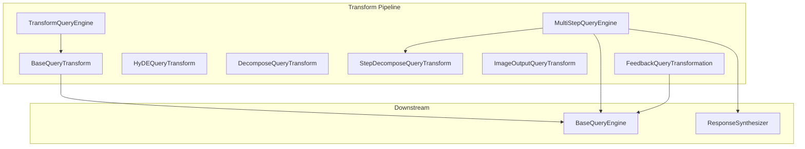
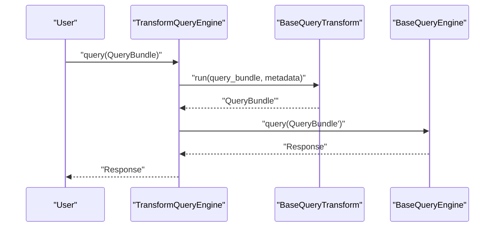
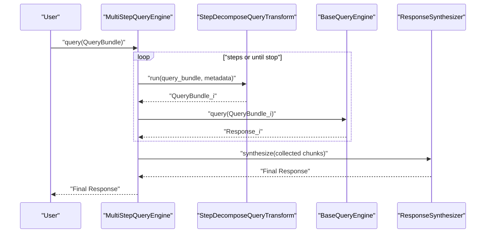
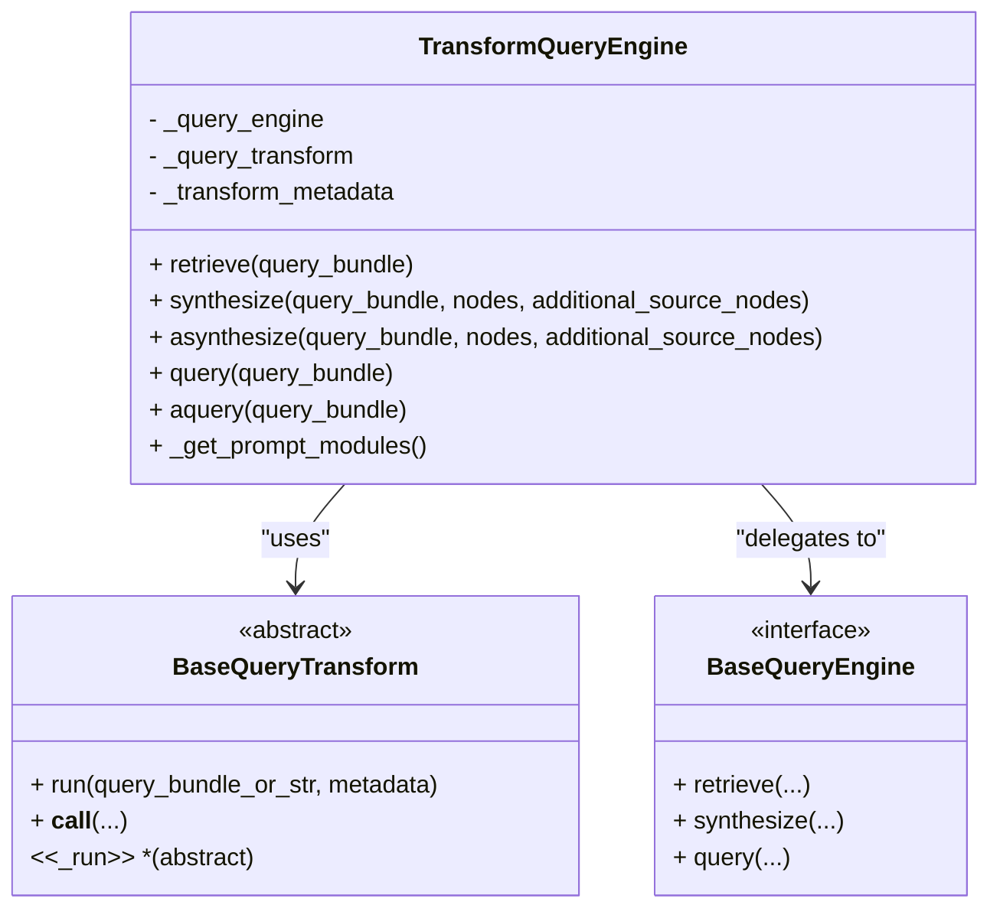
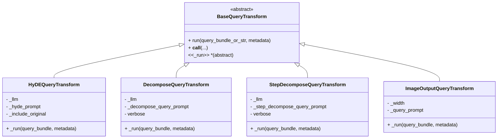
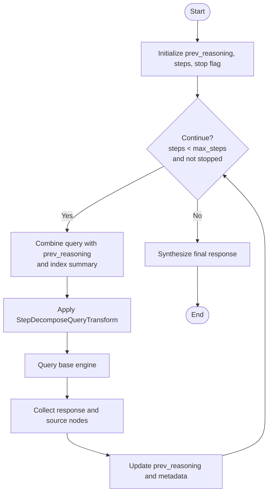
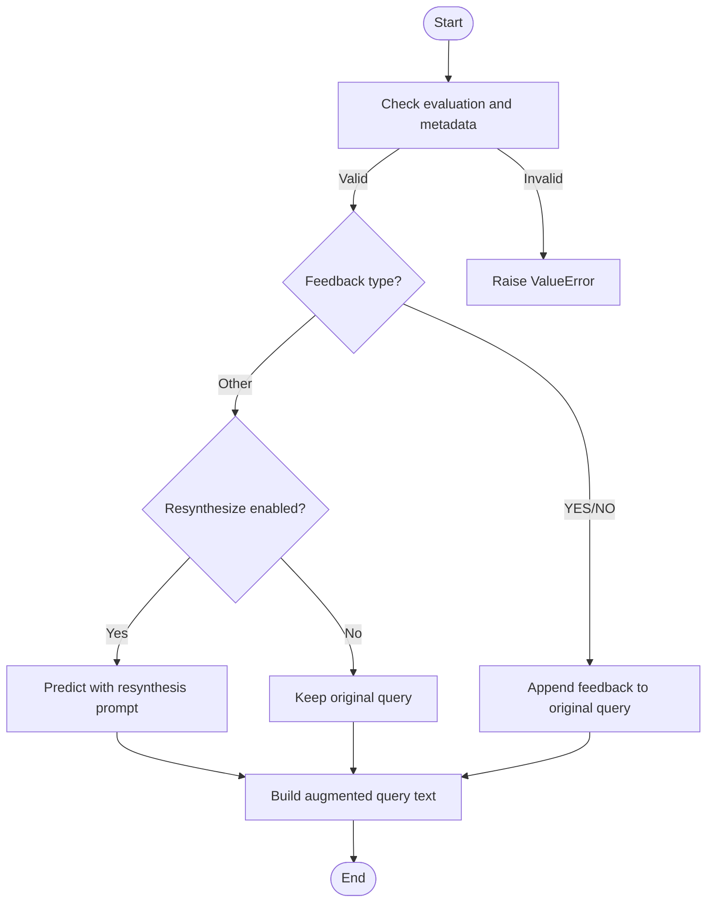
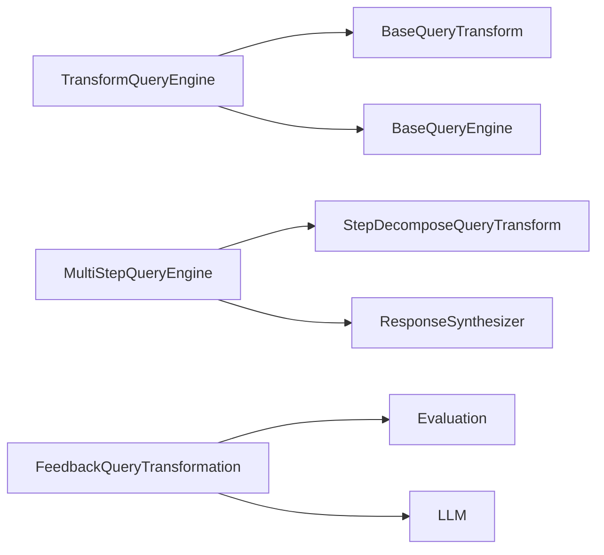

# Transform Query Engines

<cite>
**Referenced Files in This Document**
- [transform_query_engine.py](file://llama-index-core/llama_index/core/query_engine/transform_query_engine.py)
- [base.py](file://llama-index-core/llama_index/core/indices/query/query_transform/base.py)
- [prompts.py](file://llama-index-core/llama_index/core/indices/query/query_transform/prompts.py)
- [feedback_transform.py](file://llama-index-core/llama_index/core/indices/query/query_transform/feedback_transform.py)
- [multistep_query_engine.py](file://llama-index-core/llama_index/core/query_engine/multistep_query_engine.py)
- [custom.py](file://llama-index-core/llama_index/core/query_engine/custom.py)
- [pipeline.py](file://llama-index-core/llama_index/core/ingestion/pipeline.py)
- [query_transformations.md](file://docs/src/content/docs/framework/optimizing/advanced_retrieval/query_transformations.md)
</cite>

## Table of Contents
1. [Introduction](#introduction)
2. [Project Structure](#project-structure)
3. [Core Components](#core-components)
4. [Architecture Overview](#architecture-overview)
5. [Detailed Component Analysis](#detailed-component-analysis)
6. [Dependency Analysis](#dependency-analysis)
7. [Performance Considerations](#performance-considerations)
8. [Troubleshooting Guide](#troubleshooting-guide)
9. [Conclusion](#conclusion)
10. [Appendices](#appendices)

## Introduction
Transform query engines modify queries through a series of processing steps before delegating to a downstream query engine. This document explains the transformation pipeline, step-by-step query processing, and iterative refinement strategies. It covers the TransformQueryEngine implementation, query transformation functions, multi-step workflows, advanced use cases such as query decomposition and iterative improvement, and practical guidance for building custom transformation chains, enhancing queries, and optimizing performance. It also provides debugging tips and metrics for evaluating transformation effectiveness.

## Project Structure
The transform query engine ecosystem centers around:
- A thin adapter that applies a query transform to a QueryBundle before invoking a base query engine.
- A set of built-in query transforms (e.g., HyDE, single-step decomposition, step-wise decomposition, image output formatting).
- A multi-step orchestrator that iteratively refines queries and aggregates results.
- Optional feedback-driven transformations that refine queries based on evaluation outcomes.
- Utilities for building custom query engines and caching transformation results.

**Diagram sources**
- [transform_query_engine.py](file://llama-index-core/llama_index/core/query_engine/transform_query_engine.py#L11-L95)
- [base.py](file://llama-index-core/llama_index/core/indices/query/query_transform/base.py#L30-L322)
- [multistep_query_engine.py](file://llama-index-core/llama_index/core/query_engine/multistep_query_engine.py#L26-L179)
- [feedback_transform.py](file://llama-index-core/llama_index/core/indices/query/query_transform/feedback_transform.py#L28-L118)

**Section sources**
- [transform_query_engine.py](file://llama-index-core/llama_index/core/query_engine/transform_query_engine.py#L11-L95)
- [base.py](file://llama-index-core/llama_index/core/indices/query/query_transform/base.py#L30-L322)
- [multistep_query_engine.py](file://llama-index-core/llama_index/core/query_engine/multistep_query_engine.py#L26-L179)
- [feedback_transform.py](file://llama-index-core/llama_index/core/indices/query/query_transform/feedback_transform.py#L28-L118)

## Core Components
- TransformQueryEngine: Applies a BaseQueryTransform to a QueryBundle and forwards it to a BaseQueryEngine for retrieval, synthesis, or querying.
- BaseQueryTransform and subclasses: Define transformation logic and prompt modules. Includes HyDE, single-step decomposition, step-wise decomposition, and image output formatting.
- MultiStepQueryEngine: Iteratively applies a step-wise decomposition transform, executes queries, aggregates results, and synthesizes a final response.
- FeedbackQueryTransformation: Adjusts queries based on evaluation feedback, optionally resynthesizing the query using an LLM.
- CustomQueryEngine: A flexible base for building custom query engines with custom_query/acustom_query hooks.

**Section sources**
- [transform_query_engine.py](file://llama-index-core/llama_index/core/query_engine/transform_query_engine.py#L11-L95)
- [base.py](file://llama-index-core/llama_index/core/indices/query/query_transform/base.py#L30-L322)
- [multistep_query_engine.py](file://llama-index-core/llama_index/core/query_engine/multistep_query_engine.py#L26-L179)
- [feedback_transform.py](file://llama-index-core/llama_index/core/indices/query/query_transform/feedback_transform.py#L28-L118)
- [custom.py](file://llama-index-core/llama_index/core/query_engine/custom.py#L16-L78)

## Architecture Overview
The transformation pipeline applies a query transform to a QueryBundle before invoking the underlying query engine. For multi-step workflows, the engine iteratively decomposes the query, executes against the index, collects intermediate results, and synthesizes a final response.

**Diagram sources**
- [transform_query_engine.py](file://llama-index-core/llama_index/core/query_engine/transform_query_engine.py#L82-L95)
- [base.py](file://llama-index-core/llama_index/core/indices/query/query_transform/base.py#L50-L74)

**Diagram sources**
- [multistep_query_engine.py](file://llama-index-core/llama_index/core/query_engine/multistep_query_engine.py#L126-L179)
- [base.py](file://llama-index-core/llama_index/core/indices/query/query_transform/base.py#L259-L322)

## Detailed Component Analysis

### TransformQueryEngine
TransformQueryEngine wraps a BaseQueryEngine and a BaseQueryTransform. It applies the transform to the QueryBundle during retrieve, synthesize, and query operations. It exposes prompt modules for introspection and integrates with the callback manager.

Key behaviors:
- Applies transform in retrieve, synthesize, and query paths.
- Supports both sync and async variants.
- Exposes prompt modules via _get_prompt_modules for external inspection.

**Diagram sources**
- [transform_query_engine.py](file://llama-index-core/llama_index/core/query_engine/transform_query_engine.py#L11-L95)
- [base.py](file://llama-index-core/llama_index/core/indices/query/query_transform/base.py#L30-L74)

**Section sources**
- [transform_query_engine.py](file://llama-index-core/llama_index/core/query_engine/transform_query_engine.py#L11-L95)

### BaseQueryTransform and Built-in Transforms
BaseQueryTransform defines the interface for transforming a QueryBundle. Concrete implementations include:
- HyDEQueryTransform: Generates hypothetical answers and augments embedding strings.
- DecomposeQueryTransform: Produces a new query based on index context.
- StepDecomposeQueryTransform: Iteratively refines queries using prior reasoning.
- ImageOutputQueryTransform: Augments queries to request formatted image outputs.

**Diagram sources**
- [base.py](file://llama-index-core/llama_index/core/indices/query/query_transform/base.py#L30-L322)

**Section sources**
- [base.py](file://llama-index-core/llama_index/core/indices/query/query_transform/base.py#L30-L322)

### Prompts and Templates
Default prompts guide transforms:
- DecomposeQueryTransformPrompt and StepDecomposeQueryTransformPrompt define templates for generating refined queries.
- ImageOutputQueryTransformPrompt instructs LLMs to produce HTML-formatted images.

These templates are used by the corresponding transforms to produce new query strings.

**Section sources**
- [prompts.py](file://llama-index-core/llama_index/core/indices/query/query_transform/prompts.py#L34-L130)

### MultiStepQueryEngine
MultiStepQueryEngine orchestrates iterative query refinement:
- Uses StepDecomposeQueryTransform to generate subsequent queries.
- Executes each transformed query against the base query engine.
- Aggregates intermediate results and passes them to a response synthesizer.
- Supports early stopping via a configurable stop function.

**Diagram sources**
- [multistep_query_engine.py](file://llama-index-core/llama_index/core/query_engine/multistep_query_engine.py#L126-L179)
- [base.py](file://llama-index-core/llama_index/core/indices/query/query_transform/base.py#L259-L322)

**Section sources**
- [multistep_query_engine.py](file://llama-index-core/llama_index/core/query_engine/multistep_query_engine.py#L26-L179)

### FeedbackQueryTransformation
FeedbackQueryTransformation adjusts queries after evaluation:
- Validates presence of evaluation response and feedback.
- Optionally resynthesizes the query using an LLM and a dedicated prompt.
- Constructs augmented query text combining prior response and feedback.

**Diagram sources**
- [feedback_transform.py](file://llama-index-core/llama_index/core/indices/query/query_transform/feedback_transform.py#L60-L118)

**Section sources**
- [feedback_transform.py](file://llama-index-core/llama_index/core/indices/query/query_transform/feedback_transform.py#L28-L118)

### CustomQueryEngine
CustomQueryEngine provides a base for building custom query engines with custom_query/acustom_query methods. It supports returning either Response objects or plain strings and integrates with the callback manager.

**Section sources**
- [custom.py](file://llama-index-core/llama_index/core/query_engine/custom.py#L16-L78)

## Dependency Analysis
TransformQueryEngine depends on BaseQueryTransform and BaseQueryEngine. MultiStepQueryEngine depends on StepDecomposeQueryTransform and a ResponseSynthesizer. FeedbackQueryTransformation depends on an Evaluation object and an LLM.

**Diagram sources**
- [transform_query_engine.py](file://llama-index-core/llama_index/core/query_engine/transform_query_engine.py#L11-L95)
- [multistep_query_engine.py](file://llama-index-core/llama_index/core/query_engine/multistep_query_engine.py#L26-L179)
- [feedback_transform.py](file://llama-index-core/llama_index/core/indices/query/query_transform/feedback_transform.py#L28-L118)

**Section sources**
- [transform_query_engine.py](file://llama-index-core/llama_index/core/query_engine/transform_query_engine.py#L11-L95)
- [multistep_query_engine.py](file://llama-index-core/llama_index/core/query_engine/multistep_query_engine.py#L26-L179)
- [feedback_transform.py](file://llama-index-core/llama_index/core/indices/query/query_transform/feedback_transform.py#L28-L118)

## Performance Considerations
- Caching transformations: The ingestion pipeline demonstrates hashing and caching of transformation results to avoid recomputation. This pattern can be adapted for query-time transformations to reduce repeated LLM calls.
- Minimizing LLM calls: Prefer lightweight transforms when possible; batch or reuse embeddings where feasible.
- Early stopping: MultiStepQueryEngine supports early stopping to prevent unnecessary iterations.
- Async execution: Use async variants (asynthesize, aquery) to overlap I/O and computation.

**Section sources**
- [pipeline.py](file://llama-index-core/llama_index/core/ingestion/pipeline.py#L57-L105)
- [multistep_query_engine.py](file://llama-index-core/llama_index/core/query_engine/multistep_query_engine.py#L17-L24)

## Troubleshooting Guide
Common issues and remedies:
- Invalid prompt type errors: Ensure prompts used by transforms match supported prompt types. Verify prompt initialization and types.
- Missing evaluation metadata: FeedbackQueryTransformation requires evaluation.response and evaluation.feedback; ensure these are present before applying the transform.
- Iterative refinement not converging: Tune the stop function and number of steps in MultiStepQueryEngine. Review index_summary and prev_reasoning propagation.
- Debugging transformation chains: Use verbose modes in transforms (e.g., DecomposeQueryTransform and StepDecomposeQueryTransform) to inspect query changes.

**Section sources**
- [feedback_transform.py](file://llama-index-core/llama_index/core/indices/query/query_transform/feedback_transform.py#L60-L93)
- [base.py](file://llama-index-core/llama_index/core/indices/query/query_transform/base.py#L189-L211)
- [base.py](file://llama-index-core/llama_index/core/indices/query/query_transform/base.py#L297-L322)

## Conclusion
Transform query engines provide a powerful abstraction for iterative, multi-step query refinement. By composing BaseQueryTransforms with TransformQueryEngine and MultiStepQueryEngine, you can implement advanced strategies like HyDE, single-step decomposition, and iterative sub-question generation. Feedback-driven transforms further enable adaptive query improvement. With careful attention to caching, early stopping, and prompt correctness, these systems can significantly improve retrieval quality and response coherence.

## Appendices

### Practical Examples and Guidance
- Single-step HyDE: Wrap a base query engine with TransformQueryEngine and HyDEQueryTransform to improve embedding quality.
- Multi-step decomposition: Use MultiStepQueryEngine with StepDecomposeQueryTransform to iteratively refine queries and synthesize a final answer.
- Building custom transformation chains: Compose multiple BaseQueryTransform instances and apply them via TransformQueryEngine or orchestrate with MultiStepQueryEngine.
- Query enhancement techniques: Add image output formatting, adjust prompts, or incorporate domain-specific instructions through transform prompts.
- Measuring transformation effectiveness: Track query quality metrics, response coherence scores, and iteration counts; leverage evaluation feedback to refine transforms.

**Section sources**
- [query_transformations.md](file://docs/src/content/docs/framework/optimizing/advanced_retrieval/query_transformations.md#L1-L88)
- [transform_query_engine.py](file://llama-index-core/llama_index/core/query_engine/transform_query_engine.py#L11-L95)
- [multistep_query_engine.py](file://llama-index-core/llama_index/core/query_engine/multistep_query_engine.py#L26-L179)
- [base.py](file://llama-index-core/llama_index/core/indices/query/query_transform/base.py#L96-L151)
- [base.py](file://llama-index-core/llama_index/core/indices/query/query_transform/base.py#L153-L211)
- [base.py](file://llama-index-core/llama_index/core/indices/query/query_transform/base.py#L259-L322)