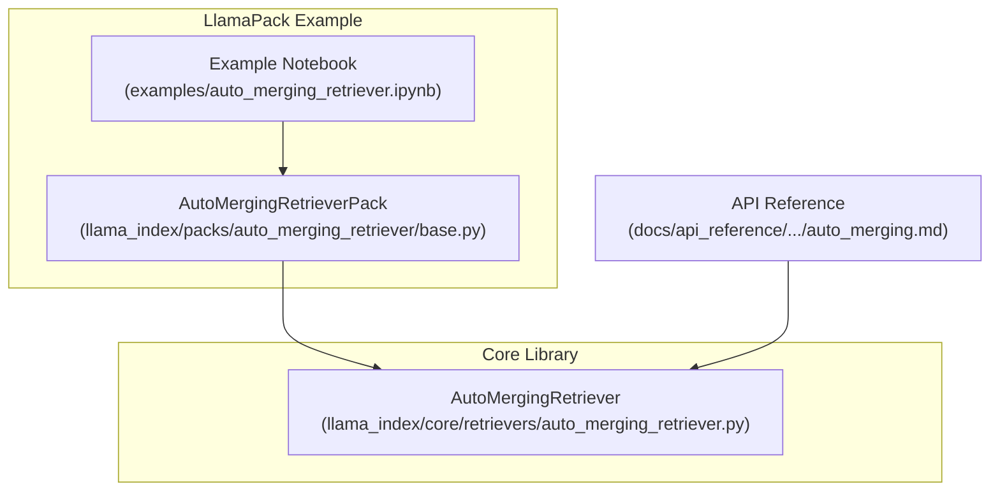
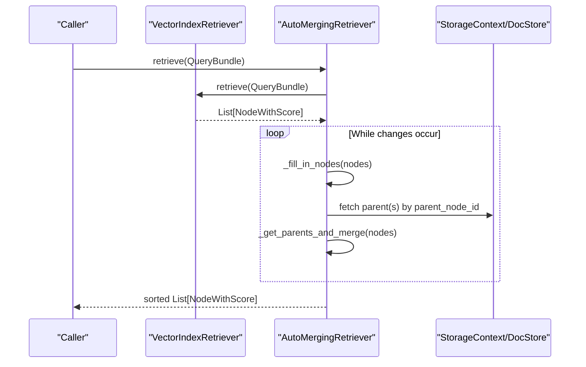
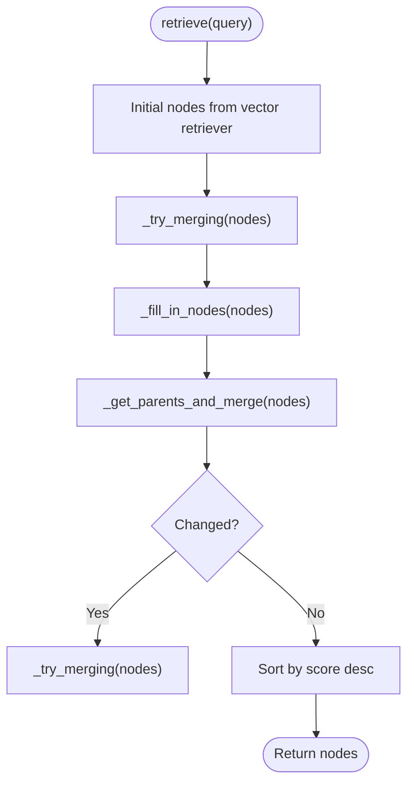
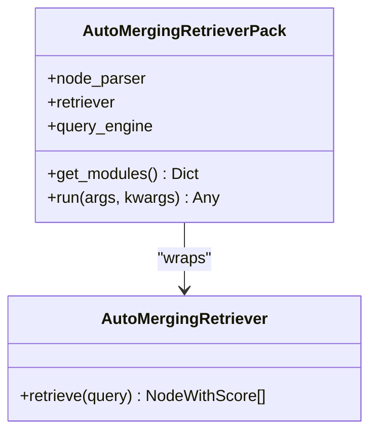
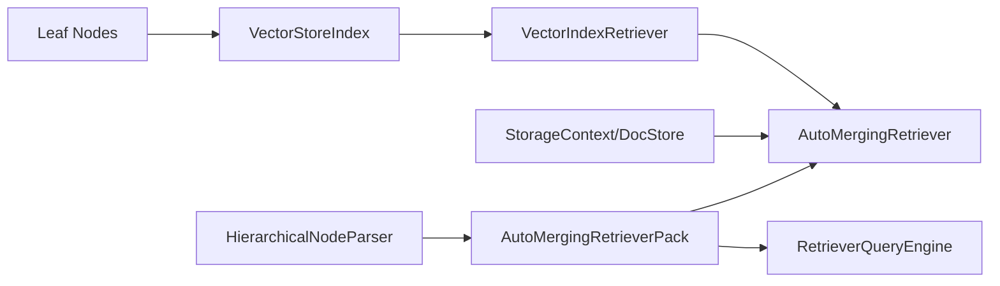

# Auto-Merging Retrievers

<cite>
**Referenced Files in This Document**
- [auto_merging_retriever.py](file://llama-index-core/llama_index/core/retrievers/auto_merging_retriever.py)
- [base.py](file://llama-index-packs/llama-index-packs-auto-merging-retriever/llama_index/packs/auto_merging_retriever/base.py)
- [auto_merging.md](file://docs/api_reference/api_reference/retrievers/auto_merging.md)
- [auto_merging_retriever.ipynb](file://docs/examples/retrievers/auto_merging_retriever.ipynb)
- [auto_merging_retriever.ipynb](file://llama-index-packs/llama-index-packs-auto-merging-retriever/examples/auto_merging_retriever.ipynb)
- [test_packs_auto_merging_retriever.py](file://llama-index-packs/llama-index-packs-auto-merging-retriever/tests/test_packs_auto_merging_retriever.py)
- [README.md](file://llama-index-packs/llama-index-packs-auto-merging-retriever/README.md)
</cite>

## Table of Contents
1. [Introduction](#introduction)
2. [Project Structure](#project-structure)
3. [Core Components](#core-components)
4. [Architecture Overview](#architecture-overview)
5. [Detailed Component Analysis](#detailed-component-analysis)
6. [Dependency Analysis](#dependency-analysis)
7. [Performance Considerations](#performance-considerations)
8. [Troubleshooting Guide](#troubleshooting-guide)
9. [Conclusion](#conclusion)
10. [Appendices](#appendices)

## Introduction
This document explains the AutoMergingRetriever in LlamaIndex, which automatically consolidates overlapping or adjacent retrieved chunks into higher-level parent nodes to improve recall and coherence in retrieval-augmented generation (RAG). It covers the hierarchical merging algorithm, overlap detection via parent-child relationships, result consolidation, configuration parameters, performance characteristics, and integration with recursive retrieval patterns.

## Project Structure
The AutoMergingRetriever lives in the core library and is complemented by a LlamaPack that demonstrates end-to-end usage with hierarchical node parsing and storage.

**Diagram sources**
- [auto_merging_retriever.py](file://llama-index-core/llama_index/core/retrievers/auto_merging_retriever.py#L26-L195)
- [base.py](file://llama-index-packs/llama-index-packs-auto-merging-retriever/llama_index/packs/auto_merging_retriever/base.py#L18-L62)
- [auto_merging.md](file://docs/api_reference/api_reference/retrievers/auto_merging.md#L1-L4)
- [auto_merging_retriever.ipynb](file://llama-index-packs/llama-index-packs-auto-merging-retriever/examples/auto_merging_retriever.ipynb#L1-L219)

**Section sources**
- [auto_merging_retriever.py](file://llama-index-core/llama_index/core/retrievers/auto_merging_retriever.py#L1-L195)
- [base.py](file://llama-index-packs/llama-index-packs-auto-merging-retriever/llama_index/packs/auto_merging_retriever/base.py#L1-L62)
- [auto_merging.md](file://docs/api_reference/api_reference/retrievers/auto_merging.md#L1-L4)

## Core Components
- AutoMergingRetriever: Orchestrates retrieval, iterative merging, and consolidation.
- AutoMergingRetrieverPack: Builds a hierarchical node graph and wires a retriever with a query engine.
- HierarchicalNodeParser: Generates parent-child node hierarchies from raw documents.
- StorageContext and DocStore: Persist nodes and enable parent retrieval by ID.

Key responsibilities:
- Retrieve initial nodes from a vector index.
- Detect overlaps via parent-child relationships and fill gaps using prev/next relations.
- Merge overlapping children into parent nodes when coverage exceeds a threshold.
- Repeat until no further changes occur and sort by similarity.

**Section sources**
- [auto_merging_retriever.py](file://llama-index-core/llama_index/core/retrievers/auto_merging_retriever.py#L26-L195)
- [base.py](file://llama-index-packs/llama-index-packs-auto-merging-retriever/llama_index/packs/auto_merging_retriever/base.py#L18-L62)

## Architecture Overview
The retriever composes a vector retriever with a docstore-backed parent lookup. It iteratively applies two strategies:
1) Fill-in: Insert missing intermediate nodes when consecutive leaf nodes are linked by prev/next.
2) Merge: Replace a group of child nodes with their shared parent if the child-to-parent ratio exceeds a threshold.

**Diagram sources**
- [auto_merging_retriever.py](file://llama-index-core/llama_index/core/retrievers/auto_merging_retriever.py#L176-L195)
- [auto_merging_retriever.py](file://llama-index-core/llama_index/core/retrievers/auto_merging_retriever.py#L127-L174)
- [auto_merging_retriever.py](file://llama-index-core/llama_index/core/retrievers/auto_merging_retriever.py#L56-L126)

## Detailed Component Analysis

### AutoMergingRetriever
- Initialization parameters:
  - vector_retriever: Underlying retriever backed by a vector index.
  - storage_context: Provides access to a docstore for parent node retrieval.
  - simple_ratio_thresh: Threshold for deciding whether to merge children into a parent.
  - verbose: Controls logging/printing of merge actions.
- Internal steps:
  - Retrieve initial nodes from the vector retriever.
  - Iteratively apply fill-in and merge until no change occurs.
  - Sort final nodes by similarity score.

**Diagram sources**
- [auto_merging_retriever.py](file://llama-index-core/llama_index/core/retrievers/auto_merging_retriever.py#L176-L195)
- [auto_merging_retriever.py](file://llama-index-core/llama_index/core/retrievers/auto_merging_retriever.py#L166-L174)
- [auto_merging_retriever.py](file://llama-index-core/llama_index/core/retrievers/auto_merging_retriever.py#L127-L174)

Key methods and behaviors:
- _fill_in_nodes(nodes): Uses prev/next relationships to insert intermediate nodes between adjacent leaf nodes, averaging scores for the inserted node.
- _get_parents_and_merge(nodes): Computes child-to-parent coverage ratio per parent; if above threshold, replaces children with a single parent node whose score is the average of children’s scores.
- _try_merging(nodes): Applies fill-in then merge in sequence.
- _retrieve(query): Driver that runs iterative merging and sorts results.

Configuration parameters:
- simple_ratio_thresh: Minimum fraction of children present relative to total parent children to trigger merging.
- verbose: Enables informational logs for merges and fill-ins.

Practical examples:
- The example notebooks demonstrate merging behavior and improved recall versus baseline retrievers.

**Section sources**
- [auto_merging_retriever.py](file://llama-index-core/llama_index/core/retrievers/auto_merging_retriever.py#L26-L195)
- [auto_merging_retriever.ipynb](file://docs/examples/retrievers/auto_merging_retriever.ipynb#L340-L371)
- [auto_merging_retriever.ipynb](file://docs/examples/retrievers/auto_merging_retriever.ipynb#L691-L715)

### AutoMergingRetrieverPack
- Builds a hierarchical node graph from documents using HierarchicalNodeParser.
- Inserts all nodes into a SimpleDocumentStore and constructs a StorageContext.
- Creates a VectorStoreIndex over leaf nodes and an AutoMergingRetriever wrapping it.
- Exposes a RetrieverQueryEngine for end-to-end querying.

**Diagram sources**
- [base.py](file://llama-index-packs/llama-index-packs-auto-merging-retriever/llama_index/packs/auto_merging_retriever/base.py#L18-L62)

Usage highlights:
- Demonstrated in the example notebook and CLI usage documented in the pack README.
- The pack’s run method delegates to the query engine.

**Section sources**
- [base.py](file://llama-index-packs/llama-index-packs-auto-merging-retriever/llama_index/packs/auto_merging_retriever/base.py#L18-L62)
- [README.md](file://llama-index-packs/llama-index-packs-auto-merging-retriever/README.md#L1-L66)
- [auto_merging_retriever.ipynb](file://llama-index-packs/llama-index-packs-auto-merging-retriever/examples/auto_merging_retriever.ipynb#L56-L108)

### HierarchicalNodeParser and Storage
- HierarchicalNodeParser generates a multi-level hierarchy from documents, enabling parent nodes to cover broader context.
- get_leaf_nodes extracts the bottom-most nodes for vector indexing.
- StorageContext and SimpleDocumentStore persist nodes and support parent retrieval by node_id.

Integration points:
- Nodes are inserted into the docstore and referenced by the retriever to fetch parents.
- Vector index indexes only leaf nodes; higher-level nodes are retrieved from docstore.

**Section sources**
- [base.py](file://llama-index-packs/llama-index-packs-auto-merging-retriever/llama_index/packs/auto_merging_retriever/base.py#L34-L44)
- [auto_merging_retriever.ipynb](file://docs/examples/retrievers/auto_merging_retriever.ipynb#L170-L231)

## Dependency Analysis
- AutoMergingRetriever depends on:
  - VectorIndexRetriever for initial similarity-based retrieval.
  - StorageContext/DocStore for parent node resolution.
  - NodeWithScore and related schema for scoring and sorting.
- AutoMergingRetrieverPack depends on:
  - HierarchicalNodeParser for node hierarchy construction.
  - VectorStoreIndex for leaf-node indexing.
  - RetrieverQueryEngine for query orchestration.

**Diagram sources**
- [auto_merging_retriever.py](file://llama-index-core/llama_index/core/retrievers/auto_merging_retriever.py#L35-L54)
- [base.py](file://llama-index-packs/llama-index-packs-auto-merging-retriever/llama_index/packs/auto_merging_retriever/base.py#L34-L49)

**Section sources**
- [auto_merging_retriever.py](file://llama-index-core/llama_index/core/retrievers/auto_merging_retriever.py#L1-L23)
- [base.py](file://llama-index-packs/llama-index-packs-auto-merging-retriever/llama_index/packs/auto_merging_retriever/base.py#L1-L16)

## Performance Considerations
- Retrieval cost:
  - Initial retrieval scales with similarity_top_k and vector index size.
  - Iterative merging may repeat retrieval-like operations when computing ratios and inserting fill-in nodes.
- Memory usage:
  - Storing all hierarchical nodes in a docstore increases memory footprint; prune unnecessary metadata if needed.
  - Parent caching avoids repeated docstore lookups within a single merge pass.
- Convergence:
  - The iterative loop stops when no changes occur; typical convergence is fast due to bounded parent-child relationships.
- Scoring:
  - Parent scores are averaged across children; consider alternative aggregation strategies if embedding scores are not directly comparable.
- Overlap ratio threshold:
  - Lower thresholds increase merging frequency; higher thresholds preserve granularity but reduce recall benefits.

[No sources needed since this section provides general guidance]

## Troubleshooting Guide
Common issues and remedies:
- No merging occurs:
  - Verify that nodes have parent relationships and that simple_ratio_thresh is appropriate for your hierarchy.
  - Confirm that StorageContext contains parent nodes and that node IDs match.
- Unexpected ordering:
  - Ensure similarity_top_k is sufficient to capture relevant parents; adjust based on query and index size.
- Logging verbosity:
  - Enable verbose mode to inspect merge decisions and fill-in actions.
- Performance bottlenecks:
  - Reduce similarity_top_k or limit max iterations by controlling the underlying vector retriever settings.
  - Consider pruning non-essential metadata to reduce docstore size.

**Section sources**
- [auto_merging_retriever.py](file://llama-index-core/llama_index/core/retrievers/auto_merging_retriever.py#L35-L54)
- [auto_merging_retriever.py](file://llama-index-core/llama_index/core/retrievers/auto_merging_retriever.py#L176-L195)

## Conclusion
The AutoMergingRetriever enhances recall in hierarchical RAG setups by stitching together overlapping or adjacent chunks into coherent parent contexts. Its iterative fill-in and merge routines, guided by parent-child relationships and a configurable threshold, produce consolidated, higher-level results that often improve downstream synthesis quality. Combined with the AutoMergingRetrieverPack, users can quickly build and evaluate hierarchical retrieval pipelines.

[No sources needed since this section summarizes without analyzing specific files]

## Appendices

### Practical Examples and Usage Patterns
- End-to-end notebook walkthrough:
  - Demonstrates hierarchical parsing, storage, base retriever vs. auto-merging retriever comparison, and query engine usage.
- LlamaPack example:
  - Shows CLI and programmatic usage of the pack, including module inspection and response evaluation.

**Section sources**
- [auto_merging_retriever.ipynb](file://docs/examples/retrievers/auto_merging_retriever.ipynb#L1-L1149)
- [auto_merging_retriever.ipynb](file://llama-index-packs/llama-index-packs-auto-merging-retriever/examples/auto_merging_retriever.ipynb#L1-L219)
- [README.md](file://llama-index-packs/llama-index-packs-auto-merging-retriever/README.md#L1-L66)

### API Reference
- AutoMergingRetriever class reference is available in the API docs.

**Section sources**
- [auto_merging.md](file://docs/api_reference/api_reference/retrievers/auto_merging.md#L1-L4)

### Tests
- Basic validation ensures the pack inherits from the expected base class.

**Section sources**
- [test_packs_auto_merging_retriever.py](file://llama-index-packs/llama-index-packs-auto-merging-retriever/tests/test_packs_auto_merging_retriever.py#L1-L8)