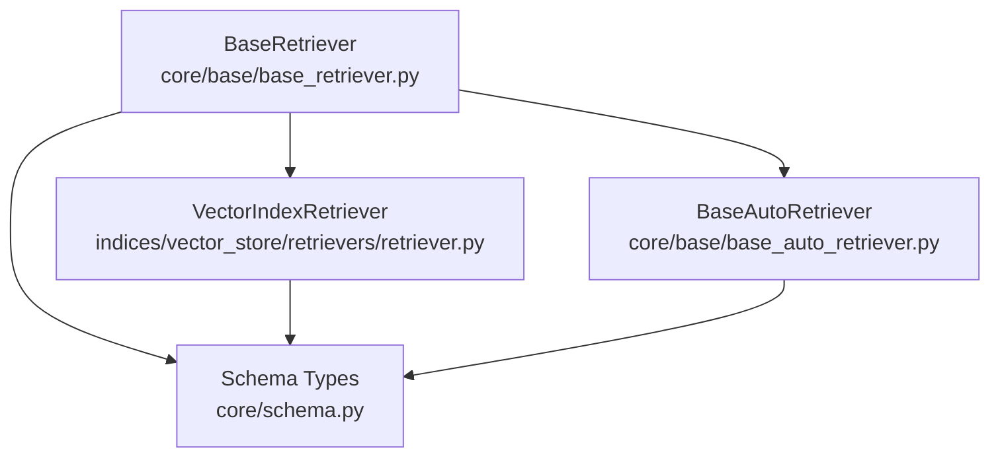
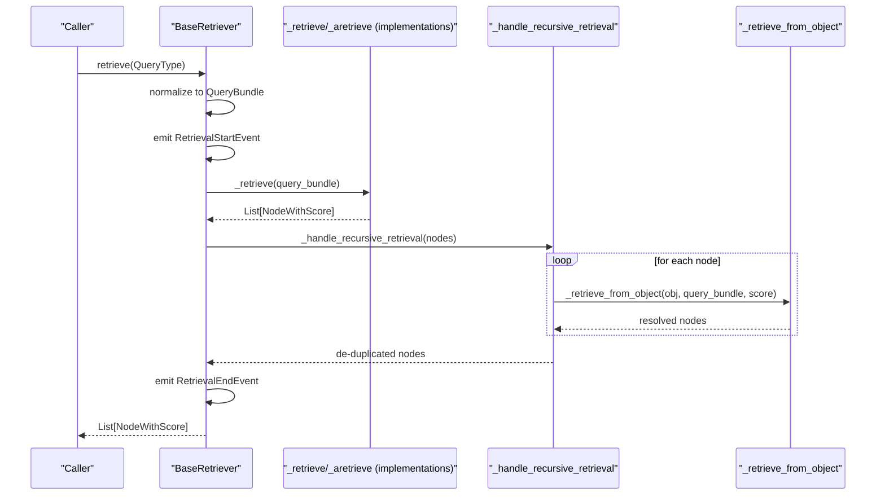
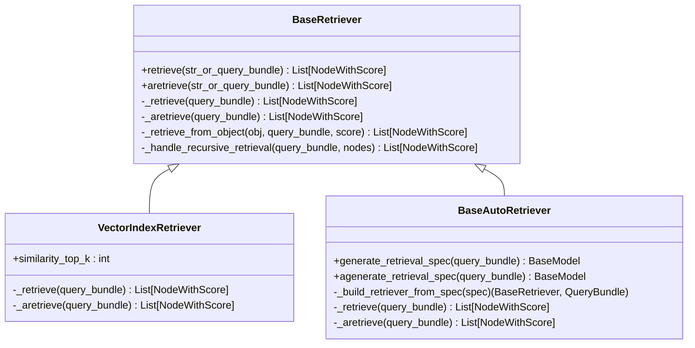
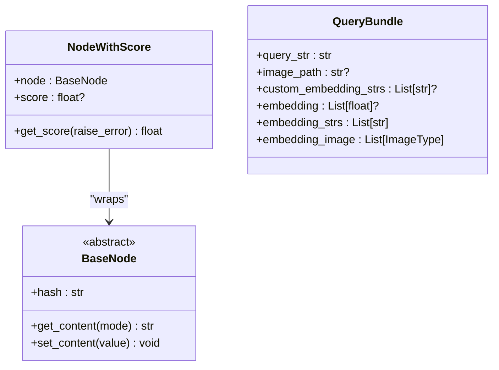
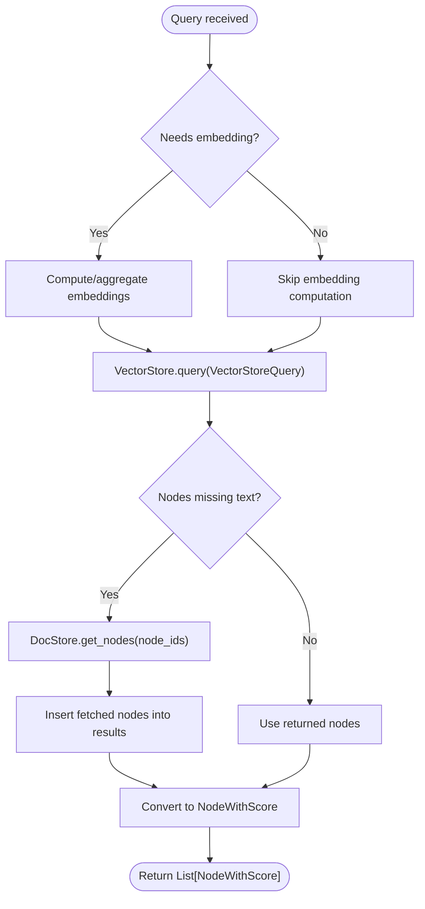
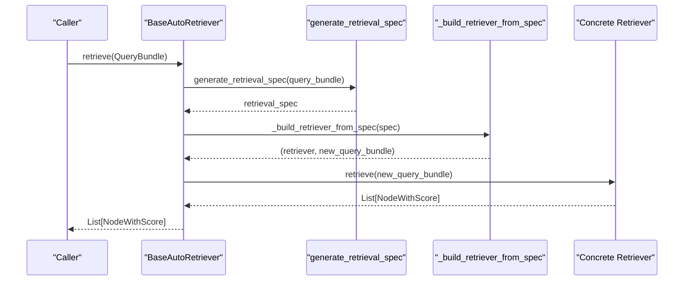
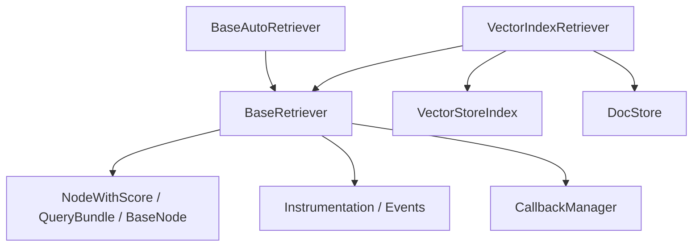

# Base Retriever Interface

<cite>
**Referenced Files in This Document**
- [base_retriever.py](file://llama-index-core/llama_index/core/base/base_retriever.py)
- [retriever.py](file://llama-index-core/llama_index/core/indices/vector_store/retrievers/retriever.py)
- [schema.py](file://llama-index-core/llama_index/core/schema.py)
- [base_auto_retriever.py](file://llama-index-core/llama_index/core/base/base_auto_retriever.py)
- [base_retriever.py](file://llama-index-core/llama_index/core/indices/base_retriever.py)
</cite>

## Table of Contents
1. [Introduction](#introduction)
2. [Project Structure](#project-structure)
3. [Core Components](#core-components)
4. [Architecture Overview](#architecture-overview)
5. [Detailed Component Analysis](#detailed-component-analysis)
6. [Dependency Analysis](#dependency-analysis)
7. [Performance Considerations](#performance-considerations)
8. [Troubleshooting Guide](#troubleshooting-guide)
9. [Conclusion](#conclusion)

## Introduction
This document explains the BaseRetriever interface in LlamaIndex, focusing on its abstract base class design, core synchronous and asynchronous retrieval methods, and the standardized interface that all retriever implementations must follow. It covers the node retrieval pattern, the distinction between query-time and index-time operations, and how retrievers relate to indices. Practical guidance is included for implementing custom retrievers, along with performance considerations, memory management, and integration with the broader LlamaIndex architecture.

## Project Structure
The BaseRetriever interface resides in the core base module and is extended by specialized retrievers such as the VectorIndexRetriever. Supporting schema types (NodeWithScore, QueryBundle) and related base classes (BaseAutoRetriever) are defined in the schema and base modules respectively.

**Diagram sources**
- [base_retriever.py](file://llama-index-core/llama_index/core/base/base_retriever.py#L34-L275)
- [retriever.py](file://llama-index-core/llama_index/core/indices/vector_store/retrievers/retriever.py#L24-L268)
- [schema.py](file://llama-index-core/llama_index/core/schema.py#L949-L1408)
- [base_auto_retriever.py](file://llama-index-core/llama_index/core/base/base_auto_retriever.py#L9-L44)

**Section sources**
- [base_retriever.py](file://llama-index-core/llama_index/core/base/base_retriever.py#L1-L275)
- [retriever.py](file://llama-index-core/llama_index/core/indices/vector_store/retrievers/retriever.py#L1-L268)
- [schema.py](file://llama-index-core/llama_index/core/schema.py#L949-L1408)
- [base_auto_retriever.py](file://llama-index-core/llama_index/core/base/base_auto_retriever.py#L1-L44)

## Core Components
- BaseRetriever: Abstract base class defining the retrieval contract, including synchronous and asynchronous entry points, internal helpers for recursive retrieval, and instrumentation hooks.
- VectorIndexRetriever: Concrete retriever that integrates with a VectorStoreIndex to perform vector similarity search and fetch nodes from a docstore.
- Schema types: NodeWithScore and QueryBundle define the standardized node scoring format and query input abstraction.
- BaseAutoRetriever: Extends BaseRetriever to support dynamic generation of retrieval specs and runtime construction of retrievers.

Key responsibilities:
- Standardized retrieval API: retrieve() and aretrieve() accept either a string or a QueryBundle and return a list of NodeWithScore.
- Recursive retrieval: Handles IndexNode objects by resolving underlying objects (nodes, query engines, or other retrievers) and merging results.
- Instrumentation and callbacks: Emits retrieval start/end events and integrates with the callback manager and instrumentation dispatcher.
- Async-first design: Asynchronous methods are encouraged and fall back to synchronous implementations when async is not overridden.

**Section sources**
- [base_retriever.py](file://llama-index-core/llama_index/core/base/base_retriever.py#L34-L275)
- [retriever.py](file://llama-index-core/llama_index/core/indices/vector_store/retrievers/retriever.py#L24-L268)
- [schema.py](file://llama-index-core/llama_index/core/schema.py#L949-L1408)
- [base_auto_retriever.py](file://llama-index-core/llama_index/core/base/base_auto_retriever.py#L9-L44)

## Architecture Overview
The retrieval pipeline follows a consistent flow: the caller invokes retrieve() or aretrieve(), which normalizes the input to a QueryBundle, triggers instrumentation, delegates to _retrieve/_aretrieve, and finally applies recursive retrieval handling to resolve IndexNode objects.

**Diagram sources**
- [base_retriever.py](file://llama-index-core/llama_index/core/base/base_retriever.py#L185-L221)
- [base_retriever.py](file://llama-index-core/llama_index/core/base/base_retriever.py#L116-L146)
- [base_retriever.py](file://llama-index-core/llama_index/core/base/base_retriever.py#L68-L96)

## Detailed Component Analysis

### BaseRetriever: Abstract Base Class Design
BaseRetriever defines:
- Constructor parameters: callback_manager, object_map, objects (converted to object_map), and verbose flag.
- Public API: retrieve() and aretrieve() with instrumentation and callback integration.
- Internal helpers: _retrieve_from_object and _aretrieve_from_object handle heterogeneous objects (nodes, node-with-score, query engines, other retrievers).
- Recursive retrieval: _handle_recursive_retrieval and _ahandle_recursive_retrieval resolve IndexNode objects via object_map and prevent duplicates.
- Abstract methods: _retrieve (required) and _aretrieve (optional; defaults to synchronous fallback).

**Diagram sources**
- [base_retriever.py](file://llama-index-core/llama_index/core/base/base_retriever.py#L34-L275)
- [retriever.py](file://llama-index-core/llama_index/core/indices/vector_store/retrievers/retriever.py#L24-L268)
- [base_auto_retriever.py](file://llama-index-core/llama_index/core/base/base_auto_retriever.py#L9-L44)

**Section sources**
- [base_retriever.py](file://llama-index-core/llama_index/core/base/base_retriever.py#L34-L275)

### Node Retrieval Pattern and Types
- NodeWithScore: Wraps a BaseNode with an optional score, exposing passthrough properties and methods for convenience.
- QueryBundle: Encapsulates the query string, optional custom embedding strings, and optional precomputed embedding; provides derived properties for embedding strings and images.
- BaseNode: Abstract interface for retrievable content with metadata, relationships, and hashing.

**Diagram sources**
- [schema.py](file://llama-index-core/llama_index/core/schema.py#L949-L1007)
- [schema.py](file://llama-index-core/llama_index/core/schema.py#L1363-L1408)
- [schema.py](file://llama-index-core/llama_index/core/schema.py#L263-L370)

**Section sources**
- [schema.py](file://llama-index-core/llama_index/core/schema.py#L949-L1007)
- [schema.py](file://llama-index-core/llama_index/core/schema.py#L1363-L1408)
- [schema.py](file://llama-index-core/llama_index/core/schema.py#L263-L370)

### VectorIndexRetriever: Index-Time vs Query-Time Operations
VectorIndexRetriever extends BaseRetriever to integrate with a VectorStoreIndex:
- Index-time: Stores references to the index, vector store, docstore, and embedding model.
- Query-time: Builds a VectorStoreQuery from the QueryBundle, optionally computes embeddings, queries the vector store, fetches missing nodes from the docstore, and converts results to NodeWithScore.

**Diagram sources**
- [retriever.py](file://llama-index-core/llama_index/core/indices/vector_store/retrievers/retriever.py#L104-L128)
- [retriever.py](file://llama-index-core/llama_index/core/indices/vector_store/retrievers/retriever.py#L130-L246)

**Section sources**
- [retriever.py](file://llama-index-core/llama_index/core/indices/vector_store/retrievers/retriever.py#L24-L268)

### BaseAutoRetriever: Dynamic Retrieval Specs
BaseAutoRetriever adds capability to generate retrieval specifications dynamically and construct a retriever per query:
- generate_retrieval_spec and agenerate_retrieval_spec produce a spec from the QueryBundle.
- _build_retriever_from_spec returns a concrete BaseRetriever and a transformed QueryBundle.
- Delegates actual retrieval to the constructed retriever.

**Diagram sources**
- [base_auto_retriever.py](file://llama-index-core/llama_index/core/base/base_auto_retriever.py#L33-L43)

**Section sources**
- [base_auto_retriever.py](file://llama-index-core/llama_index/core/base/base_auto_retriever.py#L9-L44)

## Dependency Analysis
- BaseRetriever depends on schema types (NodeWithScore, QueryBundle, BaseNode), instrumentation, and callback management.
- VectorIndexRetriever depends on BaseRetriever, VectorStoreIndex, and docstore for fetching nodes.
- BaseAutoRetriever depends on BaseRetriever and schema types for spec generation and node resolution.

**Diagram sources**
- [base_retriever.py](file://llama-index-core/llama_index/core/base/base_retriever.py#L1-L31)
- [retriever.py](file://llama-index-core/llama_index/core/indices/vector_store/retrievers/retriever.py#L1-L21)
- [schema.py](file://llama-index-core/llama_index/core/schema.py#L949-L1408)
- [base_auto_retriever.py](file://llama-index-core/llama_index/core/base/base_auto_retriever.py#L1-L7)

**Section sources**
- [base_retriever.py](file://llama-index-core/llama_index/core/base/base_retriever.py#L1-L31)
- [retriever.py](file://llama-index-core/llama_index/core/indices/vector_store/retrievers/retriever.py#L1-L21)
- [schema.py](file://llama-index-core/llama_index/core/schema.py#L949-L1408)
- [base_auto_retriever.py](file://llama-index-core/llama_index/core/base/base_auto_retriever.py#L1-L7)

## Performance Considerations
- Prefer asynchronous retrieval: Implement _aretrieve() to enable non-blocking operations and reduce latency under I/O-bound workloads.
- Minimize redundant node fetches: VectorIndexRetriever avoids fetching nodes whose text is already stored in the vector store.
- Control top-k and filters: Tune similarity_top_k and metadata filters to balance recall and speed.
- Deduplication: BaseRetriever’s recursive handling removes duplicates based on node hash and reference document ID to avoid repeated processing.
- Embedding reuse: Reuse precomputed embeddings via QueryBundle.embedding to avoid recomputation.
- Callback overhead: Instrumentation and callback events add overhead; disable verbose logging and instrumentation in production for maximum throughput.

[No sources needed since this section provides general guidance]

## Troubleshooting Guide
Common issues and resolutions:
- Unexpected object types during recursive retrieval: Ensure object_map contains the correct objects for IndexNode.index_id or pass objects during initialization so object_map is populated.
- Missing nodes after vector store query: Verify that node IDs exist in the index and that the docstore can resolve them; VectorIndexRetriever raises explicit errors when nodes are missing.
- Duplicate nodes in results: BaseRetriever automatically deduplicates by node hash and ref_doc_id; confirm that nodes are properly hashed and metadata is consistent.
- Missing embeddings for hybrid modes: VectorIndexRetriever checks whether embeddings are required for the selected query mode and computes them if absent.

**Section sources**
- [base_retriever.py](file://llama-index-core/llama_index/core/base/base_retriever.py#L116-L146)
- [retriever.py](file://llama-index-core/llama_index/core/indices/vector_store/retrievers/retriever.py#L195-L209)

## Conclusion
BaseRetriever establishes a uniform retrieval interface across LlamaIndex, enabling consistent query-time behavior while supporting diverse index backends and dynamic retrieval strategies. By leveraging NodeWithScore and QueryBundle abstractions, implementing custom retrievers becomes straightforward. VectorIndexRetriever demonstrates index-time and query-time operations, while BaseAutoRetriever enables runtime specialization. Following the performance and troubleshooting guidance helps achieve efficient, reliable retrieval pipelines.