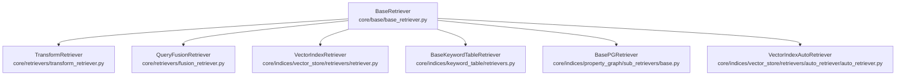
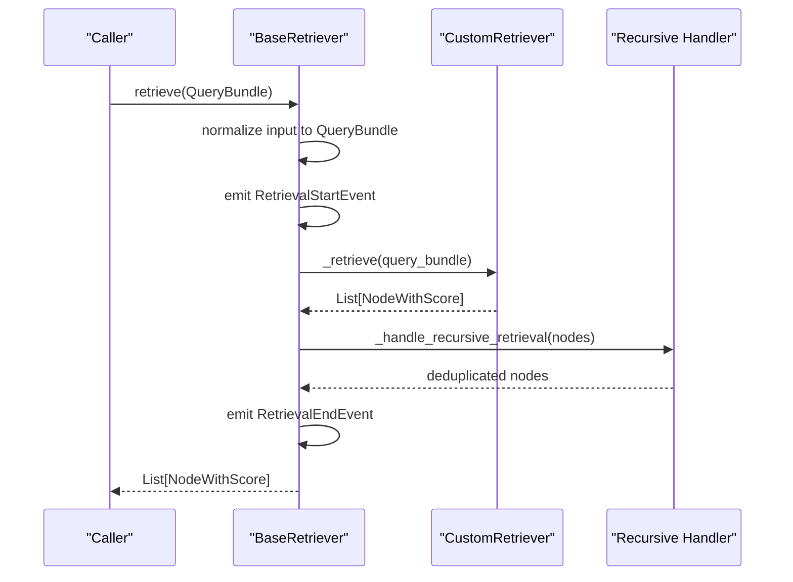
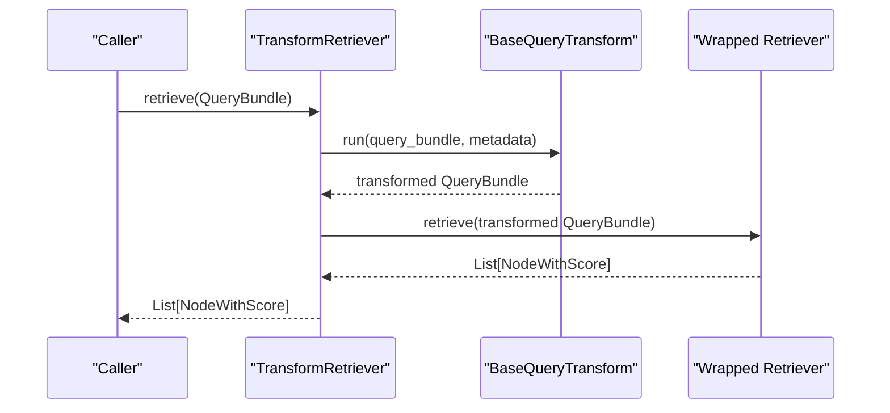
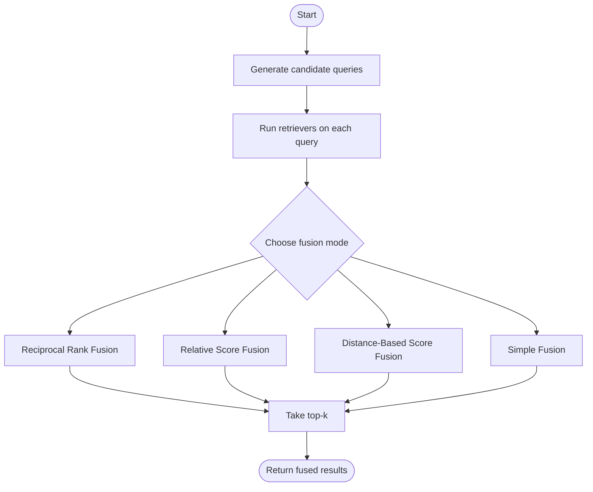
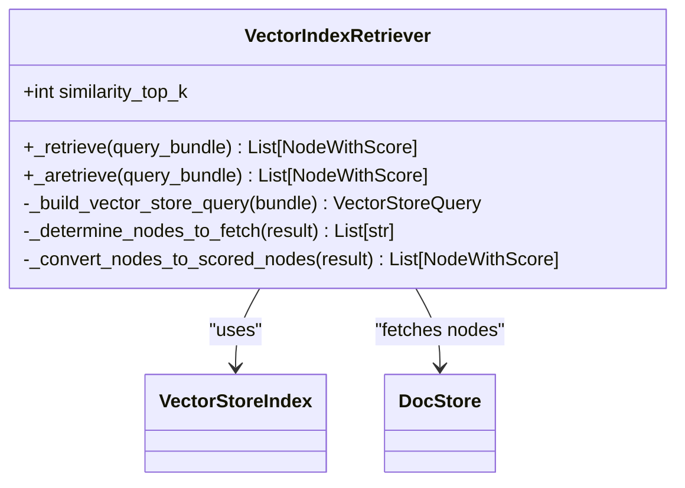
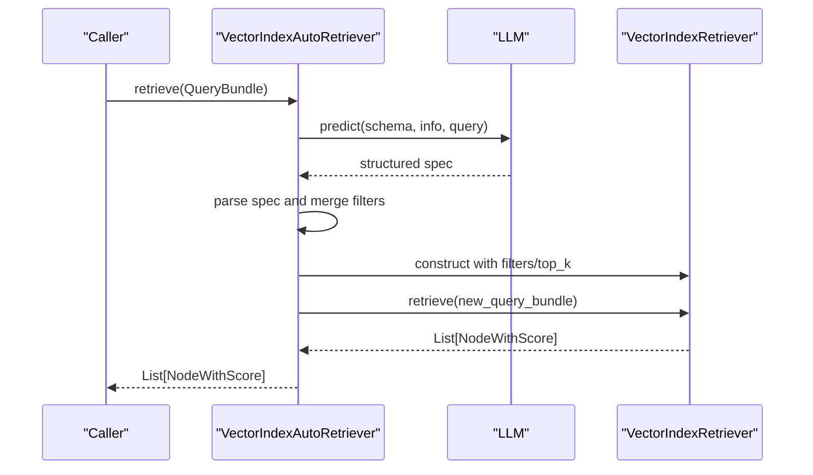
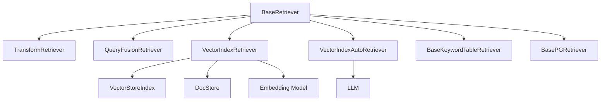

# Custom Retriever Development

<cite>
**Referenced Files in This Document**
- [base_retriever.py](file://llama-index-core/llama_index/core/base/base_retriever.py)
- [base_auto_retriever.py](file://llama-index-core/llama_index/core/base/base_auto_retriever.py)
- [transform_retriever.py](file://llama-index-core/llama_index/core/retrievers/transform_retriever.py)
- [fusion_retriever.py](file://llama-index-core/llama_index/core/retrievers/fusion_retriever.py)
- [retriever.py](file://llama-index-core/llama_index/core/indices/vector_store/retrievers/retriever.py)
- [auto_retriever.py](file://llama-index-core/llama_index/core/indices/vector_store/retrievers/auto_retriever/auto_retriever.py)
- [__init__.py](file://llama-index-core/llama_index/core/retrievers/__init__.py)
- [retrievers.py](file://llama-index-core/llama_index/core/indices/keyword_table/retrievers.py)
- [base.py](file://llama-index-core/llama_index/core/indices/property_graph/sub_retrievers/base.py)
- [image_retriever.py](file://llama-index-core/llama_index/core/image_retriever.py)
</cite>

## Table of Contents
1. [Introduction](#introduction)
2. [Project Structure](#project-structure)
3. [Core Components](#core-components)
4. [Architecture Overview](#architecture-overview)
5. [Detailed Component Analysis](#detailed-component-analysis)
6. [Dependency Analysis](#dependency-analysis)
7. [Performance Considerations](#performance-considerations)
8. [Troubleshooting Guide](#troubleshooting-guide)
9. [Conclusion](#conclusion)
10. [Appendices](#appendices)

## Introduction
This document explains how to develop custom retrievers in LlamaIndex by extending the BaseRetriever class. It covers the minimal implementation requirements, method overrides, integration with existing components, advanced patterns such as TransformRetriever and BaseAutoRetriever, and practical strategies for building domain-specific retrieval strategies. It also includes guidance on query preprocessing, custom similarity measures, performance optimization, testing, debugging, and best practices.

## Project Structure
LlamaIndex organizes retriever-related code primarily under the core retrievers module and index-specific retrievers. The BaseRetriever defines the interface and orchestration, while specialized retrievers demonstrate patterns for vector stores, fusion, transformations, and auto-generated retrieval specs.

**Diagram sources**
- [base_retriever.py](file://llama-index-core/llama_index/core/base/base_retriever.py#L33-L275)
- [transform_retriever.py](file://llama-index-core/llama_index/core/retrievers/transform_retriever.py#L10-L45)
- [fusion_retriever.py](file://llama-index-core/llama_index/core/retrievers/fusion_retriever.py#L33-L305)
- [retriever.py](file://llama-index-core/llama_index/core/indices/vector_store/retrievers/retriever.py#L24-L268)
- [auto_retriever.py](file://llama-index-core/llama_index/core/indices/vector_store/retrievers/auto_retriever/auto_retriever.py#L37-L245)
- [retrievers.py](file://llama-index-core/llama_index/core/indices/keyword_table/retrievers.py#L30-L115)
- [base.py](file://llama-index-core/llama_index/core/indices/property_graph/sub_retrievers/base.py#L21-L164)

**Section sources**
- [__init__.py](file://llama-index-core/llama_index/core/retrievers/__init__.py#L1-L89)

## Core Components
- BaseRetriever: Defines the retrieval lifecycle, callback hooks, recursion handling, and the abstract _retrieve and optional _aretrieve methods. It standardizes how retrievers accept a QueryBundle, emit events, and return NodeWithScore lists.
- TransformRetriever: Wraps another retriever and applies a query transform before delegating retrieval.
- QueryFusionRetriever: Generates multiple queries and fuses results from multiple retrievers using configurable fusion strategies.
- VectorIndexRetriever: Implements retrieval against a VectorStoreIndex, handling embeddings, query modes, filters, and docstore fetching.
- VectorIndexAutoRetriever: Automatically generates retrieval specs using an LLM and builds a VectorIndexRetriever accordingly.
- BaseKeywordTableRetriever and BasePGRetriever: Domain-specific base classes for keyword and property graph retrieval patterns.
- BaseAutoRetriever: Base class for auto-generated retrieval specs; VectorIndexAutoRetriever extends it.

Key responsibilities:
- QueryBundle normalization and dispatch
- Event emission and callback management
- Recursive retrieval across index nodes
- Async/sync retrieval pathways
- Integration with embedding models and vector stores

**Section sources**
- [base_retriever.py](file://llama-index-core/llama_index/core/base/base_retriever.py#L33-L275)
- [transform_retriever.py](file://llama-index-core/llama_index/core/retrievers/transform_retriever.py#L10-L45)
- [fusion_retriever.py](file://llama-index-core/llama_index/core/retrievers/fusion_retriever.py#L33-L305)
- [retriever.py](file://llama-index-core/llama_index/core/indices/vector_store/retrievers/retriever.py#L24-L268)
- [auto_retriever.py](file://llama-index-core/llama_index/core/indices/vector_store/retrievers/auto_retriever/auto_retriever.py#L37-L245)
- [retrievers.py](file://llama-index-core/llama_index/core/indices/keyword_table/retrievers.py#L30-L115)
- [base.py](file://llama-index-core/llama_index/core/indices/property_graph/sub_retrievers/base.py#L21-L164)
- [base_auto_retriever.py](file://llama-index-core/llama_index/core/base/base_auto_retriever.py#L8-L42)

## Architecture Overview
The retrieval pipeline centers on BaseRetriever, which:
- Normalizes inputs to a QueryBundle
- Emits retrieval events
- Calls _retrieve (and optionally _aretrieve)
- Handles recursive retrieval across index nodes
- Returns a list of NodeWithScore

Specialized retrievers plug into this contract:
- TransformRetriever delegates after applying a query transform
- FusionRetriever orchestrates multiple retrievers and fuses results
- VectorIndexRetriever integrates with vector stores and docstores
- AutoRetriever builds a concrete retriever from an LLM-generated spec

**Diagram sources**
- [base_retriever.py](file://llama-index-core/llama_index/core/base/base_retriever.py#L185-L220)
- [base_retriever.py](file://llama-index-core/llama_index/core/base/base_retriever.py#L115-L145)

## Detailed Component Analysis

### BaseRetriever: Implementation Requirements and Overrides
To build a custom retriever:
- Extend BaseRetriever
- Override _retrieve(query_bundle) to implement your retrieval logic
- Optionally override _aretrieve(query_bundle) for async support
- Use the constructor to inject dependencies (e.g., indices, stores, models)
- Leverage callback_manager and verbose for diagnostics and instrumentation

Important behaviors to understand:
- retrieve() normalizes string inputs to QueryBundle, emits events, and invokes _retrieve
- _handle_recursive_retrieval resolves IndexNode references via object_map and removes duplicates
- _retrieve_from_object supports retrieving from nodes, query engines, or other retrievers

Recommended patterns:
- Preprocess query_bundle (e.g., extract keywords, normalize text)
- Integrate with external indices or stores
- Compute and attach scores to NodeWithScore
- Respect verbosity and callback_manager for tracing

**Section sources**
- [base_retriever.py](file://llama-index-core/llama_index/core/base/base_retriever.py#L33-L275)

### TransformRetriever: Query Transformation Pipeline
TransformRetriever wraps an existing retriever and applies a BaseQueryTransform to the incoming QueryBundle before delegating retrieval. This enables domain-specific query rewriting, augmentation, or decomposition.

Implementation highlights:
- Stores the wrapped retriever and query transform
- Applies transform in _retrieve and forwards the transformed QueryBundle
- Exposes _get_prompt_modules to integrate with prompt-aware systems

Usage pattern:
- Wrap an existing retriever (e.g., VectorIndexRetriever)
- Provide a query transform that modifies query_str or embedding_strs
- Optionally pass transform_metadata for contextual hints

**Diagram sources**
- [transform_retriever.py](file://llama-index-core/llama_index/core/retrievers/transform_retriever.py#L40-L44)

**Section sources**
- [transform_retriever.py](file://llama-index-core/llama_index/core/retrievers/transform_retriever.py#L10-L45)

### QueryFusionRetriever: Multi-Retriever Fusion Strategies
QueryFusionRetriever generates multiple queries from the original query and retrieves from multiple retrievers, then fuses results using strategies such as reciprocal rank fusion, relative score fusion, distance-based score fusion, or simple fusion.

Key capabilities:
- Query generation via an LLM
- Configurable fusion modes
- Optional async execution
- Weighted retriever contributions

Integration tips:
- Combine diverse retrievers (e.g., BM25, vector, keyword)
- Tune num_queries and fusion mode per domain
- Control similarity_top_k for final result size

**Diagram sources**
- [fusion_retriever.py](file://llama-index-core/llama_index/core/retrievers/fusion_retriever.py#L24-L305)

**Section sources**
- [fusion_retriever.py](file://llama-index-core/llama_index/core/retrievers/fusion_retriever.py#L33-L305)

### VectorIndexRetriever: Vector Store Integration
VectorIndexRetriever integrates with VectorStoreIndex to perform similarity search, handle embeddings, and fetch missing node text from the docstore. It supports multiple query modes, filters, and hybrid retrieval parameters.

Highlights:
- Embedding computation when required by query mode
- Building VectorStoreQuery and executing against the vector store
- Determining which nodes to fetch from the docstore
- Converting results to NodeWithScore with scores

Customization ideas:
- Implement custom similarity measures by adjusting query mode and alpha
- Add metadata filtering and doc/node ID constraints
- Override embedding aggregation if using custom strategies

**Diagram sources**
- [retriever.py](file://llama-index-core/llama_index/core/indices/vector_store/retrievers/retriever.py#L24-L268)

**Section sources**
- [retriever.py](file://llama-index-core/llama_index/core/indices/vector_store/retrievers/retriever.py#L24-L268)

### VectorIndexAutoRetriever: Auto-Generated Retrieval Specs
VectorIndexAutoRetriever uses an LLM to generate retrieval specs (query string, filters, top_k) from a natural language description of the vector store and supported filters. It then constructs a VectorIndexRetriever with the inferred parameters.

Key steps:
- Prepare prompt with schema and vector store info
- Call LLM to predict structured spec
- Parse and validate spec
- Build retriever with filters/top_k and optional empty query vector
- Return (retriever, query_bundle)

Best practices:
- Provide a clear VectorStoreInfo description
- Clamp top_k to prevent excessive retrieval
- Combine extra_filters with parsed filters safely

**Diagram sources**
- [auto_retriever.py](file://llama-index-core/llama_index/core/indices/vector_store/retrievers/auto_retriever/auto_retriever.py#L158-L245)

**Section sources**
- [auto_retriever.py](file://llama-index-core/llama_index/core/indices/vector_store/retrievers/auto_retriever/auto_retriever.py#L37-L245)

### BaseAutoRetriever: Auto-Retrieval Contract
BaseAutoRetriever defines the contract for auto-generated retrieval:
- generate_retrieval_spec and agenerate_retrieval_spec produce a spec from a QueryBundle
- _build_retriever_from_spec returns a concrete BaseRetriever plus a possibly modified QueryBundle
- _retrieve and _aretrieve delegate to the generated retriever

Use this pattern to implement other auto-retrievers (e.g., for SQL, property graphs).

**Section sources**
- [base_auto_retriever.py](file://llama-index-core/llama_index/core/base/base_auto_retriever.py#L8-L42)

### Domain-Specific Base Classes
- BaseKeywordTableRetriever: Keyword extraction and ranking against a keyword table; demonstrates how to preprocess queries and map to node IDs.
- BasePGRetriever: Graph-based retrieval with optional source text addition; shows how to combine triplets with original node content.

These classes illustrate:
- Query preprocessing (keyword extraction)
- Scoring and ranking strategies
- Enrichment of results with source text or properties

**Section sources**
- [retrievers.py](file://llama-index-core/llama_index/core/indices/keyword_table/retrievers.py#L30-L115)
- [base.py](file://llama-index-core/llama_index/core/indices/property_graph/sub_retrievers/base.py#L21-L164)

### Image Retrieval: BaseImageRetriever
While not a text retriever, BaseImageRetriever demonstrates the broader retriever abstraction for multimodal retrieval. It defines async and sync retrieval methods for text-to-image and image-to-image scenarios.

**Section sources**
- [image_retriever.py](file://llama-index-core/llama_index/core/image_retriever.py#L9-L111)

## Dependency Analysis
Retriever components depend on:
- BaseRetriever for the core retrieval contract and lifecycle
- VectorStoreIndex and docstore for vector retrieval
- Embedding models for query embeddings
- LLMs for auto-generated retrieval specs and query generation
- CallbackManager and instrumentation for tracing and events

**Diagram sources**
- [base_retriever.py](file://llama-index-core/llama_index/core/base/base_retriever.py#L33-L275)
- [transform_retriever.py](file://llama-index-core/llama_index/core/retrievers/transform_retriever.py#L10-L45)
- [fusion_retriever.py](file://llama-index-core/llama_index/core/retrievers/fusion_retriever.py#L33-L305)
- [retriever.py](file://llama-index-core/llama_index/core/indices/vector_store/retrievers/retriever.py#L24-L268)
- [auto_retriever.py](file://llama-index-core/llama_index/core/indices/vector_store/retrievers/auto_retriever/auto_retriever.py#L37-L245)
- [retrievers.py](file://llama-index-core/llama_index/core/indices/keyword_table/retrievers.py#L30-L115)
- [base.py](file://llama-index-core/llama_index/core/indices/property_graph/sub_retrievers/base.py#L21-L164)

**Section sources**
- [__init__.py](file://llama-index-core/llama_index/core/retrievers/__init__.py#L1-L89)

## Performance Considerations
- Prefer async retrieval (_aretrieve) when integrating with external APIs or vector stores to reduce latency.
- Use appropriate similarity_top_k and clamp values to control result size and cost.
- Avoid unnecessary embedding computations by checking query modes and precomputed embeddings.
- Deduplicate results early using hash-based de-duplication to minimize downstream processing.
- Cache frequently used query transforms or LLM predictions when safe to do so.
- Limit num_queries in fusion strategies to balance quality and latency.
- Use metadata filters to constrain vector searches and reduce docstore fetches.

[No sources needed since this section provides general guidance]

## Troubleshooting Guide
Common issues and remedies:
- Missing callback manager: BaseRetriever checks and initializes a callback manager if absent. Ensure callback_manager is passed or available globally.
- Duplicate nodes: BaseRetriever’s recursive handler removes duplicates by hash/ref_doc_id. Verify that your custom retriever preserves unique identifiers.
- Verbose diagnostics: Enable verbose mode to print retrieval stages and query strings for easier debugging.
- Async vs sync: If your backend is synchronous, override _aretrieve to call _retrieve and rely on BaseRetriever’s async wrapper.
- Vector store mismatches: Ensure vector store query modes and filters match your backend capabilities; check that node IDs exist in the index and docstore.

**Section sources**
- [base_retriever.py](file://llama-index-core/llama_index/core/base/base_retriever.py#L51-L54)
- [base_retriever.py](file://llama-index-core/llama_index/core/base/base_retriever.py#L115-L145)
- [base_retriever.py](file://llama-index-core/llama_index/core/base/base_retriever.py#L147-L182)

## Conclusion
Custom retrievers in LlamaIndex are built around the BaseRetriever contract. By overriding _retrieve and optionally _aretrieve, integrating with indices and stores, and leveraging composition (TransformRetriever, QueryFusionRetriever), you can implement domain-specific retrieval strategies. Advanced patterns like BaseAutoRetriever and VectorIndexAutoRetriever show how to automate retrieval configuration. With careful attention to query preprocessing, scoring, and performance, you can deliver robust, maintainable retrieval systems.

[No sources needed since this section summarizes without analyzing specific files]

## Appendices

### Step-by-Step Example: Building a Custom Keyword-Based Retriever
- Extend BaseRetriever
- In __init__, capture dependencies (e.g., a keyword index or docstore)
- Implement _retrieve:
  - Preprocess the query (e.g., extract keywords)
  - Map keywords to node IDs
  - Rank by keyword overlap and limit to similarity_top_k
  - Convert to NodeWithScore with scores
- Optionally implement _aretrieve for async behavior
- Integrate with BaseRetriever’s eventing and recursive handling

Reference patterns:
- Keyword extraction and ranking in BaseKeywordTableRetriever
- Node scoring and conversion in VectorIndexRetriever

**Section sources**
- [retrievers.py](file://llama-index-core/llama_index/core/indices/keyword_table/retrievers.py#L81-L115)
- [retriever.py](file://llama-index-core/llama_index/core/indices/vector_store/retrievers/retriever.py#L212-L226)

### Step-by-Step Example: Adding a Custom Similarity Measure
- Use VectorIndexRetriever as a baseline
- Adjust vector store query mode and alpha for hybrid or sparse-dense combinations
- If your backend supports custom similarity, pass parameters via vector_store_kwargs
- Ensure scores are preserved in NodeWithScore

**Section sources**
- [retriever.py](file://llama-index-core/llama_index/core/indices/vector_store/retrievers/retriever.py#L130-L144)
- [retriever.py](file://llama-index-core/llama_index/core/indices/vector_store/retrievers/retriever.py#L227-L246)

### Testing Strategies
- Unit tests for _retrieve with synthetic QueryBundle inputs
- Mock embedding models and vector stores to isolate logic
- Compare returned NodeWithScore lists for deterministic behavior
- Test async paths with _aretrieve using async fixtures
- Validate recursive retrieval by injecting IndexNode objects and verifying deduplication

[No sources needed since this section provides general guidance]

### Best Practices
- Keep _retrieve pure and deterministic when possible
- Use QueryBundle consistently for input normalization
- Emit meaningful logs and leverage callback_manager for tracing
- Design retrievers to be composable (e.g., wrap other retrievers)
- Document assumptions about query formats and scoring semantics

[No sources needed since this section provides general guidance]