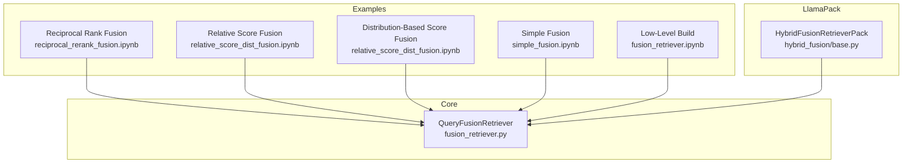
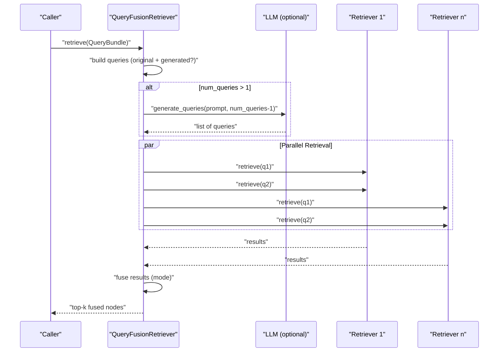
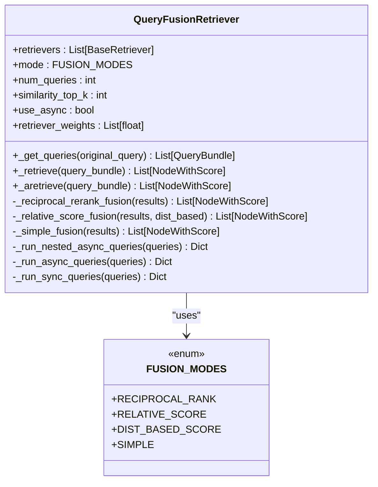
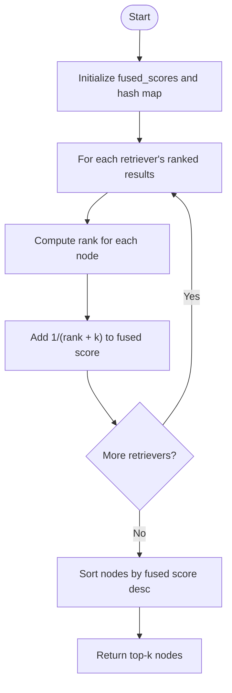
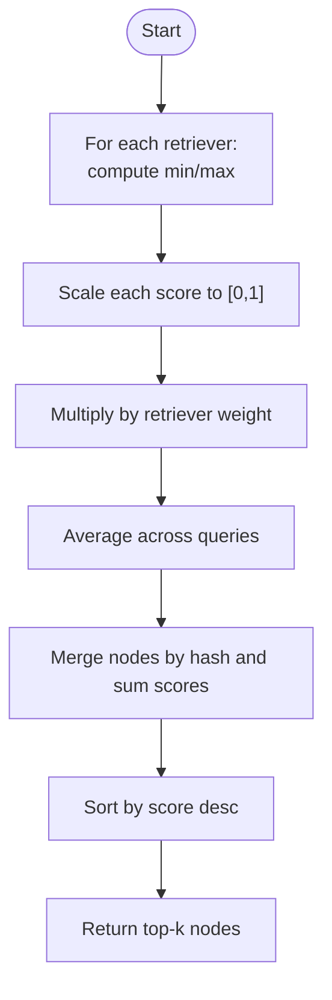
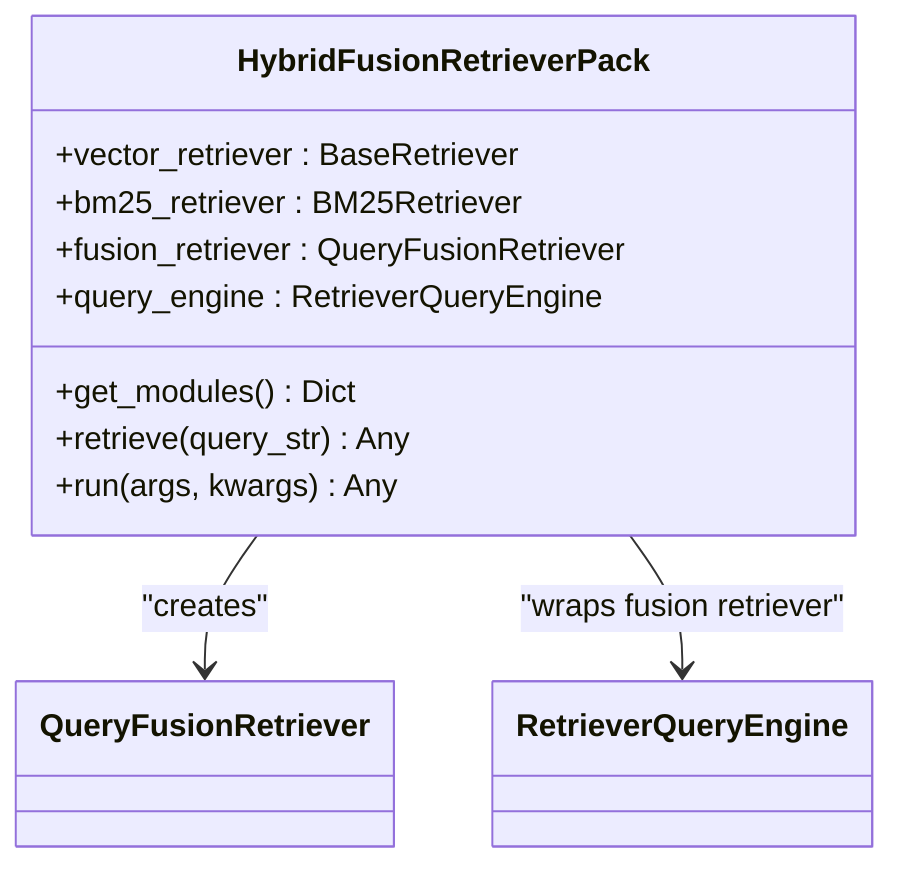
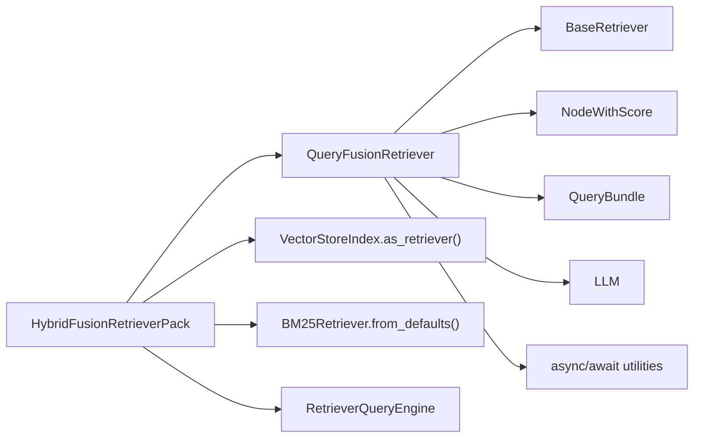

# Fusion Retrievers

<cite>
**Referenced Files in This Document**
- [fusion_retriever.py](file://llama-index-core/llama_index/core/retrievers/fusion_retriever.py)
- [query_fusion.md](file://docs/api_reference/api_reference/retrievers/query_fusion.md)
- [reciprocal_rerank_fusion.ipynb](file://docs/examples/retrievers/reciprocal_rerank_fusion.ipynb)
- [relative_score_dist_fusion.ipynb](file://docs/examples/retrievers/relative_score_dist_fusion.ipynb)
- [simple_fusion.ipynb](file://docs/examples/retrievers/simple_fusion.ipynb)
- [fusion_retriever.ipynb](file://docs/examples/low_level/fusion_retriever.ipynb)
- [base.py](file://llama-index-packs/llama-index-packs-fusion-retriever/llama_index/packs/fusion_retriever/hybrid_fusion/base.py)
- [__init__.py](file://llama-index-packs/llama-index-packs-fusion-retriever/llama_index/packs/fusion_retriever/__init__.py)
- [README.md](file://llama-index-packs/llama-index-packs-fusion-retriever/README.md)
</cite>

## Table of Contents
1. [Introduction](#introduction)
2. [Project Structure](#project-structure)
3. [Core Components](#core-components)
4. [Architecture Overview](#architecture-overview)
5. [Detailed Component Analysis](#detailed-component-analysis)
6. [Dependency Analysis](#dependency-analysis)
7. [Performance Considerations](#performance-considerations)
8. [Troubleshooting Guide](#troubleshooting-guide)
9. [Conclusion](#conclusion)
10. [Appendices](#appendices)

## Introduction
This document explains fusion retrievers in LlamaIndex with a focus on ensemble retrieval strategies that combine results from multiple retrievers using different fusion algorithms. It covers the QueryFusionRetriever implementation, supported fusion modes (reciprocal rank fusion, relative score fusion, distribution-based score fusion, and simple fusion), score combination techniques, configuration options, and practical examples. It also provides guidance on performance, computational overhead, and when to choose fusion versus single retriever approaches.

## Project Structure
The fusion retriever capability spans core implementation, example notebooks, and a reusable LlamaPack:

- Core implementation: QueryFusionRetriever class and fusion modes
- Example notebooks: Demonstrations of reciprocal rank fusion, relative score fusion, distribution-based score fusion, and simple fusion
- LlamaPack: HybridFusionRetrieverPack that bundles vector and BM25 retrievers with fusion

**Diagram sources**
- [fusion_retriever.py](file://llama-index-core/llama_index/core/retrievers/fusion_retriever.py#L33-L305)
- [reciprocal_rerank_fusion.ipynb](file://docs/examples/retrievers/reciprocal_rerank_fusion.ipynb#L1-L359)
- [relative_score_dist_fusion.ipynb](file://docs/examples/retrievers/relative_score_dist_fusion.ipynb#L1-L383)
- [simple_fusion.ipynb](file://docs/examples/retrievers/simple_fusion.ipynb#L1-L283)
- [fusion_retriever.ipynb](file://docs/examples/low_level/fusion_retriever.ipynb#L1-L671)
- [base.py](file://llama-index-packs/llama-index-packs-fusion-retriever/llama_index/packs/fusion_retriever/hybrid_fusion/base.py#L15-L89)

**Section sources**
- [fusion_retriever.py](file://llama-index-core/llama_index/core/retrievers/fusion_retriever.py#L1-L305)
- [query_fusion.md](file://docs/api_reference/api_reference/retrievers/query_fusion.md#L1-L4)
- [README.md](file://llama-index-packs/llama-index-packs-fusion-retriever/README.md#L1-L128)

## Core Components
- QueryFusionRetriever: Orchestrates ensemble retrieval and fusion across multiple retrievers. It supports:
  - Query generation (optional) to expand the search space
  - Parallel retrieval across retrievers and queries
  - Fusion modes: reciprocal rank fusion, relative score fusion, distribution-based score fusion, and simple fusion
  - Top-k selection after fusion
- Fusion Modes:
  - Reciprocal Rank Fusion: Aggregates reciprocal ranks across retrievers and queries
  - Relative Score Fusion: Normalizes scores per retriever and sums weighted normalized scores
  - Distribution-Based Score Fusion: Normalizes scores using mean and std dev per retriever before weighting
  - Simple Fusion: De-duplicates and selects best score per node across retrievers and queries

Key configuration options:
- retrievers: List of BaseRetriever instances
- mode: One of the fusion modes
- num_queries: Number of generated queries (default 4); set to 1 to disable query generation
- similarity_top_k: Final number of results to return
- use_async: Toggle asynchronous retrieval
- verbose: Print generated queries
- retriever_weights: Per-retriever weights for scoring; normalized internally
- query_gen_prompt: Prompt template for query generation

**Section sources**
- [fusion_retriever.py](file://llama-index-core/llama_index/core/retrievers/fusion_retriever.py#L24-L69)
- [fusion_retriever.py](file://llama-index-core/llama_index/core/retrievers/fusion_retriever.py#L100-L305)

## Architecture Overview
The fusion pipeline runs in stages: optional query expansion, parallel retrieval, fusion, and top-k selection.

**Diagram sources**
- [fusion_retriever.py](file://llama-index-core/llama_index/core/retrievers/fusion_retriever.py#L263-L305)

## Detailed Component Analysis

### QueryFusionRetriever Implementation
- Initialization:
  - Validates and normalizes retriever_weights
  - Resolves LLM for query generation if enabled
- Query Generation:
  - Formats a prompt with the original query and requested number of extra queries
  - Strips code blocks and splits lines to produce query list
- Retrieval:
  - Runs queries across all retrievers (nested async or sync)
  - Collects results keyed by (query, retriever_index)
- Fusion:
  - Reciprocal Rank Fusion: Sum 1/(rank + k) per node across retrievers
  - Relative Score Fusion: Min-Max normalize per retriever, multiply by retriever weight, average across queries
  - Distribution-Based Score Fusion: Normalize using mean/std dev per retriever, then weight and average
  - Simple Fusion: De-duplicate by node hash and keep best score per node
- Top-k Selection:
  - Returns the top-k nodes after fusion

**Diagram sources**
- [fusion_retriever.py](file://llama-index-core/llama_index/core/retrievers/fusion_retriever.py#L24-L305)

**Section sources**
- [fusion_retriever.py](file://llama-index-core/llama_index/core/retrievers/fusion_retriever.py#L33-L305)

### Fusion Algorithms

#### Reciprocal Rank Fusion
- Purpose: Combine reciprocal ranks across retrievers and queries
- Behavior:
  - Computes rank per retriever for each node
  - Sums 1/(rank + k) for each node across retrievers
  - Returns top-k nodes by fused score
- Parameters:
  - k: Controls influence of outliers (default 60.0)

**Diagram sources**
- [fusion_retriever.py](file://llama-index-core/llama_index/core/retrievers/fusion_retriever.py#L100-L136)

**Section sources**
- [fusion_retriever.py](file://llama-index-core/llama_index/core/retrievers/fusion_retriever.py#L100-L136)

#### Relative Score Fusion
- Purpose: Normalize and combine scores across retrievers
- Behavior:
  - For each retriever, min-max normalize scores across its results
  - Multiply normalized score by retriever weight
  - Average across queries
  - De-duplicate and sort by final score
- Notes:
  - Handles constant scores by assigning 1.0 if score > 0 else 0.0

**Diagram sources**
- [fusion_retriever.py](file://llama-index-core/llama_index/core/retrievers/fusion_retriever.py#L137-L198)

**Section sources**
- [fusion_retriever.py](file://llama-index-core/llama_index/core/retrievers/fusion_retriever.py#L137-L198)

#### Distribution-Based Score Fusion
- Purpose: Normalize scores using mean and std dev per retriever
- Behavior:
  - Compute mean and std dev per retriever
  - Normalize scores using these statistics
  - Weight and average across queries
- Use Case:
  - Useful when score distributions vary widely across retrievers

**Section sources**
- [fusion_retriever.py](file://llama-index-core/llama_index/core/retrievers/fusion_retriever.py#L140-L164)
- [relative_score_dist_fusion.ipynb](file://docs/examples/retrievers/relative_score_dist_fusion.ipynb#L248-L283)

#### Simple Fusion
- Purpose: Basic de-duplication and best-score selection
- Behavior:
  - De-duplicate by node hash
  - Keep the maximum score observed for each node
  - Sort and return top-k

**Section sources**
- [fusion_retriever.py](file://llama-index-core/llama_index/core/retrievers/fusion_retriever.py#L200-L218)

### Practical Examples

#### Semantic + Keyword Fusion (Reciprocal Rank)
- Combine vector retriever and BM25 retriever
- Uses reciprocal rank fusion to merge results
- Demonstrates query generation and verbose logging

**Section sources**
- [reciprocal_rerank_fusion.ipynb](file://docs/examples/retrievers/reciprocal_rerank_fusion.ipynb#L132-L200)
- [reciprocal_rerank_fusion.ipynb](file://docs/examples/retrievers/reciprocal_rerank_fusion.ipynb#L230-L265)

#### Relative Score Fusion with Weighted Retriever Scores
- Weight vector retriever more than BM25 (e.g., 0.6 vs 0.4)
- Demonstrates de-duplication and re-ranking across retrievers

**Section sources**
- [relative_score_dist_fusion.ipynb](file://docs/examples/retrievers/relative_score_dist_fusion.ipynb#L123-L180)
- [relative_score_dist_fusion.ipynb](file://docs/examples/retrievers/relative_score_dist_fusion.ipynb#L200-L243)

#### Distribution-Based Score Fusion
- Variant of relative score fusion using mean/std dev normalization
- Useful when score distributions differ across retrievers

**Section sources**
- [relative_score_dist_fusion.ipynb](file://docs/examples/retrievers/relative_score_dist_fusion.ipynb#L288-L307)

#### Simple Fusion Across Multiple Vector Stores
- Fuse results from multiple indexes
- Demonstrates query generation and basic fusion without advanced normalization

**Section sources**
- [simple_fusion.ipynb](file://docs/examples/retrievers/simple_fusion.ipynb#L68-L104)
- [simple_fusion.ipynb](file://docs/examples/retrievers/simple_fusion.ipynb#L134-L160)

#### Low-Level Build From Scratch
- Manual construction of query generation, parallel retrieval, and reciprocal rank fusion
- Good reference for customizing fusion behavior

**Section sources**
- [fusion_retriever.ipynb](file://docs/examples/low_level/fusion_retriever.ipynb#L195-L204)
- [fusion_retriever.ipynb](file://docs/examples/low_level/fusion_retriever.ipynb#L303-L311)
- [fusion_retriever.ipynb](file://docs/examples/low_level/fusion_retriever.ipynb#L408-L443)

### LlamaPack: HybridFusionRetrieverPack
- Bundles vector and BM25 retrievers with QueryFusionRetriever
- Provides a ready-to-use pipeline with configurable top-k and fusion mode
- Exposes individual modules (vector, BM25, fusion retriever, query engine)

**Diagram sources**
- [base.py](file://llama-index-packs/llama-index-packs-fusion-retriever/llama_index/packs/fusion_retriever/hybrid_fusion/base.py#L15-L89)

**Section sources**
- [__init__.py](file://llama-index-packs/llama-index-packs-fusion-retriever/llama_index/packs/fusion_retriever/__init__.py#L1-L9)
- [base.py](file://llama-index-packs/llama-index-packs-fusion-retriever/llama_index/packs/fusion_retriever/hybrid_fusion/base.py#L15-L89)
- [README.md](file://llama-index-packs/llama-index-packs-fusion-retriever/README.md#L1-L128)

## Dependency Analysis
- Internal dependencies:
  - QueryFusionRetriever depends on BaseRetriever, NodeWithScore, QueryBundle, and async utilities
  - Uses an LLM for query generation when num_queries > 1
- External integrations:
  - BM25Retriever for keyword-based retrieval
  - VectorStoreIndex for semantic retrieval
- LlamaPack composes these components into a cohesive retriever pipeline

**Diagram sources**
- [fusion_retriever.py](file://llama-index-core/llama_index/core/retrievers/fusion_retriever.py#L1-L14)
- [base.py](file://llama-index-packs/llama-index-packs-fusion-retriever/llama_index/packs/fusion_retriever/hybrid_fusion/base.py#L1-L12)

**Section sources**
- [fusion_retriever.py](file://llama-index-core/llama_index/core/retrievers/fusion_retriever.py#L1-L14)
- [base.py](file://llama-index-packs/llama-index-packs-fusion-retriever/llama_index/packs/fusion_retriever/hybrid_fusion/base.py#L1-L12)

## Performance Considerations
- Computational overhead:
  - Query generation adds LLM cost and latency when num_queries > 1
  - Parallel retrieval reduces wall-clock time but increases total retriever calls
  - Fusion computations are linear in total retrieved nodes; reciprocal rank fusion is efficient
- Memory:
  - Fusion stores per-node scores and hashes; memory scales with unique nodes across retrievers
- Tuning tips:
  - Reduce num_queries for lower latency
  - Use use_async=True for concurrent retriever calls
  - Adjust similarity_top_k to limit post-fusion sorting cost
  - Prefer reciprocal rank fusion for speed; relative/dist-based fusion adds normalization overhead
- When to use fusion:
  - Use fusion when combining complementary retrievers (e.g., semantic + keyword) to improve recall/precision
  - Use single retriever when latency or cost is critical and the single model suffices

[No sources needed since this section provides general guidance]

## Troubleshooting Guide
- No results or low-quality results:
  - Increase similarity_top_k for retrievers and fusion
  - Enable query generation (num_queries > 1) to broaden search
  - Try different fusion modes; reciprocal rank fusion is robust
- Unexpected score ranges:
  - Relative and distribution-based fusion normalize scores per retriever; verify retriever_weights
  - For constant scores, normalization yields deterministic values
- Performance issues:
  - Disable query generation (num_queries=1)
  - Reduce similarity_top_k or num_queries
  - Use use_async=True and ensure underlying retrievers support async
- Verbose logging:
  - Enable verbose to inspect generated queries and debug fusion behavior

**Section sources**
- [fusion_retriever.py](file://llama-index-core/llama_index/core/retrievers/fusion_retriever.py#L48-L98)
- [fusion_retriever.py](file://llama-index-core/llama_index/core/retrievers/fusion_retriever.py#L137-L198)

## Conclusion
QueryFusionRetriever enables powerful ensemble retrieval by combining multiple retrievers using flexible fusion strategies. Choose the fusion mode based on your goals: reciprocal rank fusion for speed and simplicity, relative or distribution-based fusion for nuanced score normalization, and simple fusion for basic de-duplication. Leverage the provided examples and the HybridFusionRetrieverPack to quickly assemble hybrid semantic+keyword pipelines, and tune configuration parameters to balance quality, latency, and cost.

[No sources needed since this section summarizes without analyzing specific files]

## Appendices

### API Reference Highlights
- QueryFusionRetriever members and options are documented under the retrievers API reference.

**Section sources**
- [query_fusion.md](file://docs/api_reference/api_reference/retrievers/query_fusion.md#L1-L4)