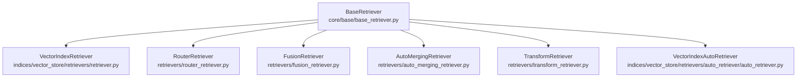
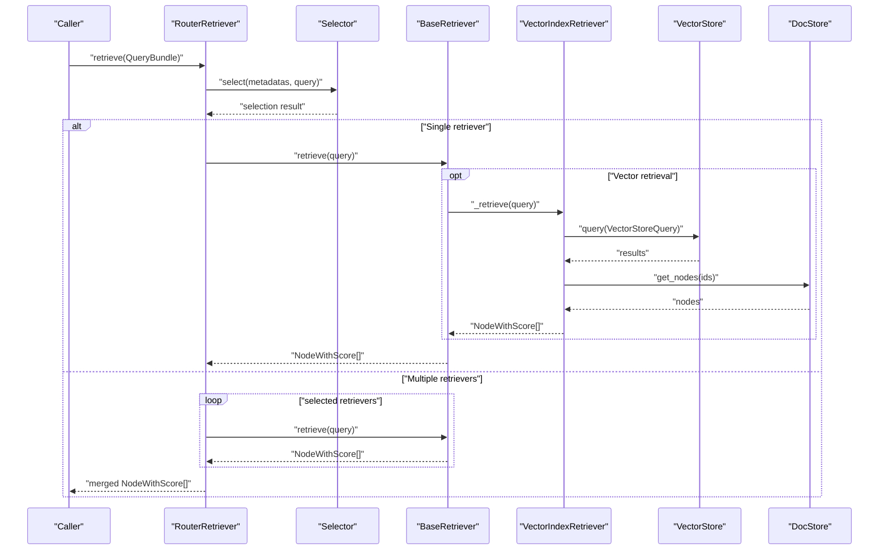
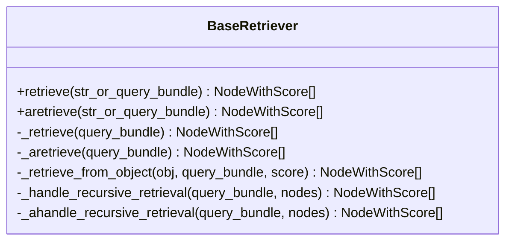
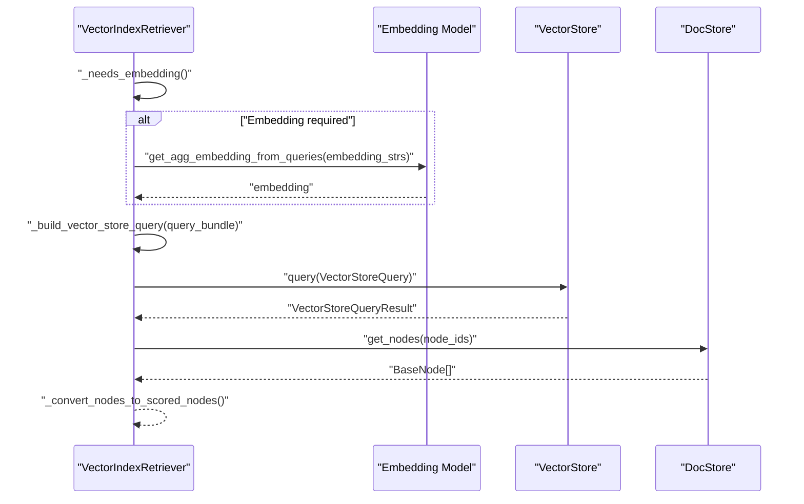
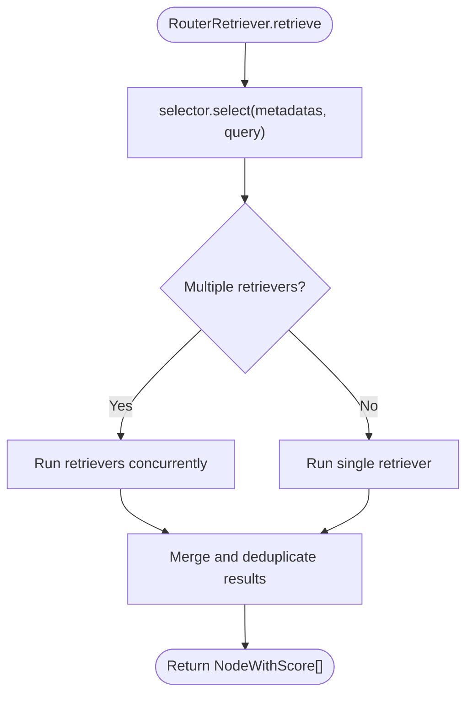
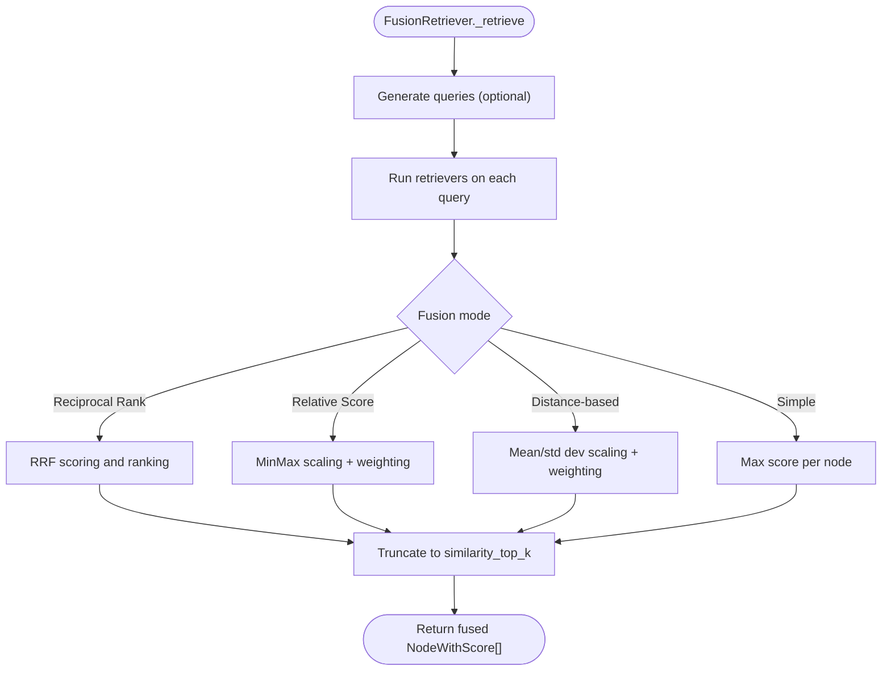
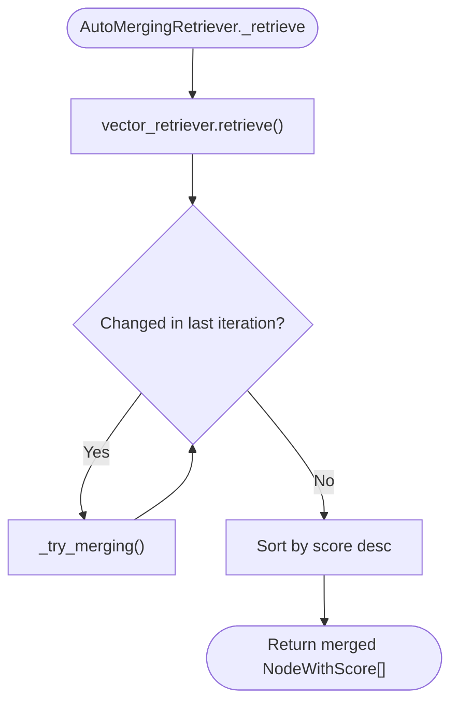
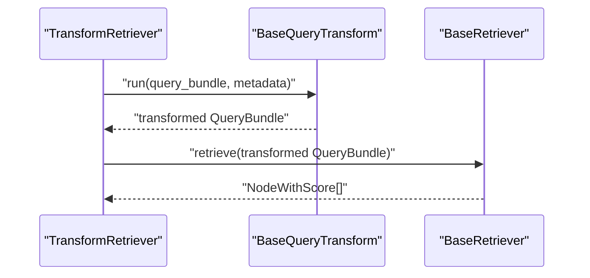
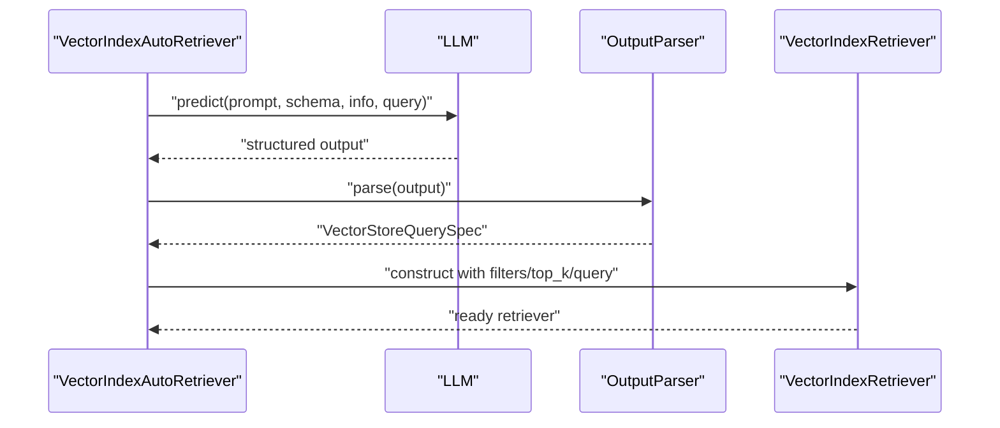
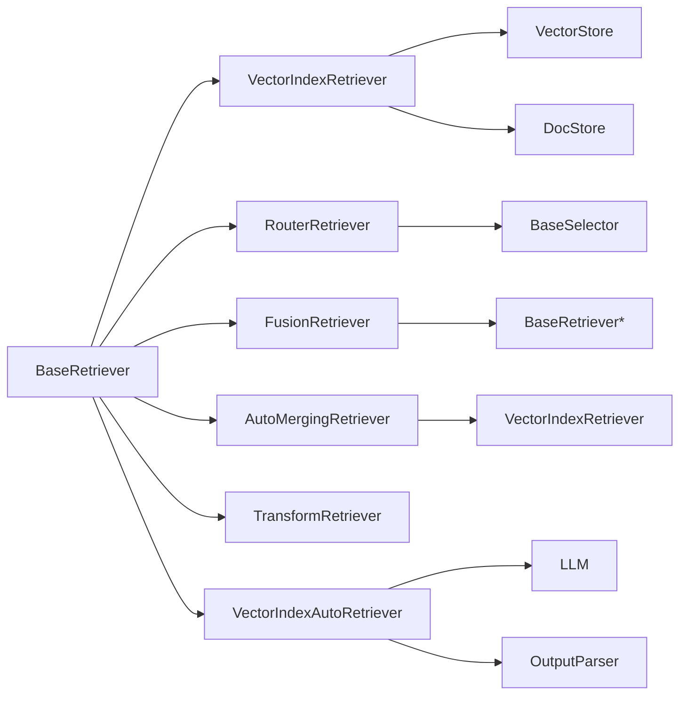

# Retrieval Engine

<cite>
**Referenced Files in This Document**
- [base_retriever.py](file://llama-index-core/llama_index/core/base/base_retriever.py)
- [router_retriever.py](file://llama-index-core/llama_index/core/retrievers/router_retriever.py)
- [fusion_retriever.py](file://llama-index-core/llama_index/core/retrievers/fusion_retriever.py)
- [auto_merging_retriever.py](file://llama-index-core/llama_index/core/retrievers/auto_merging_retriever.py)
- [transform_retriever.py](file://llama-index-core/llama_index/core/retrievers/transform_retriever.py)
- [retriever.py](file://llama-index-core/llama_index/core/indices/vector_store/retrievers/retriever.py)
- [auto_retriever.py](file://llama-index-core/llama_index/core/indices/vector_store/retrievers/auto_retriever/auto_retriever.py)
- [README.md](file://llama-index-packs/llama-index-packs-fusion-retriever/README.md)
- [README.md](file://llama-index-packs/llama-index-packs-auto-merging-retriever/README.md)
</cite>

## Table of Contents
1. [Introduction](#introduction)
2. [Project Structure](#project-structure)
3. [Core Components](#core-components)
4. [Architecture Overview](#architecture-overview)
5. [Detailed Component Analysis](#detailed-component-analysis)
6. [Dependency Analysis](#dependency-analysis)
7. [Performance Considerations](#performance-considerations)
8. [Troubleshooting Guide](#troubleshooting-guide)
9. [Conclusion](#conclusion)
10. [Appendices](#appendices)

## Introduction
This document explains the LlamaIndex retrieval engine, focusing on the base retriever interface, vector store retrieval, router-based selection, fusion strategies, auto-merging, and query transformation. It also covers hybrid retrieval modes, ensemble methods, score normalization, and evaluation techniques. Practical configuration guidance and optimization tips are included to help you combine multiple retrieval strategies effectively.

## Project Structure
The retrieval engine is centered around a base retriever abstraction and several specialized retrievers:
- Base retriever interface defines the contract for retrieving nodes and handling recursion and instrumentation.
- VectorIndexRetriever performs semantic similarity search against a vector store and supports hybrid modes.
- RouterRetriever selects among multiple candidate retrievers using a selector and optional LLM.
- FusionRetriever combines results from multiple retrievers using multiple fusion strategies.
- AutoMergingRetriever improves context quality by merging child chunks into parent nodes.
- TransformRetriever applies a query transformation prior to invoking another retriever.
- VectorIndexAutoRetriever uses an LLM to automatically infer retrieval parameters for a vector store.

**Diagram sources**
- [base_retriever.py](file://llama-index-core/llama_index/core/base/base_retriever.py#L34-L275)
- [retriever.py](file://llama-index-core/llama_index/core/indices/vector_store/retrievers/retriever.py#L24-L268)
- [router_retriever.py](file://llama-index-core/llama_index/core/retrievers/router_retriever.py#L20-L143)
- [fusion_retriever.py](file://llama-index-core/llama_index/core/retrievers/fusion_retriever.py#L33-L305)
- [auto_merging_retriever.py](file://llama-index-core/llama_index/core/retrievers/auto_merging_retriever.py#L26-L195)
- [transform_retriever.py](file://llama-index-core/llama_index/core/retrievers/transform_retriever.py#L10-L45)
- [auto_retriever.py](file://llama-index-core/llama_index/core/indices/vector_store/retrievers/auto_retriever/auto_retriever.py#L37-L245)

**Section sources**
- [base_retriever.py](file://llama-index-core/llama_index/core/base/base_retriever.py#L34-L275)
- [retriever.py](file://llama-index-core/llama_index/core/indices/vector_store/retrievers/retriever.py#L24-L268)

## Core Components
- BaseRetriever: Defines synchronous and asynchronous retrieval entry points, instrumentation, recursion over index nodes, and object-based retrieval helpers.
- VectorIndexRetriever: Performs semantic search against a vector store, supports hybrid modes, and integrates with embedding models and docstores.
- RouterRetriever: Chooses one or multiple candidate retrievers based on metadata and query using a selector.
- FusionRetriever: Generates multiple queries and fuses results across retrievers using reciprocal rank, relative score, distance-based score, or simple fusion.
- AutoMergingRetriever: Merges child nodes into parent nodes and fills gaps to improve context coherence.
- TransformRetriever: Applies a query transformation before delegating to another retriever.
- VectorIndexAutoRetriever: Automatically infers retrieval parameters (query, filters, top_k) using an LLM and constructs a VectorIndexRetriever accordingly.

**Section sources**
- [base_retriever.py](file://llama-index-core/llama_index/core/base/base_retriever.py#L34-L275)
- [retriever.py](file://llama-index-core/llama_index/core/indices/vector_store/retrievers/retriever.py#L24-L268)
- [router_retriever.py](file://llama-index-core/llama_index/core/retrievers/router_retriever.py#L20-L143)
- [fusion_retriever.py](file://llama-index-core/llama_index/core/retrievers/fusion_retriever.py#L33-L305)
- [auto_merging_retriever.py](file://llama-index-core/llama_index/core/retrievers/auto_merging_retriever.py#L26-L195)
- [transform_retriever.py](file://llama-index-core/llama_index/core/retrievers/transform_retriever.py#L10-L45)
- [auto_retriever.py](file://llama-index-core/llama_index/core/indices/vector_store/retrievers/auto_retriever/auto_retriever.py#L37-L245)

## Architecture Overview
The retrieval pipeline typically starts from a BaseRetriever subclass. For vector-based retrieval, VectorIndexRetriever builds a VectorStoreQuery, executes it against the underlying vector store, and resolves missing node content from the docstore. RouterRetriever delegates to a selector to choose candidate retrievers. FusionRetriever optionally expands the query and merges results from multiple retrievers. AutoMergingRetriever post-processes results to improve context quality. TransformRetriever allows pre-processing of queries. VectorIndexAutoRetriever automates parameter inference for vector retrieval.

**Diagram sources**
- [router_retriever.py](file://llama-index-core/llama_index/core/retrievers/router_retriever.py#L78-L106)
- [retriever.py](file://llama-index-core/llama_index/core/indices/vector_store/retrievers/retriever.py#L104-L128)

## Detailed Component Analysis

### BaseRetriever Interface
- Responsibilities:
  - Unified retrieval API with synchronous and asynchronous variants.
  - Instrumentation via callback manager and dispatcher spans.
  - Recursive traversal across index nodes and object resolution.
  - Duplicate elimination during recursive retrieval.
- Key behaviors:
  - Converts strings to QueryBundle internally.
  - Supports verbose logging and object map for resolving IndexNode objects.
  - Provides helpers for retrieving from BaseNode, NodeWithScore, BaseQueryEngine, or BaseRetriever.

**Diagram sources**
- [base_retriever.py](file://llama-index-core/llama_index/core/base/base_retriever.py#L34-L275)

**Section sources**
- [base_retriever.py](file://llama-index-core/llama_index/core/base/base_retriever.py#L34-L275)

### VectorIndexRetriever (Semantic Search)
- Capabilities:
  - Semantic similarity search with configurable top_k.
  - Hybrid retrieval modes and alpha blending for sparse/dense.
  - Metadata filtering and document/node ID constraints.
  - Embedding computation when required by the vector store mode.
  - Docstore integration to fetch missing node content.
- Query flow:
  - Build VectorStoreQuery from QueryBundle.
  - Execute query against vector store.
  - Fetch nodes from docstore if needed and assemble NodeWithScore list.

**Diagram sources**
- [retriever.py](file://llama-index-core/llama_index/core/indices/vector_store/retrievers/retriever.py#L104-L128)
- [retriever.py](file://llama-index-core/llama_index/core/indices/vector_store/retrievers/retriever.py#L130-L246)

**Section sources**
- [retriever.py](file://llama-index-core/llama_index/core/indices/vector_store/retrievers/retriever.py#L24-L268)

### RouterRetriever (Router-based Selection)
- Purpose:
  - Select one or multiple candidate retrievers based on query and metadata.
  - Optionally use an LLM-backed selector to decide.
- Behavior:
  - Wraps candidates as RetrieverTool to expose metadata.
  - Delegates to selected retriever(s) and deduplicates results.

**Diagram sources**
- [router_retriever.py](file://llama-index-core/llama_index/core/retrievers/router_retriever.py#L78-L106)

**Section sources**
- [router_retriever.py](file://llama-index-core/llama_index/core/retrievers/router_retriever.py#L20-L143)

### FusionRetriever (Ensemble Methods)
- Purpose:
  - Expand query into multiple variants and fuse results from multiple retrievers.
- Strategies:
  - Reciprocal rank fusion (RRF).
  - Relative score fusion (MinMax scaled and weighted).
  - Distance-based relative score fusion (using mean/std dev).
  - Simple fusion (max score per node).
- Controls:
  - Number of generated queries, fusion mode, top_k, async execution, and retriever weights.

**Diagram sources**
- [fusion_retriever.py](file://llama-index-core/llama_index/core/retrievers/fusion_retriever.py#L263-L284)

**Section sources**
- [fusion_retriever.py](file://llama-index-core/llama_index/core/retrievers/fusion_retriever.py#L33-L305)

### AutoMergingRetriever (Post-processing)
- Purpose:
  - Improve context quality by merging child chunks into parent nodes and filling gaps.
- Process:
  - Compute child-to-parent ratios and merge when threshold exceeded.
  - Fill in intermediate nodes when adjacency conditions match.
  - Repeat until no further changes occur.
  - Sort by score and return.

**Diagram sources**
- [auto_merging_retriever.py](file://llama-index-core/llama_index/core/retrievers/auto_merging_retriever.py#L176-L194)

**Section sources**
- [auto_merging_retriever.py](file://llama-index-core/llama_index/core/retrievers/auto_merging_retriever.py#L26-L195)

### TransformRetriever (Query Transformation)
- Purpose:
  - Pre-transform the query bundle (e.g., paraphrasing, decomposition) before invoking another retriever.
- Behavior:
  - Runs the transform and passes the transformed QueryBundle to the downstream retriever.

**Diagram sources**
- [transform_retriever.py](file://llama-index-core/llama_index/core/retrievers/transform_retriever.py#L40-L44)

**Section sources**
- [transform_retriever.py](file://llama-index-core/llama_index/core/retrievers/transform_retriever.py#L10-L45)

### VectorIndexAutoRetriever (Automatic Parameter Inference)
- Purpose:
  - Automatically infer retrieval parameters (query, filters, top_k) using an LLM and build a VectorIndexRetriever accordingly.
- Process:
  - Prepare prompt with vector store info and schema.
  - Predict structured query spec and parse into VectorStoreQuerySpec.
  - Construct VectorIndexRetriever with inferred parameters.

**Diagram sources**
- [auto_retriever.py](file://llama-index-core/llama_index/core/indices/vector_store/retrievers/auto_retriever/auto_retriever.py#L158-L193)
- [auto_retriever.py](file://llama-index-core/llama_index/core/indices/vector_store/retrievers/auto_retriever/auto_retriever.py#L194-L244)

**Section sources**
- [auto_retriever.py](file://llama-index-core/llama_index/core/indices/vector_store/retrievers/auto_retriever/auto_retriever.py#L37-L245)

## Dependency Analysis
- Coupling:
  - VectorIndexRetriever depends on VectorStoreIndex, embedding model, and docstore.
  - RouterRetriever depends on BaseSelector and RetrieverTool wrappers.
  - FusionRetriever composes multiple BaseRetriever instances.
  - AutoMergingRetriever depends on VectorIndexRetriever and StorageContext.
  - TransformRetriever composes another retriever with a query transform.
  - VectorIndexAutoRetriever composes LLM and output parser to produce a VectorIndexRetriever.
- Cohesion:
  - Each retriever encapsulates a single responsibility, enabling composition and reuse.
- External integrations:
  - Vector stores and docstores are accessed via standardized interfaces.
  - LLMs are used for selector decisions and automatic parameter inference.

**Diagram sources**
- [base_retriever.py](file://llama-index-core/llama_index/core/base/base_retriever.py#L34-L275)
- [retriever.py](file://llama-index-core/llama_index/core/indices/vector_store/retrievers/retriever.py#L24-L268)
- [router_retriever.py](file://llama-index-core/llama_index/core/retrievers/router_retriever.py#L20-L143)
- [fusion_retriever.py](file://llama-index-core/llama_index/core/retrievers/fusion_retriever.py#L33-L305)
- [auto_merging_retriever.py](file://llama-index-core/llama_index/core/retrievers/auto_merging_retriever.py#L26-L195)
- [transform_retriever.py](file://llama-index-core/llama_index/core/retrievers/transform_retriever.py#L10-L45)
- [auto_retriever.py](file://llama-index-core/llama_index/core/indices/vector_store/retrievers/auto_retriever/auto_retriever.py#L37-L245)

**Section sources**
- [base_retriever.py](file://llama-index-core/llama_index/core/base/base_retriever.py#L34-L275)
- [retriever.py](file://llama-index-core/llama_index/core/indices/vector_store/retrievers/retriever.py#L24-L268)
- [router_retriever.py](file://llama-index-core/llama_index/core/retrievers/router_retriever.py#L20-L143)
- [fusion_retriever.py](file://llama-index-core/llama_index/core/retrievers/fusion_retriever.py#L33-L305)
- [auto_merging_retriever.py](file://llama-index-core/llama_index/core/retrievers/auto_merging_retriever.py#L26-L195)
- [transform_retriever.py](file://llama-index-core/llama_index/core/retrievers/transform_retriever.py#L10-L45)
- [auto_retriever.py](file://llama-index-core/llama_index/core/indices/vector_store/retrievers/auto_retriever/auto_retriever.py#L37-L245)

## Performance Considerations
- Asynchronous execution:
  - FusionRetriever supports async execution for parallel retriever invocations.
  - VectorIndexRetriever exposes asynchronous query paths when embeddings are computed asynchronously.
- Query expansion:
  - FusionRetriever’s query generation increases latency but can improve recall; tune num_queries and mode accordingly.
- Hybrid retrieval:
  - Use hybrid modes and alpha blending judiciously; tune alpha and top_k to balance precision and recall.
- Auto-merging:
  - Repeated merging loops reduce overhead but can increase cost; adjust thresholds and verbosity to balance quality and speed.
- Selector overhead:
  - RouterRetriever adds selector computation; ensure selector is efficient and metadata is concise.
- Embedding computation:
  - Avoid unnecessary embedding computations by checking needs_embedding and reusing embeddings when available.

[No sources needed since this section provides general guidance]

## Troubleshooting Guide
- Selector failures:
  - RouterRetriever raises explicit errors when retriever selection fails; verify selector configuration and tool metadata.
- Duplicate results:
  - BaseRetriever removes duplicates based on node hash and ref_doc_id; ensure consistent hashing and metadata.
- Missing nodes after vector retrieval:
  - VectorIndexRetriever fetches nodes from docstore; check node IDs and index struct mappings if KeyError occurs.
- Empty or invalid fusion mode:
  - FusionRetriever validates fusion mode and raises errors for invalid values; confirm mode selection.
- Auto-merging not changing results:
  - Thresholds may be too strict; lower simple_ratio_thresh or enable verbose logging to inspect merging decisions.
- Query transformation issues:
  - Ensure the transform returns a valid QueryBundle and compatible metadata for downstream retrievers.

**Section sources**
- [router_retriever.py](file://llama-index-core/llama_index/core/retrievers/router_retriever.py#L98-L99)
- [base_retriever.py](file://llama-index-core/llama_index/core/base/base_retriever.py#L174-L183)
- [retriever.py](file://llama-index-core/llama_index/core/indices/vector_store/retrievers/retriever.py#L197-L209)
- [fusion_retriever.py](file://llama-index-core/llama_index/core/retrievers/fusion_retriever.py#L284-L284)
- [auto_merging_retriever.py](file://llama-index-core/llama_index/core/retrievers/auto_merging_retriever.py#L87-L90)
- [transform_retriever.py](file://llama-index-core/llama_index/core/retrievers/transform_retriever.py#L40-L44)

## Conclusion
LlamaIndex provides a flexible, extensible retrieval engine built on a robust BaseRetriever abstraction. VectorIndexRetriever enables semantic and hybrid retrieval, while RouterRetriever, FusionRetriever, AutoMergingRetriever, TransformRetriever, and VectorIndexAutoRetriever offer powerful composition patterns for routing, ensembling, context refinement, preprocessing, and automatic parameter tuning. By combining these components thoughtfully and tuning parameters such as top_k, fusion mode, and thresholds, you can achieve strong retrieval performance tailored to your use case.

[No sources needed since this section summarizes without analyzing specific files]

## Appendices

### Practical Configuration Examples
- Configure a semantic vector retriever:
  - Use VectorIndexRetriever with desired similarity_top_k, filters, and vector_store_query_mode.
  - Reference: [retriever.py](file://llama-index-core/llama_index/core/indices/vector_store/retrievers/retriever.py#L42-L80)
- Combine multiple strategies with RouterRetriever:
  - Wrap candidate retrievers as RetrieverTool and supply a selector; optionally use LLM-backed selector.
  - Reference: [router_retriever.py](file://llama-index-core/llama_index/core/retrievers/router_retriever.py#L35-L76)
- Ensemble with FusionRetriever:
  - Provide multiple retrievers, set fusion mode, num_queries, and similarity_top_k.
  - Reference: [fusion_retriever.py](file://llama-index-core/llama_index/core/retrievers/fusion_retriever.py#L33-L70)
- Post-process with AutoMergingRetriever:
  - Chain with a vector retriever and adjust simple_ratio_thresh.
  - Reference: [auto_merging_retriever.py](file://llama-index-core/llama_index/core/retrievers/auto_merging_retriever.py#L35-L54)
- Preprocess queries with TransformRetriever:
  - Supply a BaseQueryTransform and target retriever.
  - Reference: [transform_retriever.py](file://llama-index-core/llama_index/core/retrievers/transform_retriever.py#L19-L33)
- Automatic parameter inference:
  - Use VectorIndexAutoRetriever with vector store info and prompt template.
  - Reference: [auto_retriever.py](file://llama-index-core/llama_index/core/indices/vector_store/retrievers/auto_retriever/auto_retriever.py#L70-L116)

### Retrieval Evaluation Techniques
- Use pack-level documentation for retrieval packs to understand evaluation setups and metrics.
  - Fusion retriever pack: [README.md](file://llama-index-packs/llama-index-packs-fusion-retriever/README.md)
  - Auto-merging retriever pack: [README.md](file://llama-index-packs/llama-index-packs-auto-merging-retriever/README.md)

**Section sources**
- [README.md](file://llama-index-packs/llama-index-packs-fusion-retriever/README.md)
- [README.md](file://llama-index-packs/llama-index-packs-auto-merging-retriever/README.md)