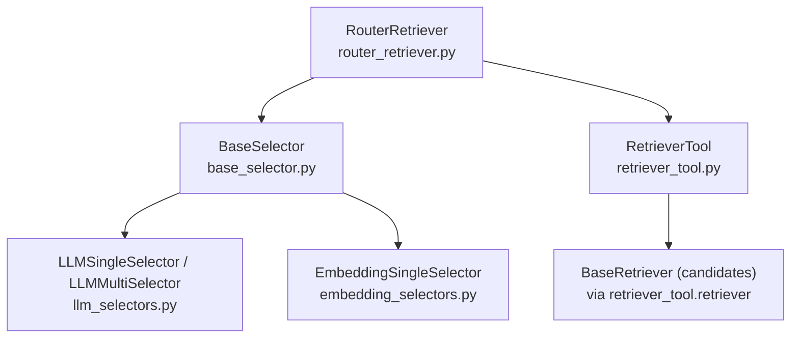
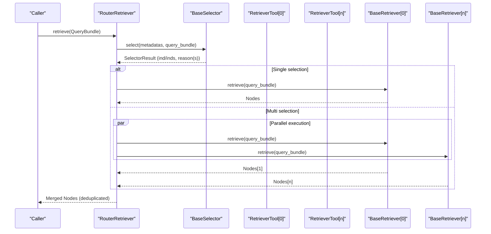
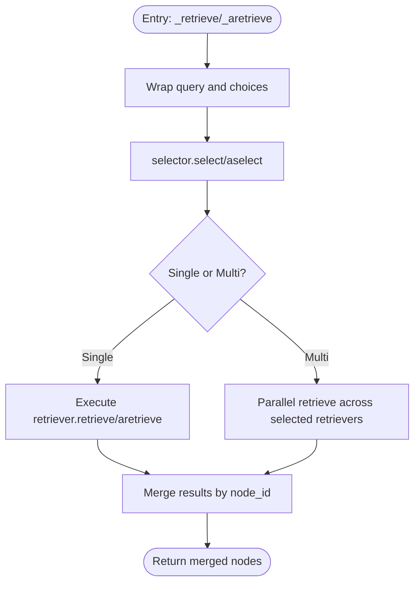
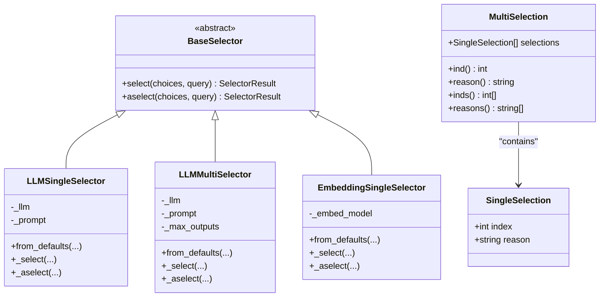
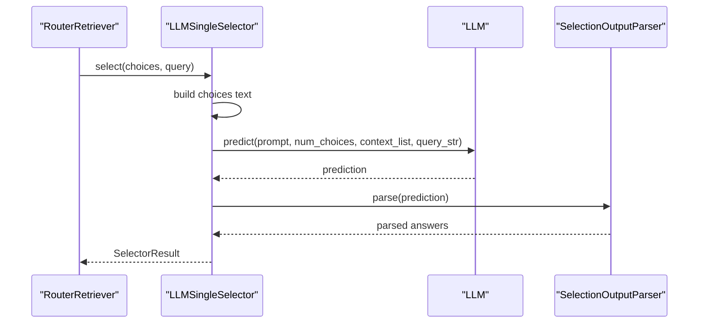
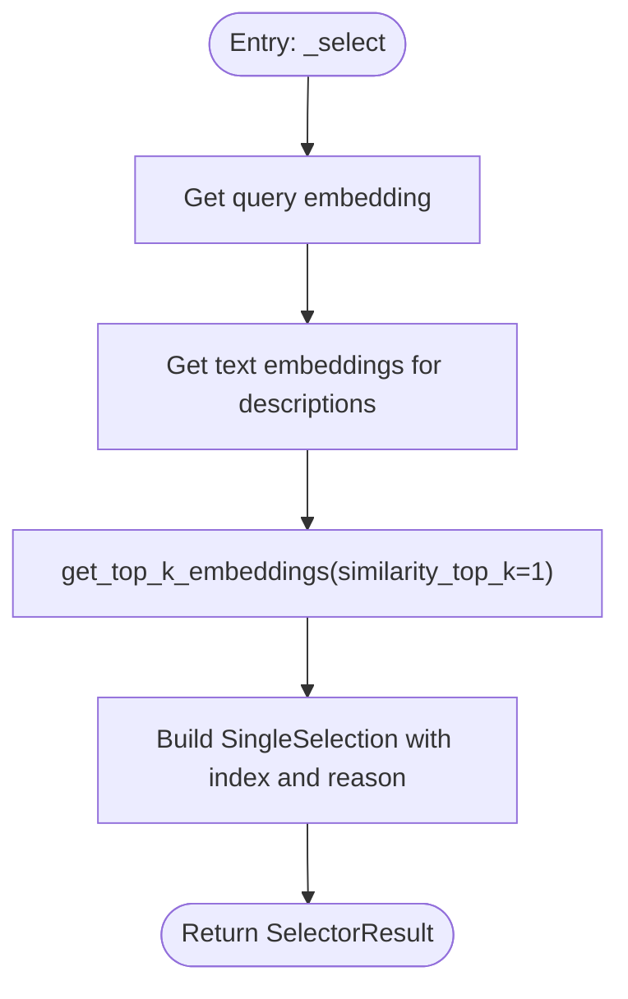
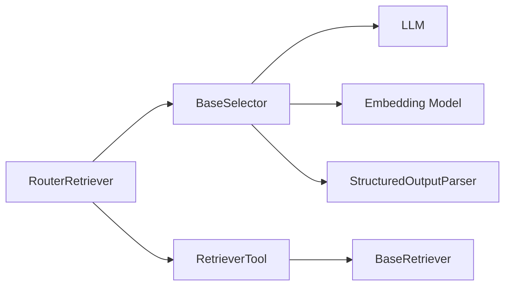

# Router Retrievers

<cite>
**Referenced Files in This Document**
- [router_retriever.py](file://llama-index-core/llama_index/core/retrievers/router_retriever.py)
- [base_selector.py](file://llama-index-core/llama_index/core/base/base_selector.py)
- [llm_selectors.py](file://llama-index-core/llama_index/core/selectors/llm_selectors.py)
- [embedding_selectors.py](file://llama-index-core/llama_index/core/selectors/embedding_selectors.py)
- [retriever_tool.py](file://llama-index-core/llama_index/core/tools/retriever_tool.py)
- [__init__.py](file://llama-index-core/llama_index/core/retrievers/__init__.py)
</cite>

## Table of Contents
1. [Introduction](#introduction)
2. [Project Structure](#project-structure)
3. [Core Components](#core-components)
4. [Architecture Overview](#architecture-overview)
5. [Detailed Component Analysis](#detailed-component-analysis)
6. [Dependency Analysis](#dependency-analysis)
7. [Performance Considerations](#performance-considerations)
8. [Troubleshooting Guide](#troubleshooting-guide)
9. [Conclusion](#conclusion)

## Introduction
Router retrievers implement a routing pattern to dynamically select the most appropriate retriever(s) from a set of candidate retrievers based on query characteristics. The RouterRetriever delegates the selection decision to a Selector, which evaluates candidate retrievers' metadata against the incoming query. Depending on whether the selector chooses a single or multiple retrievers, the RouterRetriever executes the chosen retrievers and merges their results. This enables flexible routing strategies such as choosing different vector stores, combining semantic and keyword retrieval, or applying dynamic fallback mechanisms.

## Project Structure
The router retriever lives in the core retrievers module and integrates with selector implementations and retriever tools:
- RouterRetriever orchestrates selection and retrieval across candidate retrievers.
- Selector abstractions define how to choose among candidates (single or multi).
- LLM-based and embedding-based selectors provide concrete routing strategies.
- RetrieverTool wraps individual retrievers and exposes metadata for selection.

**Diagram sources**
- [router_retriever.py](file://llama-index-core/llama_index/core/retrievers/router_retriever.py#L20-L143)
- [base_selector.py](file://llama-index-core/llama_index/core/base/base_selector.py#L72-L104)
- [llm_selectors.py](file://llama-index-core/llama_index/core/selectors/llm_selectors.py#L49-L235)
- [embedding_selectors.py](file://llama-index-core/llama_index/core/selectors/embedding_selectors.py#L16-L94)
- [retriever_tool.py](file://llama-index-core/llama_index/core/tools/retriever_tool.py#L26-L136)

**Section sources**
- [router_retriever.py](file://llama-index-core/llama_index/core/retrievers/router_retriever.py#L1-L143)
- [base_selector.py](file://llama-index-core/llama_index/core/base/base_selector.py#L1-L104)
- [llm_selectors.py](file://llama-index-core/llama_index/core/selectors/llm_selectors.py#L1-L235)
- [embedding_selectors.py](file://llama-index-core/llama_index/core/selectors/embedding_selectors.py#L1-L94)
- [retriever_tool.py](file://llama-index-core/llama_index/core/tools/retriever_tool.py#L1-L136)
- [__init__.py](file://llama-index-core/llama_index/core/retrievers/__init__.py#L46-L68)

## Core Components
- RouterRetriever: Central orchestrator that selects and executes candidate retrievers based on selector decisions.
- BaseSelector: Abstract interface for selection logic with synchronous and asynchronous variants.
- LLMSingleSelector / LLMMultiSelector: LLM-driven selectors that pick one or multiple retrievers using structured prompts.
- EmbeddingSingleSelector: Embedding-based selector that picks the retriever whose metadata description is most semantically similar to the query.
- RetrieverTool: Wrapper around a retriever that exposes metadata and optional postprocessing for selection.

Key capabilities:
- Single vs multi-selection routing.
- Synchronous and asynchronous retrieval paths.
- Merging of results from multiple retrievers while deduplicating by node ID.
- Logging of selection reasons for observability.

**Section sources**
- [router_retriever.py](file://llama-index-core/llama_index/core/retrievers/router_retriever.py#L20-L143)
- [base_selector.py](file://llama-index-core/llama_index/core/base/base_selector.py#L72-L104)
- [llm_selectors.py](file://llama-index-core/llama_index/core/selectors/llm_selectors.py#L49-L235)
- [embedding_selectors.py](file://llama-index-core/llama_index/core/selectors/embedding_selectors.py#L16-L94)
- [retriever_tool.py](file://llama-index-core/llama_index/core/tools/retriever_tool.py#L26-L136)

## Architecture Overview
RouterRetriever composes a selector and a collection of RetrieverTools. It converts the query into a QueryBundle and asks the selector to choose one or more retrievers. It then executes the chosen retrievers and merges their results.

**Diagram sources**
- [router_retriever.py](file://llama-index-core/llama_index/core/retrievers/router_retriever.py#L78-L143)
- [base_selector.py](file://llama-index-core/llama_index/core/base/base_selector.py#L79-L91)
- [retriever_tool.py](file://llama-index-core/llama_index/core/tools/retriever_tool.py#L68-L75)

## Detailed Component Analysis

### RouterRetriever
Responsibilities:
- Accepts a selector and a sequence of RetrieverTools.
- Converts queries to QueryBundle and delegates selection to the selector.
- Executes either a single retriever or multiple retrievers in parallel.
- Merges results by node ID to avoid duplicates.
- Emits callback events with the retrieved nodes.

Routing strategies supported:
- Single retriever selection via selector.ind.
- Multi retriever selection via selector.inds; results are gathered concurrently.

Configuration highlights:
- Optional LLM override for selector.
- Verbose logging of selection reasons.
- Callback manager integration for tracing.

Operational flow:
- Synchronous path: _retrieve computes selector result, executes chosen retriever(s), merges results.
- Asynchronous path: _aretrieve performs the same but with async retrievers and concurrent gathering.

**Diagram sources**
- [router_retriever.py](file://llama-index-core/llama_index/core/retrievers/router_retriever.py#L78-L143)

**Section sources**
- [router_retriever.py](file://llama-index-core/llama_index/core/retrievers/router_retriever.py#L20-L143)

### Selector Abstractions
BaseSelector defines:
- select/aselect entry points that normalize inputs to ToolMetadata and QueryBundle.
- _select/_aselect abstract methods for concrete implementations.
- SingleSelection and MultiSelection models for representing selection outcomes.

SelectorResult semantics:
- Single selection: ind/index and reason.
- Multi selection: selections list with helpers to access ind/inds and reason/reasons.

**Diagram sources**
- [base_selector.py](file://llama-index-core/llama_index/core/base/base_selector.py#L72-L104)
- [llm_selectors.py](file://llama-index-core/llama_index/core/selectors/llm_selectors.py#L49-L235)
- [embedding_selectors.py](file://llama-index-core/llama_index/core/selectors/embedding_selectors.py#L16-L94)

**Section sources**
- [base_selector.py](file://llama-index-core/llama_index/core/base/base_selector.py#L13-L104)
- [llm_selectors.py](file://llama-index-core/llama_index/core/selectors/llm_selectors.py#L49-L235)
- [embedding_selectors.py](file://llama-index-core/llama_index/core/selectors/embedding_selectors.py#L16-L94)

### LLM-Based Selectors
LLMSingleSelector and LLMMultiSelector:
- Build a formatted choices text from ToolMetadata descriptions.
- Use a structured output parser to produce a list of answers.
- Convert parsed answers into SelectorResult with index offsets adjusted for zero-based indexing.
- Support both synchronous and asynchronous prediction paths.

Configuration options:
- Custom LLM and prompt templates.
- Output parser controls structured response formatting.
- Multi-selector supports max_outputs to limit number of selections.

**Diagram sources**
- [llm_selectors.py](file://llama-index-core/llama_index/core/selectors/llm_selectors.py#L101-L137)

**Section sources**
- [llm_selectors.py](file://llama-index-core/llama_index/core/selectors/llm_selectors.py#L49-L235)

### Embedding-Based Selector
EmbeddingSingleSelector:
- Computes query embedding and embeddings for each ToolMetadata description.
- Uses top-k embedding similarity to pick the best match.
- Returns a SelectorResult with index and a reason string containing similarity score and description name.

Asynchronous variant mirrors the synchronous logic using async embedding APIs.

**Diagram sources**
- [embedding_selectors.py](file://llama-index-core/llama_index/core/selectors/embedding_selectors.py#L51-L93)

**Section sources**
- [embedding_selectors.py](file://llama-index-core/llama_index/core/selectors/embedding_selectors.py#L16-L94)

### RetrieverTool
RetrieverTool wraps a BaseRetriever and provides:
- Accessible metadata for selection.
- Optional node postprocessors applied during tool execution.
- Synchronous and asynchronous retrieval paths that return ToolOutput with content and raw nodes.

Integration with RouterRetriever:
- RouterRetriever extracts retrievers and metadata from RetrieverTools to feed the selector.

**Section sources**
- [retriever_tool.py](file://llama-index-core/llama_index/core/tools/retriever_tool.py#L26-L136)

## Dependency Analysis
RouterRetriever depends on:
- BaseSelector for selection logic.
- RetrieverTool to expose candidate retrievers and metadata.
- BaseRetriever implementations for actual retrieval.
- LLM or embedding models depending on the chosen selector.

Selector implementations depend on:
- LLMs and structured output parsers for LLM selectors.
- Embedding models for embedding selectors.
- ToolMetadata and QueryBundle normalization.

**Diagram sources**
- [router_retriever.py](file://llama-index-core/llama_index/core/retrievers/router_retriever.py#L35-L54)
- [base_selector.py](file://llama-index-core/llama_index/core/base/base_selector.py#L72-L104)
- [llm_selectors.py](file://llama-index-core/llama_index/core/selectors/llm_selectors.py#L61-L90)
- [embedding_selectors.py](file://llama-index-core/llama_index/core/selectors/embedding_selectors.py#L27-L42)
- [retriever_tool.py](file://llama-index-core/llama_index/core/tools/retriever_tool.py#L40-L48)

**Section sources**
- [router_retriever.py](file://llama-index-core/llama_index/core/retrievers/router_retriever.py#L35-L54)
- [base_selector.py](file://llama-index-core/llama_index/core/base/base_selector.py#L72-L104)
- [llm_selectors.py](file://llama-index-core/llama_index/core/selectors/llm_selectors.py#L61-L90)
- [embedding_selectors.py](file://llama-index-core/llama_index/core/selectors/embedding_selectors.py#L27-L42)
- [retriever_tool.py](file://llama-index-core/llama_index/core/tools/retriever_tool.py#L40-L48)

## Performance Considerations
- Parallel execution: When multiple retrievers are selected, RouterRetriever executes them concurrently, reducing total latency for multi-selection scenarios.
- Deduplication: Results are merged by node ID to avoid redundant nodes, minimizing downstream processing overhead.
- Selector cost: LLM-based selectors introduce inference costs; embedding selectors are generally cheaper but rely on embedding quality.
- Thresholds and confidence: While the current embedding selector picks the single best match, advanced strategies can incorporate similarity thresholds or confidence scoring to enable fallbacks or multi-selection triggers.
- Fallback mechanisms: Implement custom selectors or augment existing ones to route to backup retrievers when primary selection confidence is low.

[No sources needed since this section provides general guidance]

## Troubleshooting Guide
Common issues and remedies:
- No retriever selected: RouterRetriever raises an error when selection fails; ensure selector returns valid indices and metadata descriptions are meaningful.
- Duplicate nodes: Verify that node IDs are unique across retrievers; merging logic relies on node_id uniqueness.
- Asynchronous execution: Ensure all selected retrievers support async paths if using _aretrieve; otherwise, fall back to synchronous retrieval.
- Selector misconfiguration: For LLM selectors, confirm the prompt template and output parser are properly configured to produce structured answers.

**Section sources**
- [router_retriever.py](file://llama-index-core/llama_index/core/retrievers/router_retriever.py#L98-L100)
- [router_retriever.py](file://llama-index-core/llama_index/core/retrievers/router_retriever.py#L134-L136)

## Conclusion
RouterRetrievers provide a flexible, extensible mechanism to route queries to the most suitable retrievers. By leveraging selector abstractions—whether LLM-driven or embedding-based—the system can dynamically adapt to query characteristics, combine results from multiple sources, and integrate seamlessly with custom routing strategies. With proper configuration of selectors, metadata, and postprocessors, RouterRetrievers enable robust retrieval pipelines that balance accuracy, performance, and maintainability.