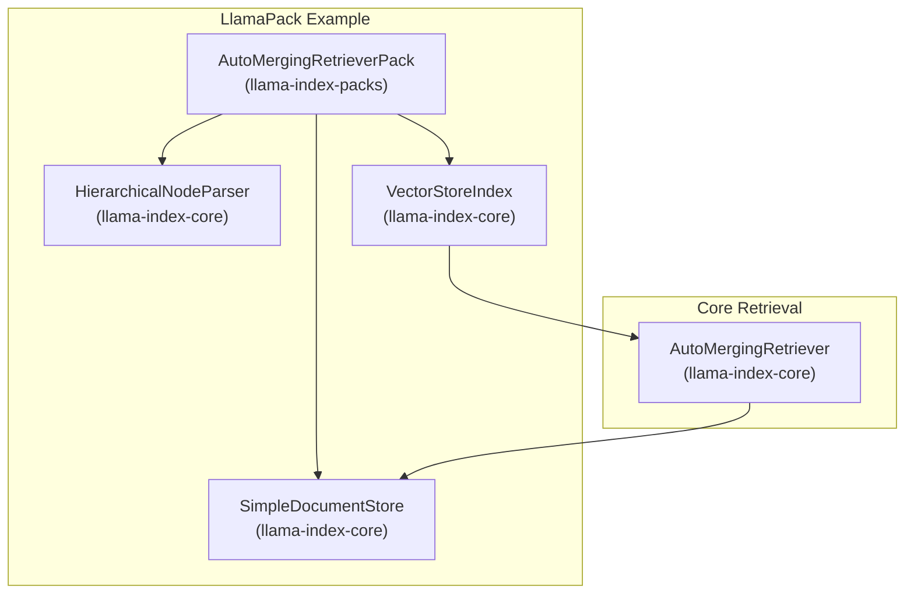
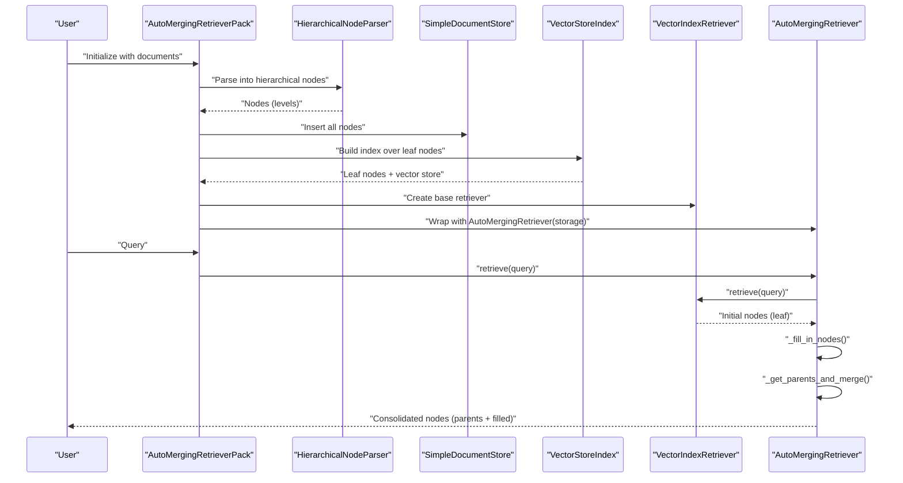
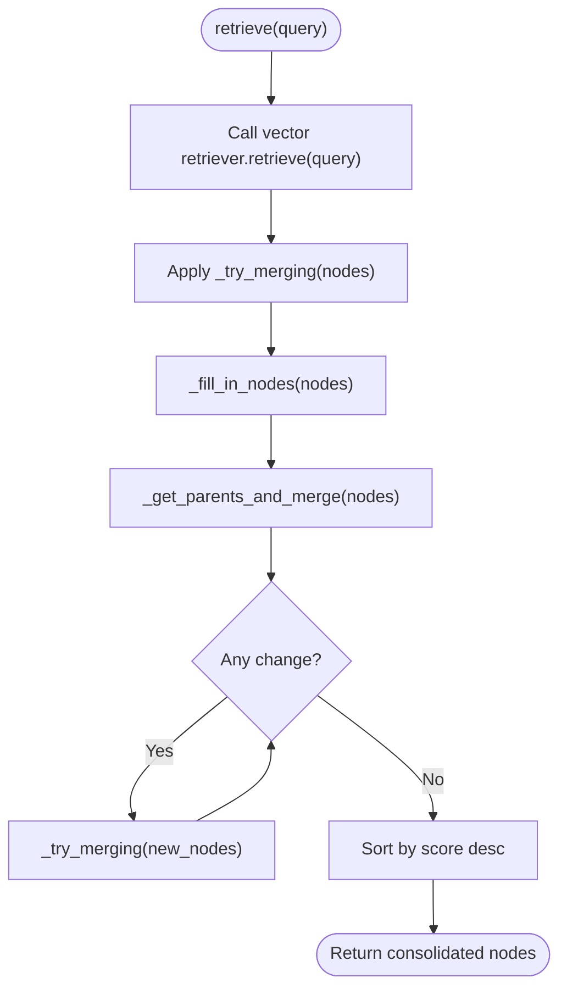
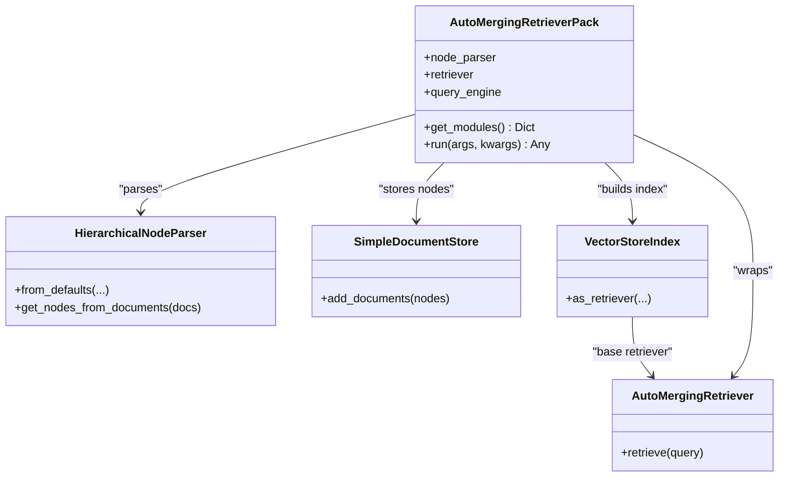
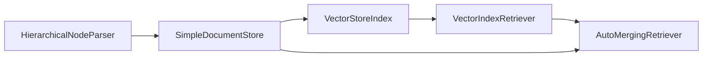

# Auto-Merging Retrievers

<cite>
**Referenced Files in This Document**
- [auto_merging_retriever.py](file://llama-index-core/llama_index/core/retrievers/auto_merging_retriever.py)
- [base.py](file://llama-index-packs/llama-index-packs-auto-merging-retriever/llama_index/packs/auto_merging_retriever/base.py)
- [README.md](file://llama-index-packs/llama-index-packs-auto-merging-retriever/README.md)
- [example.py](file://llama-index-packs/llama-index-packs-auto-merging-retriever/examples/example.py)
- [auto_merging_retriever.ipynb](file://docs/examples/retrievers/auto_merging_retriever.ipynb)
- [hierarchical.py](file://llama-index-core/llama_index/core/node_parser/relational/hierarchical.py)
- [auto_merging.md](file://docs/api_reference/api_reference/retrievers/auto_merging.md)
- [hierarchical.md](file://docs/api_reference/api_reference/node_parsers/hierarchical.md)
- [test_packs_auto_merging_retriever.py](file://llama-index-packs/llama-index-packs-auto-merging-retriever/tests/test_packs_auto_merging_retriever.py)
</cite>

## Table of Contents
1. [Introduction](#introduction)
2. [Project Structure](#project-structure)
3. [Core Components](#core-components)
4. [Architecture Overview](#architecture-overview)
5. [Detailed Component Analysis](#detailed-component-analysis)
6. [Dependency Analysis](#dependency-analysis)
7. [Performance Considerations](#performance-considerations)
8. [Troubleshooting Guide](#troubleshooting-guide)
9. [Conclusion](#conclusion)
10. [Appendices](#appendices)

## Introduction
This document explains the AutoMergingRetriever implementation and its integration with hierarchical indexing for improved retrieval over large document collections. It covers the merge algorithms, hierarchical query processing, automatic result consolidation, configuration parameters, and practical examples. It also addresses advanced topics such as dynamic merging strategies, performance tuning for large hierarchies, and debugging auto-merging chains.

## Project Structure
The auto-merging retriever spans two primary areas:
- Core implementation in the retrieval module
- A LlamaPack example that demonstrates hierarchical parsing, storage, indexing, and retrieval

**Diagram sources**
- [auto_merging_retriever.py](file://llama-index-core/llama_index/core/retrievers/auto_merging_retriever.py#L26-L195)
- [base.py](file://llama-index-packs/llama-index-packs-auto-merging-retriever/llama_index/packs/auto_merging_retriever/base.py#L18-L62)
- [hierarchical.py](file://llama-index-core/llama_index/core/node_parser/relational/hierarchical.py#L76-L236)

**Section sources**
- [auto_merging_retriever.py](file://llama-index-core/llama_index/core/retrievers/auto_merging_retriever.py#L1-L195)
- [base.py](file://llama-index-packs/llama-index-packs-auto-merging-retriever/llama_index/packs/auto_merging_retriever/base.py#L1-L62)
- [README.md](file://llama-index-packs/llama-index-packs-auto-merging-retriever/README.md#L1-L66)

## Core Components
- AutoMergingRetriever: Performs similarity-based retrieval and then merges child nodes into parent nodes when a ratio threshold is exceeded. It also fills gaps between adjacent nodes to improve continuity.
- AutoMergingRetrieverPack: Builds a hierarchical node graph from documents, loads nodes into a document store, constructs a vector index over leaf nodes, and wires an AutoMergingRetriever on top.
- HierarchicalNodeParser: Generates a multi-level hierarchy of nodes from documents, enabling coarse-to-fine retrieval and merging.

Key behaviors:
- Merge strategy: If the ratio of currently retrieved children to total children under a parent exceeds a threshold, replace the children with the parent node and average their scores.
- Gap filling: When adjacent leaf nodes are linked (prev/next), insert the intermediate node to maintain continuity.
- Iterative refinement: Repeatedly apply merging and gap filling until no further changes occur.

**Section sources**
- [auto_merging_retriever.py](file://llama-index-core/llama_index/core/retrievers/auto_merging_retriever.py#L26-L195)
- [base.py](file://llama-index-packs/llama-index-packs-auto-merging-retriever/llama_index/packs/auto_merging_retriever/base.py#L18-L62)
- [hierarchical.py](file://llama-index-core/llama_index/core/node_parser/relational/hierarchical.py#L76-L236)

## Architecture Overview
The retrieval pipeline integrates hierarchical parsing, storage, vector indexing, and auto-merging:

**Diagram sources**
- [base.py](file://llama-index-packs/llama-index-packs-auto-merging-retriever/llama_index/packs/auto_merging_retriever/base.py#L27-L49)
- [auto_merging_retriever.py](file://llama-index-core/llama_index/core/retrievers/auto_merging_retriever.py#L176-L194)
- [hierarchical.py](file://llama-index-core/llama_index/core/node_parser/relational/hierarchical.py#L207-L229)

## Detailed Component Analysis

### AutoMergingRetriever
The retriever orchestrates:
- Initial retrieval from a vector index
- Iterative merging and gap filling
- Final sorting by similarity

**Diagram sources**
- [auto_merging_retriever.py](file://llama-index-core/llama_index/core/retrievers/auto_merging_retriever.py#L176-L194)
- [auto_merging_retriever.py](file://llama-index-core/llama_index/core/retrievers/auto_merging_retriever.py#L166-L174)
- [auto_merging_retriever.py](file://llama-index-core/llama_index/core/retrievers/auto_merging_retriever.py#L127-L164)
- [auto_merging_retriever.py](file://llama-index-core/llama_index/core/retrievers/auto_merging_retriever.py#L56-L125)

Key methods and logic:
- _fill_in_nodes(nodes): Detects adjacent leaf nodes and inserts the intermediate node to fill gaps, averaging scores for continuity.
- _get_parents_and_merge(nodes): Computes the ratio of retrieved children to total children per parent. If the ratio exceeds the threshold, replaces children with the parent node and averages scores.
- _try_merging(nodes): Applies gap filling followed by merging.
- _retrieve(query): Runs iterative merging until convergence, then sorts by score.

Configuration parameters:
- simple_ratio_thresh: Threshold for deciding whether to merge children into a parent node.
- verbose: Controls logging/printing of merge/fill actions.
- callback_manager, object_map, objects: Standard retriever configuration inherited from the base class.

Behavioral notes:
- Merging is ratio-driven and leverages the hierarchical structure stored in the docstore.
- Gap filling improves contextual continuity by inserting missing intermediate nodes when the chain is broken.

**Section sources**
- [auto_merging_retriever.py](file://llama-index-core/llama_index/core/retrievers/auto_merging_retriever.py#L26-L55)
- [auto_merging_retriever.py](file://llama-index-core/llama_index/core/retrievers/auto_merging_retriever.py#L56-L125)
- [auto_merging_retriever.py](file://llama-index-core/llama_index/core/retrievers/auto_merging_retriever.py#L127-L174)
- [auto_merging_retriever.py](file://llama-index-core/llama_index/core/retrievers/auto_merging_retriever.py#L176-L194)

### AutoMergingRetrieverPack
The pack automates the end-to-end pipeline:
- Parses documents into a hierarchical node graph using HierarchicalNodeParser
- Inserts all nodes into a SimpleDocumentStore
- Builds a VectorStoreIndex over leaf nodes
- Creates a base retriever and wraps it with AutoMergingRetriever
- Exposes a query engine for convenient querying

**Diagram sources**
- [base.py](file://llama-index-packs/llama-index-packs-auto-merging-retriever/llama_index/packs/auto_merging_retriever/base.py#L18-L62)
- [hierarchical.py](file://llama-index-core/llama_index/core/node_parser/relational/hierarchical.py#L76-L236)

**Section sources**
- [base.py](file://llama-index-packs/llama-index-packs-auto-merging-retriever/llama_index/packs/auto_merging_retriever/base.py#L18-L62)
- [README.md](file://llama-index-packs/llama-index-packs-auto-merging-retriever/README.md#L1-L66)

### HierarchicalNodeParser
Generates a multi-level hierarchy:
- Levels are defined by chunk sizes (default 2048 → 512 → 128)
- Each child node references its parent and vice versa
- Leaf nodes are used for vector indexing; parent nodes are used for merging

Key APIs:
- from_defaults(chunk_sizes, chunk_overlap, include_metadata, include_prev_next_rel)
- get_nodes_from_documents(documents)
- Helper functions: get_leaf_nodes, get_root_nodes, get_child_nodes, get_deeper_nodes

**Section sources**
- [hierarchical.py](file://llama-index-core/llama_index/core/node_parser/relational/hierarchical.py#L76-L236)
- [hierarchical.md](file://docs/api_reference/api_reference/node_parsers/hierarchical.md#L1-L4)

## Dependency Analysis
- AutoMergingRetriever depends on:
  - VectorIndexRetriever for initial retrieval
  - StorageContext and SimpleDocumentStore for parent node lookup
  - NodeWithScore and Node relationships for merging and gap filling
- AutoMergingRetrieverPack depends on:
  - HierarchicalNodeParser for node generation
  - SimpleDocumentStore for persistence
  - VectorStoreIndex for leaf-node indexing
  - AutoMergingRetriever for hierarchical consolidation

**Diagram sources**
- [base.py](file://llama-index-packs/llama-index-packs-auto-merging-retriever/llama_index/packs/auto_merging_retriever/base.py#L34-L48)
- [auto_merging_retriever.py](file://llama-index-core/llama_index/core/retrievers/auto_merging_retriever.py#L46-L47)

**Section sources**
- [base.py](file://llama-index-packs/llama-index-packs-auto-merging-retriever/llama_index/packs/auto_merging_retriever/base.py#L34-L48)
- [auto_merging_retriever.py](file://llama-index-core/llama_index/core/retrievers/auto_merging_retriever.py#L46-L54)

## Performance Considerations
- Merge threshold tuning:
  - Lower thresholds increase merging frequency, consolidating more children into parents. This reduces output count and can improve coherence but risks losing fine-grained details.
  - Higher thresholds preserve more granular nodes, increasing recall but possibly fragmenting context.
- Vector similarity top-k:
  - Increase similarity_top_k to capture more candidates before merging; however, this raises computational cost.
- Hierarchical depth and chunk sizes:
  - Deeper hierarchies with smaller leaf chunks yield more granular retrieval but require more parent lookups and merging iterations.
  - Larger chunk sizes reduce hierarchy depth but may miss fine details.
- Docstore access:
  - Parent node fetches are O(1) per parent; repeated merging can trigger multiple docstore reads. Caching parents by ID mitigates overhead.
- Iterative merging:
  - The loop continues until no changes occur. Limit the number of iterations or early-stop conditions if needed for latency-sensitive applications.

[No sources needed since this section provides general guidance]

## Troubleshooting Guide
Common issues and remedies:
- No merging occurs:
  - Verify that nodes have parent relationships and that the docstore contains parent nodes.
  - Confirm that simple_ratio_thresh is set appropriately for your collection.
- Unexpected node counts:
  - Check that leaf nodes are used for vector indexing and that parent nodes are present in the docstore.
- Logging and verbosity:
  - Enable verbose mode to see merge and fill actions in logs.
- Integration with packs:
  - Ensure the pack initializes the node parser, docstore, and vector index correctly.
  - Validate that the retriever is constructed with the storage context produced by StorageContext.from_defaults(docstore=docstore).

Practical checks:
- Confirm that get_leaf_nodes(nodes) returns non-empty leaf sets for indexing.
- Inspect the number of nodes before and after merging to validate the ratio threshold effect.
- Compare AutoMergingRetriever results against a baseline vector retriever to assess improvement.

**Section sources**
- [auto_merging_retriever.py](file://llama-index-core/llama_index/core/retrievers/auto_merging_retriever.py#L56-L125)
- [auto_merging_retriever.py](file://llama-index-core/llama_index/core/retrievers/auto_merging_retriever.py#L127-L174)
- [base.py](file://llama-index-packs/llama-index-packs-auto-merging-retriever/llama_index/packs/auto_merging_retriever/base.py#L34-L48)
- [README.md](file://llama-index-packs/llama-index-packs-auto-merging-retriever/README.md#L48-L65)

## Conclusion
The AutoMergingRetriever enhances retrieval quality by leveraging hierarchical structures. It consolidates fragmented contexts into coherent summaries when appropriate and maintains continuity by filling gaps between adjacent nodes. Combined with HierarchicalNodeParser and a vector index over leaf nodes, it offers a robust, scalable solution for large document collections. Proper tuning of thresholds, chunk sizes, and similarity top-k yields significant gains in relevance and synthesis quality.

[No sources needed since this section summarizes without analyzing specific files]

## Appendices

### Practical Examples
- End-to-end usage via LlamaPack:
  - Initialize the pack with documents, then run queries through the exposed query engine.
  - See [example.py](file://llama-index-packs/llama-index-packs-auto-merging-retriever/examples/example.py#L1-L18) and [README.md](file://llama-index-packs/llama-index-packs-auto-merging-retriever/README.md#L21-L65).
- Interactive notebook walkthrough:
  - Demonstrates hierarchical parsing, storage, indexing, and retrieval with AutoMergingRetriever.
  - See [auto_merging_retriever.ipynb](file://docs/examples/retrievers/auto_merging_retriever.ipynb#L16-L148) and [auto_merging_retriever.ipynb](file://docs/examples/retrievers/auto_merging_retriever.ipynb#L320-L343).

**Section sources**
- [example.py](file://llama-index-packs/llama-index-packs-auto-merging-retriever/examples/example.py#L1-L18)
- [README.md](file://llama-index-packs/llama-index-packs-auto-merging-retriever/README.md#L21-L65)
- [auto_merging_retriever.ipynb](file://docs/examples/retrievers/auto_merging_retriever.ipynb#L16-L148)
- [auto_merging_retriever.ipynb](file://docs/examples/retrievers/auto_merging_retriever.ipynb#L320-L343)

### API References
- AutoMergingRetriever: [auto_merging.md](file://docs/api_reference/api_reference/retrievers/auto_merging.md#L1-L4)
- HierarchicalNodeParser: [hierarchical.md](file://docs/api_reference/api_reference/node_parsers/hierarchical.md#L1-L4)

**Section sources**
- [auto_merging.md](file://docs/api_reference/api_reference/retrievers/auto_merging.md#L1-L4)
- [hierarchical.md](file://docs/api_reference/api_reference/node_parsers/hierarchical.md#L1-L4)

### Tests
- Basic validation that the pack inherits from BaseLlamaPack:
  - [test_packs_auto_merging_retriever.py](file://llama-index-packs/llama-index-packs-auto-merging-retriever/tests/test_packs_auto_merging_retriever.py#L1-L8)

**Section sources**
- [test_packs_auto_merging_retriever.py](file://llama-index-packs/llama-index-packs-auto-merging-retriever/tests/test_packs_auto_merging_retriever.py#L1-L8)