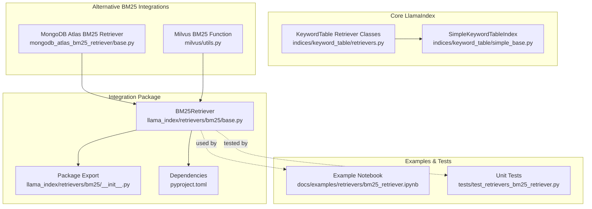
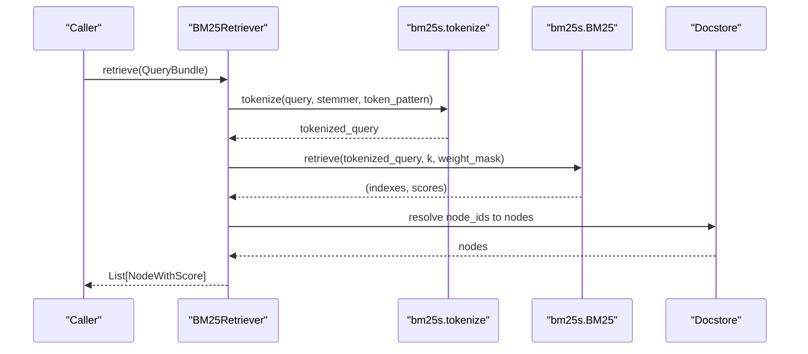
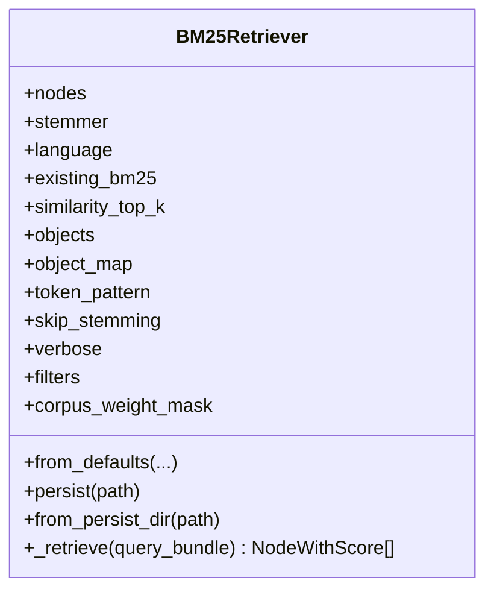
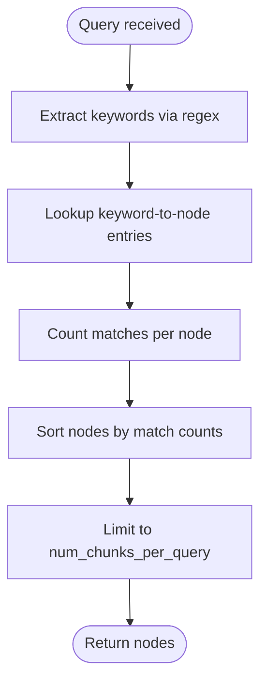
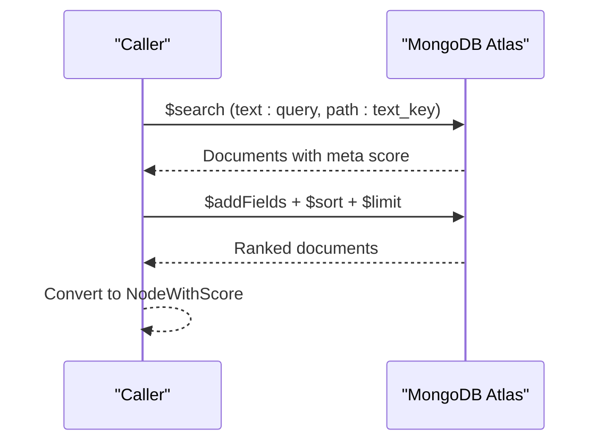
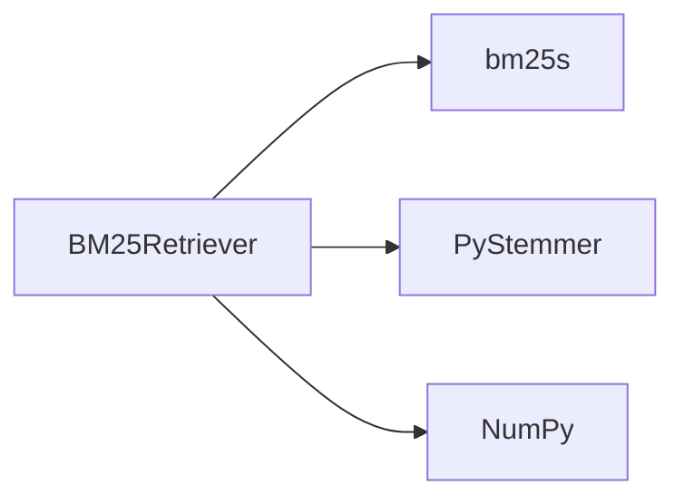

# BM25 Retrievers

<cite>
**Referenced Files in This Document**
- [base.py](file://llama-index-integrations/retrievers/llama-index-retrievers-bm25/llama_index/retrievers/bm25/base.py)
- [__init__.py](file://llama-index-integrations/retrievers/llama-index-retrievers-bm25/llama_index/retrievers/bm25/__init__.py)
- [pyproject.toml](file://llama-index-integrations/retrievers/llama-index-retrievers-bm25/pyproject.toml)
- [bm25.md](file://docs/api_reference/api_reference/retrievers/bm25.md)
- [bm25_retriever.ipynb](file://docs/examples/retrievers/bm25_retriever.ipynb)
- [test_retrievers_bm25_retriever.py](file://llama-index-integrations/retrievers/llama-index-retrievers-bm25/tests/test_retrievers_bm25_retriever.py)
- [retrievers.py](file://llama-index-core/llama_index/core/indices/keyword_table/retrievers.py)
- [simple_base.py](file://llama-index-core/llama_index/core/indices/keyword_table/simple_base.py)
- [base.py](file://llama-index-integrations/retrievers/llama-index-retrievers-mongodb-atlas-bm25-retriever/llama_index/retrievers/mongodb_atlas_bm25_retriever/base.py)
- [utils.py](file://llama-index-integrations/vector_stores/llama-index-vector-stores-milvus/llama_index/vector_stores/milvus/utils.py)
</cite>

## Table of Contents
1. [Introduction](#introduction)
2. [Project Structure](#project-structure)
3. [Core Components](#core-components)
4. [Architecture Overview](#architecture-overview)
5. [Detailed Component Analysis](#detailed-component-analysis)
6. [Dependency Analysis](#dependency-analysis)
7. [Performance Considerations](#performance-considerations)
8. [Troubleshooting Guide](#troubleshooting-guide)
9. [Conclusion](#conclusion)
10. [Appendices](#appendices)

## Introduction
This document explains BM25 retrievers in the LlamaIndex ecosystem with a focus on keyword-based retrieval. It covers the BM25 scoring mechanism, tokenization and normalization, configuration options (including stemming, stopword language, token pattern, and metadata filtering), and practical integration patterns. It also compares BM25 with vector-based retrieval and demonstrates hybrid approaches combining BM25 with dense embeddings. Use cases where keyword matching is preferred over semantic similarity are highlighted, along with performance considerations for large-scale document collections.

## Project Structure
The BM25 retriever is implemented as an integration package and complements core LlamaIndex components for keyword table indices and vector stores. The primary implementation resides in the retrievers-bm25 integration, while examples and tests demonstrate usage patterns and persistence.

**Diagram sources**
- [base.py](file://llama-index-integrations/retrievers/llama-index-retrievers-bm25/llama_index/retrievers/bm25/base.py#L41-L254)
- [__init__.py](file://llama-index-integrations/retrievers/llama-index-retrievers-bm25/llama_index/retrievers/bm25/__init__.py#L1-L3)
- [pyproject.toml](file://llama-index-integrations/retrievers/llama-index-retrievers-bm25/pyproject.toml#L27-L39)
- [bm25_retriever.ipynb](file://docs/examples/retrievers/bm25_retriever.ipynb#L1-L812)
- [test_retrievers_bm25_retriever.py](file://llama-index-integrations/retrievers/llama-index-retrievers-bm25/tests/test_retrievers_bm25_retriever.py#L1-L151)
- [retrievers.py](file://llama-index-core/llama_index/core/indices/keyword_table/retrievers.py#L31-L201)
- [simple_base.py](file://llama-index-core/llama_index/core/indices/keyword_table/simple_base.py#L24-L47)
- [base.py](file://llama-index-integrations/retrievers/llama-index-retrievers-mongodb-atlas-bm25-retriever/llama_index/retrievers/mongodb_atlas_bm25_retriever/base.py#L14-L108)
- [utils.py](file://llama-index-integrations/vector_stores/llama-index-vector-stores-milvus/llama_index/vector_stores/milvus/utils.py#L249-L283)

**Section sources**
- [base.py](file://llama-index-integrations/retrievers/llama-index-retrievers-bm25/llama_index/retrievers/bm25/base.py#L1-L254)
- [pyproject.toml](file://llama-index-integrations/retrievers/llama-index-retrievers-bm25/pyproject.toml#L27-L39)
- [bm25_retriever.ipynb](file://docs/examples/retrievers/bm25_retriever.ipynb#L1-L812)

## Core Components
- BM25Retriever: Implements keyword-based retrieval using BM25 scoring over tokenized text. It supports indexing from nodes or docstore, persistence to disk, metadata filtering, and optional stemming and stopword removal.
- KeywordTableSimpleRetriever: A keyword table-based retriever that extracts keywords via regex; complementary to BM25 for keyword-focused retrieval.
- MongoDBAtlasBM25Retriever: Alternative BM25 implementation backed by MongoDB Atlas search pipeline.
- Milvus BM25 Function: Vector store utility enabling BM25-like scoring in Milvus.

Key capabilities:
- Tokenization with configurable stopword language and token pattern
- Optional stemming via PyStemmer
- Metadata filtering that influences BM25 weights per corpus item
- Persistence and loading of BM25 index and retriever configuration

**Section sources**
- [base.py](file://llama-index-integrations/retrievers/llama-index-retrievers-bm25/llama_index/retrievers/bm25/base.py#L41-L147)
- [retrievers.py](file://llama-index-core/llama_index/core/indices/keyword_table/retrievers.py#L167-L182)
- [base.py](file://llama-index-integrations/retrievers/llama-index-retrievers-mongodb-atlas-bm25-retriever/llama_index/retrievers/mongodb_atlas_bm25_retriever/base.py#L14-L108)
- [utils.py](file://llama-index-integrations/vector_stores/llama-index-vector-stores-milvus/llama_index/vector_stores/milvus/utils.py#L249-L283)

## Architecture Overview
The BM25 retriever integrates with LlamaIndex’s base retriever interface and leverages the bm25s library for tokenization and scoring. It can be constructed from nodes or a docstore, optionally filtered by metadata, and persisted to disk. Retrieval applies tokenization, BM25 scoring, and returns ranked nodes with scores.

**Diagram sources**
- [base.py](file://llama-index-integrations/retrievers/llama-index-retrievers-bm25/llama_index/retrievers/bm25/base.py#L222-L253)

## Detailed Component Analysis

### BM25Retriever Implementation
- Construction modes:
  - From nodes: builds corpus metadata and tokenizes content for indexing.
  - From existing BM25: loads prebuilt index and corpus.
  - From defaults: accepts index, nodes, or docstore (mutually exclusive).
- Configuration:
  - Stemmer and stopword language for tokenization.
  - Token pattern for segmentation.
  - Skip stemming flag.
  - Similarity top-k with automatic clamping to corpus size.
  - Metadata filters that compute a weight mask applied during retrieval.
- Persistence:
  - Saves BM25 index and retriever args to disk.
  - Loads BM25 index and reconstructs retriever with saved args.

**Diagram sources**
- [base.py](file://llama-index-integrations/retrievers/llama-index-retrievers-bm25/llama_index/retrievers/bm25/base.py#L41-L147)
- [base.py](file://llama-index-integrations/retrievers/llama-index-retrievers-bm25/llama_index/retrievers/bm25/base.py#L149-L253)

**Section sources**
- [base.py](file://llama-index-integrations/retrievers/llama-index-retrievers-bm25/llama_index/retrievers/bm25/base.py#L71-L147)
- [base.py](file://llama-index-integrations/retrievers/llama-index-retrievers-bm25/llama_index/retrievers/bm25/base.py#L149-L221)
- [base.py](file://llama-index-integrations/retrievers/llama-index-retrievers-bm25/llama_index/retrievers/bm25/base.py#L222-L253)

### KeywordTableSimpleRetriever and Keyword-Based Retrieval
- Keyword extraction uses regex-based extraction rather than LLM prompting.
- Retrieves nodes by counting keyword matches across the keyword table and selecting top chunks.

**Diagram sources**
- [retrievers.py](file://llama-index-core/llama_index/core/indices/keyword_table/retrievers.py#L86-L116)

**Section sources**
- [retrievers.py](file://llama-index-core/llama_index/core/indices/keyword_table/retrievers.py#L167-L182)
- [simple_base.py](file://llama-index-core/llama_index/core/indices/keyword_table/simple_base.py#L24-L47)

### MongoDB Atlas BM25 Retriever
- Uses MongoDB Atlas search aggregation pipeline to perform BM25-style text search.
- Returns nodes enriched with metadata and scores derived from Atlas.

**Diagram sources**
- [base.py](file://llama-index-integrations/retrievers/llama-index-retrievers-mongodb-atlas-bm25-retriever/llama_index/retrievers/mongodb_atlas_bm25_retriever/base.py#L64-L107)

**Section sources**
- [base.py](file://llama-index-integrations/retrievers/llama-index-retrievers-mongodb-atlas-bm25-retriever/llama_index/retrievers/mongodb_atlas_bm25_retriever/base.py#L14-L108)

### Milvus BM25 Function
- Defines a BM25 function type for Milvus fields with analyzer and multi-analyzer parameters.
- Enables BM25-like scoring within Milvus vector store contexts.

**Section sources**
- [utils.py](file://llama-index-integrations/vector_stores/llama-index-vector-stores-milvus/llama_index/vector_stores/milvus/utils.py#L249-L283)

## Dependency Analysis
External dependencies and their roles:
- bm25s: Tokenization and BM25 scoring engine.
- PyStemmer: Optional stemming for token normalization.
- NumPy: Weight mask handling for metadata-filtered retrieval.

**Diagram sources**
- [base.py](file://llama-index-integrations/retrievers/llama-index-retrievers-bm25/llama_index/retrievers/bm25/base.py#L26-L28)
- [pyproject.toml](file://llama-index-integrations/retrievers/llama-index-retrievers-bm25/pyproject.toml#L35-L39)

**Section sources**
- [pyproject.toml](file://llama-index-integrations/retrievers/llama-index-retrievers-bm25/pyproject.toml#L27-L39)
- [base.py](file://llama-index-integrations/retrievers/llama-index-retrievers-bm25/llama_index/retrievers/bm25/base.py#L26-L28)

## Performance Considerations
- Tokenization cost: Large corpora incur higher tokenization overhead; consider batching and progress visibility for feedback.
- Index size and top-k: BM25 requires k ≤ number of indexed nodes; the retriever automatically adjusts top-k if needed.
- Metadata filtering: Weight masks reduce effective corpus size per query, improving speed and precision.
- Persistence: Persisting the BM25 index avoids recomputation across runs.
- Hybrid retrieval: Combining BM25 with dense retrieval can improve recall and robustness at the cost of latency.

[No sources needed since this section provides general guidance]

## Troubleshooting Guide
Common issues and resolutions:
- Empty corpus or insufficient nodes: The retriever raises an error if no nodes are indexed; ensure sufficient data is added.
- Top-k larger than corpus size: The retriever logs a warning and reduces top-k to corpus size.
- Metadata filters yielding zero-score matches: Weight masks set irrelevant items to zero; confirm filter keys and values align with stored metadata.

**Section sources**
- [base.py](file://llama-index-integrations/retrievers/llama-index-retrievers-bm25/llama_index/retrievers/bm25/base.py#L114-L126)
- [test_retrievers_bm25_retriever.py](file://llama-index-integrations/retrievers/llama-index-retrievers-bm25/tests/test_retrievers_bm25_retriever.py#L38-L55)
- [test_retrievers_bm25_retriever.py](file://llama-index-integrations/retrievers/llama-index-retrievers-bm25/tests/test_retrievers_bm25_retriever.py#L57-L118)

## Conclusion
BM25 retrievers provide a fast, interpretable, and effective keyword-based retrieval mechanism suitable for precise entity or phrase matching and scenarios where semantic embeddings are unnecessary or costly. With configurable tokenization, stemming, stopword handling, and metadata filtering, BM25 fits diverse document collections. When combined with vector-based retrieval, hybrid strategies can achieve strong coverage and accuracy. For large-scale deployments, leverage persistence, metadata filtering, and careful tuning of top-k to balance quality and performance.

[No sources needed since this section summarizes without analyzing specific files]

## Appendices

### Configuration Options Summary
- stemmer: Stemmer instance for normalization.
- language: Stopword language for tokenization.
- token_pattern: Regex pattern controlling token segmentation.
- skip_stemming: Disable stemming if desired.
- similarity_top_k: Number of results to return; adjusted if larger than corpus size.
- filters: MetadataFilters to restrict retrieval to subsets of the corpus.
- corpus_weight_mask: Optional numeric mask applied during retrieval scoring.

**Section sources**
- [base.py](file://llama-index-integrations/retrievers/llama-index-retrievers-bm25/llama_index/retrievers/bm25/base.py#L71-L90)
- [base.py](file://llama-index-integrations/retrievers/llama-index-retrievers-bm25/llama_index/retrievers/bm25/base.py#L128-L140)

### Example Workflows
- Traditional BM25 retrieval from nodes or docstore, with persistence and reloading.
- Metadata-filtered retrieval to narrow candidate sets.
- Hybrid retrieval combining BM25 with dense retrieval via a fusion retriever.

**Section sources**
- [bm25_retriever.ipynb](file://docs/examples/retrievers/bm25_retriever.ipynb#L149-L231)
- [bm25_retriever.ipynb](file://docs/examples/retrievers/bm25_retriever.ipynb#L237-L310)
- [bm25_retriever.ipynb](file://docs/examples/retrievers/bm25_retriever.ipynb#L430-L557)
- [bm25_retriever.ipynb](file://docs/examples/retrievers/bm25_retriever.ipynb#L564-L704)

### API Reference
- BM25Retriever class and members are documented under the retrievers API reference.

**Section sources**
- [bm25.md](file://docs/api_reference/api_reference/retrievers/bm25.md#L1-L4)