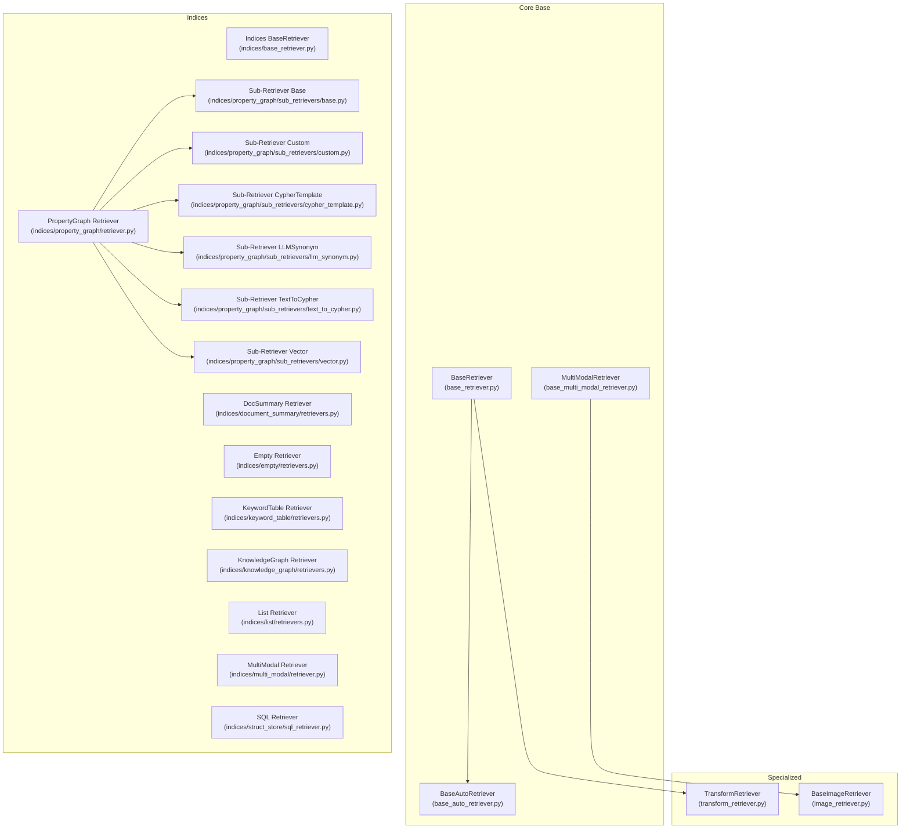
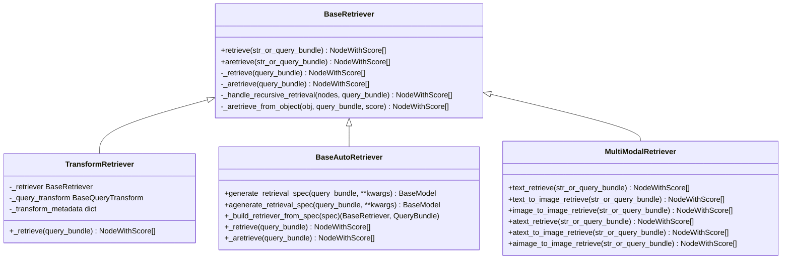
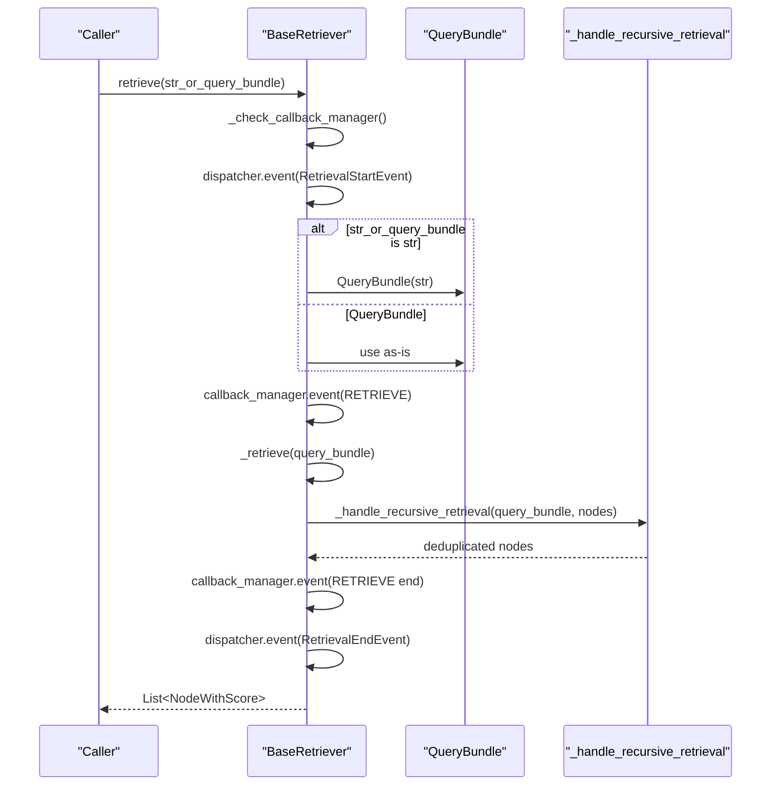
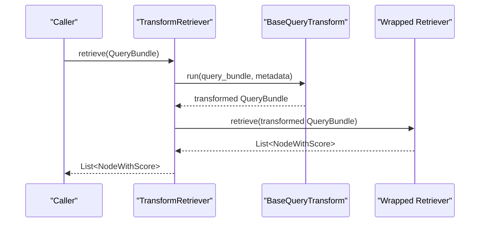
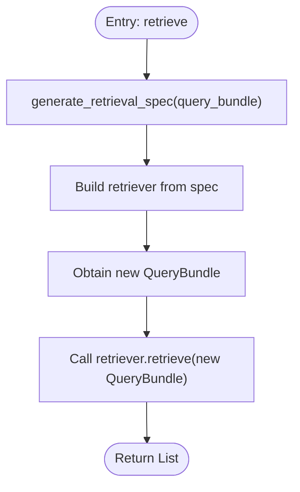
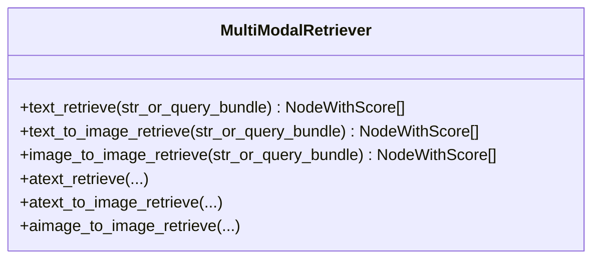
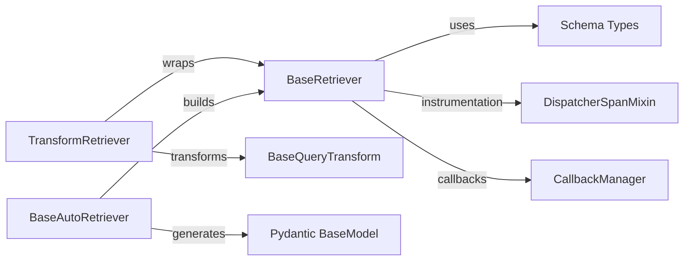

# Custom Retriever Development

<cite>
**Referenced Files in This Document**
- [base_retriever.py](file://llama-index-core/llama_index/core/base/base_retriever.py)
- [base_auto_retriever.py](file://llama-index-core/llama_index/core/base/base_auto_retriever.py)
- [base_multi_modal_retriever.py](file://llama-index-core/llama_index/core/base/base_multi_modal_retriever.py)
- [transform_retriever.py](file://llama-index-core/llama_index/core/retrievers/transform_retriever.py)
- [image_retriever.py](file://llama-index-core/llama_index/core/image_retriever.py)
- [base_retriever.py](file://llama-index-core/llama_index/core/indices/base_retriever.py)
- [retrievers.py](file://llama-index-core/llama_index/core/indices/document_summary/retrievers.py)
- [retrievers.py](file://llama-index-core/llama_index/core/indices/empty/retrievers.py)
- [retrievers.py](file://llama-index-core/llama_index/core/indices/keyword_table/retrievers.py)
- [retrievers.py](file://llama-index-core/llama_index/core/indices/knowledge_graph/retrievers.py)
- [retrievers.py](file://llama-index-core/llama_index/core/indices/list/retrievers.py)
- [retriever.py](file://llama-index-core/llama_index/core/indices/multi_modal/retriever.py)
- [retriever.py](file://llama-index-core/llama_index/core/indices/property_graph/retriever.py)
- [base.py](file://llama-index-core/llama_index/core/indices/property_graph/sub_retrievers/base.py)
- [custom.py](file://llama-index-core/llama_index/core/indices/property_graph/sub_retrievers/custom.py)
- [cypher_template.py](file://llama-index-core/llama_index/core/indices/property_graph/sub_retrievers/cypher_template.py)
- [llm_synonym.py](file://llama-index-core/llama_index/core/indices/property_graph/sub_retrievers/llm_synonym.py)
- [text_to_cypher.py](file://llama-index-core/llama_index/core/indices/property_graph/sub_retrievers/text_to_cypher.py)
- [vector.py](file://llama-index-core/llama_index/core/indices/property_graph/sub_retrievers/vector.py)
- [sql_retriever.py](file://llama-index-core/llama_index/core/indices/struct_store/sql_retriever.py)
</cite>

## Table of Contents
1. [Introduction](#introduction)
2. [Project Structure](#project-structure)
3. [Core Components](#core-components)
4. [Architecture Overview](#architecture-overview)
5. [Detailed Component Analysis](#detailed-component-analysis)
6. [Dependency Analysis](#dependency-analysis)
7. [Performance Considerations](#performance-considerations)
8. [Troubleshooting Guide](#troubleshooting-guide)
9. [Conclusion](#conclusion)
10. [Appendices](#appendices)

## Introduction
This document explains how to develop custom retrievers in LlamaIndex. It covers the BaseRetriever interface, required methods, lifecycle, and integration patterns. It also documents advanced retriever types such as TransformRetriever for query transformation and BaseAutoRetriever for dynamic specification-based retrieval. Step-by-step guidance is provided for building domain-specific retrievers, integrating external search APIs, and implementing specialized retrieval logic. Best practices for performance, error handling, caching, testing, composition, parameter tuning, and production deployment are included.

## Project Structure
LlamaIndex organizes retriever-related code primarily under the core base classes and index-specific implementations. The base classes define the contract and shared behavior, while index-specific retrievers implement retrieval strategies tailored to their index types. Additional specialized retrievers and patterns live alongside these core modules.

**Diagram sources**
- [base_retriever.py](file://llama-index-core/llama_index/core/base/base_retriever.py#L34-L275)
- [base_auto_retriever.py](file://llama-index-core/llama_index/core/base/base_auto_retriever.py#L9-L44)
- [base_multi_modal_retriever.py](file://llama-index-core/llama_index/core/base/base_multi_modal_retriever.py#L12-L78)
- [transform_retriever.py](file://llama-index-core/llama_index/core/retrievers/transform_retriever.py#L10-L45)
- [image_retriever.py](file://llama-index-core/llama_index/core/image_retriever.py)
- [base_retriever.py](file://llama-index-core/llama_index/core/indices/base_retriever.py)
- [retrievers.py](file://llama-index-core/llama_index/core/indices/document_summary/retrievers.py)
- [retrievers.py](file://llama-index-core/llama_index/core/indices/empty/retrievers.py)
- [retrievers.py](file://llama-index-core/llama_index/core/indices/keyword_table/retrievers.py)
- [retrievers.py](file://llama-index-core/llama_index/core/indices/knowledge_graph/retrievers.py)
- [retrievers.py](file://llama-index-core/llama_index/core/indices/list/retrievers.py)
- [retriever.py](file://llama-index-core/llama_index/core/indices/multi_modal/retriever.py)
- [retriever.py](file://llama-index-core/llama_index/core/indices/property_graph/retriever.py)
- [base.py](file://llama-index-core/llama_index/core/indices/property_graph/sub_retrievers/base.py)
- [custom.py](file://llama-index-core/llama_index/core/indices/property_graph/sub_retrievers/custom.py)
- [cypher_template.py](file://llama-index-core/llama_index/core/indices/property_graph/sub_retrievers/cypher_template.py)
- [llm_synonym.py](file://llama-index-core/llama_index/core/indices/property_graph/sub_retrievers/llm_synonym.py)
- [text_to_cypher.py](file://llama-index-core/llama_index/core/indices/property_graph/sub_retrievers/text_to_cypher.py)
- [vector.py](file://llama-index-core/llama_index/core/indices/property_graph/sub_retrievers/vector.py)
- [sql_retriever.py](file://llama-index-core/llama_index/core/indices/struct_store/sql_retriever.py)

**Section sources**
- [base_retriever.py](file://llama-index-core/llama_index/core/base/base_retriever.py#L34-L275)
- [base_auto_retriever.py](file://llama-index-core/llama_index/core/base/base_auto_retriever.py#L9-L44)
- [base_multi_modal_retriever.py](file://llama-index-core/llama_index/core/base/base_multi_modal_retriever.py#L12-L78)
- [transform_retriever.py](file://llama-index-core/llama_index/core/retrievers/transform_retriever.py#L10-L45)
- [image_retriever.py](file://llama-index-core/llama_index/core/image_retriever.py)

## Core Components
- BaseRetriever: Defines the core retrieval contract, including synchronous and asynchronous retrieval entry points, recursive retrieval handling, and instrumentation hooks. It accepts a QueryBundle and returns a list of NodeWithScore.
- BaseAutoRetriever: Extends BaseRetriever to support dynamic retrieval specification generation and asynchronous variants, delegating actual retrieval to a built retriever.
- MultiModalRetriever: Extends BaseRetriever and BaseImageRetriever to support text and image retrieval modes, enabling multimodal retrieval scenarios.
- TransformRetriever: Wraps an existing retriever and applies a query transformation before invoking retrieval, allowing query rewriting or augmentation.

Key responsibilities:
- Query processing: Accepts strings or QueryBundle, normalizes to QueryBundle, and triggers instrumentation.
- Result generation: Returns NodeWithScore with scores and metadata.
- Recursive retrieval: Handles IndexNode traversal and deduplication.
- Async support: Provides aretrieve and _aretrieve for non-blocking retrieval.

**Section sources**
- [base_retriever.py](file://llama-index-core/llama_index/core/base/base_retriever.py#L34-L275)
- [base_auto_retriever.py](file://llama-index-core/llama_index/core/base/base_auto_retriever.py#L9-L44)
- [base_multi_modal_retriever.py](file://llama-index-core/llama_index/core/base/base_multi_modal_retriever.py#L12-L78)
- [transform_retriever.py](file://llama-index-core/llama_index/core/retrievers/transform_retriever.py#L10-L45)

## Architecture Overview
The retriever ecosystem centers around BaseRetriever, which defines the retrieval lifecycle. Specializations include:
- TransformRetriever for query transformation prior to retrieval.
- BaseAutoRetriever for runtime specification-based retriever selection.
- MultiModalRetriever for text/image retrieval modes.
- Index-specific retrievers for different index types (document summary, keyword table, knowledge graph, list, property graph, SQL).

**Diagram sources**
- [base_retriever.py](file://llama-index-core/llama_index/core/base/base_retriever.py#L34-L275)
- [transform_retriever.py](file://llama-index-core/llama_index/core/retrievers/transform_retriever.py#L10-L45)
- [base_auto_retriever.py](file://llama-index-core/llama_index/core/base/base_auto_retriever.py#L9-L44)
- [base_multi_modal_retriever.py](file://llama-index-core/llama_index/core/base/base_multi_modal_retriever.py#L12-L78)

## Detailed Component Analysis

### BaseRetriever Lifecycle
The retrieval lifecycle includes normalization of input, instrumentation, recursive traversal, and result shaping.

**Diagram sources**
- [base_retriever.py](file://llama-index-core/llama_index/core/base/base_retriever.py#L185-L254)

Implementation highlights:
- Instrumentation: Uses dispatcher spans and callback events for tracing and metrics.
- Recursive retrieval: Traverses IndexNode objects via object_map and avoids duplicates by node hash and reference ID.
- Result shape: Returns NodeWithScore with scores and metadata.

**Section sources**
- [base_retriever.py](file://llama-index-core/llama_index/core/base/base_retriever.py#L34-L275)

### TransformRetriever Pattern
TransformRetriever wraps an existing retriever and applies a query transformation before invoking retrieval. This enables query rewriting, augmentation, or routing.

**Diagram sources**
- [transform_retriever.py](file://llama-index-core/llama_index/core/retrievers/transform_retriever.py#L40-L44)

Best practices:
- Keep transformations lightweight and deterministic.
- Pass transform_metadata for context-sensitive transformations.
- Compose with BaseAutoRetriever to dynamically select the underlying retriever.

**Section sources**
- [transform_retriever.py](file://llama-index-core/llama_index/core/retrievers/transform_retriever.py#L10-L45)

### BaseAutoRetriever Specification-Based Retrieval
BaseAutoRetriever generates a retrieval specification from the query and builds a retriever dynamically. This pattern supports adaptive retrieval strategies.

**Diagram sources**
- [base_auto_retriever.py](file://llama-index-core/llama_index/core/base/base_auto_retriever.py#L33-L43)

Guidance:
- Define a Pydantic model for retrieval specs to enforce structure.
- Derive new QueryBundle when transformations alter semantics.
- Implement async variants for non-blocking generation.

**Section sources**
- [base_auto_retriever.py](file://llama-index-core/llama_index/core/base/base_auto_retriever.py#L9-L44)

### MultiModalRetriever Modes
MultiModalRetriever extends BaseRetriever and BaseImageRetriever to support:
- Text queries retrieving text nodes
- Text queries retrieving images
- Image queries retrieving images

**Diagram sources**
- [base_multi_modal_retriever.py](file://llama-index-core/llama_index/core/base/base_multi_modal_retriever.py#L12-L78)

**Section sources**
- [base_multi_modal_retriever.py](file://llama-index-core/llama_index/core/base/base_multi_modal_retriever.py#L12-L78)
- [image_retriever.py](file://llama-index-core/llama_index/core/image_retriever.py)

### Index-Specific Retrievers
LlamaIndex provides retrievers tailored to specific index types. These demonstrate how to implement retrieval logic aligned with index internals.

Representative examples:
- Document Summary: [retrievers.py](file://llama-index-core/llama_index/core/indices/document_summary/retrievers.py)
- Empty: [retrievers.py](file://llama-index-core/llama_index/core/indices/empty/retrievers.py)
- Keyword Table: [retrievers.py](file://llama-index-core/llama_index/core/indices/keyword_table/retrievers.py)
- Knowledge Graph: [retrievers.py](file://llama-index-core/llama_index/core/indices/knowledge_graph/retrievers.py)
- List: [retrievers.py](file://llama-index-core/llama_index/core/indices/list/retrievers.py)
- MultiModal: [retriever.py](file://llama-index-core/llama_index/core/indices/multi_modal/retriever.py)
- Property Graph: [retriever.py](file://llama-index-core/llama_index/core/indices/property_graph/retriever.py)
- Struct Store SQL: [sql_retriever.py](file://llama-index-core/llama_index/core/indices/struct_store/sql_retriever.py)

These files illustrate retrieval patterns such as:
- Query-time expansion and filtering
- Graph traversal and Cypher translation
- Vector similarity and hybrid scoring
- Metadata-driven filtering

**Section sources**
- [retrievers.py](file://llama-index-core/llama_index/core/indices/document_summary/retrievers.py)
- [retrievers.py](file://llama-index-core/llama_index/core/indices/empty/retrievers.py)
- [retrievers.py](file://llama-index-core/llama_index/core/indices/keyword_table/retrievers.py)
- [retrievers.py](file://llama-index-core/llama_index/core/indices/knowledge_graph/retrievers.py)
- [retrievers.py](file://llama-index-core/llama_index/core/indices/list/retrievers.py)
- [retriever.py](file://llama-index-core/llama_index/core/indices/multi_modal/retriever.py)
- [retriever.py](file://llama-index-core/llama_index/core/indices/property_graph/retriever.py)
- [sql_retriever.py](file://llama-index-core/llama_index/core/indices/struct_store/sql_retriever.py)

## Dependency Analysis
BaseRetriever depends on:
- Schema types: QueryBundle, NodeWithScore, BaseNode, IndexNode, TextNode
- Instrumentation: DispatcherSpanMixin and RetrievalStartEvent/RetrievalEndEvent
- Callbacks: CallbackManager and RETRIEVE event
- Utilities: Settings for fallback callback manager

TransformRetriever depends on:
- BaseRetriever
- BaseQueryTransform for query transformation
- Optional transform_metadata for contextual transformation

BaseAutoRetriever depends on:
- BaseRetriever
- Pydantic BaseModel for retrieval spec
- Tuple-returning builder method to produce retriever and QueryBundle

**Diagram sources**
- [base_retriever.py](file://llama-index-core/llama_index/core/base/base_retriever.py#L14-L29)
- [transform_retriever.py](file://llama-index-core/llama_index/core/retrievers/transform_retriever.py#L3-L7)
- [base_auto_retriever.py](file://llama-index-core/llama_index/core/base/base_auto_retriever.py#L4-L6)

**Section sources**
- [base_retriever.py](file://llama-index-core/llama_index/core/base/base_retriever.py#L14-L29)
- [transform_retriever.py](file://llama-index-core/llama_index/core/retrievers/transform_retriever.py#L3-L7)
- [base_auto_retriever.py](file://llama-index-core/llama_index/core/base/base_auto_retriever.py#L4-L6)

## Performance Considerations
- Minimize redundant work:
  - Leverage recursive retrieval deduplication by node hash and reference ID.
  - Avoid repeated transformations; cache transformation results when safe.
- Instrumentation overhead:
  - Use callback events judiciously; disable verbose mode in production.
- Async patterns:
  - Prefer aretrieve for I/O-bound retrieval to improve throughput.
- Caching:
  - Cache query-transformed bundles and intermediate results when queries repeat.
  - Cache external API responses keyed by normalized query and metadata.
- Batch and concurrency:
  - For external APIs, batch requests and limit concurrent calls to avoid rate limits.
- Scoring and ranking:
  - Normalize scores consistently across retrievers to enable fusion later.

[No sources needed since this section provides general guidance]

## Troubleshooting Guide
Common issues and remedies:
- Duplicate nodes after retrieval:
  - Ensure recursive retrieval deduplication is active; verify node hash and ref_doc_id uniqueness.
- Unexpected object types during recursive retrieval:
  - Confirm object_map contains the expected objects for IndexNode.index_id.
- Instrumentation gaps:
  - Verify dispatcher initialization and callback manager presence.
- Async retrieval not used:
  - Call aretrieve for non-blocking retrieval; ensure _aretrieve is overridden when appropriate.

**Section sources**
- [base_retriever.py](file://llama-index-core/llama_index/core/base/base_retriever.py#L116-L183)

## Conclusion
Custom retrievers in LlamaIndex are built on a robust BaseRetriever contract that standardizes query processing, instrumentation, recursion, and result shaping. Specializations like TransformRetriever, BaseAutoRetriever, and MultiModalRetriever enable powerful composition and adaptation. By following the lifecycle, leveraging instrumentation, and applying best practices for performance and error handling, you can implement domain-specific retrievers, integrate external APIs, and deploy scalable retrieval systems.

[No sources needed since this section summarizes without analyzing specific files]

## Appendices

### Step-by-Step: Implementing a Domain-Specific Retriever
- Define a class inheriting from BaseRetriever.
- Implement _retrieve to accept a QueryBundle and return List[NodeWithScore].
- Optionally override _aretrieve for async support.
- Integrate with external APIs by transforming QueryBundle into API requests and mapping responses to NodeWithScore.
- Use object_map to resolve IndexNode references if needed.
- Add instrumentation via callback events and dispatcher spans.

**Section sources**
- [base_retriever.py](file://llama-index-core/llama_index/core/base/base_retriever.py#L256-L275)

### Step-by-Step: Integrating External Search APIs
- Wrap an external client in a retriever class.
- Normalize QueryBundle to API-specific query format.
- Apply caching keyed by normalized query and metadata.
- Map API results to NodeWithScore with appropriate scores and metadata.
- Handle errors gracefully and log via callback events.

[No sources needed since this section provides general guidance]

### Step-by-Step: Creating a Custom Retrieval Algorithm
- Choose BaseRetriever as the base class.
- Implement hybrid logic combining vector similarity, keyword matching, and metadata filters.
- Normalize scores across components for fair ranking.
- Support both sync and async retrieval paths.
- Compose with TransformRetriever to apply query enhancements.

**Section sources**
- [base_retriever.py](file://llama-index-core/llama_index/core/base/base_retriever.py#L256-L275)
- [transform_retriever.py](file://llama-index-core/llama_index/core/retrievers/transform_retriever.py#L40-L44)

### Testing Methodologies
- Unit tests:
  - Mock external APIs and verify _retrieve/_aretrieve return expected NodeWithScore lists.
  - Test recursive retrieval with IndexNode objects and object_map resolution.
- Integration tests:
  - Validate callback events and dispatcher spans are emitted.
  - Measure latency and throughput for async vs sync paths.
- Regression tests:
  - Ensure deduplication preserves relevant nodes and removes duplicates.

[No sources needed since this section provides general guidance]

### Production Deployment Considerations
- Instrumentation:
  - Enable callback events for observability; export metrics to monitoring systems.
- Resilience:
  - Implement retries and circuit breakers for external APIs.
  - Graceful degradation when upstream services fail.
- Scaling:
  - Use async retrieval and connection pooling for external APIs.
  - Consider sharding or partitioning for large corpora.
- Security:
  - Sanitize queries and metadata passed to external APIs.
  - Limit exposure of internal identifiers.

[No sources needed since this section provides general guidance]