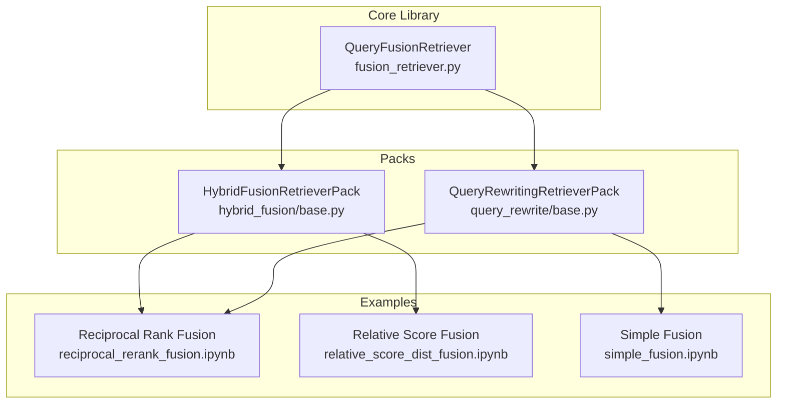
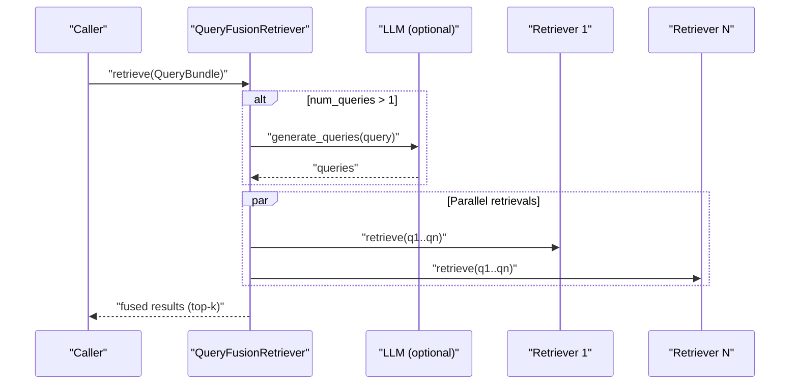
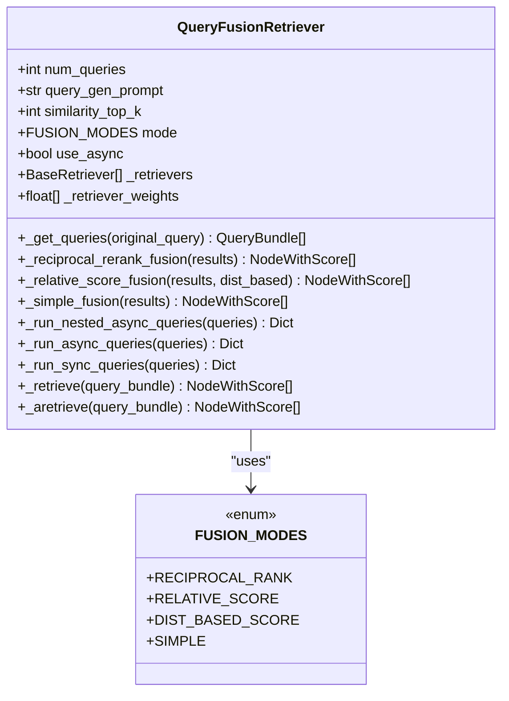
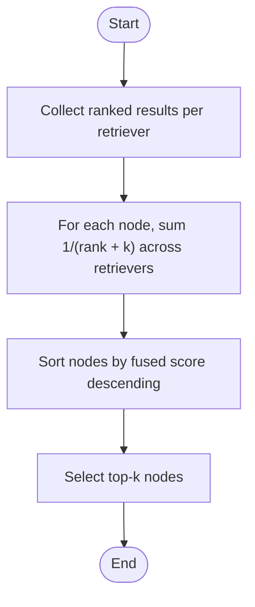
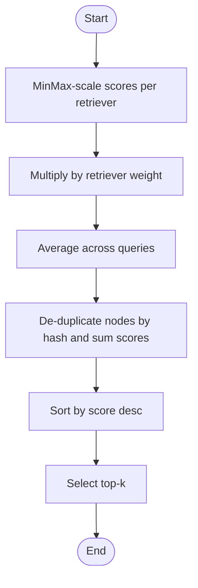
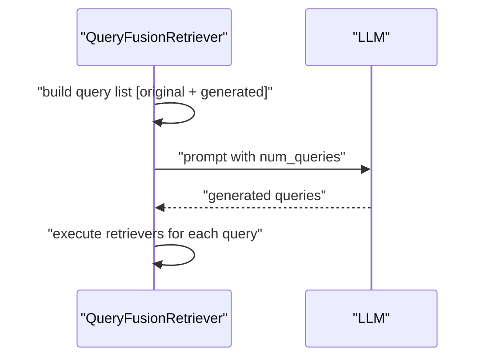
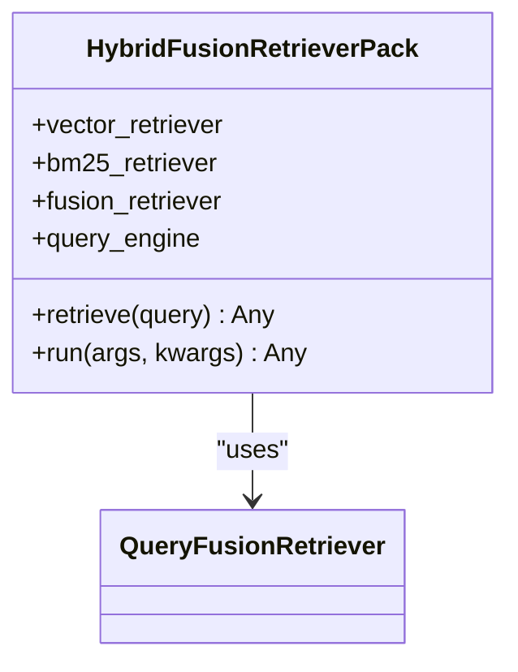
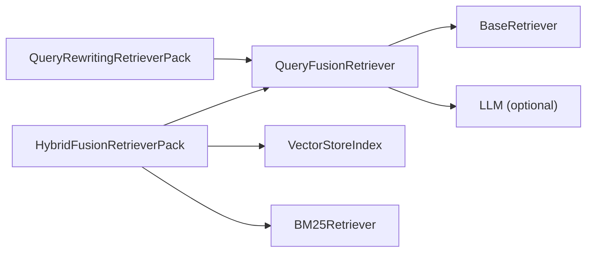

# Fusion Retrievers

<cite>
**Referenced Files in This Document**
- [fusion_retriever.py](file://llama-index-core/llama_index/core/retrievers/fusion_retriever.py)
- [query_fusion.md](file://docs/api_reference/api_reference/retrievers/query_fusion.md)
- [base.py (QueryFusionRetriever)](file://llama-index-core/llama_index/core/retrievers/fusion_retriever.py)
- [base.py (HybridFusionRetrieverPack)](file://llama-index-packs/llama-index-packs-fusion-retriever/llama_index/packs/fusion_retriever/hybrid_fusion/base.py)
- [base.py (QueryRewritingRetrieverPack)](file://llama-index-packs/llama-index-packs-fusion-retriever/llama_index/packs/fusion_retriever/query_rewrite/base.py)
- [README.md (Fusion Retriever Packs)](file://llama-index-packs/llama-index-packs-fusion-retriever/README.md)
- [reciprocal_rerank_fusion.ipynb](file://docs/examples/retrievers/reciprocal_rerank_fusion.ipynb)
- [relative_score_dist_fusion.ipynb](file://docs/examples/retrievers/relative_score_dist_fusion.ipynb)
- [simple_fusion.ipynb](file://docs/examples/retrievers/simple_fusion.ipynb)
</cite>

## Table of Contents
1. [Introduction](#introduction)
2. [Project Structure](#project-structure)
3. [Core Components](#core-components)
4. [Architecture Overview](#architecture-overview)
5. [Detailed Component Analysis](#detailed-component-analysis)
6. [Dependency Analysis](#dependency-analysis)
7. [Performance Considerations](#performance-considerations)
8. [Troubleshooting Guide](#troubleshooting-guide)
9. [Conclusion](#conclusion)
10. [Appendices](#appendices)

## Introduction
This document explains fusion retrievers in LlamaIndex with a focus on ensemble retrieval strategies and result combination techniques. It covers the QueryFusionRetriever implementation, including reciprocal rank fusion, relative score fusion, distribution-based score fusion, and simple fusion. It also documents fusion algorithms such as reciprocal rank fusion (RRF), score normalization, and diversity-aware fusion. Configuration of fusion weights, ranking strategies, and result merging criteria are explained with practical examples of combining multiple retrieval strategies, integrating heterogeneous retrievers (vector + keyword + graph), and optimizing fusion parameters for different use cases. Advanced topics include query transformation for fusion, performance tuning, and evaluation of fused retrieval results.

## Project Structure
The fusion retriever functionality spans the core library and a dedicated pack with example notebooks:
- Core implementation: QueryFusionRetriever in the core retrievers module
- Example packs: HybridFusionRetrieverPack and QueryRewritingRetrieverPack in the fusion retriever pack
- Example notebooks demonstrating reciprocal rank fusion, relative score fusion, and simple fusion
- API reference documentation for QueryFusionRetriever and the fusion retriever pack

**Diagram sources**
- [fusion_retriever.py](file://llama-index-core/llama_index/core/retrievers/fusion_retriever.py#L33-L305)
- [base.py (HybridFusionRetrieverPack)](file://llama-index-packs/llama-index-packs-fusion-retriever/llama_index/packs/fusion_retriever/hybrid_fusion/base.py#L15-L89)
- [base.py (QueryRewritingRetrieverPack)](file://llama-index-packs/llama-index-packs-fusion-retriever/llama_index/packs/fusion_retriever/query_rewrite/base.py#L13-L68)
- [reciprocal_rerank_fusion.ipynb](file://docs/examples/retrievers/reciprocal_rerank_fusion.ipynb#L1-L359)
- [relative_score_dist_fusion.ipynb](file://docs/examples/retrievers/relative_score_dist_fusion.ipynb#L1-L383)
- [simple_fusion.ipynb](file://docs/examples/retrievers/simple_fusion.ipynb#L1-L283)

**Section sources**
- [fusion_retriever.py](file://llama-index-core/llama_index/core/retrievers/fusion_retriever.py#L1-L305)
- [README.md (Fusion Retriever Packs)](file://llama-index-packs/llama-index-packs-fusion-retriever/README.md#L1-L128)

## Core Components
- QueryFusionRetriever: Implements ensemble retrieval with multiple fusion strategies and optional query generation.
- HybridFusionRetrieverPack: Demonstrates combining vector and BM25 retrievers with fusion.
- QueryRewritingRetrieverPack: Generates multiple queries against a single retriever and fuses results.

Key capabilities:
- Multiple fusion modes: reciprocal rank, relative score, distribution-based score, and simple fusion
- Optional query generation via an LLM to expand the search space
- Asynchronous execution support for concurrent retriever calls
- Configurable similarity_top_k and retriever weights for result merging

**Section sources**
- [fusion_retriever.py](file://llama-index-core/llama_index/core/retrievers/fusion_retriever.py#L24-L31)
- [fusion_retriever.py](file://llama-index-core/llama_index/core/retrievers/fusion_retriever.py#L33-L70)
- [base.py (HybridFusionRetrieverPack)](file://llama-index-packs/llama-index-packs-fusion-retriever/llama_index/packs/fusion_retriever/hybrid_fusion/base.py#L15-L89)
- [base.py (QueryRewritingRetrieverPack)](file://llama-index-packs/llama-index-packs-fusion-retriever/llama_index/packs/fusion_retriever/query_rewrite/base.py#L13-L68)

## Architecture Overview
The fusion retriever orchestrates multiple retrievers, optionally generates additional queries, executes retrievals concurrently, and merges results using a chosen fusion strategy.

**Diagram sources**
- [fusion_retriever.py](file://llama-index-core/llama_index/core/retrievers/fusion_retriever.py#L83-L98)
- [fusion_retriever.py](file://llama-index-core/llama_index/core/retrievers/fusion_retriever.py#L263-L284)
- [fusion_retriever.py](file://llama-index-core/llama_index/core/retrievers/fusion_retriever.py#L236-L251)

## Detailed Component Analysis

### QueryFusionRetriever
QueryFusionRetriever supports four fusion modes and integrates optional query expansion:
- Modes: reciprocal_rank, relative_score, dist_based_score, simple
- Query expansion: generates multiple queries from the original query using an LLM
- Execution: runs retrievers in parallel (async or nested async) and merges results
- Weighting: per-retriever weights normalized to sum to 1; applied during fusion

Implementation highlights:
- Fusion modes selection and routing
- Reciprocal rank fusion with a tunable k parameter
- Relative score fusion with MinMax scaling and optional distribution-based scaling
- Simple fusion for deduplication and max scoring
- Asynchronous retrieval orchestration

**Diagram sources**
- [fusion_retriever.py](file://llama-index-core/llama_index/core/retrievers/fusion_retriever.py#L24-L31)
- [fusion_retriever.py](file://llama-index-core/llama_index/core/retrievers/fusion_retriever.py#L33-L305)

**Section sources**
- [fusion_retriever.py](file://llama-index-core/llama_index/core/retrievers/fusion_retriever.py#L24-L31)
- [fusion_retriever.py](file://llama-index-core/llama_index/core/retrievers/fusion_retriever.py#L33-L70)
- [fusion_retriever.py](file://llama-index-core/llama_index/core/retrievers/fusion_retriever.py#L100-L135)
- [fusion_retriever.py](file://llama-index-core/llama_index/core/retrievers/fusion_retriever.py#L137-L198)
- [fusion_retriever.py](file://llama-index-core/llama_index/core/retrievers/fusion_retriever.py#L200-L217)
- [fusion_retriever.py](file://llama-index-core/llama_index/core/retrievers/fusion_retriever.py#L219-L261)
- [fusion_retriever.py](file://llama-index-core/llama_index/core/retrievers/fusion_retriever.py#L263-L304)

### Fusion Strategies

#### Reciprocal Rank Fusion (RRF)
- Aggregates ranks across retrievers using reciprocal rank formula with a smoothing parameter k
- Suitable when retrievers produce ranked lists and scores are comparable
- Typical k value used in practice is 60

**Diagram sources**
- [fusion_retriever.py](file://llama-index-core/llama_index/core/retrievers/fusion_retriever.py#L100-L135)

**Section sources**
- [fusion_retriever.py](file://llama-index-core/llama_index/core/retrievers/fusion_retriever.py#L100-L135)

#### Relative Score Fusion
- Normalizes scores per retriever using MinMax scaling (or distribution-based scaling)
- Applies per-retriever weights and averages across queries
- Useful when retrievers use different scoring scales

**Diagram sources**
- [fusion_retriever.py](file://llama-index-core/llama_index/core/retrievers/fusion_retriever.py#L137-L198)

**Section sources**
- [fusion_retriever.py](file://llama-index-core/llama_index/core/retrievers/fusion_retriever.py#L137-L198)

#### Distribution-Based Score Fusion
- Similar to relative score fusion but scales using mean and std dev per retriever
- Helps when score distributions vary widely across retrievers

**Section sources**
- [fusion_retriever.py](file://llama-index-core/llama_index/core/retrievers/fusion_retriever.py#L137-L198)

#### Simple Fusion
- De-duplicates nodes by hash and keeps the maximum score observed
- No normalization or weighting; straightforward aggregation

**Section sources**
- [fusion_retriever.py](file://llama-index-core/llama_index/core/retrievers/fusion_retriever.py#L200-L217)

### Query Generation and Expansion
- Optional query generation expands the search space by generating related queries
- Uses an LLM with a configurable prompt template
- Controls number of generated queries and verbosity

**Diagram sources**
- [fusion_retriever.py](file://llama-index-core/llama_index/core/retrievers/fusion_retriever.py#L83-L98)
- [fusion_retriever.py](file://llama-index-core/llama_index/core/retrievers/fusion_retriever.py#L263-L284)

**Section sources**
- [fusion_retriever.py](file://llama-index-core/llama_index/core/retrievers/fusion_retriever.py#L15-L21)
- [fusion_retriever.py](file://llama-index-core/llama_index/core/retrievers/fusion_retriever.py#L83-L98)

### Example Packs

#### HybridFusionRetrieverPack
- Combines a vector retriever and a BM25 retriever
- Demonstrates reciprocal rank fusion with configurable top-k and query generation

**Diagram sources**
- [base.py (HybridFusionRetrieverPack)](file://llama-index-packs/llama-index-packs-fusion-retriever/llama_index/packs/fusion_retriever/hybrid_fusion/base.py#L15-L89)

**Section sources**
- [base.py (HybridFusionRetrieverPack)](file://llama-index-packs/llama-index-packs-fusion-retriever/llama_index/packs/fusion_retriever/hybrid_fusion/base.py#L15-L89)
- [README.md (Fusion Retriever Packs)](file://llama-index-packs/llama-index-packs-fusion-retriever/README.md#L3-L64)

#### QueryRewritingRetrieverPack
- Builds a vector index and generates multiple queries against the vector retriever
- Fuses results using the selected fusion mode

**Section sources**
- [base.py (QueryRewritingRetrieverPack)](file://llama-index-packs/llama-index-packs-fusion-retriever/llama_index/packs/fusion_retriever/query_rewrite/base.py#L13-L68)
- [README.md (Fusion Retriever Packs)](file://llama-index-packs/llama-index-packs-fusion-retriever/README.md#L66-L127)

## Dependency Analysis
- QueryFusionRetriever depends on BaseRetriever implementations and optionally an LLM for query generation
- Packs depend on QueryFusionRetriever and higher-level query engines
- Examples demonstrate integration with BM25 and VectorStoreIndex

**Diagram sources**
- [fusion_retriever.py](file://llama-index-core/llama_index/core/retrievers/fusion_retriever.py#L1-L14)
- [base.py (HybridFusionRetrieverPack)](file://llama-index-packs/llama-index-packs-fusion-retriever/llama_index/packs/fusion_retriever/hybrid_fusion/base.py#L6-L12)
- [base.py (QueryRewritingRetrieverPack)](file://llama-index-packs/llama-index-packs-fusion-retriever/llama_index/packs/fusion_retriever/query_rewrite/base.py#L5-L10)

**Section sources**
- [fusion_retriever.py](file://llama-index-core/llama_index/core/retrievers/fusion_retriever.py#L1-L14)
- [base.py (HybridFusionRetrieverPack)](file://llama-index-packs/llama-index-packs-fusion-retriever/llama_index/packs/fusion_retriever/hybrid_fusion/base.py#L6-L12)
- [base.py (QueryRewritingRetrieverPack)](file://llama-index-packs/llama-index-packs-fusion-retriever/llama_index/packs/fusion_retriever/query_rewrite/base.py#L5-L10)

## Performance Considerations
- Asynchronous execution: Enable use_async to run retrievers concurrently and reduce latency
- num_queries trade-off: Increasing num_queries improves recall but increases cost and latency
- similarity_top_k: Tune to balance precision and downstream processing overhead
- retriever_weights: Adjust to emphasize stronger retrievers; ensure weights sum to 1
- Fusion mode choice:
  - RRF: good for comparable ranks, minimal overhead
  - Relative/Distribution-based: beneficial when scoring scales differ
  - Simple: fastest, least overhead, suitable for deduplication-only needs

[No sources needed since this section provides general guidance]

## Troubleshooting Guide
Common issues and resolutions:
- Unexpected low recall with RRF: Increase num_queries or switch to relative score fusion
- Score scale mismatch across retrievers: Use relative score or distribution-based fusion
- Slow retrieval latency: Enable use_async and reduce similarity_top_k
- Verbose logs: Disable verbose or filter LLM prompts
- Weight normalization: Ensure retriever_weights sum to 1; the implementation normalizes automatically

**Section sources**
- [fusion_retriever.py](file://llama-index-core/llama_index/core/retrievers/fusion_retriever.py#L56-L61)
- [fusion_retriever.py](file://llama-index-core/llama_index/core/retrievers/fusion_retriever.py#L263-L284)

## Conclusion
Fusion retrievers provide a flexible and powerful mechanism to combine heterogeneous retrievers and improve retrieval quality. QueryFusionRetriever supports multiple fusion strategies, optional query expansion, and asynchronous execution. The included packs and examples demonstrate practical integration with vector and BM25 retrievers, enabling robust hybrid retrieval pipelines. Proper configuration of fusion weights, ranking strategies, and result merging criteria allows tailoring fusion to diverse use cases and datasets.

[No sources needed since this section summarizes without analyzing specific files]

## Appendices

### Practical Examples and Usage Patterns
- Reciprocal rank fusion with vector + BM25 retrievers
- Relative score fusion with weighted retrievers
- Simple fusion for deduplication and max scoring
- Query rewriting fusion with a single vector retriever

**Section sources**
- [reciprocal_rerank_fusion.ipynb](file://docs/examples/retrievers/reciprocal_rerank_fusion.ipynb#L1-L359)
- [relative_score_dist_fusion.ipynb](file://docs/examples/retrievers/relative_score_dist_fusion.ipynb#L1-L383)
- [simple_fusion.ipynb](file://docs/examples/retrievers/simple_fusion.ipynb#L1-L283)

### API Reference
- QueryFusionRetriever: [API reference](file://docs/api_reference/api_reference/retrievers/query_fusion.md#L1-L4)
- Fusion Retriever Packs: [API reference](file://docs/api_reference/api_reference/packs/fusion_retriever.md#L1-L4)

**Section sources**
- [query_fusion.md](file://docs/api_reference/api_reference/retrievers/query_fusion.md#L1-L4)
- [fusion_retriever.md](file://docs/api_reference/api_reference/packs/fusion_retriever.md#L1-L4)