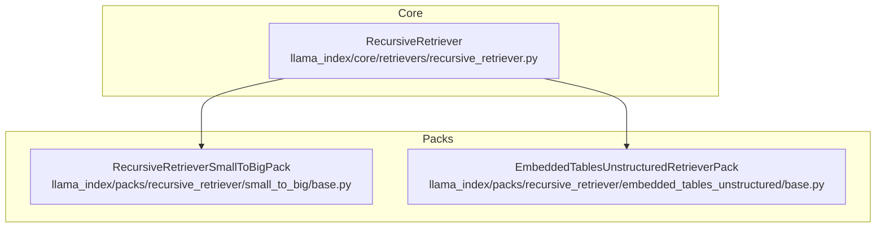
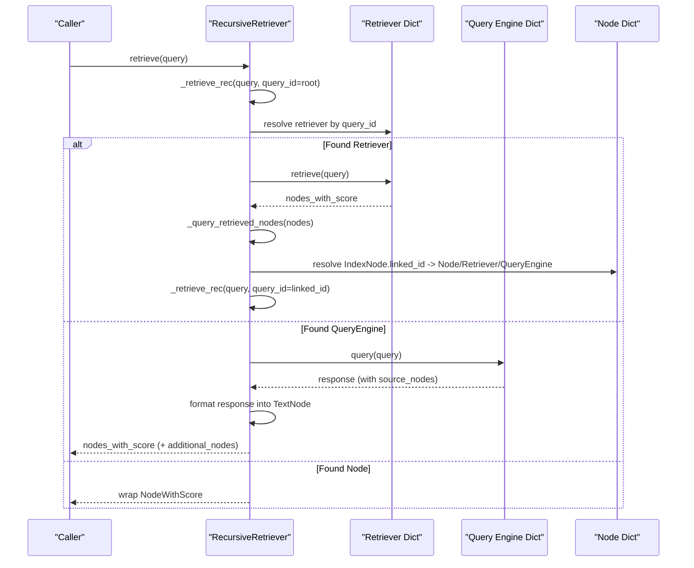
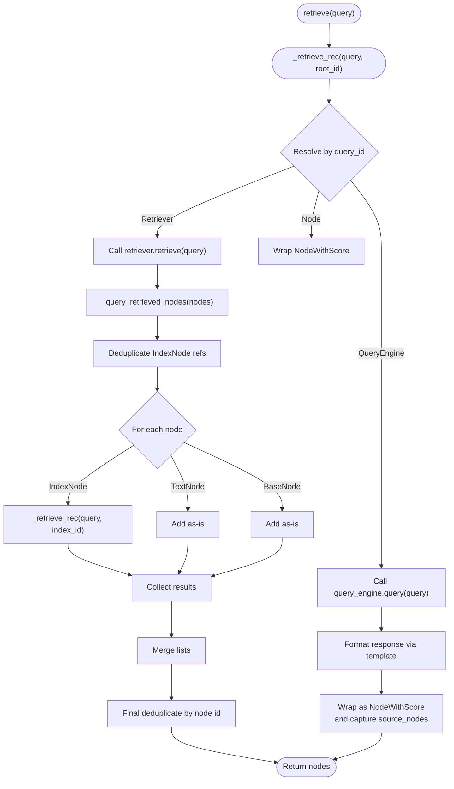
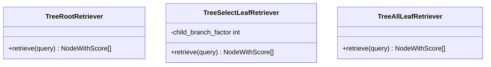
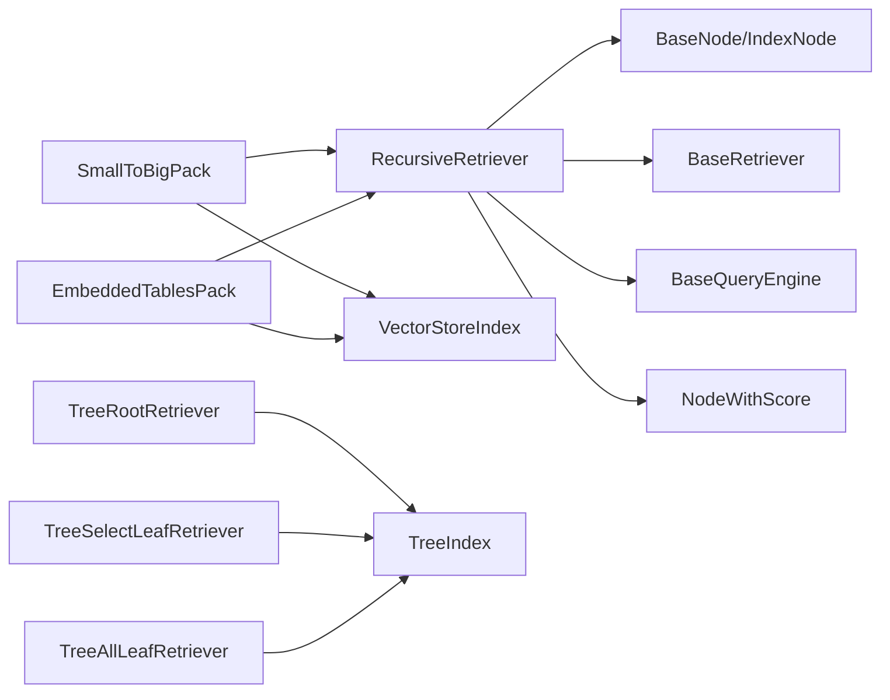

# Recursive Retrievers

<cite>
**Referenced Files in This Document**
- [recursive_retriever.py](file://llama-index-core/llama_index/core/retrievers/recursive_retriever.py)
- [base.py](file://llama-index-packs/llama-index-packs-recursive-retriever/llama_index/packs/recursive_retriever/small_to_big/base.py)
- [base.py](file://llama-index-packs/llama-index-packs-recursive-retriever/llama_index/packs/recursive_retriever/embedded_tables_unstructured/base.py)
- [__init__.py](file://llama-index-packs/llama-index-packs-recursive-retriever/llama_index/packs/recursive_retriever/__init__.py)
- [README.md](file://llama-index-packs/llama-index-packs-recursive-retriever/README.md)
- [recursive.md](file://docs/api_reference/api_reference/retrievers/recursive.md)
- [recursive_retriever_nodes.ipynb](file://docs/examples/retrievers/recursive_retriever_nodes.ipynb)
- [auto_vs_recursive_retriever.ipynb](file://docs/examples/retrievers/auto_vs_recursive_retriever.ipynb)
- [tree_root_retriever.py](file://llama-index-core/llama_index/core/indices/tree/tree_root_retriever.py)
- [select_leaf_retriever.py](file://llama-index-core/llama_index/core/indices/tree/select_leaf_retriever.py)
- [tree.md](file://docs/api_reference/api_reference/retrievers/tree.md)
</cite>

## Table of Contents
1. [Introduction](#introduction)
2. [Project Structure](#project-structure)
3. [Core Components](#core-components)
4. [Architecture Overview](#architecture-overview)
5. [Detailed Component Analysis](#detailed-component-analysis)
6. [Dependency Analysis](#dependency-analysis)
7. [Performance Considerations](#performance-considerations)
8. [Troubleshooting Guide](#troubleshooting-guide)
9. [Conclusion](#conclusion)
10. [Appendices](#appendices)

## Introduction
This document explains recursive retrievers with a focus on hierarchical tree-based retrieval strategies. It covers the core RecursiveRetriever implementation, traversal semantics, and multi-level retrieval patterns. It also documents related tree-based retrievers (TreeSelectLeafRetriever, TreeAllLeafRetriever, TreeRootRetriever) and shows how to configure recursion depth, leaf selection strategies, and pruning techniques. Practical examples demonstrate recursive retrieval for hierarchical documents, knowledge graphs, and nested content organization. Guidance is included for performance optimization, memory management, and debugging recursive retrieval chains.

## Project Structure
The recursive retrieval capability spans the core retriever module and reusable packs that demonstrate end-to-end pipelines:
- Core recursive retriever: a generic mechanism that navigates a graph of retrievers, query engines, and nodes.
- Packs: ready-to-use templates that build hierarchical node graphs and wire recursive retrieval into a query engine.

**Diagram sources**
- [recursive_retriever.py](file://llama-index-core/llama_index/core/retrievers/recursive_retriever.py#L22-L222)
- [base.py](file://llama-index-packs/llama-index-packs-recursive-retriever/llama_index/packs/recursive_retriever/small_to_big/base.py#L15-L88)
- [base.py](file://llama-index-packs/llama-index-packs-recursive-retriever/llama_index/packs/recursive_retriever/embedded_tables_unstructured/base.py#L16-L70)

**Section sources**
- [recursive_retriever.py](file://llama-index-core/llama_index/core/retrievers/recursive_retriever.py#L1-L222)
- [__init__.py](file://llama-index-packs/llama-index-packs-recursive-retriever/llama_index/packs/recursive_retriever/__init__.py#L1-L12)
- [README.md](file://llama-index-packs/llama-index-packs-recursive-retriever/README.md#L1-L132)

## Core Components
- RecursiveRetriever: A generic retriever that follows links from nodes to other retrievers or query engines. It supports deduplication, optional verbose tracing, and returns both primary nodes and additional source nodes from query engines.
- Packs:
  - RecursiveRetrieverSmallToBigPack: Builds a hierarchy of smaller chunks referencing larger parent chunks and wires a recursive retriever backed by a vector index.
  - EmbeddedTablesUnstructuredRetrieverPack: Parses embedded tables from HTML via Unstructured, constructs a node graph, and runs recursive retrieval.

Key capabilities:
- Traversal: When a retrieved node is an IndexNode, the retriever resolves the linked retriever/query engine by id and recurses.
- Node handling: TextNode entries are returned directly; BaseNode entries are wrapped into NodeWithScore.
- Query engine integration: Responses from query engines are formatted into a TextNode using a configurable template and include source_nodes for provenance.

**Section sources**
- [recursive_retriever.py](file://llama-index-core/llama_index/core/retrievers/recursive_retriever.py#L22-L222)
- [base.py](file://llama-index-packs/llama-index-packs-recursive-retriever/llama_index/packs/recursive_retriever/small_to_big/base.py#L15-L88)
- [base.py](file://llama-index-packs/llama-index-packs-recursive-retriever/llama_index/packs/recursive_retriever/embedded_tables_unstructured/base.py#L16-L70)

## Architecture Overview
The recursive retrieval architecture centers on a directed graph of retrievers, query engines, and nodes. The root node identifies the starting point; IndexNode entries link to downstream components. The retriever resolves the target, recurses when needed, and aggregates results.

**Diagram sources**
- [recursive_retriever.py](file://llama-index-core/llama_index/core/retrievers/recursive_retriever.py#L158-L206)

## Detailed Component Analysis

### RecursiveRetriever
- Initialization parameters:
  - root_id: The starting query id.
  - retriever_dict: Mapping of ids to BaseRetriever instances.
  - query_engine_dict: Mapping of ids to BaseQueryEngine instances.
  - node_dict: Mapping of ids to BaseNode instances.
  - query_response_tmpl: Template to format query + response into a TextNode when invoking a query engine.
  - verbose: Enables debug prints during traversal.
- Deduplication:
  - Nodes are deduplicated by node id; when multiple IndexNode entries reference the same index_id, only the first occurrence is kept.
- Traversal:
  - For each retrieved node:
    - If IndexNode: recurse using the linked index_id.
    - If TextNode: include directly.
    - If BaseNode: include directly.
  - After recursion, deduplicate aggregated results.
- Additional sources:
  - retrieve_all returns both primary nodes and additional source nodes captured from query engine responses.

**Diagram sources**
- [recursive_retriever.py](file://llama-index-core/llama_index/core/retrievers/recursive_retriever.py#L68-L140)
- [recursive_retriever.py](file://llama-index-core/llama_index/core/retrievers/recursive_retriever.py#L158-L206)

**Section sources**
- [recursive_retriever.py](file://llama-index-core/llama_index/core/retrievers/recursive_retriever.py#L22-L222)

### Packs: Small-to-Big and Embedded Tables
- Small-to-Big Pack:
  - Builds a hierarchy by splitting base nodes into smaller chunks and linking each child back to its parent via IndexNode.
  - Wires a vector index over all nodes and a recursive retriever rooted at the vector retriever id.
  - Provides a query engine wrapping the recursive retriever.
- Embedded Tables Unstructured Pack:
  - Loads an HTML document, parses elements (including embedded tables), and constructs a node graph.
  - Builds a top-level vector index and a recursive retriever that maps node ids to base nodes for traversal.

These packs illustrate how to construct hierarchical graphs and plug them into recursive retrieval.

**Section sources**
- [base.py](file://llama-index-packs/llama-index-packs-recursive-retriever/llama_index/packs/recursive_retriever/small_to_big/base.py#L15-L88)
- [base.py](file://llama-index-packs/llama-index-packs-recursive-retriever/llama_index/packs/recursive_retriever/embedded_tables_unstructured/base.py#L16-L70)
- [README.md](file://llama-index-packs/llama-index-packs-recursive-retriever/README.md#L1-L132)

### Tree-Based Retrievers (TreeSelectLeafRetriever, TreeAllLeafRetriever, TreeRootRetriever)
While not recursive in the same graph-link sense, these tree retrievers operate over tree-structured indices and offer complementary hierarchical retrieval strategies:
- TreeRootRetriever: Retrieves answers directly from root nodes without descending the tree.
- TreeSelectLeafRetriever: Traverses the tree to select a single leaf node per level that best answers the query.
- TreeAllLeafRetriever: Retrieves all leaves under the current subtree.

These are useful when your index itself is a tree and you want to leverage tree structure for retrieval.

**Diagram sources**
- [tree_root_retriever.py](file://llama-index-core/llama_index/core/indices/tree/tree_root_retriever.py#L16-L42)
- [select_leaf_retriever.py](file://llama-index-core/llama_index/core/indices/tree/select_leaf_retriever.py#L56-L71)

**Section sources**
- [tree_root_retriever.py](file://llama-index-core/llama_index/core/indices/tree/tree_root_retriever.py#L16-L42)
- [select_leaf_retriever.py](file://llama-index-core/llama_index/core/indices/tree/select_leaf_retriever.py#L56-L71)
- [tree.md](file://docs/api_reference/api_reference/retrievers/tree.md#L1-L4)

## Dependency Analysis
- RecursiveRetriever depends on:
  - BaseRetriever and BaseQueryEngine abstractions.
  - IndexNode for linking to downstream components.
  - NodeWithScore for scored results.
- Packs depend on:
  - VectorStoreIndex and as_retriever/as_query_engine to expose retrievers and query engines.
  - Node parsers to construct hierarchical graphs.
- Tree-based retrievers depend on TreeIndex and internal node structures.

**Diagram sources**
- [recursive_retriever.py](file://llama-index-core/llama_index/core/retrievers/recursive_retriever.py#L3-L14)
- [base.py](file://llama-index-packs/llama-index-packs-recursive-retriever/llama_index/packs/recursive_retriever/small_to_big/base.py#L5-L12)
- [base.py](file://llama-index-packs/llama-index-packs-recursive-retriever/llama_index/packs/recursive_retriever/embedded_tables_unstructured/base.py#L8-L12)
- [tree_root_retriever.py](file://llama-index-core/llama_index/core/indices/tree/tree_root_retriever.py#L6-L11)
- [select_leaf_retriever.py](file://llama-index-core/llama_index/core/indices/tree/select_leaf_retriever.py#L6-L11)

**Section sources**
- [recursive_retriever.py](file://llama-index-core/llama_index/core/retrievers/recursive_retriever.py#L1-L222)
- [base.py](file://llama-index-packs/llama-index-packs-recursive-retriever/llama_index/packs/recursive_retriever/small_to_big/base.py#L1-L88)
- [base.py](file://llama-index-packs/llama-index-packs-recursive-retriever/llama_index/packs/recursive_retriever/embedded_tables_unstructured/base.py#L1-L70)

## Performance Considerations
- Recursion depth:
  - Controlled implicitly by the graph structure and the number of IndexNode links. There is no explicit depth limit in the core implementation; manage depth by controlling the graph hierarchy.
- Deduplication:
  - The retriever deduplicates by node id and by index_id to avoid redundant traversal of the same linked component.
- Top-k and similarity:
  - Configure similarity_top_k on underlying retrievers to bound the fan-out at each step.
- Memory:
  - Large hierarchical graphs increase memory usage. Consider pruning unnecessary intermediate nodes and limiting child_branch_factor in tree retrievers.
- Query engine formatting:
  - Formatting query + response into a TextNode adds overhead; tune query_response_tmpl to balance verbosity and usefulness.

[No sources needed since this section provides general guidance]

## Troubleshooting Guide
Common issues and remedies:
- Root id missing:
  - Ensure root_id exists in retriever_dict; otherwise, initialization raises an error.
- Overlapping ids:
  - retriever_dict and query_engine_dict keys must not overlap; otherwise, initialization fails.
- Missing query id resolution:
  - If a node references an index_id not present in node_dict, retriever_dict, or query_engine_dict, resolution fails with an error.
- Verbose tracing:
  - Enable verbose to observe traversal logs and understand which components are being invoked.
- Debugging recursive chains:
  - Use callback_manager events during retriever invocation to capture node payloads and inspect traversal behavior.

**Section sources**
- [recursive_retriever.py](file://llama-index-core/llama_index/core/retrievers/recursive_retriever.py#L52-L66)
- [recursive_retriever.py](file://llama-index-core/llama_index/core/retrievers/recursive_retriever.py#L153-L156)
- [recursive_retriever.py](file://llama-index-core/llama_index/core/retrievers/recursive_retriever.py#L177-L183)

## Conclusion
RecursiveRetriever provides a flexible mechanism to traverse hierarchical graphs composed of retrievers, query engines, and nodes. By structuring content into parent-child relationships and linking them via IndexNode, you can implement multi-level retrieval that progressively enriches context. Complementary tree-based retrievers (TreeRootRetriever, TreeSelectLeafRetriever, TreeAllLeafRetriever) offer structured index traversal strategies. With careful configuration of recursion depth, leaf selection, and pruning, recursive retrieval scales to complex hierarchical domains such as documents, knowledge graphs, and nested content.

[No sources needed since this section summarizes without analyzing specific files]

## Appendices

### Practical Examples and Use Cases
- Node references and chunk hierarchies:
  - Demonstrates building a graph of smaller chunks referencing larger parent chunks and retrieving enriched context via recursive traversal.
- Auto-retrieval vs. recursive retrieval:
  - Compares metadata-filtered auto-retrieval with a hierarchical recursive approach that first retrieves summaries and then raw chunks.
- Embedded tables with Unstructured:
  - Shows parsing embedded tables from HTML, constructing a node graph, and running recursive retrieval.

**Section sources**
- [recursive_retriever_nodes.ipynb](file://docs/examples/retrievers/recursive_retriever_nodes.ipynb#L1-L1167)
- [auto_vs_recursive_retriever.ipynb](file://docs/examples/retrievers/auto_vs_recursive_retriever.ipynb#L1-L921)
- [README.md](file://llama-index-packs/llama-index-packs-recursive-retriever/README.md#L1-L132)

### API Reference
- RecursiveRetriever: See the retriever API reference.
- Tree-based retrievers: See the tree retriever API reference.

**Section sources**
- [recursive.md](file://docs/api_reference/api_reference/retrievers/recursive.md#L1-L4)
- [tree.md](file://docs/api_reference/api_reference/retrievers/tree.md#L1-L4)