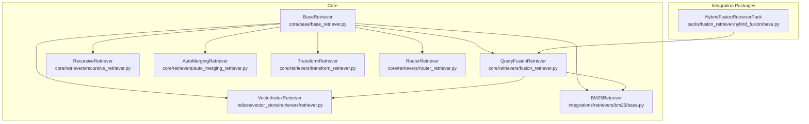
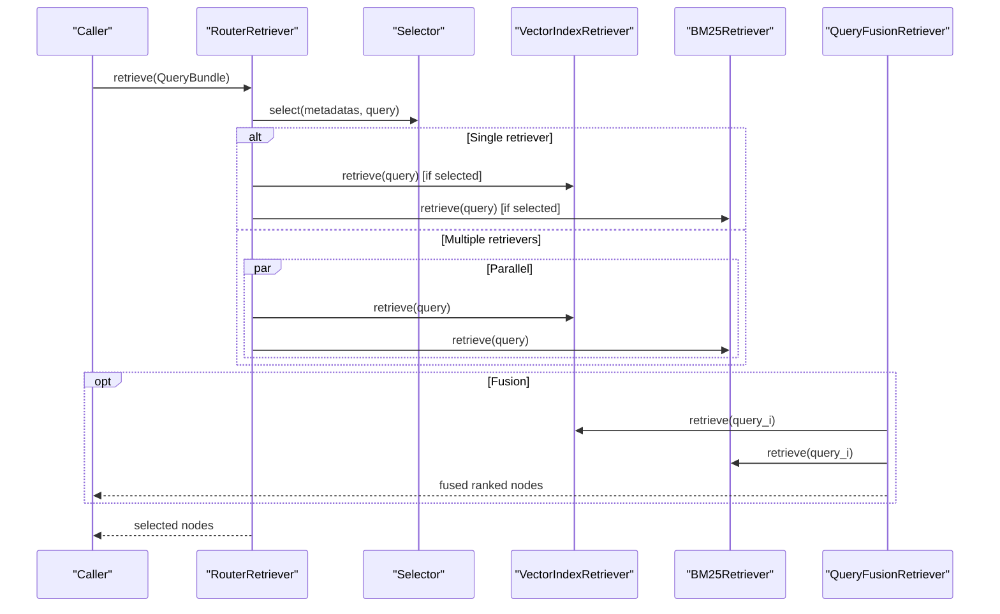
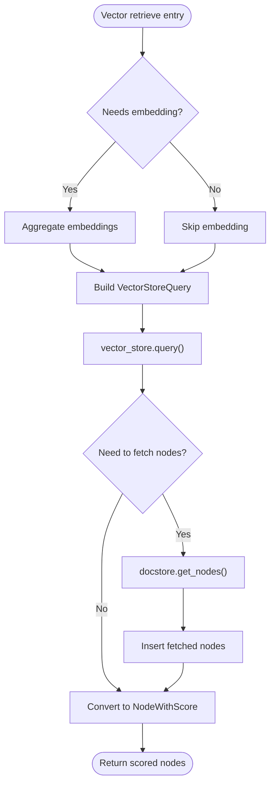
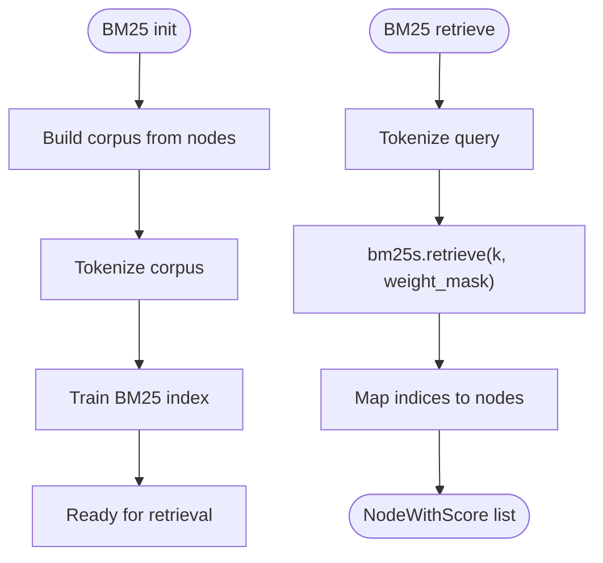
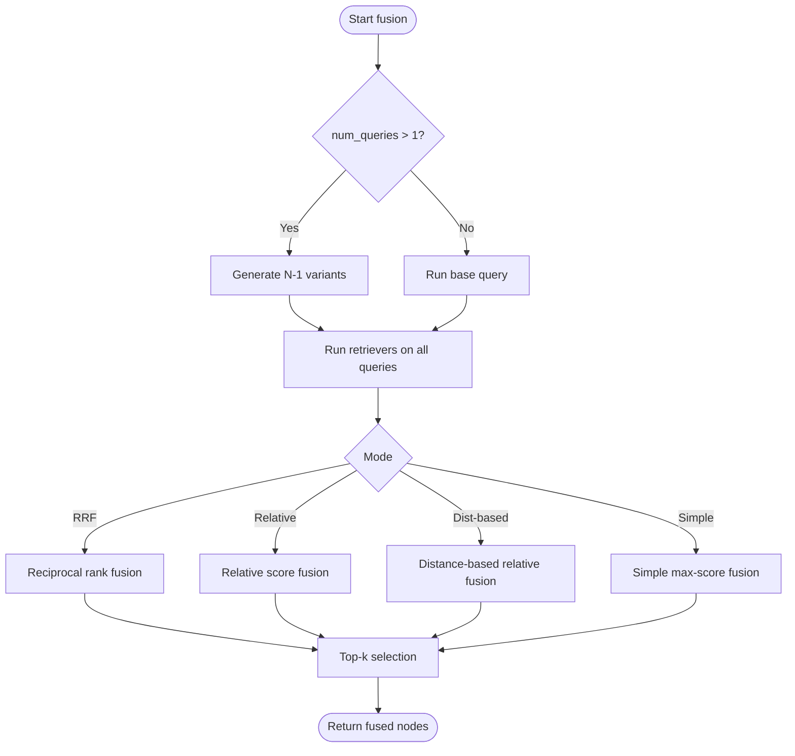
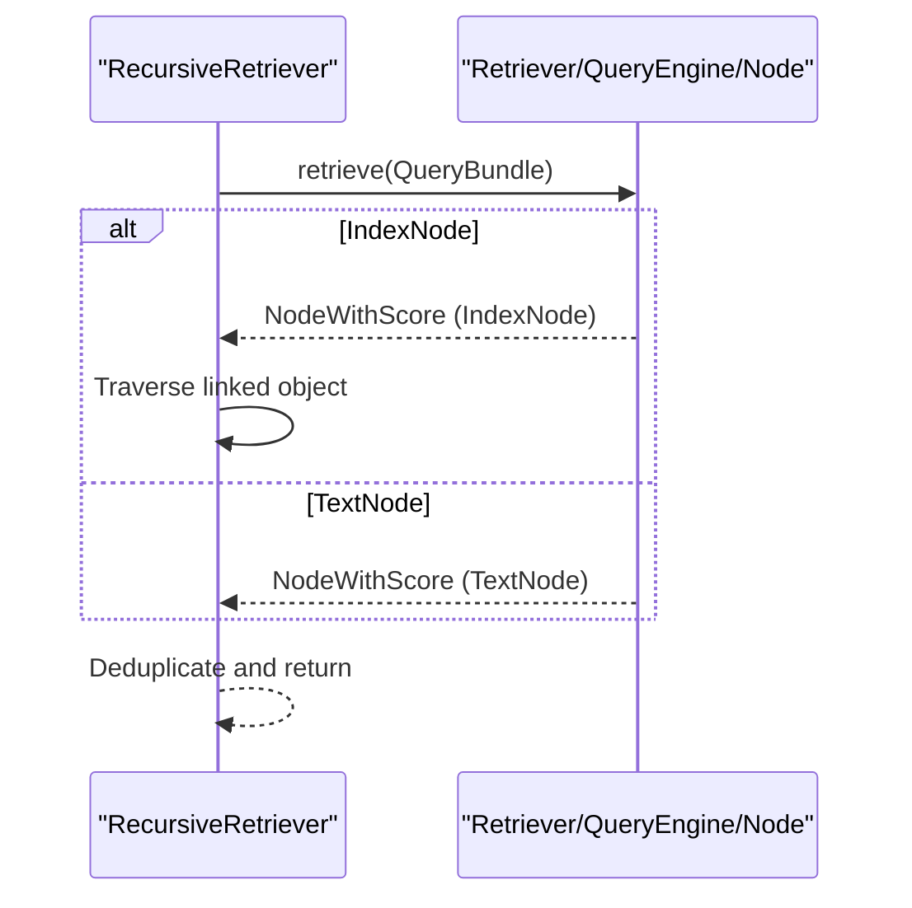
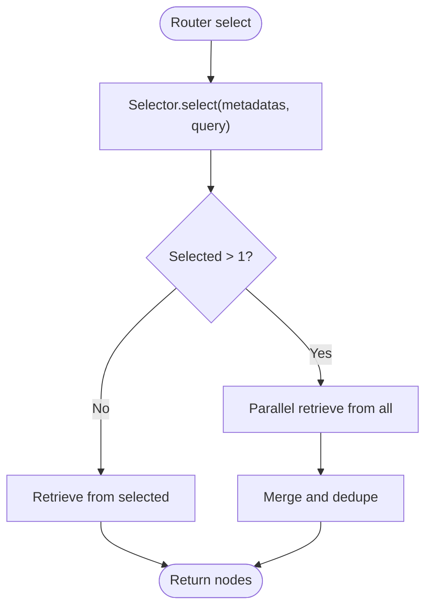
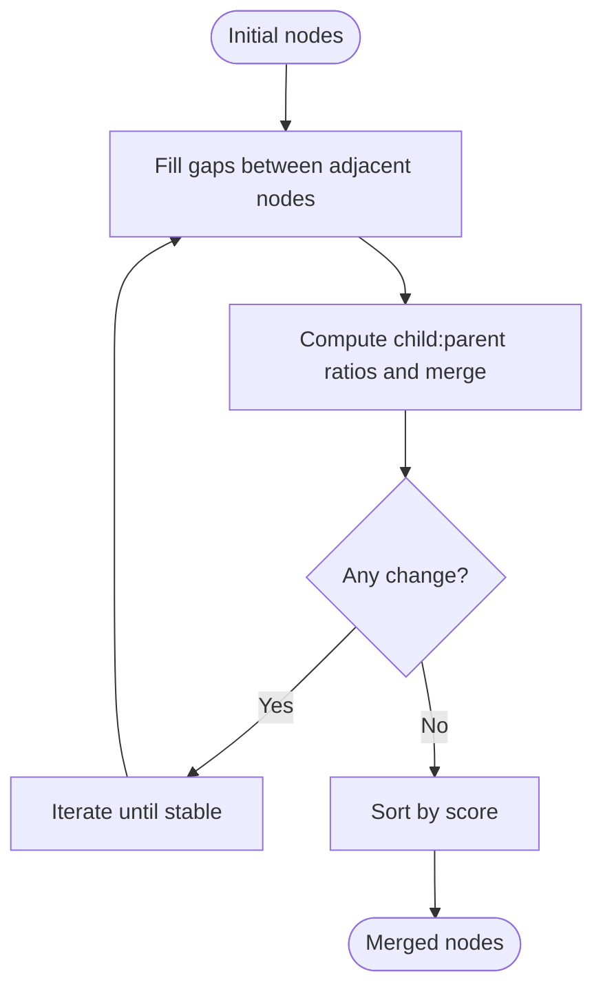
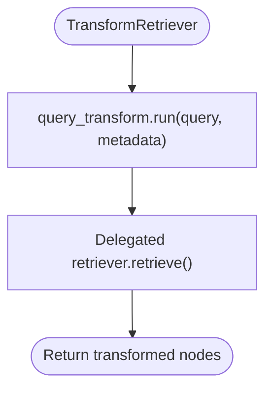
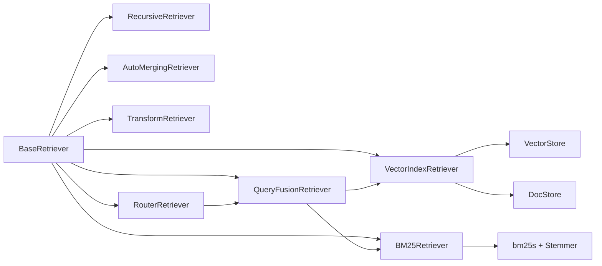

# Retrieval Engines

<cite>
**Referenced Files in This Document**
- [base_retriever.py](file://llama-index-core/llama_index/core/base/base_retriever.py)
- [router_retriever.py](file://llama-index-core/llama_index/core/retrievers/router_retriever.py)
- [fusion_retriever.py](file://llama-index-core/llama_index/core/retrievers/fusion_retriever.py)
- [auto_merging_retriever.py](file://llama-index-core/llama_index/core/retrievers/auto_merging_retriever.py)
- [recursive_retriever.py](file://llama-index-core/llama_index/core/retrievers/recursive_retriever.py)
- [transform_retriever.py](file://llama-index-core/llama_index/core/retrievers/transform_retriever.py)
- [vector_index_retriever.py](file://llama-index-core/llama_index/core/indices/vector_store/retrievers/retriever.py)
- [bm25_retriever.py](file://llama-index-integrations/retrievers/llama-index-retrievers-bm25/llama_index/retrievers/bm25/base.py)
- [retrievers_init.py](file://llama-index-core/llama_index/core/retrievers/__init__.py)
- [vector_retrievers_init.py](file://llama-index-core/llama_index/core/indices/vector_store/retrievers/__init__.py)
- [relative_score_dist_fusion.ipynb](file://docs/examples/retrievers/relative_score_dist_fusion.ipynb)
- [fusion_retriever_notebook.py](file://docs/examples/low_level/fusion_retriever.ipynb)
- [hybrid_fusion_pack_base.py](file://llama-index-packs/llama-index-packs-fusion-retriever/llama_index/packs/fusion_retriever/hybrid_fusion/base.py)
- [composite_retriever.py](file://llama-index-integrations/indices/llama-index-indices-managed-llama-cloud/llama_index/indices/managed/llama_cloud/composite_retriever.py)
</cite>

## Table of Contents
1. [Introduction](#introduction)
2. [Project Structure](#project-structure)
3. [Core Components](#core-components)
4. [Architecture Overview](#architecture-overview)
5. [Detailed Component Analysis](#detailed-component-analysis)
6. [Dependency Analysis](#dependency-analysis)
7. [Performance Considerations](#performance-considerations)
8. [Troubleshooting Guide](#troubleshooting-guide)
9. [Conclusion](#conclusion)
10. [Appendices](#appendices)

## Introduction
This document explains LlamaIndex’s Retrieval Engines with a focus on vector retrievers, BM25 retrievers, hybrid fusion, recursive retrieval, and router-based selection. It also covers advanced techniques such as auto-merging, query transformation, and composition with managed retrieval services. Practical guidance is provided for combining multiple strategies, tuning parameters, optimizing performance, and evaluating retrieval quality.

## Project Structure
Retrieval engines are implemented across core retrievers, vector store retrievers, and integration packages. The core BaseRetriever defines the interface and shared behavior, while specialized retrievers implement vector, BM25, fusion, recursive, router, transform, and auto-merging strategies. Integration packages add BM25 support and managed retrieval capabilities.

**Diagram sources**
- [base_retriever.py](file://llama-index-core/llama_index/core/base/base_retriever.py#L34-L275)
- [vector_index_retriever.py](file://llama-index-core/llama_index/core/indices/vector_store/retrievers/retriever.py#L24-L268)
- [bm25_retriever.py](file://llama-index-integrations/retrievers/llama-index-retrievers-bm25/llama_index/retrievers/bm25/base.py#L41-L254)
- [fusion_retriever.py](file://llama-index-core/llama_index/core/retrievers/fusion_retriever.py#L33-L305)
- [recursive_retriever.py](file://llama-index-core/llama_index/core/retrievers/recursive_retriever.py#L22-L222)
- [auto_merging_retriever.py](file://llama-index-core/llama_index/core/retrievers/auto_merging_retriever.py#L26-L195)
- [transform_retriever.py](file://llama-index-core/llama_index/core/retrievers/transform_retriever.py#L10-L45)
- [router_retriever.py](file://llama-index-core/llama_index/core/retrievers/router_retriever.py#L20-L143)
- [hybrid_fusion_pack_base.py](file://llama-index-packs/llama-index-packs-fusion-retriever/llama_index/packs/fusion_retriever/hybrid_fusion/base.py#L15-L88)

**Section sources**
- [retrievers_init.py](file://llama-index-core/llama_index/core/retrievers/__init__.py#L1-L89)
- [vector_retrievers_init.py](file://llama-index-core/llama_index/core/indices/vector_store/retrievers/__init__.py#L1-L12)

## Core Components
- BaseRetriever: Defines the retrieval lifecycle, async/sync retrieval, recursion handling, and instrumentation hooks.
- VectorIndexRetriever: Executes vector similarity search against a vector store, supports hybrid modes and metadata filtering.
- BM25Retriever: Implements lexical term-based retrieval using BM25 with stemming, tokenization, and optional corpus filters.
- QueryFusionRetriever: Combines multiple retrievers via fusion strategies (reciprocal rank, relative score, distance-based, simple).
- RecursiveRetriever: Traverses linked retrievers/query engines from IndexNode references.
- AutoMergingRetriever: Merges retrieved chunks into parent nodes and fills gaps to improve context coherence.
- TransformRetriever: Applies a query transformation prior to delegating to another retriever.
- RouterRetriever: Selects among multiple retrievers based on selector logic (LLM-driven or otherwise).

**Section sources**
- [base_retriever.py](file://llama-index-core/llama_index/core/base/base_retriever.py#L34-L275)
- [vector_index_retriever.py](file://llama-index-core/llama_index/core/indices/vector_store/retrievers/retriever.py#L24-L268)
- [bm25_retriever.py](file://llama-index-integrations/retrievers/llama-index-retrievers-bm25/llama_index/retrievers/bm25/base.py#L41-L254)
- [fusion_retriever.py](file://llama-index-core/llama_index/core/retrievers/fusion_retriever.py#L33-L305)
- [recursive_retriever.py](file://llama-index-core/llama_index/core/retrievers/recursive_retriever.py#L22-L222)
- [auto_merging_retriever.py](file://llama-index-core/llama_index/core/retrievers/auto_merging_retriever.py#L26-L195)
- [transform_retriever.py](file://llama-index-core/llama_index/core/retrievers/transform_retriever.py#L10-L45)
- [router_retriever.py](file://llama-index-core/llama_index/core/retrievers/router_retriever.py#L20-L143)

## Architecture Overview
The retrieval stack builds on BaseRetriever and composes specialized strategies. Vector and BM25 retrievers are commonly combined via fusion or router-based selection. Advanced patterns include recursive traversal, auto-merging, and query transformation.

**Diagram sources**
- [router_retriever.py](file://llama-index-core/llama_index/core/retrievers/router_retriever.py#L78-L142)
- [vector_index_retriever.py](file://llama-index-core/llama_index/core/indices/vector_store/retrievers/retriever.py#L104-L128)
- [bm25_retriever.py](file://llama-index-integrations/retrievers/llama-index-retrievers-bm25/llama_index/retrievers/bm25/base.py#L222-L253)
- [fusion_retriever.py](file://llama-index-core/llama_index/core/retrievers/fusion_retriever.py#L263-L304)

## Detailed Component Analysis

### Vector Retrievers
VectorIndexRetriever executes similarity searches against a vector store. It supports:
- Query modes: dense similarity, sparse, hybrid, text search
- Filters and metadata constraints
- Embedding aggregation for query strings
- Fetching missing node content from the docstore when the vector store does not store text

Key behaviors:
- Determines whether embeddings are needed based on query mode and vector store capabilities.
- Builds a VectorStoreQuery with top_k, filters, and optional sparse/hybrid parameters.
- Converts raw results to NodeWithScore and attaches similarity scores.

**Diagram sources**
- [vector_index_retriever.py](file://llama-index-core/llama_index/core/indices/vector_store/retrievers/retriever.py#L104-L246)

**Section sources**
- [vector_index_retriever.py](file://llama-index-core/llama_index/core/indices/vector_store/retrievers/retriever.py#L24-L268)

### BM25 Retrievers
BM25Retriever performs lexical retrieval using BM25 scoring:
- Tokenization with optional stemming and stopword removal
- Indexing corpus tokens and retrieving top-k matches per query
- Optional metadata filters to restrict corpus weight mask
- Persistence and loading from disk

**Diagram sources**
- [bm25_retriever.py](file://llama-index-integrations/retrievers/llama-index-retrievers-bm25/llama_index/retrievers/bm25/base.py#L99-L147)
- [bm25_retriever.py](file://llama-index-integrations/retrievers/llama-index-retrievers-bm25/llama_index/retrievers/bm25/base.py#L222-L253)

**Section sources**
- [bm25_retriever.py](file://llama-index-integrations/retrievers/llama-index-retrievers-bm25/llama_index/retrievers/bm25/base.py#L41-L254)

### Hybrid Fusion Techniques
QueryFusionRetriever combines multiple retrievers using configurable fusion modes:
- Reciprocal Rank Fusion (RRF)
- Relative Score Fusion (MinMax scaled, optionally distance-based)
- Simple fusion (max score per node across retrievers)
- Query generation for multi-query fusion

**Diagram sources**
- [fusion_retriever.py](file://llama-index-core/llama_index/core/retrievers/fusion_retriever.py#L83-L98)
- [fusion_retriever.py](file://llama-index-core/llama_index/core/retrievers/fusion_retriever.py#L100-L198)
- [fusion_retriever.py](file://llama-index-core/llama_index/core/retrievers/fusion_retriever.py#L263-L304)

**Section sources**
- [fusion_retriever.py](file://llama-index-core/llama_index/core/retrievers/fusion_retriever.py#L33-L305)
- [relative_score_dist_fusion.ipynb](file://docs/examples/retrievers/relative_score_dist_fusion.ipynb#L128-L168)
- [fusion_retriever_notebook.py](file://docs/examples/low_level/fusion_retriever.ipynb#L333-L388)
- [hybrid_fusion_pack_base.py](file://llama-index-packs/llama-index-packs-fusion-retriever/llama_index/packs/fusion_retriever/hybrid_fusion/base.py#L15-L88)

### Recursive Retrieval
RecursiveRetriever traverses IndexNode references to linked retrievers or query engines, collecting and deduplicating results. It supports:
- Root selection and traversal
- Deduplication by node id
- Optional template formatting of query/engine responses

**Diagram sources**
- [recursive_retriever.py](file://llama-index-core/llama_index/core/retrievers/recursive_retriever.py#L158-L206)

**Section sources**
- [recursive_retriever.py](file://llama-index-core/llama_index/core/retrievers/recursive_retriever.py#L22-L222)

### Router Retrievers
RouterRetriever selects one or multiple candidate retrievers based on a selector and query. It:
- Wraps candidates as RetrieverTool with metadata
- Uses a selector (optionally LLM-powered) to pick retrievers
- Supports single or multi-selection with parallel execution

**Diagram sources**
- [router_retriever.py](file://llama-index-core/llama_index/core/retrievers/router_retriever.py#L78-L142)

**Section sources**
- [router_retriever.py](file://llama-index-core/llama_index/core/retrievers/router_retriever.py#L20-L143)

### Auto-Merging Retrievers
AutoMergingRetriever improves context coherence by:
- Merging overlapping child nodes into parent nodes when a threshold is met
- Filling gaps between adjacent nodes
- Iteratively applying merging until no further changes

**Diagram sources**
- [auto_merging_retriever.py](file://llama-index-core/llama_index/core/retrievers/auto_merging_retriever.py#L166-L194)

**Section sources**
- [auto_merging_retriever.py](file://llama-index-core/llama_index/core/retrievers/auto_merging_retriever.py#L26-L195)

### Transform Retrievers
TransformRetriever applies a query transformation before delegating to another retriever. Useful for query rewriting, expansion, or normalization.

**Diagram sources**
- [transform_retriever.py](file://llama-index-core/llama_index/core/retrievers/transform_retriever.py#L40-L44)

**Section sources**
- [transform_retriever.py](file://llama-index-core/llama_index/core/retrievers/transform_retriever.py#L10-L45)

### Custom Retrievers and Composition
- Implement BaseRetriever to define custom retrieval logic.
- Compose strategies using RouterRetriever for selector-driven routing.
- Combine vector and BM25 via QueryFusionRetriever or packs like HybridFusionRetrieverPack.
- Wrap external retrievers as tools for RouterRetriever.

**Section sources**
- [base_retriever.py](file://llama-index-core/llama_index/core/base/base_retriever.py#L34-L275)
- [router_retriever.py](file://llama-index-core/llama_index/core/retrievers/router_retriever.py#L20-L143)
- [fusion_retriever.py](file://llama-index-core/llama_index/core/retrievers/fusion_retriever.py#L33-L305)
- [hybrid_fusion_pack_base.py](file://llama-index-packs/llama-index-packs-fusion-retriever/llama_index/packs/fusion_retriever/hybrid_fusion/base.py#L15-L88)

## Dependency Analysis
Retrievers depend on:
- BaseRetriever for lifecycle and instrumentation
- VectorIndexRetriever depends on VectorStoreIndex and docstore for node fetching
- BM25Retriever depends on bm25s and PyStemmer
- Fusion relies on multiple retrievers and optional LLM for query generation
- Router depends on selector and retriever tools
- AutoMerging depends on storage context and node relationships

**Diagram sources**
- [base_retriever.py](file://llama-index-core/llama_index/core/base/base_retriever.py#L34-L275)
- [vector_index_retriever.py](file://llama-index-core/llama_index/core/indices/vector_store/retrievers/retriever.py#L24-L268)
- [bm25_retriever.py](file://llama-index-integrations/retrievers/llama-index-retrievers-bm25/llama_index/retrievers/bm25/base.py#L41-L254)
- [fusion_retriever.py](file://llama-index-core/llama_index/core/retrievers/fusion_retriever.py#L33-L305)
- [router_retriever.py](file://llama-index-core/llama_index/core/retrievers/router_retriever.py#L20-L143)
- [auto_merging_retriever.py](file://llama-index-core/llama_index/core/retrievers/auto_merging_retriever.py#L26-L195)
- [transform_retriever.py](file://llama-index-core/llama_index/core/retrievers/transform_retriever.py#L10-L45)

**Section sources**
- [retrievers_init.py](file://llama-index-core/llama_index/core/retrievers/__init__.py#L1-L89)
- [vector_retrievers_init.py](file://llama-index-core/llama_index/core/indices/vector_store/retrievers/__init__.py#L1-L12)

## Performance Considerations
- Vector retrieval
  - Prefer TEXT_SEARCH or SPARSE modes when embeddings are not needed to avoid unnecessary computation.
  - Tune similarity_top_k and hybrid parameters (alpha, sparse_top_k, hybrid_top_k) to balance recall and latency.
  - Use docstore fetch minimization by leveraging vector stores that store text.
- BM25 retrieval
  - Adjust tokenization and stemming for domain-specific languages.
  - Use metadata filters to narrow corpus and reduce scoring overhead.
- Fusion
  - Reciprocal Rank Fusion typically benefits from a moderate k (default 60) and balanced retriever weights.
  - Relative score fusion scales per-retriever scores; consider distance-based scaling for skewed distributions.
  - Limit num_queries to control latency; use async execution where supported.
- Recursive and Router
  - Parallelize retriever execution when selecting multiple candidates.
  - Deduplicate aggressively to avoid redundant work.
- Auto-merging
  - Tune simple_ratio_thresh to balance granularity and coherence.
  - Log merges for debugging and performance analysis.

[No sources needed since this section provides general guidance]

## Troubleshooting Guide
- No nodes returned
  - Verify BM25 corpus size and similarity_top_k relationship; BM25 requires k ≤ number of indexed nodes.
  - Check vector store query modes and embedding availability.
- Poor recall
  - Increase similarity_top_k or hybrid_top_k.
  - Enable sparse or hybrid modes for vector stores supporting them.
- Slow retrieval
  - Switch to TEXT_SEARCH or SPARSE when appropriate.
  - Reduce num_queries in fusion; disable verbose logging.
  - Use metadata filters to constrain BM25 corpus.
- Incorrect ordering
  - Normalize scores (relative score fusion) or adjust retriever weights.
  - Consider distance-based scaling for heterogeneous score distributions.
- Recursive traversal issues
  - Ensure IndexNode references are valid and reachable.
  - Confirm deduplication logic does not drop relevant nodes.
- Router selection errors
  - Validate selector metadata and ensure retriever tools are properly wrapped.
  - Confirm root_id exists in retriever dictionaries.

**Section sources**
- [bm25_retriever.py](file://llama-index-integrations/retrievers/llama-index-retrievers-bm25/llama_index/retrievers/bm25/base.py#L114-L127)
- [vector_index_retriever.py](file://llama-index-core/llama_index/core/indices/vector_store/retrievers/retriever.py#L92-L101)
- [fusion_retriever.py](file://llama-index-core/llama_index/core/retrievers/fusion_retriever.py#L137-L198)
- [recursive_retriever.py](file://llama-index-core/llama_index/core/retrievers/recursive_retriever.py#L68-L82)
- [router_retriever.py](file://llama-index-core/llama_index/core/retrievers/router_retriever.py#L85-L102)

## Conclusion
LlamaIndex offers a flexible, extensible retrieval toolkit. Vector and BM25 retrievers form the backbone, while fusion, recursion, routing, transformation, and auto-merging enable sophisticated retrieval pipelines. By tuning parameters, composing strategies, and leveraging managed retrieval services, teams can achieve robust and efficient retrieval systems tailored to their domains.

[No sources needed since this section summarizes without analyzing specific files]

## Appendices

### Practical Examples and Patterns
- Combining vector and BM25 with fusion
  - Use QueryFusionRetriever with reciprocal rank or relative score fusion.
  - Reference notebooks demonstrate BM25 and fusion usage.
- Implementing custom retrievers
  - Subclass BaseRetriever and implement _retrieve/_aretrieve.
- Tuning retrieval parameters
  - Adjust similarity_top_k, alpha, sparse_top_k, hybrid_top_k, num_queries, and retriever weights.
- Query transformation
  - Wrap any retriever with TransformRetriever to preprocess queries.
- Managed retrieval composition
  - Use managed composite retrievers to orchestrate pipelines and reranking.

**Section sources**
- [relative_score_dist_fusion.ipynb](file://docs/examples/retrievers/relative_score_dist_fusion.ipynb#L128-L168)
- [fusion_retriever_notebook.py](file://docs/examples/low_level/fusion_retriever.ipynb#L333-L388)
- [hybrid_fusion_pack_base.py](file://llama-index-packs/llama-index-packs-fusion-retriever/llama_index/packs/fusion_retriever/hybrid_fusion/base.py#L15-L88)
- [composite_retriever.py](file://llama-index-integrations/indices/llama-index-indices-managed-llama-cloud/llama_index/indices/managed/llama_cloud/composite_retriever.py#L73-L297)