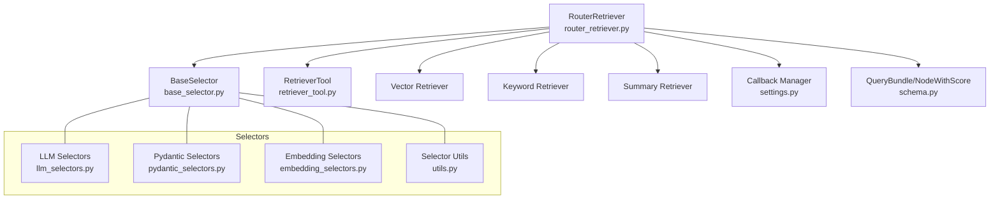
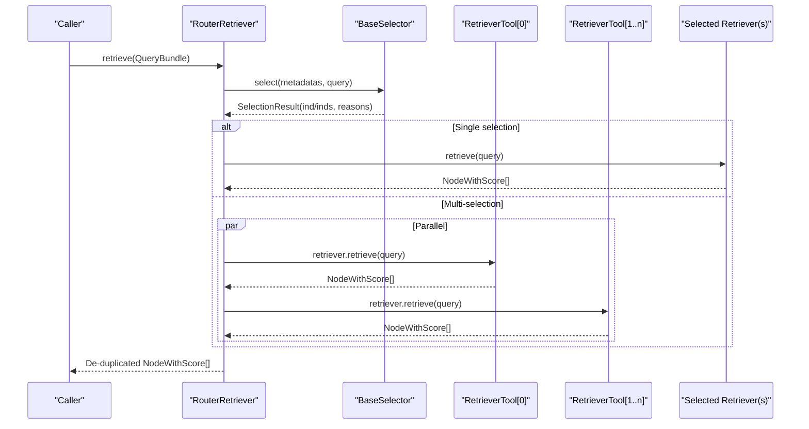
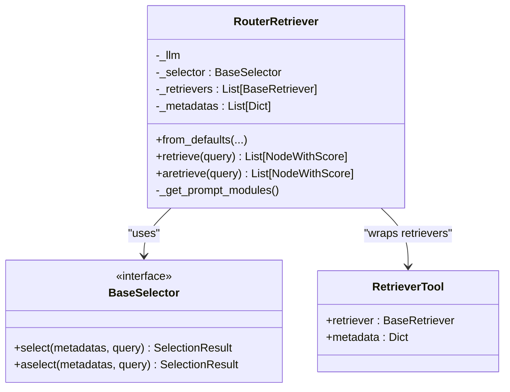
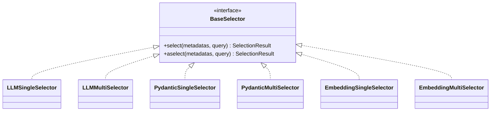
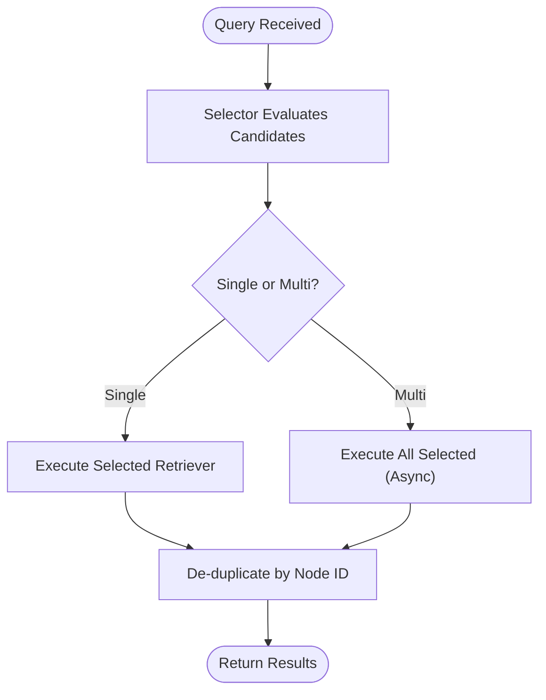
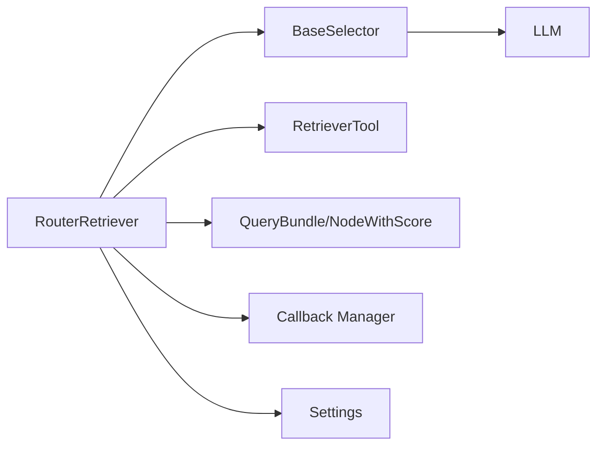

# Router Retrievers

<cite>
**Referenced Files in This Document**
- [router_retriever.py](file://llama-index-core/llama_index/core/retrievers/router_retriever.py)
- [router.md](file://docs/api_reference/api_reference/retrievers/router.md)
- [router_retriever.ipynb](file://docs/examples/retrievers/router_retriever.ipynb)
- [router.md](file://docs/api_reference/api_reference/query_engine/router.md)
- [retriever_router.md](file://docs/api_reference/api_reference/query_engine/retriever_router.md)
- [base_selector.py](file://llama-index-core/llama_index/core/base/base_selector.py)
- [llm_selectors.py](file://llama-index-core/llama_index/core/selectors/llm_selectors.py)
- [pydantic_selectors.py](file://llama-index-core/llama_index/core/selectors/pydantic_selectors.py)
- [embedding_selectors.py](file://llama-index-core/llama_index/core/selectors/embedding_selectors.py)
- [utils.py](file://llama-index-core/llama_index/core/selectors/utils.py)
- [router_query_engine.py](file://llama-index-core/llama_index/core/query_engine/router_query_engine.py)
- [retriever_tool.py](file://llama-index-core/llama_index/core/tools/retriever_tool.py)
- [schema.py](file://llama-index-core/llama_index/core/schema.py)
- [settings.py](file://llama-index-core/llama_index/core/settings.py)
</cite>

## Table of Contents
1. [Introduction](#introduction)
2. [Project Structure](#project-structure)
3. [Core Components](#core-components)
4. [Architecture Overview](#architecture-overview)
5. [Detailed Component Analysis](#detailed-component-analysis)
6. [Dependency Analysis](#dependency-analysis)
7. [Performance Considerations](#performance-considerations)
8. [Troubleshooting Guide](#troubleshooting-guide)
9. [Conclusion](#conclusion)
10. [Appendices](#appendices)

## Introduction
This document explains router retrievers: how they intelligently route queries to the most suitable retrievers, how query classification and strategy selection work, and how to configure and optimize routing for real-world applications. It covers:
- RouterRetriever implementation and control flow
- Query classification and strategy selection via selectors
- Automatic selection among single or multiple retrievers
- Configuration of routing strategies, confidence thresholds, and fallbacks
- Practical examples of multi-strategy routing and dynamic retriever selection
- Advanced topics: query transformation for routing, custom routing logic, and monitoring router performance

## Project Structure
Router retrievers live in the core retrievers module and integrate with selector modules and tools. The primary runtime is RouterRetriever, which delegates selection to a BaseSelector and executes the chosen retrievers.

**Diagram sources**
- [router_retriever.py](file://llama-index-core/llama_index/core/retrievers/router_retriever.py#L20-L143)
- [base_selector.py](file://llama-index-core/llama_index/core/base/base_selector.py)
- [llm_selectors.py](file://llama-index-core/llama_index/core/selectors/llm_selectors.py)
- [pydantic_selectors.py](file://llama-index-core/llama_index/core/selectors/pydantic_selectors.py)
- [embedding_selectors.py](file://llama-index-core/llama_index/core/selectors/embedding_selectors.py)
- [utils.py](file://llama-index-core/llama_index/core/selectors/utils.py)
- [retriever_tool.py](file://llama-index-core/llama_index/core/tools/retriever_tool.py)
- [schema.py](file://llama-index-core/llama_index/core/schema.py)
- [settings.py](file://llama-index-core/llama_index/core/settings.py)

**Section sources**
- [router_retriever.py](file://llama-index-core/llama_index/core/retrievers/router_retriever.py#L1-L143)
- [router.md](file://docs/api_reference/api_reference/retrievers/router.md#L1-L4)

## Core Components
- RouterRetriever: Orchestrates routing by selecting one or more retrievers based on query characteristics and metadata, then executes retrieval and deduplicates results.
- BaseSelector: Interface for choosing retrievers. Implementations include LLM-based, Pydantic-based, and embedding-based selectors.
- RetrieverTool: Wraps a retriever with metadata to expose to the selector.
- QueryBundle and NodeWithScore: Core data structures for queries and retrieved nodes.

Key responsibilities:
- Route queries to the best retriever(s) based on selector decisions
- Support single and multi-selection modes
- Aggregate and de-duplicate results across multiple retrievers
- Emit structured logs and callback events for observability

**Section sources**
- [router_retriever.py](file://llama-index-core/llama_index/core/retrievers/router_retriever.py#L20-L143)
- [base_selector.py](file://llama-index-core/llama_index/core/base/base_selector.py)
- [retriever_tool.py](file://llama-index-core/llama_index/core/tools/retriever_tool.py)
- [schema.py](file://llama-index-core/llama_index/core/schema.py)

## Architecture Overview
RouterRetriever composes a selector and a set of retriever tools. The selector evaluates candidate retrievers against the query and metadata, then RouterRetriever executes the chosen retrievers and merges results.

**Diagram sources**
- [router_retriever.py](file://llama-index-core/llama_index/core/retrievers/router_retriever.py#L78-L142)
- [base_selector.py](file://llama-index-core/llama_index/core/base/base_selector.py)
- [retriever_tool.py](file://llama-index-core/llama_index/core/tools/retriever_tool.py)

## Detailed Component Analysis

### RouterRetriever Implementation
RouterRetriever encapsulates:
- Selector-based routing
- Single vs multi-retriever execution
- Asynchronous parallel execution for multi-selection
- Callback and logging integration

**Diagram sources**
- [router_retriever.py](file://llama-index-core/llama_index/core/retrievers/router_retriever.py#L20-L143)
- [base_selector.py](file://llama-index-core/llama_index/core/base/base_selector.py)
- [retriever_tool.py](file://llama-index-core/llama_index/core/tools/retriever_tool.py)

Routing logic highlights:
- Single selection: Executes the selected retriever and returns its results.
- Multi-selection: Executes multiple retrievers concurrently, merges results, and de-duplicates by node ID.
- Logging and callbacks: Emits events and logs selection reasons for observability.

**Section sources**
- [router_retriever.py](file://llama-index-core/llama_index/core/retrievers/router_retriever.py#L78-L142)

### Selector Types and Strategy Selection
RouterRetriever relies on a BaseSelector implementation to choose retrievers. Available selector families:
- LLM selectors: Use an LLM to parse JSON or function-call outputs to pick retrievers.
- Pydantic selectors: Use structured outputs (function call APIs) for robust selection.
- Embedding selectors: Choose based on semantic similarity between query and retriever metadata.

Selector utilities help construct selectors from an LLM and support multi-selection mode.

**Diagram sources**
- [base_selector.py](file://llama-index-core/llama_index/core/base/base_selector.py)
- [llm_selectors.py](file://llama-index-core/llama_index/core/selectors/llm_selectors.py)
- [pydantic_selectors.py](file://llama-index-core/llama_index/core/selectors/pydantic_selectors.py)
- [embedding_selectors.py](file://llama-index-core/llama_index/core/selectors/embedding_selectors.py)
- [utils.py](file://llama-index-core/llama_index/core/selectors/utils.py)

### Query Classification and Intent Detection
RouterRetriever does not implement query classification itself; it delegates to the selector. Typical selector strategies:
- LLM selectors: Evaluate retriever relevance against the query and metadata, returning a ranked or selected subset.
- Pydantic selectors: Use structured function calls to enforce selection outputs.
- Embedding selectors: Compute embeddings for query and metadata to select the most similar retriever.

These strategies enable:
- Domain classification: Choosing retrievers aligned with subject matter
- Intent detection: Picking retrievers optimized for precise vs summary retrieval
- Confidence-aware selection: Using selector-provided reasons and scores to inform fallbacks

**Section sources**
- [llm_selectors.py](file://llama-index-core/llama_index/core/selectors/llm_selectors.py)
- [pydantic_selectors.py](file://llama-index-core/llama_index/core/selectors/pydantic_selectors.py)
- [embedding_selectors.py](file://llama-index-core/llama_index/core/selectors/embedding_selectors.py)
- [utils.py](file://llama-index-core/llama_index/core/selectors/utils.py)

### Dynamic Retriever Selection and Multi-Strategy Routing
RouterRetriever supports:
- Single strategy routing: One retriever is selected and executed.
- Multi-strategy routing: Multiple retrievers are selected and executed in parallel, with merged and de-duplicated results.

Practical example references:
- Single selector example: [router_retriever.ipynb](file://docs/examples/retrievers/router_retriever.ipynb#L282-L300)
- Multi-selector example: [router_retriever.ipynb](file://docs/examples/retrievers/router_retriever.ipynb#L621-L711)

**Diagram sources**
- [router_retriever.py](file://llama-index-core/llama_index/core/retrievers/router_retriever.py#L78-L142)

**Section sources**
- [router_retriever.py](file://llama-index-core/llama_index/core/retrievers/router_retriever.py#L78-L142)
- [router_retriever.ipynb](file://docs/examples/retrievers/router_retriever.ipynb#L282-L300)
- [router_retriever.ipynb](file://docs/examples/retrievers/router_retriever.ipynb#L621-L711)

### Configuration of Routing Strategies, Thresholds, and Fallbacks
Configuration touchpoints:
- Selector construction: Choose LLMSingleSelector/LLMMultiSelector, PydanticSingleSelector/PydanticMultiSelector, or embedding selectors.
- Multi-selection toggle: Use the select_multi flag in from_defaults to enable multi-selection.
- Fallbacks: Implement fallback logic around RouterRetriever by catching selection errors or by ordering retriever tools to reflect preference and coverage.

Example references:
- Selector selection and tool wrapping: [router_retriever.ipynb](file://docs/examples/retrievers/router_retriever.ipynb#L210-L233)
- Multi-selector instantiation: [router_retriever.ipynb](file://docs/examples/retrievers/router_retriever.ipynb#L621-L625)

**Section sources**
- [router_retriever.py](file://llama-index-core/llama_index/core/retrievers/router_retriever.py#L62-L76)
- [router_retriever.ipynb](file://docs/examples/retrievers/router_retriever.ipynb#L210-L233)
- [router_retriever.ipynb](file://docs/examples/retrievers/router_retriever.ipynb#L621-L625)

### Query Transformation for Routing
While RouterRetriever does not transform queries, selectors may rely on:
- Metadata-driven reasoning (e.g., retriever capabilities, domain tags)
- Structured prompts that encode routing instructions
- Embedding similarity between query and retriever metadata

This enables routing based on query intent and domain without altering the query text itself.

**Section sources**
- [llm_selectors.py](file://llama-index-core/llama_index/core/selectors/llm_selectors.py)
- [pydantic_selectors.py](file://llama-index-core/llama_index/core/selectors/pydantic_selectors.py)
- [embedding_selectors.py](file://llama-index-core/llama_index/core/selectors/embedding_selectors.py)

### Custom Routing Logic
Custom routing can be implemented by:
- Extending BaseSelector to implement domain-specific logic
- Preprocessing retriever tools’ metadata to encode richer routing signals
- Wrapping RouterRetriever with higher-level orchestration that applies business rules before delegating to the selector

Integration points:
- Tool metadata: [retriever_tool.py](file://llama-index-core/llama_index/core/tools/retriever_tool.py)
- Selector interface: [base_selector.py](file://llama-index-core/llama_index/core/base/base_selector.py)

**Section sources**
- [base_selector.py](file://llama-index-core/llama_index/core/base/base_selector.py)
- [retriever_tool.py](file://llama-index-core/llama_index/core/tools/retriever_tool.py)

### Monitoring Router Performance
RouterRetriever emits structured logs and callback events during retrieval, enabling:
- Observability of selection reasons
- Tracking of which retrievers are chosen under different query types
- Debugging and tuning of selector configurations

Reference:
- Callback and logging integration: [router_retriever.py](file://llama-index-core/llama_index/core/retrievers/router_retriever.py#L78-L142)

**Section sources**
- [router_retriever.py](file://llama-index-core/llama_index/core/retrievers/router_retriever.py#L78-L142)

## Dependency Analysis
RouterRetriever depends on:
- Selector implementations for routing decisions
- RetrieverTool wrappers to expose retriever metadata
- Schema types for query and node representation
- Settings for callback manager and defaults

**Diagram sources**
- [router_retriever.py](file://llama-index-core/llama_index/core/retrievers/router_retriever.py#L20-L143)
- [base_selector.py](file://llama-index-core/llama_index/core/base/base_selector.py)
- [retriever_tool.py](file://llama-index-core/llama_index/core/tools/retriever_tool.py)
- [schema.py](file://llama-index-core/llama_index/core/schema.py)
- [settings.py](file://llama-index-core/llama_index/core/settings.py)

**Section sources**
- [router_retriever.py](file://llama-index-core/llama_index/core/retrievers/router_retriever.py#L20-L143)

## Performance Considerations
- Prefer multi-selection only when beneficial: Running multiple retrievers increases latency; reserve for high-uncertainty or multi-domain queries.
- Use asynchronous execution for multi-selection: RouterRetriever’s aretrieve leverages concurrency to reduce total latency.
- De-duplicate results: RouterRetriever merges and de-duplicates by node ID to avoid redundant nodes.
- Tune selector confidence: Configure selectors to reduce misrouting by adjusting prompts or thresholds in selector implementations.
- Monitor callback events: Use emitted events to profile selection frequency and retrieval costs per retriever.

[No sources needed since this section provides general guidance]

## Troubleshooting Guide
Common issues and resolutions:
- No retriever selected: Verify selector configuration and tool metadata. Ensure retriever tools are properly wrapped and metadata is populated.
- Duplicate nodes in results: Confirm de-duplication behavior; results are keyed by node ID.
- Slow multi-selection: Consider disabling multi-selection or reducing the number of candidate retrievers.
- Observability gaps: Enable callback logging and inspect selection reasons emitted by the selector.

**Section sources**
- [router_retriever.py](file://llama-index-core/llama_index/core/retrievers/router_retriever.py#L78-L142)

## Conclusion
RouterRetriever provides a flexible, extensible mechanism for intelligent retrieval routing. By combining selector-driven strategy selection with dynamic multi-retriever execution, it enables accurate, efficient, and observable routing across heterogeneous data sources. Proper configuration of selectors, metadata, and fallbacks yields robust performance across varied query types and domains.

[No sources needed since this section summarizes without analyzing specific files]

## Appendices

### Related Query Engine Integrations
RouterRetriever complements query engines that orchestrate retrieval and response synthesis. References:
- RouterQueryEngine: [router.md](file://docs/api_reference/api_reference/query_engine/router.md#L1-L4)
- RetrieverRouterQueryEngine: [retriever_router.md](file://docs/api_reference/api_reference/query_engine/retriever_router.md#L1-L4)
- Core implementation: [router_query_engine.py](file://llama-index-core/llama_index/core/query_engine/router_query_engine.py)

**Section sources**
- [router.md](file://docs/api_reference/api_reference/query_engine/router.md#L1-L4)
- [retriever_router.md](file://docs/api_reference/api_reference/query_engine/retriever_router.md#L1-L4)
- [router_query_engine.py](file://llama-index-core/llama_index/core/query_engine/router_query_engine.py)