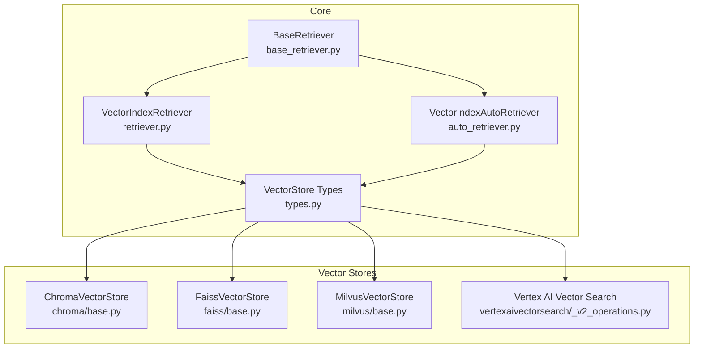
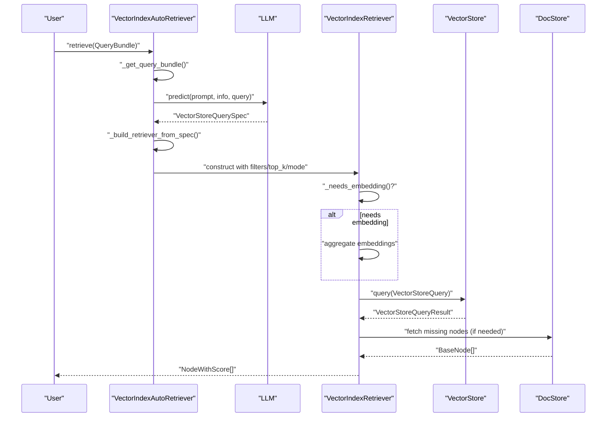
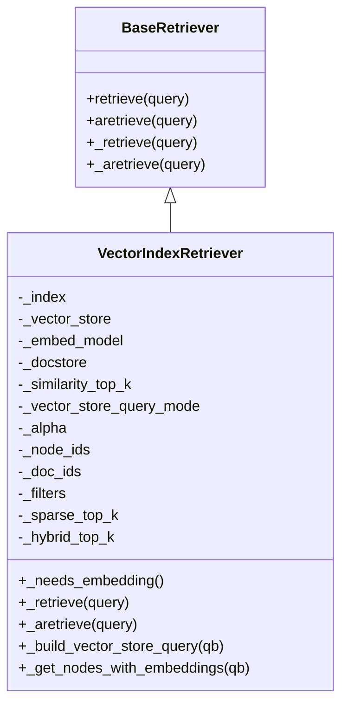
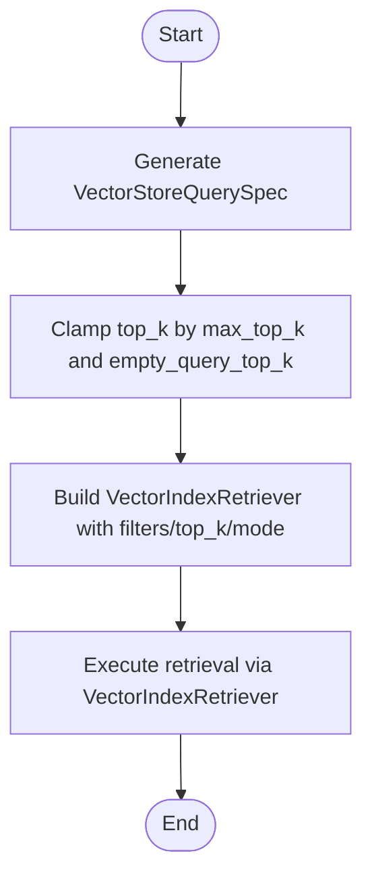
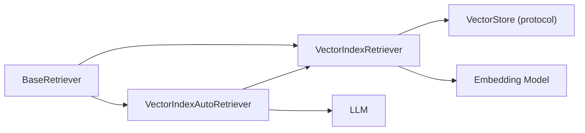

# Vector Retrievers

<cite>
**Referenced Files in This Document**
- [retriever.py](file://llama-index-core/llama_index/core/indices/vector_store/retrievers/retriever.py)
- [auto_retriever.py](file://llama-index-core/llama_index/core/indices/vector_store/retrievers/auto_retriever/auto_retriever.py)
- [base_retriever.py](file://llama-index-core/llama_index/core/base/base_retriever.py)
- [types.py](file://llama-index-core/llama_index/core/vector_stores/types.py)
- [chroma base.py](file://llama-index-integrations/vector_stores/llama-index-vector-stores-chroma/llama_index/vector_stores/chroma/base.py)
- [faiss base.py](file://llama-index-integrations/vector_stores/llama-index-vector-stores-faiss/llama_index/vector_stores/faiss/base.py)
- [milvus base.py](file://llama-index-integrations/vector_stores/llama-index-vector-stores-milvus/llama_index/vector_stores/milvus/base.py)
- [vertexaivectorsearch _v2_operations.py](file://llama-index-integrations/vector_stores/llama-index-vector-stores-vertexaivectorsearch/llama_index/vector_stores/vertexaivectorsearch/_v2_operations.py)
- [test_query_bundle.py](file://llama-index-core/llama_index/core/indices/query/test_query_bundle.py)
- [nile base.py](file://llama-index-integrations/vector_stores/llama-index-vector-stores-nile/llama_index/vector_stores/nile/base.py)
- [vectara retriever.py](file://llama-index-integrations/indices/llama-index-indices-managed-vectara/llama_index/indices/managed/vectara/retriever.py)
</cite>

## Table of Contents
1. [Introduction](#introduction)
2. [Project Structure](#project-structure)
3. [Core Components](#core-components)
4. [Architecture Overview](#architecture-overview)
5. [Detailed Component Analysis](#detailed-component-analysis)
6. [Dependency Analysis](#dependency-analysis)
7. [Performance Considerations](#performance-considerations)
8. [Troubleshooting Guide](#troubleshooting-guide)
9. [Conclusion](#conclusion)
10. [Appendices](#appendices)

## Introduction
This document explains vector retrievers in LlamaIndex with a focus on two primary implementations:
- VectorIndexRetriever: a deterministic, configurable retriever that executes similarity search against a vector store.
- VectorIndexAutoRetriever: an LLM-driven retriever that infers query intent, filters, and top_k from natural language.

It covers embedding-based retrieval, vector store integration, configuration parameters (top_k, similarity thresholds, filters), backend specifics (Chroma, FAISS, Milvus, Vertex AI Vector Search, and others), and advanced topics such as sparse-dense hybrid retrieval, metadata filtering, and batch operations.

## Project Structure
The vector retriever ecosystem spans core retriever abstractions, vector store interfaces, and backend-specific implementations:
- Core retrievers and types live under the core module.
- Vector store backends are integrated via dedicated packages.

**Diagram sources**
- [base_retriever.py](file://llama-index-core/llama_index/core/base/base_retriever.py#L34-L275)
- [retriever.py](file://llama-index-core/llama_index/core/indices/vector_store/retrievers/retriever.py#L24-L268)
- [auto_retriever.py](file://llama-index-core/llama_index/core/indices/vector_store/retrievers/auto_retriever/auto_retriever.py#L37-L245)
- [types.py](file://llama-index-core/llama_index/core/vector_stores/types.py#L45-L439)
- [chroma base.py](file://llama-index-integrations/vector_stores/llama-index-vector-stores-chroma/llama_index/vector_stores/chroma/base.py#L120-L709)
- [faiss base.py](file://llama-index-integrations/vector_stores/llama-index-vector-stores-faiss/llama_index/vector_stores/faiss/base.py#L33-L223)
- [milvus base.py](file://llama-index-integrations/vector_stores/llama-index-vector-stores-milvus/llama_index/vector_stores/milvus/base.py#L1193-L1310)
- [vertexaivectorsearch _v2_operations.py](file://llama-index-integrations/vector_stores/llama-index-vector-stores-vertexaivectorsearch/llama_index/vector_stores/vertexaivectorsearch/_v2_operations.py#L85-L135)

**Section sources**
- [retriever.py](file://llama-index-core/llama_index/core/indices/vector_store/retrievers/retriever.py#L24-L268)
- [auto_retriever.py](file://llama-index-core/llama_index/core/indices/vector_store/retrievers/auto_retriever/auto_retriever.py#L37-L245)
- [base_retriever.py](file://llama-index-core/llama_index/core/base/base_retriever.py#L34-L275)
- [types.py](file://llama-index-core/llama_index/core/vector_stores/types.py#L45-L439)

## Core Components
- VectorIndexRetriever
  - Executes similarity search against a vector store.
  - Supports modes: default, sparse, hybrid, semantic_hybrid, MMR, and learner-based modes.
  - Accepts filters, node/doc constraints, and optional embedding aggregation.
  - Builds a VectorStoreQuery and delegates to the underlying vector store’s query method.

- VectorIndexAutoRetriever
  - Uses an LLM to parse natural language queries into a structured VectorStoreQuerySpec.
  - Infers filters, query string, and top_k; clamps to configured max_top_k.
  - Constructs a VectorIndexRetriever with the parsed spec and executes retrieval.

- BaseRetriever
  - Provides the common retrieval lifecycle: synchronous and asynchronous retrieve, recursive retrieval handling, and instrumentation.

- VectorStore Types
  - Defines VectorStoreQuery, VectorStoreQueryResult, VectorStoreQueryMode, MetadataFilters, and the VectorStore protocol.
  - Enables consistent behavior across backends.

**Section sources**
- [retriever.py](file://llama-index-core/llama_index/core/indices/vector_store/retrievers/retriever.py#L24-L268)
- [auto_retriever.py](file://llama-index-core/llama_index/core/indices/vector_store/retrievers/auto_retriever/auto_retriever.py#L37-L245)
- [base_retriever.py](file://llama-index-core/llama_index/core/base/base_retriever.py#L34-L275)
- [types.py](file://llama-index-core/llama_index/core/vector_stores/types.py#L45-L439)

## Architecture Overview
The retrieval pipeline integrates user queries, embedding generation, vector store queries, and result scoring.

**Diagram sources**
- [auto_retriever.py](file://llama-index-core/llama_index/core/indices/vector_store/retrievers/auto_retriever/auto_retriever.py#L158-L245)
- [retriever.py](file://llama-index-core/llama_index/core/indices/vector_store/retrievers/retriever.py#L104-L268)
- [types.py](file://llama-index-core/llama_index/core/vector_stores/types.py#L240-L267)

## Detailed Component Analysis

### VectorIndexRetriever
Key responsibilities:
- Decide whether embeddings are needed based on query mode and vector store capability.
- Aggregate embeddings from query strings when required.
- Build a VectorStoreQuery and call the vector store’s query method.
- Fetch missing node content from the DocStore when the vector store does not store text.
- Convert results to NodeWithScore with similarity scores.

Configuration highlights:
- similarity_top_k: number of top results.
- vector_store_query_mode: default/sparse/hybrid/MMR/semantic_hybrid, etc.
- filters: MetadataFilters with operators and conditions.
- alpha: hybrid weighting for sparse/dense.
- node_ids/doc_ids: restrict search to specific nodes/docs.
- vector_store_kwargs: pass-through to backend query (e.g., MMR parameters).

**Diagram sources**
- [base_retriever.py](file://llama-index-core/llama_index/core/base/base_retriever.py#L34-L275)
- [retriever.py](file://llama-index-core/llama_index/core/indices/vector_store/retrievers/retriever.py#L24-L268)

**Section sources**
- [retriever.py](file://llama-index-core/llama_index/core/indices/vector_store/retrievers/retriever.py#L24-L268)
- [types.py](file://llama-index-core/llama_index/core/vector_stores/types.py#L240-L267)

### VectorIndexAutoRetriever
Key responsibilities:
- Parse natural language into a structured spec (query, filters, top_k).
- Clamp top_k to configured max_top_k and handle empty-query fallback.
- Construct a VectorIndexRetriever with inferred parameters and execute retrieval.

**Diagram sources**
- [auto_retriever.py](file://llama-index-core/llama_index/core/indices/vector_store/retrievers/auto_retriever/auto_retriever.py#L158-L245)

**Section sources**
- [auto_retriever.py](file://llama-index-core/llama_index/core/indices/vector_store/retrievers/auto_retriever/auto_retriever.py#L37-L245)

### Similarity Search Algorithms and Modes
- DEFAULT: standard vector similarity.
- SPARSE: pure lexical BM25-style retrieval.
- HYBRID: combines sparse and dense signals (backend-dependent).
- SEMANTIC_HYBRID: hybrid with semantic reranking.
- MMR: maximum marginal relevance for diversity.
- Learner-based modes: SVM, logistic regression, linear regression.

These modes are defined in VectorStoreQueryMode and consumed by VectorIndexRetriever to build VectorStoreQuery.

**Section sources**
- [types.py](file://llama-index-core/llama_index/core/vector_stores/types.py#L45-L61)
- [retriever.py](file://llama-index-core/llama_index/core/indices/vector_store/retrievers/retriever.py#L130-L144)

### Embedding-Based Retrieval and Query Bundles
- VectorIndexRetriever aggregates embeddings from QueryBundle.embedding_strs when needed.
- Embedding aggregation is delegated to the configured embed_model.
- Tests demonstrate embedding-based retrieval with custom embedding strings.

**Section sources**
- [retriever.py](file://llama-index-core/llama_index/core/indices/vector_store/retrievers/retriever.py#L108-L115)
- [test_query_bundle.py](file://llama-index-core/llama_index/core/indices/query/test_query_bundle.py#L76-L90)

### Vector Store Integration and Backends

#### Chroma
- Stores text and embeddings; supports MMR with configurable prefetch and threshold.
- Translates standard filters to Chroma-specific operators and conditions.
- Query accepts vector similarity and metadata filters; MMR mode uses prefetch and core MMR utilities.

**Section sources**
- [chroma base.py](file://llama-index-integrations/vector_stores/llama-index-vector-stores-chroma/llama_index/vector_stores/chroma/base.py#L120-L709)

#### FAISS
- Does not store text; returns indices and distances.
- Query supports similarity_top_k; metadata filters are not implemented.
- Persist/load via local filesystem.

**Section sources**
- [faiss base.py](file://llama-index-integrations/vector_stores/llama-index-vector-stores-faiss/llama_index/vector_stores/faiss/base.py#L33-L223)

#### Milvus
- Supports hybrid retrieval with sparse and dense search using rankers (WeightedRanker, RRFRanker).
- Requires Milvus 2.4+ for hybrid search; validates ranker availability.
- Applies metadata filters to both sparse and dense requests.

**Section sources**
- [milvus base.py](file://llama-index-integrations/vector_stores/llama-index-vector-stores-milvus/llama_index/vector_stores/milvus/base.py#L1193-L1310)

#### Vertex AI Vector Search (V2)
- Converts LlamaIndex MetadataFilters to V2 filter format.
- Implements hybrid search with configurable alpha and ranking weights.

**Section sources**
- [vertexaivectorsearch _v2_operations.py](file://llama-index-integrations/vector_stores/llama-index-vector-stores-vertexaivectorsearch/llama_index/vector_stores/vertexaivectorsearch/_v2_operations.py#L85-L135)

#### Other Backends (Examples)
- Nile: demonstrates distance-based similarity computation and metadata filtering in SQL.
- Vectara managed index: exposes similarity_top_k and integrates with external APIs.

**Section sources**
- [nile base.py](file://llama-index-integrations/vector_stores/llama-index-vector-stores-nile/llama_index/vector_stores/nile/base.py#L358-L396)
- [vectara retriever.py](file://llama-index-integrations/indices/llama-index-indices-managed-vectara/llama_index/indices/managed/vectara/retriever.py#L226-L249)

### Configuration Parameters
Common parameters across retrievers and vector stores:
- similarity_top_k: number of top results to return.
- filters: MetadataFilters with operators and conditions.
- vector_store_query_mode: mode selection (default, sparse, hybrid, MMR, semantic_hybrid).
- vector_store_kwargs: backend-specific query-time options (e.g., MMR threshold/factor in Chroma).
- alpha: hybrid weighting for sparse/dense.
- node_ids/doc_ids: restrict search scope.
- embed_model: embedding model for query aggregation.

**Section sources**
- [retriever.py](file://llama-index-core/llama_index/core/indices/vector_store/retrievers/retriever.py#L30-L80)
- [auto_retriever.py](file://llama-index-core/llama_index/core/indices/vector_store/retrievers/auto_retriever/auto_retriever.py#L52-L86)
- [types.py](file://llama-index-core/llama_index/core/vector_stores/types.py#L240-L267)

### Practical Setup and Usage Patterns
- Deterministic retrieval: instantiate VectorIndexRetriever with desired mode, filters, and top_k; pass vector_store_kwargs for backend tuning.
- Auto retrieval: configure VectorIndexAutoRetriever with vector_store_info and prompt; it parses natural language into structured queries.
- Embedding-based retrieval: populate QueryBundle.embedding_strs or provide a custom embedding; VectorIndexRetriever will aggregate when needed.

Note: For concrete code paths, see the “Section sources” entries above.

**Section sources**
- [retriever.py](file://llama-index-core/llama_index/core/indices/vector_store/retrievers/retriever.py#L104-L144)
- [auto_retriever.py](file://llama-index-core/llama_index/core/indices/vector_store/retrievers/auto_retriever/auto_retriever.py#L158-L245)

### Advanced Topics
- Sparse-dense hybrid retrieval
  - Chroma: hybrid mode with alpha weighting and optional semantic reranking.
  - Milvus: hybrid search with sparse BM25/dense vectors and rankers.
  - Vertex AI: hybrid with configurable alpha and ranking weights.

- Metadata filtering
  - Standardized via MetadataFilters with operators and conditions.
  - Backends translate to their native filter syntax (e.g., Chroma operator mapping).

- Batch vector operations
  - Chroma: batches adds using chunked uploads.
  - FAISS: batch add via index.add; batch search via index.search.

**Section sources**
- [chroma base.py](file://llama-index-integrations/vector_stores/llama-index-vector-stores-chroma/llama_index/vector_stores/chroma/base.py#L102-L118)
- [faiss base.py](file://llama-index-integrations/vector_stores/llama-index-vector-stores-faiss/llama_index/vector_stores/faiss/base.py#L119-L140)
- [milvus base.py](file://llama-index-integrations/vector_stores/llama-index-vector-stores-milvus/llama_index/vector_stores/milvus/base.py#L1193-L1310)
- [vertexaivectorsearch _v2_operations.py](file://llama-index-integrations/vector_stores/llama-index-vector-stores-vertexaivectorsearch/llama_index/vector_stores/vertexaivectorsearch/_v2_operations.py#L85-L135)
- [types.py](file://llama-index-core/llama_index/core/vector_stores/types.py#L142-L201)

## Dependency Analysis
VectorIndexRetriever depends on:
- VectorStoreIndex for vector_store and docstore.
- VectorStore protocol for querying and returning results.
- Embedding model for query aggregation when needed.
- BaseRetriever for lifecycle and instrumentation.

VectorIndexAutoRetriever depends on:
- LLM for parsing natural language into structured specs.
- VectorIndexRetriever to execute the final retrieval.

**Diagram sources**
- [base_retriever.py](file://llama-index-core/llama_index/core/base/base_retriever.py#L34-L275)
- [retriever.py](file://llama-index-core/llama_index/core/indices/vector_store/retrievers/retriever.py#L24-L268)
- [auto_retriever.py](file://llama-index-core/llama_index/core/indices/vector_store/retrievers/auto_retriever/auto_retriever.py#L37-L245)
- [types.py](file://llama-index-core/llama_index/core/vector_stores/types.py#L268-L332)

**Section sources**
- [retriever.py](file://llama-index-core/llama_index/core/indices/vector_store/retrievers/retriever.py#L24-L268)
- [auto_retriever.py](file://llama-index-core/llama_index/core/indices/vector_store/retrievers/auto_retriever/auto_retriever.py#L37-L245)
- [types.py](file://llama-index-core/llama_index/core/vector_stores/types.py#L268-L332)

## Performance Considerations
- MMR tuning
  - Chroma: adjust mmr_threshold and prefetch factor/k to balance quality and latency.
- Hybrid search
  - Tune alpha to balance lexical and semantic contributions.
- Top_k selection
  - Increase pre-fetch top_k for hybrid/semantic reranking to improve final ranking quality.
- Backend-specific optimizations
  - Chroma: leverage MMR and efficient batching.
  - FAISS: choose appropriate index types and persist to minimize load overhead.
  - Milvus: use rankers and backend-specific search parameters.

[No sources needed since this section provides general guidance]

## Troubleshooting Guide
- Empty query fallback
  - AutoRetriever can use a default empty query vector when provided; otherwise falls back to empty_query_top_k.
- Filter conflicts
  - Some backends disallow specifying filters via both generic query and backend-specific kwargs.
- Missing node text
  - When vector store does not store text, ensure DocStore is available to fetch node content after retrieval.
- Backend limitations
  - FAISS does not support metadata filters; Milvus requires hybrid ranker support.

**Section sources**
- [auto_retriever.py](file://llama-index-core/llama_index/core/indices/vector_store/retrievers/auto_retriever/auto_retriever.py#L129-L137)
- [chroma base.py](file://llama-index-integrations/vector_stores/llama-index-vector-stores-chroma/llama_index/vector_stores/chroma/base.py#L401-L407)
- [faiss base.py](file://llama-index-integrations/vector_stores/llama-index-vector-stores-faiss/llama_index/vector_stores/faiss/base.py#L196-L197)
- [milvus base.py](file://llama-index-integrations/vector_stores/llama-index-vector-stores-milvus/llama_index/vector_stores/milvus/base.py#L1212-L1216)

## Conclusion
VectorIndexRetriever offers a robust, configurable path for embedding-based retrieval with strong support for diverse query modes and metadata filtering. VectorIndexAutoRetriever augments this with LLM-driven inference to simplify user-facing retrieval configuration. Together with backend-specific capabilities (e.g., Chroma MMR, Milvus hybrid, FAISS batch operations), LlamaIndex provides a flexible and powerful retrieval toolkit suitable for a wide range of applications.

[No sources needed since this section summarizes without analyzing specific files]

## Appendices
- Example references for embedding-based retrieval:
  - [test_query_bundle.py](file://llama-index-core/llama_index/core/indices/query/test_query_bundle.py#L76-L90)

[No sources needed since this section provides pointers without analyzing specific files]