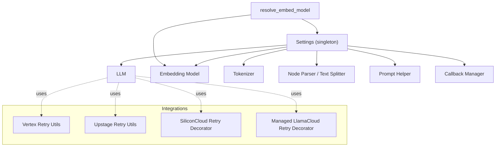
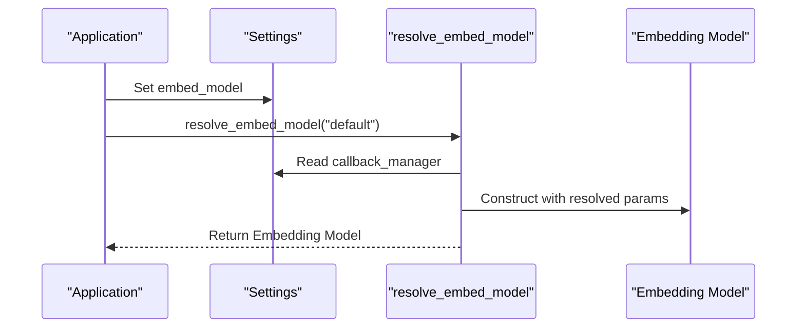
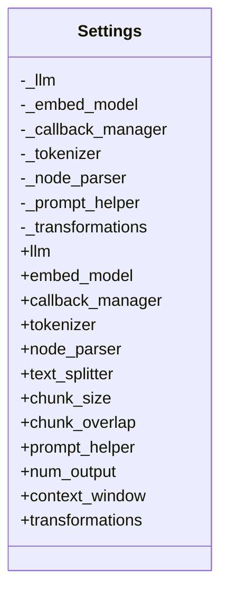
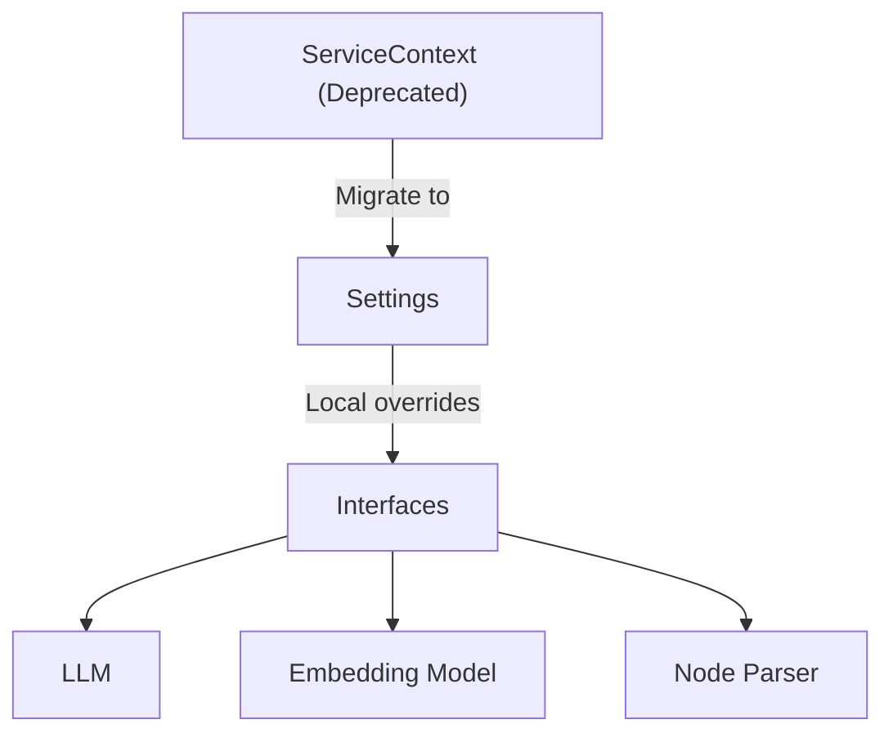
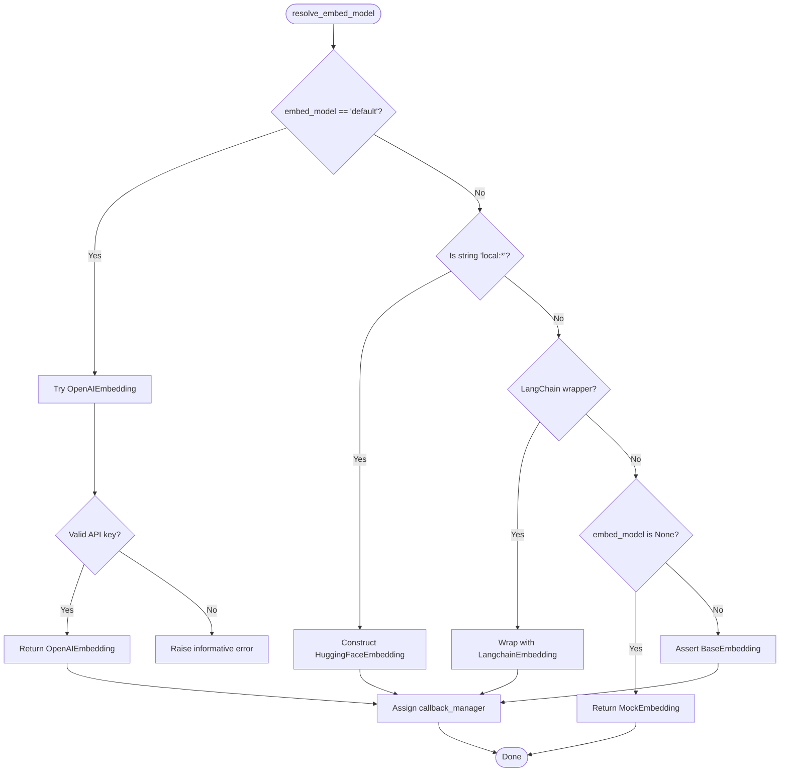
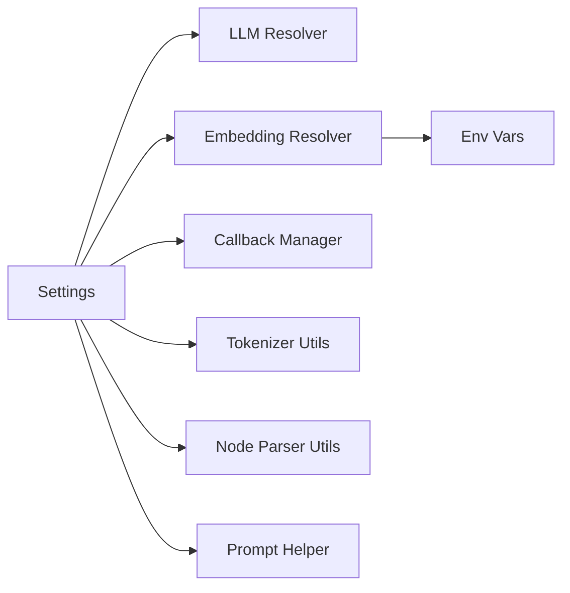

# Settings and Configuration

<cite>
**Referenced Files in This Document**
- [settings.py](file://llama-index-core/llama_index/core/settings.py)
- [service_context.py](file://llama-index-core/llama_index/core/service_context.py)
- [settings.mdx](file://docs/src/content/docs/framework/module_guides/supporting_modules/settings.mdx)
- [service_context_migration.md](file://docs/src/content/docs/framework/module_guides/supporting_modules/service_context_migration.md)
- [utils.py](file://llama-index-core/llama_index/core/embeddings/utils.py)
- [pydantic_settings.py](file://llama-index-core/llama_index/core/bridge/pydantic_settings.py)
- [utils.py](file://llama-index-integrations/llms/llama-index-llms-vertex/utils.py)
- [utils.py](file://llama-index-integrations/embeddings/llama-index-embeddings-upstage/utils.py)
- [utils.py](file://llama-index-integrations/llms/llama-index-llms-siliconflow/base.py)
- [api_utils.py](file://llama-index-integrations/indices/llama-index-indices-managed-llama-cloud/api_utils.py)
- [utils.py](file://llama-index-core/llama_index/core/utils.py)
</cite>

## Table of Contents
1. [Introduction](#introduction)
2. [Project Structure](#project-structure)
3. [Core Components](#core-components)
4. [Architecture Overview](#architecture-overview)
5. [Detailed Component Analysis](#detailed-component-analysis)
6. [Dependency Analysis](#dependency-analysis)
7. [Performance Considerations](#performance-considerations)
8. [Troubleshooting Guide](#troubleshooting-guide)
9. [Conclusion](#conclusion)
10. [Appendices](#appendices)

## Introduction
This document explains LlamaIndex’s global configuration system centered around the Settings singleton and the deprecated ServiceContext pattern. It covers how to configure LLMs, embeddings, tokenizers, node parsers, prompt helpers, and callback managers globally; how to migrate from ServiceContext to Settings; how environment variables and credential resolution work; and how to apply timeouts, retries, and secure credential handling. Practical examples and diagrams illustrate the configuration flow and relationships among components.

## Project Structure
The configuration system spans a small set of core modules and documentation pages:
- Global Settings singleton and its properties
- Deprecated ServiceContext and migration guidance
- Embedding resolution utilities that honor Settings defaults
- Retry and timeout utilities across integrations
- Environment variable handling and credential resolution helpers

**Diagram sources**
- [settings.py](file://llama-index-core/llama_index/core/settings.py#L17-L249)
- [utils.py](file://llama-index-core/llama_index/core/embeddings/utils.py#L31-L141)
- [utils.py](file://llama-index-integrations/llms/llama-index-llms-vertex/utils.py#L37-L46)
- [utils.py](file://llama-index-integrations/embeddings/llama-index-embeddings-upstage/utils.py#L42-L74)
- [utils.py](file://llama-index-integrations/llms/llama-index-llms-siliconflow/base.py#L122-L146)
- [api_utils.py](file://llama-index-integrations/indices/llama-index-indices-managed-llama-cloud/api_utils.py#L42-L49)

**Section sources**
- [settings.py](file://llama-index-core/llama_index/core/settings.py#L1-L249)
- [service_context.py](file://llama-index-core/llama_index/core/service_context.py#L1-L49)
- [settings.mdx](file://docs/src/content/docs/framework/module_guides/supporting_modules/settings.mdx#L1-L133)

## Core Components
- Settings singleton: A lazily initialized global store for LLM, embedding model, tokenizer, node parser, prompt helper, callback manager, and transformations. Properties auto-wire callback managers and prompt helpers when available.
- ServiceContext: Deprecated container that enforced global defaults but caused unnecessary eager initialization; replaced by Settings.
- resolve_embed_model: Utility that resolves embedding models from strings, LangChain wrappers, or defaults, honoring Settings and environment variables.
- Environment variable handling: Utilities and integrations resolve credentials via parameters, environment variables, and helper functions.

Key responsibilities:
- Provide global defaults for all downstream components
- Lazily instantiate components to avoid unnecessary memory usage
- Allow per-module overrides for fine-grained control

**Section sources**
- [settings.py](file://llama-index-core/llama_index/core/settings.py#L17-L249)
- [service_context.py](file://llama-index-core/llama_index/core/service_context.py#L4-L19)
- [utils.py](file://llama-index-core/llama_index/core/embeddings/utils.py#L31-L141)
- [settings.mdx](file://docs/src/content/docs/framework/module_guides/supporting_modules/settings.mdx#L11-L133)

## Architecture Overview
The Settings singleton acts as the central configuration hub. When a component needs an LLM or embedding model, it either receives an explicit override or falls back to Settings. Embedding resolution consults environment variables and Settings defaults. Integrations apply retry/backoff policies and timeout controls independently of Settings, but can be configured alongside it.

**Diagram sources**
- [settings.py](file://llama-index-core/llama_index/core/settings.py#L60-L74)
- [utils.py](file://llama-index-core/llama_index/core/embeddings/utils.py#L31-L141)

**Section sources**
- [settings.py](file://llama-index-core/llama_index/core/settings.py#L17-L249)
- [utils.py](file://llama-index-core/llama_index/core/embeddings/utils.py#L31-L141)

## Detailed Component Analysis

### Settings Singleton
The Settings singleton encapsulates:
- LLM: Lazy resolution via a resolver; assigns callback manager if present
- Embedding model: Lazy resolution via a resolver; assigns callback manager if present
- Callback manager: Lazily created if not provided
- Tokenizer: Delegates to global tokenizer or resolves a default
- Node parser / text splitter: Defaults to a sentence splitter; supports chunk_size and chunk_overlap setters
- Prompt helper: Derived from LLM metadata when available; otherwise constructed directly
- Transformations: Defaults to a list containing the node parser

Behavior highlights:
- Lazy instantiation avoids loading unused components
- Automatic wiring of callback manager to LLM, embedding, and node parser
- Convenience aliases for node parser and prompt helper parameters

**Diagram sources**
- [settings.py](file://llama-index-core/llama_index/core/settings.py#L17-L249)

**Section sources**
- [settings.py](file://llama-index-core/llama_index/core/settings.py#L17-L249)

### ServiceContext Migration Pattern
ServiceContext is deprecated. The migration path is to use Settings globally and pass local overrides to specific interfaces when needed. The migration guide explains how to replace ServiceContext usage with Settings and local overrides.

**Diagram sources**
- [service_context.py](file://llama-index-core/llama_index/core/service_context.py#L4-L19)
- [service_context_migration.md](file://docs/src/content/docs/framework/module_guides/supporting_modules/service_context_migration.md#L1-L30)

**Section sources**
- [service_context.py](file://llama-index-core/llama_index/core/service_context.py#L4-L19)
- [service_context_migration.md](file://docs/src/content/docs/framework/module_guides/supporting_modules/service_context_migration.md#L1-L30)

### Embedding Resolution and Environment Variables
The embedding resolution utility:
- Accepts “default” to auto-select an embedding provider based on environment and installed packages
- Supports CLIs and LangChain-compatible wrappers
- Applies fallbacks and raises informative errors when required packages are missing
- Respects Settings.callback_manager for all constructed embeddings

Credential resolution patterns:
- Integrations resolve credentials from parameters, environment variables, and helper functions
- Some integrations provide helper functions to merge defaults and environment variables

**Diagram sources**
- [utils.py](file://llama-index-core/llama_index/core/embeddings/utils.py#L31-L141)

**Section sources**
- [utils.py](file://llama-index-core/llama_index/core/embeddings/utils.py#L31-L141)

### Environment Variable Handling and Secure Credentials
Environment variables are commonly used to supply credentials and base URLs. Integrations demonstrate:
- Precedence: explicit parameter > environment variable > default
- Helpers to resolve and log warnings for missing or invalid values
- Dedicated utilities to assemble retry decorators with exponential backoff and jitter

Practical guidance:
- Prefer environment variables for secrets
- Provide defaults for non-sensitive configuration
- Use helper functions to centralize credential resolution

**Section sources**
- [utils.py](file://llama-index-integrations/embeddings/llama-index-embeddings-upstage/utils.py#L21-L39)
- [utils.py](file://llama-index-integrations/llms/llama-index-llms-vertex/utils.py#L37-L46)
- [utils.py](file://llama-index-integrations/llms/llama-index-llms-siliconflow/base.py#L122-L146)
- [api_utils.py](file://llama-index-integrations/indices/llama-index-indices-managed-llama-cloud/api_utils.py#L42-L49)

### Configuration Inheritance and Local Overrides
Settings provides global defaults, but interfaces can accept local overrides. This allows mixing global Settings with per-call or per-index configuration.

Examples:
- Passing a local LLM to a query engine
- Passing a local embedding model to index construction
- Overriding transformations for ingestion

**Section sources**
- [settings.mdx](file://docs/src/content/docs/framework/module_guides/supporting_modules/settings.mdx#L122-L133)

## Dependency Analysis
Settings depends on:
- LLM and embedding model resolvers/utilities
- Callback manager for event observation
- Tokenizer utilities for token counting
- Node parser utilities for document splitting
- Prompt helper derived from LLM metadata

Embedding resolution depends on:
- Installed embedding packages (OpenAI, HuggingFace, etc.)
- Environment variables for credentials
- Settings for callback manager wiring

**Diagram sources**
- [settings.py](file://llama-index-core/llama_index/core/settings.py#L17-L249)
- [utils.py](file://llama-index-core/llama_index/core/embeddings/utils.py#L31-L141)

**Section sources**
- [settings.py](file://llama-index-core/llama_index/core/settings.py#L17-L249)
- [utils.py](file://llama-index-core/llama_index/core/embeddings/utils.py#L31-L141)

## Performance Considerations
- Lazy initialization: Components are only created when accessed, reducing startup overhead and memory footprint.
- Callback manager wiring: Ensures observability without manual per-component setup.
- Tokenizer alignment: Matching tokenizer to the chosen LLM improves prompt sizing accuracy.
- Transformations list: Defaults to a single node parser; customize only when necessary to avoid extra processing.

[No sources needed since this section provides general guidance]

## Troubleshooting Guide
Common issues and resolutions:
- Missing embedding provider package: The embedding resolver raises an import error with installation guidance. Install the appropriate integration package.
- Invalid or missing API key: The resolver raises a value error with actionable steps; ensure environment variables are set or pass credentials explicitly.
- Node parser lacks chunk_size/chunk_overlap: Use the dedicated properties to set them safely.
- Deprecated ServiceContext usage: Replace with Settings and local overrides as documented.

Operational tips:
- Use environment variables for secrets and base URLs
- Apply retry/backoff strategies in integrations where applicable
- Validate configuration by accessing Settings properties before heavy operations

**Section sources**
- [utils.py](file://llama-index-core/llama_index/core/embeddings/utils.py#L65-L77)
- [settings.py](file://llama-index-core/llama_index/core/settings.py#L154-L183)
- [service_context.py](file://llama-index-core/llama_index/core/service_context.py#L13-L19)

## Conclusion
LlamaIndex’s Settings singleton offers a clean, lazy, and extensible configuration model. It replaces the deprecated ServiceContext, enabling global defaults with easy local overrides. Integrations provide robust retry and credential handling patterns. Adopt environment variables for secrets, align tokenizers with your LLM, and leverage Settings for consistent, production-ready behavior.

[No sources needed since this section summarizes without analyzing specific files]

## Appendices

### Practical Examples Index
- Configure an OpenAI-compatible LLM and embedding model globally
- Switch to an open-source LLM and local embedding model
- Set chunk size and overlap for text splitting
- Add a global callback manager for token counting
- Define a custom tokenizer aligned with your LLM
- Apply timeouts and retries in integrations

These examples are described in the official documentation and can be adapted to your environment.

**Section sources**
- [settings.mdx](file://docs/src/content/docs/framework/module_guides/supporting_modules/settings.mdx#L11-L133)
- [service_context_migration.md](file://docs/src/content/docs/framework/module_guides/supporting_modules/service_context_migration.md#L11-L22)