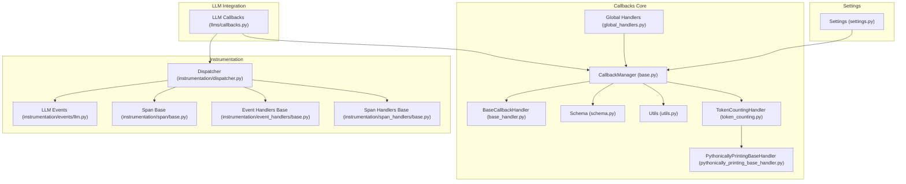
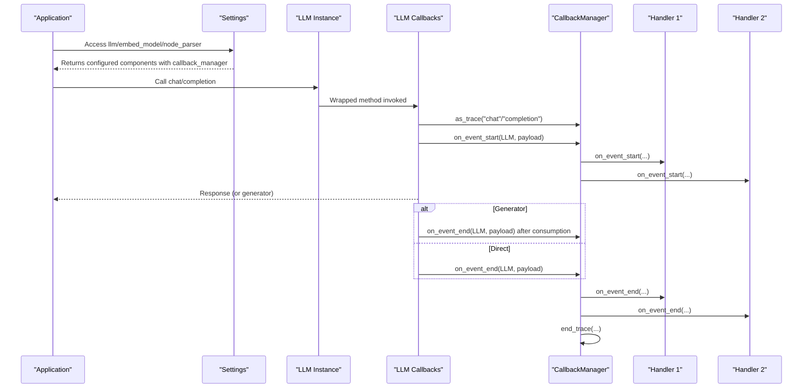
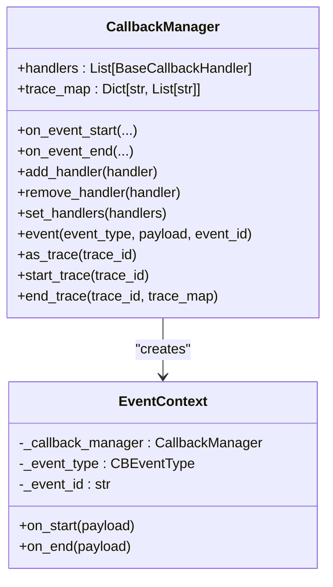
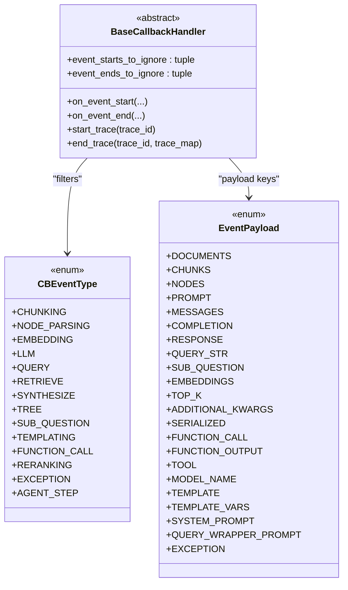
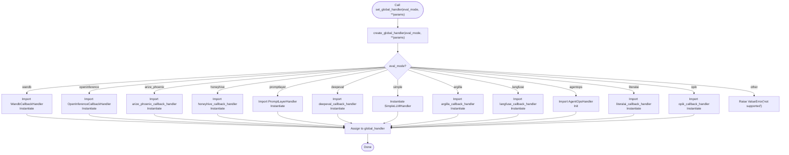
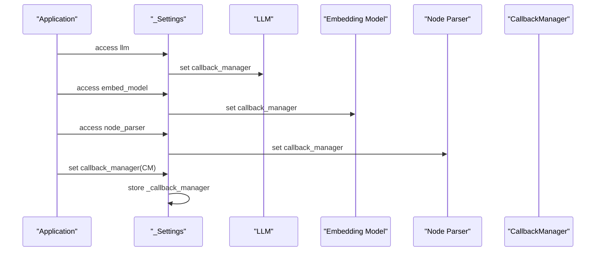
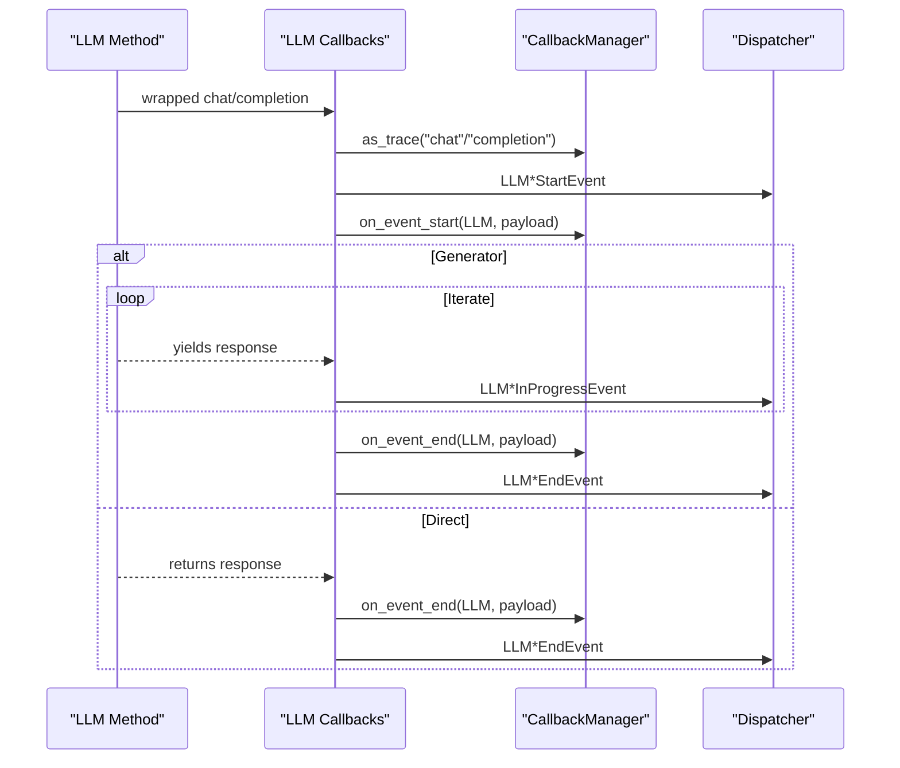
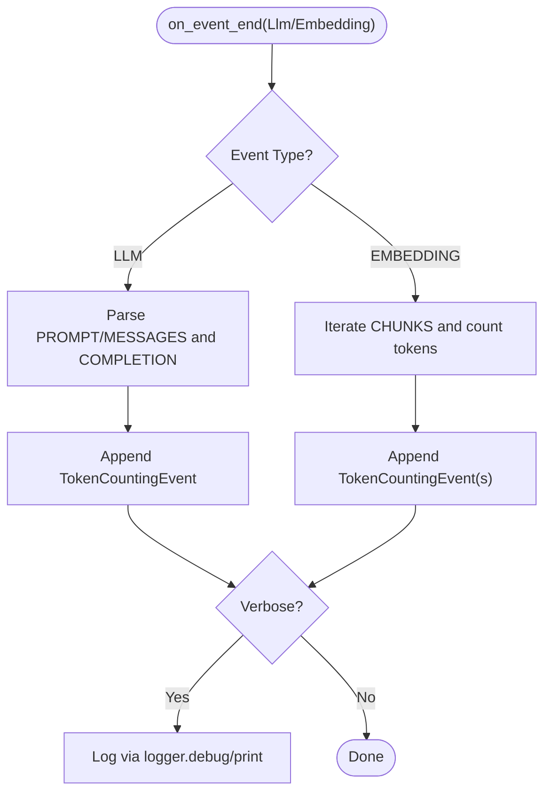
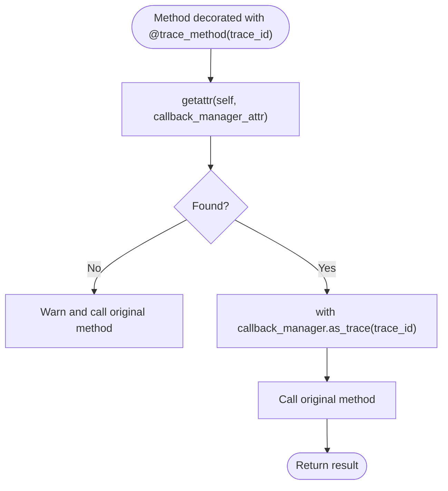
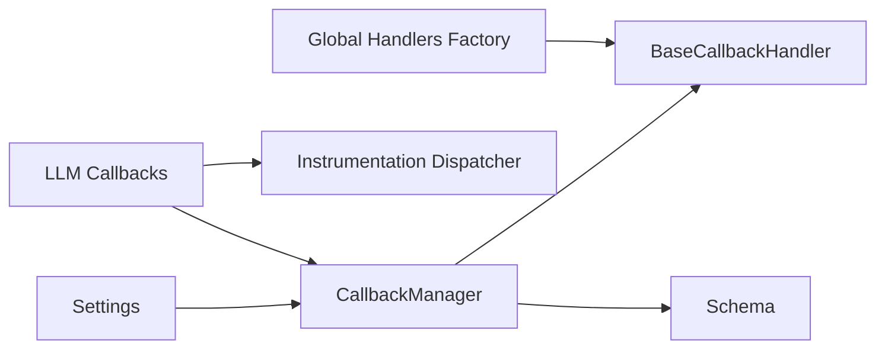

# Callback Management

<cite>
**Referenced Files in This Document**
- [settings.py](file://llama-index-core/llama_index/core/settings.py)
- [callbacks/__init__.py](file://llama-index-core/llama_index/core/callbacks/__init__.py)
- [callbacks/base.py](file://llama-index-core/llama_index/core/callbacks/base.py)
- [callbacks/base_handler.py](file://llama-index-core/llama_index/core/callbacks/base_handler.py)
- [callbacks/global_handlers.py](file://llama-index-core/llama_index/core/callbacks/global_handlers.py)
- [callbacks/schema.py](file://llama-index-core/llama_index/core/callbacks/schema.py)
- [callbacks/utils.py](file://llama-index-core/llama_index/core/callbacks/utils.py)
- [callbacks/token_counting.py](file://llama-index-core/llama_index/core/callbacks/token_counting.py)
- [callbacks/pythonically_printing_base_handler.py](file://llama-index-core/llama_index/core/callbacks/pythonically_printing_base_handler.py)
- [llms/callbacks.py](file://llama-index-core/llama_index/core/llms/callbacks.py)
- [instrumentation/dispatcher.py](file://llama-index-core/llama_index/core/instrumentation/dispatcher.py)
- [instrumentation/events/llm.py](file://llama-index-core/llama_index/core/instrumentation/events/llm.py)
- [instrumentation/span/base.py](file://llama-index-core/llama_index/core/instrumentation/span/base.py)
- [instrumentation/event_handlers/base.py](file://llama-index-core/llama_index/core/instrumentation/event_handlers/base.py)
- [instrumentation/span_handlers/base.py](file://llama-index-core/llama_index/core/instrumentation/span_handlers/base.py)
</cite>

## Table of Contents
1. [Introduction](#introduction)
2. [Project Structure](#project-structure)
3. [Core Components](#core-components)
4. [Architecture Overview](#architecture-overview)
5. [Detailed Component Analysis](#detailed-component-analysis)
6. [Dependency Analysis](#dependency-analysis)
7. [Performance Considerations](#performance-considerations)
8. [Troubleshooting Guide](#troubleshooting-guide)
9. [Conclusion](#conclusion)
10. [Appendices](#appendices)

## Introduction
This document explains how to configure callback management within the LlamaIndex settings system. It covers how to set up callback managers, global handlers, and event tracking systems; how callback resolution works; how handlers are registered and chained; and how events propagate through the system. Practical examples show how to integrate logging, monitoring, and observability via built-in and external callback handlers. Guidance is included for handler chaining, event filtering, performance impact, integration with external observability platforms, developing custom callbacks, and best practices for production deployments.

## Project Structure
The callback management system spans several modules:
- Settings: central configuration that wires callback managers to LLMs, embeddings, and node parsers.
- Callback core: base handler interface, manager, schema, utilities, and token counting.
- LLM integration: decorators that emit LLM-related events and dispatch instrumentation events.
- Instrumentation: dispatcher and event/span handlers used by integrations.

**Diagram sources**
- [settings.py](file://llama-index-core/llama_index/core/settings.py#L17-L249)
- [callbacks/base.py](file://llama-index-core/llama_index/core/callbacks/base.py#L28-L303)
- [callbacks/base_handler.py](file://llama-index-core/llama_index/core/callbacks/base_handler.py#L12-L56)
- [callbacks/schema.py](file://llama-index-core/llama_index/core/callbacks/schema.py#L16-L102)
- [callbacks/utils.py](file://llama-index-core/llama_index/core/callbacks/utils.py#L11-L62)
- [callbacks/token_counting.py](file://llama-index-core/llama_index/core/callbacks/token_counting.py#L143-L270)
- [callbacks/pythonically_printing_base_handler.py](file://llama-index-core/llama_index/core/callbacks/pythonically_printing_base_handler.py#L10-L39)
- [callbacks/global_handlers.py](file://llama-index-core/llama_index/core/callbacks/global_handlers.py#L6-L150)
- [llms/callbacks.py](file://llama-index-core/llama_index/core/llms/callbacks.py#L39-L546)
- [instrumentation/dispatcher.py](file://llama-index-core/llama_index/core/instrumentation/dispatcher.py)
- [instrumentation/events/llm.py](file://llama-index-core/llama_index/core/instrumentation/events/llm.py)
- [instrumentation/span/base.py](file://llama-index-core/llama_index/core/instrumentation/span/base.py)
- [instrumentation/event_handlers/base.py](file://llama-index-core/llama_index/core/instrumentation/event_handlers/base.py)
- [instrumentation/span_handlers/base.py](file://llama-index-core/llama_index/core/instrumentation/span_handlers/base.py)

**Section sources**
- [settings.py](file://llama-index-core/llama_index/core/settings.py#L17-L249)
- [callbacks/__init__.py](file://llama-index-core/llama_index/core/callbacks/__init__.py#L1-L18)

## Core Components
- CallbackManager: central orchestrator for event lifecycle, trace management, and handler invocation.
- BaseCallbackHandler: abstract interface for implementing custom handlers.
- Schema: event types, payloads, and leaf-event semantics.
- Utilities: tracing decorator for arbitrary methods.
- TokenCountingHandler: built-in handler for token accounting.
- Global handlers: factory to create and register platform-specific handlers.
- LLM callbacks: decorators that emit LLM events and instrumentation events.

Key responsibilities:
- Event lifecycle: start/end events with payloads and IDs.
- Trace management: nested traces and trace maps.
- Handler chaining: ordered execution across multiple handlers.
- Event filtering: ignore lists for start/end events.
- Integration hooks: LLM chat/completion wrappers and instrumentation dispatch.

**Section sources**
- [callbacks/base.py](file://llama-index-core/llama_index/core/callbacks/base.py#L28-L303)
- [callbacks/base_handler.py](file://llama-index-core/llama_index/core/callbacks/base_handler.py#L12-L56)
- [callbacks/schema.py](file://llama-index-core/llama_index/core/callbacks/schema.py#L16-L102)
- [callbacks/utils.py](file://llama-index-core/llama_index/core/callbacks/utils.py#L11-L62)
- [callbacks/token_counting.py](file://llama-index-core/llama_index/core/callbacks/token_counting.py#L143-L270)
- [callbacks/global_handlers.py](file://llama-index-core/llama_index/core/callbacks/global_handlers.py#L6-L150)
- [llms/callbacks.py](file://llama-index-core/llama_index/core/llms/callbacks.py#L39-L546)

## Architecture Overview
The callback system integrates with Settings and LLMs to emit structured events and optionally dispatch instrumentation signals. Handlers receive callbacks for event start/end and trace lifecycle, enabling logging, metrics, and observability.

**Diagram sources**
- [settings.py](file://llama-index-core/llama_index/core/settings.py#L32-L99)
- [llms/callbacks.py](file://llama-index-core/llama_index/core/llms/callbacks.py#L39-L546)
- [callbacks/base.py](file://llama-index-core/llama_index/core/callbacks/base.py#L88-L243)

## Detailed Component Analysis

### CallbackManager
- Initialization merges global handler and Settings-provided manager when none supplied.
- Event lifecycle:
  - on_event_start: assigns IDs, updates trace map, invokes handlers, manages trace stack for non-leaf events.
  - on_event_end: invokes handlers, updates trace stack.
- Tracing:
  - start_trace/end_trace manage trace stacks and dispatch start/end to handlers.
  - trace_map records parent-child relationships.
- Context managers:
  - event(): ensures start/end and cleanup.
  - as_trace(): wraps entire operation with trace lifecycle.
- Handler management:
  - add/remove/set handlers for dynamic configuration.

**Diagram sources**
- [callbacks/base.py](file://llama-index-core/llama_index/core/callbacks/base.py#L28-L303)

**Section sources**
- [callbacks/base.py](file://llama-index-core/llama_index/core/callbacks/base.py#L28-L303)

### BaseCallbackHandler and Schema
- BaseCallbackHandler defines the contract for handlers: on_event_start, on_event_end, start_trace, end_trace, plus ignore lists for event types.
- Schema defines CBEventType, EventPayload, leaf events, and CBEvent dataclass.

**Diagram sources**
- [callbacks/base_handler.py](file://llama-index-core/llama_index/core/callbacks/base_handler.py#L12-L56)
- [callbacks/schema.py](file://llama-index-core/llama_index/core/callbacks/schema.py#L16-L102)

**Section sources**
- [callbacks/base_handler.py](file://llama-index-core/llama_index/core/callbacks/base_handler.py#L12-L56)
- [callbacks/schema.py](file://llama-index-core/llama_index/core/callbacks/schema.py#L16-L102)

### Global Handlers and Platform Integrations
- Global handlers are created via a factory that maps eval_mode to platform-specific handlers.
- Supported modes include wandb, openinference, arize_phoenix, honeyhive, promptlayer, deepeval, simple, argilla, langfuse, agentops, literalai, opik.
- The factory raises informative errors if optional dependencies are missing.

**Diagram sources**
- [callbacks/global_handlers.py](file://llama-index-core/llama_index/core/callbacks/global_handlers.py#L6-L150)

**Section sources**
- [callbacks/global_handlers.py](file://llama-index-core/llama_index/core/callbacks/global_handlers.py#L6-L150)

### Settings Integration
- Settings exposes callback_manager and injects it into LLM, embed_model, and node_parser upon access.
- Provides a global_handler property that delegates to the global handler factory.

**Diagram sources**
- [settings.py](file://llama-index-core/llama_index/core/settings.py#L32-L99)

**Section sources**
- [settings.py](file://llama-index-core/llama_index/core/settings.py#L32-L99)

### LLM Callback Wrappers
- llm_chat_callback and llm_completion_callback decorate LLM methods to emit instrumentation events and callback events.
- They manage traces ("chat" and "completion"), payload construction, and generator interception to emit progress and finalize end events.

**Diagram sources**
- [llms/callbacks.py](file://llama-index-core/llama_index/core/llms/callbacks.py#L39-L546)
- [instrumentation/events/llm.py](file://llama-index-core/llama_index/core/instrumentation/events/llm.py)

**Section sources**
- [llms/callbacks.py](file://llama-index-core/llama_index/core/llms/callbacks.py#L39-L546)

### Token Counting Handler
- TokenCountingHandler extends a printing base handler to log token usage for LLM and Embedding events.
- Extracts token counts from response usage metadata or falls back to tokenizer estimates.
- Maintains per-event token counts and totals.

**Diagram sources**
- [callbacks/token_counting.py](file://llama-index-core/llama_index/core/callbacks/token_counting.py#L143-L270)
- [callbacks/pythonically_printing_base_handler.py](file://llama-index-core/llama_index/core/callbacks/pythonically_printing_base_handler.py#L10-L39)

**Section sources**
- [callbacks/token_counting.py](file://llama-index-core/llama_index/core/callbacks/token_counting.py#L143-L270)
- [callbacks/pythonically_printing_base_handler.py](file://llama-index-core/llama_index/core/callbacks/pythonically_printing_base_handler.py#L10-L39)

### Utilities: trace_method Decorator
- trace_method decorates arbitrary methods to automatically wrap execution in a trace using a named trace_id and a callback_manager attribute.
- Supports both sync and async methods.

**Diagram sources**
- [callbacks/utils.py](file://llama-index-core/llama_index/core/callbacks/utils.py#L11-L62)

**Section sources**
- [callbacks/utils.py](file://llama-index-core/llama_index/core/callbacks/utils.py#L11-L62)

## Dependency Analysis
- Settings depends on CallbackManager and injects it into LLM, embed_model, and node_parser.
- CallbackManager depends on BaseCallbackHandler and schema types.
- LLM callbacks depend on CallbackManager and the instrumentation dispatcher.
- Global handlers depend on optional integration packages and return BaseCallbackHandler instances.

**Diagram sources**
- [settings.py](file://llama-index-core/llama_index/core/settings.py#L32-L99)
- [callbacks/base.py](file://llama-index-core/llama_index/core/callbacks/base.py#L28-L303)
- [callbacks/base_handler.py](file://llama-index-core/llama_index/core/callbacks/base_handler.py#L12-L56)
- [callbacks/schema.py](file://llama-index-core/llama_index/core/callbacks/schema.py#L16-L102)
- [llms/callbacks.py](file://llama-index-core/llama_index/core/llms/callbacks.py#L39-L546)
- [callbacks/global_handlers.py](file://llama-index-core/llama_index/core/callbacks/global_handlers.py#L6-L150)

**Section sources**
- [settings.py](file://llama-index-core/llama_index/core/settings.py#L32-L99)
- [callbacks/base.py](file://llama-index-core/llama_index/core/callbacks/base.py#L28-L303)
- [callbacks/global_handlers.py](file://llama-index-core/llama_index/core/callbacks/global_handlers.py#L6-L150)
- [llms/callbacks.py](file://llama-index-core/llama_index/core/llms/callbacks.py#L39-L546)

## Performance Considerations
- Handler overhead: Each handler adds function call latency; keep handler lists minimal and avoid heavy I/O in on_event_start/on_event_end.
- Event filtering: Use event_starts_to_ignore and event_ends_to_ignore to skip noisy events (e.g., leaf events) when appropriate.
- Token counting: TokenCountingHandler performs tokenization; cache tokenizers or reduce verbosity in production.
- Tracing depth: Deeply nested traces increase memory usage; limit trace nesting and prune unused handlers.
- Asynchronous generators: LLM wrappers intercept generators; ensure handlers handle streaming efficiently to avoid buffering.

[No sources needed since this section provides general guidance]

## Troubleshooting Guide
Common issues and resolutions:
- Duplicate handler types: Adding multiple handlers of the same type to a single manager raises an error during initialization. Ensure unique handler classes per manager.
- Missing optional dependencies: Global handlers raise ImportError with installation guidance when optional packages are not present. Install the required integration package.
- Handler not receiving events: Verify event filter lists and ensure the handler is attached to the correct CallbackManager instance.
- Traces not ending: Use the context managers event() and as_trace() to guarantee proper start/end semantics; exceptions are handled to ensure cleanup.

**Section sources**
- [callbacks/base.py](file://llama-index-core/llama_index/core/callbacks/base.py#L57-L85)
- [callbacks/global_handlers.py](file://llama-index-core/llama_index/core/callbacks/global_handlers.py#L20-L147)

## Conclusion
The LlamaIndex callback management system provides a robust, extensible framework for event-driven logging, monitoring, and observability. Through Settings integration, LLM wrappers, and a flexible handler model, teams can instrument workflows, track token usage, and connect to external observability platforms. By carefully configuring handlers, leveraging event filtering, and adopting best practices, organizations can achieve comprehensive visibility with minimal operational overhead.

[No sources needed since this section summarizes without analyzing specific files]

## Appendices

### Practical Examples and Patterns
- Configure a global handler for observability:
  - Use the global handler factory to instantiate a platform-specific handler and attach it globally.
  - Reference: [callbacks/global_handlers.py](file://llama-index-core/llama_index/core/callbacks/global_handlers.py#L6-L150)
- Set a custom CallbackManager on Settings:
  - Assign a CallbackManager instance to Settings.callback_manager to inject it into LLM/embedding/node parser.
  - Reference: [settings.py](file://llama-index-core/llama_index/core/settings.py#L101-L104)
- Add a logging handler:
  - Extend the printing base handler to route logs through Python’s logging infrastructure.
  - Reference: [callbacks/pythonically_printing_base_handler.py](file://llama-index-core/llama_index/core/callbacks/pythonically_printing_base_handler.py#L10-L39)
- Track token usage:
  - Attach TokenCountingHandler to record prompt/completion token counts and total usage.
  - Reference: [callbacks/token_counting.py](file://llama-index-core/llama_index/core/callbacks/token_counting.py#L143-L270)
- Trace arbitrary methods:
  - Decorate methods with @trace_method to emit trace lifecycle events around execution.
  - Reference: [callbacks/utils.py](file://llama-index-core/llama_index/core/callbacks/utils.py#L11-L62)
- Integrate instrumentation:
  - LLM wrappers dispatch instrumentation events; ensure dispatcher is available and handlers are wired.
  - Reference: [llms/callbacks.py](file://llama-index-core/llama_index/core/llms/callbacks.py#L39-L546), [instrumentation/dispatcher.py](file://llama-index-core/llama_index/core/instrumentation/dispatcher.py)

### Best Practices for Production
- Handler selection: Choose lightweight handlers; defer heavy operations to asynchronous workers.
- Event filtering: Exclude leaf events or high-frequency events to reduce noise.
- Token counting: Disable verbose logging in production; rely on aggregated metrics.
- Tracing: Keep traces shallow; avoid deep nesting in hot paths.
- Global handlers: Prefer explicit manager configuration over global handlers for fine-grained control.
- Testing: Validate handler chains and error paths using context managers and exception scenarios.

[No sources needed since this section provides general guidance]