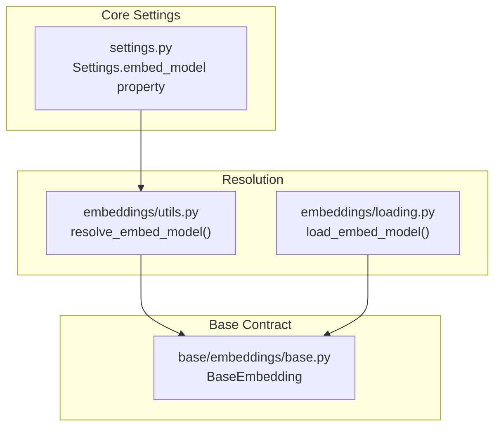
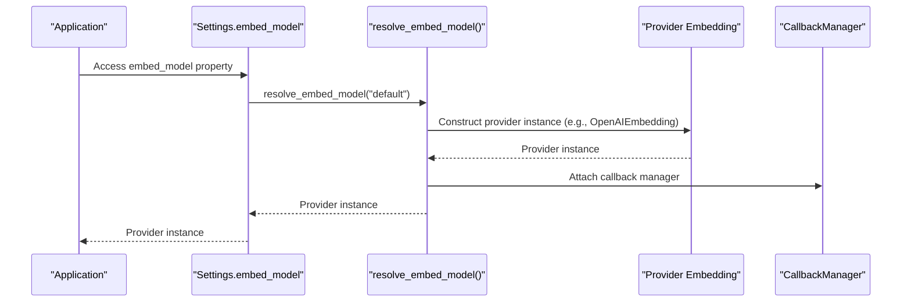
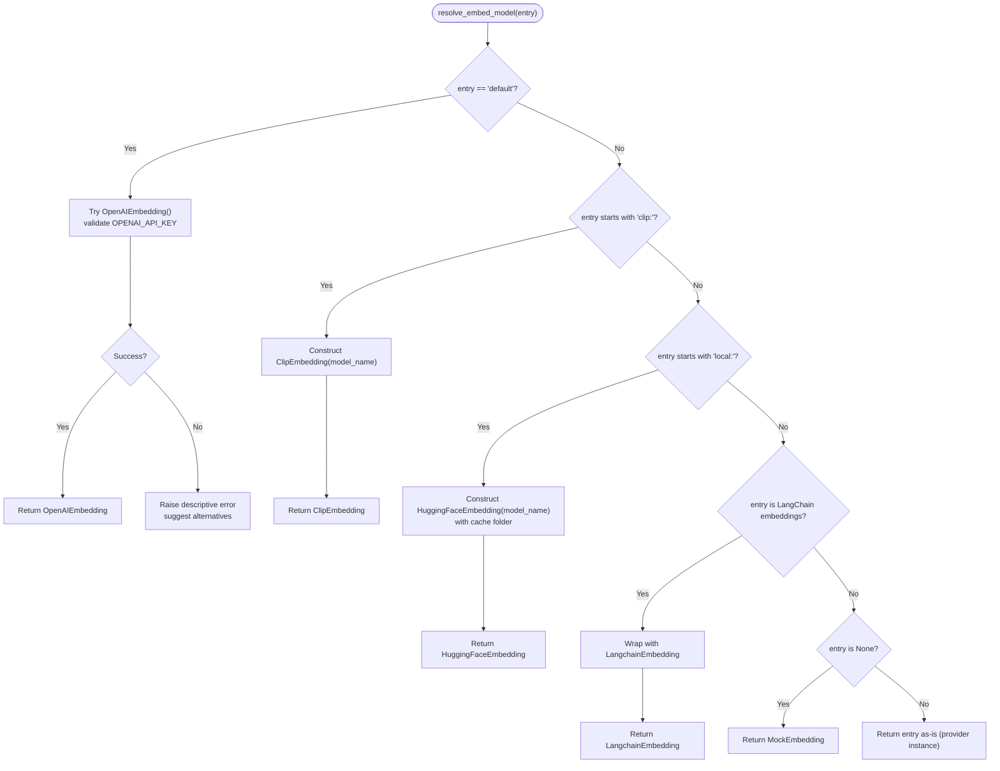
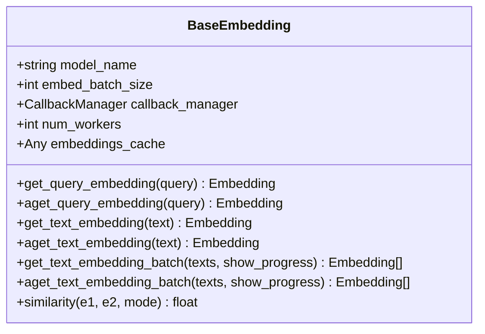
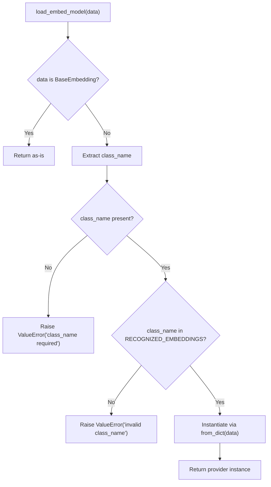
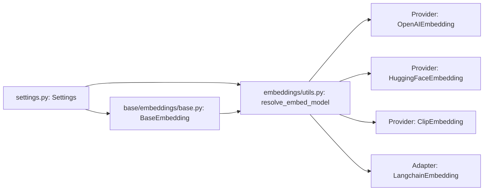

# Embedding Models

<cite>
**Referenced Files in This Document**
- [settings.py](file://llama-index-core/llama_index/core/settings.py)
- [service_context.py](file://llama-index-core/llama_index/core/service_context.py)
- [base.py](file://llama-index-core/llama_index/core/base/embeddings/base.py)
- [utils.py](file://llama-index-core/llama_index/core/embeddings/utils.py)
- [loading.py](file://llama-index-core/llama_index/core/embeddings/loading.py)
- [__init__.py](file://llama-index-core/llama_index/core/embeddings/__init__.py)
</cite>

## Table of Contents
1. [Introduction](#introduction)
2. [Project Structure](#project-structure)
3. [Core Components](#core-components)
4. [Architecture Overview](#architecture-overview)
5. [Detailed Component Analysis](#detailed-component-analysis)
6. [Dependency Analysis](#dependency-analysis)
7. [Performance Considerations](#performance-considerations)
8. [Troubleshooting Guide](#troubleshooting-guide)
9. [Conclusion](#conclusion)

## Introduction
This document explains how embedding models are configured and resolved within the LlamaIndex settings system. It covers the property-based access pattern exposed via the central settings object, the embedding resolution mechanism, default model fallback behavior, and how to integrate provider-specific embedding implementations. It also describes batch processing, caching, callback integration, environment-driven configuration, and practical patterns for selecting models across different use cases.

## Project Structure
The embedding configuration system centers around a small set of core modules:
- Central settings that expose property-based access to the embedding model
- A resolution utility that selects and constructs embedding models
- A base embedding interface that defines the contract for all providers
- A loader registry for embedding classes
- Legacy service context deprecation notice

**Diagram sources**
- [settings.py](file://llama-index-core/llama_index/core/settings.py#L58-L75)
- [utils.py](file://llama-index-core/llama_index/core/embeddings/utils.py#L31-L141)
- [loading.py](file://llama-index-core/llama_index/core/embeddings/loading.py#L39-L50)
- [base.py](file://llama-index-core/llama_index/core/base/embeddings/base.py#L72-L619)

**Section sources**
- [settings.py](file://llama-index-core/llama_index/core/settings.py#L17-L249)
- [utils.py](file://llama-index-core/llama_index/core/embeddings/utils.py#L1-L141)
- [loading.py](file://llama-index-core/llama_index/core/embeddings/loading.py#L1-L50)
- [base.py](file://llama-index-core/llama_index/core/base/embeddings/base.py#L1-L619)

## Core Components
- Settings.embed_model property: Provides lazy initialization and callback propagation for the embedding model. On first access, it resolves the model via the resolution utility and attaches the global callback manager if present.
- Embedding resolution: The resolver supports multiple modes:
  - Default fallback to an OpenAI embedding provider when requested
  - Local Hugging Face embeddings via a “local” prefix
  - CLIP multimodal embeddings via a “clip” prefix
  - LangChain-compatible embeddings adapter
  - Explicit disabling by passing None (results in a minimal mock embedding)
- BaseEmbedding contract: Defines synchronous/asynchronous embedding APIs, batch processing, caching, similarity computation, and callback instrumentation.

Key behaviors:
- Default model fallback: When embed_model is set to the sentinel value indicating default, the resolver attempts to construct an OpenAI embedding model after validating credentials. If unavailable, it raises a descriptive error suggesting alternatives.
- Property-based access: The Settings class exposes embed_model as a property with a setter, enabling straightforward configuration at runtime.
- Callback integration: The resolved embedding model receives the global callback manager from settings, ensuring consistent telemetry and tracing.

**Section sources**
- [settings.py](file://llama-index-core/llama_index/core/settings.py#L58-L75)
- [utils.py](file://llama-index-core/llama_index/core/embeddings/utils.py#L31-L141)
- [base.py](file://llama-index-core/llama_index/core/base/embeddings/base.py#L72-L619)

## Architecture Overview
The embedding configuration pipeline connects the settings layer to provider implementations through a resolution utility. Provider packages register their classes and are loaded dynamically when referenced by name or constructed by the resolver.

**Diagram sources**
- [settings.py](file://llama-index-core/llama_index/core/settings.py#L60-L74)
- [utils.py](file://llama-index-core/llama_index/core/embeddings/utils.py#L31-L141)

## Detailed Component Analysis

### Settings.embed_model Property
- Purpose: Centralized access to the embedding model with lazy initialization and callback propagation.
- Behavior:
  - Getter: Returns a cached instance; if missing, resolves via the resolution utility and attaches the global callback manager.
  - Setter: Accepts a provider identifier, a provider instance, or a LangChain embeddings object; delegates to the resolution utility.
- Integration: Works alongside other settings (LLM, tokenizer, node parser) to form a cohesive runtime configuration.

**Section sources**
- [settings.py](file://llama-index-core/llama_index/core/settings.py#L58-L75)

### Embedding Resolution Mechanism
- Default fallback:
  - Attempts to construct an OpenAI embedding provider and validates the API key.
  - Raises a descriptive error if the required package is not installed or the key is invalid, with guidance to use a local model or alternative providers.
- Local Hugging Face embeddings:
  - Recognized via a “local” prefix followed by a model identifier.
  - Downloads and caches models under a standardized cache directory.
- CLIP multimodal embeddings:
  - Recognized via a “clip” prefix; optional model name can be specified.
- LangChain compatibility:
  - If a LangChain embeddings object is provided, it is wrapped by a LangChain adapter.
- Explicit disable:
  - Passing None yields a minimal mock embedding suitable for testing or environments where embeddings are intentionally disabled.

**Diagram sources**
- [utils.py](file://llama-index-core/llama_index/core/embeddings/utils.py#L31-L141)

**Section sources**
- [utils.py](file://llama-index-core/llama_index/core/embeddings/utils.py#L31-L141)

### BaseEmbedding Contract and Batch Processing
- Methods:
  - Synchronous and asynchronous single-item embedding for queries and texts
  - Batch embedding with configurable batch size and progress reporting
  - Cached batch embedding leveraging a key-value store for embeddings
  - Aggregation helpers for combining multiple embeddings
  - Similarity computation across modes (cosine, dot product, Euclidean)
- Caching:
  - Optional embeddings cache backed by a key-value store; supports both sync and async cache operations
- Concurrency:
  - Async batch processing supports worker-based parallelism and progress reporting
- Instrumentation:
  - Events emitted around embedding operations for telemetry and tracing

**Diagram sources**
- [base.py](file://llama-index-core/llama_index/core/base/embeddings/base.py#L72-L619)

**Section sources**
- [base.py](file://llama-index-core/llama_index/core/base/embeddings/base.py#L72-L619)

### Provider Registration and Loading
- Recognized providers are registered centrally; dynamic imports are guarded by try/except blocks to gracefully handle missing optional dependencies.
- A dedicated loader accepts a dictionary representation and reconstructs a provider instance by class name.

**Diagram sources**
- [loading.py](file://llama-index-core/llama_index/core/embeddings/loading.py#L39-L50)

**Section sources**
- [loading.py](file://llama-index-core/llama_index/core/embeddings/loading.py#L1-L50)
- [__init__.py](file://llama-index-core/llama_index/core/embeddings/__init__.py#L1-L16)

### Legacy Service Context
- The legacy ServiceContext is deprecated in favor of settings-based configuration or passing modules directly to local interfaces.

**Section sources**
- [service_context.py](file://llama-index-core/llama_index/core/service_context.py#L1-L49)

## Dependency Analysis
- Settings depends on the resolution utility to construct or fetch the embedding model and on the callback manager for instrumentation.
- The resolution utility depends on provider-specific packages (e.g., OpenAI, Hugging Face, CLIP, LangChain) and environment variables (e.g., OPENAI_API_KEY).
- BaseEmbedding defines the interface consumed by downstream components (e.g., indices, retrievers) and integrates with the callback system and optional caching.

**Diagram sources**
- [settings.py](file://llama-index-core/llama_index/core/settings.py#L58-L75)
- [utils.py](file://llama-index-core/llama_index/core/embeddings/utils.py#L31-L141)
- [base.py](file://llama-index-core/llama_index/core/base/embeddings/base.py#L72-L619)

**Section sources**
- [settings.py](file://llama-index-core/llama_index/core/settings.py#L58-L75)
- [utils.py](file://llama-index-core/llama_index/core/embeddings/utils.py#L31-L141)
- [base.py](file://llama-index-core/llama_index/core/base/embeddings/base.py#L72-L619)

## Performance Considerations
- Batch size tuning:
  - Adjust embed_batch_size to balance throughput and resource usage; larger batches reduce overhead but increase memory pressure.
- Worker concurrency:
  - Use num_workers for async batch processing to parallelize requests when supported by the provider.
- Caching:
  - Enable embeddings_cache to avoid recomputation for repeated texts; ensure the underlying key-value store is appropriately sized and fast.
- Progress reporting:
  - Use show_progress during batch operations to monitor progress; note that progress rendering may add overhead.
- Provider selection:
  - Prefer local models for offline scenarios or constrained environments; use cloud providers for higher-quality embeddings when latency and cost permit.

[No sources needed since this section provides general guidance]

## Troubleshooting Guide
- Default embedding fails with OpenAI:
  - Symptom: Import or validation errors when using the default model.
  - Cause: Missing provider package or invalid API key.
  - Action: Install the required package and set the appropriate environment variable; consider switching to a local model if cloud access is not desired.
- Local Hugging Face model not found:
  - Symptom: Failure when specifying a local model.
  - Cause: Incorrect model identifier or network/cache issues.
  - Action: Verify the model name and ensure the cache directory is writable.
- CLIP model not found:
  - Symptom: Failure when using a CLIP model.
  - Cause: Missing optional dependencies for CLIP.
  - Action: Install the required CLIP package and dependencies.
- Embeddings disabled:
  - Symptom: Minimal embeddings returned unexpectedly.
  - Cause: Explicitly passing None to the embedding configuration.
  - Action: Configure a proper embedding provider or remove the override.

**Section sources**
- [utils.py](file://llama-index-core/llama_index/core/embeddings/utils.py#L43-L77)
- [utils.py](file://llama-index-core/llama_index/core/embeddings/utils.py#L87-L91)
- [utils.py](file://llama-index-core/llama_index/core/embeddings/utils.py#L113-L117)
- [utils.py](file://llama-index-core/llama_index/core/embeddings/utils.py#L132-L134)

## Conclusion
LlamaIndex’s embedding configuration system provides a clean, property-based interface for selecting and initializing embedding models. The resolution utility centralizes provider detection, environment validation, and fallback logic, while the base embedding contract ensures consistent behavior across providers. By leveraging batch processing, caching, and callback instrumentation, applications can optimize performance and observability. For production deployments, carefully choose providers and tune parameters to match workload characteristics and constraints.