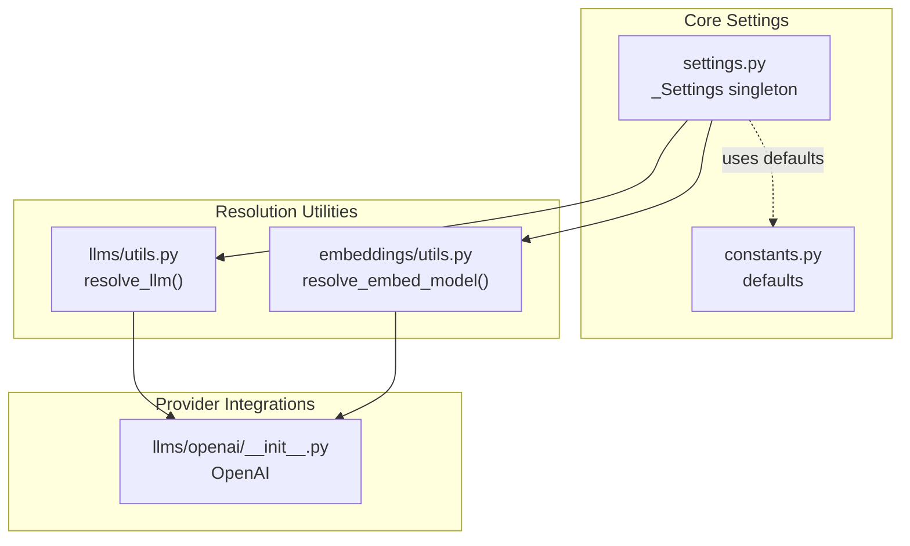
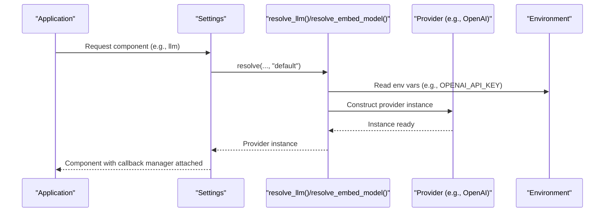
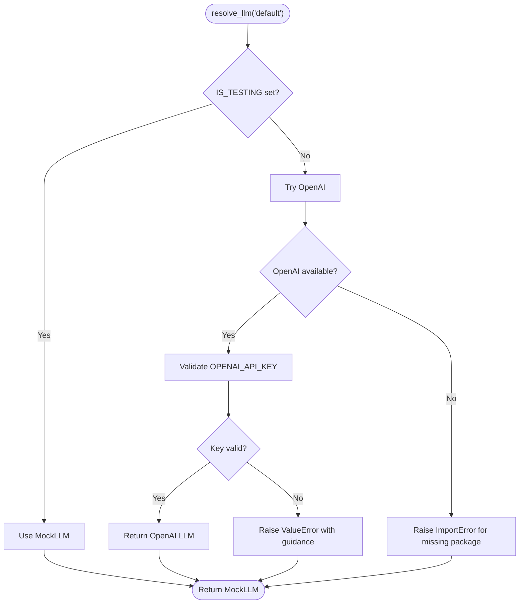
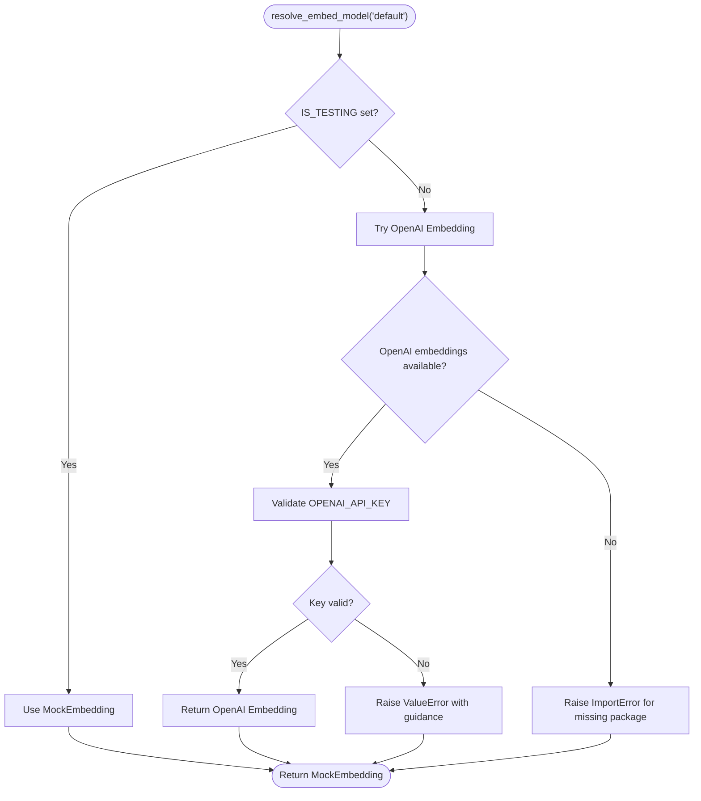
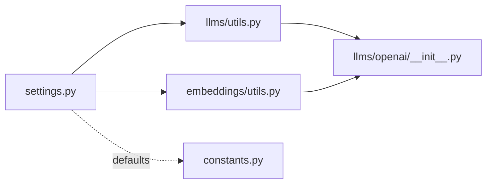

# Environment Variables and Defaults

<cite>
**Referenced Files in This Document**
- [settings.py](file://llama-index-core/llama_index/core/settings.py)
- [constants.py](file://llama-index-core/llama_index/core/constants.py)
- [utils.py (LLM)](file://llama-index-core/llama_index/core/llms/utils.py)
- [utils.py (Embeddings)](file://llama-index-core/llama_index/core/embeddings/utils.py)
- [openai/__init__.py](file://llama-index-integrations/llms/llama-index-llms-openai/llama_index/llms/openai/__init__.py)
</cite>

## Table of Contents
1. [Introduction](#introduction)
2. [Project Structure](#project-structure)
3. [Core Components](#core-components)
4. [Architecture Overview](#architecture-overview)
5. [Detailed Component Analysis](#detailed-component-analysis)
6. [Dependency Analysis](#dependency-analysis)
7. [Performance Considerations](#performance-considerations)
8. [Troubleshooting Guide](#troubleshooting-guide)
9. [Conclusion](#conclusion)

## Introduction
This document explains how environment variables are used to configure LLM providers, embedding models, and other components in the LlamaIndex settings system. It covers default value resolution, fallback strategies, precedence rules, and practical configuration examples. It also addresses security considerations for API keys and production deployment best practices, along with variable naming conventions, validation, and troubleshooting.

## Project Structure
The environment variable configuration and defaults are primarily handled in the core settings module and resolved via LLM and embedding resolution utilities. Provider-specific integrations (such as OpenAI) expose their own configuration mechanisms, but the central settings system delegates to provider packages for actual credential resolution.

**Diagram sources**
- [settings.py](file://llama-index-core/llama_index/core/settings.py#L17-L249)
- [constants.py](file://llama-index-core/llama_index/core/constants.py#L1-L37)
- [utils.py (LLM)](file://llama-index-core/llama_index/core/llms/utils.py#L15-L110)
- [utils.py (Embeddings)](file://llama-index-core/llama_index/core/embeddings/utils.py#L31-L140)
- [openai/__init__.py](file://llama-index-integrations/llms/llama-index-llms-openai/llama_index/llms/openai/__init__.py#L1-L5)

**Section sources**
- [settings.py](file://llama-index-core/llama_index/core/settings.py#L17-L249)
- [constants.py](file://llama-index-core/llama_index/core/constants.py#L1-L37)

## Core Components
- Central settings singleton that lazily initializes LLM, embeddings, tokenizer, node parser, prompt helper, and transformations.
- Resolution utilities that interpret string identifiers and environment variables to construct provider-specific instances.
- Constants that define sensible defaults for chunk sizes, similarity top-k, and other operational parameters.

Key behaviors:
- When a component is requested but not explicitly configured, the settings system resolves a default provider using the resolution utilities.
- Providers may read credentials from environment variables during construction.
- Callback managers and other global settings are attached automatically when available.

**Section sources**
- [settings.py](file://llama-index-core/llama_index/core/settings.py#L17-L249)
- [constants.py](file://llama-index-core/llama_index/core/constants.py#L1-L37)

## Architecture Overview
The environment variable configuration pipeline follows a layered approach:
- Application code requests a component (e.g., LLM or embeddings) from the central settings.
- The settings delegate to resolution utilities with a “default” sentinel.
- The resolution utility attempts to construct a default provider (e.g., OpenAI) and validates credentials.
- Provider constructors read environment variables internally (e.g., API keys).
- On failure, the system raises informative errors suggesting alternatives or remediation steps.

**Diagram sources**
- [settings.py](file://llama-index-core/llama_index/core/settings.py#L32-L46)
- [utils.py (LLM)](file://llama-index-core/llama_index/core/llms/utils.py#L15-L110)
- [utils.py (Embeddings)](file://llama-index-core/llama_index/core/embeddings/utils.py#L31-L77)
- [openai/__init__.py](file://llama-index-integrations/llms/llama-index-llms-openai/llama_index/llms/openai/__init__.py#L1-L5)

## Detailed Component Analysis

### Environment Variable Resolution for LLMs
- Default selection: When requesting the LLM with a default identifier, the system attempts to construct an OpenAI LLM and validates the API key.
- Fallback behavior: If OpenAI is unavailable, the system raises an informative ImportError indicating the missing package or a ValueError with guidance.
- Local models: String identifiers prefixed with a local scheme trigger local LLM instantiation via llama-cpp bindings.
- LangChain interop: If a LangChain model is passed, it is wrapped into a LangChainLLM adapter.

**Diagram sources**
- [utils.py (LLM)](file://llama-index-core/llama_index/core/llms/utils.py#L15-L110)

**Section sources**
- [utils.py (LLM)](file://llama-index-core/llama_index/core/llms/utils.py#L15-L110)

### Environment Variable Resolution for Embeddings
- Default selection: Attempts to construct an OpenAI embedding model and validates the API key.
- Fallback behavior: Raises informative errors if the OpenAI embedding package is missing or the key is invalid.
- CLIP multimodal embeddings: String identifiers starting with a specific prefix trigger CLIP embedding construction.
- Local HuggingFace embeddings: String identifiers with a local scheme initialize a HuggingFaceEmbedding with a cached model directory.
- LangChain interop: If a LangChain embedding is provided, it is wrapped into a LangchainEmbedding adapter.

**Diagram sources**
- [utils.py (Embeddings)](file://llama-index-core/llama_index/core/embeddings/utils.py#L31-L77)

**Section sources**
- [utils.py (Embeddings)](file://llama-index-core/llama_index/core/embeddings/utils.py#L31-L140)

### Default Value Resolution and Precedence
- Precedence:
  - Explicitly set components on the settings singleton take highest precedence.
  - When a component is accessed without explicit setting, the settings resolve a default provider via the resolution utilities.
  - Global callback manager is attached to components if present.
- Defaults:
  - Chunk size and overlap defaults are defined centrally and can be applied by default node parsers.
  - Number of outputs and context window defaults are defined centrally and influence prompt helper behavior.

Practical implications:
- To override defaults, set the desired component directly on the settings singleton.
- To force a specific provider, pass a provider identifier or instance to the settings setters.
- For local deployments, use local model identifiers to avoid network calls.

**Section sources**
- [settings.py](file://llama-index-core/llama_index/core/settings.py#L32-L46)
- [settings.py](file://llama-index-core/llama_index/core/settings.py#L60-L69)
- [constants.py](file://llama-index-core/llama_index/core/constants.py#L1-L37)

### Practical Configuration Examples
Note: The following examples describe configuration approaches. They are illustrative and intended to guide environment variable usage; consult provider-specific documentation for exact variable names and formats.

- Configure OpenAI LLM and embeddings:
  - Set the provider API key in the environment so that the default resolution succeeds.
  - Example variables: OPENAI_API_KEY
  - Behavior: Default resolution constructs OpenAI LLM and embeddings; validation ensures the key is present.

- Use a local LLM:
  - Pass a local model identifier to the settings setter or pass a local model string to the resolution utility.
  - Behavior: Local LLM instantiation via llama-cpp bindings; avoids network calls.

- Use a local embedding model:
  - Pass a local embedding identifier to the settings setter or pass a local model string to the resolution utility.
  - Behavior: Local HuggingFace embedding with a cached model directory.

- Use CLIP multimodal embeddings:
  - Pass a specific embedding identifier to the resolution utility.
  - Behavior: CLIP embedding construction with optional model name suffix.

- Disable LLM or embeddings:
  - Explicitly set the component to a disabled variant or pass None to the resolution utility.
  - Behavior: Mock components are used for testing or disabled operation.

**Section sources**
- [utils.py (LLM)](file://llama-index-core/llama_index/core/llms/utils.py#L59-L110)
- [utils.py (Embeddings)](file://llama-index-core/llama_index/core/embeddings/utils.py#L78-L140)

### Security Considerations and Production Best Practices
- API keys and secrets:
  - Provider constructors read credentials from environment variables during construction. Ensure these are not hardcoded in source files.
  - Prefer secret management systems (e.g., vaults, platform secret stores) and inject values via environment variables at runtime.
- Least privilege:
  - Grant only the minimum permissions required by the provider APIs.
- Network exposure:
  - Avoid logging raw API keys or sensitive configuration. Mask logs and sanitize outputs.
- Testing isolation:
  - The testing flag influences default resolution to use mock components. Keep this flag off in production.
- Validation feedback:
  - The resolution utilities raise explicit errors when credentials are missing or invalid. Use these messages to troubleshoot misconfiguration.

**Section sources**
- [utils.py (LLM)](file://llama-index-core/llama_index/core/llms/utils.py#L28-L57)
- [utils.py (Embeddings)](file://llama-index-core/llama_index/core/embeddings/utils.py#L44-L77)

### Variable Naming Conventions and Validation
- Provider-specific variable names are determined by the provider’s constructor and documented in the provider’s package. Typical examples include API key variables and endpoint URLs.
- Central settings and resolution utilities validate presence and correctness of credentials when constructing providers.
- If a provider package is missing, the resolution utilities raise an ImportError with guidance to install the appropriate package.

**Section sources**
- [utils.py (LLM)](file://llama-index-core/llama_index/core/llms/utils.py#L44-L48)
- [utils.py (Embeddings)](file://llama-index-core/llama_index/core/embeddings/utils.py#L61-L64)

## Dependency Analysis
The settings system depends on resolution utilities for LLMs and embeddings. These utilities depend on provider packages (e.g., OpenAI) and environment variables. The provider packages encapsulate credential loading and validation.

**Diagram sources**
- [settings.py](file://llama-index-core/llama_index/core/settings.py#L17-L249)
- [utils.py (LLM)](file://llama-index-core/llama_index/core/llms/utils.py#L15-L110)
- [utils.py (Embeddings)](file://llama-index-core/llama_index/core/embeddings/utils.py#L31-L140)
- [openai/__init__.py](file://llama-index-integrations/llms/llama-index-llms-openai/llama_index/llms/openai/__init__.py#L1-L5)
- [constants.py](file://llama-index-core/llama_index/core/constants.py#L1-L37)

**Section sources**
- [settings.py](file://llama-index-core/llama_index/core/settings.py#L17-L249)
- [utils.py (LLM)](file://llama-index-core/llama_index/core/llms/utils.py#L15-L110)
- [utils.py (Embeddings)](file://llama-index-core/llama_index/core/embeddings/utils.py#L31-L140)

## Performance Considerations
- Lazy initialization: Components are constructed only when first accessed, reducing startup overhead.
- Callback manager attachment: Ensures consistent telemetry and tracing across components without manual wiring.
- Local models: Using local LLMs or embeddings avoids network latency and reduces external dependency risks.

[No sources needed since this section provides general guidance]

## Troubleshooting Guide
Common issues and resolutions:
- Missing provider package:
  - Symptom: ImportError indicating a missing integration package.
  - Resolution: Install the required provider package as indicated by the error message.
- Invalid or missing API key:
  - Symptom: ValueError with guidance to check the API key.
  - Resolution: Set the correct API key in the environment variable expected by the provider.
- Testing vs. production:
  - Symptom: Unexpected mock components in default resolution.
  - Resolution: Clear the testing flag in production environments.
- Local model configuration:
  - Symptom: Failure to instantiate a local model.
  - Resolution: Ensure the local model identifier is correctly formatted and the required local dependencies are installed.

**Section sources**
- [utils.py (LLM)](file://llama-index-core/llama_index/core/llms/utils.py#L44-L48)
- [utils.py (LLM)](file://llama-index-core/llama_index/core/llms/utils.py#L59-L85)
- [utils.py (Embeddings)](file://llama-index-core/llama_index/core/embeddings/utils.py#L61-L64)
- [utils.py (Embeddings)](file://llama-index-core/llama_index/core/embeddings/utils.py#L113-L117)

## Conclusion
The LlamaIndex settings system provides a clean, extensible mechanism for configuring LLMs and embeddings via environment variables. Defaults are resolved lazily, with clear fallbacks and informative errors guiding users toward correct configuration. By leveraging provider-specific environment variables and following security best practices, teams can deploy reliable, production-ready RAG applications.