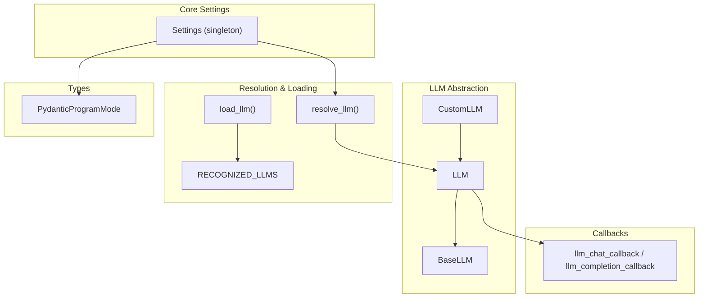
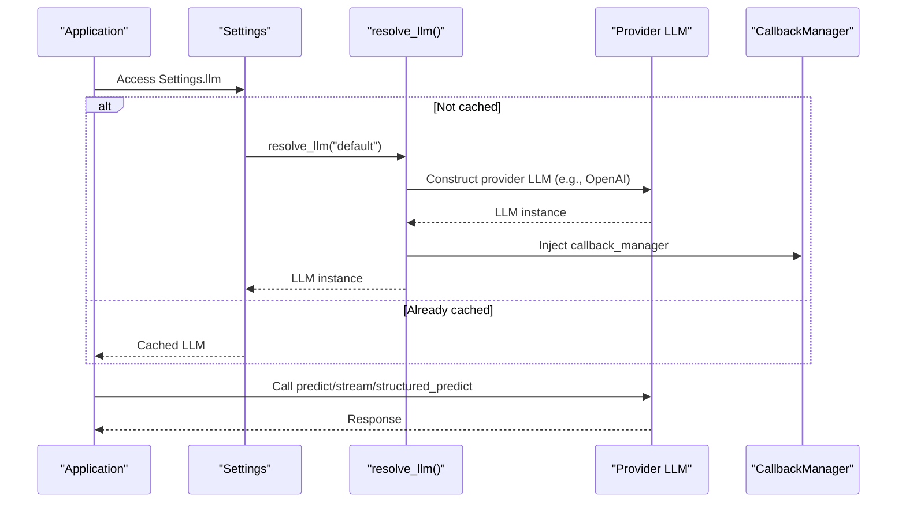
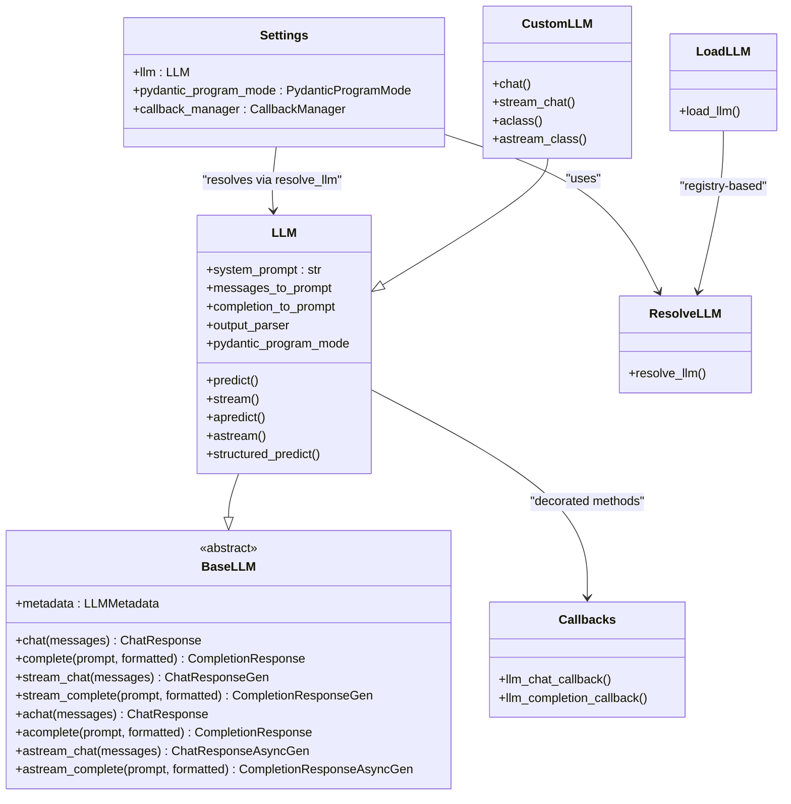

# LLM Configuration

<cite>
**Referenced Files in This Document**
- [settings.py](file://llama-index-core/llama_index/core/settings.py)
- [llm.py](file://llama-index-core/llama_index/core/llms/llm.py)
- [loading.py](file://llama-index-core/llama_index/core/llms/loading.py)
- [utils.py](file://llama-index-core/llama_index/core/llms/utils.py)
- [base.py](file://llama-index-core/llama_index/core/base/llms/base.py)
- [callbacks.py](file://llama-index-core/llama_index/core/llms/callbacks.py)
- [types.py](file://llama-index-core/llama_index/core/types.py)
- [custom.py](file://llama-index-core/llama_index/core/llms/custom.py)
</cite>

## Table of Contents
1. [Introduction](#introduction)
2. [Project Structure](#project-structure)
3. [Core Components](#core-components)
4. [Architecture Overview](#architecture-overview)
5. [Detailed Component Analysis](#detailed-component-analysis)
6. [Dependency Analysis](#dependency-analysis)
7. [Performance Considerations](#performance-considerations)
8. [Troubleshooting Guide](#troubleshooting-guide)
9. [Conclusion](#conclusion)
10. [Appendices](#appendices)

## Introduction
This document explains how to configure Large Language Models (LLMs) within the LlamaIndex settings system. It covers the LLM resolution mechanism, default model fallback, property-based access pattern, provider-specific configuration, environment-driven defaults, and production best practices. It also documents LLM callback integration, pydantic program modes, and model selection patterns.

## Project Structure
The LLM configuration system centers around a singleton Settings object that lazily resolves and caches the active LLM, integrates callbacks, and exposes a property-based API. Provider-specific LLMs are resolved via a registry and factory utilities, while the core LLM abstraction defines the contract for chat/completion endpoints and streaming.

**Diagram sources**
- [settings.py](file://llama-index-core/llama_index/core/settings.py#L17-L249)
- [llm.py](file://llama-index-core/llama_index/core/llms/llm.py#L163-L200)
- [loading.py](file://llama-index-core/llama_index/core/llms/loading.py#L6-L47)
- [utils.py](file://llama-index-core/llama_index/core/llms/utils.py#L15-L111)
- [base.py](file://llama-index-core/llama_index/core/base/llms/base.py#L25-L292)
- [callbacks.py](file://llama-index-core/llama_index/core/llms/callbacks.py#L39-L285)
- [types.py](file://llama-index-core/llama_index/core/types.py#L137-L146)

**Section sources**
- [settings.py](file://llama-index-core/llama_index/core/settings.py#L17-L249)
- [llm.py](file://llama-index-core/llama_index/core/llms/llm.py#L163-L200)
- [loading.py](file://llama-index-core/llama_index/core/llms/loading.py#L6-L47)
- [utils.py](file://llama-index-core/llama_index/core/llms/utils.py#L15-L111)
- [base.py](file://llama-index-core/llama_index/core/base/llms/base.py#L25-L292)
- [callbacks.py](file://llama-index-core/llama_index/core/llms/callbacks.py#L39-L285)
- [types.py](file://llama-index-core/llama_index/core/types.py#L137-L146)

## Core Components
- Settings singleton: Lazily resolves and caches the active LLM, injects callback manager, and exposes properties for pydantic program mode and prompt helper context/window controls.
- LLM class: Pydantic-based model implementing BaseLLM, with attributes for system prompt, prompt conversion hooks, output parsing, and pydantic program mode. Provides predict/stream/apredict/astream and structured prediction APIs.
- BaseLLM: Abstract interface defining chat/completion endpoints, streaming variants, and async variants.
- resolve_llm: Factory that resolves LLM instances from strings ("default", "local:<path>"), LangChain models, or explicit LLM instances, with environment-aware fallbacks.
- load_llm: Loads LLMs from serialized dictionaries using a registry of recognized providers.
- Callback decorators: Instrument chat/completion calls with tracing and events.
- PydanticProgramMode: Enum controlling structured prediction modes.

Key property-based access pattern:
- Settings.llm returns the resolved LLM instance, injecting the global callback manager if present.
- Settings.pydantic_program_mode reads/writes the underlying LLM’s program mode.

**Section sources**
- [settings.py](file://llama-index-core/llama_index/core/settings.py#L32-L56)
- [llm.py](file://llama-index-core/llama_index/core/llms/llm.py#L163-L200)
- [base.py](file://llama-index-core/llama_index/core/base/llms/base.py#L25-L292)
- [utils.py](file://llama-index-core/llama_index/core/llms/utils.py#L15-L111)
- [loading.py](file://llama-index-core/llama_index/core/llms/loading.py#L35-L47)
- [callbacks.py](file://llama-index-core/llama_index/core/llms/callbacks.py#L39-L285)
- [types.py](file://llama-index-core/llama_index/core/types.py#L137-L146)

## Architecture Overview
The LLM configuration pipeline:

**Diagram sources**
- [settings.py](file://llama-index-core/llama_index/core/settings.py#L32-L41)
- [utils.py](file://llama-index-core/llama_index/core/llms/utils.py#L15-L111)
- [llm.py](file://llama-index-core/llama_index/core/llms/llm.py#L588-L775)

## Detailed Component Analysis

### Settings: Property-Based Access and Defaults
- Settings.llm getter:
  - Lazily resolves "default" via resolve_llm.
  - Injects the global callback manager if present.
- Settings.llm setter:
  - Accepts LLMType and resolves via resolve_llm.
- Settings.pydantic_program_mode:
  - Delegates to the underlying LLM for both get and set.

Operational implications:
- Environment-driven defaults: resolve_llm("default") selects a provider based on availability and environment variables.
- Callback propagation: callback manager attached at Settings level is propagated to the resolved LLM.

**Section sources**
- [settings.py](file://llama-index-core/llama_index/core/settings.py#L32-L56)

### LLM Resolution Mechanism and Fallbacks
- resolve_llm("default"):
  - Tests: returns MockLLM when IS_TESTING is set.
  - Attempts OpenAI; validates API key; raises informative errors if unavailable.
  - Falls back to local LlamaCPP when "local" prefix is used.
  - Wraps LangChain models via LangChainLLM if provided.
  - Explicitly disables LLM by passing None, returning MockLLM.
- resolve_llm("local:<path>"):
  - Constructs LlamaCPP with configured prompt converters and model kwargs.
- load_llm():
  - Uses RECOGNIZED_LLMS registry to instantiate LLMs from serialized dicts.

Environment variables:
- OPENAI_API_KEY is validated during default resolution.
- IS_TESTING switches default to MockLLM.

**Section sources**
- [utils.py](file://llama-index-core/llama_index/core/llms/utils.py#L15-L111)
- [loading.py](file://llama-index-core/llama_index/core/llms/loading.py#L6-L47)

### LLM Abstraction and Contract
- BaseLLM defines:
  - Synchronous and asynchronous chat/completion endpoints.
  - Streaming variants for chat and completion.
  - Metadata property for model capabilities.
- LLM extends BaseLLM with:
  - System prompt injection.
  - Prompt/message conversion hooks.
  - Output parsing and structured prediction modes.
  - Structured prediction APIs (predict, stream, async variants).
  - Token streaming helpers.

**Section sources**
- [base.py](file://llama-index-core/llama_index/core/base/llms/base.py#L25-L292)
- [llm.py](file://llama-index-core/llama_index/core/llms/llm.py#L163-L200)

### Callback Integration
- llm_chat_callback and llm_completion_callback decorate LLM methods to emit:
  - Start, progress, and end events.
  - Serialized model info (without sensitive keys).
  - Tracing spans and callback manager events.
- These decorators wrap generators to emit in-progress events and finalize on completion.

Practical effect:
- All LLM calls automatically integrate with the instrumentation and callback system.

**Section sources**
- [callbacks.py](file://llama-index-core/llama_index/core/llms/callbacks.py#L39-L285)
- [llm.py](file://llama-index-core/llama_index/core/llms/llm.py#L588-L775)

### Pydantic Program Modes
- PydanticProgramMode enum supports multiple structured prediction strategies.
- Settings.pydantic_program_mode delegates to the active LLM, enabling consistent mode selection across the application.

**Section sources**
- [types.py](file://llama-index-core/llama_index/core/types.py#L137-L146)
- [settings.py](file://llama-index-core/llama_index/core/settings.py#L48-L56)

### Custom LLM Integration
- CustomLLM provides a minimal base for integrating custom LLMs:
  - Implements chat/stream_chat by delegating to completion endpoints.
  - Exposes class_name for registry compatibility.
  - Inherits LLM features like system prompt and output parsing.

**Section sources**
- [custom.py](file://llama-index-core/llama_index/core/llms/custom.py#L22-L92)

## Dependency Analysis
Relationships among core LLM configuration components:

**Diagram sources**
- [settings.py](file://llama-index-core/llama_index/core/settings.py#L32-L56)
- [base.py](file://llama-index-core/llama_index/core/base/llms/base.py#L25-L292)
- [llm.py](file://llama-index-core/llama_index/core/llms/llm.py#L163-L200)
- [custom.py](file://llama-index-core/llama_index/core/llms/custom.py#L22-L92)
- [callbacks.py](file://llama-index-core/llama_index/core/llms/callbacks.py#L39-L285)
- [utils.py](file://llama-index-core/llama_index/core/llms/utils.py#L15-L111)
- [loading.py](file://llama-index-core/llama_index/core/llms/loading.py#L35-L47)

**Section sources**
- [settings.py](file://llama-index-core/llama_index/core/settings.py#L32-L56)
- [llm.py](file://llama-index-core/llama_index/core/llms/llm.py#L163-L200)
- [base.py](file://llama-index-core/llama_index/core/base/llms/base.py#L25-L292)
- [callbacks.py](file://llama-index-core/llama_index/core/llms/callbacks.py#L39-L285)
- [utils.py](file://llama-index-core/llama_index/core/llms/utils.py#L15-L111)
- [loading.py](file://llama-index-core/llama_index/core/llms/loading.py#L35-L47)

## Performance Considerations
- Lazy initialization: Settings.llm avoids constructing an LLM until first access, reducing startup overhead.
- Callback propagation: Attaching a callback manager at Settings ensures all LLM calls are traced efficiently.
- Streaming: Prefer streaming APIs for long-running predictions to reduce latency and memory pressure.
- Structured prediction: Choose appropriate PydanticProgramMode to balance accuracy and performance.

[No sources needed since this section provides general guidance]

## Troubleshooting Guide
Common issues and resolutions:
- Default LLM fails to load:
  - Ensure OPENAI_API_KEY is set and valid when using default resolution.
  - If testing, IS_TESTING enables MockLLM; otherwise, OpenAI resolution is attempted.
- Local model resolution:
  - Use "local:<path>" format; ensure llama-cpp provider is installed.
- LangChain model integration:
  - Wrap LangChain models via resolve_llm to use LangChainLLM adapter.
- Callbacks not firing:
  - Verify Settings.callback_manager is set; LLM methods are decorated and will propagate the manager.

**Section sources**
- [utils.py](file://llama-index-core/llama_index/core/llms/utils.py#L26-L111)
- [callbacks.py](file://llama-index-core/llama_index/core/llms/callbacks.py#L39-L285)
- [settings.py](file://llama-index-core/llama_index/core/settings.py#L94-L104)

## Conclusion
LlamaIndex’s LLM configuration system provides a robust, property-based, and environment-aware mechanism for selecting, resolving, and integrating LLMs. The Settings singleton centralizes defaults and callback propagation, while resolve_llm and load_llm enable flexible provider selection and serialization. With structured prediction modes and comprehensive callback integration, the system supports both experimentation and production-grade deployments.

[No sources needed since this section summarizes without analyzing specific files]

## Appendices

### Practical Configuration Patterns
- Default provider selection:
  - Use Settings.llm to access the resolved LLM; it will default to OpenAI when available and properly configured.
- Local model:
  - Pass "local:/path/to/model.gguf" to Settings.llm setter or resolve_llm to use a local LLM.
- Disable LLM:
  - Assign None to Settings.llm to use MockLLM for environments where inference is not desired.
- Environment variables:
  - OPENAI_API_KEY for default OpenAI resolution.
  - IS_TESTING to force MockLLM during tests.
- Callback manager:
  - Set Settings.callback_manager to enable tracing and event emission across all LLM calls.

**Section sources**
- [settings.py](file://llama-index-core/llama_index/core/settings.py#L32-L56)
- [utils.py](file://llama-index-core/llama_index/core/llms/utils.py#L26-L111)

### Provider-Specific Notes
- OpenAI/Azure OpenAI: Resolved by default when installed and API key is valid.
- Hugging Face Inference API: Recognized via registry for loading from dict.
- LangChain models: Supported via adapter wrapper when passed to resolve_llm.

**Section sources**
- [loading.py](file://llama-index-core/llama_index/core/llms/loading.py#L6-L47)
- [utils.py](file://llama-index-core/llama_index/core/llms/utils.py#L87-L98)