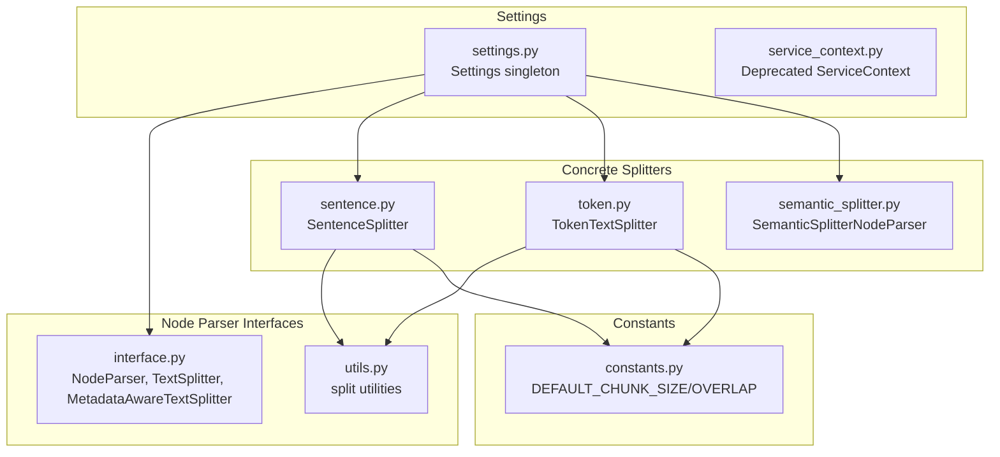
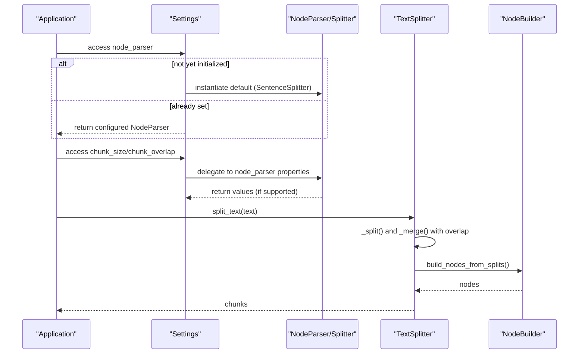
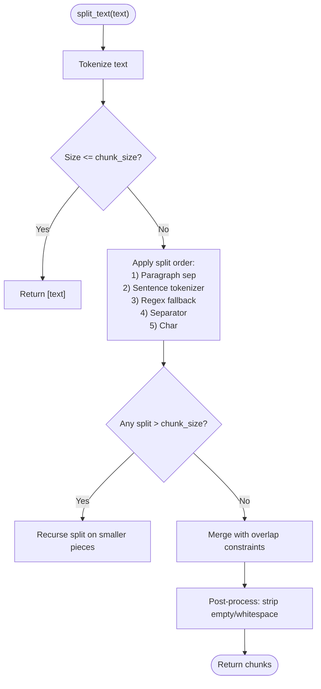
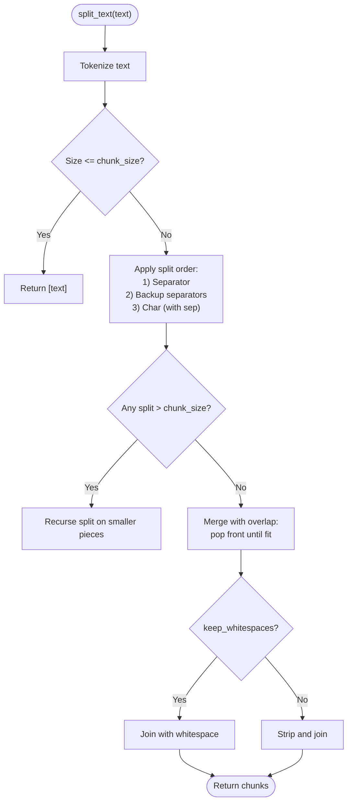
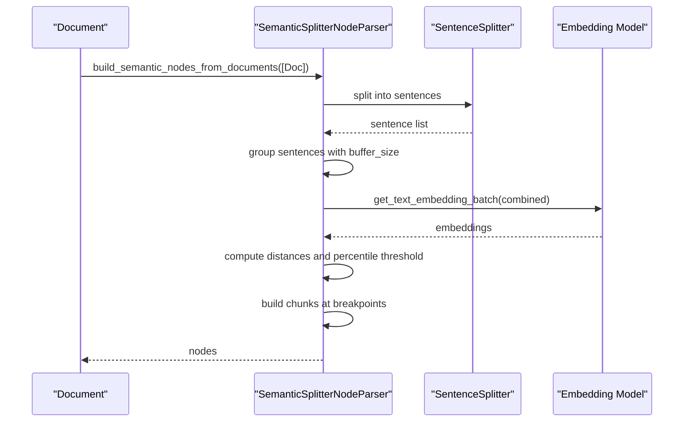
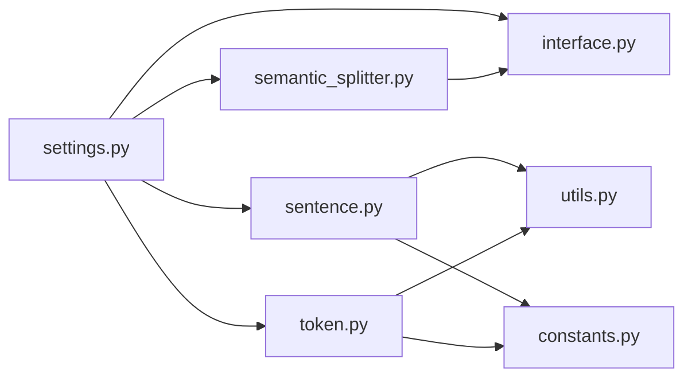

# Node Parsing and Text Splitting

<cite>
**Referenced Files in This Document**
- [settings.py](file://llama-index-core/llama_index/core/settings.py)
- [service_context.py](file://llama-index-core/llama_index/core/service_context.py)
- [interface.py](file://llama-index-core/llama_index/core/node_parser/interface.py)
- [sentence.py](file://llama-index-core/llama_index/core/node_parser/text/sentence.py)
- [token.py](file://llama-index-core/llama_index/core/node_parser/text/token.py)
- [semantic_splitter.py](file://llama-index-core/llama_index/core/node_parser/text/semantic_splitter.py)
- [utils.py](file://llama-index-core/llama_index/core/node_parser/text/utils.py)
- [constants.py](file://llama-index-core/llama_index/core/constants.py)
- [__init__.py](file://llama-index-core/llama_index/core/node_parser/__init__.py)
- [token_based_code_splitter_example.py](file://examples/token_based_code_splitter_example.py)
</cite>

## Table of Contents
1. [Introduction](#introduction)
2. [Project Structure](#project-structure)
3. [Core Components](#core-components)
4. [Architecture Overview](#architecture-overview)
5. [Detailed Component Analysis](#detailed-component-analysis)
6. [Dependency Analysis](#dependency-analysis)
7. [Performance Considerations](#performance-considerations)
8. [Troubleshooting Guide](#troubleshooting-guide)
9. [Conclusion](#conclusion)
10. [Appendices](#appendices)

## Introduction
This document explains how node parsing and text splitting are configured and used within the LlamaIndex settings system. It covers the node parser resolution mechanism, default splitter configuration, property-based access patterns, and practical examples for configuring different text splitters such as SentenceSplitter, TokenTextSplitter, and semantic splitters. It also addresses chunk size and overlap strategies, integration with embedding models, prompt helper coordination, and best practices for various document types.

## Project Structure
The node parsing and text splitting functionality resides primarily under the node parser module and integrates with the settings subsystem. Key areas:
- Settings and property access for node parser and chunk sizing
- Base interfaces for node parsers and text splitters
- Concrete implementations for sentence-based, token-based, and semantic splitting
- Utilities for splitting strategies and truncation helpers
- Constants for default chunk sizes and overlaps

**Diagram sources**
- [settings.py](file://llama-index-core/llama_index/core/settings.py#L137-L196)
- [interface.py](file://llama-index-core/llama_index/core/node_parser/interface.py#L50-L278)
- [sentence.py](file://llama-index-core/llama_index/core/node_parser/text/sentence.py#L34-L332)
- [token.py](file://llama-index-core/llama_index/core/node_parser/text/token.py#L22-L242)
- [semantic_splitter.py](file://llama-index-core/llama_index/core/node_parser/text/semantic_splitter.py#L35-L313)
- [utils.py](file://llama-index-core/llama_index/core/node_parser/text/utils.py#L10-L125)
- [constants.py](file://llama-index-core/llama_index/core/constants.py#L10-L11)

**Section sources**
- [settings.py](file://llama-index-core/llama_index/core/settings.py#L137-L196)
- [interface.py](file://llama-index-core/llama_index/core/node_parser/interface.py#L50-L278)
- [sentence.py](file://llama-index-core/llama_index/core/node_parser/text/sentence.py#L34-L332)
- [token.py](file://llama-index-core/llama_index/core/node_parser/text/token.py#L22-L242)
- [semantic_splitter.py](file://llama-index-core/llama_index/core/node_parser/text/semantic_splitter.py#L35-L313)
- [utils.py](file://llama-index-core/llama_index/core/node_parser/text/utils.py#L10-L125)
- [constants.py](file://llama-index-core/llama_index/core/constants.py#L10-L11)

## Core Components
- Settings singleton exposes node_parser and text_splitter properties, defaulting to a SentenceSplitter. It also provides chunk_size and chunk_overlap accessors that delegate to the underlying node parser if supported.
- NodeParser is the base interface for transforming documents into nodes, with built-in metadata handling, relationships, and callback integration.
- TextSplitter extends NodeParser and defines split_text and split_texts methods, plus a default _parse_nodes implementation that builds nodes from splits.
- MetadataAwareTextSplitter further extends TextSplitter to account for metadata length when computing effective chunk size.
- SentenceSplitter prefers sentence boundaries and merges with overlap, using a sentence tokenizer and configurable paragraph separators.
- TokenTextSplitter splits on tokens with configurable separators and overlap, optionally preserving whitespace.
- SemanticSplitterNodeParser groups semantically similar sentences using embeddings and a percentile-based breakpoint detection.

**Section sources**
- [settings.py](file://llama-index-core/llama_index/core/settings.py#L137-L196)
- [interface.py](file://llama-index-core/llama_index/core/node_parser/interface.py#L50-L278)
- [sentence.py](file://llama-index-core/llama_index/core/node_parser/text/sentence.py#L34-L332)
- [token.py](file://llama-index-core/llama_index/core/node_parser/text/token.py#L22-L242)
- [semantic_splitter.py](file://llama-index-core/llama_index/core/node_parser/text/semantic_splitter.py#L35-L313)

## Architecture Overview
The settings system resolves and exposes a node parser instance. When chunk_size or chunk_overlap are accessed, the settings object delegates to the node parser’s properties if present. The node parser’s _parse_nodes method orchestrates splitting and node construction, with optional metadata-awareness and overlap handling.

**Diagram sources**
- [settings.py](file://llama-index-core/llama_index/core/settings.py#L137-L196)
- [interface.py](file://llama-index-core/llama_index/core/node_parser/interface.py#L218-L231)
- [sentence.py](file://llama-index-core/llama_index/core/node_parser/text/sentence.py#L176-L196)
- [token.py](file://llama-index-core/llama_index/core/node_parser/text/token.py#L138-L157)

## Detailed Component Analysis

### Settings and Property-Based Access Pattern
- node_parser property returns a SentenceSplitter by default and attaches the global callback manager if present.
- text_splitter is an alias to node_parser for convenience.
- chunk_size and chunk_overlap accessors check whether the node parser supports these attributes and delegate accordingly, raising errors otherwise.
- transformations defaults to a list containing the node parser.

Practical configuration steps:
- Assign a NodeParser instance to settings.node_parser to override the default.
- Use settings.chunk_size and settings.chunk_overlap to adjust the active splitter’s parameters.
- Alternatively, set settings.text_splitter to a NodeParser instance to use the alias.

**Section sources**
- [settings.py](file://llama-index-core/llama_index/core/settings.py#L137-L196)

### NodeParser and TextSplitter Interfaces
- NodeParser defines include_metadata, include_prev_next_rel, callback_manager, and id_func fields, and provides get_nodes_from_documents and async variants.
- TextSplitter adds split_text and split_texts, and implements _parse_nodes to convert nodes into chunks and build nodes from splits.
- MetadataAwareTextSplitter computes an effective chunk size by subtracting metadata length from the configured chunk size, with warnings when remaining tokens fall below thresholds.

Key behaviors:
- Relationship building between adjacent nodes when applicable.
- Metadata merging from parent documents and nodes.
- Callback events around NODE_PARSING and CHUNKING.

**Section sources**
- [interface.py](file://llama-index-core/llama_index/core/node_parser/interface.py#L50-L278)

### SentenceSplitter
- Prefers sentence boundaries and merges with overlap to minimize fragmenting sentences.
- Supports paragraph separators and a secondary regex-based fallback for sentence segmentation.
- Validates that chunk_overlap is not greater than chunk_size.
- Uses a sentence tokenizer and a tokenizer callable for token counting.

Configuration highlights:
- chunk_size and chunk_overlap are Pydantic fields with constraints.
- paragraph_separator controls paragraph-level splitting.
- secondary_chunking_regex enables fallback sentence splitting.

**Diagram sources**
- [sentence.py](file://llama-index-core/llama_index/core/node_parser/text/sentence.py#L176-L332)

**Section sources**
- [sentence.py](file://llama-index-core/llama_index/core/node_parser/text/sentence.py#L34-L332)

### TokenTextSplitter
- Splits on separators and characters, keeping separators by default to preserve structure.
- Validates chunk_overlap vs chunk_size and warns when a single split exceeds chunk size.
- Supports keep_whitespaces to retain leading/trailing whitespace in merged chunks.
- Computes effective chunk size by accounting for metadata formatting overhead.

**Diagram sources**
- [token.py](file://llama-index-core/llama_index/core/node_parser/text/token.py#L142-L242)

**Section sources**
- [token.py](file://llama-index-core/llama_index/core/node_parser/text/token.py#L22-L242)

### SemanticSplitterNodeParser
- Builds semantic nodes by grouping sentences and computing embeddings for combined sentence windows.
- Uses a percentile threshold of cosine dissimilarity to detect breakpoints.
- Integrates with an embedding model and supports async embedding computation.
- Provides sentence_splitter customization and buffer_size tuning.

**Diagram sources**
- [semantic_splitter.py](file://llama-index-core/llama_index/core/node_parser/text/semantic_splitter.py#L160-L231)

**Section sources**
- [semantic_splitter.py](file://llama-index-core/llama_index/core/node_parser/text/semantic_splitter.py#L35-L313)

### Utilities and Helpers
- truncate_text returns the first chunk produced by a TextSplitter for quick sampling.
- split_by_sep, split_by_char, split_by_sentence_tokenizer, and split_by_regex provide reusable splitting primitives.
- split_text_keep_separator preserves separators at the end of splits.

**Section sources**
- [utils.py](file://llama-index-core/llama_index/core/node_parser/text/utils.py#L10-L125)

### Constants and Defaults
- DEFAULT_CHUNK_SIZE and DEFAULT_CHUNK_OVERLAP define baseline token counts for chunking.
- These defaults influence the default SentenceSplitter and TokenTextSplitter instances.

**Section sources**
- [constants.py](file://llama-index-core/llama_index/core/constants.py#L10-L11)

### Practical Examples and Best Practices

- Configure a custom NodeParser via settings:
  - Assign a NodeParser instance to settings.node_parser or settings.text_splitter.
  - Adjust chunk_size and chunk_overlap through settings if the node parser exposes these properties.

- Choose a splitter by use case:
  - SentenceSplitter for readable text with sentence-level coherence.
  - TokenTextSplitter for token-count precision and predictable embedding budget.
  - SemanticSplitterNodeParser for semantic continuity across topics.

- Integration with embedding models:
  - MetadataAwareTextSplitter variants automatically reserve space for metadata when computing effective chunk size.
  - SemanticSplitterNodeParser relies on an embedding model; ensure the model is available or configured.

- Prompt helper coordination:
  - settings.prompt_helper and settings.context_window/num_output are derived from the LLM metadata and help constrain chunk sizes to fit within the model’s context window.

- Best practices:
  - Prefer sentence-based splitting for natural language documents to reduce fragmentation.
  - Use token-based splitting for code or when exact token budgets are required.
  - Tune chunk_overlap to balance recall and retrieval performance.
  - Monitor effective chunk size warnings when metadata is large.

- Example references:
  - Token-based code splitting example demonstrates character vs token modes, custom tokenizers, and document processing into nodes.

**Section sources**
- [settings.py](file://llama-index-core/llama_index/core/settings.py#L137-L196)
- [token_based_code_splitter_example.py](file://examples/token_based_code_splitter_example.py#L90-L230)

## Dependency Analysis
The settings module depends on the node parser interfaces and concrete implementations. The node parser implementations depend on shared utilities and constants. The semantic splitter depends on an embedding model.

**Diagram sources**
- [settings.py](file://llama-index-core/llama_index/core/settings.py#L137-L196)
- [interface.py](file://llama-index-core/llama_index/core/node_parser/interface.py#L50-L278)
- [sentence.py](file://llama-index-core/llama_index/core/node_parser/text/sentence.py#L34-L332)
- [token.py](file://llama-index-core/llama_index/core/node_parser/text/token.py#L22-L242)
- [semantic_splitter.py](file://llama-index-core/llama_index/core/node_parser/text/semantic_splitter.py#L35-L313)
- [utils.py](file://llama-index-core/llama_index/core/node_parser/text/utils.py#L10-L125)
- [constants.py](file://llama-index-core/llama_index/core/constants.py#L10-L11)

**Section sources**
- [settings.py](file://llama-index-core/llama_index/core/settings.py#L137-L196)
- [interface.py](file://llama-index-core/llama_index/core/node_parser/interface.py#L50-L278)
- [sentence.py](file://llama-index-core/llama_index/core/node_parser/text/sentence.py#L34-L332)
- [token.py](file://llama-index-core/llama_index/core/node_parser/text/token.py#L22-L242)
- [semantic_splitter.py](file://llama-index-core/llama_index/core/node_parser/text/semantic_splitter.py#L35-L313)
- [utils.py](file://llama-index-core/llama_index/core/node_parser/text/utils.py#L10-L125)
- [constants.py](file://llama-index-core/llama_index/core/constants.py#L10-L11)

## Performance Considerations
- Token-based splitting ensures chunks align with model token budgets, reducing padding and wasted tokens.
- Overlap improves recall by ensuring boundary-crossing information is captured in neighboring chunks.
- Metadata-aware splitting prevents oversized chunks by reserving space for metadata formatting.
- Sentence-based splitting reduces fragmentation and can improve downstream semantic coherence.
- For large documents, consider semantic splitting to group semantically coherent content, potentially reducing the total number of nodes.

[No sources needed since this section provides general guidance]

## Troubleshooting Guide
- ValueError on overlap exceeding chunk size:
  - Occurs when chunk_overlap > chunk_size in both SentenceSplitter and TokenTextSplitter constructors.
- Effective chunk size too small or negative:
  - MetadataAwareTextSplitter raises an error or prints a warning when metadata length approaches or exceeds chunk size.
- Single token exceeded chunk size:
  - SentenceSplitter raises an error when a single split exceeds the chunk size during merging.
- No chunk size/overlap properties:
  - settings.chunk_size and settings.chunk_overlap raise errors if the configured node parser lacks these attributes.

Mitigation tips:
- Increase chunk_size or reduce metadata length.
- Use appropriate separators and fallback strategies.
- Validate chunk_overlap against chunk_size before assignment.

**Section sources**
- [sentence.py](file://llama-index-core/llama_index/core/node_parser/text/sentence.py#L83-L87)
- [token.py](file://llama-index-core/llama_index/core/node_parser/text/token.py#L64-L68)
- [sentence.py](file://llama-index-core/llama_index/core/node_parser/text/sentence.py#L266-L266)
- [settings.py](file://llama-index-core/llama_index/core/settings.py#L159-L183)

## Conclusion
The LlamaIndex settings system provides a concise, property-driven way to configure node parsing and text splitting. By default, a sentence-based splitter is used, but developers can easily switch to token-based or semantic strategies, adjust chunk size and overlap, and coordinate with embedding and prompt helper configurations. Choosing the right splitter and tuning parameters appropriately yields better retrieval quality and efficient embedding usage across diverse document types.

[No sources needed since this section summarizes without analyzing specific files]

## Appendices

### Quick Reference: Configuration Paths
- Default node parser and aliases:
  - settings.node_parser
  - settings.text_splitter
- Chunk sizing:
  - settings.chunk_size
  - settings.chunk_overlap
- Transformations:
  - settings.transformations

**Section sources**
- [settings.py](file://llama-index-core/llama_index/core/settings.py#L137-L196)