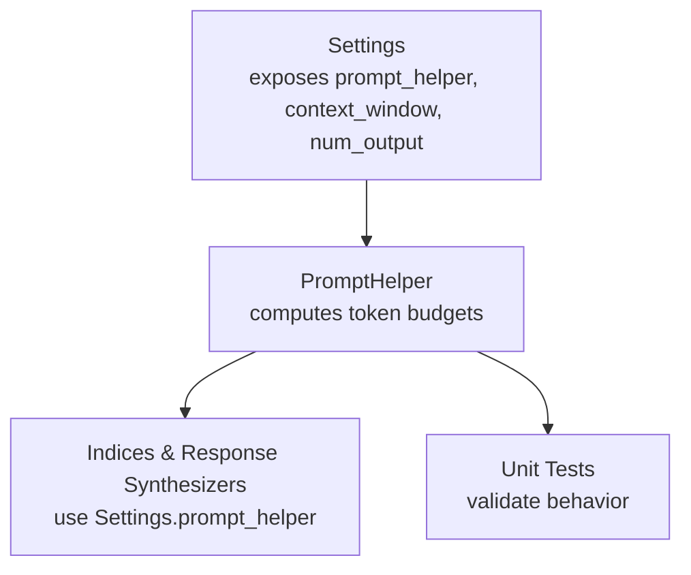
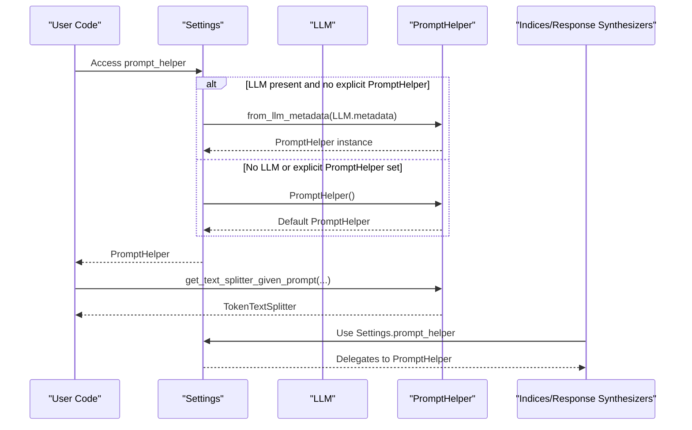
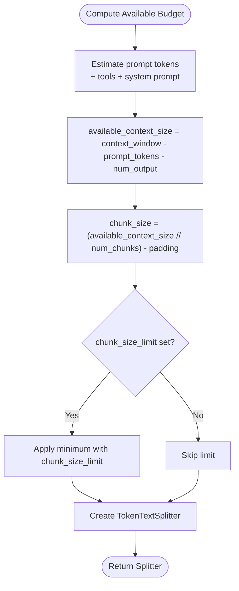
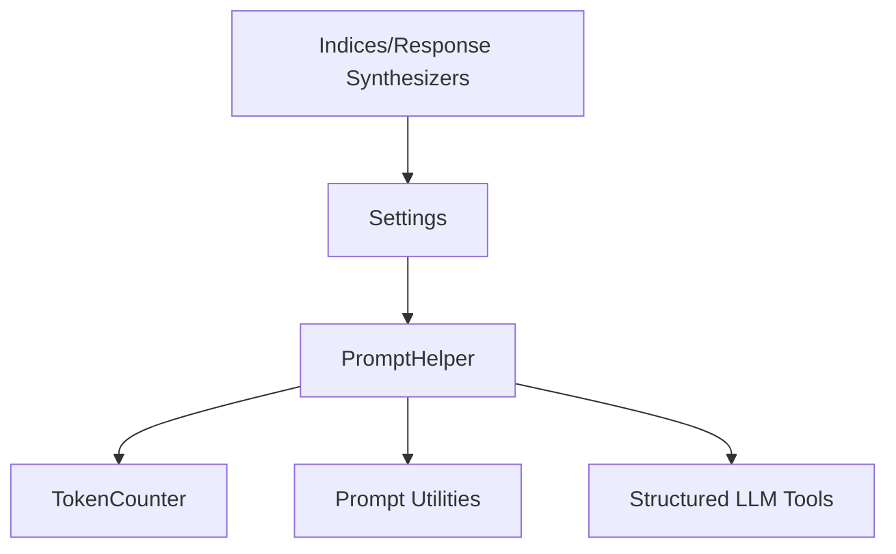

# Prompt Helper Configuration

<cite>
**Referenced Files in This Document**
- [settings.py](file://llama-index-core/llama_index/core/settings.py)
- [prompt_helper.py](file://llama-index-core/llama_index/core/indices/prompt_helper.py)
- [service_context.py](file://llama-index-core/llama_index/core/service_context.py)
- [base.py](file://llama-index-core/llama_index/core/indices/common/struct_store/base.py)
- [base.py](file://llama-index-core/llama_index/core/response_synthesizers/base.py)
- [factory.py](file://llama-index-core/llama_index/core/response_synthesizers/factory.py)
- [base.py](file://llama-index-core/llama_index/core/indices/common_tree/base.py)
- [inserter.py](file://llama-index-core/llama_index/core/indices/tree/inserter.py)
- [select_leaf_retriever.py](file://llama-index-core/llama_index/core/indices/tree/select_leaf_retriever.py)
- [test_prompt_helper.py](file://llama-index-core/tests/indices/test_prompt_helper.py)
</cite>

## Table of Contents
1. [Introduction](#introduction)
2. [Project Structure](#project-structure)
3. [Core Components](#core-components)
4. [Architecture Overview](#architecture-overview)
5. [Detailed Component Analysis](#detailed-component-analysis)
6. [Dependency Analysis](#dependency-analysis)
7. [Performance Considerations](#performance-considerations)
8. [Troubleshooting Guide](#troubleshooting-guide)
9. [Conclusion](#conclusion)
10. [Appendices](#appendices)

## Introduction
This document explains how to configure prompt helper settings within the LlamaIndex settings system. It focuses on:
- Context window sizing and output token limits
- Prompt formatting strategies and token budget allocation
- Automatic configuration via LLM metadata
- Integration with node parsers, embedding models, and query processing workflows
- Practical examples for different LLM providers and use cases

The prompt helper ensures prompts fit within an LLM’s context window by computing available token budgets, selecting appropriate chunk sizes, and offering “repack” and “truncate” strategies.

## Project Structure
Key files involved in prompt helper configuration and resolution:
- Settings singleton that exposes prompt_helper, context_window, and num_output
- PromptHelper class that computes token budgets and manages chunking
- Usage sites across indices and response synthesizers that rely on Settings or explicit PromptHelper instances
- Tests validating chunk size computation, repack/truncate behavior, and prompt formatting

**Diagram sources**
- [settings.py](file://llama-index-core/llama_index/core/settings.py#L198-L231)
- [prompt_helper.py](file://llama-index-core/llama_index/core/indices/prompt_helper.py#L108-L138)
- [base.py](file://llama-index-core/llama_index/core/indices/common/struct_store/base.py#L62-L62)
- [base.py](file://llama-index-core/llama_index/core/response_synthesizers/base.py#L75-L75)
- [factory.py](file://llama-index-core/llama_index/core/response_synthesizers/factory.py#L61-L61)
- [test_prompt_helper.py](file://llama-index-core/tests/indices/test_prompt_helper.py#L39-L64)

**Section sources**
- [settings.py](file://llama-index-core/llama_index/core/settings.py#L198-L231)
- [prompt_helper.py](file://llama-index-core/llama_index/core/indices/prompt_helper.py#L108-L138)

## Core Components
- Settings singleton
  - Exposes prompt_helper property that auto-creates a PromptHelper from LLM metadata when an LLM is present, otherwise falls back to a default PromptHelper.
  - Provides convenient aliases context_window and num_output that delegate to the underlying PromptHelper.
- PromptHelper
  - Computes available context size as context_window − prompt_tokens − num_output.
  - Provides get_text_splitter_given_prompt to derive chunk_size and chunk_overlap based on the prompt, number of chunks, and optional padding.
  - Offers truncate and repack utilities to manage text chunk sizes to fit within the computed budget.

Key behaviors:
- Automatic configuration from LLM metadata: context_window and num_output are populated from LLMMetadata when available.
- Token budget allocation: reserves tokens for prompt template and output, with padding for formatting overhead.
- Chunk size enforcement: respects chunk_size_limit and clamps negative budgets to prevent invalid splits.

**Section sources**
- [settings.py](file://llama-index-core/llama_index/core/settings.py#L198-L231)
- [prompt_helper.py](file://llama-index-core/llama_index/core/indices/prompt_helper.py#L108-L138)
- [prompt_helper.py](file://llama-index-core/llama_index/core/indices/prompt_helper.py#L143-L162)
- [prompt_helper.py](file://llama-index-core/llama_index/core/indices/prompt_helper.py#L244-L267)
- [prompt_helper.py](file://llama-index-core/llama_index/core/indices/prompt_helper.py#L269-L285)
- [prompt_helper.py](file://llama-index-core/llama_index/core/indices/prompt_helper.py#L287-L307)

## Architecture Overview
Prompt helper resolution and integration across the system:

**Diagram sources**
- [settings.py](file://llama-index-core/llama_index/core/settings.py#L198-L210)
- [prompt_helper.py](file://llama-index-core/llama_index/core/indices/prompt_helper.py#L108-L138)

## Detailed Component Analysis

### Settings and Prompt Helper Resolution
- Settings.prompt_helper resolves automatically when an LLM is configured:
  - Uses LLMMetadata to populate context_window and num_output.
  - Falls back to a default PromptHelper if no LLM is configured.
- context_window and num_output are exposed as convenient aliases delegating to the underlying PromptHelper.

Practical implications:
- If you set an LLM via Settings.llm, prompt_helper is auto-configured.
- You can override context_window and num_output after LLM assignment to fine-tune budgets.

**Section sources**
- [settings.py](file://llama-index-core/llama_index/core/settings.py#L198-L231)
- [prompt_helper.py](file://llama-index-core/llama_index/core/indices/prompt_helper.py#L108-L138)

### PromptHelper Token Budget and Chunking
PromptHelper computes:
- Available context size = context_window − prompt_tokens − num_output
- Chunk size per chunk = available_context_size // num_chunks − padding
- Enforces chunk_size_limit and validates positivity

It provides:
- get_text_splitter_given_prompt: returns a TokenTextSplitter configured to pack the available budget
- truncate: truncates individual chunks to fit the budget
- repack: merges chunks to maximize packing efficiency

**Diagram sources**
- [prompt_helper.py](file://llama-index-core/llama_index/core/indices/prompt_helper.py#L143-L162)
- [prompt_helper.py](file://llama-index-core/llama_index/core/indices/prompt_helper.py#L175-L242)
- [prompt_helper.py](file://llama-index-core/llama_index/core/indices/prompt_helper.py#L244-L267)

**Section sources**
- [prompt_helper.py](file://llama-index-core/llama_index/core/indices/prompt_helper.py#L143-L162)
- [prompt_helper.py](file://llama-index-core/llama_index/core/indices/prompt_helper.py#L175-L242)
- [prompt_helper.py](file://llama-index-core/llama_index/core/indices/prompt_helper.py#L244-L267)

### Integration with Indices and Response Synthesizers
Several internal components rely on Settings.prompt_helper or construct PromptHelper from LLMMetadata:
- Struct store indices
- Tree indices (insertion and leaf selection)
- Response synthesizers (both base and factory)

This ensures consistent context window and output token handling across retrieval and generation steps.

**Section sources**
- [base.py](file://llama-index-core/llama_index/core/indices/common/struct_store/base.py#L62-L62)
- [base.py](file://llama-index-core/llama_index/core/indices/common_tree/base.py#L46-L46)
- [inserter.py](file://llama-index-core/llama_index/core/indices/tree/inserter.py#L43-L43)
- [select_leaf_retriever.py](file://llama-index-core/llama_index/core/indices/tree/select_leaf_retriever.py#L92-L92)
- [base.py](file://llama-index-core/llama_index/core/response_synthesizers/base.py#L75-L75)
- [factory.py](file://llama-index-core/llama_index/core/response_synthesizers/factory.py#L61-L61)

### Practical Configuration Examples

Note: The following examples describe configuration steps and expected outcomes. They do not reproduce code content.

- Example A: Configure via Settings after setting an LLM
  - Set Settings.llm to a provider-specific LLM instance.
  - Adjust Settings.context_window and Settings.num_output to reflect provider capabilities and desired output length.
  - Use Settings.prompt_helper for downstream components; they will inherit the configured budget.

- Example B: Explicit PromptHelper for custom budgets
  - Instantiate PromptHelper with explicit context_window, num_output, chunk_overlap_ratio, and optional chunk_size_limit.
  - Assign Settings.prompt_helper to your instance to override automatic resolution.
  - Use get_text_splitter_given_prompt with your prompt and desired number of chunks to compute chunk sizes.

- Example C: Provider-specific tuning
  - For providers with fixed output token constraints, set num_output to match the provider’s maximum.
  - For smaller context windows, reduce context_window accordingly and increase chunk_overlap_ratio moderately to improve recall at the cost of redundancy.
  - For very large prompts (e.g., tool schemas or system prompts), increase padding to account for formatting overhead.

- Example D: Node parsing and embedding integration
  - NodeParser chunk_size and chunk_overlap are controlled via Settings.chunk_size and Settings.chunk_overlap.
  - These align with PromptHelper’s chunk_size and overlap derived from get_text_splitter_given_prompt.
  - Embedding model configuration via Settings.embed_model does not directly affect token counts but influences downstream chunking and retrieval strategies.

**Section sources**
- [settings.py](file://llama-index-core/llama_index/core/settings.py#L137-L184)
- [settings.py](file://llama-index-core/llama_index/core/settings.py#L198-L231)
- [prompt_helper.py](file://llama-index-core/llama_index/core/indices/prompt_helper.py#L244-L267)

### Prompt Formatting Strategies
PromptHelper accounts for:
- Chat vs. text prompts: estimates tokens differently for ChatPromptTemplate versus plain templates.
- Partial formatting: applies prompt.partial_format to estimate tokens in formatted placeholders.
- Tools: includes tool schemas when estimating prompt tokens for structured LLMs.
- System prompts: adds tokens for system_prompt when present.

Recommendations:
- Keep prompts concise and deterministic where possible to simplify token estimation.
- Use SelectorPromptTemplate carefully; ensure select(llm=...) is called before token estimation.
- For tool-enabled workflows, include tools explicitly so their schemas are accounted for.

**Section sources**
- [prompt_helper.py](file://llama-index-core/llama_index/core/indices/prompt_helper.py#L197-L242)

## Dependency Analysis
- Settings depends on:
  - LLM metadata for automatic PromptHelper creation
  - Token counter utilities for token estimation
- PromptHelper depends on:
  - Token counter and tokenizer
  - Prompt utilities for token estimation
  - Structured LLM tool extraction for tool schema inclusion
- Indices and response synthesizers depend on Settings for consistent configuration.

**Diagram sources**
- [settings.py](file://llama-index-core/llama_index/core/settings.py#L198-L210)
- [prompt_helper.py](file://llama-index-core/llama_index/core/indices/prompt_helper.py#L108-L138)
- [prompt_helper.py](file://llama-index-core/llama_index/core/indices/prompt_helper.py#L164-L173)
- [prompt_helper.py](file://llama-index-core/llama_index/core/indices/prompt_helper.py#L217-L226)

**Section sources**
- [settings.py](file://llama-index-core/llama_index/core/settings.py#L198-L210)
- [prompt_helper.py](file://llama-index-core/llama_index/core/indices/prompt_helper.py#L108-L138)
- [prompt_helper.py](file://llama-index-core/llama_index/core/indices/prompt_helper.py#L164-L173)
- [prompt_helper.py](file://llama-index-core/llama_index/core/indices/prompt_helper.py#L217-L226)

## Performance Considerations
- Token estimation accuracy:
  - PromptHelper estimates tokens for messages and partial formatting; ensure prompts are fully formatted before passing to get_text_splitter_given_prompt for accurate budgets.
- Padding and chunk size:
  - Higher padding reduces fragmentation but lowers packing efficiency; tune padding based on prompt complexity.
- Overlap ratio:
  - Increasing chunk_overlap_ratio improves recall for overlapping content but increases total tokens processed.
- Chunk size limit:
  - Use chunk_size_limit to cap extreme budgets and avoid oversized chunks that could degrade performance.

[No sources needed since this section provides general guidance]

## Troubleshooting Guide
Common issues and resolutions:
- Negative or zero chunk size:
  - Occurs when prompt tokens + num_output exceed context_window. Reduce num_output or increase context_window, or simplify the prompt.
- Misconfigured chunk budgets:
  - Tests demonstrate that overly large prompts with multiple chunks can lead to invalid budgets. Validate with small prompts first.
- Truncation vs. repack:
  - Use truncate for strict per-chunk limits; use repack to merge chunks and maximize packing efficiency.

Validation references:
- Chunk size computation and edge cases validated in unit tests.
- Truncate and repack behaviors verified with mock tokenizers.

**Section sources**
- [test_prompt_helper.py](file://llama-index-core/tests/indices/test_prompt_helper.py#L39-L64)
- [test_prompt_helper.py](file://llama-index-core/tests/indices/test_prompt_helper.py#L132-L151)
- [test_prompt_helper.py](file://llama-index-core/tests/indices/test_prompt_helper.py#L174-L188)

## Conclusion
Prompt helper configuration centers on two pillars:
- Automatic resolution via LLM metadata for sensible defaults
- Manual tuning of context_window, num_output, and chunking parameters for precise control

By aligning Settings.prompt_helper with your LLM and prompt design, you can reliably manage context windows, allocate token budgets, and optimize chunking across ingestion, retrieval, and generation workflows.

[No sources needed since this section summarizes without analyzing specific files]

## Appendices

### Migration Note
ServiceContext is deprecated in favor of Settings or local module injection. Migrate existing code to use Settings for prompt_helper and related configuration.

**Section sources**
- [service_context.py](file://llama-index-core/llama_index/core/service_context.py#L1-L49)