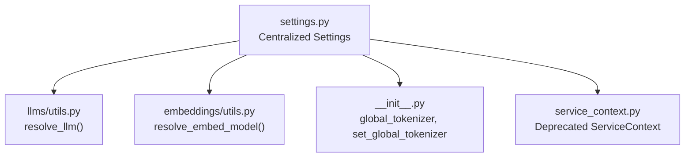
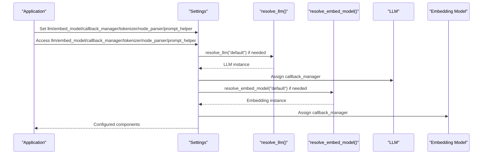
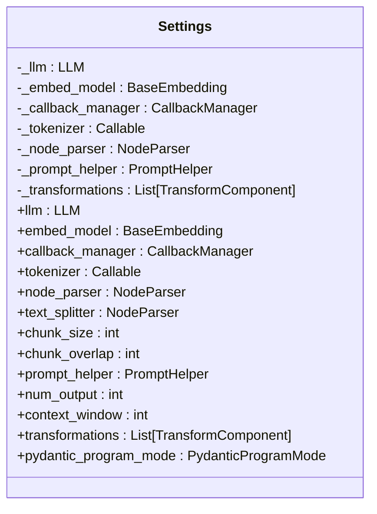
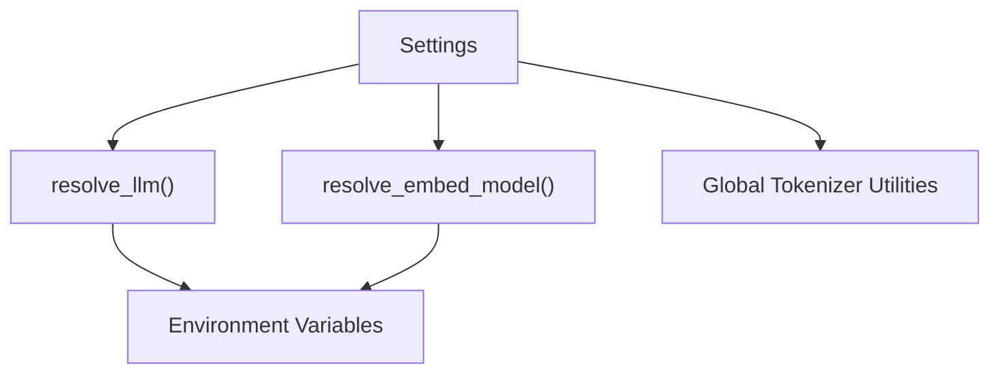

# Settings and Configuration

<cite>
**Referenced Files in This Document**
- [settings.py](file://llama-index-core/llama_index/core/settings.py)
- [service_context.py](file://llama-index-core/llama_index/core/service_context.py)
- [__init__.py](file://llama-index-core/llama_index/core/__init__.py)
- [utils.py (LLMs)](file://llama-index-core/llama_index/core/llms/utils.py)
- [utils.py (Embeddings)](file://llama-index-core/llama_index/core/embeddings/utils.py)
- [README.md](file://README.md)
</cite>

## Table of Contents
1. [Introduction](#introduction)
2. [Project Structure](#project-structure)
3. [Core Components](#core-components)
4. [Architecture Overview](#architecture-overview)
5. [Detailed Component Analysis](#detailed-component-analysis)
6. [Dependency Analysis](#dependency-analysis)
7. [Performance Considerations](#performance-considerations)
8. [Troubleshooting Guide](#troubleshooting-guide)
9. [Conclusion](#conclusion)
10. [Appendices](#appendices)

## Introduction
This document explains the centralized Settings class that replaces the deprecated ServiceContext. It covers how Settings manages LLM configuration, embedding model setup, callback manager management, tokenizer configuration, node parser settings, and prompt helper setup. It also describes the lazy initialization pattern, property-based accessors, and setter methods for each configuration component. Practical examples show how to configure different LLM providers, embedding models, and callback handlers. The document clarifies the relationship between Settings and ServiceContextElements, token counting, and transformation pipelines. It addresses environment variable configuration, default value resolution, and best practices for production deployments.

## Project Structure
Settings is part of the core LlamaIndex framework and integrates with LLM resolution, embedding resolution, and global utilities. The following diagram shows the primary files involved in the configuration system.

**Diagram sources**
- [settings.py](file://llama-index-core/llama_index/core/settings.py#L1-L249)
- [utils.py (LLMs)](file://llama-index-core/llama_index/core/llms/utils.py#L1-L185)
- [utils.py (Embeddings)](file://llama-index-core/llama_index/core/embeddings/utils.py#L1-L141)
- [__init__.py](file://llama-index-core/llama_index/core/__init__.py#L1-L162)
- [service_context.py](file://llama-index-core/llama_index/core/service_context.py#L1-L49)

**Section sources**
- [settings.py](file://llama-index-core/llama_index/core/settings.py#L1-L249)
- [service_context.py](file://llama-index-core/llama_index/core/service_context.py#L1-L49)
- [__init__.py](file://llama-index-core/llama_index/core/__init__.py#L77-L162)

## Core Components
- Centralized Settings singleton that lazily initializes and exposes configuration properties for LLM, embeddings, callback manager, tokenizer, node parser, prompt helper, and transformations.
- Property-based accessors with setters for each component, ensuring consistent configuration across the framework.
- Integration with resolution utilities that handle default provider selection and environment-aware fallbacks.
- Deprecated ServiceContext replaced by Settings and direct module passing to APIs.

Key responsibilities:
- LLM configuration via property and setter, with default resolution and callback propagation.
- Embedding model configuration via property and setter, with default resolution and callback propagation.
- Callback manager management with automatic propagation to LLM and embeddings.
- Tokenizer configuration with support for Transformers tokenizer instances.
- Node parser and text splitter configuration with chunk size and overlap accessors.
- Prompt helper configuration derived from LLM metadata or explicit override.
- Transformations pipeline composed from node parser by default.

**Section sources**
- [settings.py](file://llama-index-core/llama_index/core/settings.py#L17-L249)

## Architecture Overview
The Settings class orchestrates configuration resolution and propagation across the framework. The diagram below shows how Settings interacts with LLM and embedding resolution utilities and how it exposes properties to downstream components.

**Diagram sources**
- [settings.py](file://llama-index-core/llama_index/core/settings.py#L32-L104)
- [utils.py (LLMs)](file://llama-index-core/llama_index/core/llms/utils.py#L15-L110)
- [utils.py (Embeddings)](file://llama-index-core/llama_index/core/embeddings/utils.py#L31-L140)

## Detailed Component Analysis

### Settings Class and Lazy Initialization
- The Settings class is a singleton that lazily initializes internal components on first access.
- Properties return resolved instances when None, ensuring defaults are applied only when needed.
- Setters accept either resolved instances or provider identifiers (strings) that are resolved via dedicated utilities.

Behavior highlights:
- LLM property resolves to a default provider if unset; propagates callback manager automatically.
- Embedding model property resolves to a default provider if unset; propagates callback manager automatically.
- Callback manager property creates a default manager if none is set.
- Tokenizer property reads from global tokenizer or falls back to framework tokenizer.
- Node parser property defaults to a sentence splitter; supports chunk size and overlap accessors.
- Prompt helper property derives from LLM metadata if present; otherwise uses a default helper.
- Transformations property defaults to a list containing the node parser.

**Diagram sources**
- [settings.py](file://llama-index-core/llama_index/core/settings.py#L17-L249)

**Section sources**
- [settings.py](file://llama-index-core/llama_index/core/settings.py#L17-L249)

### LLM Configuration
- Property accessor returns a resolved LLM instance, defaulting to a provider-specific default when "default" is requested.
- Setter accepts a provider identifier string, an LLM instance, or a LangChain-compatible model, delegating resolution to the LLM utility.
- Callback manager is propagated to the LLM if present.

Environment-aware behavior:
- In testing environments, a mock LLM is returned by default.
- If OpenAI is unavailable, a fallback provider may be attempted depending on the utility’s logic.

Practical example paths:
- Configure a non-OpenAI LLM and tokenizer, then build an index using Settings.

**Section sources**
- [settings.py](file://llama-index-core/llama_index/core/settings.py#L32-L56)
- [utils.py (LLMs)](file://llama-index-core/llama_index/core/llms/utils.py#L15-L110)
- [README.md](file://README.md#L118-L152)

### Embedding Model Setup
- Property accessor returns a resolved embedding model instance, defaulting to a provider-specific default when "default" is requested.
- Setter accepts a provider identifier string, an embedding instance, or a LangChain-compatible embedding, delegating resolution to the embedding utility.
- Callback manager is propagated to the embedding model if present.

Environment-aware behavior:
- In testing environments, a mock embedding is returned by default.
- If OpenAI embeddings are unavailable, the utility suggests alternatives and raises informative errors.

Practical example paths:
- Configure an embedding model and build an index using Settings.

**Section sources**
- [settings.py](file://llama-index-core/llama_index/core/settings.py#L60-L74)
- [utils.py (Embeddings)](file://llama-index-core/llama_index/core/embeddings/utils.py#L31-L140)
- [README.md](file://README.md#L143-L151)

### Callback Manager Management
- Property accessor returns a default callback manager if none is set.
- Setters allow replacing the callback manager globally.
- Callback managers are automatically propagated to LLM and embedding instances upon resolution/access.

Best practice:
- Configure a single callback manager and attach instrumentation handlers to capture metrics and traces consistently across components.

**Section sources**
- [settings.py](file://llama-index-core/llama_index/core/settings.py#L95-L104)
- [utils.py (LLMs)](file://llama-index-core/llama_index/core/llms/utils.py#L106-L108)
- [utils.py (Embeddings)](file://llama-index-core/llama_index/core/embeddings/utils.py#L138-L139)

### Tokenizer Configuration
- Property accessor reads from a global tokenizer if set; otherwise falls back to the framework’s tokenizer.
- Setter accepts a callable or a Transformers tokenizer instance; the latter is normalized to a callable encoding function.
- Global tokenizer is set via a framework utility.

Production tip:
- Align the tokenizer with the LLM’s expected tokenization to ensure accurate context window calculations and prompt helper behavior.

**Section sources**
- [settings.py](file://llama-index-core/llama_index/core/settings.py#L108-L133)
- [__init__.py](file://llama-index-core/llama_index/core/__init__.py#L160-L162)

### Node Parser and Text Splitter
- Property accessor defaults to a sentence splitter if none is configured.
- Setters replace the node parser instance.
- Convenience aliases expose the node parser as text_splitter.
- Chunk size and overlap accessors delegate to the underlying node parser if supported.

Usage:
- Configure chunk size and overlap to balance recall and cost; ensure the node parser supports these attributes.

**Section sources**
- [settings.py](file://llama-index-core/llama_index/core/settings.py#L137-L195)

### Prompt Helper Setup
- Property accessor derives a prompt helper from LLM metadata if available; otherwise constructs a default helper.
- Setters allow overriding the prompt helper explicitly.
- Convenience accessors expose num_output and context_window for quick tuning.

Relationship to token counting:
- Prompt helper governs token budgeting and context window sizing; align with tokenizer expectations.

**Section sources**
- [settings.py](file://llama-index-core/llama_index/core/settings.py#L198-L230)

### Transformations Pipeline
- Property accessor defaults to a list containing the node parser.
- Setters allow replacing the entire transformations pipeline.
- This enables composing multiple TransformComponents for preprocessing.

**Section sources**
- [settings.py](file://llama-index-core/llama_index/core/settings.py#L234-L244)

### Relationship to ServiceContextElements
- ServiceContext is deprecated and raises explicit errors when instantiated or constructed from defaults.
- Settings replaces ServiceContext by exposing top-level configuration properties and leveraging resolution utilities.
- Downstream components consume Settings directly or receive modules via local parameters.

Migration guidance:
- Replace ServiceContext usage with Settings property assignments and pass modules directly to APIs where applicable.

**Section sources**
- [service_context.py](file://llama-index-core/llama_index/core/service_context.py#L4-L49)
- [settings.py](file://llama-index-core/llama_index/core/settings.py#L1-L249)

## Dependency Analysis
Settings depends on:
- LLM resolution utility for default provider selection and environment-aware fallbacks.
- Embedding resolution utility for default provider selection and environment-aware fallbacks.
- Global tokenizer utilities for tokenizer configuration.
- Callback manager for propagating instrumentation across components.

**Diagram sources**
- [settings.py](file://llama-index-core/llama_index/core/settings.py#L1-L249)
- [utils.py (LLMs)](file://llama-index-core/llama_index/core/llms/utils.py#L1-L185)
- [utils.py (Embeddings)](file://llama-index-core/llama_index/core/embeddings/utils.py#L1-L141)
- [__init__.py](file://llama-index-core/llama_index/core/__init__.py#L86-L162)

**Section sources**
- [settings.py](file://llama-index-core/llama_index/core/settings.py#L1-L249)
- [utils.py (LLMs)](file://llama-index-core/llama_index/core/llms/utils.py#L1-L185)
- [utils.py (Embeddings)](file://llama-index-core/llama_index/core/embeddings/utils.py#L1-L141)
- [__init__.py](file://llama-index-core/llama_index/core/__init__.py#L86-L162)

## Performance Considerations
- Lazy initialization avoids unnecessary instantiation of LLM and embedding models until accessed.
- Default provider resolution occurs only on first access, minimizing startup overhead.
- Propagating a single callback manager reduces duplication and improves instrumentation efficiency.
- Aligning tokenizer with the LLM prevents repeated tokenization recalculations and ensures accurate context window estimates.

[No sources needed since this section provides general guidance]

## Troubleshooting Guide
Common issues and resolutions:
- Import errors for LLM or embedding providers: The resolution utilities raise informative ImportError messages when required integration packages are missing. Install the appropriate integration package and retry.
- Authentication failures for default providers: The resolution utilities validate API keys and raise ValueError with guidance when credentials are invalid. Verify environment variables and retry.
- Missing chunk size or overlap attributes: If the configured node parser lacks these attributes, Settings raises a ValueError. Ensure the node parser supports chunk size and overlap or adjust configuration.
- Deprecated ServiceContext usage: Attempts to instantiate or construct ServiceContext raise explicit errors. Migrate to Settings and direct module passing.

**Section sources**
- [utils.py (LLMs)](file://llama-index-core/llama_index/core/llms/utils.py#L42-L57)
- [utils.py (Embeddings)](file://llama-index-core/llama_index/core/embeddings/utils.py#L58-L77)
- [settings.py](file://llama-index-core/llama_index/core/settings.py#L154-L183)
- [service_context.py](file://llama-index-core/llama_index/core/service_context.py#L13-L19)

## Conclusion
Settings centralizes configuration for LLMs, embeddings, callbacks, tokenization, parsing, prompting, and transformations. Its lazy initialization and property-based accessors simplify setup while enabling environment-aware defaults and consistent propagation of instrumentation. Migrating from the deprecated ServiceContext to Settings streamlines configuration and improves maintainability. For production, align tokenizers with LLMs, configure a single callback manager, and validate provider credentials early.

[No sources needed since this section summarizes without analyzing specific files]

## Appendices

### Practical Configuration Examples
- Configure a non-OpenAI LLM and tokenizer, then build an index using Settings.
- Configure an embedding model and build an index using Settings.

Example paths:
- [README.md](file://README.md#L118-L152)

### Environment Variable Configuration
- LLM resolution checks for testing mode and default provider availability.
- Embedding resolution checks for testing mode and default provider availability.
- Ensure environment variables for provider credentials are set before accessing default providers.

Example paths:
- [utils.py (LLMs)](file://llama-index-core/llama_index/core/llms/utils.py#L26-L33)
- [utils.py (Embeddings)](file://llama-index-core/llama_index/core/embeddings/utils.py#L43-L47)