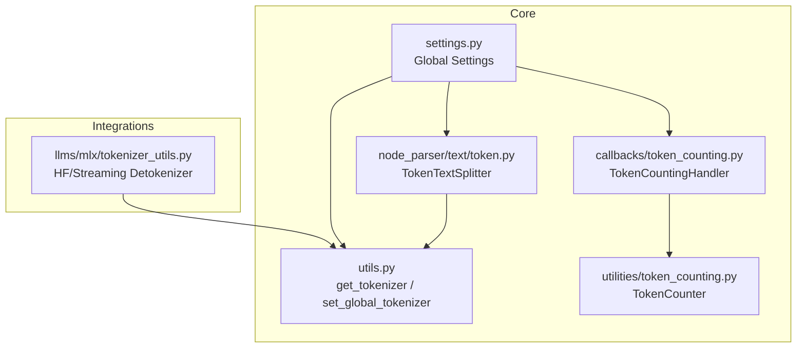
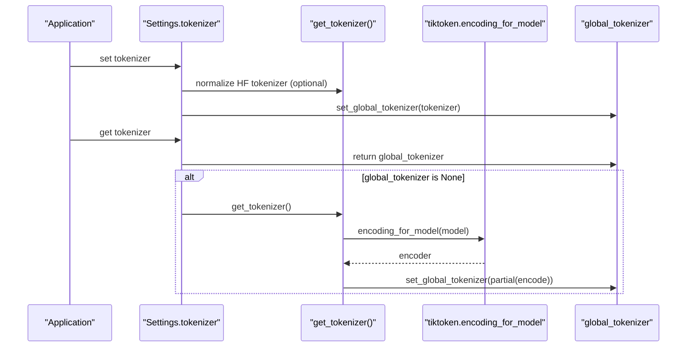
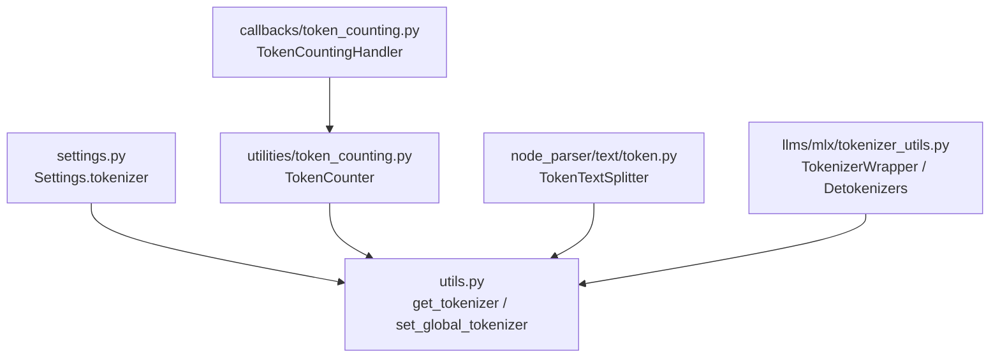

# Tokenization

<cite>
**Referenced Files in This Document**
- [settings.py](file://llama-index-core/llama_index/core/settings.py)
- [utils.py](file://llama-index-core/llama_index/core/utils.py)
- [token_counting.py](file://llama-index-core/llama_index/core/utilities/token_counting.py)
- [token_counting_callback.py](file://llama-index-core/llama_index/core/callbacks/token_counting.py)
- [token_text_splitter.py](file://llama-index-core/llama_index/core/node_parser/text/token.py)
- [token_based_code_splitter_example.py](file://examples/token_based_code_splitter_example.py)
- [mlx_tokenizer_utils.py](file://llama-index-integrations/llms/llama-index-llms-mlx/llama_index/llms/mlx/tokenizer_utils.py)
</cite>

## Table of Contents
1. [Introduction](#introduction)
2. [Project Structure](#project-structure)
3. [Core Components](#core-components)
4. [Architecture Overview](#architecture-overview)
5. [Detailed Component Analysis](#detailed-component-analysis)
6. [Dependency Analysis](#dependency-analysis)
7. [Performance Considerations](#performance-considerations)
8. [Troubleshooting Guide](#troubleshooting-guide)
9. [Conclusion](#conclusion)
10. [Appendices](#appendices)

## Introduction
This document explains how tokenization is configured and used in the LlamaIndex settings system. It covers how to configure tokenizers for different LLM providers and text-processing scenarios, how the tokenizer resolution mechanism works, how to integrate Hugging Face transformers tokenizers, and how to set up custom tokenizers. It also addresses tokenizer compatibility, special token handling, performance optimization, integration with LLM context windows, prompt length management, and token counting utilities.

## Project Structure
The tokenization configuration and usage spans several modules:
- Settings: central configuration for the global tokenizer and related components
- Utilities: global tokenizer factory and helpers
- Token counting: utilities and callback handlers for counting tokens
- Text splitting: token-aware chunking for node parsing
- Integrations: Hugging Face and MLX-specific tokenizer utilities

**Diagram sources**
- [settings.py](file://llama-index-core/llama_index/core/settings.py#L108-L134)
- [utils.py](file://llama-index-core/llama_index/core/utils.py#L143-L172)
- [token_counting.py](file://llama-index-core/llama_index/core/utilities/token_counting.py#L10-L34)
- [token_counting_callback.py](file://llama-index-core/llama_index/core/callbacks/token_counting.py#L143-L176)
- [token_text_splitter.py](file://llama-index-core/llama_index/core/node_parser/text/token.py#L22-L84)
- [mlx_tokenizer_utils.py](file://llama-index-integrations/llms/llama-index-llms-mlx/llama_index/llms/mlx/tokenizer_utils.py#L311-L335)

**Section sources**
- [settings.py](file://llama-index-core/llama_index/core/settings.py#L108-L134)
- [utils.py](file://llama-index-core/llama_index/core/utils.py#L143-L172)
- [token_counting.py](file://llama-index-core/llama_index/core/utilities/token_counting.py#L10-L34)
- [token_counting_callback.py](file://llama-index-core/llama_index/core/callbacks/token_counting.py#L143-L176)
- [token_text_splitter.py](file://llama-index-core/llama_index/core/node_parser/text/token.py#L22-L84)
- [mlx_tokenizer_utils.py](file://llama-index-integrations/llms/llama-index-llms-mlx/llama_index/llms/mlx/tokenizer_utils.py#L311-L335)

## Core Components
- Global tokenizer configuration via Settings.tokenizer
- Global tokenizer factory and caching via get_tokenizer
- Token counting utilities and callback handler
- Token-aware text splitting for node parsing
- Hugging Face and MLX streaming detokenizer utilities

Key responsibilities:
- Settings.tokenizer setter normalizes Hugging Face PreTrainedTokenizerBase instances to a callable encode function without special tokens
- get_tokenizer resolves a global tokenizer, defaults to tiktoken, caches it, and sets it globally
- TokenCounter and TokenCountingHandler provide token counting for strings, messages, and embedding chunks
- TokenTextSplitter performs token-aware chunking with overlap and metadata-aware sizing
- MLX/HF utilities provide streaming detokenization and tokenizer wrappers

**Section sources**
- [settings.py](file://llama-index-core/llama_index/core/settings.py#L108-L134)
- [utils.py](file://llama-index-core/llama_index/core/utils.py#L143-L172)
- [token_counting.py](file://llama-index-core/llama_index/core/utilities/token_counting.py#L10-L34)
- [token_counting_callback.py](file://llama-index-core/llama_index/core/callbacks/token_counting.py#L143-L176)
- [token_text_splitter.py](file://llama-index-core/llama_index/core/node_parser/text/token.py#L22-L84)
- [mlx_tokenizer_utils.py](file://llama-index-integrations/llms/llama-index-llms-mlx/llama_index/llms/mlx/tokenizer_utils.py#L311-L335)

## Architecture Overview
The tokenizer configuration architecture centers on a singleton Settings object that exposes a tokenizer property. Internally, the global tokenizer is resolved by a factory that prefers tiktoken and falls back to a global callable. Token counting and text splitting consume this global tokenizer, while integrations can wrap or replace it.

**Diagram sources**
- [settings.py](file://llama-index-core/llama_index/core/settings.py#L108-L134)
- [utils.py](file://llama-index-core/llama_index/core/utils.py#L143-L172)

## Detailed Component Analysis

### Tokenizer Resolution and Global Tokenizer Factory
- Settings.tokenizer getter returns the global tokenizer if set; otherwise resolves via get_tokenizer
- Settings.tokenizer setter accepts either a callable or a Hugging Face PreTrainedTokenizerBase; if the latter, it wraps encode(add_special_tokens=False) to ensure consistent behavior
- get_tokenizer ensures tiktoken availability, creates an encoder for a given model, and caches the encoder’s encode function globally

Practical implications:
- For OpenAI models, get_tokenizer defaults to a model name and uses tiktoken encoding
- For Hugging Face models, pass a PreTrainedTokenizerBase to leverage HF tokenizers; the Settings setter automatically strips special tokens
- For custom tokenizers, pass a callable that takes a string and returns a list-like token representation

**Section sources**
- [settings.py](file://llama-index-core/llama_index/core/settings.py#L108-L134)
- [utils.py](file://llama-index-core/llama_index/core/utils.py#L143-L172)

### Token Counting Utilities
- TokenCounter: counts tokens for strings and estimates tokens for chat messages and tools
- TokenCountingHandler: callback handler that integrates with the callback system to track LLM and embedding token usage, falling back to TokenCounter when provider usage is unavailable

Usage patterns:
- Estimate tokens in messages for context window planning
- Count embedding chunks for cost monitoring
- Aggregate totals across traces

**Section sources**
- [token_counting.py](file://llama-index-core/llama_index/core/utilities/token_counting.py#L10-L34)
- [token_counting.py](file://llama-index-core/llama_index/core/utilities/token_counting.py#L35-L85)
- [token_counting.py](file://llama-index-core/llama_index/core/utilities/token_counting.py#L87-L104)
- [token_counting_callback.py](file://llama-index-core/llama_index/core/callbacks/token_counting.py#L143-L176)
- [token_counting_callback.py](file://llama-index-core/llama_index/core/callbacks/token_counting.py#L79-L141)

### Token-Aware Text Splitting
- TokenTextSplitter splits text into token-sized chunks respecting chunk size and overlap
- It reserves space for metadata formatting and warns when effective chunk size becomes small
- It merges splits using separators and characters, maintaining overlap across chunk boundaries

Integration with context windows:
- Combine TokenTextSplitter with Settings.context_window and Settings.num_output to size chunks conservatively
- Use TokenCounter to estimate prompt sizes before splitting

**Section sources**
- [token_text_splitter.py](file://llama-index-core/llama_index/core/node_parser/text/token.py#L22-L84)
- [token_text_splitter.py](file://llama-index-core/llama_index/core/node_parser/text/token.py#L117-L137)
- [token_text_splitter.py](file://llama-index-core/llama_index/core/node_parser/text/token.py#L138-L157)
- [token_text_splitter.py](file://llama-index-core/llama_index/core/node_parser/text/token.py#L159-L186)
- [token_text_splitter.py](file://llama-index-core/llama_index/core/node_parser/text/token.py#L188-L242)

### Hugging Face Transformer Tokenizer Integration
- The Settings.tokenizer setter recognizes PreTrainedTokenizerBase and converts it to a callable that excludes special tokens
- MLX integration provides streaming detokenization utilities and a tokenizer wrapper that inspects tokenizer.json to select optimal detokenizers for SPM/BPE decoders

Compatibility and special tokens:
- Transformers tokenizers are supported; special tokens are disabled by default for consistent counting
- Streaming detokenization enables efficient decoding during generation

**Section sources**
- [settings.py](file://llama-index-core/llama_index/core/settings.py#L119-L134)
- [mlx_tokenizer_utils.py](file://llama-index-integrations/llms/llama-index-llms-mlx/llama_index/llms/mlx/tokenizer_utils.py#L311-L335)
- [mlx_tokenizer_utils.py](file://llama-index-integrations/llms/llama-index-llms-mlx/llama_index/llms/mlx/tokenizer_utils.py#L15-L66)

### Practical Configuration Examples

Note: The following examples describe configuration steps. They reference specific files for context without reproducing code.

- Configure a Hugging Face tokenizer for a local model path:
  - Use the Settings.tokenizer setter with a PreTrainedTokenizerBase loaded from a local path
  - The setter will normalize it to exclude special tokens
  - Reference: [settings.py](file://llama-index-core/llama_index/core/settings.py#L119-L134), [mlx_tokenizer_utils.py](file://llama-index-integrations/llms/llama-index-llms-mlx/llama_index/llms/mlx/tokenizer_utils.py#L311-L335)

- Configure a custom tokenizer:
  - Pass a callable to Settings.tokenizer that returns a list-like token representation
  - Ensure the callable is deterministic and efficient
  - Reference: [settings.py](file://llama-index-core/llama_index/core/settings.py#L119-L134)

- Configure OpenAI-style tokenization:
  - Rely on get_tokenizer to resolve tiktoken for a given model name
  - Optionally pre-warm the global tokenizer to avoid first-use latency
  - Reference: [utils.py](file://llama-index-core/llama_index/core/utils.py#L143-L172)

- Integrate with context windows and prompt length management:
  - Use TokenCounter.estimate_tokens_in_messages to estimate prompt size
  - Adjust TokenTextSplitter chunk_size and overlap based on Settings.context_window and Settings.num_output
  - Reference: [token_counting.py](file://llama-index-core/llama_index/core/utilities/token_counting.py#L35-L85), [token_text_splitter.py](file://llama-index-core/llama_index/core/node_parser/text/token.py#L117-L137)

- Token-based code splitting:
  - Use the example script to compare character-based vs token-based splitting and to apply custom tokenizers
  - Reference: [token_based_code_splitter_example.py](file://examples/token_based_code_splitter_example.py#L113-L166)

**Section sources**
- [settings.py](file://llama-index-core/llama_index/core/settings.py#L119-L134)
- [utils.py](file://llama-index-core/llama_index/core/utils.py#L143-L172)
- [token_counting.py](file://llama-index-core/llama_index/core/utilities/token_counting.py#L35-L85)
- [token_text_splitter.py](file://llama-index-core/llama_index/core/node_parser/text/token.py#L117-L137)
- [mlx_tokenizer_utils.py](file://llama-index-integrations/llms/llama-index-llms-mlx/llama_index/llms/mlx/tokenizer_utils.py#L311-L335)
- [token_based_code_splitter_example.py](file://examples/token_based_code_splitter_example.py#L113-L166)

## Dependency Analysis
The following diagram shows how components depend on each other for tokenization:

**Diagram sources**
- [settings.py](file://llama-index-core/llama_index/core/settings.py#L108-L134)
- [utils.py](file://llama-index-core/llama_index/core/utils.py#L143-L172)
- [token_counting.py](file://llama-index-core/llama_index/core/utilities/token_counting.py#L10-L34)
- [token_counting_callback.py](file://llama-index-core/llama_index/core/callbacks/token_counting.py#L143-L176)
- [token_text_splitter.py](file://llama-index-core/llama_index/core/node_parser/text/token.py#L22-L84)
- [mlx_tokenizer_utils.py](file://llama-index-integrations/llms/llama-index-llms-mlx/llama_index/llms/mlx/tokenizer_utils.py#L311-L335)

**Section sources**
- [settings.py](file://llama-index-core/llama_index/core/settings.py#L108-L134)
- [utils.py](file://llama-index-core/llama_index/core/utils.py#L143-L172)
- [token_counting.py](file://llama-index-core/llama_index/core/utilities/token_counting.py#L10-L34)
- [token_counting_callback.py](file://llama-index-core/llama_index/core/callbacks/token_counting.py#L143-L176)
- [token_text_splitter.py](file://llama-index-core/llama_index/core/node_parser/text/token.py#L22-L84)
- [mlx_tokenizer_utils.py](file://llama-index-integrations/llms/llama-index-llms-mlx/llama_index/llms/mlx/tokenizer_utils.py#L311-L335)

## Performance Considerations
- Global tokenizer caching: get_tokenizer caches the encoder globally to avoid repeated initialization
- Special token handling: disabling special tokens in HF tokenizers avoids extra overhead and inconsistent counts
- Streaming detokenization: MLX utilities provide optimized streaming decoding for long generations
- Chunk sizing: TokenTextSplitter enforces chunk_size and chunk_overlap constraints; ensure chunk_overlap does not exceed chunk_size
- Token estimation: Prefer TokenCounter.estimate_tokens_in_messages for prompt sizing to avoid underestimation

[No sources needed since this section provides general guidance]

## Troubleshooting Guide
Common issues and resolutions:
- Missing tiktoken: get_tokenizer raises an import error if tiktoken is not installed; install tiktoken to enable default tokenization
- Unexpected token counts with HF tokenizers: ensure the tokenizer is normalized by Settings.tokenizer setter to exclude special tokens
- Overly large chunks: adjust TokenTextSplitter chunk_size or increase overlap; check metadata length reservations
- Inconsistent counts across runs: ensure the same tokenizer is used globally; avoid switching tokenizers mid-run

**Section sources**
- [utils.py](file://llama-index-core/llama_index/core/utils.py#L147-L153)
- [settings.py](file://llama-index-core/llama_index/core/settings.py#L119-L134)
- [token_text_splitter.py](file://llama-index-core/llama_index/core/node_parser/text/token.py#L64-L68)

## Conclusion
LlamaIndex provides a flexible, centralized tokenizer configuration through Settings.tokenizer, backed by a robust global factory in utils.py. Token counting utilities and token-aware text splitting integrate seamlessly with context windows and prompt length management. Hugging Face and MLX integrations offer advanced capabilities, including streaming detokenization and automatic decoder inference. By configuring the global tokenizer appropriately—whether via tiktoken for OpenAI models, HF transformers for custom models, or custom callables—you can ensure accurate token accounting, predictable chunking, and efficient processing across diverse LLM providers and text-processing scenarios.

## Appendices

### API and Behavior Summary
- Settings.tokenizer
  - Getter: returns global_tokenizer or resolves via get_tokenizer
  - Setter: accepts callable or HF PreTrainedTokenizerBase; normalizes to exclude special tokens
- get_tokenizer(model_name)
  - Resolves tiktoken encoder for model_name, caches it globally, and returns a callable encode function
- TokenCounter
  - get_string_tokens: counts tokens in a string
  - estimate_tokens_in_messages: estimates tokens for chat messages and tools
- TokenTextSplitter
  - Token-aware chunking with overlap and metadata reservation
- TokenCountingHandler
  - Callback-based token usage tracking for LLM and embedding events

**Section sources**
- [settings.py](file://llama-index-core/llama_index/core/settings.py#L108-L134)
- [utils.py](file://llama-index-core/llama_index/core/utils.py#L143-L172)
- [token_counting.py](file://llama-index-core/llama_index/core/utilities/token_counting.py#L10-L34)
- [token_text_splitter.py](file://llama-index-core/llama_index/core/node_parser/text/token.py#L22-L84)
- [token_counting_callback.py](file://llama-index-core/llama_index/core/callbacks/token_counting.py#L143-L176)