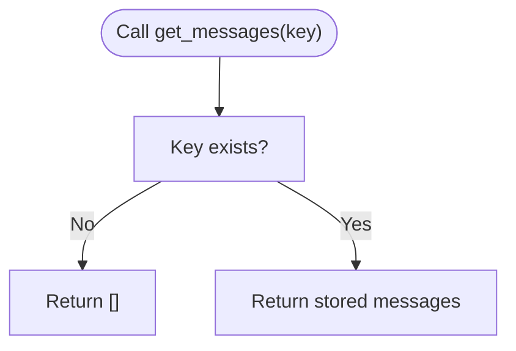

# Chat Store

<cite>
**Referenced Files in This Document**
- [base.py](file://llama-index-core/llama_index/core/storage/chat_store/base.py)
- [simple_chat_store.py](file://llama-index-core/llama_index/core/storage/chat_store/simple_chat_store.py)
- [base_db.py](file://llama-index-core/llama_index/core/storage/chat_store/base_db.py)
- [sql.py](file://llama-index-core/llama_index/core/storage/chat_store/sql.py)
- [loading.py](file://llama-index-core/llama_index/core/storage/chat_store/loading.py)
- [chat_stores.md](file://docs/src/content/docs/framework/module_guides/storing/chat_stores.md)
- [test_simple_chat_store.py](file://llama-index-core/tests/storage/chat_store/test_simple_chat_store.py)
</cite>

## Table of Contents
1. [Introduction](#introduction)
2. [Project Structure](#project-structure)
3. [Core Components](#core-components)
4. [Architecture Overview](#architecture-overview)
5. [Detailed Component Analysis](#detailed-component-analysis)
6. [Dependency Analysis](#dependency-analysis)
7. [Performance Considerations](#performance-considerations)
8. [Troubleshooting Guide](#troubleshooting-guide)
9. [Conclusion](#conclusion)
10. [Appendices](#appendices)

## Introduction
This document explains the Chat Store component of LlamaIndex storage system. It focuses on the BaseChatStore interface, the SimpleChatStore implementation, and the broader ecosystem of database-backed chat stores. It covers how chat messages, session data, and conversation metadata are stored and managed, and how chat stores integrate with memory modules and chat engines. Practical examples demonstrate configuration, persistence, retrieval, and session management patterns.

## Project Structure
The Chat Store functionality resides under the core storage module and is complemented by documentation and tests. The key files include the base interface, a simple in-memory implementation, a database abstraction, and a concrete SQLAlchemy-backed implementation. A loader utility recognizes known chat store types.

**Diagram sources**
- [base.py](file://llama-index-core/llama_index/core/storage/chat_store/base.py#L11-L79)
- [simple_chat_store.py](file://llama-index-core/llama_index/core/storage/chat_store/simple_chat_store.py#L31-L113)
- [base_db.py](file://llama-index-core/llama_index/core/storage/chat_store/base_db.py#L9-L102)
- [sql.py](file://llama-index-core/llama_index/core/storage/chat_store/sql.py#L35-L457)
- [loading.py](file://llama-index-core/llama_index/core/storage/chat_store/loading.py#L4-L19)
- [chat_stores.md](file://docs/src/content/docs/framework/module_guides/storing/chat_stores.md#L1-L437)
- [test_simple_chat_store.py](file://llama-index-core/tests/storage/chat_store/test_simple_chat_store.py#L1-L77)

**Section sources**
- [base.py](file://llama-index-core/llama_index/core/storage/chat_store/base.py#L1-L79)
- [simple_chat_store.py](file://llama-index-core/llama_index/core/storage/chat_store/simple_chat_store.py#L1-L113)
- [base_db.py](file://llama-index-core/llama_index/core/storage/chat_store/base_db.py#L1-L102)
- [sql.py](file://llama-index-core/llama_index/core/storage/chat_store/sql.py#L1-L457)
- [loading.py](file://llama-index-core/llama_index/core/storage/chat_store/loading.py#L1-L19)
- [chat_stores.md](file://docs/src/content/docs/framework/module_guides/storing/chat_stores.md#L1-L437)
- [test_simple_chat_store.py](file://llama-index-core/tests/storage/chat_store/test_simple_chat_store.py#L1-L77)

## Core Components
- BaseChatStore: Defines the contract for chat history storage, including synchronous and asynchronous methods for setting, retrieving, appending, and deleting messages, as well as listing keys.
- SimpleChatStore: An in-memory chat store with optional persistence to disk via JSON serialization. It supports insertion at index and deletion semantics.
- AsyncDBChatStore and MessageStatus: Abstract base for database-backed stores and the status enumeration used to manage active vs archived messages.
- SQLAlchemyChatStore: A concrete database-backed chat store using SQLAlchemy async engine, with rich operations including counting, ordering by insertion time, archiving, and dumping data for in-memory scenarios.
- Loading utility: Recognizes known chat store types and loads them from dictionaries.

**Section sources**
- [base.py](file://llama-index-core/llama_index/core/storage/chat_store/base.py#L11-L79)
- [simple_chat_store.py](file://llama-index-core/llama_index/core/storage/chat_store/simple_chat_store.py#L31-L113)
- [base_db.py](file://llama-index-core/llama_index/core/storage/chat_store/base_db.py#L9-L102)
- [sql.py](file://llama-index-core/llama_index/core/storage/chat_store/sql.py#L35-L457)
- [loading.py](file://llama-index-core/llama_index/core/storage/chat_store/loading.py#L4-L19)

## Architecture Overview
The chat store architecture separates concerns between in-memory and persistent storage, while enabling database-backed implementations with advanced features like status tracking and ordered retrieval.

**Diagram sources**
- [base.py](file://llama-index-core/llama_index/core/storage/chat_store/base.py#L11-L79)
- [simple_chat_store.py](file://llama-index-core/llama_index/core/storage/chat_store/simple_chat_store.py#L31-L113)
- [base_db.py](file://llama-index-core/llama_index/core/storage/chat_store/base_db.py#L19-L102)
- [sql.py](file://llama-index-core/llama_index/core/storage/chat_store/sql.py#L35-L457)

## Detailed Component Analysis

### BaseChatStore Interface
- Purpose: Defines a uniform interface for chat history management across implementations.
- Core operations:
  - Set/get messages by key
  - Append single message with optional index insertion
  - Delete entire history, a specific message by index, or the last message
  - List all keys
- Asynchronous variants: Provided for convenience and compatibility with async contexts.

**Diagram sources**
- [base.py](file://llama-index-core/llama_index/core/storage/chat_store/base.py#L17-L35)

**Section sources**
- [base.py](file://llama-index-core/llama_index/core/storage/chat_store/base.py#L11-L79)

### SimpleChatStore Implementation
- In-memory storage keyed by strings with optional persistence to JSON.
- Message serialization:
  - Uses a Pydantic serializer wrapper to ensure additional kwargs are serializable.
  - Validates that nested additional kwargs can be represented as JSON-compatible types.
- Persistence:
  - Persist to a file path using fsspec filesystem abstraction.
  - Load from path or raw JSON string.
- Operations:
  - Append or insert at index
  - Delete by key, by index, or last element
  - List keys

**Diagram sources**
- [simple_chat_store.py](file://llama-index-core/llama_index/core/storage/chat_store/simple_chat_store.py#L82-L113)

**Section sources**
- [simple_chat_store.py](file://llama-index-core/llama_index/core/storage/chat_store/simple_chat_store.py#L31-L113)
- [test_simple_chat_store.py](file://llama-index-core/tests/storage/chat_store/test_simple_chat_store.py#L1-L77)

### Database Abstractions and Status Tracking
- AsyncDBChatStore: Abstract base for database-backed stores with operations for counting, ordering, and status-aware management.
- MessageStatus: Enumerates ACTIVE and ARCHIVED statuses to support FIFO short-term memory and archival workflows.

**Diagram sources**
- [base_db.py](file://llama-index-core/llama_index/core/storage/chat_store/base_db.py#L19-L102)

**Section sources**
- [base_db.py](file://llama-index-core/llama_index/core/storage/chat_store/base_db.py#L9-L102)

### SQLAlchemyChatStore (Database-backed)
- Provides a robust, async-first implementation backed by SQLAlchemy.
- Features:
  - Ordered insertion via nanosecond-precision timestamps
  - Status-aware queries and updates (ACTIVE vs ARCHIVED)
  - Batch operations for adding messages
  - Archival and deletion of oldest messages
  - Schema support for databases that allow it
  - In-memory dump/restore for migration or testing
- Methods mirror AsyncDBChatStore with async implementations.

**Diagram sources**
- [sql.py](file://llama-index-core/llama_index/core/storage/chat_store/sql.py#L91-L169)
- [sql.py](file://llama-index-core/llama_index/core/storage/chat_store/sql.py#L243-L268)

**Section sources**
- [sql.py](file://llama-index-core/llama_index/core/storage/chat_store/sql.py#L35-L457)

### Loading Utility
- Recognizes known chat store types and reconstructs them from dictionaries.
- Enables dynamic loading of persisted stores.

**Diagram sources**
- [loading.py](file://llama-index-core/llama_index/core/storage/chat_store/loading.py#L4-L19)

**Section sources**
- [loading.py](file://llama-index-core/llama_index/core/storage/chat_store/loading.py#L1-L19)

### Integration with Memory and Engines (Documentation Examples)
- The documentation demonstrates how to wire SimpleChatStore with ChatMemoryBuffer and then use the memory in agents or chat engines.
- It also shows persistence via JSON and string serialization.

**Diagram sources**
- [chat_stores.md](file://docs/src/content/docs/framework/module_guides/storing/chat_stores.md#L15-L51)

**Section sources**
- [chat_stores.md](file://docs/src/content/docs/framework/module_guides/storing/chat_stores.md#L1-L437)

## Dependency Analysis
- SimpleChatStore depends on BaseChatStore and uses Pydantic serialization with a custom serializer for ChatMessage additional kwargs.
- SQLAlchemyChatStore depends on AsyncDBChatStore and SQLAlchemy async primitives.
- The loader utility depends on recognized class names to instantiate stores.

**Diagram sources**
- [base.py](file://llama-index-core/llama_index/core/storage/chat_store/base.py#L11-L79)
- [simple_chat_store.py](file://llama-index-core/llama_index/core/storage/chat_store/simple_chat_store.py#L31-L113)
- [base_db.py](file://llama-index-core/llama_index/core/storage/chat_store/base_db.py#L19-L102)
- [sql.py](file://llama-index-core/llama_index/core/storage/chat_store/sql.py#L35-L457)
- [loading.py](file://llama-index-core/llama_index/core/storage/chat_store/loading.py#L4-L19)

**Section sources**
- [base.py](file://llama-index-core/llama_index/core/storage/chat_store/base.py#L11-L79)
- [simple_chat_store.py](file://llama-index-core/llama_index/core/storage/chat_store/simple_chat_store.py#L31-L113)
- [base_db.py](file://llama-index-core/llama_index/core/storage/chat_store/base_db.py#L19-L102)
- [sql.py](file://llama-index-core/llama_index/core/storage/chat_store/sql.py#L35-L457)
- [loading.py](file://llama-index-core/llama_index/core/storage/chat_store/loading.py#L4-L19)

## Performance Considerations
- SimpleChatStore:
  - In-memory operations are fast but not durable; use persist() judiciously.
  - Serialization validates additional kwargs to ensure safe JSON storage.
- SQLAlchemyChatStore:
  - Timestamp-based ordering ensures deterministic retrieval order.
  - Batch insert reduces round-trips for bulk operations.
  - Status filtering enables efficient archival and pruning of old messages.
  - Schema support allows separation of data for supported databases.

[No sources needed since this section provides general guidance]

## Troubleshooting Guide
- Serialization errors:
  - Additional kwargs must be JSON-serializable; otherwise, serialization raises an error. Ensure custom fields are basic types or convertible to JSON-compatible structures.
- Missing keys:
  - get_messages returns an empty list for unknown keys; ensure the correct key is used when persisting/retrieving.
- Index out of bounds:
  - Deleting by index returns None if the index is invalid; check message length before deletion.
- Persistence:
  - Ensure the target directory exists before persist(); the implementation creates directories if missing.
- Database initialization:
  - The async engine and session factory are lazily initialized; ensure a valid async database URI or pre-provided engine is supplied.

**Section sources**
- [simple_chat_store.py](file://llama-index-core/llama_index/core/storage/chat_store/simple_chat_store.py#L12-L28)
- [simple_chat_store.py](file://llama-index-core/llama_index/core/storage/chat_store/simple_chat_store.py#L64-L76)
- [simple_chat_store.py](file://llama-index-core/llama_index/core/storage/chat_store/simple_chat_store.py#L82-L94)
- [sql.py](file://llama-index-core/llama_index/core/storage/chat_store/sql.py#L110-L133)

## Conclusion
The Chat Store system provides a flexible, extensible foundation for managing conversation history. BaseChatStore defines a consistent interface, SimpleChatStore offers a practical in-memory option with persistence, and AsyncDBChatStore plus SQLAlchemyChatStore enable scalable, status-aware, and ordered storage. Together with the loader utility and documented integration patterns, developers can build robust chat experiences with reliable session management and durable persistence.

[No sources needed since this section summarizes without analyzing specific files]

## Appendices

### Practical Examples and Patterns
- Configure SimpleChatStore with ChatMemoryBuffer and persist to disk or serialize to string.
- Use database-backed stores for multi-instance deployments and advanced lifecycle management.
- Leverage status-aware operations to maintain short-term memory and archive older messages.

**Section sources**
- [chat_stores.md](file://docs/src/content/docs/framework/module_guides/storing/chat_stores.md#L15-L51)
- [chat_stores.md](file://docs/src/content/docs/framework/module_guides/storing/chat_stores.md#L53-L111)
- [chat_stores.md](file://docs/src/content/docs/framework/module_guides/storing/chat_stores.md#L231-L248)