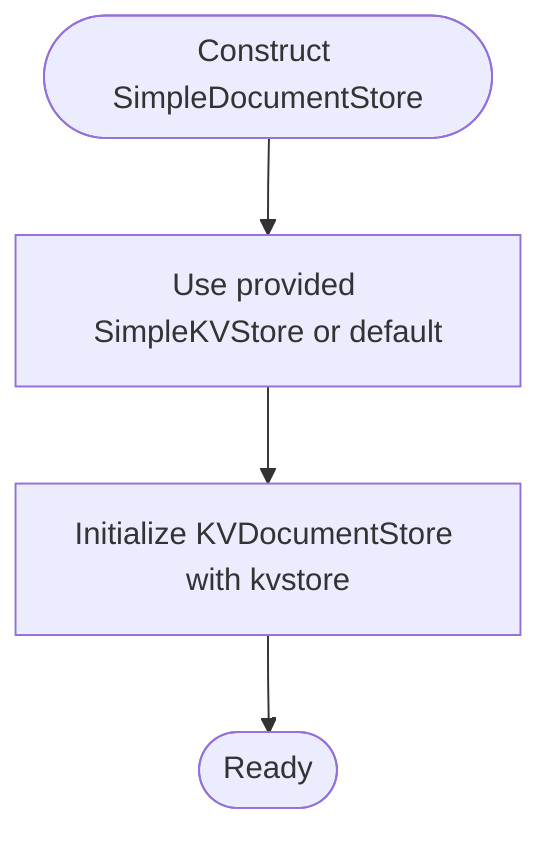

# Document Store

<cite>
**Referenced Files in This Document**
- [types.py](file://llama-index-core/llama_index/core/storage/docstore/types.py)
- [keyval_docstore.py](file://llama-index-core/llama_index/core/storage/docstore/keyval_docstore.py)
- [simple_docstore.py](file://llama-index-core/llama_index/core/storage/docstore/simple_docstore.py)
- [utils.py](file://llama-index-core/llama_index/core/storage/docstore/utils.py)
- [storage_context.py](file://llama-index-core/llama_index/core/storage/storage_context.py)
- [__init__.py](file://llama-index-core/llama_index/core/storage/docstore/__init__.py)
- [test_simple_docstore.py](file://llama-index-core/tests/storage/docstore/test_simple_docstore.py)
</cite>

## Table of Contents
1. [Introduction](#introduction)
2. [Project Structure](#project-structure)
3. [Core Components](#core-components)
4. [Architecture Overview](#architecture-overview)
5. [Detailed Component Analysis](#detailed-component-analysis)
6. [Dependency Analysis](#dependency-analysis)
7. [Performance Considerations](#performance-considerations)
8. [Troubleshooting Guide](#troubleshooting-guide)
9. [Conclusion](#conclusion)
10. [Appendices](#appendices)

## Introduction
This document explains the Document Store component of LlamaIndex storage system. It focuses on the BaseDocumentStore interface, the SimpleDocumentStore implementation, and the underlying persistence mechanism. It also covers how nodes are stored, retrieved, and managed, including document serialization, indexing strategies, and performance optimization techniques. Practical examples show configuration, node CRUD operations, and persistence patterns, along with integration into the broader storage context and migration between implementations.

## Project Structure
The Document Store lives under the storage subsystem and is composed of:
- A base interface defining the contract for document/node storage
- A key-value-backed implementation that organizes data into collections
- A simple in-memory store built on top of a simple key-value store
- Utilities for serializing nodes to/from JSON
- Integration via the StorageContext for unified persistence and migration

**Diagram sources**
- [types.py](file://llama-index-core/llama_index/core/storage/docstore/types.py#L24-L273)
- [keyval_docstore.py](file://llama-index-core/llama_index/core/storage/docstore/keyval_docstore.py#L24-L670)
- [simple_docstore.py](file://llama-index-core/llama_index/core/storage/docstore/simple_docstore.py#L20-L107)
- [utils.py](file://llama-index-core/llama_index/core/storage/docstore/utils.py#L15-L97)
- [storage_context.py](file://llama-index-core/llama_index/core/storage/storage_context.py#L52-L278)

**Section sources**
- [__init__.py](file://llama-index-core/llama_index/core/storage/docstore/__init__.py#L1-L13)
- [types.py](file://llama-index-core/llama_index/core/storage/docstore/types.py#L24-L273)
- [keyval_docstore.py](file://llama-index-core/llama_index/core/storage/docstore/keyval_docstore.py#L24-L670)
- [simple_docstore.py](file://llama-index-core/llama_index/core/storage/docstore/simple_docstore.py#L20-L107)
- [utils.py](file://llama-index-core/llama_index/core/storage/docstore/utils.py#L15-L97)
- [storage_context.py](file://llama-index-core/llama_index/core/storage/storage_context.py#L52-L278)

## Core Components
- BaseDocumentStore: Defines the contract for storing and retrieving nodes and documents, including CRUD operations, existence checks, hashing, and reference document management. It also provides convenience methods for fetching nodes and building node dictionaries.
- KVDocumentStore: Implements the BaseDocumentStore contract using a key-value store. It manages three collections: node data, per-node metadata, and reference document info. It handles batching, merging ref doc updates, and asynchronous operations.
- SimpleDocumentStore: A thin wrapper around KVDocumentStore backed by a SimpleKVStore. It adds convenience constructors for persistence and dictionary-based serialization/deserialization.
- Serialization Utils: Convert BaseNode instances to/from JSON for storage, including legacy support for older node formats.
- StorageContext: Integrates the document store with other storage components and provides unified persistence across docstore, index store, graph store, and vector stores.

**Section sources**
- [types.py](file://llama-index-core/llama_index/core/storage/docstore/types.py#L24-L273)
- [keyval_docstore.py](file://llama-index-core/llama_index/core/storage/docstore/keyval_docstore.py#L24-L670)
- [simple_docstore.py](file://llama-index-core/llama_index/core/storage/docstore/simple_docstore.py#L20-L107)
- [utils.py](file://llama-index-core/llama_index/core/storage/docstore/utils.py#L15-L97)
- [storage_context.py](file://llama-index-core/llama_index/core/storage/storage_context.py#L52-L278)

## Architecture Overview
The document store is designed as a layered abstraction:
- BaseDocumentStore defines the API surface
- KVDocumentStore implements the API using a key-value store
- SimpleDocumentStore provides an in-memory, easy-to-use default
- Serialization utilities handle node-to-dict conversion
- StorageContext orchestrates persistence and migration across stores

**Diagram sources**
- [types.py](file://llama-index-core/llama_index/core/storage/docstore/types.py#L24-L273)
- [keyval_docstore.py](file://llama-index-core/llama_index/core/storage/docstore/keyval_docstore.py#L24-L670)
- [simple_docstore.py](file://llama-index-core/llama_index/core/storage/docstore/simple_docstore.py#L20-L107)
- [utils.py](file://llama-index-core/llama_index/core/storage/docstore/utils.py#L15-L97)

## Detailed Component Analysis

### BaseDocumentStore Interface
- Persistence: Provides a default no-op persist method; implementations override to write to disk or remote filesystems.
- Core CRUD: Methods for adding, retrieving, deleting, and existence-checking documents and nodes.
- Node convenience: get_node/get_nodes and their async counterparts, plus get_node_dict helpers.
- Hashing: Per-node and bulk hashing APIs for integrity and change detection.
- Reference Documents: APIs to manage ref_doc_id mappings, including node-to-ref_doc linkage and deletion semantics.

Key behaviors:
- get_node delegates to get_document and validates type safety.
- get_nodes iterates and optionally raises errors per item.
- get_all_document_hashes builds a reverse mapping from hash to node id.

**Section sources**
- [types.py](file://llama-index-core/llama_index/core/storage/docstore/types.py#L24-L273)

### KVDocumentStore Implementation
- Collections:
  - Node data: stores serialized node content keyed by node_id
  - Metadata: stores per-node metadata including doc_hash and optional ref_doc_id
  - Ref doc info: stores aggregated node_ids and metadata for each ref_doc_id
- Batched writes: add_documents and async_add_documents prepare KV pairs and write in batches to minimize IO overhead.
- Reference document merging: merges updates for the same ref_doc_id to keep node lists and metadata consistent.
- Existence and retrieval: Uses collections to check existence and fetch nodes; supports raising errors or returning None.
- Deletion semantics:
  - delete_document removes node and metadata, and updates/refers to ref_doc info
  - delete_ref_doc deletes all associated nodes and cleans up ref_doc entries
- Async support: Parallelizes operations using asyncio.gather for improved throughput.

**Diagram sources**
- [keyval_docstore.py](file://llama-index-core/llama_index/core/storage/docstore/keyval_docstore.py#L207-L244)
- [utils.py](file://llama-index-core/llama_index/core/storage/docstore/utils.py#L15-L48)

**Section sources**
- [keyval_docstore.py](file://llama-index-core/llama_index/core/storage/docstore/keyval_docstore.py#L24-L670)
- [utils.py](file://llama-index-core/llama_index/core/storage/docstore/utils.py#L15-L97)

### SimpleDocumentStore
- Construction:
  - Default constructor initializes with an in-memory SimpleKVStore
  - from_persist_dir/from_persist_path construct from persisted JSON
  - from_dict/to_dict enable migration and snapshotting
- Persistence: Delegates to underlying SimpleKVStore’s persist when the store is in-memory or mutable mapping-based.

**Diagram sources**
- [simple_docstore.py](file://llama-index-core/llama_index/core/storage/docstore/simple_docstore.py#L32-L41)

**Section sources**
- [simple_docstore.py](file://llama-index-core/llama_index/core/storage/docstore/simple_docstore.py#L20-L107)

### Serialization and Migration
- Serialization: doc_to_json wraps node data with a type marker; json_to_doc reconstructs nodes, including legacy support for older formats.
- Migration: SimpleDocumentStore.from_dict/to_dict enables moving between in-memory state and persisted snapshots.

**Diagram sources**
- [utils.py](file://llama-index-core/llama_index/core/storage/docstore/utils.py#L15-L97)

**Section sources**
- [utils.py](file://llama-index-core/llama_index/core/storage/docstore/utils.py#L15-L97)
- [simple_docstore.py](file://llama-index-core/llama_index/core/storage/docstore/simple_docstore.py#L94-L102)

### Integration with StorageContext
- StorageContext aggregates docstore, index store, graph store, and vector stores.
- from_defaults constructs default stores or loads from a shared persist directory.
- persist writes each store to dedicated filenames under the persist directory, including vector stores under namespaced paths.
- to_dict/from_dict serialize the entire storage context when using simple implementations.

**Diagram sources**
- [storage_context.py](file://llama-index-core/llama_index/core/storage/storage_context.py#L73-L149)
- [storage_context.py](file://llama-index-core/llama_index/core/storage/storage_context.py#L151-L203)

**Section sources**
- [storage_context.py](file://llama-index-core/llama_index/core/storage/storage_context.py#L52-L278)

## Dependency Analysis
- BaseDocumentStore depends on BaseNode and fsspec for persistence.
- KVDocumentStore depends on BaseKVStore, RefDocInfo, and serialization utilities.
- SimpleDocumentStore depends on SimpleKVStore and KVDocumentStore.
- StorageContext depends on all store types and orchestrates persistence across them.

**Diagram sources**
- [types.py](file://llama-index-core/llama_index/core/storage/docstore/types.py#L24-L273)
- [keyval_docstore.py](file://llama-index-core/llama_index/core/storage/docstore/keyval_docstore.py#L24-L670)
- [simple_docstore.py](file://llama-index-core/llama_index/core/storage/docstore/simple_docstore.py#L20-L107)
- [storage_context.py](file://llama-index-core/llama_index/core/storage/storage_context.py#L52-L278)

**Section sources**
- [types.py](file://llama-index-core/llama_index/core/storage/docstore/types.py#L24-L273)
- [keyval_docstore.py](file://llama-index-core/llama_index/core/storage/docstore/keyval_docstore.py#L24-L670)
- [simple_docstore.py](file://llama-index-core/llama_index/core/storage/docstore/simple_docstore.py#L20-L107)
- [storage_context.py](file://llama-index-core/llama_index/core/storage/storage_context.py#L52-L278)

## Performance Considerations
- Batching: KVDocumentStore uses batched writes for nodes, metadata, and ref doc info to reduce IO overhead. Tune batch_size to balance throughput and memory usage.
- Asynchronous operations: async_add_documents performs parallel writes to multiple collections, improving throughput for large batches.
- Store text selectively: store_text controls whether node text is persisted; disabling it reduces storage size and IO cost when text is available elsewhere.
- Collections separation: Splitting data into node, metadata, and ref_doc collections enables targeted queries and updates.
- In-memory simplicity: SimpleDocumentStore is optimized for speed and ease of use; for production workloads, consider persistent KV stores and tune persistence frequency.

[No sources needed since this section provides general guidance]

## Troubleshooting Guide
Common issues and resolutions:
- Node not found: Ensure node_id correctness and verify collections. Use raise_error flags to control exceptions.
- Duplicate node handling: Set allow_update to True when re-ingesting nodes; otherwise, a ValueError is raised.
- Reference document cleanup: Deleting a ref_doc deletes all associated nodes; verify ref_doc info after deletions.
- Legacy node formats: Serialization utilities support legacy formats; ensure consistent node versions across migrations.
- Persistence failures: Verify persist_path permissions and filesystem availability; use StorageContext.persist to coordinate multi-store persistence.

**Section sources**
- [keyval_docstore.py](file://llama-index-core/llama_index/core/storage/docstore/keyval_docstore.py#L174-L179)
- [keyval_docstore.py](file://llama-index-core/llama_index/core/storage/docstore/keyval_docstore.py#L537-L545)
- [keyval_docstore.py](file://llama-index-core/llama_index/core/storage/docstore/keyval_docstore.py#L577-L597)
- [utils.py](file://llama-index-core/llama_index/core/storage/docstore/utils.py#L51-L97)
- [storage_context.py](file://llama-index-core/llama_index/core/storage/storage_context.py#L151-L203)

## Conclusion
The LlamaIndex Document Store provides a robust, extensible abstraction for managing nodes and documents. The BaseDocumentStore interface ensures consistent behavior, while KVDocumentStore offers a flexible, collection-based implementation. SimpleDocumentStore simplifies local development and testing. With serialization utilities and StorageContext integration, the system supports reliable persistence, migration, and scalable performance tuning.

[No sources needed since this section summarizes without analyzing specific files]

## Appendices

### Practical Examples and Patterns
- Configuration
  - Create a SimpleDocumentStore with default in-memory backing
  - Load from a persisted directory or path
  - Build from a dictionary for migration
- Node CRUD
  - Add nodes with allow_update and store_text toggles
  - Retrieve single nodes or batches
  - Delete individual nodes or entire reference documents
- Persistence
  - Persist to a specific path
  - Use StorageContext.persist to write all stores atomically
  - Serialize/deserialize the entire storage context for backup/migration

Validation and behavior references:
- CRUD and deletion tests demonstrate expected behavior and edge cases
- Tests cover persistence to file, dictionary serialization, and ref doc deletion semantics

**Section sources**
- [simple_docstore.py](file://llama-index-core/llama_index/core/storage/docstore/simple_docstore.py#L42-L102)
- [test_simple_docstore.py](file://llama-index-core/tests/storage/docstore/test_simple_docstore.py#L16-L155)
- [storage_context.py](file://llama-index-core/llama_index/core/storage/storage_context.py#L151-L203)