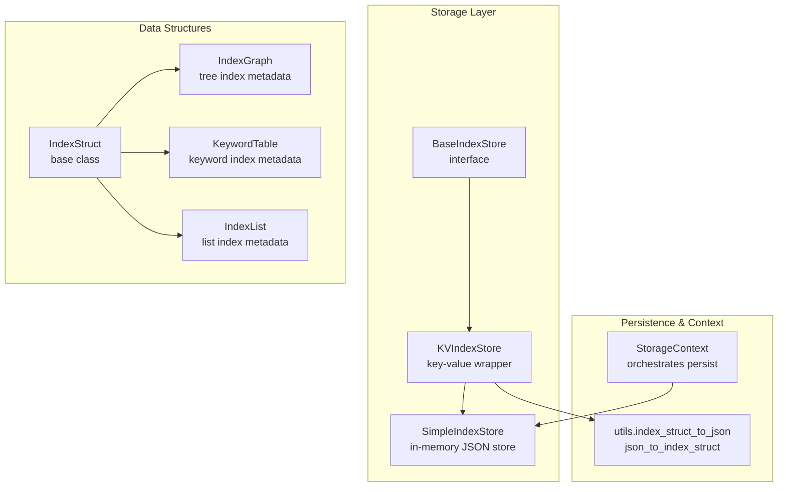
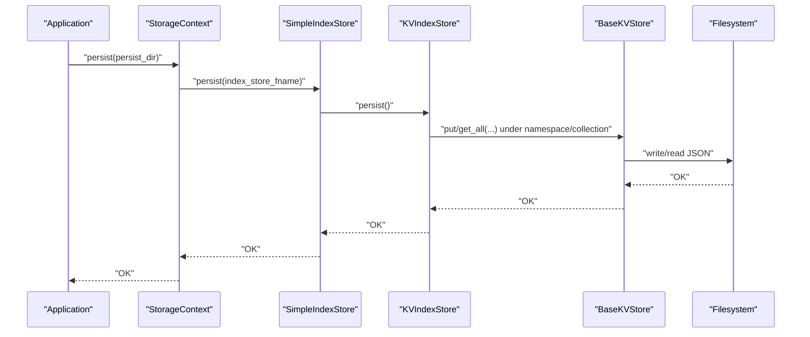
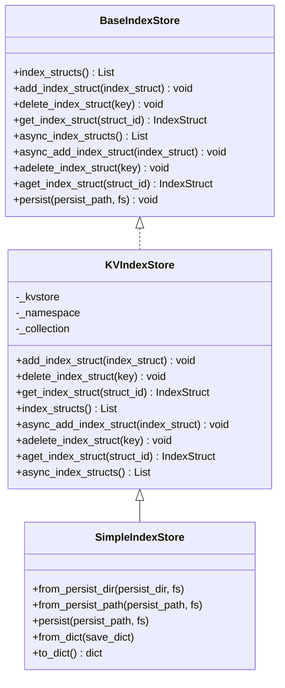
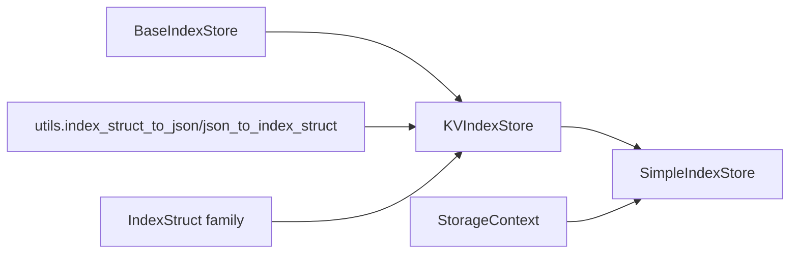

# Index Store

<cite>
**Referenced Files in This Document**
- [types.py](file://llama-index-core/llama_index/core/storage/index_store/types.py)
- [keyval_index_store.py](file://llama-index-core/llama_index/core/storage/index_store/keyval_index_store.py)
- [simple_index_store.py](file://llama-index-core/llama_index/core/storage/index_store/simple_index_store.py)
- [utils.py](file://llama-index-core/llama_index/core/storage/index_store/utils.py)
- [data_structs.py](file://llama-index-core/llama_index/core/data_structs/data_structs.py)
- [storage_context.py](file://llama-index-core/llama_index/core/storage/storage_context.py)
- [test_simple_index_store.py](file://llama-index-core/tests/storage/index_store/test_simple_index_store.py)
- [index_stores.md](file://docs/src/content/docs/framework/module_guides/storing/index_stores.md)
</cite>

## Table of Contents
1. [Introduction](#introduction)
2. [Project Structure](#project-structure)
3. [Core Components](#core-components)
4. [Architecture Overview](#architecture-overview)
5. [Detailed Component Analysis](#detailed-component-analysis)
6. [Dependency Analysis](#dependency-analysis)
7. [Performance Considerations](#performance-considerations)
8. [Troubleshooting Guide](#troubleshooting-guide)
9. [Conclusion](#conclusion)
10. [Appendices](#appendices)

## Introduction
This document explains the Index Store component of LlamaIndex storage system. It focuses on the BaseIndexStore interface, the SimpleIndexStore implementation, and how index metadata is persisted. It also covers how index structures, node relationships, and index configurations are stored and retrieved, along with practical setup examples, metadata management, persistence workflows, serialization formats, versioning strategies, and performance considerations for large-scale deployments.

## Project Structure
The Index Store lives under the storage subsystem and integrates with the broader storage context. The core files are:
- BaseIndexStore interface and default persistence constants
- KV-backed index store implementation
- Simple in-memory index store built on top of a simple key-value store
- Utilities for serializing/deserializing index structures
- Integration with the StorageContext for persistence orchestration
- Tests validating dictionary-based roundtrip persistence

**Diagram sources**
- [types.py](file://llama-index-core/llama_index/core/storage/index_store/types.py#L13-L56)
- [keyval_index_store.py](file://llama-index-core/llama_index/core/storage/index_store/keyval_index_store.py#L15-L143)
- [simple_index_store.py](file://llama-index-core/llama_index/core/storage/index_store/simple_index_store.py#L19-L77)
- [utils.py](file://llama-index-core/llama_index/core/storage/index_store/utils.py#L8-L23)
- [data_structs.py](file://llama-index-core/llama_index/core/data_structs/data_structs.py#L21-L200)
- [storage_context.py](file://llama-index-core/llama_index/core/storage/storage_context.py#L52-L278)

**Section sources**
- [types.py](file://llama-index-core/llama_index/core/storage/index_store/types.py#L1-L56)
- [keyval_index_store.py](file://llama-index-core/llama_index/core/storage/index_store/keyval_index_store.py#L1-L143)
- [simple_index_store.py](file://llama-index-core/llama_index/core/storage/index_store/simple_index_store.py#L1-L77)
- [utils.py](file://llama-index-core/llama_index/core/storage/index_store/utils.py#L1-L23)
- [data_structs.py](file://llama-index-core/llama_index/core/data_structs/data_structs.py#L1-L200)
- [storage_context.py](file://llama-index-core/llama_index/core/storage/storage_context.py#L1-L278)

## Core Components
- BaseIndexStore: Defines the contract for index metadata persistence, including CRUD operations for index structures and a default persistence method.
- KVIndexStore: Implements the BaseIndexStore contract using a generic key-value store, managing a namespace and collection for index metadata.
- SimpleIndexStore: An in-memory index store backed by a simple key-value store, supporting JSON-based persistence to disk and dictionary-based serialization.
- IndexStruct and derived types: Represent index metadata (e.g., tree structure, keyword mappings, lists), with standardized serialization via a type discriminator and data payload.
- StorageContext: Coordinates persistence of the entire storage stack, including the index store.

Key responsibilities:
- Storing and retrieving index structures by ID
- Listing all index structures
- Persisting index metadata to a configurable path or filesystem
- Loading index metadata from persisted state

**Section sources**
- [types.py](file://llama-index-core/llama_index/core/storage/index_store/types.py#L13-L56)
- [keyval_index_store.py](file://llama-index-core/llama_index/core/storage/index_store/keyval_index_store.py#L15-L143)
- [simple_index_store.py](file://llama-index-core/llama_index/core/storage/index_store/simple_index_store.py#L19-L77)
- [data_structs.py](file://llama-index-core/llama_index/core/data_structs/data_structs.py#L21-L200)
- [storage_context.py](file://llama-index-core/llama_index/core/storage/storage_context.py#L52-L278)

## Architecture Overview
Index metadata is serialized into a JSON envelope containing a type discriminator and a data payload. KVIndexStore writes these entries under a configured namespace/collection, while SimpleIndexStore extends this to disk via a simple key-value store.

**Diagram sources**
- [storage_context.py](file://llama-index-core/llama_index/core/storage/storage_context.py#L151-L203)
- [simple_index_store.py](file://llama-index-core/llama_index/core/storage/index_store/simple_index_store.py#L60-L68)
- [keyval_index_store.py](file://llama-index-core/llama_index/core/storage/index_store/keyval_index_store.py#L38-L89)
- [utils.py](file://llama-index-core/llama_index/core/storage/index_store/utils.py#L8-L23)

## Detailed Component Analysis

### BaseIndexStore Interface
Defines the core operations for index metadata management:
- Listing all index structures
- Adding a single index structure
- Deleting a specific index structure by key
- Retrieving a specific index structure by ID (or the single structure if none provided)
- Asynchronous variants of the above operations
- A default persist method with a sensible filename and directory

Implementation notes:
- The interface centralizes persistence concerns and allows pluggable backends (e.g., in-memory, Redis, MongoDB, relational databases).
- Async methods enable non-blocking persistence in high-throughput scenarios.

**Section sources**
- [types.py](file://llama-index-core/llama_index/core/storage/index_store/types.py#L13-L56)

### KVIndexStore Implementation
Key behaviors:
- Wraps a BaseKVStore and manages a namespace/collection for index metadata.
- Serializes index structures to JSON using a type discriminator and data payload.
- Provides CRUD operations:
  - Add: serialize and put under the collection keyed by index ID
  - Get: fetch by ID and deserialize
  - Delete: remove by ID
  - List: fetch all and deserialize
  - Async variants mirror sync operations
- Uses a default namespace and collection suffix suitable for most backends.

**Diagram sources**
- [types.py](file://llama-index-core/llama_index/core/storage/index_store/types.py#L13-L56)
- [keyval_index_store.py](file://llama-index-core/llama_index/core/storage/index_store/keyval_index_store.py#L15-L143)
- [simple_index_store.py](file://llama-index-core/llama_index/core/storage/index_store/simple_index_store.py#L19-L77)

**Section sources**
- [keyval_index_store.py](file://llama-index-core/llama_index/core/storage/index_store/keyval_index_store.py#L15-L143)

### SimpleIndexStore: In-Memory with JSON Persistence
Highlights:
- Inherits from KVIndexStore and uses a SimpleKVStore by default.
- Supports loading from and persisting to a JSON file path or directory.
- Provides dictionary-based serialization for quick snapshotting and restoration.
- Persist behavior depends on the underlying KV store type; for in-memory stores, it delegates to the KV store’s persist method.

Practical usage patterns:
- Initialize with defaults for ephemeral runs
- Load from a persisted directory or path for reproducible sessions
- Serialize to/from dict for transport or testing

**Section sources**
- [simple_index_store.py](file://llama-index-core/llama_index/core/storage/index_store/simple_index_store.py#L19-L77)
- [test_simple_index_store.py](file://llama-index-core/tests/storage/index_store/test_simple_index_store.py#L7-L20)

### Index Serialization and Deserialization
Serialization format:
- Each index structure is wrapped in a dictionary with:
  - A type discriminator indicating the concrete index struct class
  - A data payload containing the serialized form of the index struct
- Deserialization resolves the class by type and reconstructs the object from either JSON or dict.

This enables:
- Backward compatibility across index struct versions (via the registry)
- Pluggable persistence backends without changing the core data model

**Section sources**
- [utils.py](file://llama-index-core/llama_index/core/storage/index_store/utils.py#L8-L23)
- [data_structs.py](file://llama-index-core/llama_index/core/data_structs/data_structs.py#L21-L200)

### Index Metadata: Structures, Relationships, and Configurations
- IndexGraph: Tree-structured metadata including node-to-index mapping, root nodes, and parent-child relationships.
- KeywordTable: Keyword-to-node mapping for keyword-based retrieval.
- IndexList: Ordered list of node IDs.
- IndexLPG/IndexDict: Additional specialized index metadata types.

These structures capture:
- How nodes relate to each other (parents/children)
- How nodes map to keywords or positions
- Summary and identity metadata for retrieval and persistence

**Section sources**
- [data_structs.py](file://llama-index-core/llama_index/core/data_structs/data_structs.py#L40-L200)

### Persistence Workflows and StorageContext Integration
- StorageContext orchestrates persistence across all stores, including the index store.
- It computes filenames per store and delegates to each store’s persist method.
- It supports both default in-memory stores and persistent stores loaded from a shared directory.

Common workflows:
- Build an index with a storage context that uses SimpleIndexStore by default
- Persist the entire storage context to a directory
- Rehydrate the storage context from disk later to resume work

**Section sources**
- [storage_context.py](file://llama-index-core/llama_index/core/storage/storage_context.py#L73-L203)

### Practical Examples and Setup
- Simple in-memory index store with JSON persistence:
  - Create a SimpleIndexStore
  - Call persist to write to a JSON file
  - Load from a persisted path or directory
- Dictionary-based roundtrip:
  - Serialize to dict and restore from dict for testing or transport
- Integration with StorageContext:
  - Use StorageContext.from_defaults to create stores
  - Persist the entire context to a directory for reproducibility

Reference examples and guidance:
- See the module guide for backend-specific index store integrations (e.g., MongoDB, Redis, Couchbase, Tablestore, AlloyDB, Cloud SQL for PostgreSQL).

**Section sources**
- [simple_index_store.py](file://llama-index-core/llama_index/core/storage/index_store/simple_index_store.py#L36-L77)
- [test_simple_index_store.py](file://llama-index-core/tests/storage/index_store/test_simple_index_store.py#L7-L20)
- [index_stores.md](file://docs/src/content/docs/framework/module_guides/storing/index_stores.md#L1-L274)

## Dependency Analysis
- BaseIndexStore defines the contract; KVIndexStore implements it generically; SimpleIndexStore specializes it for in-memory JSON persistence.
- KVIndexStore depends on:
  - IndexStruct and derived types for metadata
  - KV store abstraction for IO
  - Serialization utilities for JSON conversion
- SimpleIndexStore depends on:
  - SimpleKVStore for in-memory persistence
  - Filesystem abstraction for remote/local paths
- StorageContext composes all stores and coordinates persistence.

**Diagram sources**
- [types.py](file://llama-index-core/llama_index/core/storage/index_store/types.py#L13-L56)
- [keyval_index_store.py](file://llama-index-core/llama_index/core/storage/index_store/keyval_index_store.py#L15-L143)
- [simple_index_store.py](file://llama-index-core/llama_index/core/storage/index_store/simple_index_store.py#L19-L77)
- [utils.py](file://llama-index-core/llama_index/core/storage/index_store/utils.py#L8-L23)
- [data_structs.py](file://llama-index-core/llama_index/core/data_structs/data_structs.py#L21-L200)
- [storage_context.py](file://llama-index-core/llama_index/core/storage/storage_context.py#L52-L278)

**Section sources**
- [types.py](file://llama-index-core/llama_index/core/storage/index_store/types.py#L13-L56)
- [keyval_index_store.py](file://llama-index-core/llama_index/core/storage/index_store/keyval_index_store.py#L15-L143)
- [simple_index_store.py](file://llama-index-core/llama_index/core/storage/index_store/simple_index_store.py#L19-L77)
- [utils.py](file://llama-index-core/llama_index/core/storage/index_store/utils.py#L8-L23)
- [data_structs.py](file://llama-index-core/llama_index/core/data_structs/data_structs.py#L21-L200)
- [storage_context.py](file://llama-index-core/llama_index/core/storage/storage_context.py#L52-L278)

## Performance Considerations
- Choose a persistent backend for production:
  - In-memory SimpleIndexStore is fast but not durable; use it for ephemeral runs or testing.
  - Backend-specific stores (e.g., Redis, MongoDB, relational databases) offer durability and horizontal scaling.
- Batch operations:
  - Prefer bulk writes when adding many index structures.
  - Use async methods for non-blocking IO in high-throughput systems.
- Serialization overhead:
  - JSON serialization is straightforward; ensure index structures are not excessively large.
  - Consider compression or streaming for very large datasets.
- Concurrency:
  - KVIndexStore exposes async methods; leverage them to avoid blocking the event loop.
- Disk IO:
  - Persist to local SSD/NVMe when feasible.
  - Use fsspec-compatible filesystems for cloud storage to benefit from caching and retries.

[No sources needed since this section provides general guidance]

## Troubleshooting Guide
Common issues and resolutions:
- Missing persisted file:
  - Ensure the persist path exists and is writable.
  - Verify the correct filename and directory are used by StorageContext.
- Type resolution failures:
  - Confirm that the index struct type discriminator matches a registered class.
  - Check that the data payload is valid for deserialization.
- Async vs sync:
  - Use async methods when building or loading asynchronously to avoid deadlocks.
- Backend connectivity:
  - For external backends (Redis, MongoDB, etc.), verify credentials, network access, and collection/table initialization.

**Section sources**
- [utils.py](file://llama-index-core/llama_index/core/storage/index_store/utils.py#L15-L23)
- [keyval_index_store.py](file://llama-index-core/llama_index/core/storage/index_store/keyval_index_store.py#L91-L142)
- [index_stores.md](file://docs/src/content/docs/framework/module_guides/storing/index_stores.md#L1-L274)

## Conclusion
The Index Store provides a clean, extensible contract for persisting index metadata. KVIndexStore offers a generic, backend-agnostic implementation, while SimpleIndexStore delivers a practical in-memory JSON-backed solution suitable for development and testing. Together with StorageContext, it enables robust persistence workflows across diverse environments and scales.

[No sources needed since this section summarizes without analyzing specific files]

## Appendices

### Appendix A: Index Structures and Relationships
- IndexGraph: Captures tree structure, node-to-index mapping, and parent-child relationships.
- KeywordTable: Maps keywords to node IDs for keyword-based retrieval.
- IndexList: Maintains ordered node IDs for list-based indices.
- IndexLPG/IndexDict: Specialized metadata for label-property graphs and dictionaries.

**Section sources**
- [data_structs.py](file://llama-index-core/llama_index/core/data_structs/data_structs.py#L40-L200)

### Appendix B: Versioning and Compatibility Strategies
- Use the type discriminator to maintain backward compatibility across versions.
- When evolving index structures, keep the type stable and evolve the data payload safely.
- Validate deserialization paths (JSON vs dict) to handle mixed-version data gracefully.

**Section sources**
- [utils.py](file://llama-index-core/llama_index/core/storage/index_store/utils.py#L15-L23)
- [data_structs.py](file://llama-index-core/llama_index/core/data_structs/data_structs.py#L21-L200)