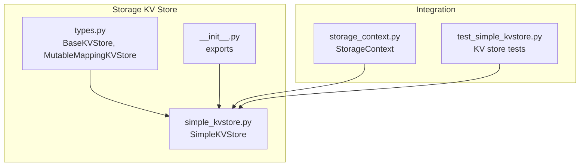
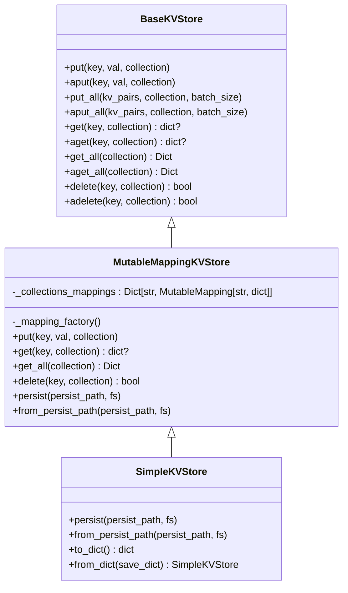
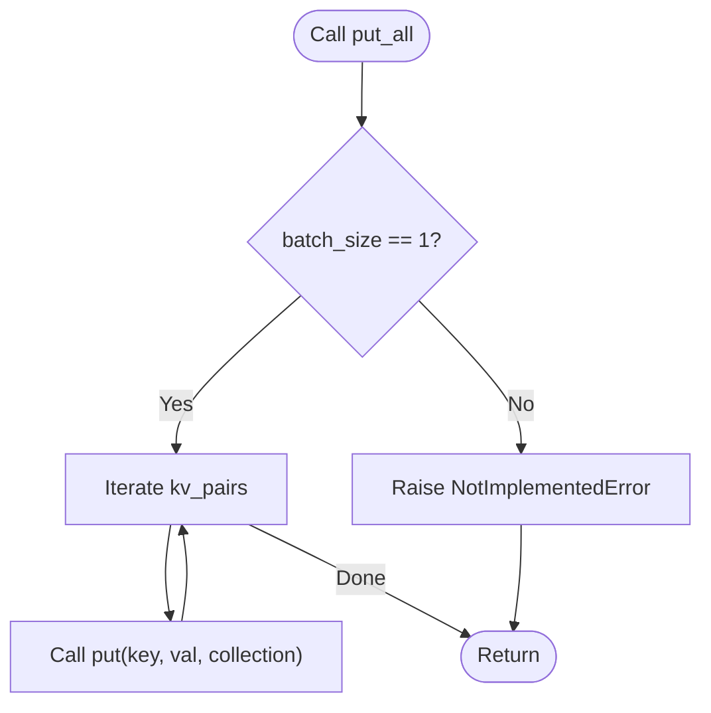
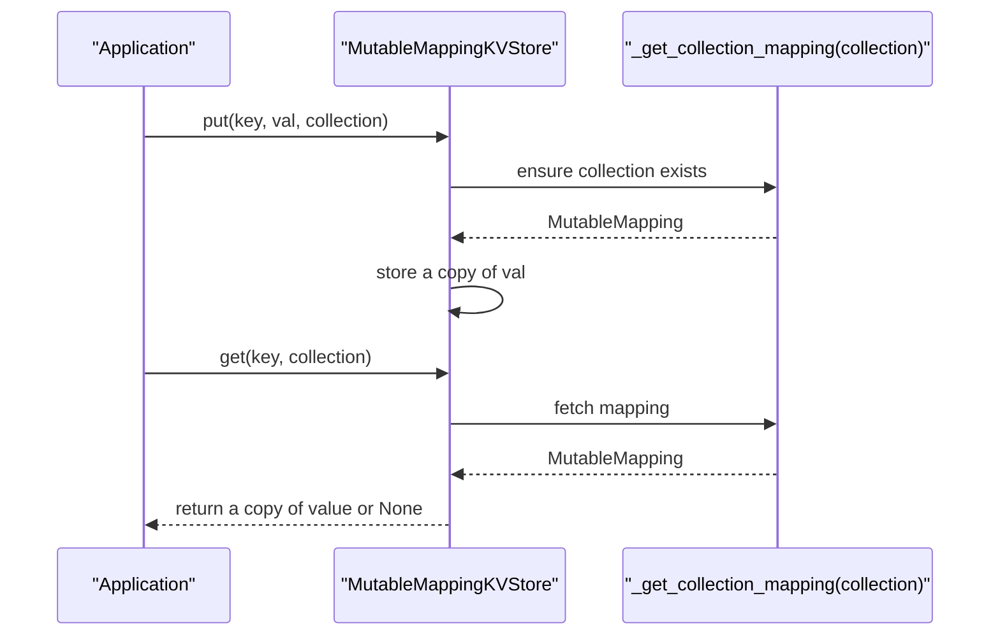
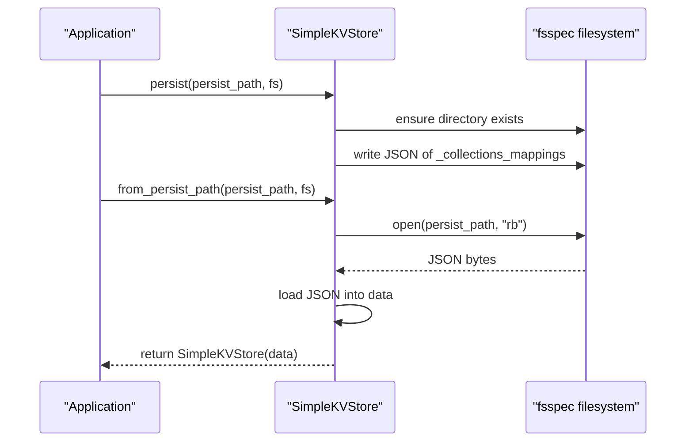
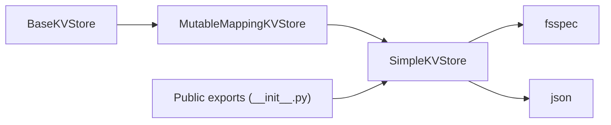

# Key-Value Store

<cite>
**Referenced Files in This Document**
- [types.py](file://llama-index-core/llama_index/core/storage/kvstore/types.py)
- [simple_kvstore.py](file://llama-index-core/llama_index/core/storage/kvstore/simple_kvstore.py)
- [__init__.py](file://llama-index-core/llama_index/core/storage/kvstore/__init__.py)
- [storage_context.py](file://llama-index-core/llama_index/core/storage/storage_context.py)
- [test_simple_kvstore.py](file://llama-index-core/tests/storage/kvstore/test_simple_kvstore.py)
</cite>

## Table of Contents
1. [Introduction](#introduction)
2. [Project Structure](#project-structure)
3. [Core Components](#core-components)
4. [Architecture Overview](#architecture-overview)
5. [Detailed Component Analysis](#detailed-component-analysis)
6. [Dependency Analysis](#dependency-analysis)
7. [Performance Considerations](#performance-considerations)
8. [Troubleshooting Guide](#troubleshooting-guide)
9. [Conclusion](#conclusion)
10. [Appendices](#appendices)

## Introduction
This document explains the Key-Value Store component of LlamaIndex storage system with a focus on:
- The BaseKVStore interface contract
- The SimpleKVStore in-memory implementation
- Arbitrary data persistence mechanisms and integration patterns
- Practical configuration and usage patterns
- Serialization, caching strategies, and performance optimization for high-throughput scenarios

It targets both developers integrating LlamaIndex and those extending the storage layer with custom backends.

## Project Structure
The Key-Value Store lives under the storage module and is complemented by tests and integration points:
- Core interface and generic implementations: storage/kvstore/types.py
- SimpleKVStore implementation: storage/kvstore/simple_kvstore.py
- Public exports: storage/kvstore/__init__.py
- Storage context orchestration: storage/storage_context.py
- Tests validating basic operations and persistence: tests/storage/kvstore/test_simple_kvstore.py

**Diagram sources**
- [types.py](file://llama-index-core/llama_index/core/storage/kvstore/types.py#L11-L184)
- [simple_kvstore.py](file://llama-index-core/llama_index/core/storage/kvstore/simple_kvstore.py#L16-L66)
- [__init__.py](file://llama-index-core/llama_index/core/storage/kvstore/__init__.py#L1-L4)
- [storage_context.py](file://llama-index-core/llama_index/core/storage/storage_context.py#L52-L278)
- [test_simple_kvstore.py](file://llama-index-core/tests/storage/kvstore/test_simple_kvstore.py#L1-L39)

**Section sources**
- [types.py](file://llama-index-core/llama_index/core/storage/kvstore/types.py#L1-L184)
- [simple_kvstore.py](file://llama-index-core/llama_index/core/storage/kvstore/simple_kvstore.py#L1-L66)
- [__init__.py](file://llama-index-core/llama_index/core/storage/kvstore/__init__.py#L1-L4)
- [storage_context.py](file://llama-index-core/llama_index/core/storage/storage_context.py#L1-L278)
- [test_simple_kvstore.py](file://llama-index-core/tests/storage/kvstore/test_simple_kvstore.py#L1-L39)

## Core Components
- BaseKVStore: Defines the core contract for key-value operations, including synchronous and asynchronous put/get/get_all/delete, plus batch helpers with default single-item behavior.
- MutableMappingKVStore: A generic adapter over Python’s MutableMapping, enabling collection-based separation and default in-memory behavior.
- SimpleKVStore: An in-memory implementation backed by JSON serialization for persistence and deserialization, supporting per-collection storage.

These components enable:
- Arbitrary application data storage via string keys and dictionary values
- Optional collection scoping for logical grouping
- Persistence to any fsspec-compatible filesystem
- Seamless integration with LlamaIndex’s StorageContext

**Section sources**
- [types.py](file://llama-index-core/llama_index/core/storage/kvstore/types.py#L11-L184)
- [simple_kvstore.py](file://llama-index-core/llama_index/core/storage/kvstore/simple_kvstore.py#L16-L66)

## Architecture Overview
The KV store sits beneath higher-level stores (docstore, index store, vector stores) and is orchestrated by StorageContext. SimpleKVStore integrates with fsspec for filesystem-agnostic persistence.

**Diagram sources**
- [types.py](file://llama-index-core/llama_index/core/storage/kvstore/types.py#L11-L184)
- [simple_kvstore.py](file://llama-index-core/llama_index/core/storage/kvstore/simple_kvstore.py#L16-L66)

## Detailed Component Analysis

### BaseKVStore Contract
- Operations:
  - Single item: put, get, delete
  - Async variants: aput, aget, adelete
  - Bulk: put_all, aput_all with default single-item fallback
  - Enumeration: get_all, aget_all
- Defaults:
  - Collections default to a constant name
  - Batch size defaults to 1; non-trivial batching raises a clear error
- Purpose:
  - Provides a uniform interface for any KV backend (in-memory, Redis, DynamoDB, etc.)

**Diagram sources**
- [types.py](file://llama-index-core/llama_index/core/storage/kvstore/types.py#L24-L48)

**Section sources**
- [types.py](file://llama-index-core/llama_index/core/storage/kvstore/types.py#L11-L75)

### MutableMappingKVStore
- Behavior:
  - Maintains separate collections via a mapping factory
  - Copies values on put/get to prevent external mutation
  - Exposes persistence hooks but leaves actual persistence to subclasses
- Use cases:
  - Building in-memory KV stores
  - Adapting existing MutableMapping-backed stores

**Diagram sources**
- [types.py](file://llama-index-core/llama_index/core/storage/kvstore/types.py#L95-L184)

**Section sources**
- [types.py](file://llama-index-core/llama_index/core/storage/kvstore/types.py#L95-L184)

### SimpleKVStore
- Implementation highlights:
  - Inherits from MutableMappingKVStore with dict factory
  - Persists to JSON at a given path using fsspec filesystem abstraction
  - Loads from persisted JSON into memory
  - Provides to_dict/from_dict for in-memory serialization/deserialization
- Collections:
  - Stored as a nested mapping keyed by collection name
  - Values are dictionaries of key-to-value mappings

**Diagram sources**
- [simple_kvstore.py](file://llama-index-core/llama_index/core/storage/kvstore/simple_kvstore.py#L35-L56)

**Section sources**
- [simple_kvstore.py](file://llama-index-core/llama_index/core/storage/kvstore/simple_kvstore.py#L16-L66)

### Integration with StorageContext
- StorageContext orchestrates persistence of multiple stores (docstore, index store, graph store, vector stores).
- While KV store is not directly persisted by StorageContext, applications can:
  - Initialize SimpleKVStore with a persist path
  - Load persisted KV store at startup
  - Use KV store for arbitrary application metadata alongside other stores

Note: KV store persistence is independent of StorageContext’s vector store persistence mechanism.

**Section sources**
- [storage_context.py](file://llama-index-core/llama_index/core/storage/storage_context.py#L52-L278)

### Practical Examples and Patterns
- Basic usage pattern:
  - Create a SimpleKVStore instance
  - Put key-value pairs with optional collection scoping
  - Retrieve values by key and collection
  - Enumerate all items in a collection
  - Delete entries by key
- Persistence pattern:
  - Persist to a JSON file using a path and optional fsspec filesystem
  - Load persisted store from path
- Dictionary serialization pattern:
  - Export to dict for in-memory transport or inspection
  - Import from dict to reconstruct the store

See tests for concrete usage of put, get, get_all, persist, and dict conversions.

**Section sources**
- [test_simple_kvstore.py](file://llama-index-core/tests/storage/kvstore/test_simple_kvstore.py#L15-L39)

## Dependency Analysis
- Internal dependencies:
  - SimpleKVStore depends on MutableMappingKVStore for core operations
  - MutableMappingKVStore defines the shared behavior for collection scoping and copying semantics
  - BaseKVStore defines the contract used by higher-level stores
- External dependencies:
  - fsspec for filesystem abstraction
  - json for serialization
- Export surface:
  - Public exports include SimpleKVStore and several other KV store implementations (e.g., FirestoreKVStore, MongoDBKVStore, RedisKVStore), indicating extensibility beyond SimpleKVStore

**Diagram sources**
- [types.py](file://llama-index-core/llama_index/core/storage/kvstore/types.py#L11-L184)
- [simple_kvstore.py](file://llama-index-core/llama_index/core/storage/kvstore/simple_kvstore.py#L1-L12)
- [__init__.py](file://llama-index-core/llama_index/core/storage/kvstore/__init__.py#L1-L4)

**Section sources**
- [types.py](file://llama-index-core/llama_index/core/storage/kvstore/types.py#L1-L184)
- [simple_kvstore.py](file://llama-index-core/llama_index/core/storage/kvstore/simple_kvstore.py#L1-L12)
- [__init__.py](file://llama-index-core/llama_index/core/storage/kvstore/__init__.py#L1-L4)

## Performance Considerations
- Data model and serialization:
  - Values are stored as dictionaries; copies are made on put/get to prevent external mutation. For very large values, consider minimizing payload sizes or using external references.
  - JSON serialization is straightforward but may not be optimal for extremely large datasets. For high-throughput scenarios, prefer specialized backends (e.g., Redis, DynamoDB) exposed via compatible KV store implementations.
- Collections:
  - Logical separation by collection is O(1) lookup per collection mapping; ensure reasonable collection counts to avoid excessive memory overhead.
- Batch operations:
  - Default batch size is 1; attempting larger batches raises an error in the base contract. For bulk operations, either:
    - Use a backend-specific implementation that supports batching
    - Or perform client-side batching with multiple single-item operations
- Concurrency:
  - SimpleKVStore is not thread-safe by default. For concurrent access, wrap with appropriate synchronization or use a thread-safe backend implementation.
- Persistence:
  - JSON writes occur on demand; for frequent writes, consider flushing less often or using a backend with native transactional semantics.

[No sources needed since this section provides general guidance]

## Troubleshooting Guide
- Batch size not supported:
  - Symptom: Using a batch_size > 1 triggers a NotImplementedError.
  - Resolution: Reduce batch_size to 1 or switch to a backend that supports batching.
- Missing persisted file:
  - Symptom: Loading from a persist path fails with a file not found error.
  - Resolution: Ensure the path exists and contains the expected JSON file.
- Unexpected mutations after get:
  - Symptom: Modifying returned values affects the store.
  - Cause: MutableMappingKVStore returns copies; ensure you are not mutating internal references elsewhere.
- Persistence to non-default filesystem:
  - Symptom: Writes fail when using a custom fsspec filesystem.
  - Resolution: Verify filesystem initialization and permissions; ensure directory creation succeeds.

**Section sources**
- [types.py](file://llama-index-core/llama_index/core/storage/kvstore/types.py#L24-L48)
- [simple_kvstore.py](file://llama-index-core/llama_index/core/storage/kvstore/simple_kvstore.py#L35-L56)
- [test_simple_kvstore.py](file://llama-index-core/tests/storage/kvstore/test_simple_kvstore.py#L26-L39)

## Conclusion
The Key-Value Store in LlamaIndex provides a clean, extensible contract for arbitrary data persistence. SimpleKVStore offers a robust in-memory implementation with JSON-based persistence and collection scoping. For production workloads requiring high throughput, integrate compatible backend implementations and leverage batching and concurrency controls appropriate to your chosen storage backend.

[No sources needed since this section summarizes without analyzing specific files]

## Appendices

### API Reference Summary
- BaseKVStore
  - put, aput, put_all, aput_all
  - get, aget, get_all, aget_all
  - delete, adelete
- MutableMappingKVStore
  - Collection-aware mapping with copy semantics
  - persist, from_persist_path (abstract)
- SimpleKVStore
  - JSON-based persistence and dict serialization
  - from_persist_path, persist, to_dict, from_dict

**Section sources**
- [types.py](file://llama-index-core/llama_index/core/storage/kvstore/types.py#L11-L184)
- [simple_kvstore.py](file://llama-index-core/llama_index/core/storage/kvstore/simple_kvstore.py#L16-L66)