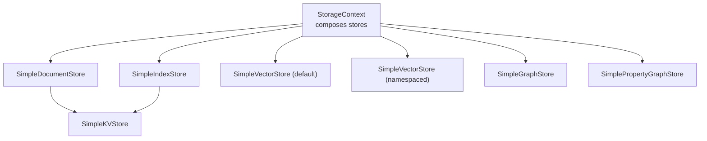
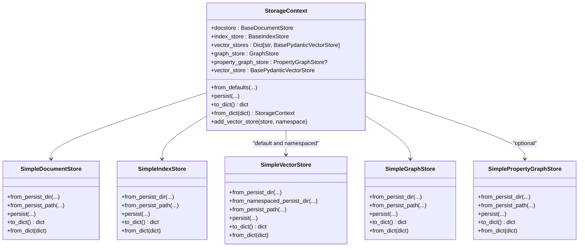
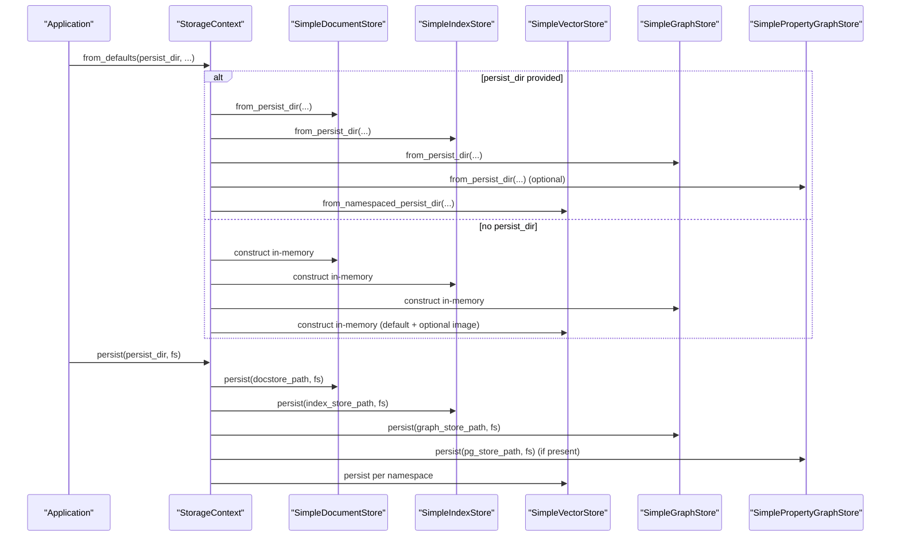
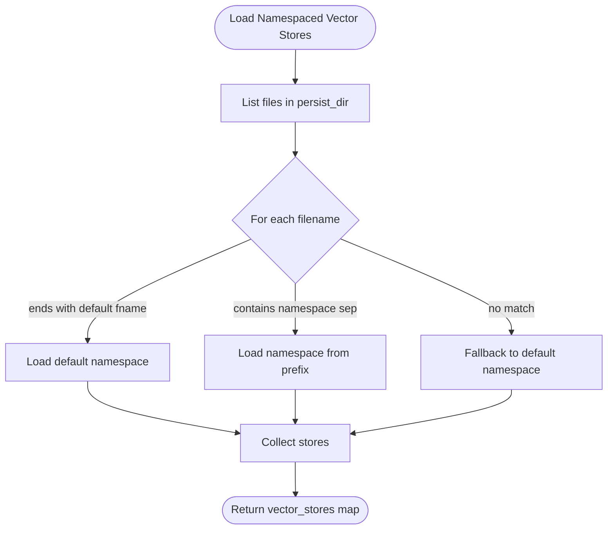
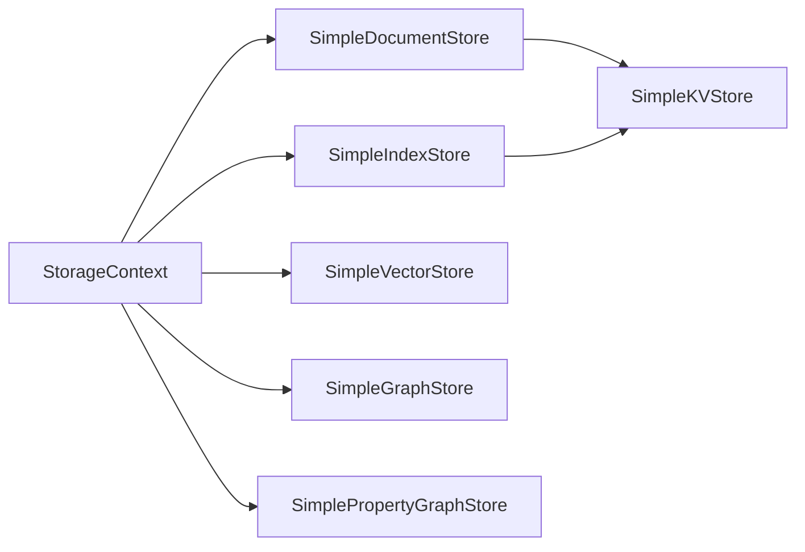

# Storage Context Management

<cite>
**Referenced Files in This Document**
- [storage_context.py](file://llama-index-core/llama_index/core/storage/storage_context.py)
- [simple_docstore.py](file://llama-index-core/llama_index/core/storage/docstore/simple_docstore.py)
- [simple_index_store.py](file://llama-index-core/llama_index/core/storage/index_store/simple_index_store.py)
- [simple.py](file://llama-index-core/llama_index/core/vector_stores/simple.py)
- [simple.py](file://llama-index-core/llama_index/core/graph_stores/simple.py)
- [simple_labelled.py](file://llama-index-core/llama_index/core/graph_stores/simple_labelled.py)
- [simple_kvstore.py](file://llama-index-core/llama_index/core/storage/kvstore/simple_kvstore.py)
- [__init__.py](file://llama-index-core/llama_index/core/storage/__init__.py)
</cite>

## Table of Contents
1. [Introduction](#introduction)
2. [Project Structure](#project-structure)
3. [Core Components](#core-components)
4. [Architecture Overview](#architecture-overview)
5. [Detailed Component Analysis](#detailed-component-analysis)
6. [Dependency Analysis](#dependency-analysis)
7. [Performance Considerations](#performance-considerations)
8. [Troubleshooting Guide](#troubleshooting-guide)
9. [Conclusion](#conclusion)
10. [Appendices](#appendices)

## Introduction
This document explains the Storage Context Management system in LlamaIndex with a focus on the StorageContext class, its initialization patterns, and persistence workflows. It covers how to configure storage contexts with different storage backends, manage component lifecycles, coordinate persistence operations, and migrate between storage types. It also documents serialization/deserialization capabilities and best practices for production deployments.

## Project Structure
The storage subsystem centers around a single orchestration class, StorageContext, which composes multiple specialized stores:
- Document store for nodes/documents
- Index store for index metadata
- Vector store(s) for embeddings and optional image store
- Graph store for triplets
- Property graph store for labelled property graphs

These stores expose consistent persistence APIs and can be backed by local filesystems or arbitrary fsspec-compatible filesystems.

**Diagram sources**
- [storage_context.py](file://llama-index-core/llama_index/core/storage/storage_context.py#L52-L149)
- [simple_docstore.py](file://llama-index-core/llama_index/core/storage/docstore/simple_docstore.py#L20-L107)
- [simple_index_store.py](file://llama-index-core/llama_index/core/storage/index_store/simple_index_store.py#L19-L77)
- [simple.py](file://llama-index-core/llama_index/core/vector_stores/simple.py#L64-L355)
- [simple.py](file://llama-index-core/llama_index/core/graph_stores/simple.py#L72-L187)
- [simple_labelled.py](file://llama-index-core/llama_index/core/graph_stores/simple_labelled.py#L20-L311)
- [simple_kvstore.py](file://llama-index-core/llama_index/core/storage/kvstore/simple_kvstore.py#L16-L66)

**Section sources**
- [__init__.py](file://llama-index-core/llama_index/core/storage/__init__.py#L1-L8)
- [storage_context.py](file://llama-index-core/llama_index/core/storage/storage_context.py#L52-L149)

## Core Components
- StorageContext: Holds and orchestrates all storage backends. Provides factory methods for default composition and explicit overrides, plus persistence and serialization helpers.
- SimpleDocumentStore: Stores nodes/documents via a key-value backend.
- SimpleIndexStore: Stores index metadata via a key-value backend.
- SimpleVectorStore: Stores embeddings and associated metadata in memory, with namespaced persistence support.
- SimpleGraphStore: Stores triplets in memory with JSON persistence.
- SimplePropertyGraphStore: Stores labelled property graphs with JSON persistence.
- SimpleKVStore: Lightweight key-value store used by document and index stores.

Key responsibilities:
- Initialization: from_defaults builds default in-memory stores or loads from persistent directories.
- Persistence: persist writes each store to a configurable directory with filenames derived from constants.
- Serialization: to_dict/from_dict serialize only simple store variants for compact representation.

**Section sources**
- [storage_context.py](file://llama-index-core/llama_index/core/storage/storage_context.py#L52-L278)
- [simple_docstore.py](file://llama-index-core/llama_index/core/storage/docstore/simple_docstore.py#L20-L107)
- [simple_index_store.py](file://llama-index-core/llama_index/core/storage/index_store/simple_index_store.py#L19-L77)
- [simple.py](file://llama-index-core/llama_index/core/vector_stores/simple.py#L64-L355)
- [simple.py](file://llama-index-core/llama_index/core/graph_stores/simple.py#L72-L187)
- [simple_labelled.py](file://llama-index-core/llama_index/core/graph_stores/simple_labelled.py#L20-L311)
- [simple_kvstore.py](file://llama-index-core/llama_index/core/storage/kvstore/simple_kvstore.py#L16-L66)

## Architecture Overview
StorageContext acts as a central coordinator. It delegates persistence to each store and supports:
- Default in-memory stores
- Persistent stores loaded from a shared directory
- Namespaced vector stores
- Optional property graph store

**Diagram sources**
- [storage_context.py](file://llama-index-core/llama_index/core/storage/storage_context.py#L52-L278)
- [simple_docstore.py](file://llama-index-core/llama_index/core/storage/docstore/simple_docstore.py#L20-L107)
- [simple_index_store.py](file://llama-index-core/llama_index/core/storage/index_store/simple_index_store.py#L19-L77)
- [simple.py](file://llama-index-core/llama_index/core/vector_stores/simple.py#L64-L355)
- [simple.py](file://llama-index-core/llama_index/core/graph_stores/simple.py#L72-L187)
- [simple_labelled.py](file://llama-index-core/llama_index/core/graph_stores/simple_labelled.py#L20-L311)

## Detailed Component Analysis

### StorageContext: Orchestration and Lifecycle
- Composition: Holds typed references to docstore, index_store, vector_stores (dict), graph_store, and optional property_graph_store.
- Initialization:
  - from_defaults: Creates default in-memory stores or loads from a persistent directory. Supports passing explicit stores to override defaults. Namespaced vector stores are supported; an image store can be appended under a dedicated namespace.
  - Persist: Writes each store to a configurable directory using predefined filenames. Accepts an fsspec filesystem for remote storage.
  - Serialization: to_dict/from_dict work only when all stores are simple variants; otherwise raises an error. This ensures deterministic serialization for simple configurations.
  - Backward compatibility: vector_store property returns the default namespace vector store.

**Diagram sources**
- [storage_context.py](file://llama-index-core/llama_index/core/storage/storage_context.py#L73-L203)

**Section sources**
- [storage_context.py](file://llama-index-core/llama_index/core/storage/storage_context.py#L52-L278)

### Document Store: SimpleDocumentStore
- Purpose: Stores nodes/documents using a key-value backend.
- Persistence: from_persist_dir/from_persist_path load from a JSON file; persist writes to a JSON file. Works with fsspec filesystems.
- Serialization: to_dict/from_dict delegate to underlying SimpleKVStore.

**Section sources**
- [simple_docstore.py](file://llama-index-core/llama_index/core/storage/docstore/simple_docstore.py#L20-L107)
- [simple_kvstore.py](file://llama-index-core/llama_index/core/storage/kvstore/simple_kvstore.py#L16-L66)

### Index Store: SimpleIndexStore
- Purpose: Stores index metadata using a key-value backend.
- Persistence: Similar pattern to document store; supports directory and path-based loading and writing.

**Section sources**
- [simple_index_store.py](file://llama-index-core/llama_index/core/storage/index_store/simple_index_store.py#L19-L77)
- [simple_kvstore.py](file://llama-index-core/llama_index/core/storage/kvstore/simple_kvstore.py#L16-L66)

### Vector Store: SimpleVectorStore
- Purpose: Stores embeddings and metadata in memory; supports namespaced persistence for multiple vector stores.
- Namespaces: Uses a namespace separator to distinguish multiple stores persisted under the same directory.
- Persistence: from_namespaced_persist_dir scans the directory for persisted files and reconstructs a map of namespaces to stores. Handles backward compatibility for legacy filenames.

**Diagram sources**
- [simple.py](file://llama-index-core/llama_index/core/vector_stores/simple.py#L108-L145)

**Section sources**
- [simple.py](file://llama-index-core/llama_index/core/vector_stores/simple.py#L64-L355)

### Graph Store: SimpleGraphStore
- Purpose: Stores triplets in memory with JSON persistence.
- Persistence: from_persist_dir/from_persist_path and persist write/read a JSON file.

**Section sources**
- [simple.py](file://llama-index-core/llama_index/core/graph_stores/simple.py#L72-L187)

### Property Graph Store: SimplePropertyGraphStore
- Purpose: Stores labelled property graphs with JSON persistence.
- Persistence: from_persist_dir/from_persist_path and persist write/read a JSON file.

**Section sources**
- [simple_labelled.py](file://llama-index-core/llama_index/core/graph_stores/simple_labelled.py#L20-L311)

## Dependency Analysis
- Coupling: StorageContext depends on concrete store implementations but delegates persistence to each store. This keeps lifecycle concerns localized.
- Cohesion: Each store encapsulates its own persistence semantics, enabling independent evolution.
- External dependencies: fsspec filesystem abstraction enables local and remote storage without changing higher-level APIs.

**Diagram sources**
- [storage_context.py](file://llama-index-core/llama_index/core/storage/storage_context.py#L52-L149)
- [simple_docstore.py](file://llama-index-core/llama_index/core/storage/docstore/simple_docstore.py#L20-L107)
- [simple_index_store.py](file://llama-index-core/llama_index/core/storage/index_store/simple_index_store.py#L19-L77)
- [simple.py](file://llama-index-core/llama_index/core/vector_stores/simple.py#L64-L355)
- [simple.py](file://llama-index-core/llama_index/core/graph_stores/simple.py#L72-L187)
- [simple_labelled.py](file://llama-index-core/llama_index/core/graph_stores/simple_labelled.py#L20-L311)
- [simple_kvstore.py](file://llama-index-core/llama_index/core/storage/kvstore/simple_kvstore.py#L16-L66)

**Section sources**
- [storage_context.py](file://llama-index-core/llama_index/core/storage/storage_context.py#L52-L149)

## Performance Considerations
- In-memory stores: SimpleDocumentStore and SimpleIndexStore rely on SimpleKVStore, which is optimized for small to medium datasets. For large-scale deployments, consider persistent backends exposed via integrations.
- Namespaced vector stores: Loading multiple stores from a single directory involves scanning and parsing multiple files; keep the number of namespaces reasonable.
- fsspec filesystems: Using remote filesystems adds latency; batch operations and minimize round-trips during persistence.
- Serialization: to_dict/from_dict is efficient for simple stores but restricts to simple implementations. For production, prefer directory-based persistence.

[No sources needed since this section provides general guidance]

## Troubleshooting Guide
Common issues and resolutions:
- to_dict fails with non-simple stores: Ensure all stores are simple variants before serializing.
- Persisting to remote filesystems: Verify fsspec filesystem availability and permissions; ensure directory paths are valid.
- Loading namespaced vector stores: If a directory contains mixed or legacy filenames, the loader attempts fallbacks; check logs for warnings.
- Property graph store missing: from_defaults may silently skip property graph store if the expected file is absent; confirm the persist directory layout.

**Section sources**
- [storage_context.py](file://llama-index-core/llama_index/core/storage/storage_context.py#L204-L266)
- [simple.py](file://llama-index-core/llama_index/core/vector_stores/simple.py#L114-L145)
- [simple.py](file://llama-index-core/llama_index/core/graph_stores/simple.py#L162-L178)
- [simple_labelled.py](file://llama-index-core/llama_index/core/graph_stores/simple_labelled.py#L173-L196)

## Conclusion
StorageContext provides a cohesive interface to compose, initialize, and persist multiple storage backends. It supports both in-memory and persistent modes, namespaced vector stores, and optional property graph storage. For production, prefer directory-based persistence with fsspec-compatible filesystems, and carefully manage store types to leverage serialization when needed.

[No sources needed since this section summarizes without analyzing specific files]

## Appendices

### Practical Examples and Patterns
- Creating a storage context with defaults:
  - Use from_defaults without a persist_dir to create in-memory stores.
  - Use from_defaults with persist_dir to load existing stores from disk.
- Adding a namespaced vector store:
  - Use add_vector_store(namespace="...") after constructing StorageContext.
- Migration between storage types:
  - Serialize current state using to_dict (only simple stores).
  - Switch to persistent stores by pointing to a persist directory and reusing the serialized data where applicable.
- Production best practices:
  - Use fsspec filesystems for cloud storage.
  - Keep persist_dir organized; separate directories per deployment stage.
  - Monitor persistence costs and schedule periodic snapshots.

[No sources needed since this section provides general guidance]