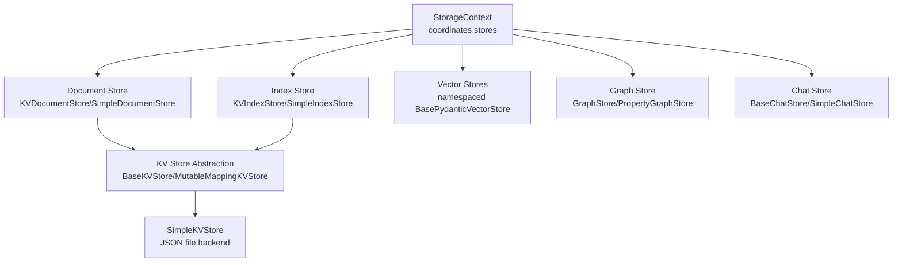
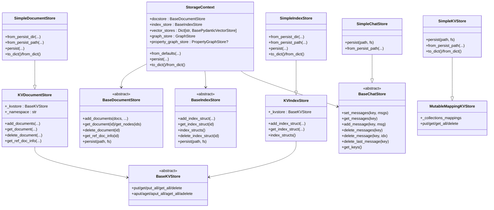
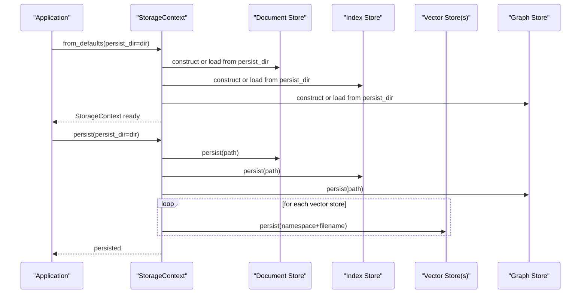
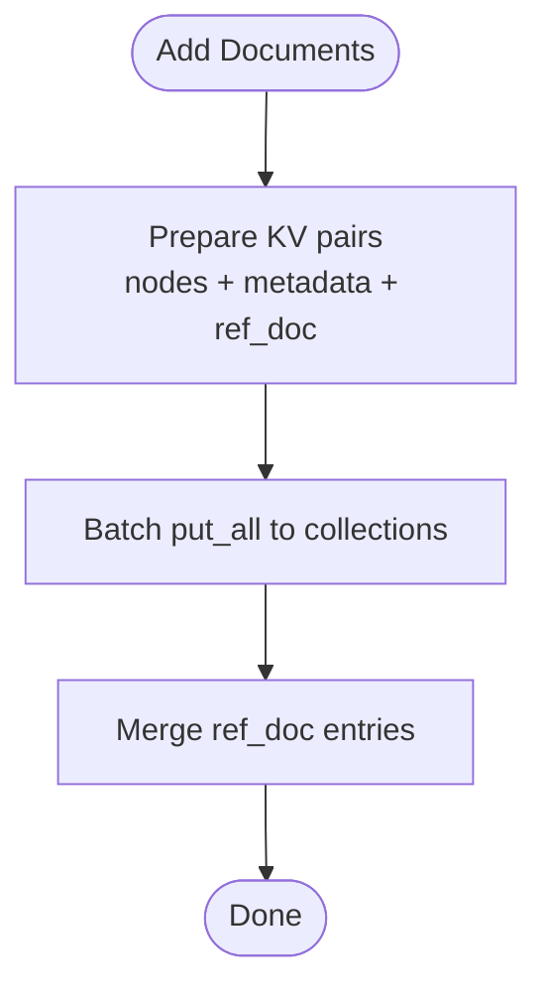
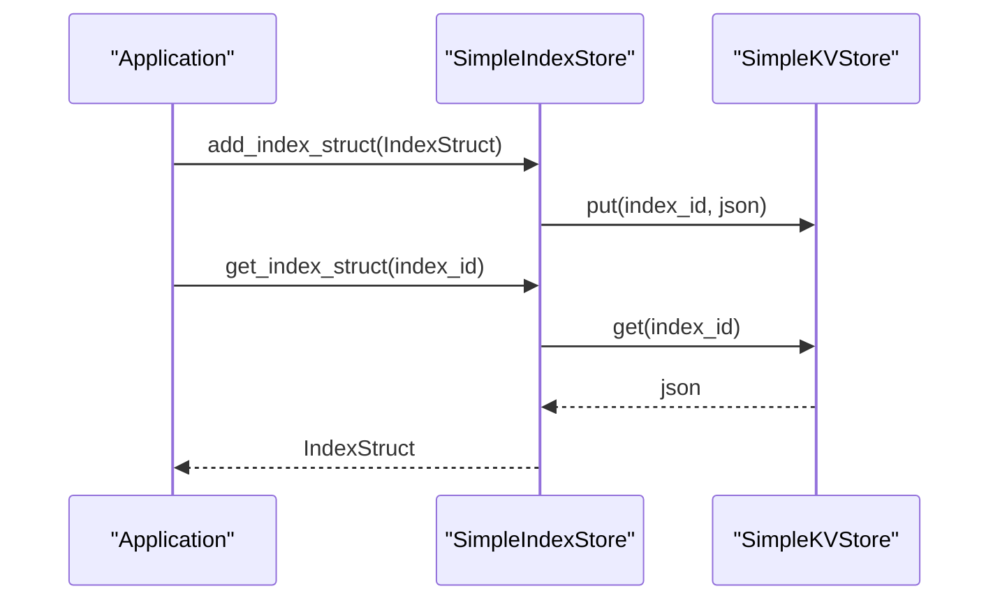
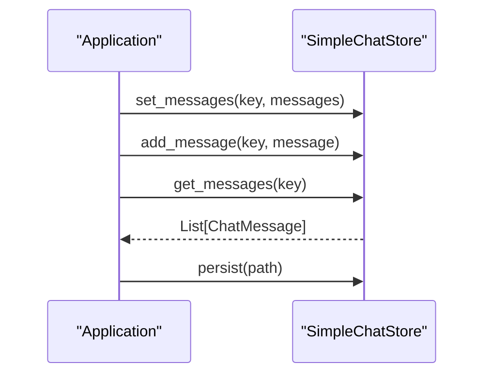
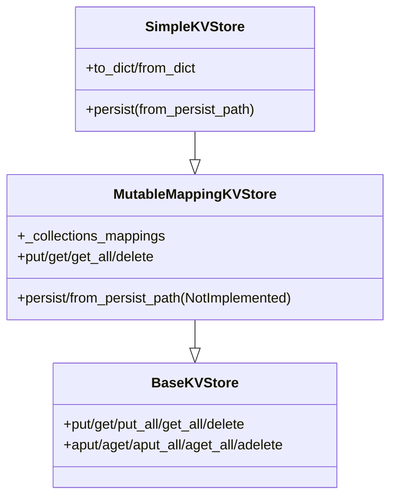
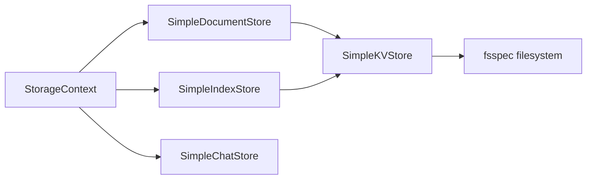

# Storage and Persistence

<cite>
**Referenced Files in This Document**
- [storage_context.py](file://llama-index-core/llama_index/core/storage/storage_context.py)
- [__init__.py](file://llama-index-core/llama_index/core/storage/__init__.py)
- [base.py](file://llama-index-core/llama_index/core/storage/chat_store/base.py)
- [simple_chat_store.py](file://llama-index-core/llama_index/core/storage/chat_store/simple_chat_store.py)
- [keyval_docstore.py](file://llama-index-core/llama_index/core/storage/docstore/keyval_docstore.py)
- [simple_docstore.py](file://llama-index-core/llama_index/core/storage/docstore/simple_docstore.py)
- [types.py](file://llama-index-core/llama_index/core/storage/docstore/types.py)
- [keyval_index_store.py](file://llama-index-core/llama_index/core/storage/index_store/keyval_index_store.py)
- [simple_index_store.py](file://llama-index-core/llama_index/core/storage/index_store/simple_index_store.py)
- [types.py](file://llama-index-core/llama_index/core/storage/index_store/types.py)
- [simple_kvstore.py](file://llama-index-core/llama_index/core/storage/kvstore/simple_kvstore.py)
- [types.py](file://llama-index-core/llama_index/core/storage/kvstore/types.py)
</cite>

## Table of Contents
1. [Introduction](#introduction)
2. [Project Structure](#project-structure)
3. [Core Components](#core-components)
4. [Architecture Overview](#architecture-overview)
5. [Detailed Component Analysis](#detailed-component-analysis)
6. [Dependency Analysis](#dependency-analysis)
7. [Performance Considerations](#performance-considerations)
8. [Troubleshooting Guide](#troubleshooting-guide)
9. [Conclusion](#conclusion)
10. [Appendices](#appendices)

## Introduction
This document explains the LlamaIndex storage and persistence system. It covers the storage context architecture, document stores for persisting nodes, index stores for index metadata, chat stores for conversation history, and key-value stores for arbitrary data. It also documents the storage interfaces, built-in implementations, and how to develop custom storage backends. Practical examples show how to configure different storage backends, migrate between storage types, and optimize performance. Finally, it addresses data serialization, backup strategies, and scaling considerations.

## Project Structure
The storage system is organized around a central StorageContext that coordinates multiple specialized stores:
- Document store: persists nodes and reference document metadata
- Index store: persists index metadata (IndexStruct instances)
- Vector stores: persist embeddings and vectors (namespaced)
- Graph stores: persist graph and property graph data
- Chat store: persists conversation histories per key

Built-in implementations are layered on top of a generic key-value store abstraction, enabling pluggable backends (e.g., in-memory JSON, SQL, NoSQL).

**Diagram sources**
- [storage_context.py](file://llama-index-core/llama_index/core/storage/storage_context.py#L52-L149)
- [keyval_docstore.py](file://llama-index-core/llama_index/core/storage/docstore/keyval_docstore.py#L24-L80)
- [simple_docstore.py](file://llama-index-core/llama_index/core/storage/docstore/simple_docstore.py#L20-L41)
- [keyval_index_store.py](file://llama-index-core/llama_index/core/storage/index_store/keyval_index_store.py#L15-L37)
- [simple_index_store.py](file://llama-index-core/llama_index/core/storage/index_store/simple_index_store.py#L19-L35)
- [simple_kvstore.py](file://llama-index-core/llama_index/core/storage/kvstore/simple_kvstore.py#L16-L31)

**Section sources**
- [storage_context.py](file://llama-index-core/llama_index/core/storage/storage_context.py#L52-L149)
- [__init__.py](file://llama-index-core/llama_index/core/storage/__init__.py#L3-L7)

## Core Components
- StorageContext: central orchestrator that holds and persists the document store, index store, vector stores (including image store), graph store, and optional property graph store. It supports constructing from defaults or from a persistent directory and can persist all stores to disk.
- Document Store: manages nodes and reference document metadata. Built on a key-value abstraction supporting batching and asynchronous operations.
- Index Store: persists index metadata (IndexStruct) keyed by index identifiers.
- Chat Store: persists conversation histories keyed by user/session identifiers with CRUD operations.
- KV Store Abstractions: BaseKVStore defines the minimal interface; MutableMappingKVStore provides a generic in-memory mapping; SimpleKVStore offers a JSON-backed persistence.

Key capabilities:
- Persistent directory layout and filenames for each store
- Namespaced vector stores for multiple embedding namespaces
- Serialization helpers for nodes and index structs
- Async-friendly APIs alongside synchronous ones

**Section sources**
- [storage_context.py](file://llama-index-core/llama_index/core/storage/storage_context.py#L52-L278)
- [types.py](file://llama-index-core/llama_index/core/storage/docstore/types.py#L24-L273)
- [keyval_docstore.py](file://llama-index-core/llama_index/core/storage/docstore/keyval_docstore.py#L24-L80)
- [types.py](file://llama-index-core/llama_index/core/storage/index_store/types.py#L13-L56)
- [keyval_index_store.py](file://llama-index-core/llama_index/core/storage/index_store/keyval_index_store.py#L15-L37)
- [base.py](file://llama-index-core/llama_index/core/storage/chat_store/base.py#L11-L79)
- [simple_chat_store.py](file://llama-index-core/llama_index/core/storage/chat_store/simple_chat_store.py#L31-L113)
- [types.py](file://llama-index-core/llama_index/core/storage/kvstore/types.py#L11-L184)
- [simple_kvstore.py](file://llama-index-core/llama_index/core/storage/kvstore/simple_kvstore.py#L16-L66)

## Architecture Overview
The storage architecture follows a layered design:
- Application code interacts with StorageContext
- StorageContext delegates to concrete stores
- Document and Index stores rely on KVDocumentStore/KVIndexStore backed by BaseKVStore
- SimpleKVStore persists to JSON files; other integrations plug in via BaseKVStore implementations

**Diagram sources**
- [storage_context.py](file://llama-index-core/llama_index/core/storage/storage_context.py#L52-L149)
- [types.py](file://llama-index-core/llama_index/core/storage/docstore/types.py#L24-L273)
- [keyval_docstore.py](file://llama-index-core/llama_index/core/storage/docstore/keyval_docstore.py#L24-L80)
- [simple_docstore.py](file://llama-index-core/llama_index/core/storage/docstore/simple_docstore.py#L20-L41)
- [types.py](file://llama-index-core/llama_index/core/storage/index_store/types.py#L13-L56)
- [keyval_index_store.py](file://llama-index-core/llama_index/core/storage/index_store/keyval_index_store.py#L15-L37)
- [simple_index_store.py](file://llama-index-core/llama_index/core/storage/index_store/simple_index_store.py#L19-L35)
- [base.py](file://llama-index-core/llama_index/core/storage/chat_store/base.py#L11-L79)
- [simple_chat_store.py](file://llama-index-core/llama_index/core/storage/chat_store/simple_chat_store.py#L31-L113)
- [types.py](file://llama-index-core/llama_index/core/storage/kvstore/types.py#L11-L184)
- [simple_kvstore.py](file://llama-index-core/llama_index/core/storage/kvstore/simple_kvstore.py#L16-L66)

## Detailed Component Analysis

### StorageContext
- Purpose: Central container for all persistence-related stores; supports construction from defaults or from a persistent directory; provides a single persist operation to write all stores.
- Key behaviors:
  - from_defaults: constructs SimpleDocumentStore, SimpleIndexStore, SimpleGraphStore, SimpleVectorStore by default; loads from persist_dir when provided; supports namespaced vector stores and optional property graph store.
  - persist: writes docstore, index_store, graph_store, property graph store, and each named vector store to separate files under the same directory.
  - to_dict/from_dict: serializes to a compact dictionary form when using simple stores.

**Diagram sources**
- [storage_context.py](file://llama-index-core/llama_index/core/storage/storage_context.py#L73-L203)

**Section sources**
- [storage_context.py](file://llama-index-core/llama_index/core/storage/storage_context.py#L52-L278)

### Document Store
- Interfaces:
  - BaseDocumentStore: defines add_documents, get_document, delete_document, document_exists, hash operations, and reference document operations.
  - KVDocumentStore: implements batching, async variants, and maintains three collections: node data, metadata, and reference document info.
  - SimpleDocumentStore: concrete in-memory implementation backed by SimpleKVStore; supports from_persist_dir, from_persist_path, persist, to_dict/from_dict.
- Data model:
  - Node collection: stores serialized node objects keyed by node_id
  - Metadata collection: stores per-node metadata (e.g., doc_hash, ref_doc_id)
  - Reference document collection: maps ref_doc_id to RefDocInfo (node_ids and metadata)

**Diagram sources**
- [keyval_docstore.py](file://llama-index-core/llama_index/core/storage/docstore/keyval_docstore.py#L143-L205)

**Section sources**
- [types.py](file://llama-index-core/llama_index/core/storage/docstore/types.py#L24-L273)
- [keyval_docstore.py](file://llama-index-core/llama_index/core/storage/docstore/keyval_docstore.py#L24-L670)
- [simple_docstore.py](file://llama-index-core/llama_index/core/storage/docstore/simple_docstore.py#L20-L107)

### Index Store
- Interfaces:
  - BaseIndexStore: defines add_index_struct, get_index_struct, index_structs, delete_index_struct, and persist.
  - KVIndexStore: stores IndexStruct instances keyed by index_id; supports async operations.
  - SimpleIndexStore: concrete in-memory implementation backed by SimpleKVStore; supports from_persist_dir, from_persist_path, persist, to_dict/from_dict.

**Diagram sources**
- [keyval_index_store.py](file://llama-index-core/llama_index/core/storage/index_store/keyval_index_store.py#L38-L89)
- [simple_index_store.py](file://llama-index-core/llama_index/core/storage/index_store/simple_index_store.py#L19-L77)

**Section sources**
- [types.py](file://llama-index-core/llama_index/core/storage/index_store/types.py#L13-L56)
- [keyval_index_store.py](file://llama-index-core/llama_index/core/storage/index_store/keyval_index_store.py#L15-L143)
- [simple_index_store.py](file://llama-index-core/llama_index/core/storage/index_store/simple_index_store.py#L19-L77)

### Chat Store
- Interfaces:
  - BaseChatStore: defines set_messages, get_messages, add_message, delete_messages, delete_message, delete_last_message, get_keys, plus async variants.
  - SimpleChatStore: concrete in-memory implementation backed by a dictionary keyed by session/user; supports persist and from_persist_path with JSON serialization.
- Serialization:
  - Uses Pydantic serialization with a custom serializer for ChatMessage additional_kwargs to ensure only serializable types are persisted.

**Diagram sources**
- [base.py](file://llama-index-core/llama_index/core/storage/chat_store/base.py#L17-L74)
- [simple_chat_store.py](file://llama-index-core/llama_index/core/storage/chat_store/simple_chat_store.py#L41-L113)

**Section sources**
- [base.py](file://llama-index-core/llama_index/core/storage/chat_store/base.py#L11-L79)
- [simple_chat_store.py](file://llama-index-core/llama_index/core/storage/chat_store/simple_chat_store.py#L31-L113)

### Key-Value Store Abstractions
- BaseKVStore: minimal interface for put/get/put_all/get_all/delete with async counterparts.
- MutableMappingKVStore: generic in-memory mapping per collection; raises NotImplementedError for persist/from_persist_path (delegated to subclasses).
- SimpleKVStore: concrete JSON-backed implementation with persist/from_persist_path and to_dict/from_dict.

**Diagram sources**
- [types.py](file://llama-index-core/llama_index/core/storage/kvstore/types.py#L11-L184)
- [simple_kvstore.py](file://llama-index-core/llama_index/core/storage/kvstore/simple_kvstore.py#L16-L66)

**Section sources**
- [types.py](file://llama-index-core/llama_index/core/storage/kvstore/types.py#L11-L184)
- [simple_kvstore.py](file://llama-index-core/llama_index/core/storage/kvstore/simple_kvstore.py#L16-L66)

## Dependency Analysis
- StorageContext depends on concrete stores and uses a consistent persistence pattern across stores.
- Document and Index stores depend on BaseKVStore abstractions; SimpleDocumentStore and SimpleIndexStore depend on SimpleKVStore.
- Chat store is independent and serializes ChatMessage objects.
- KV store abstractions enable pluggable backends; SimpleKVStore is the default in-memory JSON backend.

**Diagram sources**
- [storage_context.py](file://llama-index-core/llama_index/core/storage/storage_context.py#L169-L202)
- [simple_docstore.py](file://llama-index-core/llama_index/core/storage/docstore/simple_docstore.py#L84-L92)
- [simple_index_store.py](file://llama-index-core/llama_index/core/storage/index_store/simple_index_store.py#L60-L68)
- [simple_kvstore.py](file://llama-index-core/llama_index/core/storage/kvstore/simple_kvstore.py#L35-L56)

**Section sources**
- [storage_context.py](file://llama-index-core/llama_index/core/storage/storage_context.py#L151-L203)
- [simple_docstore.py](file://llama-index-core/llama_index/core/storage/docstore/simple_docstore.py#L84-L102)
- [simple_index_store.py](file://llama-index-core/llama_index/core/storage/index_store/simple_index_store.py#L60-L77)
- [simple_kvstore.py](file://llama-index-core/llama_index/core/storage/kvstore/simple_kvstore.py#L35-L66)

## Performance Considerations
- Batching: KVDocumentStore and KVIndexStore accept a batch_size parameter; SimpleKVStore.put_all requires batch_size=1 by default. For higher throughput, implement a BaseKVStore with native batch support.
- Async operations: KVDocumentStore and KVIndexStore provide async variants; use them in async contexts to avoid blocking.
- Namespaced vector stores: StorageContext supports multiple vector stores under different namespaces; this enables separation of concerns and parallel persistence.
- Persistence granularity: StorageContext persists each store independently; tune persist intervals and filesystem choices for latency and durability trade-offs.

[No sources needed since this section provides general guidance]

## Troubleshooting Guide
- Persist path errors: Ensure persist_dir exists or allow the stores to create directories. SimpleKVStore persists to a single JSON file per store; verify paths and permissions.
- Migration pitfalls: When switching from simple stores to custom KVStore implementations, ensure the new backend supports the required collections and serialization formats used by KVDocumentStore and KVIndexStore.
- Chat message serialization: SimpleChatStore validates that additional_kwargs contain only serializable types; avoid storing non-serializable objects in ChatMessage additional_kwargs.
- Reference document cleanup: Deleting a node removes it from its reference document’s node_ids; if the reference document has no remaining nodes, it is removed from all collections.

**Section sources**
- [simple_kvstore.py](file://llama-index-core/llama_index/core/storage/kvstore/simple_kvstore.py#L35-L56)
- [simple_chat_store.py](file://llama-index-core/llama_index/core/storage/chat_store/simple_chat_store.py#L12-L28)
- [keyval_docstore.py](file://llama-index-core/llama_index/core/storage/docstore/keyval_docstore.py#L484-L536)
- [keyval_index_store.py](file://llama-index-core/llama_index/core/storage/index_store/keyval_index_store.py#L38-L89)

## Conclusion
LlamaIndex provides a cohesive storage and persistence framework centered on StorageContext. The system cleanly separates concerns across document, index, chat, and vector stores while relying on a flexible key-value abstraction. Built-in simple stores offer quick-start persistence, while the KV store interfaces enable migration to production-grade backends. Proper configuration of persist paths, async usage, and careful serialization ensure reliable and scalable deployments.

[No sources needed since this section summarizes without analyzing specific files]

## Appendices

### Practical Examples

- Configure StorageContext with default in-memory stores and persist to a directory
  - Use StorageContext.from_defaults(persist_dir="my_storage") to load or create stores
  - Call StorageContext.persist(persist_dir="my_storage") to write all stores

- Migrate from simple stores to a namespaced vector store setup
  - Construct StorageContext.from_defaults(vector_stores={"namespace": custom_vector_store})
  - Persist to ensure namespaced vector store files are written under the configured directory

- Use a custom KV store backend
  - Implement BaseKVStore and supply it to KVDocumentStore/KVIndexStore constructors
  - Ensure the backend supports the required collections and serialization formats

- Backup and restore
  - For SimpleKVStore, back up the JSON files for each store
  - For distributed systems, use fsspec-compatible filesystems to write to cloud storage

- Optimize performance
  - Increase batch_size for KVDocumentStore/KVIndexStore where supported
  - Use async APIs for high-throughput scenarios
  - Separate embedding namespaces to parallelize persistence

[No sources needed since this section provides general guidance]