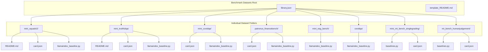
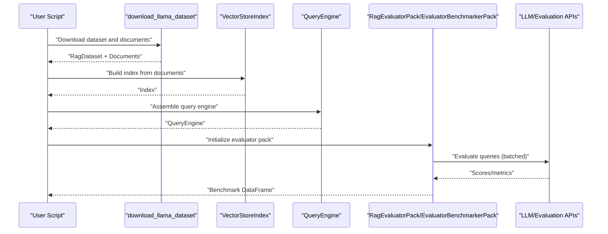
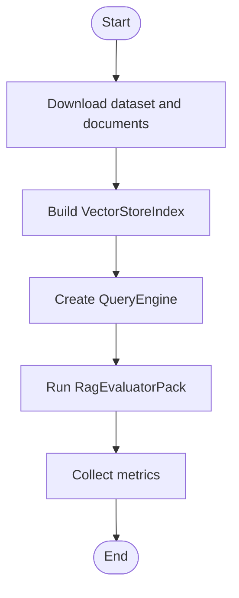
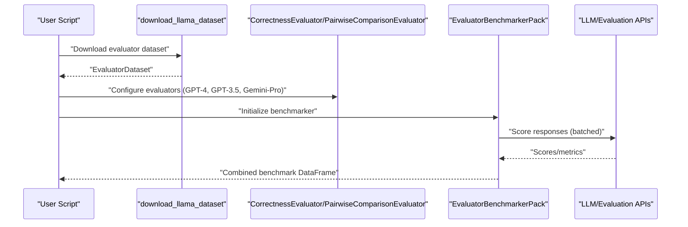
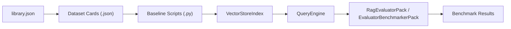

# Benchmark Datasets

<cite>
**Referenced Files in This Document**
- [library.json](file://llama-datasets/library.json)
- [template_README.md](file://llama-datasets/template_README.md)
- [mini_squadv2/README.md](file://llama-datasets/mini_squadv2/README.md)
- [mini_truthfulqa/README.md](file://llama-datasets/mini_truthfulqa/README.md)
- [mini_squadv2/card.json](file://llama-datasets/mini_squadv2/card.json)
- [mini_truthfulqa/card.json](file://llama-datasets/mini_truthfulqa/card.json)
- [mini_covidqa/card.json](file://llama-datasets/mini_covidqa/card.json)
- [patronus_financebench/card.json](file://llama-datasets/patronus_financebench/card.json)
- [mini_squadv2/llamaindex_baseline.py](file://llama-datasets/mini_squadv2/llamaindex_baseline.py)
- [mini_truthfulqa/llamaindex_baseline.py](file://llama-datasets/mini_truthfulqa/llamaindex_baseline.py)
- [mini_covidqa/llamaindex_baseline.py](file://llama-datasets/mini_covidqa/llamaindex_baseline.py)
- [patronus_financebench/llamaindex_baseline.py](file://llama-datasets/patronus_financebench/llamaindex_baseline.py)
- [mini_esg_bench/llamaindex_baseline.py](file://llama-datasets/mini_esg_bench/llamaindex_baseline.py)
- [covidqa/llamaindex_baseline.py](file://llama-datasets/covidqa/llamaindex_baseline.py)
- [mini_mt_bench_singlegrading/baselines.py](file://llama-datasets/mini_mt_bench_singlegrading/baselines.py)
- [mt_bench_humanjudgement/baselines.py](file://llama-datasets/mt_bench_humanjudgement/baselines.py)
</cite>

## Table of Contents
1. [Introduction](#introduction)
2. [Project Structure](#project-structure)
3. [Core Components](#core-components)
4. [Architecture Overview](#architecture-overview)
5. [Detailed Component Analysis](#detailed-component-analysis)
6. [Dependency Analysis](#dependency-analysis)
7. [Performance Considerations](#performance-considerations)
8. [Troubleshooting Guide](#troubleshooting-guide)
9. [Conclusion](#conclusion)
10. [Appendices](#appendices)

## Introduction
This document describes the LlamaIndex benchmark datasets section, focusing on standardized evaluation datasets and baseline implementations. It covers the complete library of datasets, including MiniSQuAD v2, MiniTruthfulQA, MiniCovidQA, CovidQA, MiniESGBench, Patronus FinanceBench, and MTEB-style evaluations (Mini MT-Bench Single Grading and MT-Bench Human Judgement). For each dataset, we explain dataset structure, preprocessing requirements, baseline implementations, evaluation protocols, scoring mechanisms, and comparison methodologies. Practical examples demonstrate dataset loading, preprocessing workflows, and baseline performance evaluation. We also document dataset cards (card.json) metadata, evaluation metrics, and performance benchmarks, and address licensing, attribution, and ethical considerations.

## Project Structure
The benchmark datasets are organized under a dedicated directory with per-dataset folders. Each folder typically contains:
- A dataset card (card.json) with metadata, evaluation metrics, and baseline configurations
- A README with usage instructions and citations
- A baseline script (llamaindex_baseline.py) implementing a standard RAG pipeline and evaluation
- Optionally, a baselines.py for specialized evaluators (e.g., correctness or pairwise comparison)

**Diagram sources**
- [library.json](file://llama-datasets/library.json#L1-L88)
- [mini_squadv2/README.md](file://llama-datasets/mini_squadv2/README.md#L1-L80)
- [mini_truthfulqa/README.md](file://llama-datasets/mini_truthfulqa/README.md#L1-L75)
- [mini_squadv2/card.json](file://llama-datasets/mini_squadv2/card.json#L1-L28)
- [mini_truthfulqa/card.json](file://llama-datasets/mini_truthfulqa/card.json#L1-L28)
- [mini_covidqa/card.json](file://llama-datasets/mini_covidqa/card.json#L1-L30)
- [patronus_financebench/card.json](file://llama-datasets/patronus_financebench/card.json#L1-L28)
- [mini_squadv2/llamaindex_baseline.py](file://llama-datasets/mini_squadv2/llamaindex_baseline.py#L1-L36)
- [mini_truthfulqa/llamaindex_baseline.py](file://llama-datasets/mini_truthfulqa/llamaindex_baseline.py#L1-L36)
- [mini_covidqa/llamaindex_baseline.py](file://llama-datasets/mini_covidqa/llamaindex_baseline.py#L1-L36)
- [patronus_financebench/llamaindex_baseline.py](file://llama-datasets/patronus_financebench/llamaindex_baseline.py#L1-L38)
- [mini_esg_bench/llamaindex_baseline.py](file://llama-datasets/mini_esg_bench/llamaindex_baseline.py#L1-L36)
- [covidqa/llamaindex_baseline.py](file://llama-datasets/covidqa/llamaindex_baseline.py#L1-L36)
- [mini_mt_bench_singlegrading/baselines.py](file://llama-datasets/mini_mt_bench_singlegrading/baselines.py#L1-L85)
- [mt_bench_humanjudgement/baselines.py](file://llama-datasets/mt_bench_humanjudgement/baselines.py#L1-L85)

**Section sources**
- [library.json](file://llama-datasets/library.json#L1-L88)
- [template_README.md](file://llama-datasets/template_README.md)

## Core Components
- Dataset registry: library.json enumerates dataset identifiers, authors, and keywords for discovery and filtering.
- Dataset cards: card.json defines dataset metadata, class type, number of observations, human/AI labeling, source URLs, and baseline entries with configuration and metrics.
- Baseline implementations: Per-dataset scripts demonstrate a canonical RAG pipeline and evaluation using LlamaIndex packs and evaluators.
- Evaluation packs and evaluators: Standardized packs and evaluators enable consistent benchmarking across datasets.

Key capabilities:
- Download datasets programmatically via a dataset identifier
- Build a basic RAG pipeline (index + query engine)
- Evaluate with standardized packs and collect benchmark results
- Compare results across models and configurations using shared metrics

**Section sources**
- [library.json](file://llama-datasets/library.json#L1-L88)
- [mini_squadv2/card.json](file://llama-datasets/mini_squadv2/card.json#L1-L28)
- [mini_truthfulqa/card.json](file://llama-datasets/mini_truthfulqa/card.json#L1-L28)
- [mini_covidqa/card.json](file://llama-datasets/mini_covidqa/card.json#L1-L30)
- [patronus_financebench/card.json](file://llama-datasets/patronus_financebench/card.json#L1-L28)
- [mini_squadv2/llamaindex_baseline.py](file://llama-datasets/mini_squadv2/llamaindex_baseline.py#L1-L36)
- [mini_truthfulqa/llamaindex_baseline.py](file://llama-datasets/mini_truthfulqa/llamaindex_baseline.py#L1-L36)
- [mini_covidqa/llamaindex_baseline.py](file://llama-datasets/mini_covidqa/llamaindex_baseline.py#L1-L36)
- [patronus_financebench/llamaindex_baseline.py](file://llama-datasets/patronus_financebench/llamaindex_baseline.py#L1-L38)

## Architecture Overview
The benchmarking workflow follows a consistent pattern across datasets:
- Download dataset and source documents
- Build a retrieval-augmented pipeline (VectorStoreIndex + query engine)
- Run evaluation pack(s) to score queries against ground-truth
- Aggregate and compare results

**Diagram sources**
- [mini_squadv2/llamaindex_baseline.py](file://llama-datasets/mini_squadv2/llamaindex_baseline.py#L8-L30)
- [mini_truthfulqa/llamaindex_baseline.py](file://llama-datasets/mini_truthfulqa/llamaindex_baseline.py#L8-L30)
- [mini_covidqa/llamaindex_baseline.py](file://llama-datasets/mini_covidqa/llamaindex_baseline.py#L8-L30)
- [patronus_financebench/llamaindex_baseline.py](file://llama-datasets/patronus_financebench/llamaindex_baseline.py#L8-L32)
- [mini_mt_bench_singlegrading/baselines.py](file://llama-datasets/mini_mt_bench_singlegrading/baselines.py#L11-L79)
- [mt_bench_humanjudgement/baselines.py](file://llama-datasets/mt_bench_humanjudgement/baselines.py#L11-L79)

## Detailed Component Analysis

### MiniSQuAD v2
- Dataset structure: labeled RAG dataset with a small subset of SQuAD v2 covering top Wikipedia pages.
- Preprocessing: documents are loaded from a source directory and indexed; evaluation compares generated answers to ground truth.
- Baseline implementation: builds a VectorStoreIndex, creates a query engine, and evaluates using RagEvaluatorPack with configurable batching and rate limits.
- Evaluation metrics: context similarity, correctness, faithfulness, relevancy are reported in the dataset card.
- Practical example: see dataset README for CLI and code usage, and the baseline script for end-to-end execution.

**Diagram sources**
- [mini_squadv2/llamaindex_baseline.py](file://llama-datasets/mini_squadv2/llamaindex_baseline.py#L8-L30)
- [mini_squadv2/README.md](file://llama-datasets/mini_squadv2/README.md#L18-L63)
- [mini_squadv2/card.json](file://llama-datasets/mini_squadv2/card.json#L1-L28)

**Section sources**
- [mini_squadv2/README.md](file://llama-datasets/mini_squadv2/README.md#L1-L80)
- [mini_squadv2/card.json](file://llama-datasets/mini_squadv2/card.json#L1-L28)
- [mini_squadv2/llamaindex_baseline.py](file://llama-datasets/mini_squadv2/llamaindex_baseline.py#L1-L36)

### MiniTruthfulQA
- Dataset structure: subset of TruthfulQA focusing on Wikipedia-based questions; designed to assess truthfulness and faithfulness.
- Preprocessing: similar pipeline; documents loaded and indexed for evaluation.
- Baseline implementation: identical evaluation pattern with RagEvaluatorPack and batched API calls.
- Evaluation metrics: correctness, faithfulness, relevancy included in the card; context similarity may be null depending on evaluator support.

**Section sources**
- [mini_truthfulqa/README.md](file://llama-datasets/mini_truthfulqa/README.md#L1-L75)
- [mini_truthfulqa/card.json](file://llama-datasets/mini_truthfulqa/card.json#L1-L28)
- [mini_truthfulqa/llamaindex_baseline.py](file://llama-datasets/mini_truthfulqa/llamaindex_baseline.py#L1-L36)

### MiniCovidQA
- Dataset structure: mini subset of a larger COVID-QA dataset derived from news sources; human-annotated question-answer pairs.
- Preprocessing: documents loaded from source files; index built for retrieval.
- Baseline implementation: standard RAG pipeline and RagEvaluatorPack evaluation.

**Section sources**
- [mini_covidqa/card.json](file://llama-datasets/mini_covidqa/card.json#L1-L30)
- [mini_covidqa/llamaindex_baseline.py](file://llama-datasets/mini_covidqa/llamaindex_baseline.py#L1-L36)

### CovidQA
- Dataset structure: full-scale COVID-QA dataset for broader coverage.
- Preprocessing and baseline: follows the same standard pipeline as other datasets.

**Section sources**
- [covidqa/llamaindex_baseline.py](file://llama-datasets/covidqa/llamaindex_baseline.py#L1-L36)

### MiniESGBench
- Dataset structure: PDF-focused dataset for environmental, social, and governance (ESG) evaluation.
- Preprocessing and baseline: standard RAG pipeline and evaluation.

**Section sources**
- [mini_esg_bench/llamaindex_baseline.py](file://llama-datasets/mini_esg_bench/llamaindex_baseline.py#L1-L36)

### Patronus FinanceBench
- Dataset structure: financial question answering dataset with annotated evidence strings for publicly traded companies.
- Preprocessing and baseline: standard pipeline; evaluation metrics include context similarity, correctness, faithfulness, and relevancy.

**Section sources**
- [patronus_financebench/card.json](file://llama-datasets/patronus_financebench/card.json#L1-L28)
- [patronus_financebench/llamaindex_baseline.py](file://llama-datasets/patronus_financebench/llamaindex_baseline.py#L1-L38)

### MTEB Benchmarks (Mini MT-Bench Single Grading and MT-Bench Human Judgement)
- Dataset structure: designed for evaluator benchmarking using either single-grading or pairwise comparison paradigms.
- Preprocessing: dataset downloaded and documents prepared similarly.
- Baseline implementation: uses CorrectnessEvaluator or PairwiseComparisonEvaluator with multiple LLMs (e.g., GPT-4, GPT-3.5, Gemini Pro) and EvaluatorBenchmarkerPack to produce comparative results.

**Diagram sources**
- [mini_mt_bench_singlegrading/baselines.py](file://llama-datasets/mini_mt_bench_singlegrading/baselines.py#L11-L79)
- [mt_bench_humanjudgement/baselines.py](file://llama-datasets/mt_bench_humanjudgement/baselines.py#L11-L79)

**Section sources**
- [mini_mt_bench_singlegrading/baselines.py](file://llama-datasets/mini_mt_bench_singlegrading/baselines.py#L1-L85)
- [mt_bench_humanjudgement/baselines.py](file://llama-datasets/mt_bench_humanjudgement/baselines.py#L1-L85)

## Dependency Analysis
The datasets share a common dependency chain:
- Dataset download and metadata: library.json and dataset cards
- Pipeline construction: VectorStoreIndex and query engine
- Evaluation: RagEvaluatorPack or EvaluatorBenchmarkerPack
- Metrics: correctness, faithfulness, relevancy, context similarity

**Diagram sources**
- [library.json](file://llama-datasets/library.json#L1-L88)
- [mini_squadv2/card.json](file://llama-datasets/mini_squadv2/card.json#L1-L28)
- [mini_truthfulqa/card.json](file://llama-datasets/mini_truthfulqa/card.json#L1-L28)
- [mini_covidqa/card.json](file://llama-datasets/mini_covidqa/card.json#L1-L30)
- [patronus_financebench/card.json](file://llama-datasets/patronus_financebench/card.json#L1-L28)
- [mini_squadv2/llamaindex_baseline.py](file://llama-datasets/mini_squadv2/llamaindex_baseline.py#L1-L36)
- [mini_truthfulqa/llamaindex_baseline.py](file://llama-datasets/mini_truthfulqa/llamaindex_baseline.py#L1-L36)
- [mini_covidqa/llamaindex_baseline.py](file://llama-datasets/mini_covidqa/llamaindex_baseline.py#L1-L36)
- [patronus_financebench/llamaindex_baseline.py](file://llama-datasets/patronus_financebench/llamaindex_baseline.py#L1-L38)
- [mini_mt_bench_singlegrading/baselines.py](file://llama-datasets/mini_mt_bench_singlegrading/baselines.py#L1-L85)
- [mt_bench_humanjudgement/baselines.py](file://llama-datasets/mt_bench_humanjudgement/baselines.py#L1-L85)

**Section sources**
- [library.json](file://llama-datasets/library.json#L1-L88)

## Performance Considerations
- Batch sizing and rate limiting: baseline scripts include notes recommending adjusted batch sizes and sleep intervals for lower-tier API subscriptions to avoid throttling.
- Model selection: baseline configurations specify chunk size, embedding model, and LLM; tuning these parameters affects latency and accuracy trade-offs.
- Indexing strategy: top-k retrieval and chunk size influence retrieval quality and cost.
- Evaluation throughput: EvaluatorBenchmarkerPack supports batching and progress reporting for large-scale evaluations.

Practical guidance:
- Start with provided batch sizes and adjust based on API quotas and latency targets.
- Experiment with different LLMs and embedding models to balance cost and performance.
- Monitor evaluation runtime and adjust sleep intervals to respect provider rate limits.

**Section sources**
- [mini_squadv2/llamaindex_baseline.py](file://llama-datasets/mini_squadv2/llamaindex_baseline.py#L20-L29)
- [mini_truthfulqa/llamaindex_baseline.py](file://llama-datasets/mini_truthfulqa/llamaindex_baseline.py#L20-L29)
- [mini_covidqa/llamaindex_baseline.py](file://llama-datasets/mini_covidqa/llamaindex_baseline.py#L20-L29)
- [patronus_financebench/llamaindex_baseline.py](file://llama-datasets/patronus_financebench/llamaindex_baseline.py#L22-L31)
- [mini_mt_bench_singlegrading/baselines.py](file://llama-datasets/mini_mt_bench_singlegrading/baselines.py#L37-L42)
- [mt_bench_humanjudgement/baselines.py](file://llama-datasets/mt_bench_humanjudgement/baselines.py#L37-L42)

## Troubleshooting Guide
Common issues and resolutions:
- API quota exceeded: reduce batch_size and increase sleep_time_in_seconds as noted in baseline scripts.
- Slow evaluation runs: enable progress reporting and tune batch sizes; consider distributing evaluations across multiple evaluators.
- Missing dependencies: ensure llamapacks and evaluators are downloaded and configured properly before running scripts.
- Dataset loading errors: verify dataset identifiers match those in library.json and confirm local cache directories exist.

Operational tips:
- Use the dataset READMEs to validate dataset availability and expected structure.
- Confirm environment variables for LLM providers are configured.
- For MTEB-style evaluations, ensure evaluators are instantiated with compatible service contexts.

**Section sources**
- [mini_squadv2/llamaindex_baseline.py](file://llama-datasets/mini_squadv2/llamaindex_baseline.py#L20-L29)
- [mini_truthfulqa/llamaindex_baseline.py](file://llama-datasets/mini_truthfulqa/llamaindex_baseline.py#L20-L29)
- [mini_covidqa/llamaindex_baseline.py](file://llama-datasets/mini_covidqa/llamaindex_baseline.py#L20-L29)
- [patronus_financebench/llamaindex_baseline.py](file://llama-datasets/patronus_financebench/llamaindex_baseline.py#L22-L31)
- [mini_mt_bench_singlegrading/baselines.py](file://llama-datasets/mini_mt_bench_singlegrading/baselines.py#L37-L42)
- [mt_bench_humanjudgement/baselines.py](file://llama-datasets/mt_bench_humanjudgement/baselines.py#L37-L42)

## Conclusion
The LlamaIndex benchmark datasets provide a standardized, reusable framework for evaluating retrieval-augmented systems. With consistent dataset cards, baseline implementations, and evaluation packs, researchers and practitioners can reproduce results, compare configurations, and iterate on RAG pipelines efficiently. Adhering to the documented evaluation protocols and performance guidelines ensures reliable and reproducible outcomes across domains such as general QA, truthfulness, health-related questions, ESG, and finance.

## Appendices

### Dataset Selection Criteria
- Task alignment: choose datasets aligned with your domain and evaluation goals (e.g., general QA vs. financial QA).
- Scale and cost: mini datasets offer quick iteration; full datasets provide broader coverage but require more compute.
- Metrics focus: select datasets emphasizing the metrics most relevant to your use case (correctness, faithfulness, relevancy, context similarity).
- Licensing and attribution: review dataset cards for source URLs and citation guidance.

### Evaluation Methodology Comparisons
- RagEvaluatorPack: end-to-end RAG evaluation with predefined metrics; suitable for broad comparative studies.
- EvaluatorBenchmarkerPack: specialized evaluators (correctness, pairwise comparison) for targeted metric assessments; useful for methodological ablations.

### Performance Benchmark Interpretation
- Metrics interpretation: correctness and faithfulness are often used as proxies for answer quality; relevancy and context similarity reflect retrieval effectiveness.
- Comparative analysis: aggregate results across multiple LLMs and configurations to identify optimal setups for your workload.
- Confidence and variance: consider sample sizes and variability when interpreting scores; larger datasets generally yield more stable estimates.

### Licensing, Attribution, and Ethical Considerations
- Dataset cards include source URLs and citations; follow attribution requirements when reproducing or publishing results.
- Respect provider rate limits and usage tiers; adjust batch sizes and sleep intervals accordingly.
- Consider ethical implications of deploying RAG systems trained or evaluated on sensitive domains (health, finance); ensure appropriate safeguards and oversight.

**Section sources**
- [mini_squadv2/card.json](file://llama-datasets/mini_squadv2/card.json#L8-L8)
- [mini_truthfulqa/card.json](file://llama-datasets/mini_truthfulqa/card.json#L8-L8)
- [mini_covidqa/card.json](file://llama-datasets/mini_covidqa/card.json#L8-L10)
- [patronus_financebench/card.json](file://llama-datasets/patronus_financebench/card.json#L8-L8)
- [mini_squadv2/README.md](file://llama-datasets/mini_squadv2/README.md#L65-L79)
- [mini_truthfulqa/README.md](file://llama-datasets/mini_truthfulqa/README.md#L63-L74)