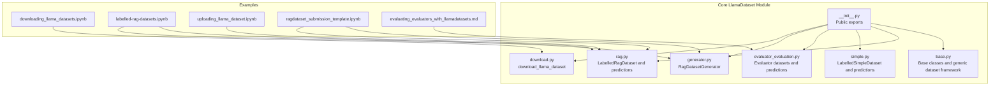
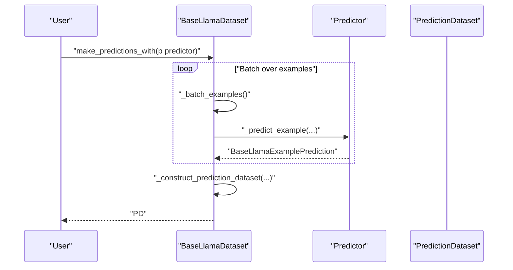
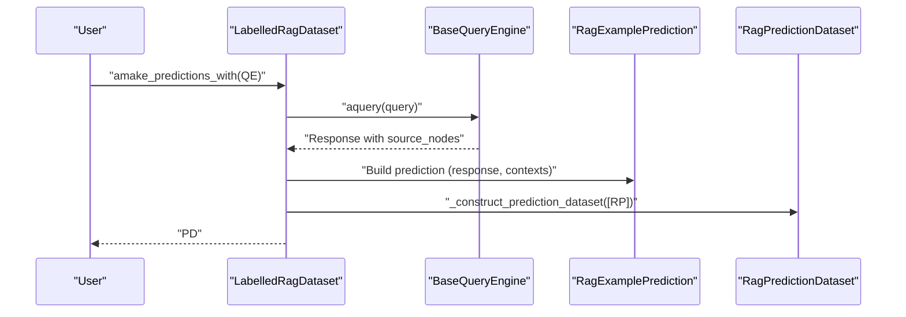
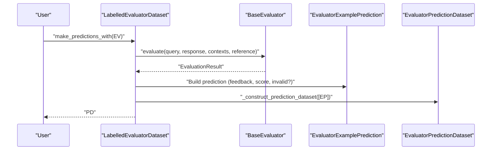
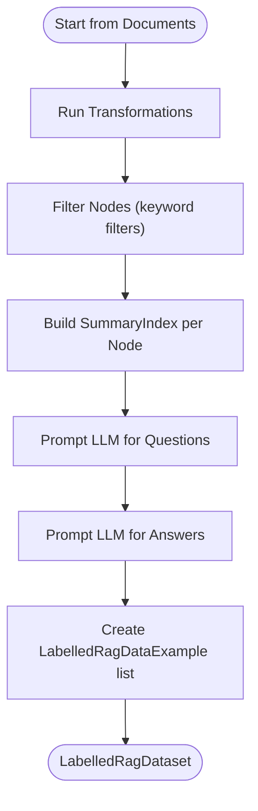
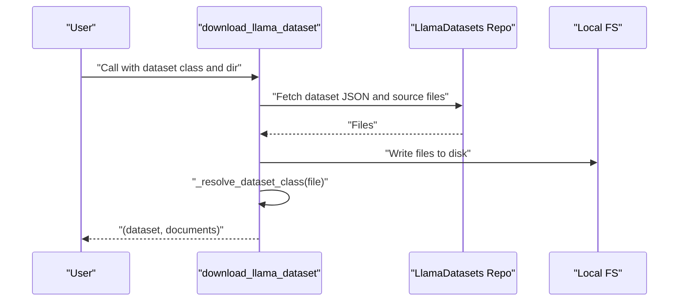
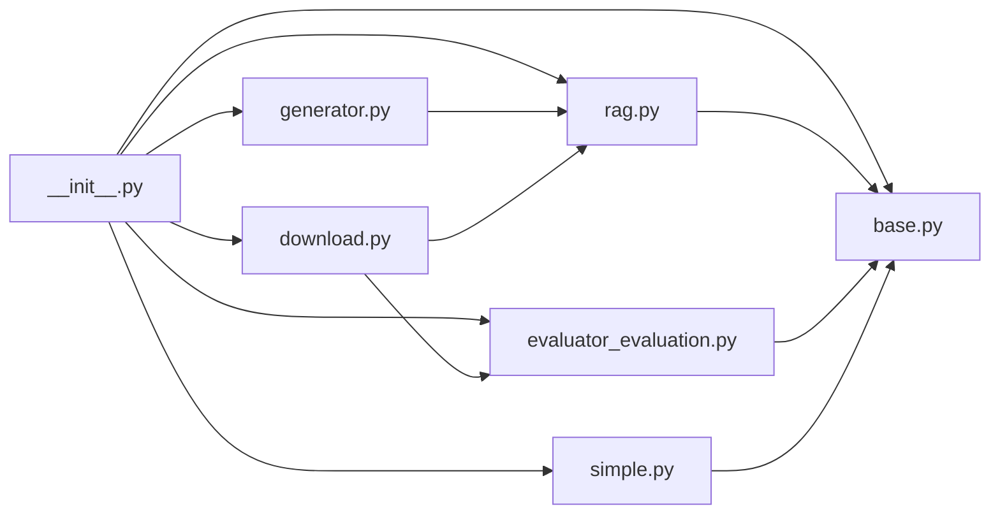

# Custom Dataset Creation

<cite>
**Referenced Files in This Document**
- [__init__.py](file://llama-index-core/llama_index/core/llama_dataset/__init__.py)
- [base.py](file://llama-index-core/llama_index/core/llama_dataset/base.py)
- [generator.py](file://llama-index-core/llama_index/core/llama_dataset/generator.py)
- [rag.py](file://llama-index-core/llama_index/core/llama_dataset/rag.py)
- [simple.py](file://llama-index-core/llama_index/core/llama_dataset/simple.py)
- [evaluator_evaluation.py](file://llama-index-core/llama_index/core/llama_dataset/evaluator_evaluation.py)
- [download.py](file://llama-index-core/llama_index/core/llama_dataset/download.py)
- [downloading_llama_datasets.ipynb](file://docs/examples/llama_dataset/downloading_llama_datasets.ipynb)
- [labelled-rag-datasets.ipynb](file://docs/examples/llama_dataset/labelled-rag-datasets.ipynb)
- [uploading_llama_dataset.ipynb](file://docs/examples/llama_dataset/uploading_llama_dataset.ipynb)
- [ragdataset_submission_template.ipynb](file://docs/examples/llama_dataset/ragdataset_submission_template.ipynb)
- [evaluating_evaluators_with_llamadatasets.md](file://docs/src/content/docs/framework/module_guides/evaluating/evaluating_evaluators_with_llamadatasets.md)
</cite>

## Table of Contents
1. [Introduction](#introduction)
2. [Project Structure](#project-structure)
3. [Core Components](#core-components)
4. [Architecture Overview](#architecture-overview)
5. [Detailed Component Analysis](#detailed-component-analysis)
6. [Dependency Analysis](#dependency-analysis)
7. [Performance Considerations](#performance-considerations)
8. [Troubleshooting Guide](#troubleshooting-guide)
9. [Conclusion](#conclusion)
10. [Appendices](#appendices)

## Introduction
This document explains how to create custom datasets with the LlamaIndex LlamaDataset framework. It covers dataset generation, annotation workflows, evaluation dataset construction, quality assurance, and distribution. It also provides guidance on dataset versioning, provenance tracking, collaborative annotation, and community contribution standards.

## Project Structure
The LlamaDataset module lives under the core library and exposes dataset classes, generators, and evaluation utilities. Example notebooks demonstrate end-to-end workflows for generating, evaluating, and contributing datasets.

**Diagram sources**
- [__init__.py](file://llama-index-core/llama_index/core/llama_dataset/__init__.py#L1-L62)
- [base.py](file://llama-index-core/llama_index/core/llama_dataset/base.py#L1-L357)
- [rag.py](file://llama-index-core/llama_index/core/llama_dataset/rag.py#L1-L193)
- [simple.py](file://llama-index-core/llama_index/core/llama_dataset/simple.py#L1-L142)
- [evaluator_evaluation.py](file://llama-index-core/llama_index/core/llama_dataset/evaluator_evaluation.py#L1-L500)
- [generator.py](file://llama-index-core/llama_index/core/llama_dataset/generator.py#L1-L262)
- [download.py](file://llama-index-core/llama_index/core/llama_dataset/download.py#L1-L96)
- [downloading_llama_datasets.ipynb](file://docs/examples/llama_dataset/downloading_llama_datasets.ipynb#L1-L670)
- [labelled-rag-datasets.ipynb](file://docs/examples/llama_dataset/labelled-rag-datasets.ipynb#L1-L963)
- [uploading_llama_dataset.ipynb](file://docs/examples/llama_dataset/uploading_llama_dataset.ipynb#L1-L349)
- [ragdataset_submission_template.ipynb](file://docs/examples/llama_dataset/ragdataset_submission_template.ipynb#L1-L1642)
- [evaluating_evaluators_with_llamadatasets.md](file://docs/src/content/docs/framework/module_guides/evaluating/evaluating_evaluators_with_llamadatasets.md#L1-L14)

**Section sources**
- [__init__.py](file://llama-index-core/llama_index/core/llama_dataset/__init__.py#L1-L62)
- [base.py](file://llama-index-core/llama_index/core/llama_dataset/base.py#L1-L357)
- [generator.py](file://llama-index-core/llama_index/core/llama_dataset/generator.py#L1-L262)
- [rag.py](file://llama-index-core/llama_index/core/llama_dataset/rag.py#L1-L193)
- [simple.py](file://llama-index-core/llama_index/core/llama_dataset/simple.py#L1-L142)
- [evaluator_evaluation.py](file://llama-index-core/llama_index/core/llama_dataset/evaluator_evaluation.py#L1-L500)
- [download.py](file://llama-index-core/llama_index/core/llama_dataset/download.py#L1-L96)
- [downloading_llama_datasets.ipynb](file://docs/examples/llama_dataset/downloading_llama_datasets.ipynb#L1-L670)
- [labelled-rag-datasets.ipynb](file://docs/examples/llama_dataset/labelled-rag-datasets.ipynb#L1-L963)
- [uploading_llama_dataset.ipynb](file://docs/examples/llama_dataset/uploading_llama_dataset.ipynb#L1-L349)
- [ragdataset_submission_template.ipynb](file://docs/examples/llama_dataset/ragdataset_submission_template.ipynb#L1-L1642)
- [evaluating_evaluators_with_llamadatasets.md](file://docs/src/content/docs/framework/module_guides/evaluating/evaluating_evaluators_with_llamadatasets.md#L1-L14)

## Core Components
- Base dataset framework: generic dataset and prediction dataset abstractions, batching, async support, and JSON serialization.
- Labelled RAG dataset: query-answer pairs with optional reference contexts and provenance tracking.
- Labelled evaluator dataset: evaluation examples with reference scores/feedback for evaluator benchmarking.
- Labelled simple dataset: minimal classification-style examples with predictions.
- Dataset generator: synthetic generation of RAG examples from documents.
- Download utility: fetch datasets and source documents from LlamaHub/LlamaDatasets.

Key capabilities:
- Predict on datasets with query engines, evaluators, or LLMs.
- Export predictions and datasets to pandas for analysis.
- Persist datasets and predictions to JSON for reproducibility and collaboration.

**Section sources**
- [base.py](file://llama-index-core/llama_index/core/llama_dataset/base.py#L130-L357)
- [rag.py](file://llama-index-core/llama_index/core/llama_dataset/rag.py#L118-L193)
- [evaluator_evaluation.py](file://llama-index-core/llama_index/core/llama_dataset/evaluator_evaluation.py#L150-L266)
- [simple.py](file://llama-index-core/llama_index/core/llama_dataset/simple.py#L77-L142)
- [generator.py](file://llama-index-core/llama_index/core/llama_dataset/generator.py#L48-L262)
- [download.py](file://llama-index-core/llama_index/core/llama_dataset/download.py#L35-L96)

## Architecture Overview
The LlamaDataset framework centers on a generic base class that enforces a consistent interface for:
- Defining example types and prediction types
- Serializing to/from JSON
- Predicting with query engines, evaluators, or LLMs
- Converting to pandas for analysis

Concrete dataset classes specialize the base for RAG, evaluator, and simple tasks.

```mermaid
classDiagram
class BaseLlamaDataExample {
<<abstract>>
+class_name : str
}
class BaseLlamaExamplePrediction {
<<abstract>>
+class_name : str
}
class BaseLlamaDataset {
<<abstract>>
+examples : List[BaseLlamaDataExample]
+to_pandas() Any
+save_json(path)
+from_json(path) BaseLlamaDataset
+make_predictions_with(...)
+amake_predictions_with(...)
<<abstract>>
}
class BaseLlamaPredictionDataset {
<<abstract>>
+predictions : List[BaseLlamaExamplePrediction]
+to_pandas() Any
+save_json(path)
+from_json(path) BaseLlamaPredictionDataset
<<abstract>>
}
class LabelledRagDataExample {
+query : str
+reference_contexts : List[str]
+reference_answer : str
+query_by : CreatedBy
+reference_answer_by : CreatedBy
}
class RagExamplePrediction {
+response : str
+contexts : List[str]
}
class LabelledRagDataset {
+to_pandas() DataFrame
+_predict_example(...)
+_apredict_example(...)
+_construct_prediction_dataset(...)
}
class RagPredictionDataset {
+to_pandas() DataFrame
}
class LabelledEvaluatorDataExample {
+query : str
+answer : str
+contexts : List[str]
+ground_truth_answer : str
+reference_score : float
+reference_feedback : str
+query_by : CreatedBy
+answer_by : CreatedBy
+reference_evaluation_by : CreatedBy
}
class EvaluatorExamplePrediction {
+feedback : str
+score : float
+invalid_prediction : bool
+invalid_reason : str
}
class LabelledEvaluatorDataset {
+to_pandas() DataFrame
+_predict_example(...)
+_apredict_example(...)
+_construct_prediction_dataset(...)
}
class EvaluatorPredictionDataset {
+to_pandas() DataFrame
}
class LabelledSimpleDataExample {
+reference_label : str
+text : str
+text_by : CreatedBy
}
class SimpleExamplePrediction {
+label : str
}
class LabelledSimpleDataset {
+to_pandas() DataFrame
+_construct_prediction_dataset(...)
}
class SimplePredictionDataset {
+to_pandas() DataFrame
}
class RagDatasetGenerator {
+from_documents(...)
+generate_dataset_from_nodes()
+generate_questions_from_nodes()
}
BaseLlamaDataset --> BaseLlamaDataExample : "has examples"
BaseLlamaDataset --> BaseLlamaExamplePrediction : "produces predictions"
BaseLlamaPredictionDataset --> BaseLlamaExamplePrediction : "holds"
LabelledRagDataset --> LabelledRagDataExample : "examples"
LabelledRagDataset --> RagExamplePrediction : "predictions"
RagPredictionDataset --> RagExamplePrediction : "predictions"
LabelledEvaluatorDataset --> LabelledEvaluatorDataExample : "examples"
LabelledEvaluatorDataset --> EvaluatorExamplePrediction : "predictions"
EvaluatorPredictionDataset --> EvaluatorExamplePrediction : "predictions"
LabelledSimpleDataset --> LabelledSimpleDataExample : "examples"
LabelledSimpleDataset --> SimpleExamplePrediction : "predictions"
SimplePredictionDataset --> SimpleExamplePrediction : "predictions"
```

**Diagram sources**
- [base.py](file://llama-index-core/llama_index/core/llama_dataset/base.py#L55-L357)
- [rag.py](file://llama-index-core/llama_index/core/llama_dataset/rag.py#L44-L193)
- [evaluator_evaluation.py](file://llama-index-core/llama_index/core/llama_dataset/evaluator_evaluation.py#L22-L266)
- [simple.py](file://llama-index-core/llama_index/core/llama_dataset/simple.py#L13-L142)
- [generator.py](file://llama-index-core/llama_index/core/llama_dataset/generator.py#L48-L262)

## Detailed Component Analysis

### Base Dataset Framework
- Defines generic dataset and prediction dataset abstractions with JSON serialization helpers.
- Provides synchronous and asynchronous prediction pipelines with batching and rate-limit awareness.
- Exposes a typed example and prediction type to enforce schema consistency.

**Diagram sources**
- [base.py](file://llama-index-core/llama_index/core/llama_dataset/base.py#L211-L350)

**Section sources**
- [base.py](file://llama-index-core/llama_index/core/llama_dataset/base.py#L130-L357)

### Labelled RAG Dataset
- Data example fields include query, reference answer, optional reference contexts, and provenance (who created the query/answer).
- Supports prediction via a query engine, capturing response and source contexts.
- Provides pandas export for analysis and evaluation.

**Diagram sources**
- [rag.py](file://llama-index-core/llama_index/core/llama_dataset/rag.py#L152-L182)

**Section sources**
- [rag.py](file://llama-index-core/llama_index/core/llama_dataset/rag.py#L44-L193)

### Labelled Evaluator Dataset
- Data example fields include query, answer, optional contexts, ground truth answer, and reference score/feedback.
- Predictions are produced by an evaluator, capturing feedback, score, and validity flags.
- Supports both synchronous and asynchronous evaluation.

**Diagram sources**
- [evaluator_evaluation.py](file://llama-index-core/llama_index/core/llama_dataset/evaluator_evaluation.py#L195-L261)

**Section sources**
- [evaluator_evaluation.py](file://llama-index-core/llama_index/core/llama_dataset/evaluator_evaluation.py#L53-L266)

### Labelled Simple Dataset
- Minimal example schema with reference label and text, plus provenance.
- Predictions capture a generated label for comparison against the reference.

**Section sources**
- [simple.py](file://llama-index-core/llama_index/core/llama_dataset/simple.py#L64-L142)

### Dataset Generation from Documents
- Generates synthetic RAG examples by first extracting nodes, then prompting an LLM to produce questions per node, then generating reference answers.
- Supports keyword filtering and configurable templates.

**Diagram sources**
- [generator.py](file://llama-index-core/llama_index/core/llama_dataset/generator.py#L136-L235)

**Section sources**
- [generator.py](file://llama-index-core/llama_index/core/llama_dataset/generator.py#L48-L262)

### Dataset Download and Distribution
- Downloads datasets and source documents from LlamaHub/LlamaDatasets repositories.
- Resolves dataset class from filename and loads JSON accordingly.

**Diagram sources**
- [download.py](file://llama-index-core/llama_index/core/llama_dataset/download.py#L35-L96)

**Section sources**
- [download.py](file://llama-index-core/llama_index/core/llama_dataset/download.py#L1-L96)
- [downloading_llama_datasets.ipynb](file://docs/examples/llama_dataset/downloading_llama_datasets.ipynb#L1-L670)

## Dependency Analysis
- Public exports centralize imports from the module’s submodules.
- Dataset classes depend on base abstractions and specific prediction datasets.
- Generator depends on ingestion, summarization, and LLMs.
- Download depends on dataset download utilities and resolves dataset types by filename.

**Diagram sources**
- [__init__.py](file://llama-index-core/llama_index/core/llama_dataset/__init__.py#L1-L62)
- [base.py](file://llama-index-core/llama_index/core/llama_dataset/base.py#L1-L357)
- [rag.py](file://llama-index-core/llama_index/core/llama_dataset/rag.py#L1-L193)
- [evaluator_evaluation.py](file://llama-index-core/llama_index/core/llama_dataset/evaluator_evaluation.py#L1-L500)
- [simple.py](file://llama-index-core/llama_index/core/llama_dataset/simple.py#L1-L142)
- [generator.py](file://llama-index-core/llama_index/core/llama_dataset/generator.py#L1-L262)
- [download.py](file://llama-index-core/llama_index/core/llama_dataset/download.py#L1-L96)

**Section sources**
- [__init__.py](file://llama-index-core/llama_index/core/llama_dataset/__init__.py#L1-L62)

## Performance Considerations
- Batch predictions to reduce API latency and rate limit risk; adjust batch size and sleep intervals accordingly.
- Prefer async prediction APIs for higher throughput.
- Use keyword node filtering to reduce irrelevant contexts during generation.
- Serialize datasets and predictions to JSON for efficient persistence and reproducibility.

[No sources needed since this section provides general guidance]

## Troubleshooting Guide
Common issues and remedies:
- Rate limits: The prediction pipeline surfaces rate limit errors and suggests reducing batch size or increasing sleep intervals.
- Invalid predictions: Evaluator predictions include invalid flags and reasons to aid debugging.
- Missing dependencies: Some conversions require pandas; ensure installation when using to_pandas.

**Section sources**
- [base.py](file://llama-index-core/llama_index/core/llama_dataset/base.py#L332-L341)
- [evaluator_evaluation.py](file://llama-index-core/llama_index/core/llama_dataset/evaluator_evaluation.py#L211-L224)

## Conclusion
The LlamaDataset framework provides a robust foundation for generating, annotating, evaluating, and distributing datasets. Its base abstractions, specialized dataset classes, and generator utilities enable scalable workflows for RAG, evaluator benchmarking, and simple classification tasks. Combined with JSON serialization and download utilities, it supports reproducible research and community contributions.

[No sources needed since this section summarizes without analyzing specific files]

## Appendices

### Practical Workflows and Examples
- Synthetic generation from documents: Use the generator to produce RAG examples and export to JSON.
- Manual construction: Build datasets from scratch using example notebooks and templates.
- Evaluation: Use evaluator datasets to benchmark evaluators and compute metrics.
- Contribution: Package datasets with source documents and metadata for LlamaHub/LlamaDatasets.

**Section sources**
- [labelled-rag-datasets.ipynb](file://docs/examples/llama_dataset/labelled-rag-datasets.ipynb#L1-L963)
- [ragdataset_submission_template.ipynb](file://docs/examples/llama_dataset/ragdataset_submission_template.ipynb#L1-L1642)
- [uploading_llama_dataset.ipynb](file://docs/examples/llama_dataset/uploading_llama_dataset.ipynb#L1-L349)
- [evaluating_evaluators_with_llamadatasets.md](file://docs/src/content/docs/framework/module_guides/evaluating/evaluating_evaluators_with_llamadatasets.md#L1-L14)

### Dataset Formatting and Schema Definitions
- LabelledRagDataExample: query, reference_answer, optional reference_contexts, and provenance fields.
- LabelledEvaluatorDataExample: query, answer, optional contexts, ground_truth_answer, reference_score, reference_feedback, and provenance.
- LabelledSimpleDataExample: reference_label, text, and provenance.
- Predictions: response/contexts for RAG, feedback/score for evaluators, label for simple tasks.

**Section sources**
- [rag.py](file://llama-index-core/llama_index/core/llama_dataset/rag.py#L44-L81)
- [evaluator_evaluation.py](file://llama-index-core/llama_index/core/llama_dataset/evaluator_evaluation.py#L53-L113)
- [simple.py](file://llama-index-core/llama_index/core/llama_dataset/simple.py#L64-L74)

### Quality Assurance, Inter-Annotator Agreement, and Bias Detection
- Annotation guidelines and selection criteria are documented in the repository’s quality assurance materials.
- Inter-annotator agreement and bias detection methodologies are covered in related documentation.

**Section sources**
- [downloading_llama_datasets.ipynb](file://docs/examples/llama_dataset/downloading_llama_datasets.ipynb#L1-L670)