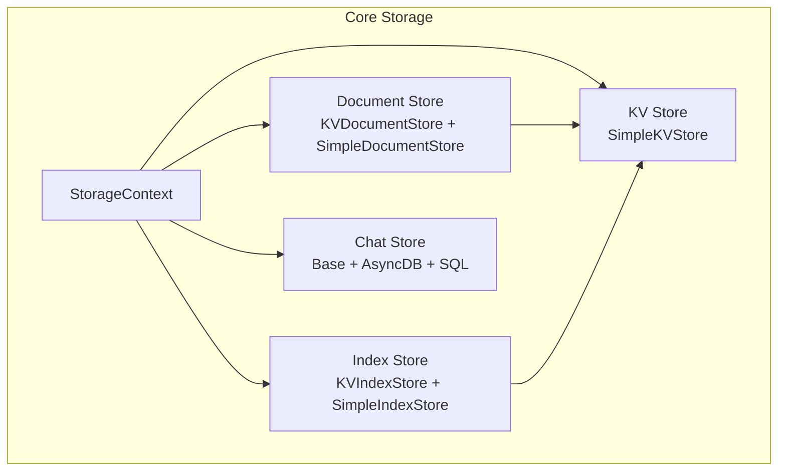
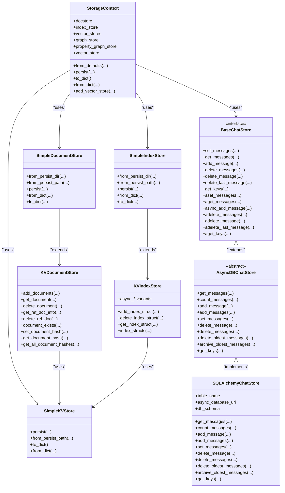
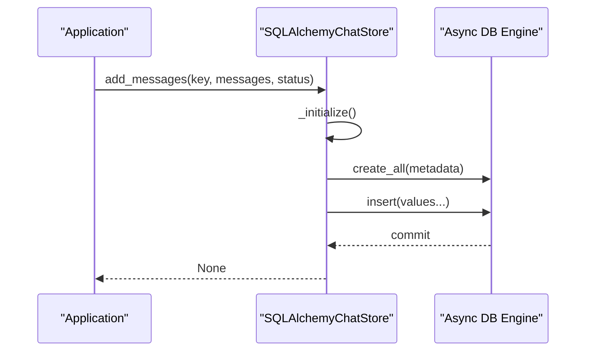
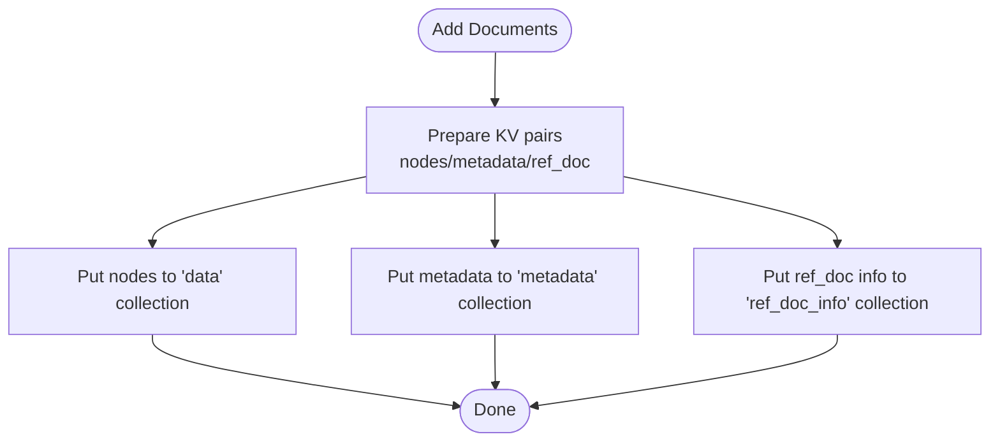
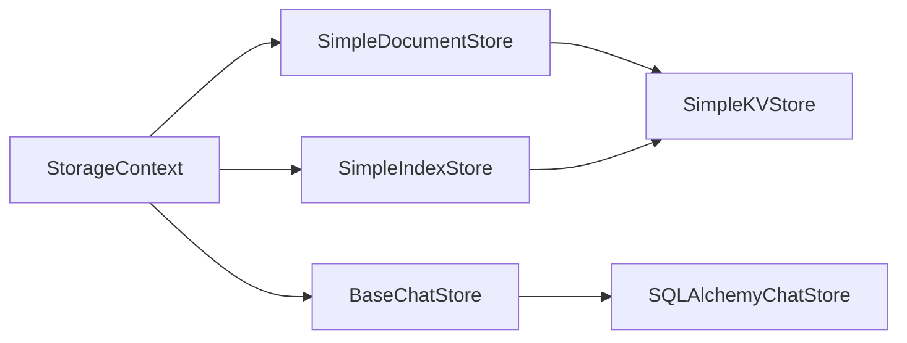

# Data Management and Storage

<cite>
**Referenced Files in This Document**
- [storage_context.py](file://llama-index-core/llama_index/core/storage/storage_context.py)
- [base.py](file://llama-index-core/llama_index/core/storage/chat_store/base.py)
- [base_db.py](file://llama-index-core/llama_index/core/storage/chat_store/base_db.py)
- [sql.py](file://llama-index-core/llama_index/core/storage/chat_store/sql.py)
- [simple_docstore.py](file://llama-index-core/llama_index/core/storage/docstore/simple_docstore.py)
- [keyval_docstore.py](file://llama-index-core/llama_index/core/storage/docstore/keyval_docstore.py)
- [simple_index_store.py](file://llama-index-core/llama_index/core/storage/index_store/simple_index_store.py)
- [keyval_index_store.py](file://llama-index-core/llama_index/core/storage/index_store/keyval_index_store.py)
- [simple_kvstore.py](file://llama-index-core/llama_index/core/storage/kvstore/simple_kvstore.py)
- [__init__.py](file://llama-index-core/llama_index/core/storage/__init__.py)
- [test_storage_azurecosmosnosql_chat_store.py](file://llama-index-integrations/storage/chat_store/llama-index-storage-chat-store-azurecosmosnosql/tests/test_storage_azurecosmosnosql_chat_store.py)
- [test_chat_store_mongo_chat_store.py](file://llama-index-integrations/storage/chat_store/llama-index-storage-chat-store-mongo/tests/test_chat_store_mongo_chat_store.py)
- [test_storage_index_store_firestore.py](file://llama-index-integrations/storage/index_store/llama-index-storage-index-store-firestore/tests/test_storage_index_store_firestore.py)
- [sqlite.md](file://docs/api_reference/api_reference/storage/chat_store/sqlite.md)
</cite>

## Table of Contents
1. [Introduction](#introduction)
2. [Project Structure](#project-structure)
3. [Core Components](#core-components)
4. [Architecture Overview](#architecture-overview)
5. [Detailed Component Analysis](#detailed-component-analysis)
6. [Dependency Analysis](#dependency-analysis)
7. [Performance Considerations](#performance-considerations)
8. [Troubleshooting Guide](#troubleshooting-guide)
9. [Conclusion](#conclusion)
10. [Appendices](#appendices)

## Introduction
This document explains how LlamaIndex manages data and storage, focusing on persistence strategies, caching, and the full data lifecycle. It covers the StorageContext container and its constituent stores: chat stores, document stores, index stores, and key-value stores. It also details persistence backends, cache strategies, serialization formats, configuration options, performance optimization, scalability, migration and backup strategies, integration with external storage systems, and operational concerns such as privacy, encryption, and compliance.

## Project Structure
LlamaIndex organizes storage-related components under a dedicated module with clear separation of concerns:
- StorageContext: central container for coordinating persistence across document, index, vector, and graph stores.
- Chat store: interfaces and implementations for conversation history persistence.
- Document store: node/document storage with key-value backing.
- Index store: index structure persistence via key-value stores.
- KV store: generic key-value abstraction for persistence.

**Diagram sources**
- [storage_context.py](file://llama-index-core/llama_index/core/storage/storage_context.py#L52-L149)
- [base.py](file://llama-index-core/llama_index/core/storage/chat_store/base.py#L11-L79)
- [base_db.py](file://llama-index-core/llama_index/core/storage/chat_store/base_db.py#L19-L102)
- [sql.py](file://llama-index-core/llama_index/core/storage/chat_store/sql.py#L35-L457)
- [simple_docstore.py](file://llama-index-core/llama_index/core/storage/docstore/simple_docstore.py#L20-L107)
- [keyval_docstore.py](file://llama-index-core/llama_index/core/storage/docstore/keyval_docstore.py#L24-L670)
- [simple_index_store.py](file://llama-index-core/llama_index/core/storage/index_store/simple_index_store.py#L19-L77)
- [keyval_index_store.py](file://llama-index-core/llama_index/core/storage/index_store/keyval_index_store.py#L15-L143)
- [simple_kvstore.py](file://llama-index-core/llama_index/core/storage/kvstore/simple_kvstore.py#L16-L66)

**Section sources**
- [storage_context.py](file://llama-index-core/llama_index/core/storage/storage_context.py#L52-L149)
- [__init__.py](file://llama-index-core/llama_index/core/storage/__init__.py#L1-L8)

## Core Components
- StorageContext: Provides a unified persistence surface for document, index, vector, and graph stores. It supports default in-memory stores and persistent stores backed by a directory and optional filesystem abstraction. It persists each store to separate files and supports serialization/deserialization for simple stores.
- Chat Store: Defines a base interface for storing conversation histories keyed by identifiers. Includes asynchronous variants and a robust SQL-backed implementation with status tracking and FIFO semantics for short-term memory.
- Document Store: Stores nodes and related metadata, with a key-value backend supporting batch operations and reference document tracking.
- Index Store: Persists index structures (e.g., index IDs and serialized structures) using a key-value store with configurable collections.
- KV Store: A simple JSON-backed key-value store suitable for small-scale persistence and testing.

Key capabilities:
- Persistence to local filesystem or any fsspec-compatible filesystem.
- Namespaced vector store support for multi-modal or multi-domain embeddings.
- Serialization/deserialization for simple stores to enable snapshot-style backups.
- Async operations for chat stores and document operations.

**Section sources**
- [storage_context.py](file://llama-index-core/llama_index/core/storage/storage_context.py#L52-L278)
- [base.py](file://llama-index-core/llama_index/core/storage/chat_store/base.py#L11-L79)
- [base_db.py](file://llama-index-core/llama_index/core/storage/chat_store/base_db.py#L9-L102)
- [sql.py](file://llama-index-core/llama_index/core/storage/chat_store/sql.py#L35-L457)
- [simple_docstore.py](file://llama-index-core/llama_index/core/storage/docstore/simple_docstore.py#L20-L107)
- [keyval_docstore.py](file://llama-index-core/llama_index/core/storage/docstore/keyval_docstore.py#L24-L670)
- [simple_index_store.py](file://llama-index-core/llama_index/core/storage/index_store/simple_index_store.py#L19-L77)
- [keyval_index_store.py](file://llama-index-core/llama_index/core/storage/index_store/keyval_index_store.py#L15-L143)
- [simple_kvstore.py](file://llama-index-core/llama_index/core/storage/kvstore/simple_kvstore.py#L16-L66)

## Architecture Overview
The storage subsystem centers around StorageContext, which composes:
- Document store: persists nodes and metadata.
- Index store: persists index structures.
- Vector store(s): persisted under namespaces.
- Graph store(s): persisted separately.
- Optional property graph store: lazily initialized and persisted when present.

Persistence is orchestrated by StorageContext, which writes each component to distinct files and supports namespacing for vector stores.

**Diagram sources**
- [storage_context.py](file://llama-index-core/llama_index/core/storage/storage_context.py#L52-L278)
- [base.py](file://llama-index-core/llama_index/core/storage/chat_store/base.py#L11-L79)
- [base_db.py](file://llama-index-core/llama_index/core/storage/chat_store/base_db.py#L19-L102)
- [sql.py](file://llama-index-core/llama_index/core/storage/chat_store/sql.py#L35-L457)
- [simple_docstore.py](file://llama-index-core/llama_index/core/storage/docstore/simple_docstore.py#L20-L107)
- [keyval_docstore.py](file://llama-index-core/llama_index/core/storage/docstore/keyval_docstore.py#L24-L670)
- [simple_index_store.py](file://llama-index-core/llama_index/core/storage/index_store/simple_index_store.py#L19-L77)
- [keyval_index_store.py](file://llama-index-core/llama_index/core/storage/index_store/keyval_index_store.py#L15-L143)
- [simple_kvstore.py](file://llama-index-core/llama_index/core/storage/kvstore/simple_kvstore.py#L16-L66)

## Detailed Component Analysis

### StorageContext: Central Persistence Orchestrator
- Purpose: Compose and coordinate persistence across document, index, vector, and graph stores.
- Defaults: Creates in-memory SimpleDocumentStore, SimpleIndexStore, SimpleGraphStore, and a default SimpleVectorStore. Supports adding an image vector store under a dedicated namespace.
- Persistence: Writes each store to a separate file under a configured directory, with vector stores saved under namespaced filenames.
- Serialization: Supports to/from dict for simple stores, enabling snapshot-style backups and migrations.

Operational guidance:
- Use from_defaults with a persist_dir to load from disk; otherwise, default in-memory stores are created.
- Use persist to write out all stores; customize filenames via named parameters.
- Use to_dict/from_dict for simple stores to export/import entire state.

**Section sources**
- [storage_context.py](file://llama-index-core/llama_index/core/storage/storage_context.py#L52-L278)

### Chat Stores: Conversation History Persistence
- Base interface: Defines synchronous and asynchronous methods for setting/getting/appending/deleting messages and enumerating keys.
- Async DB base: Adds status tracking (ACTIVE/ARCHIVED) and FIFO helpers for short-term memory.
- SQL implementation: Uses SQLAlchemy async engine/session with a messages table, supports schema-aware creation, status filtering, and batch operations.

Integration examples:
- Tests confirm subclasses inherit expected base classes for chat stores and index stores, ensuring compatibility with StorageContext.

**Diagram sources**
- [sql.py](file://llama-index-core/llama_index/core/storage/chat_store/sql.py#L171-L268)

**Section sources**
- [base.py](file://llama-index-core/llama_index/core/storage/chat_store/base.py#L11-L79)
- [base_db.py](file://llama-index-core/llama_index/core/storage/chat_store/base_db.py#L9-L102)
- [sql.py](file://llama-index-core/llama_index/core/storage/chat_store/sql.py#L35-L457)
- [test_storage_azurecosmosnosql_chat_store.py](file://llama-index-integrations/storage/chat_store/llama-index-storage-chat-store-azurecosmosnosql/tests/test_storage_azurecosmosnosql_chat_store.py#L1-L9)
- [test_chat_store_mongo_chat_store.py](file://llama-index-integrations/storage/chat_store/llama-index-storage-chat-store-mongo/tests/test_chat_store_mongo_chat_store.py#L441-L475)
- [sqlite.md](file://docs/api_reference/api_reference/storage/chat_store/sqlite.md#L1-L4)

### Document Store: Node and Metadata Persistence
- KVDocumentStore: Manages three collections (nodes/data, ref_doc_info, metadata) with batched put operations and reference document consolidation.
- SimpleDocumentStore: Wraps KVDocumentStore and adds filesystem-backed persistence and dict-based serialization.

Key behaviors:
- Batched writes for performance.
- Reference document tracking to support deletion of entire documents and deduplicate node lists.
- Hash-based change detection and updates.

**Diagram sources**
- [keyval_docstore.py](file://llama-index-core/llama_index/core/storage/docstore/keyval_docstore.py#L143-L205)

**Section sources**
- [simple_docstore.py](file://llama-index-core/llama_index/core/storage/docstore/simple_docstore.py#L20-L107)
- [keyval_docstore.py](file://llama-index-core/llama_index/core/storage/docstore/keyval_docstore.py#L24-L670)

### Index Store: Index Structure Persistence
- KVIndexStore: Persists IndexStruct objects by index_id using JSON serialization utilities; supports single or all index retrieval.
- SimpleIndexStore: Wraps KVIndexStore and adds filesystem-backed persistence and dict-based serialization.

**Section sources**
- [simple_index_store.py](file://llama-index-core/llama_index/core/storage/index_store/simple_index_store.py#L19-L77)
- [keyval_index_store.py](file://llama-index-core/llama_index/core/storage/index_store/keyval_index_store.py#L15-L143)
- [test_storage_index_store_firestore.py](file://llama-index-integrations/storage/index_store/llama-index-storage-index-store-firestore/tests/test_storage_index_store_firestore.py#L1-L9)

### KV Store: Generic Key-Value Abstraction
- SimpleKVStore: JSON-backed in-memory key-value store with filesystem persistence and dict serialization/deserialization.

**Section sources**
- [simple_kvstore.py](file://llama-index-core/llama_index/core/storage/kvstore/simple_kvstore.py#L16-L66)

## Dependency Analysis
- StorageContext depends on concrete store implementations and exposes a unified persistence API.
- Document and Index stores depend on KV store abstractions.
- Chat stores depend on AsyncDB base and SQL implementations.
- Integrations validate compatibility by asserting base class inheritance.

**Diagram sources**
- [storage_context.py](file://llama-index-core/llama_index/core/storage/storage_context.py#L52-L149)
- [simple_docstore.py](file://llama-index-core/llama_index/core/storage/docstore/simple_docstore.py#L20-L107)
- [simple_index_store.py](file://llama-index-core/llama_index/core/storage/index_store/simple_index_store.py#L19-L77)
- [base.py](file://llama-index-core/llama_index/core/storage/chat_store/base.py#L11-L79)
- [sql.py](file://llama-index-core/llama_index/core/storage/chat_store/sql.py#L35-L457)
- [simple_kvstore.py](file://llama-index-core/llama_index/core/storage/kvstore/simple_kvstore.py#L16-L66)

**Section sources**
- [storage_context.py](file://llama-index-core/llama_index/core/storage/storage_context.py#L52-L149)
- [test_storage_azurecosmosnosql_chat_store.py](file://llama-index-integrations/storage/chat_store/llama-index-storage-chat-store-azurecosmosnosql/tests/test_storage_azurecosmosnosql_chat_store.py#L1-L9)
- [test_storage_index_store_firestore.py](file://llama-index-integrations/storage/index_store/llama-index-storage-index-store-firestore/tests/test_storage_index_store_firestore.py#L1-L9)

## Performance Considerations
- Batched writes: KVDocumentStore and KVIndexStore support batched operations to reduce IO overhead.
- Async operations: Chat stores and document operations expose async variants to improve throughput under concurrent workloads.
- Namespaced vector stores: Efficiently separate domains or modalities without cross-contamination.
- In-memory KV store: Suitable for small datasets and testing; for production, prefer filesystem-backed persistence to avoid memory pressure.
- Filesystem abstraction: Use fsspec-compatible filesystems to target cloud or remote storage without changing code.

[No sources needed since this section provides general guidance]

## Troubleshooting Guide
Common issues and remedies:
- Persistence failures: Ensure persist_dir exists and is writable; verify fsspec filesystem configuration when using remote storage.
- Serialization errors: Only simple stores support to/from dict; for custom stores, implement compatible serialization or rely on filesystem persistence.
- Chat store initialization: When using SQL chat stores, confirm async database URI/engine and schema availability for databases that support schemas.
- Multi-client visibility: Integration tests demonstrate concurrent clients sharing chat history; ensure shared collection/db configuration is correct.

**Section sources**
- [simple_docstore.py](file://llama-index-core/llama_index/core/storage/docstore/simple_docstore.py#L84-L92)
- [simple_index_store.py](file://llama-index-core/llama_index/core/storage/index_store/simple_index_store.py#L60-L68)
- [simple_kvstore.py](file://llama-index-core/llama_index/core/storage/kvstore/simple_kvstore.py#L35-L56)
- [sql.py](file://llama-index-core/llama_index/core/storage/chat_store/sql.py#L91-L133)
- [test_chat_store_mongo_chat_store.py](file://llama-index-integrations/storage/chat_store/llama-index-storage-chat-store-mongo/tests/test_chat_store_mongo_chat_store.py#L441-L475)

## Conclusion
LlamaIndex’s storage subsystem provides a cohesive, extensible framework for managing data lifecycles. StorageContext orchestrates persistence across document, index, vector, and graph stores, while specialized stores offer flexible backends and async capabilities. With filesystem-backed persistence, namespacing, and serialization hooks, teams can tailor storage to performance, scalability, and compliance needs.

[No sources needed since this section summarizes without analyzing specific files]

## Appendices

### Practical Setup Examples
- Initialize StorageContext with defaults (in-memory) or from a persist directory.
- Persist to a directory with custom filenames for each store.
- Serialize simple stores to dict for snapshot backups.

Paths to review:
- [storage_context.py](file://llama-index-core/llama_index/core/storage/storage_context.py#L73-L149)
- [storage_context.py](file://llama-index-core/llama_index/core/storage/storage_context.py#L151-L203)
- [simple_docstore.py](file://llama-index-core/llama_index/core/storage/docstore/simple_docstore.py#L94-L102)
- [simple_index_store.py](file://llama-index-core/llama_index/core/storage/index_store/simple_index_store.py#L70-L76)

**Section sources**
- [storage_context.py](file://llama-index-core/llama_index/core/storage/storage_context.py#L73-L203)
- [simple_docstore.py](file://llama-index-core/llama_index/core/storage/docstore/simple_docstore.py#L94-L102)
- [simple_index_store.py](file://llama-index-core/llama_index/core/storage/index_store/simple_index_store.py#L70-L76)

### Migration and Backup Strategies
- Snapshot backups: Use to_dict/from_dict for simple stores to export/import entire state.
- Incremental persistence: Use persist to write out stores to files; restore by constructing StorageContext from a persist directory.
- Namespaced vector stores: Back up each namespace separately for granular recovery.

**Section sources**
- [storage_context.py](file://llama-index-core/llama_index/core/storage/storage_context.py#L204-L266)
- [storage_context.py](file://llama-index-core/llama_index/core/storage/storage_context.py#L151-L203)

### Integration with External Storage Systems
- Use fsspec filesystems to target cloud storage without code changes.
- SQL chat stores support async engines and schema-aware table creation.
- Integration packages provide vendor-specific chat/store/index/doc implementations; tests validate base class compatibility.

**Section sources**
- [storage_context.py](file://llama-index-core/llama_index/core/storage/storage_context.py#L83-L84)
- [sql.py](file://llama-index-core/llama_index/core/storage/chat_store/sql.py#L110-L169)
- [test_storage_azurecosmosnosql_chat_store.py](file://llama-index-integrations/storage/chat_store/llama-index-storage-chat-store-azurecosmosnosql/tests/test_storage_azurecosmosnosql_chat_store.py#L1-L9)
- [test_storage_index_store_firestore.py](file://llama-index-integrations/storage/index_store/llama-index-storage-index-store-firestore/tests/test_storage_index_store_firestore.py#L1-L9)

### Privacy, Encryption, and Compliance
- Data at rest: Choose filesystem backends that support encryption (e.g., encrypted cloud buckets) via fsspec providers.
- Data in transit: Configure async database URIs and secure connection strings for SQL chat stores.
- Access control: Enforce permissions at the filesystem level and database schema for SQL-backed stores.
- Audit trails: Track message counts and statuses for accountability.

[No sources needed since this section provides general guidance]

### Storage Selection Criteria, Cost Optimization, and Monitoring
- Selection criteria:
  - Throughput and latency: Prefer async-capable stores and batched operations.
  - Scalability: Use namespaced vector stores and distributed KV stores.
  - Compliance: Select backends that meet regulatory requirements for data location and encryption.
- Cost optimization:
  - Use in-memory KV store for ephemeral or small datasets; migrate to persistent filesystem for durability.
  - Consolidate reference documents to minimize duplication.
- Monitoring:
  - Track store sizes, operation latencies, and error rates.
  - Monitor chat store message counts and archival patterns.

[No sources needed since this section provides general guidance]