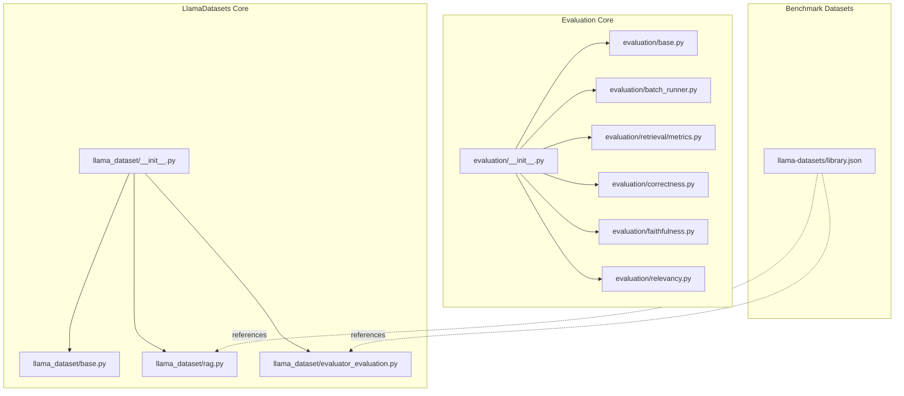
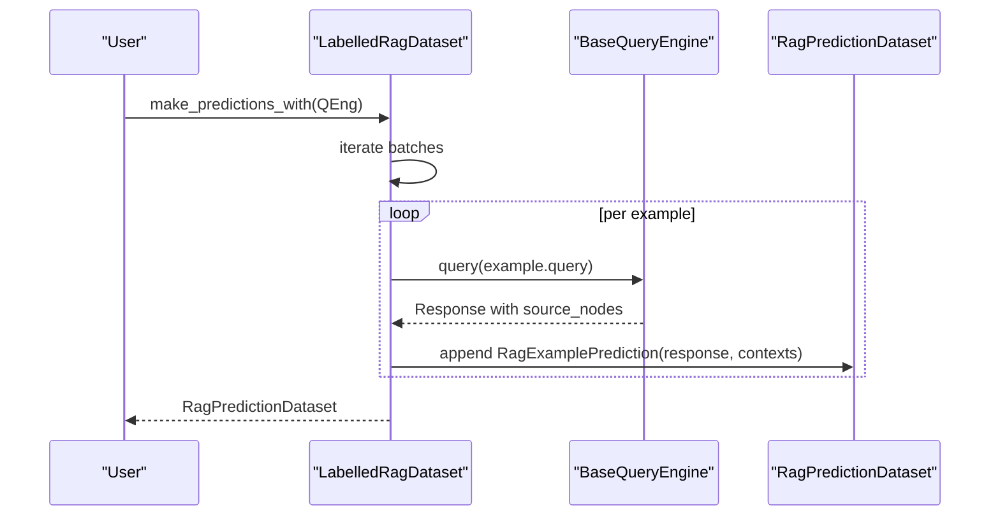
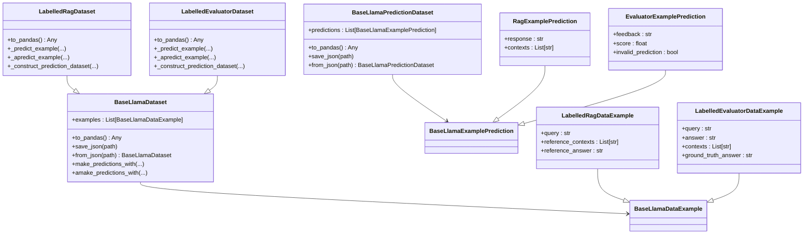
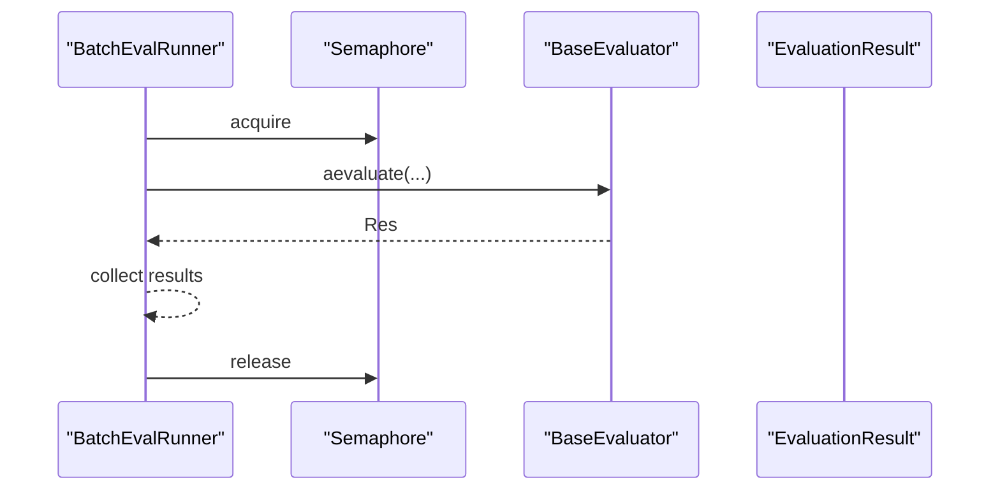
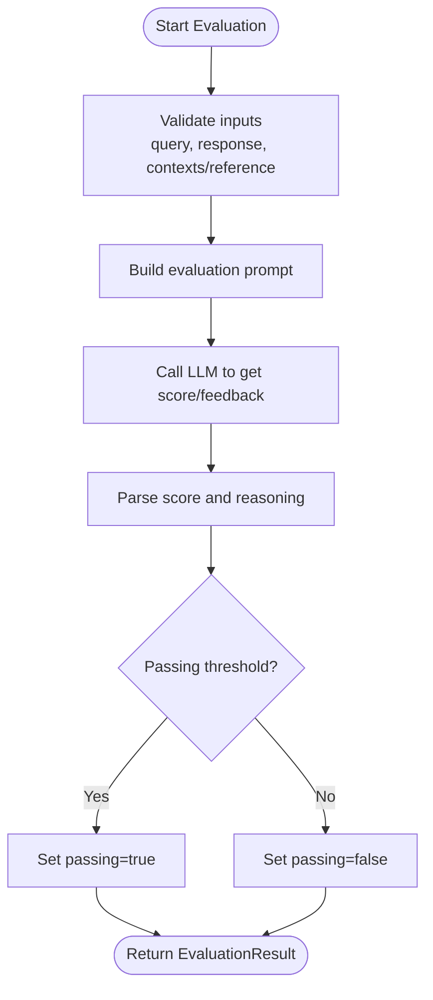
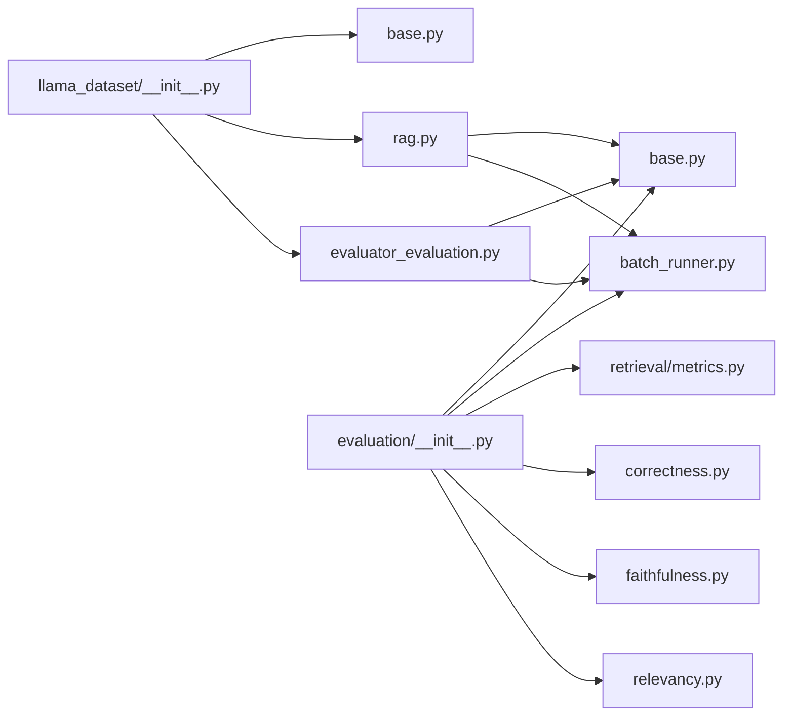

# Data and Datasets

<cite>
**Referenced Files in This Document**
- [llama_dataset/__init__.py](file://llama-index-core/llama_index/core/llama_dataset/__init__.py)
- [llama_dataset/base.py](file://llama-index-core/llama_index/core/llama_dataset/base.py)
- [llama_dataset/rag.py](file://llama-index-core/llama_index/core/llama_dataset/rag.py)
- [llama_dataset/evaluator_evaluation.py](file://llama-index-core/llama_index/core/llama_dataset/evaluator_evaluation.py)
- [evaluation/__init__.py](file://llama-index-core/llama_index/core/evaluation/__init__.py)
- [evaluation/base.py](file://llama-index-core/llama_index/core/evaluation/base.py)
- [evaluation/batch_runner.py](file://llama-index-core/llama_index/core/evaluation/batch_runner.py)
- [evaluation/retrieval/metrics.py](file://llama-index-core/llama_index/core/evaluation/retrieval/metrics.py)
- [evaluation/correctness.py](file://llama-index-core/llama_index/core/evaluation/correctness.py)
- [evaluation/faithfulness.py](file://llama-index-core/llama_index/core/evaluation/faithfulness.py)
- [evaluation/relevancy.py](file://llama-index-core/llama_index/core/evaluation/relevancy.py)
- [llama-datasets/library.json](file://llama-datasets/library.json)
</cite>

## Table of Contents
1. [Introduction](#introduction)
2. [Project Structure](#project-structure)
3. [Core Components](#core-components)
4. [Architecture Overview](#architecture-overview)
5. [Detailed Component Analysis](#detailed-component-analysis)
6. [Dependency Analysis](#dependency-analysis)
7. [Performance Considerations](#performance-considerations)
8. [Troubleshooting Guide](#troubleshooting-guide)
9. [Conclusion](#conclusion)
10. [Appendices](#appendices)

## Introduction
This document explains how LlamaIndex handles datasets and evaluation for Retrieval-Augmented Generation (RAG) and broader evaluation tasks. It covers:
- Benchmark datasets and how to use them
- Built-in evaluators and evaluation frameworks
- Data management patterns for persistence and caching
- Practical workflows for dataset usage, evaluation, and performance analysis
- Relationship between datasets and metrics, preprocessing needs, and result interpretation
- Privacy, security, and compliance considerations
- Guidance for creating custom datasets and extending evaluation frameworks

## Project Structure
The dataset and evaluation capabilities are primarily implemented under:
- LlamaDatasets module: reusable dataset classes and helpers for RAG and evaluator predictions
- Evaluation module: evaluators, batch runners, and retrieval metrics
- Benchmark datasets: curated collections under llama-datasets

**Diagram sources**
- [llama_dataset/__init__.py](file://llama-index-core/llama_index/core/llama_dataset/__init__.py#L1-L62)
- [llama_dataset/base.py](file://llama-index-core/llama_index/core/llama_dataset/base.py#L1-L357)
- [llama_dataset/rag.py](file://llama-index-core/llama_index/core/llama_dataset/rag.py#L1-L193)
- [llama_dataset/evaluator_evaluation.py](file://llama-index-core/llama_index/core/llama_dataset/evaluator_evaluation.py#L1-L500)
- [evaluation/__init__.py](file://llama-index-core/llama_index/core/evaluation/__init__.py#L1-L87)
- [evaluation/base.py](file://llama-index-core/llama_index/core/evaluation/base.py#L1-L140)
- [evaluation/batch_runner.py](file://llama-index-core/llama_index/core/evaluation/batch_runner.py#L1-L444)
- [evaluation/retrieval/metrics.py](file://llama-index-core/llama_index/core/evaluation/retrieval/metrics.py#L1-L514)
- [evaluation/correctness.py](file://llama-index-core/llama_index/core/evaluation/correctness.py#L1-L154)
- [evaluation/faithfulness.py](file://llama-index-core/llama_index/core/evaluation/faithfulness.py#L1-L206)
- [evaluation/relevancy.py](file://llama-index-core/llama_index/core/evaluation/relevancy.py#L1-L145)
- [llama-datasets/library.json](file://llama-datasets/library.json#L1-L88)

**Section sources**
- [llama_dataset/__init__.py](file://llama-index-core/llama_index/core/llama_dataset/__init__.py#L1-L62)
- [evaluation/__init__.py](file://llama-index-core/llama_index/core/evaluation/__init__.py#L1-L87)
- [llama-datasets/library.json](file://llama-datasets/library.json#L1-L88)

## Core Components
- LlamaDatasets: Base classes for dataset and example types, prediction caching, and async/sync prediction pipelines
- RAG datasets: Labelled RAG examples and predictions for query-answer-context scenarios
- Evaluator datasets: Labelled evaluator examples and predictions for answer quality and pairwise comparisons
- Evaluation framework: Base evaluator interface, batch runner for parallel evaluation, and retrieval metrics
- Benchmark datasets: Curated libraries of real-world datasets for RAG and evaluation

Key capabilities:
- Predict on datasets using query engines or evaluators
- Persist and load datasets and predictions as JSON
- Asynchronous batch processing with rate-limit-aware retries
- Built-in retrieval metrics (HitRate, MRR, Precision, Recall, AP, NDCG, Cohere rerank)
- Standard evaluators (Correctness, Faithfulness, Relevancy)

**Section sources**
- [llama_dataset/base.py](file://llama-index-core/llama_index/core/llama_dataset/base.py#L130-L357)
- [llama_dataset/rag.py](file://llama-index-core/llama_index/core/llama_dataset/rag.py#L118-L187)
- [llama_dataset/evaluator_evaluation.py](file://llama-index-core/llama_index/core/llama_dataset/evaluator_evaluation.py#L150-L266)
- [evaluation/base.py](file://llama-index-core/llama_index/core/evaluation/base.py#L46-L140)
- [evaluation/batch_runner.py](file://llama-index-core/llama_index/core/evaluation/batch_runner.py#L75-L444)
- [evaluation/retrieval/metrics.py](file://llama-index-core/llama_index/core/evaluation/retrieval/metrics.py#L16-L514)

## Architecture Overview
The evaluation pipeline connects datasets, predictors (query engines or evaluators), and metrics. Predictions are cached and persisted, enabling reproducibility and incremental runs.

**Diagram sources**
- [llama_dataset/rag.py](file://llama-index-core/llama_index/core/llama_dataset/rag.py#L152-L182)
- [llama_dataset/base.py](file://llama-index-core/llama_index/core/llama_dataset/base.py#L211-L250)

## Detailed Component Analysis

### LlamaDatasets: Base, RAG, and Evaluator Prediction Classes
- Base classes define generic dataset and prediction structures, JSON serialization, and batch prediction loops with caching
- RAG dataset defines labelled examples (query, reference contexts, reference answer) and predictions (response, contexts)
- Evaluator dataset defines examples for evaluating answers against contexts and references, plus pairwise comparison variants

**Diagram sources**
- [llama_dataset/base.py](file://llama-index-core/llama_index/core/llama_dataset/base.py#L130-L357)
- [llama_dataset/rag.py](file://llama-index-core/llama_index/core/llama_dataset/rag.py#L44-L187)
- [llama_dataset/evaluator_evaluation.py](file://llama-index-core/llama_index/core/llama_dataset/evaluator_evaluation.py#L53-L266)

**Section sources**
- [llama_dataset/base.py](file://llama-index-core/llama_index/core/llama_dataset/base.py#L130-L357)
- [llama_dataset/rag.py](file://llama-index-core/llama_index/core/llama_dataset/rag.py#L118-L187)
- [llama_dataset/evaluator_evaluation.py](file://llama-index-core/llama_index/core/llama_dataset/evaluator_evaluation.py#L150-L266)

### Evaluation Framework: Base Evaluator, Batch Runner, Metrics
- BaseEvaluator defines the contract for evaluation and convenience wrappers for Response objects
- BatchEvalRunner orchestrates parallel evaluation across multiple evaluators and inputs, with retries and semaphores
- Retrieval metrics provide standard IR measures (HitRate, MRR, Precision, Recall, AP, NDCG) and external reranking support

**Diagram sources**
- [evaluation/batch_runner.py](file://llama-index-core/llama_index/core/evaluation/batch_runner.py#L11-L58)
- [evaluation/base.py](file://llama-index-core/llama_index/core/evaluation/base.py#L46-L140)

**Section sources**
- [evaluation/base.py](file://llama-index-core/llama_index/core/evaluation/base.py#L46-L140)
- [evaluation/batch_runner.py](file://llama-index-core/llama_index/core/evaluation/batch_runner.py#L75-L444)
- [evaluation/retrieval/metrics.py](file://llama-index-core/llama_index/core/evaluation/retrieval/metrics.py#L16-L514)

### Built-in Evaluators
- CorrectnessEvaluator: holistic score against a reference answer
- FaithfulnessEvaluator: checks if the response is supported by the provided contexts
- RelevancyEvaluator: checks if the response aligns with the provided contexts and query

**Diagram sources**
- [evaluation/correctness.py](file://llama-index-core/llama_index/core/evaluation/correctness.py#L120-L153)
- [evaluation/faithfulness.py](file://llama-index-core/llama_index/core/evaluation/faithfulness.py#L159-L201)
- [evaluation/relevancy.py](file://llama-index-core/llama_index/core/evaluation/relevancy.py#L97-L141)

**Section sources**
- [evaluation/correctness.py](file://llama-index-core/llama_index/core/evaluation/correctness.py#L69-L154)
- [evaluation/faithfulness.py](file://llama-index-core/llama_index/core/evaluation/faithfulness.py#L98-L206)
- [evaluation/relevancy.py](file://llama-index-core/llama_index/core/evaluation/relevancy.py#L42-L145)

### Benchmark Datasets
- The llama-datasets collection includes curated datasets for RAG and evaluation
- The library.json maps dataset identifiers to metadata (author, keywords)

Typical usage patterns:
- Load a dataset class from the benchmark collection
- Convert to pandas for inspection
- Use with LabelledRagDataset to generate predictions
- Compare predictions against ground-truth using built-in evaluators

**Section sources**
- [llama-datasets/library.json](file://llama-datasets/library.json#L1-L88)

## Dependency Analysis
The dataset and evaluation modules are loosely coupled and rely on shared abstractions:
- LlamaDatasets depend on BaseEvaluator and BaseQueryEngine
- Evaluation framework depends on BaseEvaluator and async utilities
- Retrieval metrics are decoupled and can be applied to any ranked results

**Diagram sources**
- [llama_dataset/__init__.py](file://llama-index-core/llama_index/core/llama_dataset/__init__.py#L3-L61)
- [evaluation/__init__.py](file://llama-index-core/llama_index/core/evaluation/__init__.py#L3-L86)

**Section sources**
- [llama_dataset/__init__.py](file://llama-index-core/llama_index/core/llama_dataset/__init__.py#L3-L61)
- [evaluation/__init__.py](file://llama-index-core/llama_index/core/evaluation/__init__.py#L3-L86)

## Performance Considerations
- Parallelism and batching: Use BatchEvalRunner with worker counts and semaphores to control concurrency
- Rate limiting: The dataset base class includes rate-limit-aware error messaging and caching to resume partial runs
- Async execution: Prefer async prediction APIs for higher throughput
- Metric computation: Retrieval metrics are efficient and support granular modes for deeper analysis

Practical tips:
- Tune batch_size and sleep_time_in_seconds to avoid rate limits
- Use semaphores and exponential backoff in batch runners
- Persist intermediate predictions to disk for reproducibility and incremental runs

**Section sources**
- [llama-index-core/llama_index/core/llama_dataset/base.py](file://llama-index-core/llama_index/core/llama_dataset/base.py#L211-L350)
- [llama-index-core/llama_index/core/evaluation/batch_runner.py](file://llama-index-core/llama_index/core/evaluation/batch_runner.py#L11-L58)

## Troubleshooting Guide
Common issues and resolutions:
- Rate limit errors during async predictions: The dataset base class detects rate-limit errors and suggests reducing batch size; it also caches partial results to enable resumption
- Invalid evaluation results: Evaluator datasets capture invalid results with reasons; inspect invalid_prediction and invalid_reason fields
- Missing dependencies: Some metrics require optional packages (e.g., pandas); ensure dependencies are installed

Operational checks:
- Verify inputs to evaluators (query, response, contexts/reference)
- Confirm dataset JSON serialization/deserialization paths
- Validate metric names and expected IDs/texts for retrieval metrics

**Section sources**
- [llama-index-core/llama_index/core/llama_dataset/base.py](file://llama-index-core/llama_index/core/llama_dataset/base.py#L328-L341)
- [llama-index-core/llama_index/core/llama_dataset/evaluator_evaluation.py](file://llama-index-core/llama_index/core/llama_dataset/evaluator_evaluation.py#L211-L224)

## Conclusion
LlamaIndex provides a cohesive framework for managing datasets and evaluating RAG systems. The LlamaDatasets classes unify data handling, prediction generation, and persistence, while the evaluation module offers robust evaluators, batch orchestration, and retrieval metrics. Benchmark datasets accelerate reproducible experiments, and the extensible design supports custom datasets and metrics.

## Appendices

### Practical Workflows

- Using a benchmark dataset:
  - Load the dataset class from the benchmark collection
  - Inspect with to_pandas()
  - Generate predictions using LabelledRagDataset.make_predictions_with()
  - Evaluate with built-in evaluators (Correctness, Faithfulness, Relevancy)

- Running batch evaluations:
  - Initialize BatchEvalRunner with evaluators and worker count
  - Call evaluate_queries(), evaluate_responses(), or evaluate_response_strs()
  - Optionally upload results to LlamaCloud via upload_eval_results()

- Retrieval evaluation:
  - Prepare expected IDs and retrieved IDs
  - Resolve metrics (HitRate, MRR, Precision, Recall, AP, NDCG)
  - Aggregate scores across queries

**Section sources**
- [llama-datasets/library.json](file://llama-datasets/library.json#L1-L88)
- [evaluation/batch_runner.py](file://llama-index-core/llama_index/core/evaluation/batch_runner.py#L195-L444)
- [evaluation/retrieval/metrics.py](file://llama-index-core/llama_index/core/evaluation/retrieval/metrics.py#L496-L514)

### Creating Custom Datasets and Evaluators
- Extend BaseLlamaDataset and define example/prediction types
- Implement _predict_example/_apredict_example to integrate your predictor
- Add custom metrics by subclassing BaseRetrievalMetric or adding new evaluators by subclassing BaseEvaluator

**Section sources**
- [llama_dataset/base.py](file://llama-index-core/llama_index/core/llama_dataset/base.py#L175-L210)
- [evaluation/base.py](file://llama-index-core/llama_index/core/evaluation/base.py#L46-L91)
- [evaluation/retrieval/metrics.py](file://llama-index-core/llama_index/core/evaluation/retrieval/metrics.py#L1-L514)

### Data Preprocessing and Result Interpretation
- Ensure consistent text normalization and context formatting for faithful evaluation
- Interpret scores and feedback from evaluators; use thresholds to derive binary passing/failing outcomes
- For retrieval, interpret metric scores in context of your corpus and ranking strategy

**Section sources**
- [evaluation/correctness.py](file://llama-index-core/llama_index/core/evaluation/correctness.py#L120-L153)
- [evaluation/faithfulness.py](file://llama-index-core/llama_index/core/evaluation/faithfulness.py#L159-L201)
- [evaluation/relevancy.py](file://llama-index-core/llama_index/core/evaluation/relevancy.py#L97-L141)

### Privacy, Security, and Compliance
- Avoid embedding sensitive data in datasets; sanitize inputs before ingestion
- Use secure storage for dataset JSON artifacts and evaluation results
- Comply with data governance policies when sharing benchmark datasets or evaluation results

[No sources needed since this section provides general guidance]