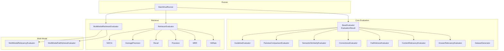
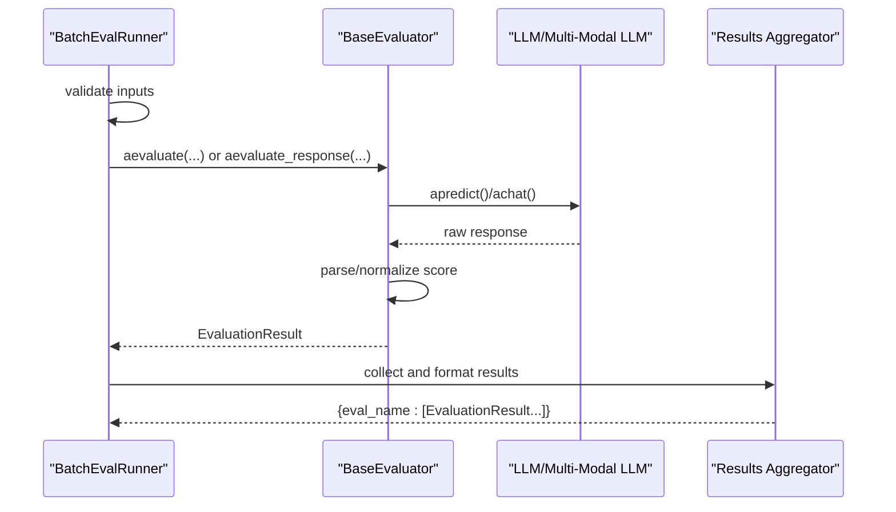
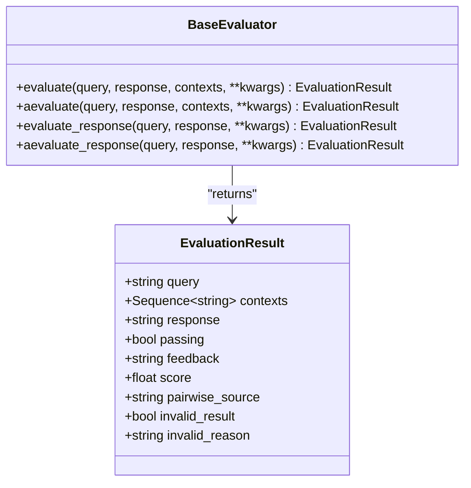
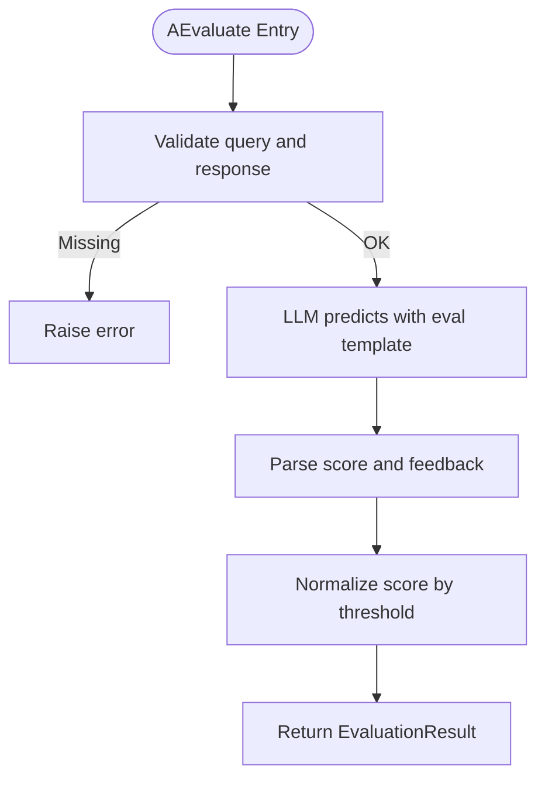
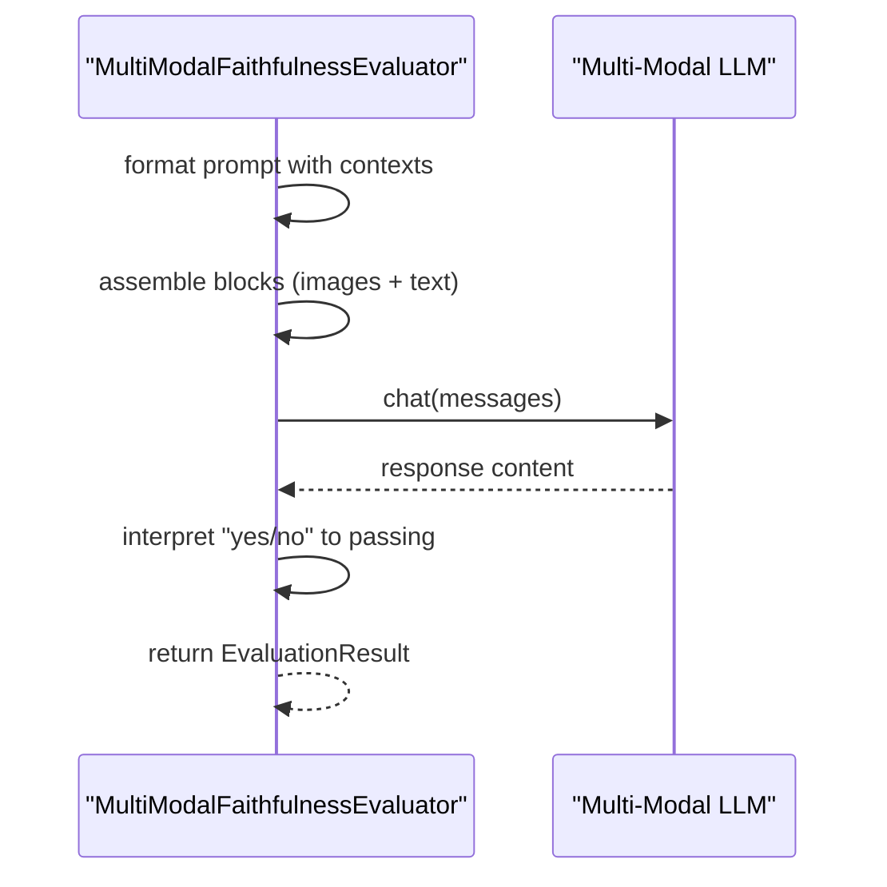
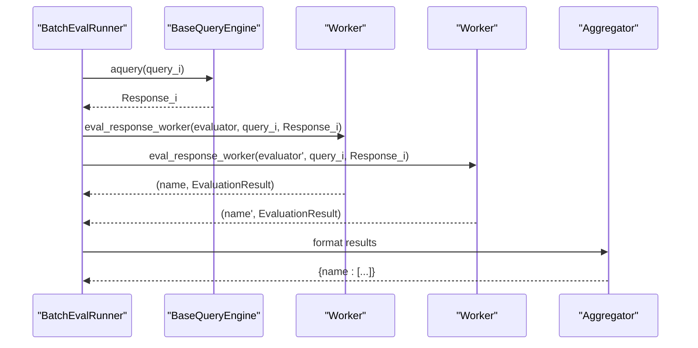
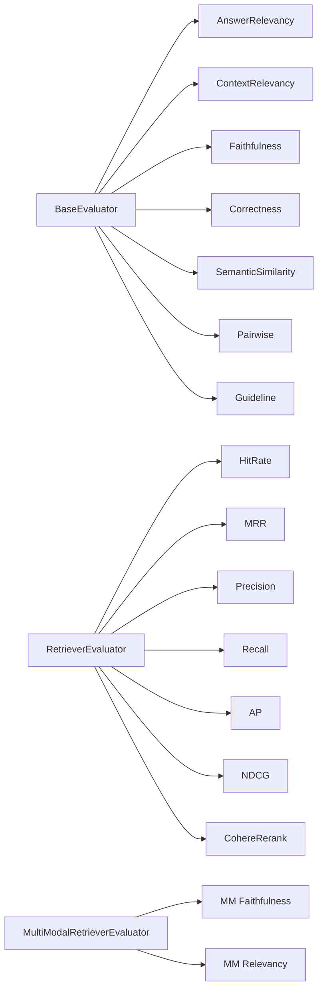

# Evaluation Framework

<cite>
**Referenced Files in This Document**
- [__init__.py](file://llama-index-core/llama_index/core/evaluation/__init__.py)
- [base.py](file://llama-index-core/llama_index/core/evaluation/base.py)
- [batch_runner.py](file://llama-index-core/llama_index/core/evaluation/batch_runner.py)
- [answer_relevancy.py](file://llama-index-core/llama_index/core/evaluation/answer_relevancy.py)
- [context_relevancy.py](file://llama-index-core/llama_index/core/evaluation/context_relevancy.py)
- [faithfulness.py](file://llama-index-core/llama_index/core/evaluation/faithfulness.py)
- [correctness.py](file://llama-index-core/llama_index/core/evaluation/correctness.py)
- [semantic_similarity.py](file://llama-index-core/llama_index/core/evaluation/semantic_similarity.py)
- [pairwise.py](file://llama-index-core/llama_index/core/evaluation/pairwise.py)
- [guideline.py](file://llama-index-core/llama_index/core/evaluation/guideline.py)
- [dataset_generation.py](file://llama-index-core/llama_index/core/evaluation/dataset_generation.py)
- [retrieval/evaluator.py](file://llama-index-core/llama_index/core/evaluation/retrieval/evaluator.py)
- [retrieval/metrics.py](file://llama-index-core/llama_index/core/evaluation/retrieval/metrics.py)
- [multi_modal/faithfulness.py](file://llama-index-core/llama_index/core/evaluation/multi_modal/faithfulness.py)
- [multi_modal/relevancy.py](file://llama-index-core/llama_index/core/evaluation/multi_modal/relevancy.py)
- [evaluation/__init__.py](file://llama-index-core/llama_index/core/evaluation/__init__.py)
- [evaluation/base.py](file://llama-index-core/llama_index/core/evaluation/base.py)
- [evaluation/batch_runner.py](file://llama-index-core/llama_index/core/evaluation/batch_runner.py)
- [evaluation/answer_relevancy.py](file://llama-index-core/llama_index/core/evaluation/answer_relevancy.py)
- [evaluation/context_relevancy.py](file://llama-index-core/llama_index/core/evaluation/context_relevancy.py)
- [evaluation/faithfulness.py](file://llama-index-core/llama_index/core/evaluation/faithfulness.py)
- [evaluation/correctness.py](file://llama-index-core/llama_index/core/evaluation/correctness.py)
- [evaluation/semantic_similarity.py](file://llama-index-core/llama_index/core/evaluation/semantic_similarity.py)
- [evaluation/pairwise.py](file://llama-index-core/llama_index/core/evaluation/pairwise.py)
- [evaluation/guideline.py](file://llama-index-core/llama_index/core/evaluation/guideline.py)
- [evaluation/dataset_generation.py](file://llama-index-core/llama_index/core/evaluation/dataset_generation.py)
- [evaluation/retrieval/evaluator.py](file://llama-index-core/llama_index/core/evaluation/retrieval/evaluator.py)
- [evaluation/retrieval/metrics.py](file://llama-index-core/llama_index/core/evaluation/retrieval/metrics.py)
- [evaluation/multi_modal/faithfulness.py](file://llama-index-core/llama_index/core/evaluation/multi_modal/faithfulness.py)
- [evaluation/multi_modal/relevancy.py](file://llama-index-core/llama_index/core/evaluation/multi_modal/relevancy.py)
</cite>

## Table of Contents
1. [Introduction](#introduction)
2. [Project Structure](#project-structure)
3. [Core Components](#core-components)
4. [Architecture Overview](#architecture-overview)
5. [Detailed Component Analysis](#detailed-component-analysis)
6. [Dependency Analysis](#dependency-analysis)
7. [Performance Considerations](#performance-considerations)
8. [Troubleshooting Guide](#troubleshooting-guide)
9. [Conclusion](#conclusion)
10. [Appendices](#appendices)

## Introduction
This document describes the LlamaIndex evaluation framework, focusing on built-in evaluators, custom metrics, and evaluation methodologies. It covers answer relevancy, context relevancy, faithfulness, correctness, and semantic similarity evaluators; retrieval-specific evaluations; multi-modal evaluation capabilities; dataset generation; and the evaluation runner system. It also provides guidance on evaluation protocols, scoring algorithms, statistical significance testing, and best practices for bias and fairness assessment.

## Project Structure
The evaluation toolkit is organized around a shared base interface and modular evaluators. Retrieval evaluation is separated into dedicated modules for evaluators and metrics. Multi-modal evaluators extend the base interface to handle image and text contexts. A batch runner coordinates parallel evaluation across multiple evaluators and datasets.

**Diagram sources**
- [base.py](file://llama-index-core/llama_index/core/evaluation/base.py#L46-L140)
- [answer_relevancy.py](file://llama-index-core/llama_index/core/evaluation/answer_relevancy.py#L49-L147)
- [context_relevancy.py](file://llama-index-core/llama_index/core/evaluation/context_relevancy.py#L66-L178)
- [faithfulness.py](file://llama-index-core/llama_index/core/evaluation/faithfulness.py#L98-L206)
- [correctness.py](file://llama-index-core/llama_index/core/evaluation/correctness.py#L69-L154)
- [semantic_similarity.py](file://llama-index-core/llama_index/core/evaluation/semantic_similarity.py#L13-L82)
- [pairwise.py](file://llama-index-core/llama_index/core/evaluation/pairwise.py#L92-L282)
- [guideline.py](file://llama-index-core/llama_index/core/evaluation/guideline.py#L41-L126)
- [dataset_generation.py](file://llama-index-core/llama_index/core/evaluation/dataset_generation.py#L117-L341)
- [retrieval/evaluator.py](file://llama-index-core/llama_index/core/evaluation/retrieval/evaluator.py#L16-L104)
- [retrieval/metrics.py](file://llama-index-core/llama_index/core/evaluation/retrieval/metrics.py#L16-L514)
- [multi_modal/faithfulness.py](file://llama-index-core/llama_index/core/evaluation/multi_modal/faithfulness.py#L59-L236)
- [multi_modal/relevancy.py](file://llama-index-core/llama_index/core/evaluation/multi_modal/relevancy.py#L39-L217)
- [batch_runner.py](file://llama-index-core/llama_index/core/evaluation/batch_runner.py#L75-L444)

**Section sources**
- [__init__.py](file://llama-index-core/llama_index/core/evaluation/__init__.py#L1-L87)

## Core Components
- BaseEvaluator and EvaluationResult define the contract for all evaluators and the standardized result structure.
- Built-in evaluators:
  - AnswerRelevancyEvaluator: assesses whether a response aligns with the query.
  - ContextRelevancyEvaluator: evaluates whether retrieved contexts align with the query.
  - FaithfulnessEvaluator: checks whether a response is supported by the provided contexts.
  - CorrectnessEvaluator: compares a generated answer against a reference answer on a 1–5 scale.
  - SemanticSimilarityEvaluator: computes embedding similarity between generated and reference answers.
  - PairwiseComparisonEvaluator: compares two candidate answers against a reference using an LLM judge.
  - GuidelineEvaluator: enforces domain-specific guidelines and returns a pass/fail judgment.
- Retrieval evaluators and metrics:
  - RetrieverEvaluator and MultiModalRetrieverEvaluator: wrap retrievers and compute retrieval metrics.
  - Metrics include HitRate, MRR, Precision, Recall, AveragePrecision, NDCG, and Cohere rerank relevancy.
- Multi-modal evaluators:
  - MultiModalFaithfulnessEvaluator and MultiModalRelevancyEvaluator: evaluate faithfulness and relevance using multi-modal LLMs.
- Dataset generation:
  - DatasetGenerator and QueryResponseDataset: generate synthetic QA pairs from documents.
- Batch evaluation:
  - BatchEvalRunner: orchestrates parallel evaluation across multiple evaluators and datasets.

**Section sources**
- [base.py](file://llama-index-core/llama_index/core/evaluation/base.py#L12-L140)
- [answer_relevancy.py](file://llama-index-core/llama_index/core/evaluation/answer_relevancy.py#L49-L147)
- [context_relevancy.py](file://llama-index-core/llama_index/core/evaluation/context_relevancy.py#L66-L178)
- [faithfulness.py](file://llama-index-core/llama_index/core/evaluation/faithfulness.py#L98-L206)
- [correctness.py](file://llama-index-core/llama_index/core/evaluation/correctness.py#L69-L154)
- [semantic_similarity.py](file://llama-index-core/llama_index/core/evaluation/semantic_similarity.py#L13-L82)
- [pairwise.py](file://llama-index-core/llama_index/core/evaluation/pairwise.py#L92-L282)
- [guideline.py](file://llama-index-core/llama_index/core/evaluation/guideline.py#L41-L126)
- [dataset_generation.py](file://llama-index-core/llama_index/core/evaluation/dataset_generation.py#L117-L341)
- [retrieval/evaluator.py](file://llama-index-core/llama_index/core/evaluation/retrieval/evaluator.py#L16-L104)
- [retrieval/metrics.py](file://llama-index-core/llama_index/core/evaluation/retrieval/metrics.py#L16-L514)
- [multi_modal/faithfulness.py](file://llama-index-core/llama_index/core/evaluation/multi_modal/faithfulness.py#L59-L236)
- [multi_modal/relevancy.py](file://llama-index-core/llama_index/core/evaluation/multi_modal/relevancy.py#L39-L217)
- [batch_runner.py](file://llama-index-core/llama_index/core/evaluation/batch_runner.py#L75-L444)

## Architecture Overview
The evaluation framework centers on asynchronous, pluggable evaluators that accept a unified interface and produce standardized results. The BatchEvalRunner coordinates evaluation jobs, applies concurrency controls, and aggregates results. Retrieval evaluation is decoupled into a retriever wrapper and a suite of metrics. Multi-modal evaluators integrate with multi-modal LLMs to incorporate visual context.

**Diagram sources**
- [batch_runner.py](file://llama-index-core/llama_index/core/evaluation/batch_runner.py#L11-L64)
- [base.py](file://llama-index-core/llama_index/core/evaluation/base.py#L53-L135)
- [faithfulness.py](file://llama-index-core/llama_index/core/evaluation/faithfulness.py#L159-L201)
- [multi_modal/faithfulness.py](file://llama-index-core/llama_index/core/evaluation/multi_modal/faithfulness.py#L185-L235)

## Detailed Component Analysis

### Base Evaluator and Result Model
- BaseEvaluator defines synchronous and asynchronous evaluation entry points, plus convenience methods for evaluating Response objects.
- EvaluationResult captures query, contexts, response, binary passing flag, feedback, numeric score, pairwise source, and invalid-result metadata.

**Diagram sources**
- [base.py](file://llama-index-core/llama_index/core/evaluation/base.py#L46-L140)

**Section sources**
- [base.py](file://llama-index-core/llama_index/core/evaluation/base.py#L12-L140)

### Answer Relevancy Evaluator
- Purpose: Determine if a response aligns with the query.
- Inputs: query, response.
- Scoring: Numeric score normalized by a threshold; optional parser extracts score and feedback from LLM output.
- Options: customizable prompt templates and thresholds.

**Diagram sources**
- [answer_relevancy.py](file://llama-index-core/llama_index/core/evaluation/answer_relevancy.py#L104-L147)

**Section sources**
- [answer_relevancy.py](file://llama-index-core/llama_index/core/evaluation/answer_relevancy.py#L49-L147)

### Context Relevancy Evaluator
- Purpose: Determine if retrieved contexts support the query.
- Inputs: query, contexts.
- Method: Builds a SummaryIndex from contexts and uses a query engine with an evaluation and refine template.
- Scoring: Numeric score normalized by a threshold; handles invalid parsing.

**Section sources**
- [context_relevancy.py](file://llama-index-core/llama_index/core/evaluation/context_relevancy.py#L66-L178)

### Faithfulness Evaluator
- Purpose: Check whether a response is supported by the provided contexts.
- Inputs: response, contexts.
- Method: Uses a query engine over contexts with an evaluation and refine template; interprets “yes/no” as passing/failing.
- Variants: Supports model-specific templates catalog.

**Section sources**
- [faithfulness.py](file://llama-index-core/llama_index/core/evaluation/faithfulness.py#L98-L206)

### Correctness Evaluator
- Purpose: Compare a generated answer to a reference answer on a 1–5 scale.
- Inputs: query, generated response, reference answer.
- Scoring: Uses a parser to extract a numeric score and reasoning; passing threshold configurable.

**Section sources**
- [correctness.py](file://llama-index-core/llama_index/core/evaluation/correctness.py#L69-L154)

### Semantic Similarity Evaluator
- Purpose: Compare embeddings of generated and reference answers.
- Inputs: response, reference.
- Scoring: Computes similarity using an embedding model and a configurable threshold; returns pass/fail and feedback.

**Section sources**
- [semantic_similarity.py](file://llama-index-core/llama_index/core/evaluation/semantic_similarity.py#L13-L82)

### Pairwise Comparison Evaluator
- Purpose: Determine which of two candidate answers is preferable relative to a reference.
- Inputs: query, response A, response B, optional reference.
- Method: Asks an LLM judge to compare answers; optionally enforces consensus by flipping answer order and resolving votes.
- Output: Passing flag, score, and pairwise source metadata.

**Section sources**
- [pairwise.py](file://llama-index-core/llama_index/core/evaluation/pairwise.py#L92-L282)

### Guideline Evaluator
- Purpose: Enforce domain-specific guidelines and return pass/fail with feedback.
- Inputs: query, response, optional custom guidelines.
- Method: Uses a structured output parser to extract a pass/fail judgment and feedback.

**Section sources**
- [guideline.py](file://llama-index-core/llama_index/core/evaluation/guideline.py#L41-L126)

### Retrieval Evaluators and Metrics
- RetrieverEvaluator: Retrieves nodes for a query, optionally applies post-processors, and exposes retrieved IDs and texts.
- MultiModalRetrieverEvaluator: Splits retrieved nodes into text and image nodes and supports text/image modes.
- Metrics:
  - HitRate: Single-hit or granular-hit rate.
  - MRR: First relevant reciprocal rank or granular average.
  - Precision/Recall: Standard IR metrics.
  - AveragePrecision: AP@K.
  - NDCG: Normalized discounted cumulative gain with linear or exponential gain modes.
  - CohereRerankRelevancyMetric: Aggregates relevance scores from Cohere rerank.

```mermaid
classDiagram
class RetrieverEvaluator {
+BaseRetriever retriever
+BaseNodePostprocessor[] node_postprocessors
+_aget_retrieved_ids_and_texts(query, mode) Tuple
}
class MultiModalRetrieverEvaluator {
+BaseRetriever retriever
+BaseNodePostprocessor[] node_postprocessors
+_aget_retrieved_ids_and_texts(query, mode) Tuple
}
class HitRate {
+compute(query, expected_ids, retrieved_ids, ...) RetrievalMetricResult
}
class MRR {
+compute(query, expected_ids, retrieved_ids, ...) RetrievalMetricResult
}
class Precision {
+compute(query, expected_ids, retrieved_ids, ...) RetrievalMetricResult
}
class Recall {
+compute(query, expected_ids, retrieved_ids, ...) RetrievalMetricResult
}
class AveragePrecision {
+compute(query, expected_ids, retrieved_ids, ...) RetrievalMetricResult
}
class NDCG {
+compute(query, expected_ids, retrieved_ids, ...) RetrievalMetricResult
}
class CohereRerankRelevancyMetric {
+compute(query, expected_ids, retrieved_ids, retrieved_texts, ...) RetrievalMetricResult
}
RetrieverEvaluator --> HitRate
RetrieverEvaluator --> MRR
RetrieverEvaluator --> Precision
RetrieverEvaluator --> Recall
RetrieverEvaluator --> AveragePrecision
RetrieverEvaluator --> NDCG
RetrieverEvaluator --> CohereRerankRelevancyMetric
```

**Diagram sources**
- [retrieval/evaluator.py](file://llama-index-core/llama_index/core/evaluation/retrieval/evaluator.py#L16-L104)
- [retrieval/metrics.py](file://llama-index-core/llama_index/core/evaluation/retrieval/metrics.py#L16-L514)

**Section sources**
- [retrieval/evaluator.py](file://llama-index-core/llama_index/core/evaluation/retrieval/evaluator.py#L16-L104)
- [retrieval/metrics.py](file://llama-index-core/llama_index/core/evaluation/retrieval/metrics.py#L16-L514)

### Multi-Modal Evaluators
- MultiModalFaithfulnessEvaluator: Evaluates whether a response is supported by combined textual and visual contexts using a multi-modal LLM.
- MultiModalRelevancyEvaluator: Checks whether a response aligns with textual and visual contexts using a multi-modal LLM.

**Diagram sources**
- [multi_modal/faithfulness.py](file://llama-index-core/llama_index/core/evaluation/multi_modal/faithfulness.py#L133-L183)
- [multi_modal/relevancy.py](file://llama-index-core/llama_index/core/evaluation/multi_modal/relevancy.py#L112-L163)

**Section sources**
- [multi_modal/faithfulness.py](file://llama-index-core/llama_index/core/evaluation/multi_modal/faithfulness.py#L59-L236)
- [multi_modal/relevancy.py](file://llama-index-core/llama_index/core/evaluation/multi_modal/relevancy.py#L39-L217)

### Dataset Generation
- DatasetGenerator: Generates questions from documents and optionally generates answers using a query engine.
- QueryResponseDataset: Stores query-answer pairs and supports JSON serialization.

**Section sources**
- [dataset_generation.py](file://llama-index-core/llama_index/core/evaluation/dataset_generation.py#L117-L341)

### Batch Evaluation Runner
- Coordinates parallel evaluation across multiple evaluators and datasets.
- Supports:
  - Evaluating precomputed responses.
  - Evaluating query lists via a query engine.
  - Passing per-evaluator keyword argument lists.
  - Async/sync APIs with retry and exponential backoff.
  - Result aggregation and optional upload to LlamaCloud.

**Diagram sources**
- [batch_runner.py](file://llama-index-core/llama_index/core/evaluation/batch_runner.py#L11-L64)
- [batch_runner.py](file://llama-index-core/llama_index/core/evaluation/batch_runner.py#L319-L348)

**Section sources**
- [batch_runner.py](file://llama-index-core/llama_index/core/evaluation/batch_runner.py#L75-L444)

## Dependency Analysis
- Coupling:
  - All evaluators depend on BaseEvaluator and EvaluationResult for consistent outputs.
  - Retrieval evaluators depend on BaseRetriever and optional post-processors.
  - Metrics depend on expected and retrieved IDs/texts.
- Cohesion:
  - Each evaluator encapsulates its own prompting and parsing logic.
  - Metrics are cohesive units with clear compute interfaces.
- External integrations:
  - LLMs for text-based evaluations.
  - Multi-modal LLMs for vision-language evaluations.
  - Cohere client for reranking-based relevance.

**Diagram sources**
- [base.py](file://llama-index-core/llama_index/core/evaluation/base.py#L46-L140)
- [retrieval/evaluator.py](file://llama-index-core/llama_index/core/evaluation/retrieval/evaluator.py#L16-L104)
- [retrieval/metrics.py](file://llama-index-core/llama_index/core/evaluation/retrieval/metrics.py#L16-L514)
- [multi_modal/faithfulness.py](file://llama-index-core/llama_index/core/evaluation/multi_modal/faithfulness.py#L59-L236)
- [multi_modal/relevancy.py](file://llama-index-core/llama_index/core/evaluation/multi_modal/relevancy.py#L39-L217)

**Section sources**
- [__init__.py](file://llama-index-core/llama_index/core/evaluation/__init__.py#L1-L87)

## Performance Considerations
- Concurrency and retries:
  - BatchEvalRunner uses semaphores to cap concurrent requests and tenacity-based retries with exponential backoff to improve robustness under rate limits or transient failures.
- Prompt and model selection:
  - Choose smaller or faster models for high-volume evaluations; reserve larger models for nuanced judgments.
- Embedding similarity:
  - Use efficient similarity modes and consider caching embeddings for repeated comparisons.
- Retrieval metrics:
  - Prefer streaming-aware metrics and avoid excessive top_k unless necessary to reduce latency.
- Multi-modal evaluations:
  - Account for higher latency and cost; batch image/text blocks thoughtfully.

[No sources needed since this section provides general guidance]

## Troubleshooting Guide
- Invalid results:
  - Many evaluators mark results as invalid when parsing fails and optionally raise errors if configured to do so.
- Missing inputs:
  - Evaluators validate required inputs (e.g., query and response) and raise explicit errors if missing.
- Parser mismatches:
  - Ensure output parsers align with expected formats (e.g., pairwise judge outputs, numeric scores).
- Retrieval metric errors:
  - Metrics require expected and retrieved IDs; missing sets cause immediate errors.
- Upload issues:
  - BatchEvalRunner upload to LlamaCloud requires proper credentials and project/app names.

**Section sources**
- [answer_relevancy.py](file://llama-index-core/llama_index/core/evaluation/answer_relevancy.py#L129-L146)
- [context_relevancy.py](file://llama-index-core/llama_index/core/evaluation/context_relevancy.py#L160-L177)
- [faithfulness.py](file://llama-index-core/llama_index/core/evaluation/faithfulness.py#L187-L201)
- [correctness.py](file://llama-index-core/llama_index/core/evaluation/correctness.py#L144-L153)
- [pairwise.py](file://llama-index-core/llama_index/core/evaluation/pairwise.py#L156-L174)
- [retrieval/metrics.py](file://llama-index-core/llama_index/core/evaluation/retrieval/metrics.py#L61-L80)

## Conclusion
The LlamaIndex evaluation framework offers a comprehensive toolkit for assessing RAG systems across answer quality, context relevance, faithfulness, correctness, and retrieval effectiveness. Its modular design, standardized result model, and batch runner enable scalable, reproducible evaluation campaigns. Multi-modal and dataset generation capabilities further broaden applicability. Adopting best practices for prompt engineering, parser alignment, and statistical rigor ensures reliable insights and actionable improvements.

[No sources needed since this section summarizes without analyzing specific files]

## Appendices

### Practical Examples and Workflows
- Configuring evaluators:
  - Provide custom templates and thresholds for answer and context relevancy.
  - Supply reference answers for correctness and semantic similarity.
  - Configure pairwise comparison with optional consensus enforcement.
- Custom metrics:
  - Implement BaseRetrievalMetric subclasses with compute methods and register them via the registry.
- Batch evaluation:
  - Use BatchEvalRunner with per-evaluator kwargs lists for varied prompts or references.
  - Evaluate precomputed responses or run end-to-end with a query engine.
- Retrieval evaluation:
  - Wrap a retriever with RetrieverEvaluator or MultiModalRetrieverEvaluator and select desired metrics.
- Upload results:
  - Use BatchEvalRunner.upload_eval_results for centralized reporting.

[No sources needed since this section provides general guidance]

### Evaluation Protocols, Scoring, and Significance Testing
- Protocols:
  - Use paired comparisons (pairwise) to mitigate order bias and judge consistency.
  - Employ dataset generation to create balanced, representative test sets.
- Scoring:
  - Normalize scores by thresholds where applicable; convert “yes/no” to binary outcomes.
  - For retrieval, report distributions of metrics (mean/median) and confidence intervals.
- Statistical significance:
  - Compare paired differences using appropriate tests (e.g., bootstrap or sign test).
  - Control for multiple comparisons when evaluating many metrics or systems.

[No sources needed since this section provides general guidance]

### Best Practices and Bias/Fairness Assessment
- Diverse datasets:
  - Include varied topics, writing styles, and domains; balance positive/negative examples.
- Prompt hygiene:
  - Keep instructions unambiguous; avoid leading phrases that bias outputs.
- Mitigating labeler bias:
  - Use multiple evaluators or rubrics; consider inter-rater reliability.
- Fairness:
  - Stratify evaluation by demographic or geographic attributes when available.
  - Monitor disparate error rates across groups and adjust prompts or data accordingly.

[No sources needed since this section provides general guidance]