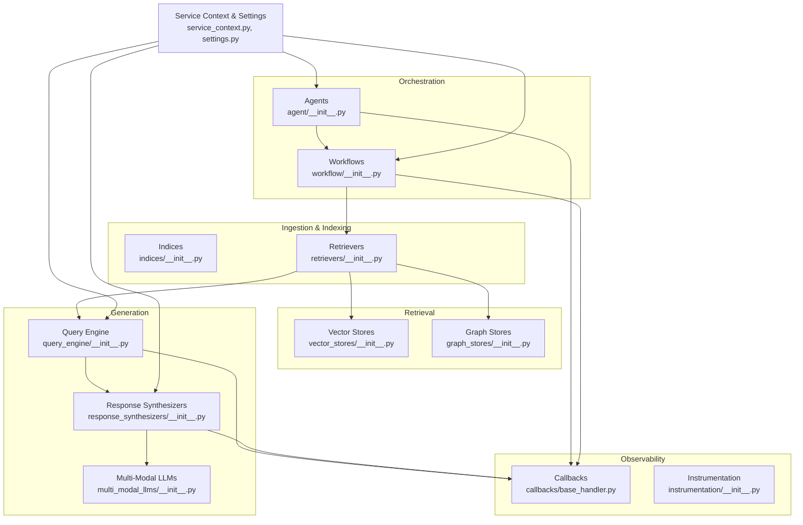
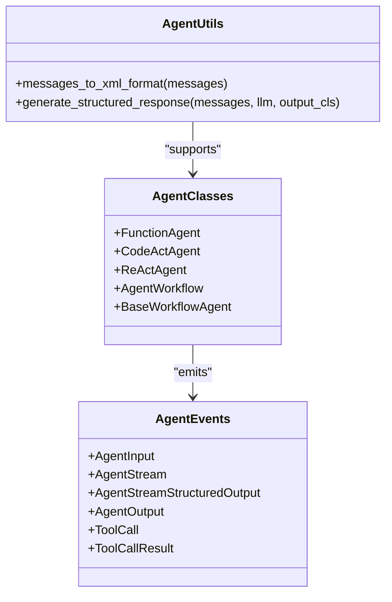
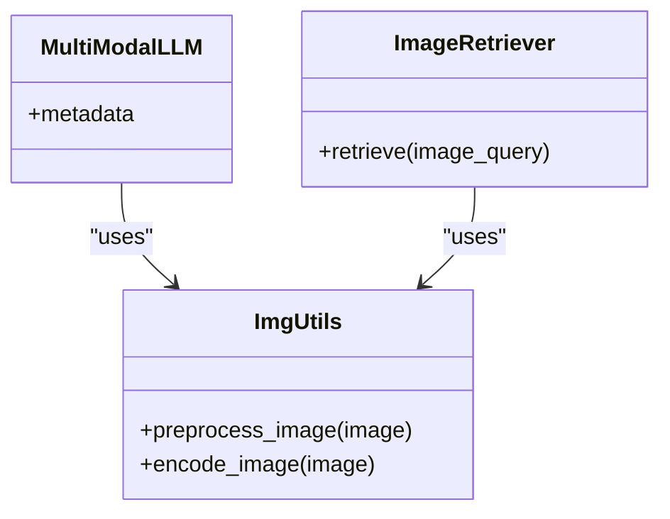
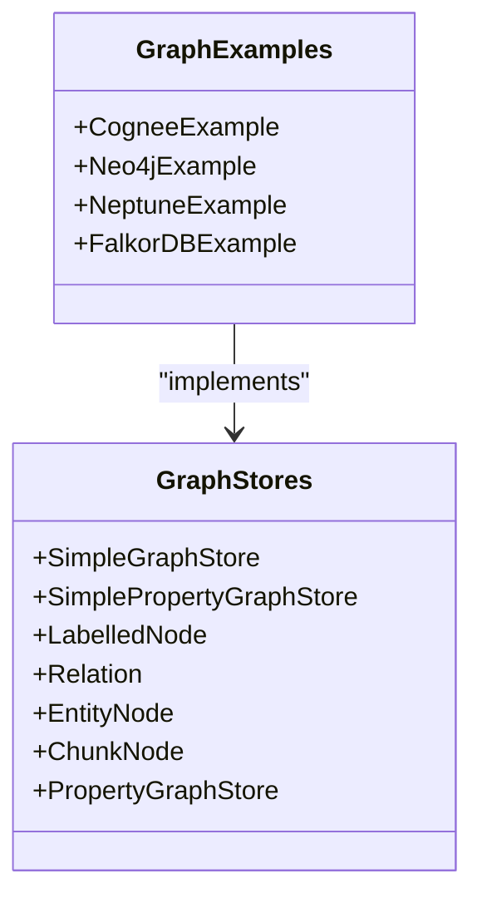
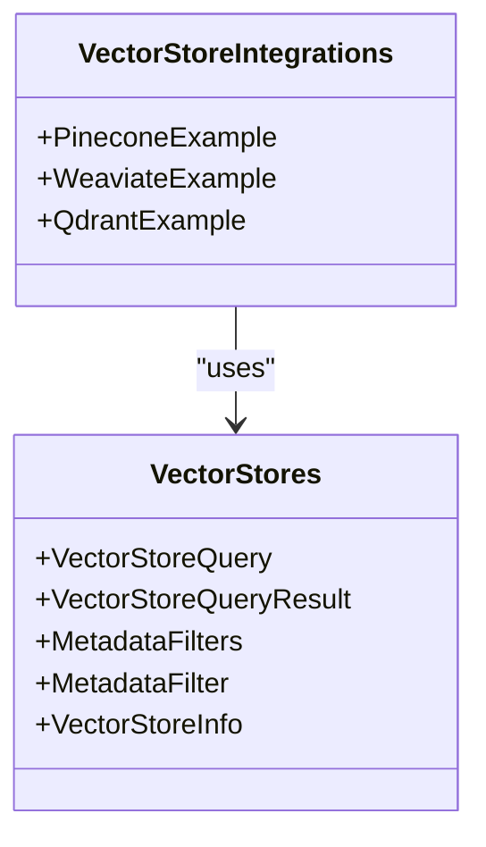
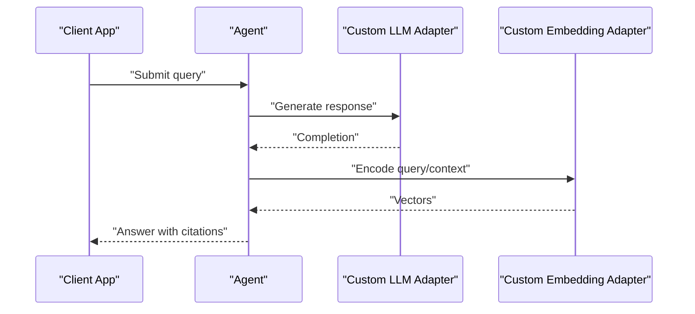
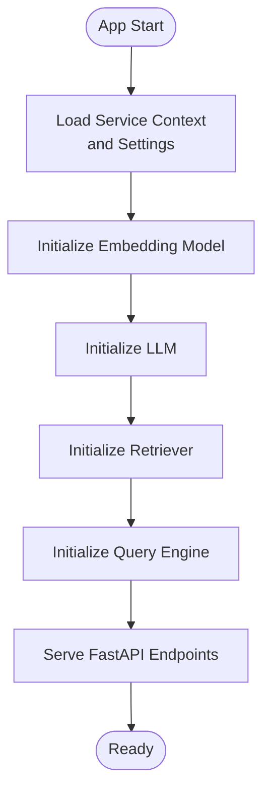
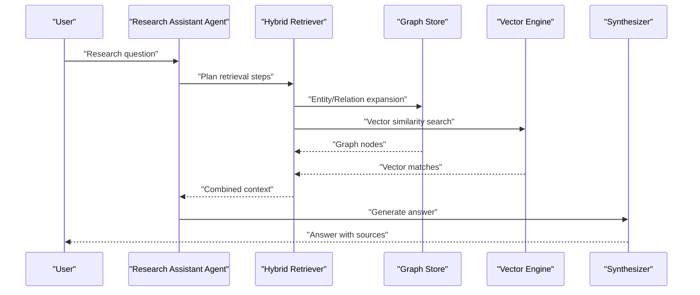
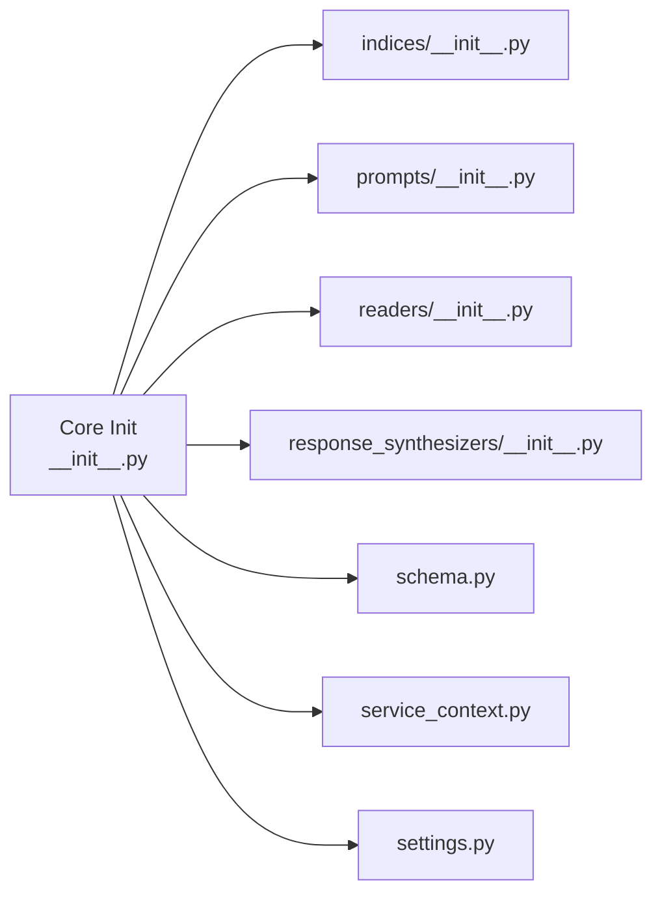

# Advanced Tutorials

<cite>
**Referenced Files in This Document**
- [__init__.py](file://llama-index-core/llama_index/core/__init__.py)
- [agent/__init__.py](file://llama-index-core/llama_index/core/agent/__init__.py)
- [agent/utils.py](file://llama-index-core/llama_index/core/agent/utils.py)
- [multi_modal_llms/__init__.py](file://llama-index-core/llama_index/core/multi_modal_llms/__init__.py)
- [graph_stores/__init__.py](file://llama-index-core/llama_index/core/graph_stores/__init__.py)
- [vector_stores/__init__.py](file://llama-index-core/llama_index/core/vector_stores/__init__.py)
- [workflow/__init__.py](file://llama-index-core/llama_index/core/workflow/__init__.py)
- [chat_engine/__init__.py](file://llama-index-core/llama_index/core/chat_engine/__init__.py)
- [query_engine/__init__.py](file://llama-index-core/llama_index/core/query_engine/__init__.py)
- [retrievers/__init__.py](file://llama-index-core/llama_index/core/retrievers/__init__.py)
- [indices/__init__.py](file://llama-index-core/llama_index/core/indices/__init__.py)
- [embeddings/__init__.py](file://llama-index-core/llama_index/core/embeddings/__init__.py)
- [response_synthesizers/__init__.py](file://llama-index-core/llama_index/core/response_synthesizers/__init__.py)
- [postprocessor/__init__.py](file://llama-index-core/llama_index/core/postprocessor/__init__.py)
- [instrumentation/__init__.py](file://llama-index-core/llama_index/core/instrumentation/__init__.py)
- [callbacks/base_handler.py](file://llama-index-core/llama_index/core/callbacks/base_handler.py)
- [service_context.py](file://llama-index-core/llama_index/core/service_context.py)
- [settings.py](file://llama-index-core/llama_index/core/settings.py)
- [schema.py](file://llama-index-core/llama_index/core/schema.py)
- [types.py](file://llama-index-core/llama_index/core/types.py)
- [image_retriever.py](file://llama-index-core/llama_index/core/image_retriever.py)
- [img_utils.py](file://llama-index-core/llama_index/core/img_utils.py)
- [examples/fastapi_rag_ollama/app.py](file://examples/fastapi_rag_ollama/app.py)
- [examples/fastapi_rag_ollama/requirements.txt](file://examples/fastapi_rag_ollama/requirements.txt)
- [examples/fastapi_rag_ollama/README.md](file://examples/fastapi_rag_ollama/README.md)
- [docs/examples/agent/react_agent_with_query_engine.ipynb](file://docs/examples/agent/react_agent_with_query_engine.ipynb)
- [docs/examples/agent/openai_agent_with_query_engine.ipynb](file://docs/examples/agent/openai_agent_with_query_engine.ipynb)
- [docs/examples/agent/agent_workflow_multi.ipynb](file://docs/examples/agent/agent_workflow_multi.ipynb)
- [docs/examples/agent/custom_multi_agent.ipynb](file://docs/examples/agent/custom_multi_agent.ipynb)
- [docs/examples/agent/code_act_agent.ipynb](file://docs/examples/agent/code_act_agent.ipynb)
- [docs/examples/agent/agent_with_structured_output.ipynb](file://docs/examples/agent/agent_with_structured_output.ipynb)
- [docs/examples/multi_modal/multi_modal_condense_plus_context.ipynb](file://docs/examples/multi_modal/multi_modal_condense_plus_context.ipynb)
- [docs/examples/graph_rag/graph_visualization.html](file://docs/examples/graph_rag/graph_visualization.html)
- [llama-index-integrations/graph_rag/llama-index-graph-rag-cognee/example.py](file://llama-index-integrations/graph_rag/llama-index-graph-rag-cognee/example.py)
- [llama-index-integrations/graph_rag/llama-index-graph-rag-cognee/graph_visualization.html](file://llama-index-integrations/graph_rag/llama-index-graph-rag-cognee/graph_visualization.html)
- [llama-index-integrations/graph_stores/llama-index-graph-stores-neo4j/example.py](file://llama-index-integrations/graph_stores/llama-index-graph-stores-neo4j/example.py)
- [llama-index-integrations/graph_stores/llama-index-graph-stores-neptune/example.py](file://llama-index-integrations/graph_stores/llama-index-graph-stores-neptune/example.py)
- [llama-index-integrations/graph_stores/llama-index-graph-stores-falkordb/example.py](file://llama-index-integrations/graph_stores/llama-index-graph-stores-falkordb/example.py)
- [llama-index-integrations/vector_stores/llama-index-vector-stores-pinecone/example.py](file://llama-index-integrations/vector_stores/llama-index-vector-stores-pinecone/example.py)
- [llama-index-integrations/vector_stores/llama-index-vector-stores-weaviate/example.py](file://llama-index-integrations/vector_stores/llama-index-vector-stores-weaviate/example.py)
- [llama-index-integrations/vector_stores/llama-index-vector-stores-qdrant/example.py](file://llama-index-integrations/vector_stores/llama-index-vector-stores-qdrant/example.py)
- [llama-index-integrations/llms/llama-index-llms-ollama/example.py](file://llama-index-integrations/llms/llama-index-llms-ollama/example.py)
- [llama-index-integrations/embeddings/llama-index-embeddings-ollama/example.py](file://llama-index-integrations/embeddings/llama-index-embeddings-ollama/example.py)
- [llama-index-integrations/llms/llama-index-llms-openai/example.py](file://llama-index-integrations/llms/llama-index-llms-openai/example.py)
- [llama-index-integrations/embeddings/llama-index-embeddings-openai/example.py](file://llama-index-integrations/embeddings/llama-index-embeddings-openai/example.py)
- [llama-index-integrations/llms/llama-index-llms-bedrock/example.py](file://llama-index-integrations/llms/llama-index-llms-bedrock/example.py)
- [llama-index-integrations/embeddings/llama-index-embeddings-bedrock/example.py](file://llama-index-integrations/embeddings/llama-index-embeddings-bedrock/example.py)
- [llama-index-integrations/llms/llama-index-llms-gemini/example.py](file://llama-index-integrations/llms/llama-index-llms-gemini/example.py)
- [llama-index-integrations/embeddings/llama-index-embeddings-gemini/example.py](file://llama-index-integrations/embeddings/llama-index-embeddings-gemini/example.py)
- [llama-index-integrations/llms/llama-index-llms-anthropic/example.py](file://llama-index-integrations/llms/llama-index-llms-anthropic/example.py)
- [llama-index-integrations/embeddings/llama-index-embeddings-anthropic/example.py](file://llama-index-integrations/embeddings/llama-index-embeddings-anthropic/example.py)
- [llama-index-integrations/llms/llama-index-llms-vllm/example.py](file://llama-index-integrations/llms/llama-index-llms-vllm/example.py)
- [llama-index-integrations/embeddings/llama-index-embeddings-vllm/example.py](file://llama-index-integrations/embeddings/llama-index-embeddings-vllm/example.py)
- [llama-index-integrations/llms/llama-index-llms-vertex/example.py](file://llama-index-integrations/llms/llama-index-llms-vertex/example.py)
- [llama-index-integrations/embeddings/llama-index-embeddings-vertex/example.py](file://llama-index-integrations/embeddings/llama-index-embeddings-vertex/example.py)
- [llama-index-integrations/llms/llama-index-llms-azure-openai/example.py](file://llama-index-integrations/llms/llama-index-llms-azure-openai/example.py)
- [llama-index-integrations/embeddings/llama-index-embeddings-azure-openai/example.py](file://llama-index-integrations/embeddings/llama-index-embeddings-azure-openai/example.py)
- [llama-index-integrations/llms/llama-index-llms-azure-inference/example.py](file://llama-index-integrations/llms/llama-index-llms-azure-inference/example.py)
- [llama-index-integrations/embeddings/llama-index-embeddings-azure-inference/example.py](file://llama-index-integrations/embeddings/llama-index-embeddings-azure-inference/example.py)
- [llama-index-integrations/llms/llama-index-llms-llamafile/example.py](file://llama-index-integrations/llms/llama-index-llms-llamafile/example.py)
- [llama-index-integrations/embeddings/llama-index-embeddings-llamafile/example.py](file://llama-index-integrations/embeddings/llama-index-embeddings-llamafile/example.py)
- [llama-index-integrations/llms/llama-index-llms-litellm/example.py](file://llama-index-integrations/llms/llama-index-llms-litellm/example.py)
- [llama-index-integrations/embeddings/llama-index-embeddings-litellm/example.py](file://llama-index-integrations/embeddings/llama-index-embeddings-litellm/example.py)
- [llama-index-integrations/llms/llama-index-llms-huggingface/example.py](file://llama-index-integrations/llms/llama-index-llms-huggingface/example.py)
- [llama-index-integrations/embeddings/llama-index-embeddings-huggingface/example.py](file://llama-index-integrations/embeddings/llama-index-embeddings-huggingface/example.py)
- [llama-index-integrations/llms/llama-index-llms-ollama/README.md](file://llama-index-integrations/llms/llama-index-llms-ollama/README.md)
- [llama-index-integrations/embeddings/llama-index-embeddings-ollama/README.md](file://llama-index-integrations/embeddings/llama-index-embeddings-ollama/README.md)
- [llama-index-integrations/llms/llama-index-llms-openai/README.md](file://llama-index-integrations/llms/llama-index-llms-openai/README.md)
- [llama-index-integrations/embeddings/llama-index-embeddings-openai/README.md](file://llama-index-integrations/embeddings/llama-index-embeddings-openai/README.md)
- [llama-index-integrations/llms/llama-index-llms-bedrock/README.md](file://llama-index-integrations/llms/llama-index-llms-bedrock/README.md)
- [llama-index-integrations/embeddings/llama-index-embeddings-bedrock/README.md](file://llama-index-integrations/embeddings/llama-index-embeddings-bedrock/README.md)
- [llama-index-integrations/llms/llama-index-llms-gemini/README.md](file://llama-index-integrations/llms/llama-index-llms-gemini/README.md)
- [llama-index-integrations/embeddings/llama-index-embeddings-gemini/README.md](file://llama-index-integrations/embeddings/llama-index-embeddings-gemini/README.md)
- [llama-index-integrations/llms/llama-index-llms-anthropic/README.md](file://llama-index-integrations/llms/llama-index-llms-anthropic/README.md)
- [llama-index-integrations/embeddings/llama-index-embeddings-anthropic/README.md](file://llama-index-integrations/embeddings/llama-index-embeddings-anthropic/README.md)
- [llama-index-integrations/llms/llama-index-llms-vllm/README.md](file://llama-index-integrations/llms/llama-index-llms-vllm/README.md)
- [llama-index-integrations/embeddings/llama-index-embeddings-vllm/README.md](file://llama-index-integrations/embeddings/llama-index-embeddings-vllm/README.md)
- [llama-index-integrations/llms/llama-index-llms-vertex/README.md](file://llama-index-integrations/llms/llama-index-llms-vertex/README.md)
- [llama-index-integrations/embeddings/llama-index-embeddings-vertex/README.md](file://llama-index-integrations/embeddings/llama-index-embeddings-vertex/README.md)
- [llama-index-integrations/llms/llama-index-llms-azure-openai/README.md](file://llama-index-integrations/llms/llama-index-llms-azure-openai/README.md)
- [llama-index-integrations/embeddings/llama-index-embeddings-azure-openai/README.md](file://llama-index-integrations/embeddings/llama-index-embeddings-azure-openai/README.md)
- [llama-index-integrations/llms/llama-index-llms-azure-inference/README.md](file://llama-index-integrations/llms/llama-index-llms-azure-inference/README.md)
- [llama-index-integrations/embeddings/llama-index-embeddings-azure-inference/README.md](file://llama-index-integrations/embeddings/llama-index-embeddings-azure-inference/README.md)
- [llama-index-integrations/llms/llama-index-llms-llamafile/README.md](file://llama-index-integrations/llms/llama-index-llms-llamafile/README.md)
- [llama-index-integrations/embeddings/llama-index-embeddings-llamafile/README.md](file://llama-index-integrations/embeddings/llama-index-embeddings-llamafile/README.md)
- [llama-index-integrations/llms/llama-index-llms-litellm/README.md](file://llama-index-integrations/llms/llama-index-llms-litellm/README.md)
- [llama-index-integrations/embeddings/llama-index-embeddings-litellm/README.md](file://llama-index-integrations/embeddings/llama-index-embeddings-litellm/README.md)
- [llama-index-integrations/llms/llama-index-llms-huggingface/README.md](file://llama-index-integrations/llms/llama-index-llms-huggingface/README.md)
- [llama-index-integrations/embeddings/llama-index-embeddings-huggingface/README.md](file://llama-index-integrations/embeddings/llama-index-embeddings-huggingface/README.md)
</cite>

## Table of Contents
1. [Introduction](#introduction)
2. [Project Structure](#project-structure)
3. [Core Components](#core-components)
4. [Architecture Overview](#architecture-overview)
5. [Detailed Component Analysis](#detailed-component-analysis)
6. [Dependency Analysis](#dependency-analysis)
7. [Performance Considerations](#performance-considerations)
8. [Troubleshooting Guide](#troubleshooting-guide)
9. [Conclusion](#conclusion)
10. [Appendices](#appendices)

## Introduction
This document provides advanced, production-focused tutorials for building complex Retrieval-Augmented Generation (RAG) systems with LlamaIndex. It covers agent-based architectures, planning workflows, multi-modal processing, and graph-based retrieval. You will learn how to design scalable, distributed, and monitored RAG systems, integrate custom LLMs and specialized embedding models, and implement proprietary vector store backends. The content is grounded in the repository’s core modules and curated examples, ensuring practical applicability for enterprise-grade deployments.

## Project Structure
LlamaIndex is organized around modular core packages that enable flexible composition of retrieval, generation, and orchestration components. The top-level initialization aggregates major building blocks, while subpackages encapsulate agents, workflows, multi-modal LLMs, graph stores, vector stores, and instrumentation.

```mermaid
graph TB
A["Core Init<br/>llama_index/core/__init__.py"] --> B["Agent APIs<br/>llama_index/core/agent/__init__.py"]
A --> C["Workflow APIs<br/>llama_index/core/workflow/__init__.py"]
A --> D["Chat Engine APIs<br/>llama_index/core/chat_engine/__init__.py"]
A --> E["Query Engine APIs<br/>llama_index/core/query_engine/__init__.py"]
A --> F["Retriever APIs<br/>llama_index/core/retrievers/__init__.py"]
A --> G["Indices APIs<br/>llama_index/core/indices/__init__.py"]
A --> H["Embeddings APIs<br/>llama_index/core/embeddings/__init__.py"]
A --> I["Response Synthesizers APIs<br/>llama_index/core/response_synthesizers/__init__.py"]
A --> J["Postprocessors APIs<br/>llama_index/core/postprocessor/__init__.py"]
A --> K["Instrumentation APIs<br/>llama_index/core/instrumentation/__init__.py"]
A --> L["Graph Stores APIs<br/>llama_index/core/graph_stores/__init__.py"]
A --> M["Vector Stores APIs<br/>llama_index/core/vector_stores/__init__.py"]
A --> N["Multi-Modal LLMs APIs<br/>llama_index/core/multi_modal_llms/__init__.py"]
```

**Diagram sources**
- [__init__.py](file://llama-index-core/llama_index/core/__init__.py#L1-L162)
- [agent/__init__.py](file://llama-index-core/llama_index/core/agent/__init__.py#L1-L38)
- [workflow/__init__.py](file://llama-index-core/llama_index/core/workflow/__init__.py)
- [chat_engine/__init__.py](file://llama-index-core/llama_index/core/chat_engine/__init__.py)
- [query_engine/__init__.py](file://llama-index-core/llama_index/core/query_engine/__init__.py)
- [retrievers/__init__.py](file://llama-index-core/llama_index/core/retrievers/__init__.py)
- [indices/__init__.py](file://llama-index-core/llama_index/core/indices/__init__.py)
- [embeddings/__init__.py](file://llama-index-core/llama_index/core/embeddings/__init__.py)
- [response_synthesizers/__init__.py](file://llama-index-core/llama_index/core/response_synthesizers/__init__.py)
- [postprocessor/__init__.py](file://llama-index-core/llama_index/core/postprocessor/__init__.py)
- [instrumentation/__init__.py](file://llama-index-core/llama_index/core/instrumentation/__init__.py)
- [graph_stores/__init__.py](file://llama-index-core/llama_index/core/graph_stores/__init__.py#L1-L22)
- [vector_stores/__init__.py](file://llama-index-core/llama_index/core/vector_stores/__init__.py#L1-L28)
- [multi_modal_llms/__init__.py](file://llama-index-core/llama_index/core/multi_modal_llms/__init__.py#L1-L10)

**Section sources**
- [__init__.py](file://llama-index-core/llama_index/core/__init__.py#L1-L162)

## Core Components
This section highlights the foundational components used to build advanced RAG systems.

- Agents and Workflows
  - Provides agent classes and workflow primitives for orchestrating multi-step reasoning and tool use.
  - Includes structured output helpers for robust agent responses.

- Multi-Modal LLMs
  - Exposes MultiModalLLM abstractions to handle text, images, and other modalities.

- Graph Stores
  - Offers typed graph store interfaces and simple implementations for entity/chunk relations.

- Vector Stores
  - Defines query/result types and filters for vector similarity search with metadata filtering.

- Instrumentation and Callbacks
  - Enables tracing, token counting, and global callback handlers for observability.

- Service Context and Settings
  - Centralizes runtime configuration for LLMs, embedders, tokenization, and global defaults.

- Schema and Types
  - Defines core data structures (Documents, QueryBundle) and type aliases used across the stack.

**Section sources**
- [agent/__init__.py](file://llama-index-core/llama_index/core/agent/__init__.py#L1-L38)
- [agent/utils.py](file://llama-index-core/llama_index/core/agent/utils.py#L1-L43)
- [multi_modal_llms/__init__.py](file://llama-index-core/llama_index/core/multi_modal_llms/__init__.py#L1-L10)
- [graph_stores/__init__.py](file://llama-index-core/llama_index/core/graph_stores/__init__.py#L1-L22)
- [vector_stores/__init__.py](file://llama-index-core/llama_index/core/vector_stores/__init__.py#L1-L28)
- [instrumentation/__init__.py](file://llama-index-core/llama_index/core/instrumentation/__init__.py)
- [callbacks/base_handler.py](file://llama-index-core/llama_index/core/callbacks/base_handler.py)
- [service_context.py](file://llama-index-core/llama_index/core/service_context.py)
- [settings.py](file://llama-index-core/llama_index/core/settings.py)
- [schema.py](file://llama-index-core/llama_index/core/schema.py)
- [types.py](file://llama-index-core/llama_index/core/types.py)

## Architecture Overview
The advanced RAG architecture integrates ingestion, indexing, retrieval, synthesis, and orchestration layers. Agents and workflows plan and execute multi-step actions, while multi-modal and graph-aware components enrich context. Observability and configuration are centralized via instrumentation and service context.

**Diagram sources**
- [indices/__init__.py](file://llama-index-core/llama_index/core/indices/__init__.py)
- [retrievers/__init__.py](file://llama-index-core/llama_index/core/retrievers/__init__.py)
- [vector_stores/__init__.py](file://llama-index-core/llama_index/core/vector_stores/__init__.py#L1-L28)
- [graph_stores/__init__.py](file://llama-index-core/llama_index/core/graph_stores/__init__.py#L1-L22)
- [query_engine/__init__.py](file://llama-index-core/llama_index/core/query_engine/__init__.py)
- [response_synthesizers/__init__.py](file://llama-index-core/llama_index/core/response_synthesizers/__init__.py)
- [multi_modal_llms/__init__.py](file://llama-index-core/llama_index/core/multi_modal_llms/__init__.py#L1-L10)
- [workflow/__init__.py](file://llama-index-core/llama_index/core/workflow/__init__.py)
- [agent/__init__.py](file://llama-index-core/llama_index/core/agent/__init__.py#L1-L38)
- [callbacks/base_handler.py](file://llama-index-core/llama_index/core/callbacks/base_handler.py)
- [instrumentation/__init__.py](file://llama-index-core/llama_index/core/instrumentation/__init__.py)
- [service_context.py](file://llama-index-core/llama_index/core/service_context.py)
- [settings.py](file://llama-index-core/llama_index/core/settings.py)

## Detailed Component Analysis

### Agent-Based Architectures and Planning Workflows
Agents coordinate tool use and multi-step reasoning. Structured output helpers enforce schema compliance for reliable downstream processing.

**Diagram sources**
- [agent/__init__.py](file://llama-index-core/llama_index/core/agent/__init__.py#L1-L38)
- [agent/utils.py](file://llama-index-core/llama_index/core/agent/utils.py#L1-L43)

Practical guidance:
- Use ReAct-style agents for iterative reasoning with external tools.
- Employ CodeAct agents for executable code-based tasks.
- Build multi-agent workflows to distribute planning and execution across specialized agents.
- Enforce structured outputs using XML formatting helpers to ensure deterministic parsing.

**Section sources**
- [agent/__init__.py](file://llama-index-core/llama_index/core/agent/__init__.py#L1-L38)
- [agent/utils.py](file://llama-index-core/llama_index/core/agent/utils.py#L1-L43)

### Multi-Modal Processing
Multi-modal LLMs process heterogeneous inputs (text, images). Image retrieval utilities and multi-modal chat engines support enriched context.

**Diagram sources**
- [multi_modal_llms/__init__.py](file://llama-index-core/llama_index/core/multi_modal_llms/__init__.py#L1-L10)
- [image_retriever.py](file://llama-index-core/llama_index/core/image_retriever.py)
- [img_utils.py](file://llama-index-core/llama_index/core/img_utils.py)

Practical guidance:
- Integrate image encoders and pre-processing pipelines to normalize inputs.
- Combine text and image retrieval using hybrid retrievers.
- Use multi-modal chat engines for contextual summarization and synthesis.

**Section sources**
- [multi_modal_llms/__init__.py](file://llama-index-core/llama_index/core/multi_modal_llms/__init__.py#L1-L10)
- [image_retriever.py](file://llama-index-core/llama_index/core/image_retriever.py)
- [img_utils.py](file://llama-index-core/llama_index/core/img_utils.py)

### Graph-Based Retrieval
Graph stores model entities and relations, enabling semantic traversal and explainable retrieval.

**Diagram sources**
- [graph_stores/__init__.py](file://llama-index-core/llama_index/core/graph_stores/__init__.py#L1-L22)
- [llama-index-integrations/graph_rag/llama-index-graph-rag-cognee/example.py](file://llama-index-integrations/graph_rag/llama-index-graph-rag-cognee/example.py)
- [llama-index-integrations/graph_stores/llama-index-graph-stores-neo4j/example.py](file://llama-index-integrations/graph_stores/llama-index-graph-stores-neo4j/example.py)
- [llama-index-integrations/graph_stores/llama-index-graph-stores-neptune/example.py](file://llama-index-integrations/graph_stores/llama-index-graph-stores-neptune/example.py)
- [llama-index-integrations/graph_stores/llama-index-graph-stores-falkordb/example.py](file://llama-index-integrations/graph_stores/llama-index-graph-stores-falkordb/example.py)

Practical guidance:
- Model domain knowledge as property graphs with entities and relations.
- Use graph traversals to expand retrieval context dynamically.
- Visualize graph structures to debug and explain retrieval paths.

**Section sources**
- [graph_stores/__init__.py](file://llama-index-core/llama_index/core/graph_stores/__init__.py#L1-L22)
- [docs/examples/graph_rag/graph_visualization.html](file://docs/examples/graph_rag/graph_visualization.html)
- [llama-index-integrations/graph_rag/llama-index-graph-rag-cognee/graph_visualization.html](file://llama-index-integrations/graph_rag/llama-index-graph-rag-cognee/graph_visualization.html)

### Vector Store Integrations and Proprietary Backends
Vector stores define query semantics and filters. Integrations demonstrate Pinecone, Weaviate, Qdrant, and others.

**Diagram sources**
- [vector_stores/__init__.py](file://llama-index-core/llama_index/core/vector_stores/__init__.py#L1-L28)
- [llama-index-integrations/vector_stores/llama-index-vector-stores-pinecone/example.py](file://llama-index-integrations/vector_stores/llama-index-vector-stores-pinecone/example.py)
- [llama-index-integrations/vector_stores/llama-index-vector-stores-weaviate/example.py](file://llama-index-integrations/vector_stores/llama-index-vector-stores-weaviate/example.py)
- [llama-index-integrations/vector_stores/llama-index-vector-stores-qdrant/example.py](file://llama-index-integrations/vector_stores/llama-index-vector-stores-qdrant/example.py)

Practical guidance:
- Implement custom vector store adapters by conforming to the query/result interfaces.
- Use metadata filters to segment and gate retrieval by source, time, or taxonomy.
- Optimize batch upserts and queries for throughput; tune distance metrics and index parameters.

**Section sources**
- [vector_stores/__init__.py](file://llama-index-core/llama_index/core/vector_stores/__init__.py#L1-L28)

### Custom LLM and Embedding Integrations
Extend LlamaIndex with custom LLMs and embeddings via dedicated integration packages. Examples include Ollama, OpenAI, Bedrock, Gemini, Anthropic, vLLM, Vertex, Azure OpenAI/AI Gateway, Azure Inference, Llamafile, LiteLLM, and HuggingFace.

**Diagram sources**
- [agent/__init__.py](file://llama-index-core/llama_index/core/agent/__init__.py#L1-L38)
- [llama-index-integrations/llms/llama-index-llms-ollama/example.py](file://llama-index-integrations/llms/llama-index-llms-ollama/example.py)
- [llama-index-integrations/embeddings/llama-index-embeddings-ollama/example.py](file://llama-index-integrations/embeddings/llama-index-embeddings-ollama/example.py)
- [llama-index-integrations/llms/llama-index-llms-openai/example.py](file://llama-index-integrations/llama-index-llms-llms-openai/example.py)
- [llama-index-integrations/embeddings/llama-index-embeddings-openai/example.py](file://llama-index-integrations/embeddings/llama-index-embeddings-openai/example.py)
- [llama-index-integrations/llms/llama-index-llms-bedrock/example.py](file://llama-index-integrations/llms/llama-index-llms-bedrock/example.py)
- [llama-index-integrations/embeddings/llama-index-embeddings-bedrock/example.py](file://llama-index-integrations/embeddings/llama-index-embeddings-bedrock/example.py)
- [llama-index-integrations/llms/llama-index-llms-gemini/example.py](file://llama-index-integrations/llms/llama-index-llms-gemini/example.py)
- [llama-index-integrations/embeddings/llama-index-embeddings-gemini/example.py](file://llama-index-integrations/embeddings/llama-index-embeddings-gemini/example.py)
- [llama-index-integrations/llms/llama-index-llms-anthropic/example.py](file://llama-index-integrations/llms/llama-index-llms-anthropic/example.py)
- [llama-index-integrations/embeddings/llama-index-embeddings-anthropic/example.py](file://llama-index-integrations/embeddings/llama-index-embeddings-anthropic/example.py)
- [llama-index-integrations/llms/llama-index-llms-vllm/example.py](file://llama-index-integrations/llms/llama-index-llms-vllm/example.py)
- [llama-index-integrations/embeddings/llama-index-embeddings-vllm/example.py](file://llama-index-integrations/embeddings/llama-index-embeddings-vllm/example.py)
- [llama-index-integrations/llms/llama-index-llms-vertex/example.py](file://llama-index-integrations/llms/llama-index-llms-vertex/example.py)
- [llama-index-integrations/embeddings/llama-index-embeddings-vertex/example.py](file://llama-index-integrations/embeddings/llama-index-embeddings-vertex/example.py)
- [llama-index-integrations/llms/llama-index-llms-azure-openai/example.py](file://llama-index-integrations/llms/llama-index-llms-azure-openai/example.py)
- [llama-index-integrations/embeddings/llama-index-embeddings-azure-openai/example.py](file://llama-index-integrations/embeddings/llama-index-embeddings-azure-openai/example.py)
- [llama-index-integrations/llms/llama-index-llms-azure-inference/example.py](file://llama-index-integrations/llms/llama-index-llms-azure-inference/example.py)
- [llama-index-integrations/embeddings/llama-index-embeddings-azure-inference/example.py](file://llama-index-integrations/embeddings/llama-index-embeddings-azure-inference/example.py)
- [llama-index-integrations/llms/llama-index-llms-llamafile/example.py](file://llama-index-integrations/llms/llama-index-llms-llamafile/example.py)
- [llama-index-integrations/embeddings/llama-index-embeddings-llamafile/example.py](file://llama-index-integrations/embeddings/llama-index-embeddings-llamafile/example.py)
- [llama-index-integrations/llms/llama-index-llms-litellm/example.py](file://llama-index-integrations/llms/llama-index-llms-litellm/example.py)
- [llama-index-integrations/embeddings/llama-index-embeddings-litellm/example.py](file://llama-index-integrations/embeddings/llama-index-embeddings-litellm/example.py)
- [llama-index-integrations/llms/llama-index-llms-huggingface/example.py](file://llama-index-integrations/llms/llama-index-llms-huggingface/example.py)
- [llama-index-integrations/embeddings/llama-index-embeddings-huggingface/example.py](file://llama-index-integrations/embeddings/llama-index-embeddings-huggingface/example.py)

**Section sources**
- [agent/__init__.py](file://llama-index-core/llama_index/core/agent/__init__.py#L1-L38)

### Production-Ready Deployments and Example Apps
A FastAPI-based deployment demonstrates a production-ready RAG server using local LLMs and embeddings.

**Diagram sources**
- [examples/fastapi_rag_ollama/app.py](file://examples/fastapi_rag_ollama/app.py)
- [examples/fastapi_rag_ollama/requirements.txt](file://examples/fastapi_rag_ollama/requirements.txt)
- [examples/fastapi_rag_ollama/README.md](file://examples/fastapi_rag_ollama/README.md)

**Section sources**
- [examples/fastapi_rag_ollama/app.py](file://examples/fastapi_rag_ollama/app.py)
- [examples/fastapi_rag_ollama/requirements.txt](file://examples/fastapi_rag_ollama/requirements.txt)
- [examples/fastapi_rag_ollama/README.md](file://examples/fastapi_rag_ollama/README.md)

### Enterprise-Scale Patterns and Examples
Explore curated notebooks and integrations for advanced scenarios:
- Agent workflows with multi-document research and structured outputs.
- Multi-modal retrieval with image condensing and context fusion.
- Graph-based retrieval with visualization and traversal.

**Diagram sources**
- [docs/examples/agent/agent_workflow_multi.ipynb](file://docs/examples/agent/agent_workflow_multi.ipynb)
- [docs/examples/agent/custom_multi_agent.ipynb](file://docs/examples/agent/custom_multi_agent.ipynb)
- [docs/examples/agent/code_act_agent.ipynb](file://docs/examples/agent/code_act_agent.ipynb)
- [docs/examples/agent/agent_with_structured_output.ipynb](file://docs/examples/agent/agent_with_structured_output.ipynb)
- [docs/examples/multi_modal/multi_modal_condense_plus_context.ipynb](file://docs/examples/multi_modal/multi_modal_condense_plus_context.ipynb)
- [docs/examples/graph_rag/graph_visualization.html](file://docs/examples/graph_rag/graph_visualization.html)

**Section sources**
- [docs/examples/agent/agent_workflow_multi.ipynb](file://docs/examples/agent/agent_workflow_multi.ipynb)
- [docs/examples/agent/custom_multi_agent.ipynb](file://docs/examples/agent/custom_multi_agent.ipynb)
- [docs/examples/agent/code_act_agent.ipynb](file://docs/examples/agent/code_act_agent.ipynb)
- [docs/examples/agent/agent_with_structured_output.ipynb](file://docs/examples/agent/agent_with_structured_output.ipynb)
- [docs/examples/multi_modal/multi_modal_condense_plus_context.ipynb](file://docs/examples/multi_modal/multi_modal_condense_plus_context.ipynb)
- [docs/examples/graph_rag/graph_visualization.html](file://docs/examples/graph_rag/graph_visualization.html)

## Dependency Analysis
The core module exports a curated set of APIs that downstream components depend on. These include indices, prompts, readers, response synthesizers, schema, service context, and settings. This design promotes loose coupling and extensibility.

**Diagram sources**
- [__init__.py](file://llama-index-core/llama_index/core/__init__.py#L59-L87)

**Section sources**
- [__init__.py](file://llama-index-core/llama_index/core/__init__.py#L59-L87)

## Performance Considerations
- Token budgeting and prompt helper usage to fit within model limits.
- Batch operations for embeddings and vector upserts.
- Metadata filtering to reduce candidate sets.
- Asynchronous processing for LLM calls and retrievals.
- Caching and memoization for repeated queries.
- Monitoring token usage and latency via instrumentation.

[No sources needed since this section provides general guidance]

## Troubleshooting Guide
- Use global callback handlers and instrumentation to capture traces and errors.
- Validate structured outputs with XML formatting helpers to detect schema mismatches early.
- Inspect ServiceContext configuration for LLM and embedder mismatches.
- Verify vector store filters and index parameters for retrieval accuracy.

**Section sources**
- [callbacks/base_handler.py](file://llama-index-core/llama_index/core/callbacks/base_handler.py)
- [instrumentation/__init__.py](file://llama-index-core/llama_index/core/instrumentation/__init__.py)
- [agent/utils.py](file://llama-index-core/llama_index/core/agent/utils.py#L1-L43)
- [service_context.py](file://llama-index-core/llama_index/core/service_context.py)

## Conclusion
By composing agents, workflows, multi-modal and graph-aware retrieval, and robust instrumentation, you can build enterprise-grade RAG systems. Extend LlamaIndex with custom LLMs, embeddings, and vector stores to meet specialized needs, and adopt the patterns and examples in this document to achieve scalability, reliability, and maintainability.

[No sources needed since this section summarizes without analyzing specific files]

## Appendices
- Example notebooks and integrations provide runnable patterns for agents, multi-modal retrieval, and graph-based RAG.
- Integration READMEs document provider-specific setup and usage.

**Section sources**
- [docs/examples/agent/react_agent_with_query_engine.ipynb](file://docs/examples/agent/react_agent_with_query_engine.ipynb)
- [docs/examples/agent/openai_agent_with_query_engine.ipynb](file://docs/examples/agent/openai_agent_with_query_engine.ipynb)
- [llama-index-integrations/llms/llama-index-llms-ollama/README.md](file://llama-index-integrations/llms/llama-index-llms-ollama/README.md)
- [llama-index-integrations/embeddings/llama-index-embeddings-ollama/README.md](file://llama-index-integrations/embeddings/llama-index-embeddings-ollama/README.md)
- [llama-index-integrations/llms/llama-index-llms-openai/README.md](file://llama-index-integrations/llms/llama-index-llms-openai/README.md)
- [llama-index-integrations/embeddings/llama-index-embeddings-openai/README.md](file://llama-index-integrations/embeddings/llama-index-embeddings-openai/README.md)
- [llama-index-integrations/llms/llama-index-llms-bedrock/README.md](file://llama-index-integrations/llms/llama-index-llms-bedrock/README.md)
- [llama-index-integrations/embeddings/llama-index-embeddings-bedrock/README.md](file://llama-index-integrations/embeddings/llama-index-embeddings-bedrock/README.md)
- [llama-index-integrations/llms/llama-index-llms-gemini/README.md](file://llama-index-integrations/llms/llama-index-llms-gemini/README.md)
- [llama-index-integrations/embeddings/llama-index-embeddings-gemini/README.md](file://llama-index-integrations/embeddings/llama-index-embeddings-gemini/README.md)
- [llama-index-integrations/llms/llama-index-llms-anthropic/README.md](file://llama-index-integrations/llms/llama-index-llms-anthropic/README.md)
- [llama-index-integrations/embeddings/llama-index-embeddings-anthropic/README.md](file://llama-index-integrations/embeddings/llama-index-embeddings-anthropic/README.md)
- [llama-index-integrations/llms/llama-index-llms-vllm/README.md](file://llama-index-integrations/llms/llama-index-llms-vllm/README.md)
- [llama-index-integrations/embeddings/llama-index-embeddings-vllm/README.md](file://llama-index-integrations/embeddings/llama-index-embeddings-vllm/README.md)
- [llama-index-integrations/llms/llama-index-llms-vertex/README.md](file://llama-index-integrations/llms/llama-index-llms-vertex/README.md)
- [llama-index-integrations/embeddings/llama-index-embeddings-vertex/README.md](file://llama-index-integrations/embeddings/llama-index-embeddings-vertex/README.md)
- [llama-index-integrations/llms/llama-index-llms-azure-openai/README.md](file://llama-index-integrations/llms/llama-index-llms-azure-openai/README.md)
- [llama-index-integrations/embeddings/llama-index-embeddings-azure-openai/README.md](file://llama-index-integrations/embeddings/llama-index-embeddings-azure-openai/README.md)
- [llama-index-integrations/llms/llama-index-llms-azure-inference/README.md](file://llama-index-integrations/llms/llama-index-llms-azure-inference/README.md)
- [llama-index-integrations/embeddings/llama-index-embeddings-azure-inference/README.md](file://llama-index-integrations/embeddings/llama-index-embeddings-azure-inference/README.md)
- [llama-index-integrations/llms/llama-index-llms-llamafile/README.md](file://llama-index-integrations/llms/llama-index-llms-llamafile/README.md)
- [llama-index-integrations/embeddings/llama-index-embeddings-llamafile/README.md](file://llama-index-integrations/embeddings/llama-index-embeddings-llamafile/README.md)
- [llama-index-integrations/llms/llama-index-llms-litellm/README.md](file://llama-index-integrations/llms/llama-index-llms-litellm/README.md)
- [llama-index-integrations/embeddings/llama-index-embeddings-litellm/README.md](file://llama-index-integrations/embeddings/llama-index-embeddings-litellm/README.md)
- [llama-index-integrations/llms/llama-index-llms-huggingface/README.md](file://llama-index-integrations/llms/llama-index-llms-huggingface/README.md)
- [llama-index-integrations/embeddings/llama-index-embeddings-huggingface/README.md](file://llama-index-integrations/embeddings/llama-index-embeddings-huggingface/README.md)